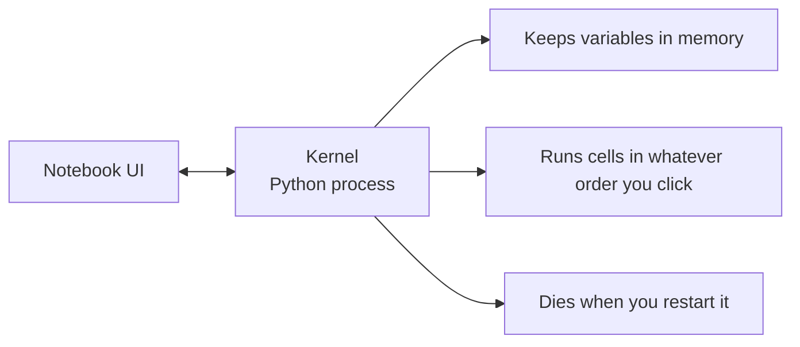

# Jupyter笔记本

> 笔记本电脑是人工智能工程的实验平台。你先在这里制作原型，然后把可行的东西投入生产。

**Type:** Build
**Languages:** Python
**Prerequisites:** Phase 0, Lesson 01
**Time:** ~30 minutes

## 学习目标

- 安装并启动JupyterLab， Jupyter Notebook或vscode与Jupyter扩展
- 使用魔法命令(
- 区分何时使用笔记本和脚本，并应用“在笔记本中探索，在脚本中发布”的工作流程
- 识别并避免常见的笔记本陷阱：乱序执行、隐藏状态和内存泄漏

## 这个问题

每一篇人工智能论文、教程和Kaggle比赛都使用Jupyter笔记本。它们允许您分段运行代码，查看内联输出，将代码与解释混合在一起，并且可以快速迭代。如果你不使用笔记本学习人工智能，你就是在不使用草稿纸做数学作业。

但笔记本确实有陷阱。人们用它来做任何事情，包括他们不擅长的事情。知道什么时候使用笔记本，什么时候使用脚本将使您避免以后的调试噩梦。

## 这个概念

笔记本是一个单元格列表。每个单元格要么是代码，要么是文本。

“‘mermaid
图道明
A["**Markdown Cell**\n# My Experiment\nTesting learning rate 0.01"] - b> B["**Code Cell**►Run\nmodel.fit(X, y, lr=0.01)\n- \nOutput: loss = 0.342"]
B——> C["**代码单元格***►运行\nplt。plot(losses)\n—\nOutput: inline plot"]
```

The kernel is a Python process running in the background. When you run a cell, it sends the code to the kernel, which executes it and sends back the result. All cells share the same kernel, so variables persist between cells.



“无论你按什么顺序”的部分既是超级大国，也是步兵。

## 构建它

### 步骤1：选择界面

三个选项，一种格式：

| Interface | Install | Best for |
|-----------|---------|----------|
| JupyterLab | `pip install jupyterlab` then `jupyter lab` | Full IDE experience, multiple tabs, file browser, terminal |
| Jupyter Notebook | `pip install notebook` then `jupyter notebook` | Simple, lightweight, one notebook at a time |
| VS Code | Install "Jupyter" extension | Already in your editor, git integration, debugging |

三个人读和写的都一样随便挑你喜欢的。JupyterLab是人工智能工作中最常见的。

”“bash
PIP安装jupyterlab
jupyter实验室
```

### Step 2: Keyboard shortcuts that matter

You operate in two modes. Press `Escape` for command mode (blue bar on the left), `Enter` for edit mode (green bar).

**Command mode (most used):**

| Key | Action |
|-----|--------|
| `Shift+Enter` | Run cell, move to next |
| `A` | Insert cell above |
| `B` | Insert cell below |
| `DD` | Delete cell |
| `M` | Convert to markdown |
| `Y` | Convert to code |
| `Z` | Undo cell operation |
| `Ctrl+Shift+H` | Show all shortcuts |

**Edit mode:**

| Key | Action |
|-----|--------|
| `Tab` | Autocomplete |
| `Shift+Tab` | Show function signature |
| `Ctrl+/` | Toggle comment |

`Shift+Enter` is the one you'll use a thousand times a day. Learn it first.

### Step 3: Cell types

**Code cells** run Python and show the output:

```python
import numpy as np
data = np.random.randn(1000)
data.mean(), data.std()
```

输出:

**标记单元格**呈现格式化文本。用它们来记录你在做什么和为什么。支持标题，粗体，斜体，LaTeX数学(

### 步骤4：魔法命令

这些不是Python。它们是木星特有的命令，以

**编写代码的时间：**

’”“蟒蛇
% timeit np.random.randn(一万)
```

Output: `45.2 us +/- 1.3 us per loop`

```python
%%time
model.fit(X_train, y_train, epochs=10)
```

输出:

`%%time` runs it once. 使用

**启用内联绘图：**

”“python
% matplotlib内联
```

Every `plt.plot()` or `plt.show()` now renders directly in the notebook.

**Install packages without leaving the notebook:**

```python
!pip install scikit-learn
```

The

**检查环境变量：**

”“python
% env CUDA_VISIBLE_DEVICES
```

### Step 5: Display rich output inline

Notebooks auto-display the last expression in a cell. But you can control it:

```python
import pandas as pd

df = pd.DataFrame({
    "model": ["Linear", "Random Forest", "Neural Net"],
    "accuracy": [0.72, 0.89, 0.94],
    "training_time": [0.1, 2.3, 45.6]
})
df
```

这将呈现一个格式化的HTML表，而不是文本转储。情节也是如此：

”“python
进口matplotlib。Pyplot为PLT

plt.figure (figsize = (8,4))
plt。图（[1,2,3,4],[1,4,2,3]）
plt。标题(“内联阴谋”)
plt.show ()
```

The plot appears right below the cell. This is why notebooks dominate AI work. You see the data, the plot, and the code together.

For images:

```python
from IPython.display import Image, display
display(Image(filename="architecture.png"))
```

### 第六步：喝可乐

Colab是一款免费的木星云端笔记本。它提供了一个GPU、预安装的库和谷歌Drive集成。不需要设置。

1. 登录[colab.research.google.com]（https://colab.research.google.com）
2. 上传任意
3. 运行时>更改运行时类型> T4 GPU（免费）

与本地木星的Colab差异：
- 文件在会话之间不持久（保存到驱动器或下载）
- 预安装：numpy， pandas, matplotlib, torch, tensorflow, sklearn
- 
- 
- 90分钟不活动后会话超时（免费层）

## 使用它

### 笔记本与脚本：何时使用哪一个

| Use notebooks for | Use scripts for |
|-------------------|-----------------|
| Exploring a dataset | Training pipelines |
| Prototyping a model | Reusable utilities |
| Visualizing results | Anything with `if __name__` |
| Explaining your work | Code that runs on a schedule |
| Quick experiments | Production code |
| Course exercises | Packages and libraries |

规则是：在笔记本中探索，在脚本中发布。

AI中的常见工作流程：
1. 在笔记本中探索数据
2. 在笔记本中制作模型原型
3. 运行成功后，将代码移动到
4. 导入这些

### 常见的陷阱

**无序执行。**运行cell 5，然后cell 2，然后cell 7。笔记本电脑可以在你的机器上工作，但当有人从上到下运行它时，它就坏了。修复：内核>重启和运行所有共享之前。

**隐藏状态。**删除一个单元格，但它创建的变量仍然在内存中。这个笔记本看起来很干净，但它依赖于一个幽灵电池。修复：定期重启内核。

**内存泄漏。**加载4GB数据集，训练模型，加载另一个数据集。没有什么是被释放的。解决办法：

## 船这

这一课产生：
- 

## 练习

1. 打开JupyterLab，创建一个笔记本，并使用
2. 创建一个带有标记单元格和代码单元格的笔记本，用于加载CSV、显示数据框和绘制图表。然后运行Kernel > Restart & run All来验证它从上到下工作
3. 从

## 关键术语

| Term | What people say | What it actually means |
|------|----------------|----------------------|
| Kernel | "The thing running my code" | A separate Python process that executes cells and keeps variables in memory |
| Cell | "A code block" | An independently runnable unit in a notebook, either code or markdown |
| Magic command | "Jupyter tricks" | Special commands prefixed with `%` or `%%` that control the notebook environment |
| `.ipynb` | "Notebook file" | A JSON file containing cells, outputs, and metadata. Stands for IPython Notebook |

## 进一步的阅读

- JupyterLab文档(https://jupyterlab.readthedocs。Io /)获取完整的特性集
- [谷歌Colab FAQ]（https://research.google.com/colaboratory/faq.html）了解Colab特有的限制和特性
- [28 Jupyter Notebook Tips]（https://www.dataquest.io/blog/jupyter-notebook-tips-tricks-shortcuts/）用于高级用户的快捷方式