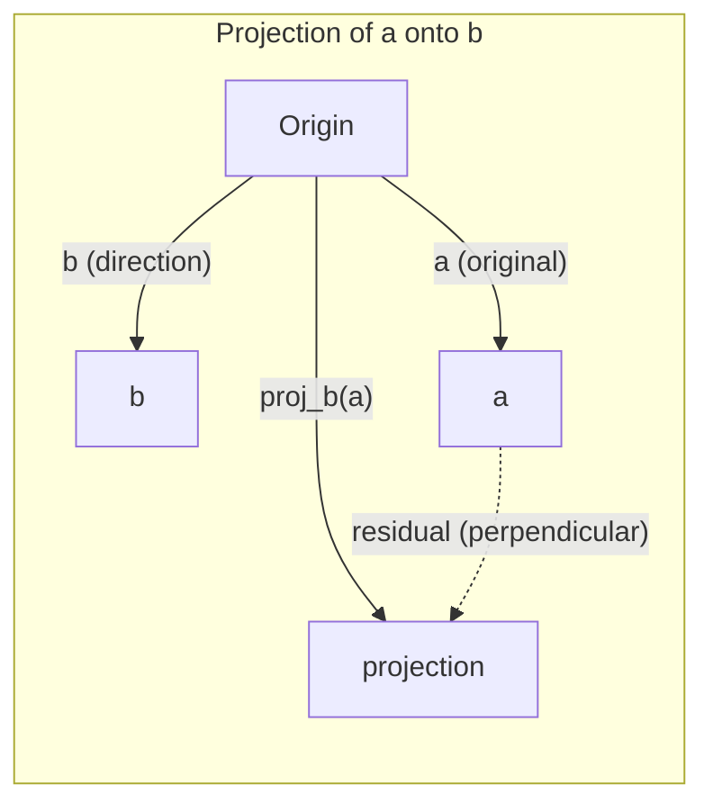

# 线性代数直觉

> 每个人工智能模型都只是戴着一顶漂亮帽子的矩阵数学。

**Type:** Learn
**Languages:** Python, Julia
**Prerequisites:** Phase 0
**Time:** ~60 minutes

## 学习目标

- 在Python中从头开始实现向量和矩阵运算（加法，点积，矩阵乘法）
- 从几何上解释点积、投影和Gram-Schmidt过程的作用
- 确定线性独立性，秩和基的一组向量使用行约简
- 将线性代数概念与它们的人工智能应用联系起来：嵌入、注意力分数和LoRA

## 这个问题

打开任何ML文件。在第一页中，您将看到向量、矩阵、点积和变换。没有线性代数的直觉，这些只是符号。有了它，你可以看到神经网络实际上在做什么——在空间中移动点。

你不需要成为数学家。您需要了解这些操作的几何意义，然后自己编写代码。

## 这个概念

### 向量是点（和方向）

向量就是一串数字。但这些数字是有意义的——它们是空间中的坐标。

**2D矢量[3,2]:**

| x | y | Point |
|---|---|-------|
| 3 | 2 | The vector points from origin (0,0) to (3, 2) on the plane |

向量的大小为√(3^2 + 2^2)=√(13)，并且向上和向右。

在AI中，向量代表一切：
- 一个单词→一个768个数的向量（它在嵌入空间中的“意义”）
- 图像→数百万像素值的矢量
- 用户→偏好向量

### 矩阵是变换

矩阵把一个向量变换成另一个向量。它可以旋转、缩放、拉伸或投影。

“‘mermaid
图LR
子图之前
(“点”)
B(“B”)
结束
子图矩阵〔“矩阵乘法”〕
米(“M(转换)”)
结束
子图后
A2(“点”)
B2(“B”)
结束
A——b>米
B——bbb100米
M——> a2
M——> b2
```

In AI, matrices ARE the model:
- Neural network weights → matrices that transform input into output
- Attention scores → matrices that decide what to focus on
- Embeddings → matrices that map words to vectors

### The Dot Product Measures Similarity

The dot product of two vectors tells you how similar they are.

```
a · b = a₁×b₁ + a₂×b₂ + ... + aₙ×bₙ

方向相同：a·b > 0（相似）
垂直：a·b = 0（无关）
相反方向：a·b < 0（异）
```

This is literally how search engines, recommendation systems, and RAG work -- find vectors with high dot products.

### Linear Independence

Vectors are linearly independent if no vector in the set can be written as a combination of the others. If v1, v2, v3 are independent, they span a 3D space. If one is a combination of the others, they only span a plane.

Why it matters for AI: your feature matrix should have linearly independent columns. If two features are perfectly correlated (linearly dependent), the model cannot distinguish their effects. This causes multicollinearity in regression -- the weight matrix becomes unstable, and small input changes produce wild output swings.

**Concrete example:**

```
V1 = [1,0,0]
V2 = [0,1,0]
V3 = [2,1,0] # V3 = 2*v1 + v2
```

v1 and v2 are independent -- neither is a scalar multiple or combination of the other. But v3 = 2*v1 + v2, so {v1, v2, v3} is a dependent set. These three vectors all lie in the xy-plane. No matter how you combine them, you cannot reach [0, 0, 1]. You have three vectors but only two dimensions of freedom.

In a dataset: if feature_3 = 2*feature_1 + feature_2, adding feature_3 gives the model zero new information. Worse, it makes the normal equations singular -- there is no unique solution for the weights.

### Basis and Rank

A basis is a minimal set of linearly independent vectors that span the entire space. The number of basis vectors is the dimension of the space.

The standard basis for 3D space is {[1,0,0], [0,1,0], [0,0,1]}. But any three independent vectors in 3D form a valid basis. The choice of basis is a choice of coordinate system.

Rank of a matrix = number of linearly independent columns = number of linearly independent rows. If rank < min(rows, cols), the matrix is rank-deficient. This means:
- The system has infinitely many solutions (or none)
- Information is lost in the transformation
- The matrix cannot be inverted

| Situation | Rank | What it means for ML |
|-----------|------|---------------------|
| Full rank (rank = min(m, n)) | Maximum possible | Unique least-squares solution exists. Model is well-conditioned. |
| Rank deficient (rank < min(m, n)) | Below maximum | Features are redundant. Infinitely many weight solutions. Regularization needed. |
| Rank 1 | 1 | Every column is a scaled copy of one vector. All data lies on a line. |
| Near rank-deficient (small singular values) | Numerically low | Matrix is ill-conditioned. Tiny input noise causes large output changes. Use SVD truncation or ridge regression. |

### Projection

Projecting vector **a** onto vector **b** gives the component of **a** in the direction of **b**:

```
Proj_b (a) = (a·b / b·b) * b
```

The residual (a - proj_b(a)) is perpendicular to b. This orthogonal decomposition is the foundation of least-squares fitting.

Projection is everywhere in ML:
- Linear regression minimizes the distance from observations to the column space -- the solution IS a projection
- PCA projects data onto the directions of maximum variance
- Attention in transformers computes projections of queries onto keys



*示例：** a = [3,4], b = [1,0]

proj_b (a) = (3 * 1 + 4 * 0) / (1 * 1 + 0 * 0) * (1,0) = 3 * [1,0] = [3,0]

投影减去y分量。这是最简单的降维形式——扔掉你不关心的方向。

### gram - schmidt过程

将任意一组独立向量转换成一组标准正交基。标准正交意味着每个向量的长度为1并且每个向量对都是垂直的。

该算法:
1. 取第一个向量，将它归一化
2. 取第二个向量，减去它在第一个向量上的投影，归一化
3. 取第三个向量，减去它在之前所有向量上的投影，归一化
4. 重复剩余的载体

```
Input:  v1, v2, v3, ... (linearly independent)

u1 = v1 / |v1|

w2 = v2 - (v2 dot u1) * u1
u2 = w2 / |w2|

w3 = v3 - (v3 dot u1) * u1 - (v3 dot u2) * u2
u3 = w3 / |w3|

Output: u1, u2, u3, ... (orthonormal basis)
```

这就是QR分解的内部工作原理。Q是标准正交基，R表示投影系数。QR分解用于：
- 求解线性系统（比高斯消去法更稳定）
- 计算特征值（QR算法）
- 最小二乘回归（标准数值方法）

## 构建它

### 步骤1:vector from scratch （Python）

”“python
类向量:
Def __init__(self, components)：
Self.components = list（组件）
自我。Dim = len（self.components）

Def __add__(self, other)：
return Vector（[a + b for a, b in zip(self.components, other.components)]）

Def __sub__(self, other)：
return Vector（[a - b for a, b in zip(self.components, other.components)]）

Def dot(self, other)：
返回sum（a * b for a, b in zip(self.components, other.components)）

def级(自我):
返回sum(x**2 for x in self.components) ** 0.5

def正常化(自我):
Mag = self.magnitude（）
return Vector（[x / mag for x in self.components]）

Def cosine_similarity(self, other)：
回归自我。点（其他）/（自己）。Magnitude （) * other.magnitude()）

def __repr__(自我):
返回f”向量({self.components})”


a = Vector（[1,2,3]）
b = Vector（[4,5,6]）

Print （f"a + b = {a + b}"）
Print （f"a·b = {a.dot(b)}"）
Print （f"| = {a.magnitude():.4f}"）
Print （f“余弦相似度= {a.cosine_similarity(b):.4f}”）
```

### Step 2: Matrices from scratch (Python)

```python
class Matrix:
    def __init__(self, rows):
        self.rows = [list(row) for row in rows]
        self.shape = (len(self.rows), len(self.rows[0]))

    def __matmul__(self, other):
        if isinstance(other, Vector):
            return Vector([
                sum(self.rows[i][j] * other.components[j] for j in range(self.shape[1]))
                for i in range(self.shape[0])
            ])
        rows = []
        for i in range(self.shape[0]):
            row = []
            for j in range(other.shape[1]):
                row.append(sum(
                    self.rows[i][k] * other.rows[k][j]
                    for k in range(self.shape[1])
                ))
            rows.append(row)
        return Matrix(rows)

    def transpose(self):
        return Matrix([
            [self.rows[j][i] for j in range(self.shape[0])]
            for i in range(self.shape[1])
        ])

    def __repr__(self):
        return f"Matrix({self.rows})"


rotation_90 = Matrix([[0, -1], [1, 0]])
point = Vector([3, 1])

rotated = rotation_90 @ point
print(f"Original: {point}")
print(f"Rotated 90°: {rotated}")
```

### 步骤3：为什么这对AI很重要

”“python
进口随机

random.seed (42)
权重=矩阵([[random.]高斯（0,0.1）for _ in range(3)] for _ in range(2)]
input_vector = Vector（[1.0, 0.5, -0.3]）

输出=权重@ input_vector
print（f"Input (3D): {input_vector}"）
print（f"Output (2D): {Output}"）
print（“这就是神经网络层做的——矩阵乘法。”）
```

### Step 4: Julia version

```julia
a = [1.0, 2.0, 3.0]
b = [4.0, 5.0, 6.0]

println("a + b = ", a + b)
println("a · b = ", a ⋅ b)       # Julia supports unicode operators
println("|a| = ", √(a ⋅ a))
println("cosine = ", (a ⋅ b) / (√(a ⋅ a) * √(b ⋅ b)))

# Matrix-vector multiplication
W = [0.1 -0.2 0.3; 0.4 0.5 -0.1]
x = [1.0, 0.5, -0.3]
println("Wx = ", W * x)
println("This is a neural network layer.")
```

### 步骤5：从头开始线性独立和投影（Python）

”“python
def is_linearly_independent(向量):
N = len（vector）
Dim = len（向量[0].components）
矩阵（[v.components[:] for v in vectors]）
Rows = [row[:] for row in mat.rows]
等级= 0
对于范围内的冷（暗）：
pivot =无
对于range（rank, len(rows)）中的行：
如果abs(rows[row][col]) > 1e10：
Pivot = row
打破
如果pivot为None：
继续
Rows [rank], Rows [pivot] = Rows [pivot], Rows [rank]
Scale = rows[rank][col]
Rows [rank] = [x / scale for x in Rows [rank]]
对于range（len(rows)）中的行：
如果行！= rank and abs（rows[row][col]）
Factor = rows[row][col]
Rows [row] = [Rows [row][j] - factor * Rows [rank][j]
等级+= 1
返回rank == n


Def project(a, b)：
标量= a.dot(b) / b.dot(b)
return Vector（[scalar * x for x in b.components]）


def gram_schmidt(向量):
正交的= []
对于向量中的v：
W = v
对于正交中的u：
项目j =项目（w, u）
W = W -项目
如果w.magnitude() < 1e-10：
继续
orthonormal.append (w.normalize ())
回归正交


v1 = Vector（[1,0,0]）
v2 = Vector（[1,1,0]）
v3 = Vector（[1,1,1]）
Basis = gram_schmidt（[v1, v2, v3]）
对于i， u在enumerate（basis）中：
Print （f"u{i+1} = {u}"）
Print （f" |u{i+1}| = {u.magnitude():.6f}"）

print(f"u1 · u2 = {basis[0].dot(basis[1]):.6f}")
print(f"u1 · u3 = {basis[0].dot(basis[2]):.6f}")
print(f"u2 · u3 = {basis[1].dot(basis[2]):.6f}")
```

## Use It

Now the same thing with NumPy -- what you'll actually use in practice:

```python
import numpy as np

a = np.array([1, 2, 3], dtype=float)
b = np.array([4, 5, 6], dtype=float)

print(f"a + b = {a + b}")
print(f"a · b = {np.dot(a, b)}")
print(f"|a| = {np.linalg.norm(a):.4f}")
print(f"cosine = {np.dot(a, b) / (np.linalg.norm(a) * np.linalg.norm(b)):.4f}")

W = np.random.randn(2, 3) * 0.1
x = np.array([1.0, 0.5, -0.3])
print(f"Wx = {W @ x}")
```

### 秩，投影和QR与NumPy

”“python
import numpy as np

A = np。Array （[[1,2], [2,4]]）
打印(f”排名:{np.linalg.matrix_rank (A)}”)

A = np。阵列([3,4])
B = np。阵列((1,0))
Proj = (np)。点(a, b) / np。点（b, b）) * b
print（f" {a}到{b}的投影：{proj}"）

Q, R = np. linag .qr(np.random；3) randn (3)
print(f"Q是正交的：{np。allclose(Q @ Q. t, np.eye(3))}")
print(f"R是上三角形：{np。allclose (R, np.triu (R))}”)
```

### PyTorch -- Tensors Are Vectors with Autodiff

```python
import torch

x = torch.randn(3, requires_grad=True)
y = torch.tensor([1.0, 0.0, 0.0])

similarity = torch.dot(x, y)
similarity.backward()

print(f"x = {x.data}")
print(f"y = {y.data}")
print(f"dot product = {similarity.item():.4f}")
print(f"d(dot)/dx = {x.grad}")
```

点积关于x的梯度就是y。PyTorch会自动计算这个。神经网络中的每一个操作都是由这样的操作构建的——矩阵乘法、点积、投影——以及通过所有这些操作的自动差跟踪梯度。

您只需在一行中从头开始构建NumPy所做的工作。现在你知道发生了什么了吧。

## 船这

这一课产生：
- 

## 连接

本课中的所有内容都与现代AI的特定部分有关：

| Concept | Where it shows up |
|---------|------------------|
| Dot product | Attention scores in transformers, cosine similarity in RAG |
| Matrix multiply | Every neural network layer, every linear transformation |
| Linear independence | Feature selection, avoiding multicollinearity |
| Rank | Determining if a system is solvable, LoRA (low-rank adaptation) |
| Projection | Linear regression (projecting onto column space), PCA |
| Gram-Schmidt / QR | Numerical solvers, eigenvalue computation |
| Orthonormal basis | Stable numerical computation, whitening transforms |

LoRA值得特别提及。它通过将权重更新分解为低秩矩阵来微调大型语言模型。LoRA更新的不是4096x4096权重矩阵（16M个参数），而是两个大小分别为4096x16和16x4096的矩阵（131K个参数）。rank-16约束意味着LoRA假定权重更新存在于完整4096维空间的16维子空间中。这是线性代数在做实际的工作。

## 练习

1. 实施
2. 创建一个二维缩放矩阵，x坐标加倍，y坐标三倍，然后将其应用于向量[1,1]
3. 给定5个随机的类词向量（维数50），使用余弦相似度找出最相似的两个
4. 验证Gram-Schmidt输出是真正的标准正交：检查每个对的点积为0，每个向量的大小为1
5. 创建一个秩为2的3 × 3矩阵。使用然后解释这些列所跨越的几何对象。
6. 将向量[1,2,3]投影到[1,1,1]上。这个结果在几何上代表什么？

## 关键术语

| Term | What people say | What it actually means |
|------|----------------|----------------------|
| Vector | "An arrow" | A list of numbers representing a point or direction in n-dimensional space |
| Matrix | "A table of numbers" | A transformation that maps vectors from one space to another |
| Dot product | "Multiply and sum" | A measure of how aligned two vectors are -- the core of similarity search |
| Embedding | "Some AI magic" | A vector that represents the meaning of something (word, image, user) |
| Linear independence | "They don't overlap" | No vector in the set can be written as a combination of the others |
| Rank | "How many dimensions" | The number of linearly independent columns (or rows) in a matrix |
| Projection | "The shadow" | The component of one vector in the direction of another |
| Basis | "The coordinate axes" | A minimal set of independent vectors that span the space |
| Orthonormal | "Perpendicular unit vectors" | Vectors that are mutually perpendicular and each have length 1 |