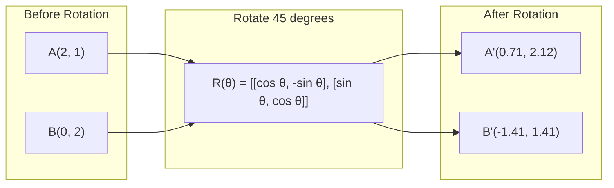
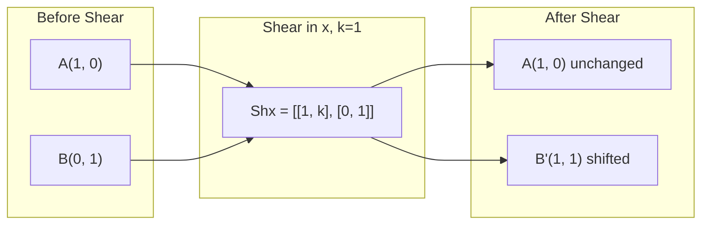
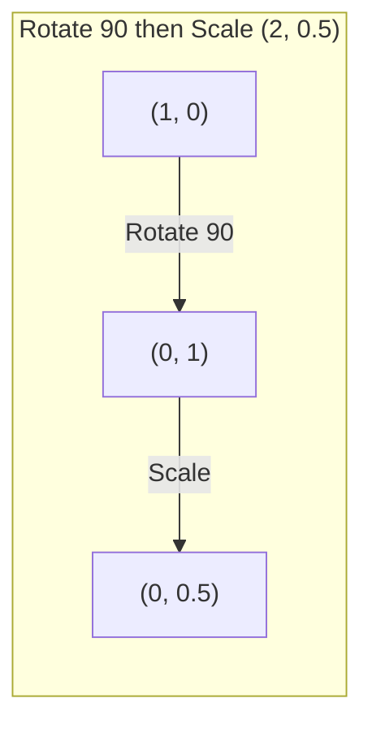

# 矩阵的转换

> 矩阵是一种重塑空间的机器。了解它对每个点的作用，你就能理解整个变换。

**Type:** Build
**Languages:** Python, Julia
**Prerequisites:** Phase 1, Lessons 01-02 (Linear Algebra Intuition, Vectors & Matrices Operations)
**Time:** ~75 minutes

## 学习目标

- 构造旋转、缩放、剪切和反射矩阵，并将它们应用于2D和3D点
- 通过矩阵乘法组合多个变换，并验证顺序是否重要
- 由特征方程计算2x2矩阵的特征值和特征向量
- 解释为什么特征值决定主成分分析方向、RNN稳定性和谱聚类行为

## 这个问题

你读过PCA，看到“找到协方差矩阵的特征向量”你读到模型稳定性，看“检查所有特征值的大小是否小于1 ”你会读到数据增强，看到“应用随机旋转”。在你理解矩阵对空间的几何作用之前，这些都没有意义。

矩阵不仅仅是数字的网格。它们是空间机器。旋转矩阵旋转点。缩放矩阵扩展它们。一个剪切矩阵使它们倾斜。神经网络应用于数据的每一个转换都是这些操作中的一个或它们的组合。本课使这些操作具体化。

## 这个概念

### 作为矩阵的变换

二维中的每一个线性变换都可以写成2x2矩阵。矩阵告诉你基向量[1,0]和[0,1]的确切位置。其他一切都随之而来。

“‘美人鱼
图LR
在[“标准基准”]之前的子图
E1 [“ E1 =[1,0]（沿x）”]
E2 [“ E2 =[0,1]（沿y）”]
结束
子图变换[“矩阵M”]
M[“M =列是新的基向量”]
结束
子图After["After Transformation M"]
E1p ["e1' = new x- base "]
E2p ["e2' = new y-basis"]
结束
e1—> M—> e1p
e2 -> M -> - e2p
```

### Rotation

A 2D rotation by angle theta keeps distances and angles intact. It moves every point along a circular arc.



在3D中，你绕着一个轴旋转。每个轴都有自己的旋转矩阵：

```
Rz(theta) = | cos  -sin  0 |     Rotate around z-axis
            | sin   cos  0 |     (x-y plane spins, z stays)
            |  0     0   1 |

Rx(theta) = | 1   0     0    |   Rotate around x-axis
            | 0  cos  -sin   |   (y-z plane spins, x stays)
            | 0  sin   cos   |

Ry(theta) = |  cos  0  sin |     Rotate around y-axis
            |   0   1   0  |     (x-z plane spins, y stays)
            | -sin  0  cos |
```

### 扩展

缩放沿每个轴独立拉伸或压缩。

“‘美人鱼
图LR
子图Before[“缩放前”]
一个(“(2,1)”)
B(“B(0, 2)”)
结束
子图量表[“量表sx=2, sy=0.5”]
S["S = [[2,0], [0,0.5]]"]
结束
后子图[“后缩放”]
美联社["(0.5 4)”)
英国石油公司(“B(0, 1)”)
结束
A -> S -> Ap
B -> S - >bp
```

### Shearing

Shearing tilts one axis while keeping the other fixed. It turns rectangles into parallelograms.



剪切矩阵:
- Z0
- Z0

### 反射

反射反射出沿轴或直线的点。

“‘美人鱼
图LR
子图前[“反思前”]
一个(“(2,1)”)
结束
子图Reflect[“沿y轴反射”]
R["[[- 1,0], [0,1]]"]
结束
子图后[“反思后”]
美联社(“(2,1)
结束
A -> R -> Ap
```

Reflection matrices:
- Reflect across y-axis: `[[-1, 0], [0, 1]]`
- Reflect across x-axis: `[[1, 0], [0, -1]]`

### Composition: chaining transformations

Applying transformation A then B is the same as multiplying their matrices: `result = B @ A @ point`. Order matters. Rotate then scale gives different results than scale then rotate.



组成:

“‘美人鱼
图LR
subgraph Path2[“缩放（2,0.5）然后旋转90”]
Q1(“(1,0)”)——> | |规模Q2(“(2,0)”)——> |“旋转90”| Q3(“(0,2)”)
结束
```

Composed: `R @ S = [[0, -0.5], [2, 0]]`

Different results. Matrix multiplication is not commutative.

### Eigenvalues and eigenvectors

Most vectors change direction when a matrix hits them. Eigenvectors are special: the matrix only scales them, never rotates them. The scaling factor is the eigenvalue.

```
A @ v = * v

V是特征向量（存在的方向）
是特征值（它拉伸了多少）

例如：A = | 2 1 |
             | 1  2 |

特征向量[1,1]特征值为3：
A @[1,1] =[3,3] = 3 *[1,1]（相同方向，缩放为3）

特征向量[1，-1]特征值为1：
@[1] =[1] = 1 *[1](同一方向不变)
```

The matrix stretches space by 3x along [1, 1] and keeps [1, -1] unchanged. Every other direction is a mix of these two.

### Eigendecomposition

If a matrix has n linearly independent eigenvectors, it can be decomposed:

```
A = v @ d @ v -1

V =列是特征向量的矩阵
D =特征值的对角矩阵
V^(-1) = V的逆

这就是说，旋转成特征向量坐标，沿着每个轴缩放，再旋转回来。
```

### Why eigenvalues matter

**PCA.** The eigenvectors of the covariance matrix are the principal components. The eigenvalues tell you how much variance each component captures. Sort by eigenvalue, keep the top k, and you have dimensionality reduction.

**Stability.** In recurrent networks and dynamical systems, eigenvalues with magnitude > 1 cause outputs to explode. Magnitude < 1 causes them to vanish. This is the vanishing/exploding gradient problem stated in one sentence.

**Spectral methods.** Graph neural networks use eigenvalues of the adjacency matrix. Spectral clustering uses eigenvalues of the Laplacian. The eigenvectors reveal the structure of the graph.

### Determinant as volume scaling factor

The determinant of a transformation matrix tells you how much it scales area (2D) or volume (3D).

```
Det = 1：保留面积（旋转）
Det = 2：面积加倍
Det = 0：空间被压缩到更低的维度（奇异）
Det = -1：面积保留，但方向翻转（反射）

| det(Rotation) | = 1        (always)
| det(Scale sx, sy) | = sx * sy
| det(Shear) | = 1           (area preserved)
| det(Reflection) | = -1     (orientation flipped)
```

## Build It

### Step 1: Transformation matrices from scratch (Python)

```python
import math

def rotation_2d(theta):
    c, s = math.cos(theta), math.sin(theta)
    return [[c, -s], [s, c]]

def scaling_2d(sx, sy):
    return [[sx, 0], [0, sy]]

def shearing_2d(kx, ky):
    return [[1, kx], [ky, 1]]

def reflection_x():
    return [[1, 0], [0, -1]]

def reflection_y():
    return [[-1, 0], [0, 1]]

def mat_vec_mul(matrix, vector):
    return [
        sum(matrix[i][j] * vector[j] for j in range(len(vector)))
        for i in range(len(matrix))
    ]

def mat_mul(a, b):
    rows_a, cols_b = len(a), len(b[0])
    cols_a = len(a[0])
    return [
        [sum(a[i][k] * b[k][j] for k in range(cols_a)) for j in range(cols_b)]
        for i in range(rows_a)
    ]

point = [1.0, 0.0]
angle = math.pi / 4

rotated = mat_vec_mul(rotation_2d(angle), point)
print(f"Rotate (1,0) by 45 deg: ({rotated[0]:.4f}, {rotated[1]:.4f})")

scaled = mat_vec_mul(scaling_2d(2, 3), [1.0, 1.0])
print(f"Scale (1,1) by (2,3): ({scaled[0]:.1f}, {scaled[1]:.1f})")

sheared = mat_vec_mul(shearing_2d(1, 0), [1.0, 1.0])
print(f"Shear (1,1) kx=1: ({sheared[0]:.1f}, {sheared[1]:.1f})")

reflected = mat_vec_mul(reflection_y(), [2.0, 1.0])
print(f"Reflect (2,1) across y: ({reflected[0]:.1f}, {reflected[1]:.1f})")
```

### 步骤2：组合转换

”“python
R = rotation_2d(数学；PI / 2)
S = scaling_2d（2,0.5）

rotate_then_scale = mat_mul（S， R）
scale_then_rotate = mat_mul（R， S）

Point = [1.0, 0.0]
Result1 = mat_vec_mul（rotate_then_scale, point）
Result2 = mat_vec_mul（scale_then_rotate, point）

print(f"旋转90然后缩放：{result1[0]：。2 f}, {result1[1]编写此表达式:.2f})”)
print(f"缩放然后旋转90:{result2[0]：。2 f}, {result2 [1]: .2f})”)
打印(f”一样吗?{result1 == result2}")
```

### Step 3: Eigenvalues from scratch (2x2)

For a 2x2 matrix `[[a, b], [c, d]]`, eigenvalues solve the characteristic equation: `lambda^2 - (a+d)*lambda + (ad - bc) = 0`.

```python
def eigenvalues_2x2(matrix):
    a, b = matrix[0]
    c, d = matrix[1]
    trace = a + d
    det = a * d - b * c
    discriminant = trace ** 2 - 4 * det
    if discriminant < 0:
        real = trace / 2
        imag = (-discriminant) ** 0.5 / 2
        return (complex(real, imag), complex(real, -imag))
    sqrt_disc = discriminant ** 0.5
    return ((trace + sqrt_disc) / 2, (trace - sqrt_disc) / 2)

def eigenvector_2x2(matrix, eigenvalue):
    a, b = matrix[0]
    c, d = matrix[1]
    if abs(b) > 1e-10:
        v = [b, eigenvalue - a]
    elif abs(c) > 1e-10:
        v = [eigenvalue - d, c]
    else:
        if abs(a - eigenvalue) < 1e-10:
            v = [1, 0]
        else:
            v = [0, 1]
    mag = (v[0] ** 2 + v[1] ** 2) ** 0.5
    return [v[0] / mag, v[1] / mag]

A = [[2, 1], [1, 2]]
vals = eigenvalues_2x2(A)
print(f"Matrix: {A}")
print(f"Eigenvalues: {vals[0]:.4f}, {vals[1]:.4f}")

for val in vals:
    vec = eigenvector_2x2(A, val)
    result = mat_vec_mul(A, vec)
    scaled = [val * vec[0], val * vec[1]]
    print(f"  lambda={val:.1f}, v={[round(x,4) for x in vec]}")
    print(f"    A@v = {[round(x,4) for x in result]}")
    print(f"    l*v = {[round(x,4) for x in scaled]}")
```

### 步骤4：行列式作为体积缩放因子

”“python
def det_2x2(矩阵):
返回矩阵[0][0]*矩阵[1][1]-矩阵[0][1]*矩阵[1][0]

Print (f"det（rotation 45) = {det_2x2(rotation_2d(math.pi/4)):.4f}"）
打印(f“(2,3)= {det_2x2 (scaling_2d(2、3)):.1f}”)
打印(f“(剪切kx = 1) = {det_2x2 (shearing_2d (1,0)): .1f}”)
Print (f"det（reflect y) = {det_2x2(reflection_y()):.1f}"）

单数= [[1,2],[2,4]]
Print （f"det（单数）= {det_2x2（单数）：.1f}"）
print（“单数：列成比例，空格缩成一行。”）
```

## Use It

NumPy handles all of this with optimized routines.

```python
import numpy as np

theta = np.pi / 4
R = np.array([[np.cos(theta), -np.sin(theta)],
              [np.sin(theta),  np.cos(theta)]])

point = np.array([1.0, 0.0])
print(f"Rotate (1,0) by 45 deg: {R @ point}")

S = np.diag([2.0, 3.0])
composed = S @ R
print(f"Scale(2,3) after Rotate(45): {composed @ point}")

A = np.array([[2, 1], [1, 2]], dtype=float)
eigenvalues, eigenvectors = np.linalg.eig(A)
print(f"\nEigenvalues: {eigenvalues}")
print(f"Eigenvectors (columns):\n{eigenvectors}")

for i in range(len(eigenvalues)):
    v = eigenvectors[:, i]
    lam = eigenvalues[i]
    print(f"  A @ v{i} = {A @ v}, lambda * v{i} = {lam * v}")

print(f"\ndet(R) = {np.linalg.det(R):.4f}")
print(f"det(S) = {np.linalg.det(S):.1f}")

B = np.array([[3, 1], [0, 2]], dtype=float)
vals, vecs = np.linalg.eig(B)
D = np.diag(vals)
V = vecs
reconstructed = V @ D @ np.linalg.inv(V)
print(f"\nEigendecomposition A = V @ D @ V^-1:")
print(f"Original:\n{B}")
print(f"Reconstructed:\n{reconstructed}")
```

### 3D旋转与NumPy

”“python
def rotation_3d_z(θ):
C, s = np。cosθ,np.sin(θ)
返回np。Array （[[c, -s, 0], [s, c, 0], [0, 0, 1]）

def rotation_3d_x(θ):
C, s = np。cosθ,np.sin(θ)
返回np。Array （[[1,0,0], [0, c, -s], [0, s, c]]）

Point_3d = np.array（[1.0, 0.0, 0.0]）
Rotated_z = rotation_3d_z(np；PI / 2) @ point_3d
Rotated_x = rotation_3d_x(np；PI / 2) @ point_3d

print（f"\n3D point: {point_3d}"）
绕z旋转90度：{np；轮(rotated_z 4)}”)
绕x旋转90度：{np；轮(rotated_x 4)}”)
```

## Ship It

This lesson builds the geometric foundation for PCA (Phase 2) and neural network weight analysis. The eigenvalue/eigenvector code built here is the same algorithm that powers dimensionality reduction, spectral clustering, and stability analysis in production ML systems.

## Exercises

1. Apply rotation, scaling, and shearing to a unit square (corners at [0,0], [1,0], [1,1], [0,1]). Print the transformed corners for each. Verify that rotation preserves distances between corners.

2. Find the eigenvalues of the matrix [[4, 2], [1, 3]] by hand using the characteristic equation. Then verify with your from-scratch function and with NumPy.

3. Create a composition of three transformations (rotate 30 degrees, scale by [1.5, 0.8], shear with kx=0.3) and apply it to 8 points arranged in a circle. Print before and after coordinates. Compute the determinant of the composed matrix and verify it equals the product of the individual determinants.

## Key Terms

| Term | What people say | What it actually means |
|------|----------------|----------------------|
| Rotation matrix | "Spins things" | An orthogonal matrix that moves points along circular arcs while preserving distances and angles. Determinant is always 1. |
| Scaling matrix | "Makes things bigger" | A diagonal matrix that stretches or compresses independently along each axis. Determinant is the product of scale factors. |
| Shearing matrix | "Slants things" | A matrix that shifts one coordinate proportionally to another, turning rectangles into parallelograms. Determinant is 1. |
| Reflection | "Mirrors things" | A matrix that flips space across an axis or plane. Determinant is -1. |
| Composition | "Do two things" | Multiplying transformation matrices to chain operations. Order matters: B @ A means apply A first, then B. |
| Eigenvector | "Special direction" | A direction that the matrix only scales, never rotates. The transformation's fingerprint. |
| Eigenvalue | "How much it stretches" | The scalar factor by which the matrix scales its eigenvector. Can be negative (flip) or complex (rotation). |
| Eigendecomposition | "Break the matrix apart" | Writing a matrix as V @ D @ V^(-1), separating it into its fundamental scaling directions and magnitudes. |
| Determinant | "A single number from a matrix" | The factor by which the transformation scales area (2D) or volume (3D). Zero means the transformation is irreversible. |
| Characteristic equation | "Where eigenvalues come from" | det(A - lambda * I) = 0. The polynomial whose roots are the eigenvalues. |

## Further Reading

- [3Blue1Brown: Linear Transformations](https://www.3blue1brown.com/lessons/linear-transformations) -- visual intuition for how matrices reshape space
- [3Blue1Brown: Eigenvectors and Eigenvalues](https://www.3blue1brown.com/lessons/eigenvalues) -- the best visual explanation of what eigenvectors mean geometrically
- [MIT 18.06 Lecture 21: Eigenvalues and Eigenvectors](https://ocw.mit.edu/courses/18-06-linear-algebra-spring-2010/) -- Gilbert Strang's classic treatment