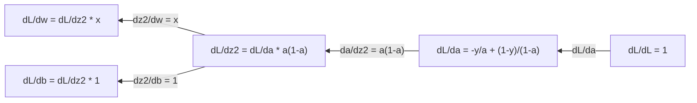
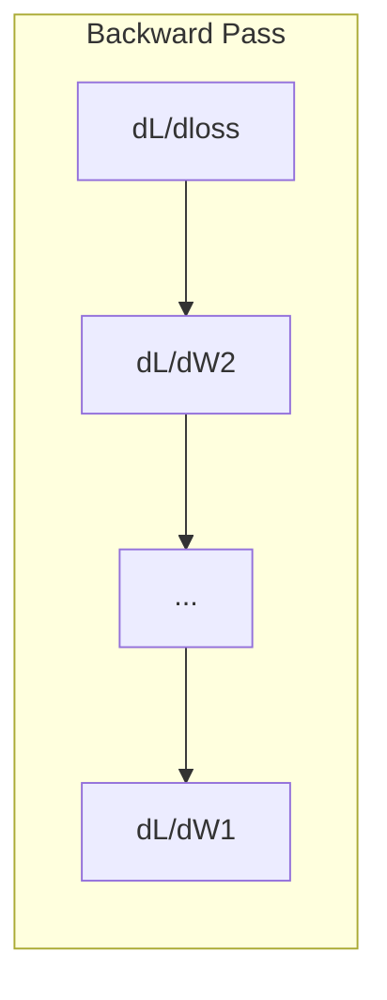

# 机器学习中的微积分

> 导数告诉你哪条路是下坡。这就是神经网络需要学习的全部内容。

**Type:** Learn
**Language:** Python
**Prerequisites:** Phase 1, Lessons 01-03
**Time:** ~60 minutes

## 学习目标

- 计算常见ML函数（x^2, sigmoid，交叉熵）的数值和解析导数
- 从头开始实现梯度下降，以最小化1D和2D中的损失函数
- 推导线性回归模型的梯度，并通过手动权重更新对其进行训练
- 解释黑森矩阵，泰勒级数近似，以及它们与优化方法的联系

## 这个问题

你有一个有数百万权重的神经网络。每个砝码都是一个旋钮。你需要弄清楚转动每个旋钮的方向，使模型的误差稍微小一些。微积分给出了这个方向。

如果没有微积分，训练神经网络就意味着尝试随机变化，并希望得到最好的结果。有了导数，你就知道每个权重是如何影响误差的。你每次都按正确的方式转动每个旋钮。

## 这个概念

### 什么是导数？

导数测量的是变化率。对于函数y = f(x) f'(x)的导数告诉你如果x移动一点点，y会改变多少？

从几何上讲，导数是切线在某一点处的斜率。

**f(x) = x^2:**

| x | f(x) | f'(x) (slope) |
|---|------|---------------|
| 0 | 0    | 0 (flat, at the bottom) |
| 1 | 1    | 2 |
| 2 | 4    | 4 (tangent line slope at this point) |
| 3 | 9    | 6 |

x=2时，斜率为4。如果x向右移动一点，y就会增加4倍。在x=0处，斜率为0。你在碗底。

正式定义：

```
f'(x) = lim   f(x + h) - f(x)
        h->0  -----------------
                     h
```

在代码中，你跳过极限只用一个很小的h，这是数值导数。

### 偏导数：一次一个变量

实函数有很多输入。神经网络的损失取决于成千上万的权重。偏导数保持所有变量不变，除了一个，然后对它求导。

```
f(x, y) = x^2 + 3xy + y^2

df/dx = 2x + 3y     (treat y as a constant)
df/dy = 3x + 2y     (treat x as a constant)
```

每个偏导数都回答：如果我只推这一个权值，损失是如何变化的？

### 梯度：所有偏导数的向量

梯度将所有偏导数集合成一个向量。对于函数f(x, y, z)，梯度为：

```
grad f = [ df/dx, df/dy, df/dz ]
```

坡度指向上升最陡的方向。要最小化一个函数，就往相反的方向去做。

** f(x,y) = x^2 + y^2等高线图：**

函数形成一个以同心圆为等高线的碗形。最小值在（0,0）处。

| Point | grad f | -grad f (descent direction) |
|-------|--------|----------------------------|
| (1, 1) | [2, 2] (points uphill, away from minimum) | [-2, -2] (points downhill, toward minimum) |
| (0, 0) | [0, 0] (flat, at the minimum) | [0, 0] |

这是一张梯度下降图。计算梯度，求反，再走一步。

### 与优化的联系

训练神经网络就是优化。你有一个损失函数L（w1, w2，…）来衡量模型的错误程度。你想要最小化它。

```
Gradient descent update rule:

  w_new = w_old - learning_rate * dL/dw

For every weight:
  1. Compute the partial derivative of loss with respect to that weight
  2. Subtract a small multiple of it from the weight
  3. Repeat
```

学习率控制步长。太大了，你就过头了。太小，你会爬。

**损耗图（1D切片）：**

随着权值w的变化，损失函数L(w)形成了一条有峰有谷的曲线。

| Feature | Description |
|---------|-------------|
| Global minimum | The lowest point on the entire curve -- the best solution |
| Local minimum | A valley that is lower than its neighbors but not the lowest overall |
| Slope | Gradient descent follows the slope downhill from any starting point |

斜坡下坡后是梯度下降。它可能会陷入局部最小值，但在高维空间（数百万个权重）中，这很少是一个实际问题。

### 数值导数与解析导数

有两种计算导数的方法。

分析型：手工应用微积分规则。对于f(x) = x^2，导数是f'(x) = 2x。精确。快。

数值：近似使用定义。计算f（x+h）和f（x-h）对于一个很小的h，然后使用差值。

```
Numerical (central difference):

f'(x) ~= f(x + h) - f(x - h)
          -----------------------
                  2h

h = 0.0001 works well in practice
```

数值导数比较慢，但对任何函数都有效。解析导数很快，但需要推导公式。神经网络框架使用第三种方法：自动微分，它机械地计算精确的导数。你会在第三阶段看到。

### 简单函数的手工求导

这些是你会在ML中反复看到的导数。

```
Function        Derivative       Used in
--------        ----------       -------
f(x) = x^2     f'(x) = 2x      Loss functions (MSE)
f(x) = wx + b  f'(w) = x        Linear layer (gradient w.r.t. weight)
                f'(b) = 1        Linear layer (gradient w.r.t. bias)
                f'(x) = w        Linear layer (gradient w.r.t. input)
f(x) = e^x     f'(x) = e^x     Softmax, attention
f(x) = ln(x)   f'(x) = 1/x     Cross-entropy loss
f(x) = 1/(1+e^-x)  f'(x) = f(x)(1-f(x))   Sigmoid activation
```

对于f(x) = x^2：

```
f(x) = x^2    f'(x) = 2x

  x    f(x)   f'(x)   meaning
  -2    4      -4      slope tilts left (decreasing)
  -1    1      -2      slope tilts left (decreasing)
   0    0       0      flat (minimum!)
   1    1       2      slope tilts right (increasing)
   2    4       4      slope tilts right (increasing)
```

当f(w) = wx + b, x=3, b=1时：

```
f(w) = 3w + 1    f'(w) = 3

The derivative with respect to w is just x.
If x is big, a small change in w causes a big change in output.
```

### 链式法则

当组成函数时，链式法则告诉你如何求导。

```
If y = f(g(x)), then dy/dx = f'(g(x)) * g'(x)

Example: y = (3x + 1)^2
  outer: f(u) = u^2       f'(u) = 2u
  inner: g(x) = 3x + 1    g'(x) = 3
  dy/dx = 2(3x + 1) * 3 = 6(3x + 1)
```

神经网络是函数链：输入->线性->激活->线性->激活->损失。反向传播是从输出到输入反复应用的链式法则。这就是整个算法。

### 黑森矩阵

梯度告诉你斜率。黑森函数告诉你曲率。

黑森矩阵是二阶偏导数的矩阵。对于函数f（x1, x2，…）， xn)，黑森表项（i, j）为：

```
H[i][j] = d^2f / (dx_i * dx_j)
```

对于2变量函数f(x, y)：

```
H = | d^2f/dx^2    d^2f/dxdy |
    | d^2f/dydx    d^2f/dy^2 |
```

*在一个临界点（梯度= 0）黑森函数告诉你的是：**

| Hessian property | Meaning | Example surface |
|-----------------|---------|-----------------|
| Positive definite (all eigenvalues > 0) | Local minimum | Bowl pointing up |
| Negative definite (all eigenvalues < 0) | Local maximum | Bowl pointing down |
| Indefinite (mixed eigenvalues) | Saddle point | Horse saddle shape |

*示例：** f(x, y) = x^2 - y^2（鞍函数）

```
df/dx = 2x       df/dy = -2y
d^2f/dx^2 = 2    d^2f/dy^2 = -2    d^2f/dxdy = 0

H = | 2   0 |
    | 0  -2 |

Eigenvalues: 2 and -2 (one positive, one negative)
--> Saddle point at (0, 0)
```

比较f(x, y) = x^2 + y^2（一个碗）：

```
H = | 2  0 |
    | 0  2 |

Eigenvalues: 2 and 2 (both positive)
--> Local minimum at (0, 0)
```

**为什么黑森在ML中很重要：**

牛顿的方法使用黑森法采取比梯度下降法更好的优化步骤。它不仅考虑了斜率，还考虑了曲率：

```
Newton's update:    w_new = w_old - H^(-1) * gradient
Gradient descent:   w_new = w_old - lr * gradient
```

牛顿的方法收敛得更快，因为黑森“重新缩放”了梯度——陡峭方向的步长更小，平坦方向的步长更大。

问题是：对于一个有N个参数的神经网络，Hessian是N × N。一个有100万个参数的模型需要一个1万亿个条目的矩阵。这就是我们使用近似的原因。

| Method | What it uses | Cost | Convergence |
|--------|-------------|------|-------------|
| Gradient descent | First derivatives only | O(N) per step | Slow (linear) |
| Newton's method | Full Hessian | O(N^3) per step | Fast (quadratic) |
| L-BFGS | Approximate Hessian from gradient history | O(N) per step | Medium (superlinear) |
| Adam | Per-parameter adaptive rates (diagonal Hessian approx) | O(N) per step | Medium |
| Natural gradient | Fisher information matrix (statistical Hessian) | O(N^2) per step | Fast |

在实践中，Adam是深度学习的默认优化器。它通过跟踪每个参数的梯度的运行均值和方差来廉价地逼近二阶信息。

### 泰勒级数近似

任何光滑函数都可以用多项式局部逼近：

```
f(x + h) = f(x) + f'(x)*h + (1/2)*f''(x)*h^2 + (1/6)*f'''(x)*h^3 + ...
```

包含的项越多，近似越好——但只在x点附近。

*为什么泰勒级数对ML很重要：**

- **一阶泰勒=梯度下降。当你使用f(x + h) ~ f(x) + f'(x)*h时，你正在做一个线性近似。梯度下降最小化这个线性模型选择h = -lr * f'(x)。

- **二阶泰勒=牛顿法。**使用f (x + h) ~ f (x) + f (x) * h + (1/2) * f (x) * h ^ 2,得到一个二次模型。最小化得到h = -f'(x)/f' (x)这是牛顿的步骤。

- **损失函数设计。** MSE和交叉熵是光滑的，这意味着它们的泰勒展开表现良好。这并非偶然。平滑损失使优化可预测。

```
Approximation order    What it captures    Optimization method
-------------------    -----------------   -------------------
0th order (constant)   Just the value      Random search
1st order (linear)     Slope               Gradient descent
2nd order (quadratic)  Curvature           Newton's method
Higher orders          Finer structure     Rarely used in ML
```

关键观点是：所有基于梯度的优化实际上都是关于局部逼近损失函数并逐步逼近该逼近的最小值。

### ML中的积分

导数告诉你变化率。积分计算累积——曲线下的面积。

在ML中，你很少手工计算积分，但这个概念无处不在：

**概率。**对于密度p(x)的连续随机变量：
```
P(a < X < b) = integral from a to b of p(x) dx
```
在a和b之间的概率密度曲线下的面积是降落在该范围内的概率。

**期望值。**按概率加权的平均结果：
```
E[f(X)] = integral of f(x) * p(x) dx
```
在数据分布上的预期损失是一个积分。训练使这种经验近似最小化。

** KL散度。**衡量两个分布的不同程度：
```
KL(p || q) = integral of p(x) * log(p(x) / q(x)) dx
```
用于VAEs，知识蒸馏和贝叶斯推理。

**归一化常数。**贝叶斯推理：
```
p(w | data) = p(data | w) * p(w) / integral of p(data | w) * p(w) dw
```
分母是对所有可能的参数值的积分。它通常是难以处理的，这就是为什么我们使用近似，如MCMC和变分推理。

| Integral concept | Where it appears in ML |
|-----------------|----------------------|
| Area under curve | Probability from density functions |
| Expected value | Loss functions, risk minimization |
| KL divergence | VAEs, policy optimization, distillation |
| Normalization | Bayesian posteriors, softmax denominator |
| Marginal likelihood | Model comparison, evidence lower bound (ELBO) |

### 计算图中的多变量链式法则

链式法则不仅适用于直线上的标量函数。在神经网络中，变量呈扇形散开并合并。以下是衍生品如何通过一个简单的远期通道流动：

“‘mermaid
图LR
X [“ X（输入）”]—|"*w"| z1["z1 = w* X "]
Z1—|"+b"| z2["z2 = w*x +b"]
Z2——|"sigmoid"| a["a = sigmoid(Z2)"]
- > |“损失fn”| L(“L = - (y *日志(一)+ (1 y) *日志(1 a))”)
```

The backward pass computes gradients right to left:



每个箭头乘以局部导数。任何参数的梯度是沿着从损失到该参数的路径的所有局部导数的乘积。当路径分支和合并时，您将对贡献求和（多变量链式规则）。

这就是反向传播：通过计算图系统地应用链式法则，从输出到输入。

### 雅可比矩阵

当一个函数将一个向量映射到另一个向量（如神经网络层）时，它的导数是一个矩阵。雅可比矩阵包含了每个输出对每个输入的偏导数。

对于f: R^n -> R^m，雅可比矩阵J是一个m × n矩阵：

| | x1 | x2 | ... | xn |
|---|---|---|---|---|
| f1 | df1/dx1 | df1/dx2 | ... | df1/dxn |
| f2 | df2/dx1 | df2/dx2 | ... | df2/dxn |
| ... | ... | ... | ... | ... |
| fm | dfm/dx1 | dfm/dx2 | ... | dfm/dxn |

对于神经网络，你不会手工计算雅可比矩阵。PyTorch处理它。但知道它的存在有助于你理解反向传播中的形状：如果一个层将R^n映射到R^m，它的雅可比矩阵就是m × n。梯度通过这个矩阵的转置反向流动。

### 为什么这对神经网络很重要

神经网络中的每个权值都有一个梯度。梯度告诉你如何调整权重来减少损失。

“‘mermaid
图LR
子图Forward[“Forward Pass”]
我(“输入”)——> W1 (W1”)——> R(“relu”)——> W2(“W2”)——> S(“softmax”)——> L(“损失”)
结束
```



每次权重更新：
- 
- 

前向传递计算预测和损失。反向传递计算损失相对于每个权重的梯度。然后每个重量都往下移一小步。重复数百万步。这就是深度学习。

## 构建它

### 第一步：从零开始的数值导数

”“python
Def numerical_derivative(f, x, h=1e-7)：
返回(f(x + h) - f(x - h)) / （2 * h）

def f (x):
返回x ** 2

对于[-2，-1,0,1,2]中的x：
Numerical = numerical_derivative（f, x）
解析式= 2 * x
Print (f ' ' x={x:2d} f' '(x) numerical={数值：。6 f}分析={分析:.1f} ")
```

The numerical derivative matches the analytical one to many decimal places.

### Step 2: Partial derivatives and gradients

```python
def numerical_gradient(f, point, h=1e-7):
    gradient = []
    for i in range(len(point)):
        point_plus = list(point)
        point_minus = list(point)
        point_plus[i] += h
        point_minus[i] -= h
        partial = (f(point_plus) - f(point_minus)) / (2 * h)
        gradient.append(partial)
    return gradient

def f_multi(point):
    x, y = point
    return x**2 + 3*x*y + y**2

grad = numerical_gradient(f_multi, [1.0, 2.0])
print(f"Numerical gradient at (1,2): {[f'{g:.4f}' for g in grad]}")
print(f"Analytical gradient at (1,2): [2*1+3*2, 3*1+2*2] = [{2*1+3*2}, {3*1+2*2}]")
```

### 第三步：梯度下降求f(x) = x^2的最小值

”“python
X = 5.0
Lr = 0.1
对于范围（20）内的步长：
Grad = 2 * x
X = X - lr * grad
{print (f”一步一步:2 d} x = {x: 8.4 f} f (x) = {x ** 2:10.6f}”)
```

Starting at x=5, each step moves closer to x=0 (the minimum).

### Step 4: Gradient descent on a 2D function

```python
def f_2d(point):
    x, y = point
    return x**2 + y**2

point = [4.0, 3.0]
lr = 0.1
for step in range(30):
    grad = numerical_gradient(f_2d, point)
    point = [p - lr * g for p, g in zip(point, grad)]
    loss = f_2d(point)
    if step % 5 == 0 or step == 29:
        print(f"step {step:2d}  point=({point[0]:7.4f}, {point[1]:7.4f})  f={loss:.6f}")
```

### 第五步：比较数值导数和解析导数

”“python
导入数学

test_functions = [
    ("x^2",      lambda x: x**2,          lambda x: 2*x),
    ("x^3",      lambda x: x**3,          lambda x: 3*x**2),
    ("sin(x)",   lambda x: math.sin(x),   lambda x: math.cos(x)),
    ("e^x",      lambda x: math.exp(x),   lambda x: math.exp(x)),
    ("1/x",      lambda x: 1/x,           lambda x: -1/x**2),
]

x = 2.0
print(f"{'Function':<12} {'Numerical':>12} {'Analytical':>12} {'Error':>12}")
print("-" * 50)
for name, f, df in test_functions:
    num = numerical_derivative(f, x)
    ana = df(x)
    err = abs(num - ana)
    print(f"{name:<12} {num:12.6f} {ana:12.6f} {err:12.2e}")
```

### Step 6: Computing the Hessian numerically

```python
def hessian_2d(f, x, y, h=1e-5):
    fxx = (f(x + h, y) - 2 * f(x, y) + f(x - h, y)) / (h ** 2)
    fyy = (f(x, y + h) - 2 * f(x, y) + f(x, y - h)) / (h ** 2)
    fxy = (f(x + h, y + h) - f(x + h, y - h) - f(x - h, y + h) + f(x - h, y - h)) / (4 * h ** 2)
    return [[fxx, fxy], [fxy, fyy]]

def saddle(x, y):
    return x ** 2 - y ** 2

def bowl(x, y):
    return x ** 2 + y ** 2

H_saddle = hessian_2d(saddle, 0.0, 0.0)
H_bowl = hessian_2d(bowl, 0.0, 0.0)
print(f"Saddle Hessian: {H_saddle}")  # [[2, 0], [0, -2]] -- mixed signs
print(f"Bowl Hessian:   {H_bowl}")    # [[2, 0], [0, 2]]  -- both positive
```

鞍函数的Hessian具有特征值2和-2（混合符号，确认鞍点）。碗的特征值为2和2（都是正的，确认了最小值）。

### 步骤7：泰勒近似的作用

”“python
导入数学

Def taylor_approx(f, f_prime, f_double_prime, x0, h, order=2)：
结果= f（x0）
如果订单>= 1：
结果+= f_prime(x0) * h
如果订单>= 2：
结果+= 0.5 * f_double_prime(x0) * h ** 2
返回结果

X0 = 0.0
对于[0.1,0.5,1.0,2.0]中的h：
True_val = math.sin(h)
T1 = taylor_approx（数学）罪,数学。Cos x: -math。Sin (x) x0, h, order=1)
T2 = taylor_approx（数学）罪,数学。Cos x: -math。Sin (x) x0, h, order=2)
打印(f“h = {h:。1 f}罪(h) = {true_val:。4 f} order1 = {t1:。4 f} order2 = {t2: .4f}”)
```

Near x0=0, sin(x) ~ x (first-order Taylor). The approximation is excellent for small h but breaks down for large h. This is why gradient descent works best with small learning rates -- each step assumes the linear approximation is accurate.

### Step 8: Why this matters for a neural network

```python
import random

random.seed(42)

w = random.gauss(0, 1)
b = random.gauss(0, 1)
lr = 0.01

xs = [1.0, 2.0, 3.0, 4.0, 5.0]
ys = [3.0, 5.0, 7.0, 9.0, 11.0]

for epoch in range(200):
    total_loss = 0
    dw = 0
    db = 0
    for x, y in zip(xs, ys):
        pred = w * x + b
        error = pred - y
        total_loss += error ** 2
        dw += 2 * error * x
        db += 2 * error
    dw /= len(xs)
    db /= len(xs)
    total_loss /= len(xs)
    w -= lr * dw
    b -= lr * db
    if epoch % 40 == 0 or epoch == 199:
        print(f"epoch {epoch:3d}  w={w:.4f}  b={b:.4f}  loss={total_loss:.6f}")

print(f"\nLearned: y = {w:.2f}x + {b:.2f}")
print(f"Actual:  y = 2x + 1")
```

每个基于梯度的训练循环都遵循这个模式：预测，计算损失，计算梯度，更新权重。

## 使用它

使用NumPy，同样的操作更快，更简洁：

”“python
import numpy as np

X = np。数组（[1,2,3,4,5],dtype=float）
Y = np。数组（[3,5,7,9,11],dtype=float）

W, b = np，随机。np.random.randn randn () ()
Lr = 0.01

for epoch in range(200):
    pred = w * x + b
    error = pred - y
    loss = np.mean(error ** 2)
    dw = np.mean(2 * error * x)
    db = np.mean(2 * error)
    w -= lr * dw
    b -= lr * db

print(f"Learned: y = {w：。2f}x + {b:.2f}")
```

You just built gradient descent from scratch. PyTorch automates the gradient computation, but the update loop is identical.

## Exercises

1. Implement `numerical_second_derivative(f, x)` using `numerical_derivative` called twice. Verify that the second derivative of x^3 at x=2 is 12.
2. Use gradient descent to find the minimum of f(x, y) = (x - 3)^2 + (y + 1)^2. Start from (0, 0). The answer should converge to (3, -1).
3. Add momentum to the gradient descent loop: maintain a velocity vector that accumulates past gradients. Compare convergence speed with and without momentum on f(x) = x^4 - 3x^2.

## Key Terms

| Term | What people say | What it actually means |
|------|----------------|----------------------|
| Derivative | "The slope" | The rate of change of a function at a point. Tells you how much the output changes per unit change in input. |
| Partial derivative | "Derivative of one variable" | The derivative with respect to one variable while all others are held constant. |
| Gradient | "Direction of steepest ascent" | A vector of all partial derivatives. Points in the direction that increases the function fastest. |
| Gradient descent | "Go downhill" | Subtract the gradient (times a learning rate) from the parameters to reduce the loss. The core of neural network training. |
| Learning rate | "Step size" | A scalar that controls how big each gradient descent step is. Too large: diverge. Too small: converge slowly. |
| Chain rule | "Multiply the derivatives" | The rule for differentiating composed functions: df/dx = df/dg * dg/dx. The mathematical basis of backpropagation. |
| Jacobian | "Matrix of derivatives" | When a function maps vectors to vectors, the Jacobian is the matrix of all partial derivatives of outputs with respect to inputs. |
| Numerical derivative | "Finite differences" | Approximating a derivative by evaluating the function at two nearby points and computing the slope between them. |
| Backpropagation | "Reverse-mode autodiff" | Computing gradients layer by layer from output to input using the chain rule. How neural networks learn. |
| Hessian | "Matrix of second derivatives" | The matrix of all second-order partial derivatives. Describes the curvature of a function. Positive definite Hessian at a critical point means local minimum. |
| Taylor series | "Polynomial approximation" | Approximating a function near a point using its derivatives: f(x+h) ~ f(x) + f'(x)h + (1/2)f''(x)h^2 + ... The basis for understanding why gradient descent and Newton's method work. |
| Integral | "Area under the curve" | The accumulation of a quantity over a range. In ML, integrals define probabilities, expected values, and KL divergence. |

## Further Reading

- [3Blue1Brown: Essence of Calculus](https://www.3blue1brown.com/topics/calculus) - visual intuition for derivatives, integrals, and the chain rule
- [Stanford CS231n: Backpropagation](https://cs231n.github.io/optimization-2/) - how gradients flow through neural network layers