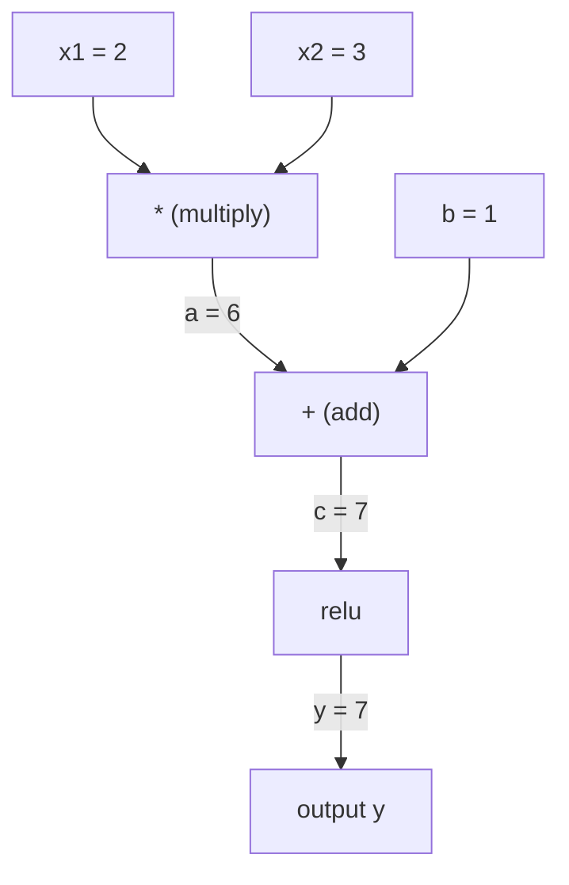
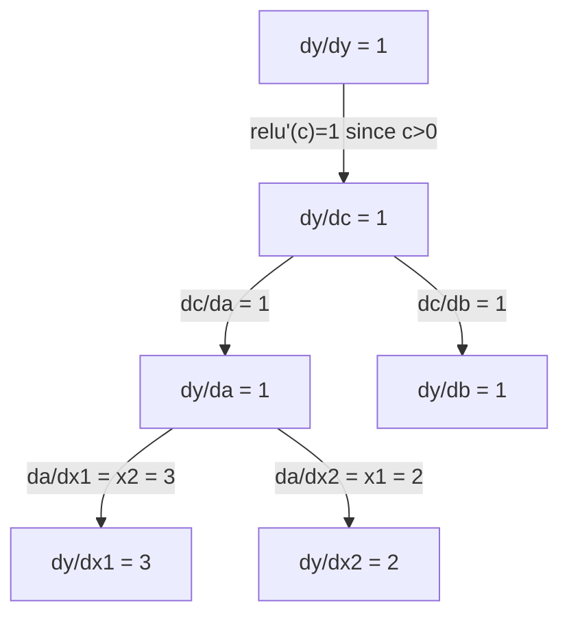

# 链式法则与自动微分

> 链式法则是每个神经网络学习背后的引擎。

**Type:** Build
**Language:** Python
**Prerequisites:** Phase 1, Lesson 04 (Derivatives & Gradients)
**Time:** ~90 minutes

## 学习目标

- 构建一个最小的自动渐变引擎（Value类），记录操作并通过反向模式自动渐变计算梯度
- 使用拓扑排序在计算图中实现向前和向后传递
- 构建和训练一个多层感知器上的异或仅使用从头开始的自grad引擎
- 使用梯度检查对数值有限差分验证autodiff正确性

## 这个问题

你可以计算简单函数的导数。但是神经网络不是一个简单的函数。它是由数百个函数组成的：矩阵乘法，加偏置，应用激活，矩阵再乘法，softmax，交叉熵损失。输出是函数的函数的函数。

为了训练网络，你需要损失相对于每个权重的梯度。对于数以百万计的参数来说，手工操作是不可能的。用数值计算（有限差分）太慢了。

链式法则给出了数学公式。自动微分给出了算法。它们一起让你通过与单个向前通过成比例的任意函数组合来计算精确的梯度。

这就是PyTorch， TensorFlow和JAX的工作原理。您将从头开始构建一个微型版本。

## 这个概念

### 链式法则

如果

```
dy/dx = dy/dg * dg/dx = f'(g(x)) * g'(x)
```

沿着链式乘以导数。每个环节都贡献了它的局部导数。

例子:

```
g(x) = x^2       g'(x) = 2x
f(g) = sin(g)     f'(g) = cos(g)

dy/dx = cos(x^2) * 2x
```

对于更深层次的组合，链条延伸：

```
y = f(g(h(x)))

dy/dx = f'(g(h(x))) * g'(h(x)) * h'(x)
```

神经网络中的每一层都是这个链条上的一个环节。

### 计算图

计算图使链式法则可视化。每个操作都成为一个节点。数据在图中向前流动。梯度反向流动。

**正向传递（计算值）：**



**Backward pass (compute gradients):**



反向传递在每个节点上应用链式法则，将梯度从输出传播到输入。

### 正向模式vs反向模式

在图中应用链式法则有两种方法。

**前向模式**从输入开始，并向前推动导数。它可以计算当你有很少的输入和很多的输出时，这很好。

```
Forward mode: seed dx/dx = 1, propagate forward

  x = 2       (dx/dx = 1)
  a = x^2     (da/dx = 2x = 4)
  y = sin(a)  (dy/dx = cos(a) * da/dx = cos(4) * 4 = -2.615)
```

**反向模式**从输出开始并向后拉梯度。它可以计算当你有很多输入和很少的输出。

```
Reverse mode: seed dy/dy = 1, propagate backward

  y = sin(a)  (dy/dy = 1)
  a = x^2     (dy/da = cos(a) = cos(4) = -0.654)
  x = 2       (dy/dx = dy/da * da/dx = -0.654 * 4 = -2.615)
```

神经网络有数百万个输入（权重）和一个输出（损失）。反向模式在一次反向传递中计算所有梯度。这就是反向传播使用反向模式的原因。

| Mode | Seed | Direction | Best when |
|------|------|-----------|-----------|
| Forward | `dx_i/dx_i = 1` | Input to output | Few inputs, many outputs |
| Reverse | `dy/dy = 1` | Output to input | Many inputs, few outputs (neural nets) |

### 前转模式双号码

转发模式可以用双号码优雅地实现。对偶数有这样的形式

```
Dual number: (value, derivative)

(2, 1) means: value is 2, derivative w.r.t. x is 1

Arithmetic rules:
  (a, a') + (b, b') = (a+b, a'+b')
  (a, a') * (b, b') = (a*b, a'*b + a*b')
  sin(a, a')         = (sin(a), cos(a)*a')
```

输入变量的导数为1。导数通过每个操作自动传播。

### 建立一个自动光栅引擎

一个自动grad引擎需要三样东西：

1. **价值包装。**将每个数字包装在一个对象中，存储其值和梯度。
2. **图记录。**每个操作记录其输入和局部梯度函数。
3. **向后传递。**对图进行拓扑排序，然后反向行走，在每个节点应用链式法则。

这正是PyTorch的The

### PyTorch Autograd是如何工作的

当你写PyTorch代码时：

”“python
x = torch.tensor（2.0, requires_grad=True）
Y = x ** 2 + 3 * x + 1
y.backward ()
打印(x。Grad) # 7.0 = 2*x + 3 = 2*2 + 3
```

PyTorch internally:

1. Creates a `Tensor` node for `x` with `requires_grad=True`
2. Every operation (`**`, `*`, `+`) creates a new node and records the backward function
3. `y.backward()` triggers reverse-mode autodiff through the recorded graph
4. Each node's `grad_fn` computes local gradients and passes them to parent nodes
5. Gradients accumulate in `.grad` attributes via addition (not replacement)

The graph is dynamic (define-by-run). A new graph is built on every forward pass. This is why PyTorch supports control flow (if/else, loops) inside models.

## Build It

### Step 1: The Value class

```python
class Value:
    def __init__(self, data, children=(), op=''):
        self.data = data
        self.grad = 0.0
        self._backward = lambda: None
        self._prev = set(children)
        self._op = op

    def __repr__(self):
        return f"Value(data={self.data:.4f}, grad={self.grad:.4f})"
```

每一个

### 步骤2：带梯度跟踪的算术运算

”“python
Def __add__(self, other)：
if isinstance(other, Value) else Value（other）
out = Value(self。数据+其他。Data, (self, other), '+')
def _backward ():
自我。Grad += out.grad
其他。Grad += out.grad
出去了。_backward = _backward
返回了

Def __mul__(self, other)：
if isinstance(other, Value) else Value（other）
out = Value(self。数据*其他。Data, (self, other), '*')
def _backward ():
自我。Grad += other。数据*输出
其他。Grad += self。数据*输出
出去了。_backward = _backward
返回了

def relu(自我):
out = Value(max(0), self。Data), (self,), 'relu')
def _backward ():
自我。Grad +=(1.0)如果out。数据> 0 else 0.0) * out.grad
出去了。_backward = _backward
返回了
```

Each operation creates a closure that knows how to compute local gradients and multiply by the upstream gradient (`out.grad`). The `+=` handles the case where a value is used in multiple operations.

### Step 3: The backward pass

```python
    def backward(self):
        topo = []
        visited = set()
        def build_topo(v):
            if v not in visited:
                visited.add(v)
                for child in v._prev:
                    build_topo(child)
                topo.append(v)
        build_topo(self)

        self.grad = 1.0
        for v in reversed(topo):
            v._backward()
```

拓扑排序确保每个节点的梯度在传播到它的子节点之前被完全计算。种子梯度为1.0 （dy/dy = 1）。

### 第四步：完整的引擎需要更多的操作

基本的Value类处理加法、乘法和乘法。一个真正的自动grad引擎需要更多。下面是构建神经网络所需的操作：

”“python
def __neg__(自我):
返回self * -1

Def __sub__(self, other)：
返回self + （-other）

Def __radd__(self, other)：
返回self + other

Def __rmul__(self, other)：
返回自我*他人

Def __rsub__(self, other)：
返回other + （-self）

Def __pow__(self, n)：
out = Value(self。数据** n， （self,）， f'**{n}')
def _backward ():
自我。Grad += n * (self。数据** (n - 1)) * out.grad
出去了。_backward = _backward
返回了

Def __truediv__(self, other)：
return self * (other ** -1) if isinstance(other, Value) else self * （Value(other) ** -1）

def((自我):
导入数学
e = math.exp(self.data)
out = Value(e， (self，)， 'exp')
def _backward ():
自我。grad += e * out.grad
出。_backward = _backward
返回了

def日志(自我):
导入数学
out = Value(math.log) （self. log）Data), (self,), 'log')
def _backward ():
自我。Grad += (1.0 / self。数据)* out.grad
出去了。_backward = _backward
返回了

def双曲正切(自我):
导入数学
T = math.tanh（self.data）
out = Value（t, (self,), 'tanh'）
def _backward ():
自我。Grad += (1 - t ** 2) * out.grad
出去了。_backward = _backward
返回了
```

**Why each operation matters:**

| Operation | Backward rule | Used in |
|-----------|--------------|---------|
| `__sub__` | Reuses add + neg | Loss computation (pred - target) |
| `__pow__` | n * x^(n-1) | Polynomial activations, MSE (error^2) |
| `__truediv__` | Reuses mul + pow(-1) | Normalization, learning rate scaling |
| `exp` | exp(x) * upstream | Softmax, log-likelihood |
| `log` | (1/x) * upstream | Cross-entropy loss, log probabilities |
| `tanh` | (1 - tanh^2) * upstream | Classic activation function |

The clever part: `__sub__` and `__truediv__` are defined in terms of existing operations. They get correct gradients for free because the chain rule composes through the underlying add/mul/pow operations.

### Step 5: Mini MLP from scratch

With a complete Value class, you can build a neural network. No PyTorch. No NumPy. Just Values and the chain rule.

```python
import random

class Neuron:
    def __init__(self, n_inputs):
        self.w = [Value(random.uniform(-1, 1)) for _ in range(n_inputs)]
        self.b = Value(0.0)

    def __call__(self, x):
        act = sum((wi * xi for wi, xi in zip(self.w, x)), self.b)
        return act.tanh()

    def parameters(self):
        return self.w + [self.b]

class Layer:
    def __init__(self, n_inputs, n_outputs):
        self.neurons = [Neuron(n_inputs) for _ in range(n_outputs)]

    def __call__(self, x):
        return [n(x) for n in self.neurons]

    def parameters(self):
        return [p for n in self.neurons for p in n.parameters()]

class MLP:
    def __init__(self, sizes):
        self.layers = [Layer(sizes[i], sizes[i+1]) for i in range(len(sizes)-1)]

    def __call__(self, x):
        for layer in self.layers:
            x = layer(x)
        return x[0] if len(x) == 1 else x

    def parameters(self):
        return [p for layer in self.layers for p in layer.parameters()]
```

AAa每个权重都是a

** XOR培训：**

”“python
random.seed (42)
model = MLP([2,4,1]) # 2个输入，4个隐藏神经元，1个输出

x = [[0,0], [0,1], [1,0], [1,1]]
ys =[-1, 1, 1， -1] #异或模式（使用-1/1表示tanh）

对于范围（100）内的步长：
Preds = [model(x) for x in xs]
损失= sum(（p - y) ** 2 for p, y in zip(preds, ys)）

对于model.parameters（）中的p：
P.grad = 0.0
loss.backward ()

Lr = 0.05
对于model.parameters（）中的p：
P.data -= lr * p.grad

如果步骤% 20 == 0：
Print （f"step {step:3d} loss = {loss.data:.4f}"）

print（"\nPredictions after training:"）
对于zip（xs, ys）中的x， y：
打印(f”输入目标= = {x} {y: 2 d} pred ={模型(x) . data: 6.3 f}”)
```

This is micrograd. A complete neural network training loop in pure Python with automatic differentiation. Every commercial deep learning framework does the same thing at massive scale.

### Step 6: Gradient checking

How do you know your autodiff is correct? Compare it against numerical derivatives. This is gradient checking.

```python
def gradient_check(build_expr, x_val, h=1e-7):
    x = Value(x_val)
    y = build_expr(x)
    y.backward()
    autodiff_grad = x.grad

    y_plus = build_expr(Value(x_val + h)).data
    y_minus = build_expr(Value(x_val - h)).data
    numerical_grad = (y_plus - y_minus) / (2 * h)

    diff = abs(autodiff_grad - numerical_grad)
    return autodiff_grad, numerical_grad, diff
```

在一个复杂表达式上测试它：

”“python
def expr (x):
返回（x ** 3 + x * 2 + 1）.tanh（）

Ad, num, diff = gradient_check（expr, 0.5）
打印(f“Autodiff:{广告:.8f}”)
打印(f“数值:{num: .8f}”)
打印(f“区别:{diff: .2e}”)
# 差值应小于1e-5
```

Gradient checking is essential when implementing new operations. If your backward pass has a bug, the numerical check catches it. Every serious deep learning implementation runs gradient checks during development.

**When to use gradient checking:**

| Situation | Do gradient check? |
|-----------|-------------------|
| Adding a new operation to your autograd | Yes, always |
| Debugging a training loop that won't converge | Yes, check gradients first |
| Production training | No, too slow (2x forward passes per parameter) |
| Unit tests for autograd code | Yes, automate it |

### Step 7: Verify against manual calculation

```python
x1 = Value(2.0)
x2 = Value(3.0)
a = x1 * x2          # a = 6.0
b = a + Value(1.0)    # b = 7.0
y = b.relu()          # y = 7.0

y.backward()

print(f"y = {y.data}")          # 7.0
print(f"dy/dx1 = {x1.grad}")   # 3.0 (= x2)
print(f"dy/dx2 = {x2.grad}")   # 2.0 (= x1)
```

手动检查：自从
Z2`dy/dx2 = x1 = 2`. 引擎匹配。

## 使用它

### PyTorch验证

”“python
进口火炬

x1 = torch.tensor（2.0, requires_grad=True）
x2 = torch.tensor（3.0, requires_grad=True）
A = x1 * x2
B = a + 1.0
Y = torch.relu(b)
y.backward ()

print(f"PyTorch dy/dx1 = {x1.grad。Item ()}") # 3.0
print(f"PyTorch dy/dx2 = {x2.grad。Item()}”)# 2.0
```

Same gradients. Your engine computes the same result as PyTorch because the math is the same: reverse-mode autodiff via the chain rule.

### A more complex expression

```python
a = Value(2.0)
b = Value(-3.0)
c = Value(10.0)
f = (a * b + c).relu()  # relu(2*(-3) + 10) = relu(4) = 4

f.backward()
print(f"df/da = {a.grad}")  # -3.0 (= b)
print(f"df/db = {b.grad}")  #  2.0 (= a)
print(f"df/dc = {c.grad}")  #  1.0
```

## 船这

这一课产生：
- 
- 

这里建立的Value类是第三阶段神经网络训练循环的基础。

## 练习

1. 添加验证一下

2. 添加验证一下

3. 构建单个神经元的计算图：计算所有五个梯度并针对PyTorch进行验证。

4. 使用双数字实现前向模式自动diff。创建一个

## 关键术语

| Term | What people say | What it actually means |
|------|----------------|----------------------|
| Chain rule | "Multiply the derivatives" | The derivative of composed functions equals the product of each function's local derivative, evaluated at the right point |
| Computational graph | "The network diagram" | A directed acyclic graph where nodes are operations and edges carry values (forward) or gradients (backward) |
| Forward mode | "Push derivatives forward" | Autodiff that propagates derivatives from inputs to outputs. One pass per input variable. |
| Reverse mode | "Backpropagation" | Autodiff that propagates gradients from outputs to inputs. One pass per output variable. |
| Autograd | "Automatic gradients" | A system that records operations on values, builds a graph, and computes exact gradients via the chain rule |
| Dual numbers | "Value plus derivative" | Numbers of the form a + b*epsilon (epsilon^2 = 0) that carry derivative information through arithmetic |
| Topological sort | "Dependency order" | Ordering graph nodes so every node comes after all its dependencies. Required for correct gradient propagation. |
| Gradient accumulation | "Add, don't replace" | When a value feeds into multiple operations, its gradient is the sum of all incoming gradient contributions |
| Dynamic graph | "Define by run" | A computation graph rebuilt on every forward pass, allowing Python control flow inside models (PyTorch style) |
| Gradient checking | "Numerical verification" | Comparing autodiff gradients against numerical finite-difference gradients to verify correctness. Essential for debugging. |
| MLP | "Multi-layer perceptron" | A neural network with one or more hidden layers of neurons. Each neuron computes a weighted sum plus bias, then applies an activation function. |
| Neuron | "Weighted sum + activation" | The basic unit: output = activation(w1*x1 + w2*x2 + ... + b). The weights and bias are learnable parameters. |

## 进一步的阅读

- [3Blue1Brown：反向传播演算]（https://www.youtube.com/watch?v=tIeHLnjs5U8）——神经网络中链式法则的可视化解释
- [PyTorch Autograd机制]（https://pytorch.org/docs/stable/notes/autograd.html）——真实系统是如何工作的
- [Baydin等人，机器学习中的自动区分：调查]（https://arxiv.org/abs/1502.05767）——综合参考