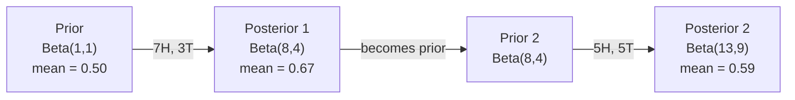

# 贝叶斯定理

> 概率是关于你所期望的。贝叶斯定理是关于你学到了什么。

**Type:** Build
**Language:** Python
**Prerequisites:** Phase 1, Lesson 06 (Probability Fundamentals)
**Time:** ~75 minutes

## 学习目标

- 运用贝叶斯定理从先验、似然和证据计算后验概率
- 用拉普拉斯平滑和对数空间计算从零开始构建朴素贝叶斯文本分类器
- 比较MLE和MAP估计，并解释MAP如何对应L2正则化
- 在A/B测试中使用Beta-Binomial共轭先验执行顺序贝叶斯更新

## 这个问题

医学测试的准确率是99%你的测试呈阳性。你真的得了这种病的几率有多大？

大多数人说99%。真正的答案取决于这种疾病有多罕见。如果1万分之一的人患有这种疾病，那么阳性结果只会给你1%的患病几率。另外99%的阳性结果是健康人的假警报。

这不是一个刁钻的问题。这就是贝叶斯定理。每个垃圾邮件过滤器，每个医疗诊断，每个量化不确定性的机器学习模型都使用这种精确的推理。你从一个信念开始。你看到了证据。你更新。

如果你在不理解这一点的情况下构建ML系统，你就会误解模型输出，设置糟糕的阈值，并发布过于自信的预测。

## 这个概念

### 从联合概率到贝叶斯

从第06课你们已经知道条件概率是：

```
P(A|B) = P(A and B) / P(B)
```

对称:

```
P(B|A) = P(A and B) / P(A)
```

两个表达式都有相同的分子：P（A和B）。将它们设置为相等并重新排列：

```
P(A and B) = P(A|B) * P(B) = P(B|A) * P(A)

Therefore:

P(A|B) = P(B|A) * P(A) / P(B)
```

这就是贝叶斯定理。四个量，一个方程。

### 四部分

| Part | Name | What it means |
|------|------|---------------|
| P(A\|B) | Posterior | Your updated belief about A after seeing evidence B |
| P(B\|A) | Likelihood | How probable the evidence B is if A is true |
| P(A) | Prior | Your belief about A before seeing any evidence |
| P(B) | Evidence | Total probability of seeing B under all possibilities |

证据项P(B)起归一化器的作用。你可以用全概率定律展开它：

```
P(B) = P(B|A) * P(A) + P(B|not A) * P(not A)
```

### 医学测试实例

每一万人中就有一人患病。该测试的准确率为99%（检测到99%的病人，假阳性率为1%）。

```
P(sick)          = 0.0001     (prior: disease is rare)
P(positive|sick) = 0.99       (likelihood: test catches it)
P(positive|healthy) = 0.01    (false positive rate)

P(positive) = P(positive|sick) * P(sick) + P(positive|healthy) * P(healthy)
            = 0.99 * 0.0001 + 0.01 * 0.9999
            = 0.000099 + 0.009999
            = 0.010098

P(sick|positive) = P(positive|sick) * P(sick) / P(positive)
                 = 0.99 * 0.0001 / 0.010098
                 = 0.0098
                 = 0.98%
```

不到1%。先验占主导地位。当一种疾病罕见时，即使是准确的测试也大多会产生假阳性。这就是为什么医生会要求进行确认检查。

### 垃圾邮件过滤器示例

您收到一封包含“彩票”一词的电子邮件。是垃圾邮件吗？

```
P(spam)                = 0.3      (30% of email is spam)
P("lottery"|spam)      = 0.05     (5% of spam emails contain "lottery")
P("lottery"|not spam)  = 0.001    (0.1% of legitimate emails contain "lottery")

P("lottery") = 0.05 * 0.3 + 0.001 * 0.7
             = 0.015 + 0.0007
             = 0.0157

P(spam|"lottery") = 0.05 * 0.3 / 0.0157
                  = 0.955
                  = 95.5%
```

一个词就把概率从30%变成了95.5%。一个真正的垃圾邮件过滤器同时对数百个单词应用贝叶斯。

### 朴素贝叶斯：独立性假设

朴素贝叶斯将其扩展到多个特征，假设所有特征都是条件独立的给定类：

```
P(class | feature_1, feature_2, ..., feature_n)
  = P(class) * P(feature_1|class) * P(feature_2|class) * ... * P(feature_n|class)
    / P(feature_1, feature_2, ..., feature_n)
```

“天真”的部分是独立性假设。在文本中，单词的出现并不是独立的（“New”和“York”是相关的）。但这个假设在实践中出奇地有效，因为分类器只需要对类别进行排序，而不需要产生校准的概率。

因为所有类的分母都是一样的，你可以跳过它，只比较分子：

```
score(class) = P(class) * product of P(feature_i | class)
```

选择得分最高的班级。

### 最大似然估计（MLE）

如何从训练数据中得到P(feature|class) ？计数。

```
P("free"|spam) = (number of spam emails containing "free") / (total spam emails)
```

这就是MLE：选择最可能观测到的数据的参数值。您正在最大化似然函数，对于离散计数，它减少为相对频率。

问题：如果一个单词在训练期间从未出现在垃圾邮件中，MLE给出的概率为零。一个看不见的字毁掉了整个产品。用拉普拉斯平滑解决这个问题：

```
P(word|class) = (count(word, class) + 1) / (total_words_in_class + vocabulary_size)
```

每次计数加1确保概率不为零。

### 最大后验方差（MAP）

MLE问：什么参数最大化P（数据|参数）？

MAP问：什么参数最大化P（参数|数据）？

根据贝叶斯定理：

```
P(parameters|data) proportional to P(data|parameters) * P(parameters)
```

MAP在参数本身之上添加了一个优先级。如果您认为参数应该很小，则将其编码为惩罚大值的先验。这与ML中的L2正则化相同。脊回归中的“脊”惩罚实际上是权重的高斯先验。

| Estimation | Optimizes | ML equivalent |
|------------|-----------|---------------|
| MLE | P(data\|params) | Unregularized training |
| MAP | P(data\|params) * P(params) | L2 / L1 regularization |

### 贝叶斯主义者和频率主义者：实际的区别

频率论者将参数视为固定的未知数。他们问：“如果我重复这个实验很多次，会发生什么？”

贝叶斯学派将参数视为分布。他们问：“根据我所观察到的，我相信这些参数是什么？”

对于构建机器学习系统，实际的区别是：

| Aspect | Frequentist | Bayesian |
|--------|-------------|----------|
| Output | Point estimate | Distribution over values |
| Uncertainty | Confidence intervals (about procedure) | Credible intervals (about parameter) |
| Small data | Can overfit | Prior acts as regularization |
| Computation | Usually faster | Often requires sampling (MCMC) |

大多数生产ML是频率主义者（SGD，点估计）。当你需要校准不确定性（医疗决策、安全关键系统）或数据稀缺（少量学习、冷启动）时，贝叶斯方法就会大放异彩。

### 为什么贝叶斯思维对机器学习很重要

这种联系比类比更深刻：

**先验是正则化的。对权重的高斯先验是L2正则化。拉普拉斯先验是L1。每次你增加一个正则化项，你就得到了一个关于你期望的参数值的贝叶斯表达式。

**后验是不确定的。**一个预测的概率并不能告诉你模型在估计中有多自信。贝叶斯方法给出了一个分布：“我认为P（垃圾邮件）在0.8到0.95之间。”

**贝叶斯更新是在线学习。今天的过去变成明天的过去。当您的模型看到新数据时，它会逐步更新其信念，而不是从头开始重新训练。

**模型比较采用贝叶斯方法。**贝叶斯信息准则（BIC）、边际似然和贝叶斯因子都使用贝叶斯推理在模型之间进行选择而不会过度拟合。

## 构建它

### 第一步：贝叶斯定理函数

”“python
Def bayes（先验，似然，谬误positive_rate）：
证据= likelihood * prior + false_positive_rate * （1 - prior）
后验=可能性*先验/证据
返回后

结果=贝叶斯（先验=0.0001，似然=0.99，谬误阳性率=0.01）
print（f"P（sick|阳性）= {result:.4f}"）
```

### Step 2: Naive Bayes classifier

```python
import math
from collections import defaultdict

class NaiveBayes:
    def __init__(self, smoothing=1.0):
        self.smoothing = smoothing
        self.class_counts = defaultdict(int)
        self.word_counts = defaultdict(lambda: defaultdict(int))
        self.class_word_totals = defaultdict(int)
        self.vocab = set()

    def train(self, documents, labels):
        for doc, label in zip(documents, labels):
            self.class_counts[label] += 1
            words = doc.lower().split()
            for word in words:
                self.word_counts[label][word] += 1
                self.class_word_totals[label] += 1
                self.vocab.add(word)

    def predict(self, document):
        words = document.lower().split()
        total_docs = sum(self.class_counts.values())
        vocab_size = len(self.vocab)
        best_class = None
        best_score = float("-inf")
        for cls in self.class_counts:
            score = math.log(self.class_counts[cls] / total_docs)
            for word in words:
                count = self.word_counts[cls].get(word, 0)
                total = self.class_word_totals[cls]
                score += math.log((count + self.smoothing) / (total + self.smoothing * vocab_size))
            if score > best_score:
                best_score = score
                best_class = cls
        return best_class
```

对数概率可以防止溢流。将许多小概率相乘得到的数字对于浮点数来说太小了。对数概率求和在数值上是稳定的，在数学上是等价的。

### 步骤3：对垃圾邮件数据进行训练

”“python
Train_docs = [
“现在赢得免费奖金”，
“免费中奖彩票”，
“今天免费领取奖品”
“紧急提供免费现金”，
“恭喜你免费赢了”，
“明天中午开会”，
“项目更新附件”，
“我们能安排一次通话吗”
“季度报告检讨”；
“周四的午餐听起来不错”，
“团队站立笔记附件”，
“请审阅拉取请求”，
］

train_labels = [
    "spam", "spam", "spam", "spam", "spam",
    "ham", "ham", "ham", "ham", "ham", "ham", "ham",
]

分类器= NaiveBayes（）
分类器。火车(train_docs train_labels)

Test_messages = [
“免费的钱等着你”，
“会议改到星期五”；
“你赢得了免费奖品”
“请审阅附件报告”，
］

对于test_messages中的MSG：
Print （f" '{msg}' -> {classifier.predict(msg)}"）
```

### Step 4: Inspect the learned probabilities

```python
def show_top_words(classifier, cls, n=5):
    vocab_size = len(classifier.vocab)
    total = classifier.class_word_totals[cls]
    probs = {}
    for word in classifier.vocab:
        count = classifier.word_counts[cls].get(word, 0)
        probs[word] = (count + classifier.smoothing) / (total + classifier.smoothing * vocab_size)
    sorted_words = sorted(probs.items(), key=lambda x: x[1], reverse=True)
    for word, prob in sorted_words[:n]:
        print(f"    {word}: {prob:.4f}")

print("\nTop spam words:")
show_top_words(classifier, "spam")
print("\nTop ham words:")
show_top_words(classifier, "ham")
```

## 使用它

Scikit-learn提供生产就绪的朴素贝叶斯实现：

”“python
从sklearn.feature_extraction。文本导入CountVectorizer
从sklearn。naive_bayes import multiomalnb
从sklearn。度量导入classification_report

vectorizer = CountVectorizer（）
X_train = vectorizer.fit_transform（train_docs）
clf =多项式nb （）
clf.fit (X_train train_labels)

X_test = vectorizer.transform（test_messages）
预测= clf.predict（X_test）
对于msg， pred在zip（test_messages, predictions）中：
Print （f" '{msg}' -> {pred}"）
```

Same algorithm. CountVectorizer handles tokenization and vocabulary building. MultinomialNB handles smoothing and log-probabilities internally. Your from-scratch version does the same thing in 40 lines.

## Ship It

The NaiveBayes class built here demonstrates the full pipeline: tokenization, probability estimation with Laplace smoothing, log-space prediction. The code in `code/bayes.py` runs end-to-end with no dependencies beyond Python's standard library.

### Conjugate Priors

When the prior and posterior belong to the same family of distributions, the prior is called "conjugate." This makes Bayesian updating algebraically clean -- you get a closed-form posterior without numerical integration.

| Likelihood | Conjugate Prior | Posterior | Example |
|-----------|----------------|-----------|---------|
| Bernoulli | Beta(a, b) | Beta(a + successes, b + failures) | Coin flip bias estimation |
| Normal (known variance) | Normal(mu_0, sigma_0) | Normal(weighted mean, smaller variance) | Sensor calibration |
| Poisson | Gamma(a, b) | Gamma(a + sum of counts, b + n) | Modeling arrival rates |
| Multinomial | Dirichlet(alpha) | Dirichlet(alpha + counts) | Topic modeling, language models |

Why this matters: without conjugate priors, you need Monte Carlo sampling or variational inference to approximate the posterior. With conjugate priors, you just update two numbers.

The Beta distribution is the most common conjugate prior in practice. Beta(a, b) represents your belief about a probability parameter. The mean is a/(a+b). The larger a+b, the more concentrated (confident) the distribution.

Special cases of the Beta prior:
- Beta(1, 1) = uniform. You have no opinion about the parameter.
- Beta(10, 10) = peaked at 0.5. You strongly believe the parameter is near 0.5.
- Beta(1, 10) = skewed toward 0. You believe the parameter is small.

The update rule is dead simple:

```
先验：Beta（a, b）
数据：5个成功，6个失败
后侧：β （a + s, b + f）
```

No integrals. No sampling. Just addition.

### Sequential Bayesian Updating

Bayesian inference is naturally sequential. Today's posterior becomes tomorrow's prior. This is how real systems learn incrementally without reprocessing all historical data.

Concrete example: estimating whether a coin is fair.

**Day 1: No data yet.**
Start with Beta(1, 1) -- a uniform prior. You have no opinion.
- Prior mean: 0.5
- Prior is flat across [0, 1]

**Day 2: Observe 7 heads, 3 tails.**
Posterior = Beta(1 + 7, 1 + 3) = Beta(8, 4)
- Posterior mean: 8/12 = 0.667
- Evidence suggests the coin is biased toward heads

**Day 3: Observe 5 more heads, 5 more tails.**
Use yesterday's posterior as today's prior.
Posterior = Beta(8 + 5, 4 + 5) = Beta(13, 9)
- Posterior mean: 13/22 = 0.591
- The balanced new data pulled the estimate back toward 0.5



观察的顺序无关紧要。（1,1）同时更新了所有12个正面和8个反面，得到（13,9）——同样的结果。顺序更新和批处理更新在数学上是等价的。但是顺序更新允许您在不存储原始数据的情况下在每一步做出决定。

这是生产ML系统中在线学习的基础。针对强盗的汤普森采样、增量推荐系统和流异常检测器都使用这种模式。

### 连接到A/B测试

A/B测试是伪装的贝叶斯推理。

设置：您正在测试两种按钮颜色。变种A（蓝色）和变种B（绿色）。你想知道哪一个获得更多点击。

贝叶斯A/B测试：

1. **之前。**从两个变量的Beta（1,1）开始。没有优先选择。
2. **数据。**变体A: 1000次观看中有50次点击。变体B: 1000次点击中有65次点击。
3. **Posteriors.**
   - A:(1 + 50,1 + 950) =(51,951)。平均值= 0.051
   - B: Beta(1 + 65,1 + 935) = Beta（66,936）平均值= 0.066
4. **的决定。**计算P（B > A）——B的真实转化率高于A的概率。

解析计算P（B bbb10a）是很困难的。但蒙特卡洛让它变得微不足道：

```
1. Draw 100,000 samples from Beta(51, 951)  -> samples_A
2. Draw 100,000 samples from Beta(66, 936)  -> samples_B
3. P(B > A) = fraction of samples where B > A
```

如果P(B > A) > 0.95，你就发布变量B。如果介于0.05和0.95之间，你就继续收集数据。如果P(B > A) < 0.05，你发布的是变体A。

相对于频繁A/B测试的优势：
- 你会得到一个直接的概率陈述：“有97%的可能性B更好”
- 没有p值混淆。没有“拒绝零假设失败”的对冲。
- 您可以随时检查结果，而不会增加假阳性率（没有“偷窥问题”）。
- 你可以结合之前的知识（例如，之前的测试表明转化率通常是3-8%）。

| Aspect | Frequentist A/B | Bayesian A/B |
|--------|----------------|--------------|
| Output | p-value | P(B > A) |
| Interpretation | "How surprising is this data if A=B?" | "How likely is B better than A?" |
| Early stopping | Inflates false positives | Safe at any point (given a well-chosen prior and correctly specified model) |
| Prior knowledge | Not used | Encoded as Beta prior |
| Decision rule | p < 0.05 | P(B > A) > threshold |

## 练习

1. **多个测试。**患者两次独立检测均呈阳性（准确率均为99%，发病率为万分之一）。两项检查后P（病）是什么？使用第一次测试的后验作为第二次测试的先验。

2. **平滑的影响。**运行垃圾邮件分类器，平滑值为0.01,0.1,1.0和10.0。排名靠前的词的概率是如何变化的？平滑=0和一个只出现在ham中的单词会发生什么？

3. **添加特性。**扩展NaiveBayes类，也使用消息长度（短/长）作为单词计数的特征。从训练数据中估计P（short|spam）和P(short|ham)，并将其折叠到预测分数中。

4. **手动MAP。**给定观察到的数据（10次抛硬币中有7次正面），使用Beta（2,2）先验计算偏差的MAP估计。将其与MLE估计（7/10）进行比较。

## 关键术语

| Term | What people say | What it actually means |
|------|----------------|----------------------|
| Prior | "My initial guess" | P(hypothesis) before observing evidence. In ML: the regularization term. |
| Likelihood | "How well the data fits" | P(evidence\|hypothesis). How probable the observed data is under a specific hypothesis. |
| Posterior | "My updated belief" | P(hypothesis\|evidence). The prior multiplied by the likelihood, then normalized. |
| Evidence | "The normalizing constant" | P(data) across all hypotheses. Ensures the posterior sums to 1. |
| Naive Bayes | "That simple text classifier" | A classifier that assumes features are independent given the class. Works well despite the false assumption. |
| Laplace smoothing | "Add-one smoothing" | Adding a small count to every feature to prevent zero probabilities from unseen data. |
| MLE | "Just use the frequencies" | Choose parameters that maximize P(data\|parameters). No prior. Can overfit with small data. |
| MAP | "MLE with a prior" | Choose parameters that maximize P(data\|parameters) * P(parameters). Equivalent to regularized MLE. |
| Log-probability | "Work in log space" | Using log(P) instead of P to avoid floating-point underflow when multiplying many small numbers. |
| False positive | "A wrong alarm" | The test says positive, but the true state is negative. Drives the base rate fallacy. |

## 进一步的阅读

- [3Blue1Brown：贝叶斯定理](https://www.youtube.com/watch?v=HZGCoVF3YvM) -结合医学测试实例的可视化解释
- [斯坦福CS229：生成学习算法](https://cs229.stanford.edu/notes2022fall/cs229-notes2.pdf) -朴素贝叶斯及其与判别模型的联系
- [思考贝叶斯](https://greenteapress.com/wp/think-bayes/) -免费书籍，贝叶斯统计用Python代码
- [scikit-learn朴素贝叶斯](https://scikit-learn.org/stable/modules/naive_bayes.html) -生产实现以及何时使用每种变体