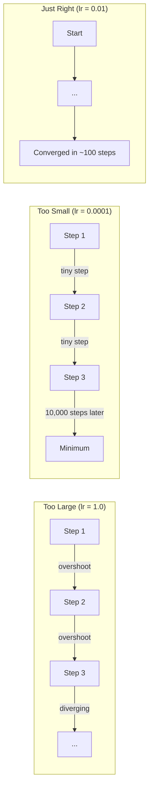
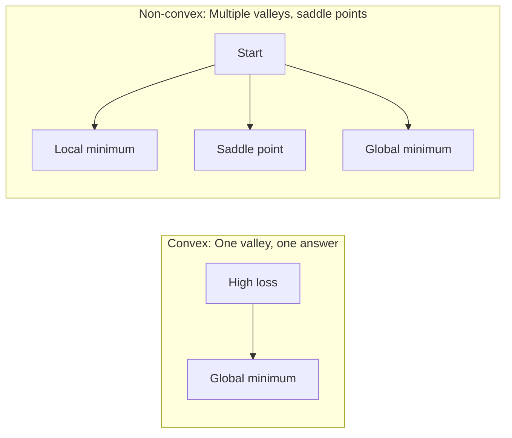

# 优化

> 训练一个神经网络只不过是找到谷底。

**Type:** Build
**Language:** Python
**Prerequisites:** Phase 1, Lessons 04-05 (Derivatives, Gradients)
**Time:** ~75 minutes

## 学习目标

- 执行香草梯度下降，SGD与动量，和亚当从头开始
- 比较Rosenbrock函数上的优化器收敛性，并解释为什么Adam采用每权重学习率
- 区分凸和非凸损失景观，并解释鞍点在高维中的作用
- 配置学习率时间表（阶跃衰减，余弦退火，预热），训练稳定性

## 这个问题

你有一个损失函数。它告诉你你的模型错得有多离谱。你有梯度。它们告诉你哪个方向损失更大。现在你需要一个下山的策略。

朴素的方法很简单：在梯度的相反方向移动。将这个步长乘以一个叫做学习率的数字。重复。这是梯度下降法，而且有效。但“有效”一词也有警告。学习率太大，你就会完全越过山谷，在墙之间跳跃。太小的话，你就得爬过成千上万个不必要的步骤才能找到答案。到达鞍点时，即使没有找到最小值，也会停止移动。

深度学习中的每个优化器都是同一个问题的答案：如何更快、更可靠地到达谷底？

## 这个概念

### 什么是优化？

优化是找到最小化（或最大化）函数的输入值。在机器学习中，函数就是损失。输入是模型的权重。训练就是优化。

```
minimize L(w) where:
  L = loss function
  w = model weights (could be millions of parameters)
```

### 梯度下降法（香草）

最简单的优化器。计算损失相对于每个权值的梯度。将每个权重按与其梯度相反的方向移动。按学习率调整步长。

```
w = w - lr * gradient
```

这就是整个算法。一行。

“‘美人鱼
图道明
A[“*起点（高损耗）”]—> B[“沿坡度下坡移动”]
B—> C[“接近最小值”]
C—> D[“最小（低损失）”]
```

### Learning rate: the most important hyperparameter

The learning rate controls step size. It determines everything about convergence.



正确的学习率没有公式可循。你可以通过实验找到它。共同的起点：Adam为0.001，SGD为0.01。

### SGD vs批量vs小批量

香草梯度下降在采取一步之前计算整个数据集的梯度。这被称为批量梯度下降。它很稳定，但是很慢。

随机梯度下降（SGD）计算单个随机样本上的梯度并立即步进。它很吵，但速度很快。

小批量梯度下降消除了差异。计算小批量（32、64、128、256个样本）的梯度，然后进行step。这是每个人都在用的。

| Variant | Batch size | Gradient quality | Speed per step | Noise |
|---------|-----------|-----------------|---------------|-------|
| Batch GD | Entire dataset | Exact | Slow | None |
| SGD | 1 sample | Very noisy | Fast | High |
| Mini-batch | 32-256 | Good estimate | Balanced | Moderate |

SGD和mini-batch中的噪音不是bug。它有助于避开浅局部极小值和鞍点。

### 动量：球滚下山

香草梯度下降法只关注当前的梯度。如果坡度呈锯齿状（在狭窄的山谷中很常见），则进展缓慢。动量通过将过去的梯度累积成一个速度项来解决这个问题。

```
v = beta * v + gradient
w = w - lr * v
```

打个比方：一个滚下山的球。它不会在每次颠簸时停止并重新启动。它在一致的方向上建立速度，并抑制振荡。

“‘美人鱼
图道明
子图Without[“无动量（之字形，缓慢）”]
W1["Start"]—>|left| W2[" "]
W2 ->|右| W3[" "]
W3—>|左| W4[" "]
W4 ->|右| W5[" "]
W5 ->|左| W6[" "]
W7[“最小值”]
结束
子图With[带有动量的（平稳的，快速的）]
M1(“开始”)——>平方米 [" "] --> M3 [" "] --> M4(“最低”)
结束
```

`beta` (typically 0.9) controls how much history to keep. Higher beta means more momentum, smoother paths, but slower response to direction changes.

### Adam: adaptive learning rates

Different weights need different learning rates. A weight that rarely gets large gradients should take bigger steps when it finally does. A weight that gets huge gradients constantly should take smaller steps.

Adam (Adaptive Moment Estimation) tracks two things per weight:

1. First moment (m): running average of gradients (like momentum)
2. Second moment (v): running average of squared gradients (gradient magnitude)

```
M = β 1 * M + (1 - β 1) *梯度
V = 2 * V +(1 - 2) *梯度^2

M_hat = m / (1 - ^t)偏差校正
V_hat = v / (1 - 2^t)偏置校正

W = W - lr * m_hat / （sqrt(v_hat) + epsilon）
```

The division by `sqrt(v_hat)` is the key insight. Weights with large gradients get divided by a large number (small effective step). Weights with small gradients get divided by a small number (large effective step). Each weight gets its own adaptive learning rate.

Default hyperparameters: `lr=0.001, beta1=0.9, beta2=0.999, epsilon=1e-8`. These defaults work well for most problems.

### Learning rate schedules

A fixed learning rate is a compromise. Early in training, you want large steps to make fast progress. Late in training, you want small steps to fine-tune near the minimum.

Common schedules:

| Schedule | Formula | Use case |
|----------|---------|----------|
| Step decay | lr = lr * factor every N epochs | Simple, manual control |
| Exponential decay | lr = lr_0 * decay^t | Smooth reduction |
| Cosine annealing | lr = lr_min + 0.5 * (lr_max - lr_min) * (1 + cos(pi * t / T)) | Transformers, modern training |
| Warmup + decay | Linear ramp up, then decay | Large models, prevents early instability |

### Convex vs non-convex

A convex function has one minimum. Gradient descent always finds it. A quadratic like `f(x) = x^2` is convex.

Neural network loss functions are non-convex. They have many local minima, saddle points, and flat regions.



在实践中，局部最小值在高维神经网络中很少是一个问题。大多数局部最小值的损失值接近全局最小值。鞍点（在某些方向上是平的，在其他方向上是弯曲的）是真正的障碍。小批量生产的动力和噪音有助于摆脱它们。

### 损失景观可视化

损失是所有权重的函数。对于具有100万个权重的模型，损失景观存在于1,000,000维空间中。我们通过在权值空间中选择两个随机方向并沿着这些方向绘制损失来可视化它，从而产生一个二维曲面。

“‘美人鱼
图道明
HL[“高损耗区”]—> SP[“鞍点”]
HL—> LM[“局部最小值”]
Sp -> lm
SP—> GM[“全球最小值”]
LM -。- b> |“浅屏障”| GM
样式：HL填充：#ff6666，颜色：#000
样式SP填充：#ffcc66，颜色：#000
样式：LM填充：#66ccff，颜色：#000
样式：GM填充：#66ff66，颜色：#000
```

Sharp minima generalize poorly. Flat minima generalize well. This is one reason SGD with momentum often outperforms Adam on final test accuracy: its noise prevents settling into sharp minima.

## Build It

### Step 1: Define a test function

The Rosenbrock function is a classic optimization benchmark. Its minimum is at (1, 1) inside a narrow curved valley that is easy to find but hard to follow.

```
F (x, y) = (1 - x)²+ 100 * （y - x²）²
```

```python
def rosenbrock(params):
    x, y = params
    return (1 - x) ** 2 + 100 * (y - x ** 2) ** 2

def rosenbrock_gradient(params):
    x, y = params
    df_dx = -2 * (1 - x) + 200 * (y - x ** 2) * (-2 * x)
    df_dy = 200 * (y - x ** 2)
    return [df_dx, df_dy]
```

### 步骤2：香草梯度下降

”“python
类GradientDescent:
Def __init__(self, lr=0.001)：
自我。Lr = Lr

Def (self, params, gradients)：
返回[p - self]。Lr * g for p, g in zip(params, gradients)]
```

### Step 3: SGD with momentum

```python
class SGDMomentum:
    def __init__(self, lr=0.001, momentum=0.9):
        self.lr = lr
        self.momentum = momentum
        self.velocity = None

    def step(self, params, grads):
        if self.velocity is None:
            self.velocity = [0.0] * len(params)
        self.velocity = [
            self.momentum * v + g
            for v, g in zip(self.velocity, grads)
        ]
        return [p - self.lr * v for p, v in zip(params, self.velocity)]
```

### 4 .亚当

”“python
类亚当:
Def __init__(self, lr=0.001, beta1=0.9, beta2=0.999, epsilon=1e-8)：
自我。Lr = Lr
自我。a1 = a1
自我。a2 = a2
自我。=
自我。m =无
自我。v =无
自我。T = 0

Def (self, params, gradients)：
如果自我。m为None：
自我。M = [0.0] * len（params）
自我。V = [0.0] * len（params）

自我。T += 1

        self.m = [
            self.beta1 * m + (1 - self.beta1) * g
            for m, g in zip(self.m, grads)
        ]
        self.v = [
            self.beta2 * v + (1 - self.beta2) * g ** 2
            for v, g in zip(self.v, grads)
        ]

M_hat = [m / (1 - self。** *自我。为我自己。[m]
V_hat = [v / (1 - self。** *自我。[au:]

返回(
P - self。Lr * mh / （vh ** 0.5 + self.epsilon）
对于zip（params, m_hat, v_hat）中的p mh vh
］
```

### Step 5: Run and compare

```python
def optimize(optimizer, func, grad_func, start, steps=5000):
    params = list(start)
    history = [params[:]]
    for _ in range(steps):
        grads = grad_func(params)
        params = optimizer.step(params, grads)
        history.append(params[:])
    return history

start = [-1.0, 1.0]

gd_history = optimize(GradientDescent(lr=0.0005), rosenbrock, rosenbrock_gradient, start)
sgd_history = optimize(SGDMomentum(lr=0.0001, momentum=0.9), rosenbrock, rosenbrock_gradient, start)
adam_history = optimize(Adam(lr=0.01), rosenbrock, rosenbrock_gradient, start)

for name, history in [("GD", gd_history), ("SGD+M", sgd_history), ("Adam", adam_history)]:
    final = history[-1]
    loss = rosenbrock(final)
    print(f"{name:6s} -> x={final[0]:.6f}, y={final[1]:.6f}, loss={loss:.8f}")
```

预期产出：Adam收敛速度最快。有动力的新元走一条更平稳的道路。香草GD沿着狭窄的山谷缓慢前进。

## 使用它

在实践中，使用PyTorch或JAX优化器。它们处理参数组、权重衰减、梯度裁剪和GPU加速。

”“python
进口火炬

模型= torch.nn。线性(784年,10)

sgd = torch. optimize . sgd（模型）参数（），lr=0.01，动量=0.9)
亚当=火炬。参数(),lr = 0.001)
adamw = torch. optimize . adamw（模型）参数（），lr=0.001, weight_decay=0.01)

Scheduler = torch. optimize .lr_scheduler。CosineAnnealingLR(亚当,T_max = 100)
```

Rules of thumb:

- Start with Adam (lr=0.001). It works for most problems without tuning.
- Switch to SGD with momentum (lr=0.01, momentum=0.9) when you need the best final accuracy and can afford more tuning.
- Use AdamW (Adam with decoupled weight decay) for transformers.
- Always use a learning rate schedule for training runs longer than a few epochs.
- If training is unstable, reduce the learning rate. If training is too slow, increase it.

## Ship It

This lesson produces a prompt for choosing the right optimizer. See `outputs/prompt-optimizer-guide.md`.

The optimizer classes built here reappear in Phase 3 when we train a neural network from scratch.

## Exercises

1. **Learning rate sweep.** Run vanilla gradient descent on the Rosenbrock function with learning rates [0.0001, 0.0005, 0.001, 0.005, 0.01]. Plot or print the final loss after 5000 steps for each. Find the largest learning rate that still converges.

2. **Momentum comparison.** Run SGD with momentum values [0.0, 0.5, 0.9, 0.99] on the Rosenbrock function. Track the loss at every step. Which momentum value converges fastest? Which overshoots?

3. **Saddle point escape.** Define the function `f(x, y) = x^2 - y^2` (a saddle point at the origin). Start at (0.01, 0.01). Compare how vanilla GD, SGD with momentum, and Adam behave. Which escapes the saddle point?

4. **Implement learning rate decay.** Add an exponential decay schedule to the GradientDescent class: `lr = lr_0 * 0.999^step`. Compare convergence with and without decay on the Rosenbrock function.

## Key Terms

| Term | What people say | What it actually means |
|------|----------------|----------------------|
| Gradient descent | "Go downhill" | Update weights by subtracting the gradient scaled by the learning rate. The most basic optimizer. |
| Learning rate | "Step size" | A scalar that controls how far each update moves the weights. Too large causes divergence. Too small wastes compute. |
| Momentum | "Keep rolling" | Accumulate past gradients into a velocity vector. Dampens oscillations and accelerates movement through consistent directions. |
| SGD | "Random sampling" | Stochastic gradient descent. Compute gradient on a random subset instead of the full dataset. Almost always means mini-batch SGD in practice. |
| Mini-batch | "A chunk of data" | A small subset of training data (32-256 samples) used to estimate the gradient. Balances speed and gradient accuracy. |
| Adam | "The default optimizer" | Adaptive Moment Estimation. Tracks per-weight running averages of gradients and squared gradients to give each weight its own learning rate. |
| Bias correction | "Fix the cold start" | Adam's first and second moments are initialized to zero. Bias correction divides by (1 - beta^t) to compensate during early steps. |
| Learning rate schedule | "Change lr over time" | A function that adjusts the learning rate during training. Large steps early, small steps late. |
| Convex function | "One valley" | A function where any local minimum is the global minimum. Gradient descent always finds it. Neural network losses are not convex. |
| Saddle point | "Flat but not a minimum" | A point where the gradient is zero but it is a minimum in some directions and a maximum in others. Common in high dimensions. |
| Loss landscape | "The terrain" | The loss function plotted over weight space. Visualized by slicing along two random directions. |
| Convergence | "Getting there" | The optimizer has reached a point where further steps do not meaningfully reduce the loss. |

## Further Reading

- [Sebastian Ruder: An overview of gradient descent optimization algorithms](https://ruder.io/optimizing-gradient-descent/) - comprehensive survey of all major optimizers
- [Why Momentum Really Works (Distill)](https://distill.pub/2017/momentum/) - interactive visualization of momentum dynamics
- [Adam: A Method for Stochastic Optimization (Kingma & Ba, 2014)](https://arxiv.org/abs/1412.6980) - the original Adam paper, readable and short
- [Visualizing the Loss Landscape of Neural Nets (Li et al., 2018)](https://arxiv.org/abs/1712.09913) - the paper that showed sharp vs flat minima