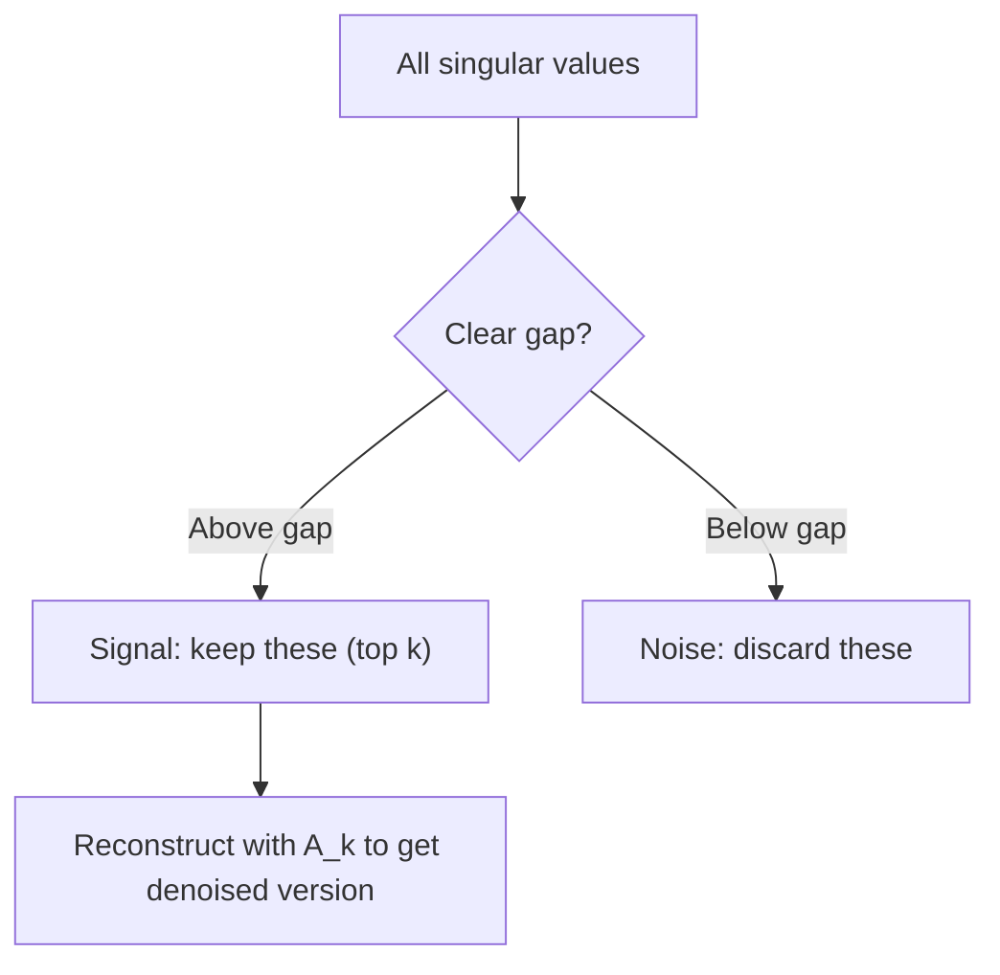

# 奇异值分解

> SVD是线性代数中的瑞士军刀。每个矩阵都有1。每个数据科学家都需要一个。

**Type:** Build
**Languages:** Python, Julia
**Prerequisites:** Phase 1, Lessons 01 (Linear Algebra Intuition), 02 (Vectors & Matrices Operations), 03 (Matrix Transformations)
**Time:** ~120 minutes

## 学习目标

- 通过幂次迭代实现SVD，并解释U、Sigma和V^T的几何含义
- 应用截断的奇异值分解进行图像压缩，并测量压缩比与重建误差
- 通过SVD计算Moore-Penrose伪逆来求解过定最小二乘系统
- 将SVD与PCA、推荐系统（潜在因素）和NLP中的潜在语义分析联系起来

## 这个问题

你有一个1000x2000的矩阵。也许是用户电影评分。也许它是一个文档项频率表。也许是图像的像素值。你需要压缩它，去噪它，找到其中隐藏的结构，或者用它来解一个最小二乘系统。特征分解只适用于方阵。即使这样，它要求矩阵有一个完整的线性无关的特征向量集合。

SVD适用于任何矩阵。任何形状。任何等级。没有条件。它将矩阵分解为三个因子，揭示了矩阵对空间的几何作用。它是所有线性代数中最普遍也是最有用的分解。

## 这个概念

### SVD在几何上做了什么

每个矩阵，无论形状如何，都按顺序执行三个操作：旋转、缩放、旋转。SVD使这种分解显式化。

```
A = U * Sigma * V^T

      m x n     m x m    m x n    n x n
     (any)    (rotate)  (scale)  (rotate)
```

给定任意矩阵A， SVD将其分解为：
- V^T在输入空间（n维）中旋转向量
- Sigma沿着每个轴缩放（拉伸或压缩）
- U将结果旋转到输出空间（m维）

“‘mermaid
图LR
A[“输入空间（n-dim）\nData cloud\n（任意方向）”]—>|“V^T\n（旋转）”| B[“缩放空间\ n对齐轴\n然后缩放Sigma”]
B ->|“U\n（旋转）”| C[“输出空间（m-dim）\ nrotation到输出\方向”]
```

Think of it this way. You hand SVD a matrix. It tells you: "This matrix takes a sphere of inputs, first rotates it by V^T, then stretches it into an ellipsoid by Sigma, then rotates the ellipsoid by U." The singular values are the lengths of the ellipsoid's axes.

### The full decomposition

For a matrix A with shape m x n:

```
A = U ** V^T

地点:
U是m × m，正交（U^T U = I）
是m x n，对角线（对角线上的奇异值）
V是n × n，正交（V^T V = I）

奇异值sigma_1 >= sigma_2 >=…>= sigma_r > 0
其中r = rank(A)
```

The columns of U are called left singular vectors. The columns of V are called right singular vectors. The diagonal entries of Sigma are called singular values. They are always non-negative and conventionally sorted in decreasing order.

### Left singular vectors, singular values, right singular vectors

Each component of the SVD has a distinct geometric meaning.

**Right singular vectors (columns of V):** These form an orthonormal basis for the input space (R^n). They are the directions in input space that the matrix maps to orthogonal directions in output space. Think of them as the natural coordinate system for the domain.

**Singular values (diagonal of Sigma):** These are the scaling factors. The i-th singular value tells you how much the matrix stretches vectors along the i-th right singular vector. A singular value of zero means the matrix crushes that direction entirely.

**Left singular vectors (columns of U):** These form an orthonormal basis for the output space (R^m). The i-th left singular vector is the direction in output space where the i-th right singular vector lands (after scaling).

The relationship between them:

```
A * v_i = sigma_i * u_i

矩阵A取第i个右奇异向量v_i，
乘以sigma_i，然后映射到第i个左奇异向量u_i。
```

This gives you a coordinate-by-coordinate picture of what any matrix does.

### Outer product form

The SVD can be written as a sum of rank-1 matrices:

```
= sigma_1 * u_1 * v_1 ^ T + sigma_2 * u_2 * v_2 ^ T +……+ sigma_r * u_r * v_r^T

每一项sigma_i * u_i * v_i^T都是一个秩1矩阵（外积）。
满矩阵是r个这样的矩阵的和，其中r是秩。
```

This form is the foundation of low-rank approximation. Each term adds one layer of structure. The first term captures the single most important pattern. The second captures the next most important. And so on. Truncating this sum gives you the best possible approximation at any given rank.

```
秩-1近似：A_1 = sigma_1 * u_1 * v_1^T
（抓住了主导模式）

秩-2近似：A_2 = sigma_1 * u_1 * v_1^T + sigma_2 * u_2 * v_2^T
（抓住了两个最重要的模式）

秩-k近似：A_k =前k项的和
（Eckart-Young定理最优）
```

### Relationship to eigendecomposition

SVD and eigendecomposition are deeply connected. The singular values and vectors of A come directly from the eigenvalues and eigenvectors of A^T A and A A^T.

```
A^T = V *∑^T * U^T * U *∑* V^T
= V * Sigma^T * Sigma * V^T
= v * d * v ^ t

其中D =∑^T *∑是一个对角线矩阵，∑_i^2在对角线上。

所以:
- 右奇异向量(V)是A^ ta的特征向量
- 奇异值的平方（sigma_i^2）是A^T A的特征值

类似的:
A A^T = U ** V^T * V ** U^T
= U * Sigma * Sigma^T * U^T

所以:
- 左奇异向量(U)是A A T的特征向量
- A^T的特征值也是∑_i^2
```

This connection tells you three things:
1. Singular values are always real and non-negative (they are square roots of eigenvalues of a positive semi-definite matrix).
2. You could compute SVD via eigendecomposition of A^T A, but this squares the condition number and loses numerical precision. Dedicated SVD algorithms avoid this.
3. When A is square and symmetric positive semi-definite, SVD and eigendecomposition are the same thing.

### Truncated SVD: low-rank approximation

The Eckart-Young-Mirsky theorem states that the best rank-k approximation to A (in both Frobenius and spectral norm) is obtained by keeping only the top k singular values and their corresponding vectors:

```
A_k = U_k * Sigma_k * V_k^T

地点:
U_k等于m × k （U的前k列）
Sigma_k是k x k（左上角的k x k块）
V_k是n × k （V的前k列）

近似误差= sigma_{k+1}（谱范数）
= sqrt(sigma_{k+1}^2 +…+ sigma_r^2)（在Frobenius范数中）
```

This is not just "a good" approximation. It is provably the best possible approximation of rank k. No other rank-k matrix is closer to A.

| Component | Relative magnitude | Kept in rank-3 approx? |
|-----------|-------------------|------------------------|
| sigma_1 | Largest | Yes |
| sigma_2 | Large | Yes |
| sigma_3 | Medium-large | Yes |
| sigma_4 | Medium | No (error) |
| sigma_5 | Medium-small | No (error) |
| sigma_6 | Small | No (error) |
| sigma_7 | Very small | No (error) |
| sigma_8 | Tiny | No (error) |

Keep top 3: A_3 captures the three largest singular values. Error = remaining values (sigma_4 through sigma_8).

If singular values decay fast, a small k captures most of the matrix. If they decay slowly, the matrix has no low-rank structure.

### Image compression with SVD

A grayscale image is a matrix of pixel intensities. An 800x600 image has 480,000 values. SVD lets you approximate it with far fewer.

```
原图：800 × 600 = 48万值

SVD with rank k:
  U_k:      800 x k values
  Sigma_k:  k values
  V_k:      600 x k values
  Total:    k * (800 + 600 + 1) = k * 1401 values

K =10: 14,010值（原值的2.9%）
K =50: 70,050个值（原始值的14.6%）
K =100: 140,100个值（原始值的29.2%）

压缩比随着k的减小而提高，
但视觉质量会下降。
```

The key insight: natural images have rapidly decaying singular values. The first few singular values capture the broad structure (shapes, gradients). The later ones capture fine detail and noise. Truncating at rank 50 often produces an image that looks nearly identical to the original while using 85% less storage.

### SVD for recommendation systems

The Netflix Prize made this famous. You have a user-movie ratings matrix where most entries are missing.

```
电影1电影2电影3电影4电影5
User1 [5 ?]3 ?1]
User2 [?]4 ?2呢?］
User3 [3]5吗?吗?］
User4 [?]吗?吗?[43]

？ =未知等级
```

The idea: this ratings matrix has low rank. Users do not have completely independent tastes. There are a handful of latent factors (action vs. drama, old vs. new, cerebral vs. visceral) that explain most preferences.

SVD on the (filled-in) ratings matrix decomposes it into:
- U: user profiles in latent factor space
- Sigma: importance of each latent factor
- V^T: movie profiles in latent factor space

A user's predicted rating for a movie is the dot product of their user profile with the movie's profile (weighted by singular values). The low-rank approximation fills in the missing entries.

In practice, you use variants like Simon Funk's incremental SVD or ALS (alternating least squares) that handle missing data directly. But the core idea is the same: latent factor decomposition via SVD.

### SVD in NLP: Latent Semantic Analysis

Latent Semantic Analysis (LSA), also called Latent Semantic Indexing (LSI), applies SVD to a term-document matrix.

```
Doc1 Doc2 Doc3 Doc4
“猫”[3 0 10 10]
“狗”[2 0 0 1]
“鱼”[0 4 10]
“宠物”[11 11 11]
“海洋”[0 3 0 0]

秩为k=2的SVD后：

每个文档都成为二维“概念空间”中的一个点。
每一项都是同一个二维空间中的一个点。
相似主题的文档聚在一起。
意思相近的术语聚在一起。

“猫”和“狗”最终会靠近对方（陆地宠物）。
“鱼”和“海”最后彼此靠近（水的概念）。
如果Doc1和Doc3共享相似的主题，它们就聚在一起。
```

LSA was one of the first successful methods for capturing semantic similarity from raw text. It works because synonymous terms tend to appear in similar documents, so SVD groups them into the same latent dimensions. Modern word embeddings (Word2Vec, GloVe) can be seen as descendants of this idea.

### SVD for noise reduction

Noisy data has signal concentrated in the top singular values and noise spread across all singular values. Truncating removes the noise floor.

**Clean signal singular values:**

| Component | Magnitude | Type |
|-----------|-----------|------|
| sigma_1 | Very large | Signal |
| sigma_2 | Large | Signal |
| sigma_3 | Medium | Signal |
| sigma_4 | Near zero | Negligible |
| sigma_5 | Near zero | Negligible |

**Noisy signal singular values (noise adds to all):**

| Component | Magnitude | Type |
|-----------|-----------|------|
| sigma_1 | Very large | Signal |
| sigma_2 | Large | Signal |
| sigma_3 | Medium | Signal |
| sigma_4 | Small | Noise |
| sigma_5 | Small | Noise |
| sigma_6 | Small | Noise |
| sigma_7 | Small | Noise |



它用于信号处理、科学测量和数据清洗。任何时候你有一个矩阵被加性噪声破坏，截断奇异值分解是一个原则的方法，从噪声中分离信号。

### 通过SVD的伪逆

Moore-Penrose伪逆A+将矩阵反演推广到非平方矩阵和奇异矩阵。SVD使得计算它变得微不足道。

```
If A = U * Sigma * V^T, then:

A+ = V * Sigma+ * U^T

where Sigma+ is formed by:
  1. Transpose Sigma (swap rows and columns)
  2. Replace each non-zero diagonal entry sigma_i with 1/sigma_i
  3. Leave zeros as zeros

For A (m x n):      A+ is (n x m)
For Sigma (m x n):  Sigma+ is (n x m)
```

伪逆解决了最小二乘问题。如果Ax = b没有精确解（过定系统），则x = A+ b是最小二乘解（最小化||Ax - b||）。

```
Overdetermined system (more equations than unknowns):

  [1  1]         [3]
  [2  1] x   =   [5]       No exact solution exists.
  [3  1]         [6]

  x_ls = A+ b = V * Sigma+ * U^T * b

  This gives the x that minimizes the sum of squared residuals.
  Same result as the normal equations (A^T A)^(-1) A^T b,
  but numerically more stable.
```

### 数值稳定性优势

计算A^T A的特征分解的奇异值平方（A^T A的特征值是sigma_i^2）。这是条件数的平方，放大了数值误差。

```
Example:
  A has singular values [1000, 1, 0.001]
  Condition number of A: 1000 / 0.001 = 10^6

  A^T A has eigenvalues [10^6, 1, 10^{-6}]
  Condition number of A^T A: 10^6 / 10^{-6} = 10^{12}

  Computing SVD directly: works with condition number 10^6
  Computing via A^T A:     works with condition number 10^{12}
                           (6 extra digits of precision lost)
```

现代SVD算法（Golub-Kahan双对角化）直接作用于A，从不形成A^T A，这就是为什么你应该总是喜欢

### 对接PCA

对中心数据进行PCA IS SVD分析。这不是一个类比。实际上是相同的计算。

```
Given data matrix X (n_samples x n_features), centered (mean subtracted):

Covariance matrix: C = (1/(n-1)) * X^T X

PCA finds eigenvectors of C. But:

  X = U * Sigma * V^T    (SVD of X)

  X^T X = V * Sigma^2 * V^T

  C = (1/(n-1)) * V * Sigma^2 * V^T

So the principal components are exactly the right singular vectors V.
The explained variance for each component is sigma_i^2 / (n-1).

In sklearn, PCA is implemented using SVD, not eigendecomposition.
It is faster and more numerically stable.
```

这意味着你在第10课学到的所有关于降维的知识都是SVD。PCA是SVD在机器学习中最常见的应用。

## 构建它

### 步骤1：使用幂迭代从头开始SVD

其思想是：为了找到最大的奇异值及其向量，对A^T A（或A A^T）使用幂次迭代。然后放气矩阵并重复下一个奇异值。

”“python
import numpy as np

def power_iteration(M, num_iters=100)：
n = M.shape[1]
V = np.random.randn(n)
V = V / np. linalgn .norm(V)

For _in range(num_iters)：
Mv = M @ v
v = Mv / np. linalgn .norm（Mv）

特征值= v @ M @ v
返回特征值v

def svd_from_scratch(A, k=None)：
m, n = a
如果k为None：
K = min（m, n）

sigma = []
Us = []
Vs = []

A_residual = A.copy().astype（float）

对于_in range(k)：
AtA = A_residual。T @ a_残差
特征值，v = power_iteration（AtA, num_iters=200）

若特征值< 1e-10：
打破

Sigma = np.sqrt（特征值）
u = A_residual @ v /

sigmas.append(σ)
us.append (u)
vs.append (v)

A_residual = A_residual - sigma * np。外(u, v)

U = np。Column_stack (us) if us else np。空((m, 0))
S = np.array（sigma）
V = np。Column_stack （vs）空((n, 0))

返回U， S， V
```

### Step 2: Test and compare with NumPy

```python
np.random.seed(42)
A = np.random.randn(5, 4)

U_ours, S_ours, V_ours = svd_from_scratch(A)
U_np, S_np, Vt_np = np.linalg.svd(A, full_matrices=False)

print("Our singular values:", np.round(S_ours, 4))
print("NumPy singular values:", np.round(S_np, 4))

A_reconstructed = U_ours @ np.diag(S_ours) @ V_ours.T
print(f"Reconstruction error: {np.linalg.norm(A - A_reconstructed):.8f}")
```

### 步骤3：图像压缩演示

”“python
Def compress_image_svd(image_matrix, k)：
U， S, Vt = np。圣言(image_matrix full_matrices = False)
压缩= U[:,:k] @ np。（S[:k]） @ Vt[:k,:]
返回压缩的

Image = np.random.seed（42）
Rows, cols = 200,300
图像= np.random。randn(行,峡路)

对于[1,5,10,20,50]中的k：
压缩= compress_image_svd（图像，k）
错误= np. linear。规范（图像-压缩）/ np. linag .规范（图像）
Original_size = rows * cols
Compressed_size = k * （rows + cols + 1）
Ratio = compressed_size / original_size
打印(f”k ={凯西:> 3 d} ={错误:错误。4 f}存储={比率:物质}")
```

### Step 4: Noise reduction

```python
np.random.seed(42)
clean = np.outer(np.sin(np.linspace(0, 4*np.pi, 100)),
                 np.cos(np.linspace(0, 2*np.pi, 80)))
noise = 0.3 * np.random.randn(100, 80)
noisy = clean + noise

U, S, Vt = np.linalg.svd(noisy, full_matrices=False)
denoised = U[:, :5] @ np.diag(S[:5]) @ Vt[:5, :]

print(f"Noisy error:    {np.linalg.norm(noisy - clean):.4f}")
print(f"Denoised error: {np.linalg.norm(denoised - clean):.4f}")
print(f"Improvement:    {(1 - np.linalg.norm(denoised - clean) / np.linalg.norm(noisy - clean)):.1%}")
```

### 步骤5：伪逆

”“python
A = np。数组（[[1,1],[2,1],[3,1]],dtype=float）
B = np。数组（[3,5,6],dtype=float）

U， S, Vt = np。圣言(full_matrices = False)
S_inv = np.diag（1.0 / S）
@ @ @ @ @ @ @ @ @ @ @ @ @

x_svd = A_pinv @ b
X_lstsq = np. linear。lstsq(A, b, rrd =None)[0]
X_pinv = np. linear。pinv(A) @ b

print（f"SVD伪逆解：{x_svd}"）
打印(f”np.linalg。LSTSQ解决方案：{x_lstsq}")
打印(f”np.linalg。Pinv解：{x_pinv}")
```

## Use It

Full working demos are in `code/svd.py`. Run it to see SVD applied to image compression, recommendation systems, latent semantic analysis, and noise reduction.

```bash
python svd.py
```

Julia版本

”“bash
茱莉亚svd.jl
```

## Ship It

This lesson produces:
- `outputs/skill-svd.md` - a skill for knowing when and how to apply SVD in real projects

## Exercises

1. Implement the full SVD from scratch without using power iteration. Instead, compute the  of A^T A to get V and the singular values, then compute U = A V Sigma^{-1}. Compare numerical accuracy with your power iteration version and with NumPy.

2. Load a real grayscale image (or convert one to grayscale). Compress it at ranks 1, 5, 10, 25, 50, 100. For each rank, compute the compression ratio and the relative error. Find the rank where the image becomes visually acceptable.

3. Build a tiny recommendation system. Create a 10x8 user-movie ratings matrix with some known entries. Fill missing entries with row means. Compute SVD and reconstruct a rank-3 approximation. Use the reconstructed matrix to predict the missing ratings. Verify that the predictions are reasonable.

4. Create a 100x50 document-term matrix with 3 synthetic topics. Each topic has 5 associated terms. Add noise. Apply SVD and verify that the top 3 singular values are much larger than the rest. Project documents into the 3D latent space and check that documents from the same topic cluster together.

5. Generate a clean low-rank matrix (rank 3, size 50x40) and add Gaussian noise at different levels (sigma = 0.1, 0.5, 1.0, 2.0). For each noise level, find the optimal truncation rank by sweeping k from 1 to 40 and measuring reconstruction error against the clean matrix. Plot how the optimal k changes with noise level.

## Key Terms

| Term | What people say | What it actually means |
|------|----------------|----------------------|
| SVD | "Factor any matrix" | Decompose A into U Sigma V^T where U and V are orthogonal and Sigma is diagonal with non-negative entries. Works for any matrix of any shape. |
| Singular value | "How important this component is" | The i-th diagonal entry of Sigma. Measures how much the matrix stretches along the i-th principal direction. Always non-negative, sorted in decreasing order. |
| Left singular vector | "Output direction" | A column of U. The direction in output space that the i-th right singular vector maps to (after scaling by sigma_i). |
| Right singular vector | "Input direction" | A column of V. The direction in input space that the matrix maps to the i-th left singular vector (after scaling by sigma_i). |
| Truncated SVD | "Low-rank approximation" | Keep only the top k singular values and their vectors. Produces the provably best rank-k approximation to the original matrix (Eckart-Young theorem). |
| Rank | "True dimensionality" | The number of non-zero singular values. Tells you how many independent directions the matrix actually uses. |
| Pseudoinverse | "Generalized inverse" | V Sigma+ U^T. Inverts non-zero singular values, leaves zeros as zeros. Solves least-squares problems for non-square or singular matrices. |
| Condition number | "How sensitive to errors" | sigma_max / sigma_min. A large condition number means small input changes cause large output changes. SVD reveals this directly. |
| Latent factor | "Hidden variable" | A dimension in the low-rank space discovered by SVD. In recommendations, a latent factor might correspond to genre preference. In NLP, it might correspond to a topic. |
| Frobenius norm | "Total matrix size" | Square root of the sum of squared entries. Equals the square root of the sum of squared singular values. Used to measure approximation error. |
| Eckart-Young theorem | "SVD gives the best compression" | For any target rank k, the truncated SVD minimizes the approximation error over all possible rank-k matrices. |
| Power iteration | "Find the biggest eigenvector" | Repeatedly multiply a random vector by the matrix and normalize. Converges to the eigenvector with the largest eigenvalue. The building block of many SVD algorithms. |

## Further Reading

- [Gilbert Strang: Linear Algebra and Its Applications, Chapter 7](https://math.mit.edu/~gs/linearalgebra/) - thorough treatment of SVD with applications
- [3Blue1Brown: But what is the SVD?](https://www.youtube.com/watch?v=vSczTbgc8Rc) - geometric intuition for SVD
- [We Recommend a Singular Value Decomposition](https://www.ams.org/publicoutreach/feature-column/fcarc-svd) - accessible overview from the American Mathematical Society
- [Netflix Prize and Matrix Factorization](https://sifter.org/~simon/journal/20061211.html) - Simon Funk's original blog post on SVD for recommendations
- [Latent Semantic Analysis](https://en.wikipedia.org/wiki/Latent_semantic_analysis) - the original NLP application of SVD
- [Numerical Linear Algebra by Trefethen and Bau](https://people.maths.ox.ac.uk/trefethen/text.html) - the gold standard for understanding SVD algorithms and their numerical properties