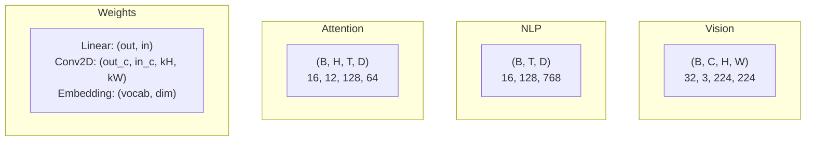
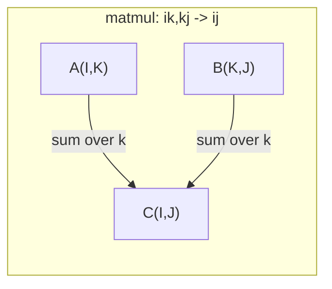

# 张量操作

> 张量是数据和深度学习之间的通用语言。每个图像，每个句子，每个渐变都贯穿其中。

**Type:** Build
**Language:** Python
**Prerequisites:** Phase 1, Lessons 01 (Linear Algebra Intuition), 02 (Vectors, Matrices & Operations)
**Time:** ~90 minutes

## 学习目标

- 从头开始实现一个具有形状、跨步、重塑、转置和元素操作的张量类
- 应用广播规则来操作不同形状的张量而不复制数据
- 为点积，矩阵乘法，外积和批处理操作编写和表达式
- 通过多头注意的每一步追踪精确的张量形状

## 这个问题

你造了一个变压器。向前的传球看起来很干净。运行它，得到：你盯着这些形状。你试试转置。现在它说你加了一个unsqueeze。别的东西坏了。

形状错误是深度学习代码中最常见的错误。它们在概念上并不难——每个操作都有一个形状契约——但它们的乘法运算速度很快。一个变压器有几十个变形、转置和广播连接在一起。一个错误的轴和错误级联。更糟糕的是，有些形状错误根本不会抛出错误。它们悄无声息地通过沿着错误的维度广播或在错误的轴上求和而产生垃圾。

矩阵处理两组事物之间的成对关系。真实的数据不能放在二维空间里。一批32张224x224的RGB图像是一个4D张量：12个正面的自我关注也是4D的：您需要一个泛化到任意数量维度的数据结构，其操作可以在所有维度上清晰地组合。这个结构就是张量。掌握它的操作和形状错误变得微不足道的可调试。

## 这个概念

### 张量是什么

张量是具有统一数据类型的多维数字数组。维度的数量是**排名**（或**顺序**）。每个维度是一个**轴**。形状是一个元组，列出了每个轴的大小。

“‘美人鱼
图LR
(“标量< br / >等级0 < br / >形状 : ()"] --> 向量V(“< br / > 1级< br / >形状:(3)”)
V—> M[“矩阵<br/>rank 2<br/>shape: (2,3)”]
M - > T3(“3 d < br / > 3阶张量< br / >形状:(2 2 2)”)
T3, T4 >["四维张量< br / > 4 < br / >形状:(B, C, H, W)”)
```

Total elements = product of all sizes. A shape `(2, 3, 4)` holds `2 * 3 * 4 = 24` elements.

### Tensor shapes in deep learning

Different data types map to specific tensor shapes by convention.



PyTorch使用NCHW （channels-first）。TensorFlow默认为NHWC （channels-last）。不匹配的布局会导致无声的减速或错误。

### 内存布局如何工作

内存中的二维数组是一个一维字节序列。**Strides**告诉您要跳过多少元素才能沿着每个轴移动一步。

“‘美人鱼
图LR
子图“行-主（C阶）”
["a b c de f<br/>strides: (3,1)"]
结束
子图“列主（F阶）”
["a d b e C f<br/>strides: (1,2)"]
结束
```

Transpose does not move data. It swaps the strides, making the tensor **non-contiguous** -- the elements for a row are no longer adjacent in memory.

### Broadcasting rules

Broadcasting lets you operate on tensors of different shapes without copying data. Align shapes from the right. Two dimensions are compatible when they are equal or one is 1. Fewer dimensions get padded with 1s on the left.

```
张量A:（8,1,6,1）
张量B:（7,1,5）
填充B:（1,7,1,5）
结果：（8,7,6,5）
```

### Einsum: the universal tensor operation

Einstein summation labels each axis with a letter. Axes in the input but not the output get summed. Axes in both are kept.



主要模式：

## 构建它

代码存在于每个步骤都引用那里的实现。

### 第一步：张量存储和步幅

张量存储一个平面的数字列表和形状元数据。Strides告诉索引逻辑如何将多维索引映射到平面位置。

”“python
类张量:
def __init__(self, data, shape=None)：
如果isinstance(data, (list, tuple))：
自我。_data,自我。_shape = self. _flat_nested （data）
if isinstance(data, np. narray)：
自我。_data = data.flatten().tolist（）
自我。_shape = tuple（data.shape）
其他:
自我。_data =[数据]
自我。_shape = （）

如果shape不是None：
Total = reduce（lambda a, b: a * b, shape, 1）
如果总！= len (self._data):
提高ValueError (
f“不能重塑{len(self。_data)}元素到shape {shape}”
）
自我。_shape = tuple（shape）

自我。_strides = self._compute_strides（self._shape）

@staticmethod
def _compute_strides(形状):
如果len(shape) == 0：
返回()
Strides = [1] * len（shape）
对于I在range(len(shape) - 2, -1, -1)：
步数[i] =步数[i + 1] *形状[i + 1]
返回元组(进步)
```

For shape `(3, 4)`, strides are `(4, 1)` -- skip 4 elements to advance one row, skip 1 element to advance one column.

### Step 2: Reshape, squeeze, unsqueeze

Reshape changes the shape without changing element order. The total number of elements must stay the same. Use `-1` for one dimension to infer its size.

```python
t = Tensor(list(range(12)), shape=(2, 6))
r = t.reshape((3, 4))
r = t.reshape((-1, 3))
```

挤压移除尺寸为1的轴。松开插入一个。解压缩是广播的关键——一个偏置向量

”“python
t = Tensor(list(range（6)), shape=(1,3,1,2)）
S = t.squeeze（）
v = Tensor（[1,2,3]）
U = v.unsqueeze(0)
```

### Step 3: Transpose and permute

Transpose swaps two axes. Permute reorders all axes. This is how you convert between NCHW and NHWC.

```python
mat = Tensor(list(range(6)), shape=(2, 3))
tr = mat.transpose(0, 1)

t4d = Tensor(list(range(24)), shape=(1, 2, 3, 4))
perm = t4d.permute((0, 2, 3, 1))
```

在转置或置换之后，张量在内存中是非连续的。在PyTorch中，

### 步骤4：元素明智的操作和减少

元素操作（加、乘、减）独立应用于每个元素并保持形状。缩减（sum, mean, max）折叠一个或多个轴。

”“python
a =张量（[[1,2],[3,4]]）
b =张量（[[10,20],[30,40]]）
C = a + b
D = a * 2
S = a.s sum（轴=0）
```

Global average pooling in a CNN: `(B, C, H, W).mean(axis=[2, 3])` produces `(B, C)`. Sequence mean pooling in NLP: `(B, T, D).mean(axis=1)` produces `(B, D)`.

### Step 5: Broadcasting with NumPy

The `demo_broadcasting_numpy()` function in `tensors.py` shows the core patterns.

```python
activations = np.random.randn(4, 3)
bias = np.array([0.1, 0.2, 0.3])
result = activations + bias

images = np.random.randn(2, 3, 4, 4)
scale = np.array([0.5, 1.0, 1.5]).reshape(1, 3, 1, 1)
result = images * scale

a = np.array([1, 2, 3]).reshape(-1, 1)
b = np.array([10, 20, 30, 40]).reshape(1, -1)
outer = a * b
```

通过广播的两两距离：重塑结果：

### 步骤6:insum操作

The

”“python
A = np.array（[1.0, 2.0, 3.0]）
B = np.array（[4.0, 5.0, 6.0]）
点= np。insum（"i,i->", a, b）

A = np。数组（[[1,2],[3,4],[5,6]],dtype=float）
B = np。数组（[[7,8,9],[10,11,12]],dtype=float）
Matmul = np。einsum（"ik,kj->ij"， A， B）

batch_A = np.random。Randn （4,3,5）
batch_B = np.random。Randn （4,5,2）
Batch_mm = np。einsum（"bij,bjk->bik", batch_A, batch_B）
```

The computational cost of a contraction is the product of all index sizes (kept and summed). For `bij,bjk->bik` with B=32, I=128, J=64, K=128: `32 * 128 * 64 * 128 = 33,554,432` multiply-adds.

### Step 7: Attention mechanism via einsum

The `demo_attention_einsum()` function implements multi-head attention end to end.

```python
B, H, T, D = 2, 4, 8, 16
E = H * D

X = np.random.randn(B, T, E)
W_q = np.random.randn(E, E) * 0.02

Q = np.einsum("bte,ek->btk", X, W_q)
Q = Q.reshape(B, T, H, D).transpose(0, 2, 1, 3)

scores = np.einsum("bhtd,bhsd->bhts", Q, K) / np.sqrt(D)
weights = softmax(scores, axis=-1)
attn_output = np.einsum("bhts,bhsd->bhtd", weights, V)

concat = attn_output.transpose(0, 2, 1, 3).reshape(B, T, E)
output = np.einsum("bte,ek->btk", concat, W_o)
```

每一步都是一个张量操作：投影（通过einsum进行matmul）、头部分割（重塑+转置）、注意力评分（通过einsum进行批量matmul）、加权和（通过einsum进行批量matmul）、头部合并（转置+重塑）、输出投影（通过einsum进行matmul）。

## 使用它

### Scratch vs NumPy

| Operation | Scratch (Tensor class) | NumPy |
|---|---|---|
| Create | `Tensor([[1,2],[3,4]])` | `np.array([[1,2],[3,4]])` |
| Reshape | `t.reshape((3,4))` | `a.reshape(3,4)` |
| Transpose | `t.transpose(0,1)` | `a.T` or `a.transpose(0,1)` |
| Squeeze | `t.squeeze(0)` | `np.squeeze(a, 0)` |
| Sum | `t.sum(axis=0)` | `a.sum(axis=0)` |
| Einsum | N/A | `np.einsum("ij,jk->ik", a, b)` |

### Scratch vs PyTorch

”“python
进口火炬

T =火炬。张量([[1,2,3],[4、5、6]],dtype = torch.float32)
t.shape
t.stride ()
t.is_contiguous ()

t.reshape (2)
t.unsqueeze (0)
t.transpose (0, 1)
t.transpose (0, 1) .contiguous ()

火炬。einsum（"ik,kj->ij"， A， B）
```

PyTorch adds autograd, GPU support, and optimized BLAS kernels. The shape semantics are identical. If you understand the scratch version, PyTorch shape errors become readable.

### Every neural network layer as a tensor operation

| Operation | Tensor Form | Einsum |
|---|---|---|
| Linear layer | `Y = X @ W.T + b` | `"bd,od->bo"` + bias |
| Attention QKV | `Q = X @ W_q` | `"btd,dh->bth"` |
| Attention scores | `Q @ K.T / sqrt(d)` | `"bhtd,bhsd->bhts"` |
| Attention output | `softmax(scores) @ V` | `"bhts,bhsd->bhtd"` |
| Batch norm | `(X - mu) / sigma * gamma` | element-wise + broadcast |
| Softmax | `exp(x) / sum(exp(x))` | element-wise + reduction |

## Ship It

This lesson produces two reusable prompts:

1. **`outputs/prompt-tensor-shapes.md`** -- A systematic prompt for debugging tensor shape mismatches. Includes decision tables for every common operation (matmul, broadcast, cat, Linear, Conv2d, BatchNorm, softmax) and a fix lookup table.

2. **`outputs/prompt-tensor-debugger.md`** -- A step-by-step debugging prompt you paste into any AI assistant when a shape error is blocking you. Feed it the error message and your tensor shapes, get back the exact fix.

## Exercises

1. **Easy -- Reshape round-trip.** Take a tensor of shape `(2, 3, 4)`. Reshape it to `(6, 4)`, then to `(24,)`, then back to `(2, 3, 4)`. Verify element order is preserved at each step by printing the flat data.

2. **Medium -- Implement broadcasting.** Extend the `Tensor` class with a `broadcast_to(shape)` method that expands dimensions of size 1 to match a target shape. Then modify `_elementwise_op` to automatically broadcast before operating. Test with shapes `(3, 1)` and `(1, 4)` producing `(3, 4)`.

3. **Hard -- Build einsum from scratch.** Implement a basic `einsum(subscripts, *tensors)` function that handles at least: dot product (`i,i->`), matrix multiply (`ij,jk->ik`), outer product (`i,j->ij`), and transpose (`ij->ji`). Parse the subscript string, identify contracted indices, and loop over all index combinations. Compare your results against `np.einsum`.

4. **Hard -- Attention shape tracker.** Write a function that takes `batch_size`, `seq_len`, `embed_dim`, and `num_heads` as inputs and prints the exact shape at every step of multi-head attention: input, Q/K/V projection, head split, attention scores, softmax weights, weighted sum, head merge, output projection. Verify against the `demo_attention_einsum()` output.

## Key Terms

| Term | What people say | What it actually means |
|---|---|---|
| Tensor | "A matrix but more dimensions" | A multi-dimensional array with uniform type and defined shape, strides, and operations |
| Rank | "The number of dimensions" | The number of axes. A matrix has rank 2, not rank equal to its matrix rank |
| Shape | "The size of the tensor" | A tuple listing the size along each axis. `(2, 3)` means 2 rows, 3 columns |
| Stride | "How memory is laid out" | The number of elements to skip to advance one position along each axis |
| Broadcasting | "It just works when shapes differ" | A strict set of rules: align from right, dimensions must be equal or one must be 1 |
| Contiguous | "The tensor is normal" | Elements stored sequentially in memory with no gaps or reordering from the logical layout |
| Einsum | "A fancy way to write matmul" | A general notation that expresses any tensor contraction, outer product, trace, or transpose in one line |
| View | "Same as reshape" | A tensor sharing the same memory buffer but with different shape/stride metadata. Fails on non-contiguous data |
| Contraction | "Summing over an index" | The general operation where a shared index between tensors is multiplied and summed, producing a lower-rank result |
| NCHW / NHWC | "PyTorch vs TensorFlow format" | Memory layout conventions for image tensors. NCHW puts channels before spatial dims, NHWC puts them after |

## Further Reading

- [NumPy Broadcasting](https://numpy.org/doc/stable/user/basics.broadcasting.html) -- The canonical rules with visual examples
- [PyTorch Tensor Views](https://pytorch.org/docs/stable/tensor_view.html) -- When views work and when they copy
- [einops](https://github.com/arogozhnikov/einops) -- A library that makes tensor reshaping readable and safe
- [The Illustrated Transformer](https://jalammar.github.io/illustrated-transformer/) -- Visualizes the tensor shapes flowing through attention
- [Einstein Summation in NumPy](https://numpy.org/doc/stable/reference/generated/numpy.einsum.html) -- Full einsum documentation with examples