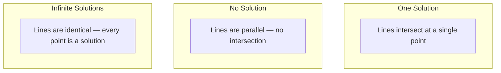

# 线性系统

> 求解Ax = b是数学中最古老的问题，它仍然运行着你的神经网络。

**Type:** Build
**Language:** Python
**Prerequisites:** Phase 1, Lessons 01 (Linear Algebra Intuition), 02 (Vectors & Matrices), 03 (Matrix Transformations)
**Time:** ~120 minutes

## 学习目标

- 用高斯消去法求解Ax = b
- 因子矩阵与LU， QR，和Cholesky分解和解释当每个是适当的
- 导出最小二乘的正规方程，并将其与线性回归和脊回归联系起来
- 利用条件数对病态系统进行诊断，并应用正则化使其稳定

## 这个问题

每次你训练一个线性回归，你解一个线性系统。每次你计算最小二乘拟合，你都是在解一个线性系统。每次神经网络层计算当你加入正则化时，你修改了系统。当你使用高斯过程时，你对一个矩阵进行因式分解。当你求马氏距离的协方差矩阵的逆时，你解的是一个线性系统。

方程Ax = b随处可见。A是一个已知系数的矩阵。B是已知输出的向量。X是你想求的未知数向量。在线性回归中，A是你的数据矩阵，b是你的目标向量，x是权重向量。整个模型简化为：找到x使Ax尽可能接近b。

本课从头开始构建求解该方程的每个主要方法。你会明白为什么有些方法快速而有些方法稳定，为什么有些方法只适用于平方系统而另一些方法处理超定系统，以及为什么矩阵的条件数决定了你的答案是否有意义。

## 这个概念

### Ax = b在几何上意味着什么

线性方程组有几何解释。每个方程定义一个超平面。解是所有超平面相交的点（或点的集合）。

```
2x + y = 5          Two lines in 2D.
x - y  = 1          They intersect at x=2, y=1.
```

“‘美人鱼
图LR
A[“2x + y = 5”]—S[“解：（2,1）”]
B["x - y = 1"]——S
```

Three things can happen:



在矩阵形式中，“一个解”意味着A是可逆的。“No solution”表示系统不一致。无穷解意味着A有一个零空间。大多数ML问题都属于“无精确解”的范畴，因为方程（数据点）比未知数（参数）要多。这就是最小二乘的用武之地。

### 列图vs行图

有两种方法来表示Ax = b。

**坐标图。** A的每一行定义一个方程。每个方程都是一个超平面。解就是它们的交点。

**矢量图。A的每一列都是一个向量。问题变成：A的列的什么线性组合产生b？

```
A = | 2  1 |    b = | 5 |
    | 1 -1 |        | 1 |

Row picture: solve 2x + y = 5 and x - y = 1 simultaneously.

Column picture: find x1, x2 such that:
  x1 * [2, 1] + x2 * [1, -1] = [5, 1]
  2 * [2, 1] + 1 * [1, -1] = [4+1, 2-1] = [5, 1]   check.
```

柱状图更为基本。如果b在A的列空间中，这个系统就有解。如果b不存在，就找到列空间中最近的点。最近的点就是最小二乘解。

### 高斯消去法

高斯消元法将Ax = b变换成上三角方程组Ux = c通过反代入求解。这是最直接的方法。

该算法:

```
1. For each column k (the pivot column):
   a. Find the largest entry in column k at or below row k (partial pivoting).
   b. Swap that row with row k.
   c. For each row i below k:
      - Compute multiplier m = A[i][k] / A[k][k]
      - Subtract m times row k from row i.
2. Back substitute: solve from the last equation upward.
```

例子:

```
Original:
| 2  1  1 | 8 |       R2 = R2 - (2)R1     | 2  1   1 |  8 |
| 4  3  3 |20 |  -->  R3 = R3 - (1)R1 --> | 0  1   1 |  4 |
| 2  3  1 |12 |                            | 0  2   0 |  4 |

                       R3 = R3 - (2)R2     | 2  1   1 |  8 |
                                       --> | 0  1   1 |  4 |
                                           | 0  0  -2 | -4 |

Back substitute:
  -2 * x3 = -4    -->  x3 = 2
  x2 + 2  = 4     -->  x2 = 2
  2*x1 + 2 + 2 = 8 --> x1 = 2
```

高斯消去需要O（n^3）次运算。对于1000x1000的系统，这大约是10亿个浮点操作。很快，但如果你需要用相同的A解决多个系统，你可以做得更好。

### 部分转向：为什么它很重要

没有旋转，高斯消去可能失败或产生垃圾。如果主元素是0，就除以0。如果它很小，就会放大舍入误差。

```
Bad pivot:                       With partial pivoting:
| 0.001  1 | 1.001 |            Swap rows first:
| 1      1 | 2     |            | 1      1 | 2     |
                                 | 0.001  1 | 1.001 |
m = 1/0.001 = 1000              m = 0.001/1 = 0.001
R2 = R2 - 1000*R1               R2 = R2 - 0.001*R1
| 0.001  1     | 1.001   |      | 1      1     | 2     |
| 0     -999   | -999.0  |      | 0      0.999 | 0.999 |

x2 = 1.000 (correct)            x2 = 1.000 (correct)
x1 = (1.001 - 1)/0.001          x1 = (2 - 1)/1 = 1.000 (correct)
   = 0.001/0.001 = 1.000        Stable because the multiplier is small.
```

在精度有限的浮点运算中，无枢轴版本可能会丢失有效数字。偏枢轴总是选择最大的可用枢轴，以最小化误差放大。

### LU分解

LU分解因子A为下三角矩阵L和上三角矩阵U: A = LU。L矩阵存储来自高斯消去的乘法器。U矩阵是消去的结果。

```
A = L @ U

| 2  1  1 |   | 1  0  0 |   | 2  1   1 |
| 4  3  3 | = | 2  1  0 | @ | 0  1   1 |
| 2  3  1 |   | 1  2  1 |   | 0  0  -2 |
```

为什么是因式而不是消去式？因为一旦你有了L和U，解出任何新的b的Ax = b只需要O（n^2）

```
Ax = b
LUx = b
Let y = Ux:
  Ly = b    (forward substitution, O(n^2))
  Ux = y    (back substitution, O(n^2))
```

在分解过程中只需要支付一次O（n^3）的代价。每个后续解都是O（n²）如果您需要求解具有相同A但不同b向量的1000个系统，那么LU可以节省1000/3的总工作量。

对于部分枢轴，你得到PA = LU，其中P是记录行交换的排列矩阵。

### QR分解

QR分解因子A为正交矩阵Q和上三角矩阵R: A = QR。

一个正交矩阵具有Q^ tq = i的性质，它的列是正交向量。乘以Q保持长度和角度不变。

```
A = Q @ R

Q has orthonormal columns: Q^T Q = I
R is upper triangular

To solve Ax = b:
  QRx = b
  Rx = Q^T b    (just multiply by Q^T, no inversion needed)
  Back substitute to get x.
```

在求解最小二乘问题时，QR在数值上比LU更稳定。Gram-Schmidt过程逐列构建Q：

```
Given columns a1, a2, ... of A:

q1 = a1 / ||a1||

q2 = a2 - (a2 . q1) * q1        (subtract projection onto q1)
q2 = q2 / ||q2||                (normalize)

q3 = a3 - (a3 . q1) * q1 - (a3 . q2) * q2
q3 = q3 / ||q3||

R[i][j] = qi . aj    for i <= j
```

每一步都去掉前面所有q向量的分量，只留下新的正交方向。

### 柯列斯基分解

当A是对称的（A = A^T）并且是正定的（所有特征值都是正的），你可以把它分解为A = L L^T，其中L是下三角形。这是Cholesky分解。

```
A = L @ L^T

| 4  2 |   | 2  0 |   | 2  1 |
| 2  5 | = | 1  2 | @ | 0  2 |

L[i][i] = sqrt(A[i][i] - sum(L[i][k]^2 for k < i))
L[i][j] = (A[i][j] - sum(L[i][k]*L[j][k] for k < j)) / L[j][j]    for i > j
```

Cholesky的速度是LU的两倍，所需的存储空间只有LU的一半。它只适用于对称正定矩阵，但它们经常出现：

- 协方差矩阵是对称的正半定矩阵（正定带正则化）。
- 高斯过程的核矩阵是对称正定的。
- 凸函数在最小值处的Hessian是对称正定的。
- A^ ta总是对称的正半定的。

在高斯过程中，你用Cholesky因子分解核矩阵K，然后解K = y得到预测均值。Cholesky因子还提供了边际似然的对数行列式：log det(K) = 2 * sum（log(diag(L))）。

### 最小二乘：当Ax = b没有精确解时

如果A是m × n，其中m bbb10n（方程多于未知数），则系统是过定的。没有确切的解。相反，你可以最小化平方误差：

```
minimize ||Ax - b||^2

This is the sum of squared residuals:
  sum((A[i,:] @ x - b[i])^2 for i in range(m))
```

最小化器满足正规方程：

```
A^T A x = A^T b
```

推导：展开||Ax - b||^2 = (Ax - b)^T (Ax - b) = x^T A^T Ax - 2 x^T A^T b + b^T b，求关于x的梯度，设它为0:2a ^T Ax - 2a ^T b = 0。

```
Original system (overdetermined, 4 equations, 2 unknowns):
| 1  1 |         | 3 |
| 1  2 | x     = | 5 |       No exact x satisfies all 4 equations.
| 1  3 |         | 6 |
| 1  4 |         | 8 |

Normal equations:
A^T A = | 4  10 |    A^T b = | 22 |
        | 10 30 |            | 63 |

Solve: x = [1.5, 1.7]

This is linear regression. x[0] is the intercept, x[1] is the slope.
```

### 正态方程=线性回归

这种联系是精确的。在线性回归中，数据矩阵X每个样本有一行，每个特征有一列。你的目标向量y每个样本有一个元素。权向量w满足：

```
X^T X w = X^T y
w = (X^T X)^(-1) X^T y
```

这是线性回归的封闭解。每一个电话

在矩阵中加入正则化项* I，就得到脊回归：

```
(X^T X + lambda * I) w = X^T y
w = (X^T X + lambda * I)^(-1) X^T y
```

正则化使矩阵条件更好（更容易准确地反转），并通过将权重缩小到零来防止过拟合。矩阵X^T X + * I总是对称正定的当> 0，所以你可以用Cholesky来解它。

### 伪逆(Moore-Penrose)

伪逆A+将矩阵反演推广到非平方矩阵和奇异矩阵。对于任意矩阵A：

```
x = A+ b

where A+ = V Sigma+ U^T    (computed via SVD)
```

Sigma+是通过取每个非零奇异值的倒数并对结果进行转置而形成的。如果A = U∑V^T，那么A+ = V∑+ U^T。

```
A = U Sigma V^T        (SVD)

Sigma = | 5  0 |       Sigma+ = | 1/5  0  0 |
        | 0  2 |                | 0  1/2  0 |
        | 0  0 |

A+ = V Sigma+ U^T
```

伪逆给出了最小范数最小二乘解。如果系统有：
- 一个解决方案：A+ b。
- 无解：A+ b给出最小二乘解。
- 无限解：A+ b给出最小的||x||。

NumPy的

### 条件数

条件数衡量的是溶液对输入的微小变化的敏感程度。对于矩阵a，条件数为：

```
kappa(A) = ||A|| * ||A^(-1)|| = sigma_max / sigma_min
```

其中sigma_max和sigma_min是最大和最小的奇异值。

```
Well-conditioned (kappa ~ 1):        Ill-conditioned (kappa ~ 10^15):
Small change in b -->                Small change in b -->
small change in x                    huge change in x

| 2  0 |   kappa = 2/1 = 2          | 1   1          |   kappa ~ 10^15
| 0  1 |   safe to solve            | 1   1+10^(-15) |   solution is garbage
```

经验法则：
- Kappa < 100：安全，溶液准确。
- Kappa ~ 10^k：你的浮点运算失去了大约k位精度。
- Kappa ~ 10^16（对于float64）：解没有意义。这个矩阵是有效奇异的。

在机器学习中，当特征几乎共线时，就会发生条件反射不良。正则化（添加lambda * I）将条件数从sigma_max / sigma_min提高到(sigma_max + lambda) / (sigma_min + lambda)。

### 迭代法：共轭梯度法

对于非常大的稀疏系统（数以百万计的未知数），像LU或Cholesky这样的直接方法太昂贵了。迭代方法通过在多次迭代中改进猜测来近似解。

当A是对称正定时，共轭梯度（CG）求解Ax = b。它最多在n次迭代中找到精确的解（在精确的算术中），但如果A的特征值是聚类的，通常会收敛得更快。

```
Algorithm sketch:
  x0 = initial guess (often zero)
  r0 = b - A x0           (residual)
  p0 = r0                 (search direction)

  For k = 0, 1, 2, ...:
    alpha = (rk . rk) / (pk . A pk)
    x_{k+1} = xk + alpha * pk
    r_{k+1} = rk - alpha * A pk
    beta = (r_{k+1} . r_{k+1}) / (rk . rk)
    p_{k+1} = r_{k+1} + beta * pk
    if ||r_{k+1}|| < tolerance: stop
```

CG用于：
- 大规模优化（牛顿- cg法）
- 求解PDE离散化
- 核矩阵太大而不能因式分解的核方法
- 其他迭代解的预处理

收敛速度取决于条件数。条件好的系统收敛得更快，这是正则化有用的另一个原因。

### 全图：什么时候用什么方法

| Method | Requirements | Cost | Use case |
|--------|-------------|------|----------|
| Gaussian elimination | Square, nonsingular A | O(n^3) | One-off solve of a square system |
| LU decomposition | Square, nonsingular A | O(n^3) factor + O(n^2) solve | Multiple solves with the same A |
| QR decomposition | Any A (m >= n) | O(mn^2) | Least squares, numerically stable |
| Cholesky | Symmetric positive definite A | O(n^3/3) | Covariance matrices, Gaussian processes, ridge regression |
| Normal equations | Overdetermined (m > n) | O(mn^2 + n^3) | Linear regression (small n) |
| SVD / pseudoinverse | Any A | O(mn^2) | Rank-deficient systems, minimum-norm solutions |
| Conjugate gradient | Symmetric positive definite, sparse A | O(n * k * nnz) | Large sparse systems, k = iterations |

### 连接到ML

本课中的每个方法都会出现在生产ML中：

**线性回归。**封闭形式的解决方案解决了常规方程X^T X w = X^T y。这是通过Cholesky（如果n很小）或QR（如果数值稳定性重要）或SVD（如果矩阵可能是秩缺陷）完成的。

**岭回归。**将* I加上X^T X正则化系统（X^T X + * I） w = X^T y总是可以通过Cholesky解因为X^T X + * I对于>是对称正定的。

**高斯过程。**预测均值需要求解K α = y，其中K是核矩阵。K的Cholesky分解是标准的方法。对数边际似然使用log det(K) = 2 sum（log(diag(L))）。

**神经网络初始化。**正交初始化使用QR分解来创建列正交的权重矩阵。这可以防止深度网络中的信号崩溃。

**预处理。**大规模优化器使用不完全Cholesky或不完全LU作为共轭梯度解算的前置条件。

**工程特性。** X^ tx的条件数告诉你特征是否共线。如果kappa较大，则删除特征或添加正则化。

## 构建它

### 步骤1：高斯消去与部分枢轴

”“python
导入numpy为np

defgaussian_elimination (A, b)：
N = len(b)
[A] . [A] . [b] . [c]Astype (float), b.t reshape（- 1,1).astype(float)]）

对于k在(n)范围内：
Max_row = k + np.argmax(np。abs (Ab (k, k)))
Ab[[k, max_row]] = Ab[[max_row, k]]

如果abs(Ab[k, k]) < 1e-12：
引发ValueError（f“矩阵在枢轴{k}处是奇异或近似奇异”）

对于I在（k + 1, n）范围内：
m = Ab[i, k] / Ab[k, k]
Ab[i, k:] -= m * Ab[k, k:]

X = np。0 (n)
对于I在（n -1, -1, -1）范围内：
x[我]= (Ab[1]我- Ab[我+ 1:n] @ x [i + 1: n]) / Ab(我)

返回x
```

### Step 2: LU decomposition

```python
def lu_decompose(A):
    n = A.shape[0]
    L = np.eye(n)
    U = A.astype(float).copy()
    P = np.eye(n)

    for k in range(n):
        max_row = k + np.argmax(np.abs(U[k:, k]))
        if max_row != k:
            U[[k, max_row]] = U[[max_row, k]]
            P[[k, max_row]] = P[[max_row, k]]
            if k > 0:
                L[[k, max_row], :k] = L[[max_row, k], :k]

        for i in range(k + 1, n):
            L[i, k] = U[i, k] / U[k, k]
            U[i, k:] -= L[i, k] * U[k, k:]

    return P, L, U

def lu_solve(P, L, U, b):
    n = len(b)
    Pb = P @ b.astype(float)

    y = np.zeros(n)
    for i in range(n):
        y[i] = Pb[i] - L[i, :i] @ y[:i]

    x = np.zeros(n)
    for i in range(n - 1, -1, -1):
        x[i] = (y[i] - U[i, i+1:] @ x[i+1:]) / U[i, i]

    return x
```

### 步骤3:Cholesky分解

”“python
def柯列斯基(一个):
n = A.shape[0]
L = np。zeros_like (A, dtype =浮动)

对于I在(n)范围内：
对于范围（i + 1）中的j：
s = A[i, j] - L[i,:j] @ L[j,:j]
如果I == j：
如果s <= 0：
抛出ValueError（“矩阵不是正定的”）
L[i, j] = np.sqrt(s)
其他:
L[i, j] = s / L[j, j]

返回L
```

### Step 4: Least squares via normal equations

```python
def least_squares_normal(A, b):
    AtA = A.T @ A
    Atb = A.T @ b
    return gaussian_elimination(AtA, Atb)

def ridge_regression(A, b, lam):
    n = A.shape[1]
    AtA = A.T @ A + lam * np.eye(n)
    Atb = A.T @ b
    L = cholesky(AtA)
    y = np.zeros(n)
    for i in range(n):
        y[i] = (Atb[i] - L[i, :i] @ y[:i]) / L[i, i]
    x = np.zeros(n)
    for i in range(n - 1, -1, -1):
        x[i] = (y[i] - L.T[i, i+1:] @ x[i+1:]) / L.T[i, i]
    return x
```

### 第五步：条件编号

”“python
def condition_number(一个):
U， S, Vt = np. linag .svd(A)
返回S[0] / S[-1]
```

## Use It

Putting the pieces together for linear regression and ridge regression on real data:

```python
np.random.seed(42)
X_raw = np.random.randn(100, 3)
w_true = np.array([2.0, -1.0, 0.5])
y = X_raw @ w_true + np.random.randn(100) * 0.1

X = np.column_stack([np.ones(100), X_raw])

w_ols = least_squares_normal(X, y)
print(f"OLS weights (ours):    {w_ols}")

w_np = np.linalg.lstsq(X, y, rcond=None)[0]
print(f"OLS weights (numpy):   {w_np}")
print(f"Max difference: {np.max(np.abs(w_ols - w_np)):.2e}")

w_ridge = ridge_regression(X, y, lam=1.0)
print(f"Ridge weights (ours):  {w_ridge}")

from sklearn.linear_model import Ridge
ridge_sk = Ridge(alpha=1.0, fit_intercept=False)
ridge_sk.fit(X, y)
print(f"Ridge weights (sklearn): {ridge_sk.coef_}")
```

## 船这

这一课产生：
- Z0
- 一个正常方程和sklearn的线性回归产生相同权重的工作演示

## 练习

1. 解决系统问题验证所有三个在浮点公差范围内给出相同的答案。

2. 生成一个50x5随机矩阵X，目标y = X @ w_true + noise。用正规方程求解w， QR (via比较所有四种解决方案。测量X^T X的条件数，并解释它如何影响您信任的方法。

3. 通过使两列几乎相同来创建一个几乎奇异的矩阵（例如，列2 =列1 + 1e-10 *噪声）。计算它的条件数。求解有正则化和没有正则化的Ax = b（加0.01 * I）。比较解和残差。解释为什么正则化有帮助。

4. 实现一个100x100随机对称正定矩阵的共轭梯度算法。计算收敛到容差1e-8需要多少次迭代。与n次迭代的理论最大值比较。

5. 计算一下Cholesky解算器和LU解算器的时间绘制结果。验证Cholesky大约比LU快2倍。

## 关键术语

| Term | What people say | What it actually means |
|------|----------------|----------------------|
| Linear system | "Solve for x" | A set of linear equations Ax = b. Finding x means finding the input that produces output b under transformation A. |
| Gaussian elimination | "Row reduce" | Systematically zero out entries below the diagonal using row operations, producing an upper triangular system solvable by back substitution. O(n^3). |
| Partial pivoting | "Swap rows for stability" | Before eliminating in column k, swap the row with the largest absolute value in that column to the pivot position. Prevents division by small numbers. |
| LU decomposition | "Factor into triangles" | Write A = LU where L is lower triangular (stores multipliers) and U is upper triangular (the eliminated matrix). Amortizes the O(n^3) cost over multiple solves. |
| QR decomposition | "Orthogonal factorization" | Write A = QR where Q has orthonormal columns and R is upper triangular. More stable than LU for least squares. |
| Cholesky decomposition | "Square root of a matrix" | For symmetric positive definite A, write A = LL^T. Half the cost of LU. Used for covariance matrices, kernel matrices, and ridge regression. |
| Least squares | "Best fit when exact is impossible" | Minimize the sum of squared residuals ||Ax - b||^2 when the system is overdetermined (more equations than unknowns). |
| Normal equations | "The calculus shortcut" | A^T A x = A^T b. Setting the gradient of ||Ax - b||^2 to zero. This IS the closed-form solution to linear regression. |
| Pseudoinverse | "Inversion for non-square matrices" | A+ = V Sigma+ U^T via SVD. Gives the minimum-norm least-squares solution for any matrix, square or rectangular, singular or not. |
| Condition number | "How trustworthy is this answer" | kappa = sigma_max / sigma_min. Measures sensitivity to input perturbations. Lose about log10(kappa) digits of precision. |
| Ridge regression | "Regularized least squares" | Solve (X^T X + lambda I) w = X^T y. Adding lambda I improves conditioning and shrinks weights toward zero. Prevents overfitting. |
| Conjugate gradient | "Iterative Ax=b for big matrices" | An iterative solver for symmetric positive definite systems. Converges in at most n steps. Practical for large sparse systems where factorization is too expensive. |
| Overdetermined system | "More data than parameters" | m > n in an m-by-n system. No exact solution exists. Least squares finds the best approximation. This is every regression problem. |
| Back substitution | "Solve from the bottom up" | Given an upper triangular system, solve the last equation first, then substitute backward. O(n^2). |
| Forward substitution | "Solve from the top down" | Given a lower triangular system, solve the first equation first, then substitute forward. O(n^2). Used in the L step of LU solves. |

## 进一步的阅读

- [MIT 18.06：线性代数](https://ocw.mit.edu/courses/18-06-linear-algebra-spring-2010/) （Gilbert Strang）——线性系统和矩阵分解的权威课程
- [数值线性代数](https://people.maths.ox.ac.uk/trefethen/text.html) （Trefethen & Bau）——理解数值稳定性、条件作用和算法失败原因的标准参考
- [矩阵计算](https://www.cs.cornell.edu/cv/GolubVanLoan4/golubandvanloan.htm) （Golub & VanLoan）——所有矩阵算法的百科全书式参考
- [3Blue1Brown: Inverse Matrices]（https://www.3blue1brown.com/lessons/inverse-matrices）——直观地了解求解Ax = b的几何意义