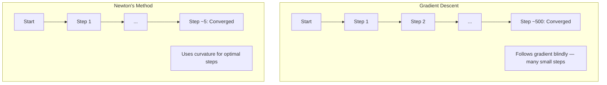
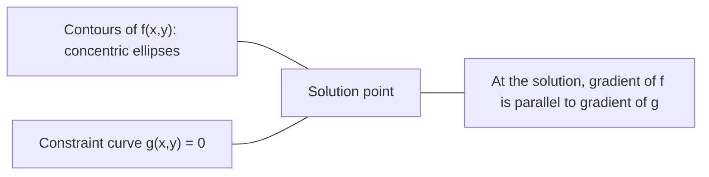

# 凸优化

> 凸问题有一个谷值。神经网络有数百万个。了解两者的区别很重要。

**Type:** Build
**Language:** Python
**Prerequisites:** Phase 1, Lessons 04 (Calculus for ML), 08 (Optimization)
**Time:** ~90 minutes

## 学习目标

- 测试是否一个函数是凸使用定义，二阶导数，和黑森标准
- 实现牛顿法，并比较其二次收敛性与梯度下降
- 用拉格朗日乘子求解约束优化问题，解释KKT条件
- 解释为什么神经网络损失景观是非凸的，而SGD仍然找到很好的解决方案

## 这个问题

第08课教你梯度下降，动量和亚当。那些优化者在任何表面上都走下坡。但它们没有保证。非凸地形上的梯度下降可能会落在一个糟糕的局部最小值上，卡在鞍点上，或者永远振荡。你还是用它，因为神经网络是非凸的，没有别的选择。

但是机器学习中的许多问题都是凸的。线性回归，逻辑回归，支持向量机，LASSO，岭回归。对于这些，存在着更强大的东西：具有数学保证的优化。一个凸问题只有一个谷值。任何向下走的算法都会达到全局最小值。不需要重启。没有学习率计划。没有祷告。

理解凸性可以做三件事。首先，它告诉你你的问题什么时候容易（凸），什么时候难（非凸）。其次，它提供了更快的工具，比如求解凸问题的牛顿方法。第三，它解释了ML中出现的概念：正则化作为约束，支持向量机中的对偶性，以及为什么深度学习在违反凸性给你的每一个好的属性的情况下仍然有效。

## 这个概念

### 凸集

一个集合S是凸的，如果对于S中的任意两点，它们之间的线段也完全在S中。

| Convex sets | Not convex |
|---|---|
| **Rectangle**: any two points inside can be connected by a line segment that stays inside | **Star/crescent shape**: a line between two interior points can pass outside the set |
| **Triangle**: same property holds for all interior points | **Donut/annulus**: the hole means some line segments leave the set |
| The line segment between any two points stays within the set | The line segment between some pairs of points exits the set |

形式检验：对于S中的任意点x， y和[0,1]中的任意点t，点tx + (1-t)y也在S中。

凸集的例子：
- 一条直线，一个平面，都是R^n
- 球（圆、球、超球）
- 半空间：{x: A ^T x <= b}
- 任意数目的凸集的交

非凸集的例子：
- 甜甜圈（环形）
- 两个不相交的圆的并
- 任何有“凹痕”或“洞”的套装

### 凸函数

如果函数f的def 域是凸集，且对于def 域内任意两点x， y和[0,1]中的任意一点t，函数f是凸的：

```
f(tx + (1-t)y) <= t*f(x) + (1-t)*f(y)
```

几何上：图上任意两点之间的线段位于图上或图上。

| Property | Convex function | Non-convex function |
|---|---|---|
| **Line segment test** | The line between any two points on the graph lies **above or on** the curve | The line between some points on the graph dips **below** the curve |
| **Shape** | Single bowl/valley curving upward | Multiple peaks and valleys with mixed curvature |
| **Local minima** | Every local minimum is the global minimum | Multiple local minima may exist at different heights |

常用凸函数：
- F (x) = x^2（抛物线）
- F (x) = |x|（绝对值）
- F (x) = e^x（指数）
- f(x) = max(0, x) （ReLU，分段线性）
- F (x) = -log(x)对于x > 0（负对数）
- 任意线性函数f(x) = a^T x + b（凸和凹）

### 凸性测试

三个实际测试，从最简单到最严格。

**检验1：二阶导数检验（1D）。**如果f''(x) >= 0，那么f是凸的。

- F (x) = x^2: F ''(x) = 2 >= 0。凸的。
- F (x) = x^3: F '(x) = 6x。x < 0时为负。不是凸。
- F (x) = e^x: F ''(x) = e^x > 0。凸的。

**检验2:Hessian检验（多变量）。**如果Hessian矩阵H(x)对所有x都是正半定的，则f是凸的。黑森矩阵是二阶偏导数的矩阵。

**测试3：def 测试。**直接检查不等式f(tx + (1-t)y) <= t*f(x) + (1-t)*f(y)。对于导数难以计算的函数很有用。

### 为什么凸性很重要

凸优化的中心定理：

*对于一个凸函数，每一个局部极小值都是一个全局极小值

这意味着梯度下降不会被困住。任何下坡路都指向同一个答案。该算法保证收敛到最优解。

“‘mermaid
图LR
子图“凸：一个答案”
方向结核病
C2[“梯度下降总是找到全局最小值”]
结束
子图“非凸：许多陷阱”
方向结核病
N1[“损失面有多个谷和峰”]—> N2[“梯度下降可能陷入局部最小值”]
N2—> N3[“可能错过全局最小值”]
结束
```

Consequences:
- No need for random restarts
- No need for sophisticated learning rate schedules
- Convergence proofs are possible (rate depends on function properties)
- The solution is unique (up to flat regions)

### Convex vs non-convex in ML

| Problem | Convex? | Why |
|---------|---------|-----|
| Linear regression (MSE) | Yes | Loss is quadratic in weights |
| Logistic regression | Yes | Log-loss is convex in weights |
| SVM (hinge loss) | Yes | Maximum of linear functions |
| LASSO (L1 regression) | Yes | Sum of convex functions is convex |
| Ridge regression (L2) | Yes | Quadratic + quadratic = convex |
| Neural network (any loss) | No | Nonlinear activations create non-convex landscape |
| k-means clustering | No | Discrete assignment step |
| Matrix factorization | No | Product of unknowns |

Linear models with convex losses are convex. The moment you add hidden layers with nonlinear activations, convexity breaks.

### The Hessian matrix

The Hessian H of a function f: R^n -> R is the n x n matrix of second partial derivatives.

```
H[i][j] = d^2 f / （dx_i dx_j）
```

For f(x, y) = x^2 + 3xy + y^2:

```
df/dx = 2x + 3y       d^2f/dx^2 = 2      d^2f/dxdy = 3
df/dy = 3x + 2y       d^2f/dydx = 3      d^2f/dy^2 = 2

H = [2 3]
[32]
```

The Hessian tells you about curvature:
- Eigenvalues all positive: the function curves upward in every direction (convex at that point)
- Eigenvalues all negative: curves downward in every direction (concave, a local max)
- Mixed signs: saddle point (curves up in some directions, down in others)
- Zero eigenvalue: flat in that direction (degenerate)

For convexity, the Hessian must be positive semidefinite (all eigenvalues >= 0) everywhere, not just at one point.

### Newton's method

Gradient descent uses first-order information (the gradient). Newton's method uses second-order information (the Hessian). It fits a quadratic approximation at the current point and jumps directly to the minimum of that quadratic.

```
更新规则:
x_new = x - H^(-1) *梯度

与梯度下降相比：
X_new = x - lr * gradient
```

Newton's method replaces the scalar learning rate with the inverse Hessian. This automatically adjusts the step size and direction based on local curvature.



优点:
- 接近最小值的二次收敛（每步误差平方）
- 没有调音的学习率
- 尺度不变（无论如何参数化问题都有效）

缺点:
- 计算Hessian需要O（n^2）的内存和O（n^3）的反转
- 对于一个有100万个权重的神经网络，那就是10^12个条目和10^18个操作
- 对于深度学习来说不实用

### 约束优化

无约束优化：最小化f(x)除以所有x。
约束优化：最小化受约束的f(x)。

真正的问题是有限制的。你想把成本降到最低，但你的预算有限。你想要最小化错误，但是你的模型复杂性是有限的。

“‘mermaid
图LR
子图“不受限制”
U1[“损失函数”]—> U2[“自由最小值：损失面最低点”]
结束
子图“限制”
C1[“损失函数”]—> C2[“约束最小值：可行区域内的最低点”]
C3[“约束边界限制搜索空间”]
结束
```

### Lagrange multipliers

The method of Lagrange multipliers converts a constrained problem into an unconstrained one.

Problem: minimize f(x) subject to g(x) = 0.

Solution: introduce a new variable (the Lagrange multiplier lambda) and solve the unconstrained problem:

```
L(x,) = f(x) + * g(x)
```

At the solution, the gradient of L is zero:

```
dL/dx = df/dx + * dg/dx = 0
dL/ dλ = g(x) = 0
```

Geometric intuition: at the constrained minimum, the gradient of f must be parallel to the gradient of the constraint g. If they were not parallel, you could move along the constraint surface and reduce f further.



例子：最小化f(x,y) = x^2 + y^2，满足x + y = 1。

```
L = x^2 + y^2 + lambda(x + y - 1)

dL/dx = 2x + lambda = 0  =>  x = -lambda/2
dL/dy = 2y + lambda = 0  =>  y = -lambda/2
dL/dlambda = x + y - 1 = 0

From first two: x = y
Substituting: 2x = 1, so x = y = 0.5, lambda = -1
```

直线x + y = 1上离原点最近的点是（0.5,0.5）。

### 马条件

Karush-Kuhn-Tucker条件将拉格朗日乘数扩展到不等式约束。

题目：最小化f(x)，满足g_i(x) <= 0，当i = 1，…, m。

KKT条件（最优性的必要条件）：

```
1. Stationarity:    df/dx + sum(lambda_i * dg_i/dx) = 0
2. Primal feasibility:  g_i(x) <= 0  for all i
3. Dual feasibility:    lambda_i >= 0  for all i
4. Complementary slackness:  lambda_i * g_i(x) = 0  for all i
```

互补松弛是关键的洞见：要么约束是有效的（g_i = 0，解位于边界上），要么乘数为零（约束无关紧要）。不影响解的约束有= 0。

KKT条件是svm的核心。支持向量是约束活动的数据点（lambda > 0）。所有其他数据点lambda = 0，不影响决策边界。

### 正则化作为约束优化

L1和L2正则化不是任意的技巧。它们是伪装的约束优化问题。

**L2正则化（Ridge）：**

```
minimize  Loss(w)  subject to  ||w||^2 <= t

Equivalent unconstrained form:
minimize  Loss(w) + lambda * ||w||^2
```

约束||w||^2 <= tdef 了一个球（2D的圆，3D的球）。解决方案是损失轮廓首先接触这个球的地方。

*L1正则化（LASSO）：**

```
minimize  Loss(w)  subject to  ||w||_1 <= t

Equivalent unconstrained form:
minimize  Loss(w) + lambda * ||w||_1
```

约束||w||_1 <= tdef 了一个菱形（在2D中旋转的正方形）。

| Property | L2 constraint (circle) | L1 constraint (diamond) |
|---|---|---|
| **Constraint shape** | Circle (sphere in higher dims) | Diamond (rotated square in 2D) |
| **Where loss contour touches** | Smooth boundary — any point on the circle | Corner — aligned with an axis |
| **Solution behavior** | Weights are small but nonzero | Some weights are exactly zero (sparse) |
| **Result** | Weight shrinkage | Feature selection |

这解释了为什么L1产生稀疏模型（特征选择），而L2只缩小权重。菱形的角与轴线对齐。损失轮廓更有可能碰到一个角，将一个或多个权重精确地设置为零。

### 二元性

每个约束优化问题（原始问题）都有一个伴生问题（对偶问题）。对于凸问题，原解和对偶解具有相同的最优值。这是很强的对偶性。

拉格朗日对偶函数：

```
Primal: minimize f(x) subject to g(x) <= 0
Lagrangian: L(x, lambda) = f(x) + lambda * g(x)
Dual function: d(lambda) = min_x L(x, lambda)
Dual problem: maximize d(lambda) subject to lambda >= 0
```

为什么二元性很重要：
- 对偶问题有时比原始问题更容易解决
- 支持向量机以对偶形式解决，其中问题取决于数据点之间的点积（启用核技巧）。
- 对偶提供了最优解的下界，对检查解的质量很有用

对于svm：

```
Primal: find w, b that maximize the margin 2/||w|| subject to
        y_i(w^T x_i + b) >= 1 for all i

Dual:   maximize sum(alpha_i) - 0.5 * sum_ij(alpha_i * alpha_j * y_i * y_j * x_i^T x_j)
        subject to alpha_i >= 0 and sum(alpha_i * y_i) = 0

The dual only involves dot products x_i^T x_j.
Replace x_i^T x_j with K(x_i, x_j) to get the kernel trick.
```

### 为什么深度学习可以在非凸性的情况下工作

神经网络损失函数是非凸的。从每一个经典标准来看，优化它们都是失败的。而随机梯度下降法能可靠地找到好的解。有几个因素可以解释这一点。

**大多数局部最小值都足够好。**在高维空间中，随机临界点（梯度为零）绝大多数是鞍点，而不是局部最小值。存在的少数局部最小值往往具有接近全局最小值的损失值。当参数空间有数百万维时，陷入可怕的局部最小值是极不可能的。

**鞍点，而不是局部最小值，才是真正的障碍。**在有n个参数的函数中，鞍点有正曲率方向和负曲率方向的混合。对于高维的随机临界点，所有n个特征值为正（局部最小值）的概率大致为2^（-n）。几乎所有的临界点都是鞍点。SGD的噪音有助于逃离它们。

**过度参数化平滑景观。**与训练样例相比，具有更多参数的网络具有更平滑，连接更多的损失面。更广的网络有更少的坏的局部最小值。这是违反直觉的，但在经验上是一致的。

**损失景观结构：**

| Property | Low-dimensional space | High-dimensional space |
|---|---|---|
| **Landscape** | Many isolated peaks and valleys | Smoothly connected valleys |
| **Minima** | Many isolated local minima | Few bad local minima; most are near-optimal |
| **Navigation** | Hard to find global minimum | Many paths lead to good solutions |
| **Critical points** | Mix of local minima and saddle points | Overwhelmingly saddle points, not local minima |

**随机噪声作为隐式正则化。**小批量SGD增加噪音，防止沉降到尖锐的最小值。锐最小过拟合；平坦最小化。噪声偏置优化对平坦区域的损失景观。

### 实践中的二阶方法

纯牛顿法对大型模型来说是不切实际的。几个近似使二阶信息可用。

**L-BFGS（有限记忆BFGS）：**使用最后m梯度差近似逆Hessian。需要O（mn）内存而不是O（n^2）。适用于多达10,000个参数的问题。用于经典ML（逻辑回归，CRFs），但不用于深度学习。

**自然梯度：**使用Fisher信息矩阵（对数似然的期望Hessian）而不是标准Hessian。这说明了概率分布的几何形状。K-FAC （Kronecker因子近似曲率）将Fisher矩阵近似为Kronecker积，使其适用于神经网络。

***使用共轭梯度求解Hx = g，而不需要生成H.只需要hessian向量积，通过自动微分可以在O(n)时间内计算出来。

**对角线近似：**亚当的第二时刻是黑森对角线的对角线近似。AdaHessian通过Hutchinson的估计量使用实际的Hessian对角元素来扩展它。

| Method | Memory | Per-step cost | When to use |
|--------|--------|--------------|-------------|
| Gradient descent | O(n) | O(n) | Baseline, large models |
| Newton's method | O(n^2) | O(n^3) | Small convex problems |
| L-BFGS | O(mn) | O(mn) | Medium convex problems |
| Adam | O(n) | O(n) | Deep learning default |
| K-FAC | O(n) | O(n) per layer | Research, large-batch training |

## 构建它

### 第一步：凹凸检查

构建一个函数，通过采样点和检查def 来经验地测试凸性。

”“python
进口随机
导入数学

Def check_convexity(f, dim, bounds=(- 5,5), samples=1000)：
违规= 0
对于_in range(samples)：
X =[随机的。统一（*bounds） for _ in range(dim)]
Y =[随机的。统一（*bounds） for _ in range(dim)]
T =随机。制服(0,1)
Mid = [t * xi + (1 - t) * yi for xi, yi in zip(x, y)]
LHS = f（中）
RHS = t * f(x) + (1 - t) * f(y)
如果LHS b> RHS + 1e-10：
违规行为+= 1
返回违规== 0，违规
```

### Step 2: Newton's method for 2D

Implement Newton's method using an explicit Hessian. Compare convergence speed against gradient descent.

```python
def newtons_method(f, grad_f, hessian_f, x0, steps=50, tol=1e-12):
    x = list(x0)
    history = [x[:]]
    for _ in range(steps):
        g = grad_f(x)
        H = hessian_f(x)
        det = H[0][0] * H[1][1] - H[0][1] * H[1][0]
        if abs(det) < 1e-15:
            break
        H_inv = [
            [H[1][1] / det, -H[0][1] / det],
            [-H[1][0] / det, H[0][0] / det],
        ]
        dx = [
            H_inv[0][0] * g[0] + H_inv[0][1] * g[1],
            H_inv[1][0] * g[0] + H_inv[1][1] * g[1],
        ]
        x = [x[0] - dx[0], x[1] - dx[1]]
        history.append(x[:])
        if sum(gi ** 2 for gi in g) < tol:
            break
    return history
```

### 第三步：拉格朗日乘数求解

利用拉格朗日量上的梯度下降求解约束优化。

”“python
Def lagrange_solve(f_grad, g_val, g_grad, x0, lr=0.01，
lr_lambda = 0.01, = 5000步骤):
X = list(X)
Lam = 0.0
历史= []
For _ in range(steps)：
Fg = f_grad(x)
Gv = g_val(x)
Gg = g_grad(x)
X = [
Xi - lr * （fgi + lam * ggi）
对于zip（x, fg, gg）中的xi， fg, ggi
］
Lam = Lam + lr_lambda * gv
历史。追加（(x[:], lam, gv)）
回归历史
```

### Step 4: Compare first-order vs second-order

Run gradient descent and Newton's method on the same quadratic function. Count the steps to convergence.

```python
def quadratic(x):
    return 5 * x[0] ** 2 + x[1] ** 2

def quadratic_grad(x):
    return [10 * x[0], 2 * x[1]]

def quadratic_hessian(x):
    return [[10, 0], [0, 2]]
```

牛顿法一步就收敛了（它对二次方程是精确的）。梯度下降将需要数百步，因为黑森特征值相差5倍，形成一个细长的山谷。

## 使用它

在选择机器学习模型和求解器时，凸性分析直接适用。

对于凸问题（逻辑回归、支持向量机、LASSO）：
- 使用专用的求解器（linear, cvvxpy, scipy.optimize.minimize with method='L-BFGS-B'）
- 期待一个独特的全球解决方案
- 二阶方法实用、快速

对于非凸问题（神经网络）：
- 使用一阶方法（SGD, Adam）
- 接受解决方案取决于初始化和随机性
- 使用过参数化、噪声和学习率计划作为隐式正则化
- 不要浪费时间寻找全局最小值。一个好的局部最小值就足够了。

”“python
从scipy。优化导入最小化

result = minimize(
    fun=lambda w: sum((y - X @ w) ** 2) + 0.1 * sum(w ** 2),
    x0=np.zeros(d),
    method='L-BFGS-B',
    jac=lambda w: -2 * X.T @ (y - X @ w) + 0.2 * w,
)
```

For SVMs, the dual formulation lets you use the kernel trick:

```python
from sklearn.svm import SVC

svm = SVC(kernel='rbf', C=1.0)
svm.fit(X_train, y_train)
print(f"Support vectors: {svm.n_support_}")
```

## 练习

1. **凸性画廊。**使用检查器测试这些函数的凸性：f(x) = x^4, f(x) = sin(x), f(x,y) = x^2 + y^2, f(x,y) = x*y, f(x) = max（x, 0）。解释为什么每个结果都是有意义的。

2. **牛顿vs梯度下降比赛。**从起点（10,10）运行f(x,y) = 50*x^2 + y^2这两个方法。达到损耗< 1e-10需要多少步？当条件数（最大与最小的黑森特征值之比）增加时，梯度下降会发生什么？

3. **拉格朗日乘数几何。最小化f(x,y) = (x-3)^2 + (y-3)^2，满足x + 2y = 4。通过检查f的梯度是否平行于解处g的梯度来验证解。

4. **正则化约束。**实现l1约束优化：最小化（x-3）^2 + (y-2)^2服从|x| + |y| <= 1。证明解有一个坐标等于零（菱形约束的稀疏性）。

5. **Hessian特征值分析。**计算Rosenbrock函数在（1,1）和（-1,1）处的Hessian。计算两个点的特征值。特征值告诉了你曲率在最小值和远离它时的情况？

## 关键术语

| Term | What it means |
|------|---------------|
| Convex set | A set where the line segment between any two points in the set stays inside the set |
| Convex function | A function where the line between any two points on its graph lies above or on the graph. Equivalently, Hessian is positive semidefinite everywhere |
| Local minimum | A point lower than all nearby points. For convex functions, every local minimum is the global minimum |
| Global minimum | The lowest point of a function over its entire domain |
| Hessian matrix | The matrix of all second partial derivatives. Encodes curvature information |
| Positive semidefinite | A matrix whose eigenvalues are all non-negative. The multidimensional analogue of "second derivative >= 0" |
| Condition number | Ratio of largest to smallest eigenvalue of the Hessian. High condition number means elongated valleys and slow gradient descent |
| Newton's method | Second-order optimizer that uses the inverse Hessian to determine step direction and size. Quadratic convergence near the minimum |
| Lagrange multiplier | A variable introduced to convert a constrained optimization problem into an unconstrained one |
| KKT conditions | Necessary conditions for optimality with inequality constraints. Generalize Lagrange multipliers |
| Complementary slackness | At the solution, either a constraint is active or its multiplier is zero. Never both nonzero |
| Duality | Every constrained problem has a companion dual problem. For convex problems, both have the same optimal value |
| Strong duality | Primal and dual optimal values are equal. Holds for convex problems satisfying Slater's condition |
| L-BFGS | Approximate second-order method that stores the last m gradient differences instead of the full Hessian |
| Saddle point | A point where the gradient is zero but it is a minimum in some directions and a maximum in others |
| Overparameterization | Using more parameters than training examples. Smooths the loss landscape and reduces bad local minima |

## 进一步的阅读

- [Boyd & Vandenberghe：凸优化](https://web.stanford.edu/~boyd/cvxbook/) -标准教科书，免费在线提供
- [Bottou, Curtis， Nocedal：大规模机器学习的优化方法（2018）](https://arxiv.org/abs/1606.04838) -连接凸优化理论和深度学习实践
- [Choromanska等人：多层网络的损失面（2015）](https://arxiv.org/abs/1412.0233) -为什么非凸神经网络景观并不像看起来那么糟糕
- [Nocedal & Wright：数值优化](https://link.springer.com/book/10.1007/978-0-387-40065-5) -牛顿方法、L-BFGS和约束优化的综合参考