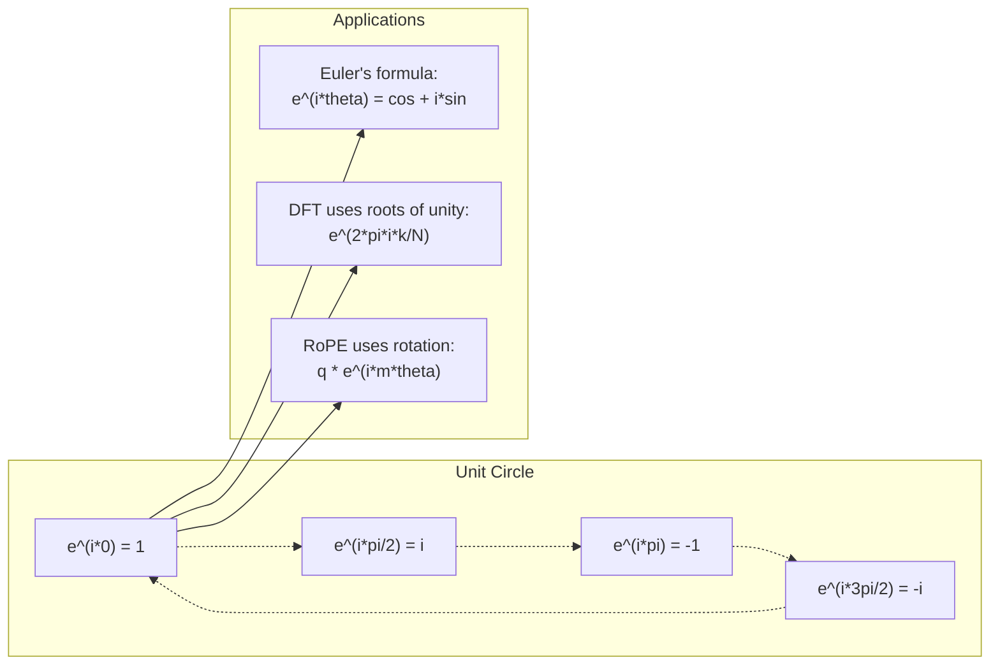

# 人工智能的复数

> -1的平方根不是虚数。它是旋转、频率和一半信号处理的关键。

**Type:** Learn
**Language:** Python
**Prerequisites:** Phase 1, Lessons 01-04 (linear algebra, calculus)
**Time:** ~60 minutes

## 学习目标

- 以矩形和极坐标形式进行复杂的算术运算（加、乘、除、共轭）
- 应用欧拉公式在复指数和三角函数之间进行转换
- 使用复数单位根实现离散傅里叶变换
- 解释Transformer中的RoPE和正弦位置编码是如何构成复杂旋转的

## 这个问题

打开一篇关于傅里叶变换的论文看一下Transformer位置编码你读到量子计算，发现所有东西都用复向量空间表示。

复数似乎很抽象。建立在-1平方根上的数字系统感觉像是一个数学把戏。但这不是把戏。它是旋转和振荡的自然语言。每当有东西旋转、振动或振荡时，复数就是正确的工具。

不理解复数，就无法理解离散傅里叶变换。你无法理解FFT。您无法理解RoPE（旋转位置嵌入）在现代语言模型中的工作原理。您无法理解为什么原始Transformer论文中的正弦位置编码使用它们所使用的频率。

本课从头开始构建复杂的算术，将其与几何联系起来，并向您展示复数在机器学习中的确切位置。

## 这个概念

### 什么是复数？

复数有两部分：实部和虚部。

```
z = a + bi

where:
  a is the real part
  b is the imaginary part
  i is the imaginary unit, defined by i^2 = -1
```

就是这样。把数轴延伸到平面上。实数在一个轴上。虚数在另一边。每个复数都是这个平面上的一个点。

### 复杂的运算

**添加。实部相加，虚部相加。

```
(a + bi) + (c + di) = (a + c) + (b + d)i

Example: (3 + 2i) + (1 + 4i) = 4 + 6i
```

**乘法。使用分配律，记住i^2 = -1。

```
(a + bi)(c + di) = ac + adi + bci + bdi^2
                 = ac + adi + bci - bd
                 = (ac - bd) + (ad + bc)i

Example: (3 + 2i)(1 + 4i) = 3 + 12i + 2i + 8i^2
                            = 3 + 14i - 8
                            = -5 + 14i
```

**共轭。把虚部的符号倒过来。

```
conjugate of (a + bi) = a - bi
```

复数与其共轭数的乘积总是实数：

```
(a + bi)(a - bi) = a^2 + b^2
```

**部门。**分子和分母乘以分母的共轭。

```
(a + bi) / (c + di) = (a + bi)(c - di) / (c^2 + d^2)
```

这样就从分母中消去了虚部，得到了一个简洁的复数。

### 复平面

复平面将每个复数映射到一个二维点。横轴是实轴，纵轴是虚轴。

```
z = 3 + 2i  corresponds to the point (3, 2)
z = -1 + 0i corresponds to the point (-1, 0) on the real axis
z = 0 + 4i  corresponds to the point (0, 4) on the imaginary axis
```

复数同时是一个点和一个从原点出发的向量。这种对偶解释使得复数在几何中很有用。

### 极坐标形式

平面上的任何一点都可以用它到原点的距离和它到正实轴的夹角来描述。

```
z = r * (cos(theta) + i*sin(theta))

where:
  r = |z| = sqrt(a^2 + b^2)     (magnitude, or modulus)
  theta = atan2(b, a)             (phase, or argument)
```

矩形形式（a + bi）适合做加法。极坐标形式（r,）适合乘法运算。

**极性形式的乘法。**乘以大小，加上角度。

```
z1 = r1 * e^(i*theta1)
z2 = r2 * e^(i*theta2)

z1 * z2 = (r1 * r2) * e^(i*(theta1 + theta2))
```

这就是为什么复数对于旋转来说是完美的。乘以一个大小为1的复数是一个纯旋转。

### 欧拉公式

复指数和三角学之间的桥梁：

```
e^(i*theta) = cos(theta) + i*sin(theta)
```

这是本课最重要的公式。当theta = pi时：

```
e^(i*pi) = cos(pi) + i*sin(pi) = -1 + 0i = -1

Therefore: e^(i*pi) + 1 = 0
```

五个基本常数（e, i, pi, 1,0）连接在一个方程中。

### 为什么欧拉公式对ML很重要

欧拉公式是这么说的= 0时，在（1,0）处。在= /2处，在（0,1）处。在=时，在（- 1,0）处。在= 3* /2处，在（0,-1）处。一个完整的旋转是= 2*pi。

这意味着复指数是旋转。旋转在信号处理和ML中无处不在。

### 连接到2D旋转

将复数（x + yi）乘以e^（i*）使点（x, y）绕原点旋转一个角度。

```
Rotation via complex multiplication:
  (x + yi) * (cos(theta) + i*sin(theta))
  = (x*cos(theta) - y*sin(theta)) + (x*sin(theta) + y*cos(theta))i

Rotation via matrix multiplication:
  [cos(theta)  -sin(theta)] [x]   [x*cos(theta) - y*sin(theta)]
  [sin(theta)   cos(theta)] [y] = [x*sin(theta) + y*cos(theta)]
```

它们产生相同的结果。复乘法是二维旋转。旋转矩阵就是用矩阵符号表示的复数乘法。

“‘mermaid
图道明
子图“复乘法=二维旋转”
(“z = x +易< br / > (x, y)”)——> |”乘以e ^(我*θ)”| B z[“z = * e ^(我*θ)< br / >点旋转θ”)
结束
子图“等效矩阵形式”
C[“向量[x， y]”]——>|“乘以旋转矩阵”| D["[x cos - y sin,<br/> x sin + y cos]"]
结束
B -。->|“相同的结果”| D
```

### Phasors and rotating signals

A complex exponential e^(i*omega*t) is a point rotating around the unit circle at angular frequency omega. As t increases, the point traces the circle.

The real part of this rotating point is cos(omega*t). The imaginary part is sin(omega*t). A sinusoidal signal is the shadow of a rotating complex number.

```
e^(i*omega*t) = cos(omega*t) + i*sin(omega*t)

实部是cos *t，一个余弦波
虚部sin *t，一个正弦波
```

This is the phasor representation. Instead of tracking a wiggly sine wave, you track a smoothly rotating arrow. Phase shifts become angle offsets. Amplitude changes become magnitude changes. Addition of signals becomes vector addition.

### Roots of unity

The N-th roots of unity are N points equally spaced on the unit circle:

```
w_k = e^（2*pi*i*k/N）对于k = 0,1,2，…, n - 1
```

For N = 4, the roots are: 1, i, -1, -i (the four compass points).
For N = 8, you get the four compass points plus the four diagonals.

Roots of unity are the foundation of the Discrete Fourier Transform. The DFT decomposes a signal into components at these N equally-spaced frequencies.

### Connection to the DFT

The Discrete Fourier Transform of a signal x[0], x[1], ..., x[N-1] is:

```
(2*pi*i*k*n/ n)
```

Each X[k] measures how much the signal correlates with the k-th root of unity -- a complex sinusoid at frequency k. The DFT breaks a signal into N rotating phasors and tells you the amplitude and phase of each one.

### Why i is not imaginary

The word "imaginary" is a historical accident. Descartes used it dismissively. But i is no more imaginary than negative numbers were when people first rejected them. Negative numbers answer "what do you subtract 5 from 3 to get?" The imaginary unit answers "what do you square to get -1?"

More usefully: i is a 90-degree rotation operator. Multiply a real number by i once, you rotate 90 degrees to the imaginary axis. Multiply by i again (i^2), you rotate another 90 degrees -- now you are pointing in the negative real direction. That is why i^2 = -1. It is not mysterious. It is a half-turn built from two quarter-turns.

This is why complex numbers are everywhere in engineering. Anything that rotates -- electromagnetic waves, quantum states, signal oscillations, positional encodings -- is naturally described by complex numbers.

### Complex exponentials vs trigonometric functions

Before Euler's formula, engineers wrote signals as A*cos(omega*t + phi) -- amplitude A, frequency omega, phase phi. This works but makes arithmetic painful. Adding two cosines with different phases requires trigonometric identities.

With complex exponentials, the same signal is A*e^(i*(omega*t + phi)). Adding two signals is just adding two complex numbers. Multiplying (modulating) is just multiplying magnitudes and adding angles. Phase shifts become angle additions. Frequency shifts become multiplications by phasors.

The entire field of signal processing switched to complex exponential notation because the math is cleaner. The "real signal" is always just the real part of the complex representation. The imaginary part is carried along as bookkeeping, making all the algebra work out naturally.

### Connection to transformers

**Sinusoidal positional encodings** (original Transformer paper):

```
PE(pos, 2i) = sin（pos / 10000^(2i/d)）
PE(pos, 2i+1) = cos（pos / 10000^(2i/d)）
```

The sin and cos pairs are the real and imaginary parts of complex exponentials at different frequencies. Each frequency provides a different "resolution" for encoding position. Low frequencies change slowly (coarse position). High frequencies change quickly (fine position). Together they give each position a unique frequency fingerprint.

**RoPE (Rotary Position Embedding)** takes this further. It explicitly multiplies query and key vectors by complex rotation matrices. The relative position between two tokens becomes a rotation angle. Attention is computed using these rotated vectors, making the model sensitive to relative position through complex multiplication.

| Operation | Algebraic Form | Geometric Meaning |
|-----------|---------------|-------------------|
| Addition | (a+c) + (b+d)i | Vector addition in the plane |
| Multiplication | (ac-bd) + (ad+bc)i | Rotate and scale |
| Conjugate | a - bi | Reflect over real axis |
| Magnitude | sqrt(a^2 + b^2) | Distance from origin |
| Phase | atan2(b, a) | Angle from positive real axis |
| Division | multiply by conjugate | Reverse rotation and rescale |
| Power | r^n * e^(i*n*theta) | Rotate n times, scale by r^n |



## 构建它

### 步骤1：复杂类

构建一个复数类，该类支持算术、幅度、相位以及矩形和极坐标形式之间的转换。

”“python
导入数学

类复杂:
Def __init__(self, real, image =0.0)：
自我。Real = Real
自我。image = image

Def __add__(self, other)：
返回复杂(自我。Real + other。真实的自我。image + other. image)

Def __mul__(self, other)：
R = self。真实*其他。真实的自我。image * other. image
I =自我。真实*其他。image + self。想象另一个真实的
return Complex（r, i）

Def __truediv__(self, other)：
Denom = other。实** 2 +其它。图片** 2
R = (self。真实*其他。真实+自我。想象一下其他。图片/图片
I = (self。想象一下其他。真实的自我。真实*其他。图片/图片
return Complex（r, i）

def级(自我):
返回math.sqrt(自我。真实** 2 +自我。图像** 2)

def阶段(自我):
返回math.atan2(自我。图像放大,self.real)

def共轭(自我):
返回复杂(自我。真实的,-self.imag)
```

### Step 2: Polar conversion and Euler's formula

```python
def to_polar(z):
    return z.magnitude(), z.phase()

def from_polar(r, theta):
    return Complex(r * math.cos(theta), r * math.sin(theta))

def euler(theta):
    return Complex(math.cos(theta), math.sin(theta))
```

验证：`euler(0)` should give (1, 0). `euler(pi)` should give (-1, 0).

### 3 .旋转

将点（x, y）旋转一个角度是一个复数乘法：

”“python
point = Complex（3,4）
旋转=点*欧拉(数学。PI / 4)
```

The magnitude stays the same. Only the angle changes.

### Step 4: DFT from complex arithmetic

```python
def dft(signal):
    N = len(signal)
    result = []
    for k in range(N):
        total = Complex(0, 0)
        for n in range(N):
            angle = -2 * math.pi * k * n / N
            total = total + Complex(signal[n], 0) * euler(angle)
        result.append(total)
    return result
```

这是O（N²）DFT。每个输出X[k]是信号样本的和乘以单位根。

### 步骤5：逆DFT

逆DFT从原始信号的频谱重构原始信号。与前向DFT相比，唯一的变化是：将指数中的符号翻转并除以N。

”“python
def idft(频谱):
N = len（谱）
结果= []
对于n在(n)范围内：
total = Complex（0,0）
对于k在(N)范围内：
角度= 2 *数学。* k * n / n
总量=总量+光谱[k] *欧拉（角）
result.append(复杂(总。real / N, total。图像/ N)
返回结果
```

This gives you perfect reconstruction. Apply DFT, then IDFT, and you get back the original signal to machine precision. No information is lost.

### Step 6: Roots of unity

```python
def roots_of_unity(N):
    return [euler(2 * math.pi * k / N) for k in range(N)]
```

验证两个属性：
- 每个根的大小都是1。
- 所有N根的和是零（它们通过对称抵消了）。

这些性质使得DFT可逆。单位根形成频域的正交基。

## 使用它

Python有内置的复数支持。字面意思

”“python
Z = 3 + 2j
W = 1 + 4j

打印（z + w）
打印（z * w）
打印(abs (z))

进口cmath
print (cmath.phase (z))
打印(cmath。Exp （1j * cmath.pi）
```

For arrays, numpy handles complex numbers natively:

```python
import numpy as np

z = np.array([1+2j, 3+4j, 5+6j])
print(np.abs(z))
print(np.angle(z))
print(np.conj(z))
print(np.real(z))
print(np.imag(z))

signal = np.sin(2 * np.pi * 5 * np.linspace(0, 1, 128))
spectrum = np.fft.fft(signal)
freqs = np.fft.fftfreq(128, d=1/128)
```

## 船这

运行

## 练习

1. **复杂的算术手工。**计算(2 + 3i) * (4 - i)并用代码验证。然后计算(5 + 2i) / （1 - 3i）在复平面上画出两个结果，并检查乘法是否旋转和缩放了第一个数字。

2. **旋转序列。**从点（1,0）开始。乘以e^(i* /6) 12次。验证12次乘法后是否返回（1,0）。把每一步的坐标打印出来，确认它们沿着一条正常的12轴。

3. **已知信号的DFT。**创建一个信号，该信号是sin（2*pi*3*t）和0.5*sin（2*pi*7*t）在32点采样的总和。运行DFT。验证震级谱在频率3和7处有峰，其中7处的峰是3处峰高度的一半。

4. **统一可视化的根源。**计算单位的8次方根。验证它们的和是否为零。验证任意根乘以原始根e^（2*pi*i/8）是否得到下一个根。

5. **旋转矩阵等价。**对于10个随机角度和10个随机点，验证复乘法与2x2旋转矩阵的矩阵向量乘法的结果相同。打印最大数值差异。

## 关键术语

| Term | What it means |
|------|---------------|
| Complex number | A number a + bi where a is the real part, b is the imaginary part, and i^2 = -1 |
| Imaginary unit | The number i, defined by i^2 = -1. Not imaginary in the philosophical sense -- it is a rotation operator |
| Complex plane | The 2D plane where the x-axis is real and the y-axis is imaginary. Also called the Argand plane |
| Magnitude (modulus) | The distance from the origin: sqrt(a^2 + b^2). Written as \|z\| |
| Phase (argument) | The angle from the positive real axis: atan2(b, a). Written as arg(z) |
| Conjugate | The mirror image across the real axis: conjugate of a + bi is a - bi |
| Polar form | Expressing z as r * e^(i*theta) instead of a + bi. Makes multiplication easy |
| Euler's formula | e^(i*theta) = cos(theta) + i*sin(theta). Connects exponentials to trigonometry |
| Phasor | A rotating complex number e^(i*omega*t) representing a sinusoidal signal |
| Roots of unity | The N complex numbers e^(2*pi*i*k/N) for k = 0 to N-1. N equally spaced points on the unit circle |
| DFT | Discrete Fourier Transform. Decomposes a signal into complex sinusoidal components using roots of unity |
| RoPE | Rotary Position Embedding. Uses complex multiplication to encode relative position in transformer attention |

## 进一步的阅读

- [直观介绍欧拉公式](https://betterexplained.com/articles/intuitive-understanding-of-eulers-formula/) -建立几何直觉，没有沉重的符号
- [Su等人：RoFormer (2021)](https://arxiv.org/abs/2104.09864) -介绍使用复旋转的旋转位置嵌入的论文
- [Vaswani等人：注意力就是你所需要的（2017）](https://arxiv.org/abs/1706.03762) -原始Transformer论文与正弦位置编码
- [3Blue1Brown：引入群论的欧拉公式](https://www.youtube.com/watch?v=mvmuCPvRoWQ) - e^(i*pi) = -1的直观解释
- [李约瑟：视觉复数分析]（https://global.oup.com/academic/product/visual-complex-analysis-9780198534464）——复数的最佳视觉处理，充满几何洞察力
- [Strang: Introduction to Linear Algebra，第10章](https://math.mit.edu/~gs/linearalgebra/) -线性代数和特征值背景下的复数