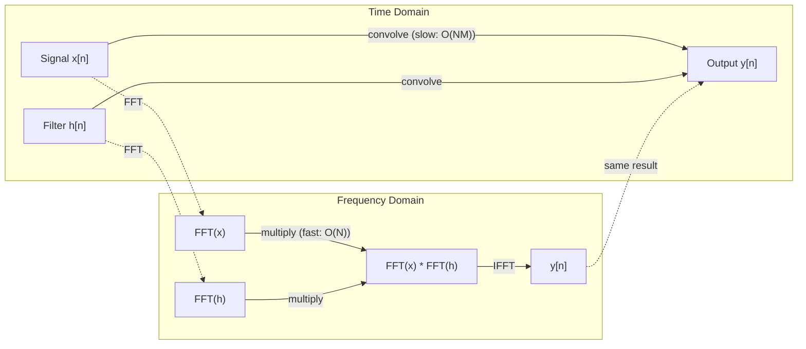

# 傅里叶变换

> 每个信号都是正弦波的和。傅里叶变换告诉你是哪些。

**Type:** Build
**Language:** Python
**Prerequisites:** Phase 1, Lessons 01-04, 19 (complex numbers)
**Time:** ~90 minutes

## 学习目标

- 从头开始实现DFT，并对O(N log N) Cooley-Tukey FFT进行验证
- 解释频率系数：提取幅度，相位，功率谱从一个信号
- 应用卷积定理通过FFT乘法执行卷积
- 将傅里叶频率分解连接到变压器位置编码和CNN卷积层

## 这个问题

音频记录是一段时间内压力测量的序列。股票价格是几天内一系列的价值。图像是空间上像素强度的网格。所有这些都是时间域（或空间域）的数据。您可以看到值在某个索引上发生变化。

但许多模式在时域中是不可见的。这个音频信号是纯音还是和弦？这个股票价格有周周期吗？这个图像有重复的纹理吗？这些问题是关于频率内容的，而时域隐藏了它。

傅里叶变换将数据从时域转换到频域。它把一个信号分解成不同频率的正弦波。每个正弦波都有一个振幅（它有多强）和一个相位（它从哪里开始）。傅里叶变换告诉你这两个。

这对ML很重要，因为频域思维无处不在。卷积神经网络执行卷积，也就是在频域中的乘法。变压器位置编码使用频率分解来表示位置。音频模型（语音识别、音乐生成）基于声谱图——声音的频率表示。时间序列模型寻找周期性模式。理解傅里叶变换给了你处理所有这些的词汇。

## 这个概念

### DFT定义

给定N个样本x[0]， x[1]，…， x[N-1]，离散傅里叶变换产生N个频率系数x[0]， x[1]，…X (n - 1):

```
X[k] = sum_{n=0}^{N-1} x[n] * e^(-2*pi*i*k*n/N)

for k = 0, 1, ..., N-1
```

每个X[k]都是一个复数。它的幅值|X[k]|告诉你频率k的幅值，它的相位角（X[k]）告诉你该频率的相位偏移。

关键观点：如果信号包含频率为k的能量，则相关性很大。如果不是，则接近于零。

### 每个系数的含义

**X[0]：直流组件。这是所有样本的和，与均值成正比。它表示信号的恒定（零频率）偏移。

```
X[0] = sum_{n=0}^{N-1} x[n] * e^0 = sum of all samples
```

**X[k]对于1 <= k <= N/2：正频率。** X[k]表示每N个样本的频率k个周期。更高的k意味着更高的频率（更快的振荡）。

**X[N/2]：奈奎斯特频率。**可以用N个样本表示的最高频率。在此之上，你会得到混叠——高频伪装成低频。

**X[k]对于N/2 < k < N：负频率。**对于实值信号，X[N-k] = conj（X[k]）。负频率是正频率的镜像。这就是为什么有用的信息在前N/2 + 1个系数中。

### 逆DFT

逆DFT从原始信号的频率系数重构原始信号：

```
x[n] = (1/N) * sum_{k=0}^{N-1} X[k] * e^(2*pi*i*k*n/N)

for n = 0, 1, ..., N-1
```

与前向DFT的唯一区别是：指数中的符号是正的（而不是负的），并且有一个1/N的归一化因子。

逆DFT是完美的重构。没有信息丢失。你可以从时域变换到频域再变换回来，没有任何误差。DFT是基的变化——它在不同的坐标系中重新表达相同的信息。

### FFT：让它变快

上面定义的DFT是O(N^2)：对于N个输出系数中的每一个，对N个输入样本求和。对于N = 100万，就是10^12次运算。

快速傅里叶变换（FFT）在O（N log N）内计算出相同的结果。对于N = 100万，大约是2000万次操作，而不是1万亿次。这就是使频率分析变得实用的原因。

Cooley-Tukey算法（最常见的FFT）的工作原理是分而治之：

1. 将信号分成偶数索引和奇索引样本。
2. 递归地计算每一半的DFT。
3. 使用“旋转因子”e^（-2*pi*i*k/N）组合两个半尺寸dft。

```
X[k] = E[k] + e^(-2*pi*i*k/N) * O[k]          for k = 0, ..., N/2 - 1
X[k + N/2] = E[k] - e^(-2*pi*i*k/N) * O[k]    for k = 0, ..., N/2 - 1

where E = DFT of even-indexed samples
      O = DFT of odd-indexed samples
```

这种对称性意味着每一层递归都做O(N)个工作，并且有log2(N)层。总计：O（N log N）

“‘美人鱼
图道明
子图“8点FFT （Cooley-Tukey）”
[" X [0 . .7] < br / > 8样本”)——> |“分裂偶数/奇数“| E[“甚至:x[0、2、4、6]”)
X—>|“拆分偶数/奇数”| O[“奇数：X[1,3,5,7]”]
E ->|"4-pt FFT"| EK["E[0..3]"]
O ->|"4-pt FFT"| OK["O[0..3]"]
EK—>|“结合旋转因子”| XK[“X[0..7]”]
好的——>|“结合中间因子”| XK
结束
子图“复杂性”
C1[“DFT: O(N^2) = 64次乘法”]
C2[“FFT: 0 (N log N) = 24次乘法”]
结束
```

The FFT requires the signal length to be a power of 2. In practice, signals are zero-padded to the next power of 2.

### Spectral analysis

The **power spectrum** is |X[k]|^2 -- the squared magnitude of each frequency coefficient. It shows how much energy is at each frequency.

The **phase spectrum** is angle(X[k]) -- the phase offset of each frequency. For most analysis tasks, you care about the power spectrum and ignore the phase.

```
频率k的功率：P[k] = |X[k]|^2 = X[k]。real^2 + X[k] image ^2
频率k处的相位：phi[k] = atan2（X[k]）。图像放大,X [k] .real)
```

### Frequency resolution

The frequency resolution of the DFT depends on the number of samples N and the sampling rate fs.

```
bin k的频率：f_k = k * fs / N
频率分辨率：delta_f = fs / N
最大频率：f_max = fs / 2（奈奎斯特）
```

To resolve two frequencies that are close together, you need more samples. To capture high frequencies, you need a higher sampling rate.

### The convolution theorem

This is one of the most important results in signal processing and directly relevant to CNNs.

**Convolution in the time domain equals pointwise multiplication in the frequency domain.**

```
x * h = IFFT（FFT(x)）FFT (h))

其中*是卷积和。是基于元素的乘法吗
```

Why this matters:

- Direct convolution of two signals of length N and M takes O(N*M) operations.
- FFT-based convolution takes O(N log N): transform both, multiply, transform back.
- For large kernels, FFT convolution is dramatically faster.
- This is exactly what happens in convolutional layers with large receptive fields.

Note: the DFT computes circular convolution (the signal wraps around). For linear convolution (no wraparound), zero-pad both signals to length N + M - 1 before computing.



### 窗口

DFT假设信号是周期性的——它将N个样本视为一个无限重复信号的一个周期。如果信号不是在相同的值开始和结束，这会在边界处产生不连续，这显示为虚假的高频内容。这被称为光谱泄漏。

在计算DFT之前，加窗通过在两端将信号逐渐变细至零来减少泄漏。

常见的窗口:

| Window | Shape | Main lobe width | Side lobe level | Use case |
|--------|-------|----------------|-----------------|----------|
| Rectangular | Flat (no window) | Narrowest | Highest (-13 dB) | When signal is exactly periodic in N samples |
| Hann | Raised cosine | Moderate | Low (-31 dB) | General purpose spectral analysis |
| Hamming | Modified cosine | Moderate | Lower (-42 dB) | Audio processing, speech analysis |
| Blackman | Triple cosine | Wide | Very low (-58 dB) | When side lobe suppression is critical |

```
Hann window:    w[n] = 0.5 * (1 - cos(2*pi*n / (N-1)))
Hamming window: w[n] = 0.54 - 0.46 * cos(2*pi*n / (N-1))
```

通过将其与DFT前的信号逐元相乘来应用窗口：

### DFT属性

| Property | Time Domain | Frequency Domain |
|----------|-------------|-----------------|
| Linearity | a*x + b*y | a*X + b*Y |
| Time shift | x[n - k] | X[f] * e^(-2*pi*i*f*k/N) |
| Frequency shift | x[n] * e^(2*pi*i*f0*n/N) | X[f - f0] |
| Convolution | x * h | X * H (pointwise) |
| Multiplication | x * h (pointwise) | X * H (circular convolution, scaled by 1/N) |
| Parseval's theorem | sum \|x[n]\|^2 | (1/N) * sum \|X[k]\|^2 |
| Conjugate symmetry (real input) | x[n] real | X[k] = conj(X[N-k]) |

Parseval定理说两个域中的总能量是相等的。能量通过变换得到守恒。

### 连接到位置编码

原来的Transformer使用正弦位置编码：

```
PE(pos, 2i)   = sin(pos / 10000^(2i/d_model))
PE(pos, 2i+1) = cos(pos / 10000^(2i/d_model))
```

每个维度对（2i, 2i+1）以不同的频率振荡。频率从高（维度0,1）到低（最后一个维度）呈几何间隔。这使得每个位置在所有频带上都有一个独特的模式——类似于傅里叶系数如何唯一地识别一个信号。

它提供的关键属性：

- **唯一性：**没有两个位置具有相同的编码。
- **有界值：** sin和cos总是在[- 1,1]内。
- **相对位置：**位置p+k的编码可以表示为p位置编码的线性函数，模型可以学习关注相对位置。

### 连接cnn

卷积层通过在信号或图像上滑动，将学习到的滤波器（核）应用于输入。数学上，这是卷积运算。

根据卷积定理，这等价于：
1. FFT输入
2. FFT内核
3. 频域相乘
4. 这就是结果

标准的CNN实现使用直接卷积（对于小的3x3内核更快）。但是对于大型内核或全局卷积，基于fft的方法要快得多。一些架构（如FNet）完全用FFT取代注意力，以O（N log N）而不是O（N^2）的复杂度获得竞争精度。

### 频谱图和短时傅里叶变换

单个FFT给出了整个信号的频率内容，但没有告诉您这些频率何时出现。啁啾（频率随时间增加的信号）和和弦（同时出现的所有频率）可以具有相同的幅度谱。

短时傅里叶变换（STFT）通过在信号的重叠窗口上计算fft来解决这个问题。结果是一个频谱图：一个二维表示，一个轴是时间，另一个轴是频率。每个点的强度表示该频率在该时刻的能量。

```
STFT procedure:
1. Choose a window size (e.g., 1024 samples)
2. Choose a hop size (e.g., 256 samples -- 75% overlap)
3. For each window position:
   a. Extract the windowed segment
   b. Apply a Hann/Hamming window
   c. Compute FFT
   d. Store the magnitude spectrum as one column of the spectrogram
```

谱图是音频ML模型的标准输入表示。语音识别模型（Whisper, DeepSpeech）在mel-spectrogram上运行-频谱图的频率映射到mel尺度，这更符合人类的音高感知。

### 混叠

如果一个信号的频率高于fs/2（奈奎斯特频率），以fs的速率采样将产生混叠副本。以100赫兹采样的90赫兹信号看起来与10赫兹信号相同。没有办法单独从样品中区分它们。

```
Example:
  True signal: 90 Hz sine wave
  Sampling rate: 100 Hz
  Apparent frequency: 100 - 90 = 10 Hz

  The samples from the 90 Hz signal at 100 Hz sampling rate
  are identical to the samples from a 10 Hz signal.
  No amount of math can recover the original 90 Hz.
```

这就是为什么模数转换器包括抗混叠滤波器，在采样之前去除奈奎斯特以上的频率。在ML中，当没有适当的低通滤波的下采样特征映射时，会出现混叠——一些架构通过抗混叠池层来解决这个问题。

### 零填充不会增加分辨率

一个常见的误解是：在FFT之前填充零信号可以提高频率分辨率。但事实并非如此。零填充在现有的频率箱之间插入，给你一个平滑的频谱。但它无法揭示原始样本中不存在的频率细节。

真实频率分辨率仅取决于观测时间T = N / fs。要解析由delta_f分隔的两个频率，您至少需要T = 1 / delta_f秒的数据。再多的零填充也改变不了这个基本限制。

## 构建它

### 步骤1：从头开始DFT

O(N^2) DFT直接从定义推导出来。

”“python
导入数学

类复杂:
…

def dft (x):
N = len(x)
结果= []
对于k在(N)范围内：
total = Complex（0,0）
对于n在(n)范围内：
角度= -2 *数学。* k * n / n
w =复杂的数学。因为(角),sin(角))
xn = x[n] if isinstance(x[n], Complex) else Complex（x[n]）
Total = Total + xn * w
result.append(总)
返回结果
```

### Step 2: Inverse DFT

Same structure, positive exponent, divide by N.

```python
def idft(X):
    N = len(X)
    result = []
    for n in range(N):
        total = Complex(0, 0)
        for k in range(N):
            angle = 2 * math.pi * k * n / N
            w = Complex(math.cos(angle), math.sin(angle))
            total = total + X[k] * w
        result.append(Complex(total.real / N, total.imag / N))
    return result
```

### 步骤3:FFT （Cooley-Tukey）

递归FFT需要2的幂长度。分为奇数和偶数，递归，与纠缠因子组合。

”“python
def fft (x):
N = len(x)
如果N <= 1：
return [x[0] if isinstance(x[0], Complex) else Complex(x[0])]
如果N % 2 ！= 0:
返回dft (x)

even = fft（[x[i] for i in range(0， N, 2)]）
奇数= fft（[x[i] for i in range(1， N, 2)]）

result = [Complex(0)] * N
对于k在（N // 2）范围内：
角度= -2 *数学。* k / N
复杂（数学）。因为(角),sin(角))
T = twiddle * odd[k]
结果[k] =偶数[k] + t
result[k + N // 2] = even[k] - t
返回结果
```

### Step 4: Spectral analysis helpers

```python
def power_spectrum(X):
    return [xk.real ** 2 + xk.imag ** 2 for xk in X]

def convolve_fft(x, h):
    N = len(x) + len(h) - 1
    padded_N = 1
    while padded_N < N:
        padded_N *= 2

    x_padded = x + [0.0] * (padded_N - len(x))
    h_padded = h + [0.0] * (padded_N - len(h))

    X = fft(x_padded)
    H = fft(h_padded)

    Y = [xk * hk for xk, hk in zip(X, H)]

    y = idft(Y)
    return [y[n].real for n in range(N)]
```

## 使用它

对于实际工作，使用numpy的FFT，它由高度优化的C库支持。

”“python
导入numpy为np

信号= np。Sin （2 * np）PI * 5 * np。安排(256)/ 256)
频谱= np.fft.fft（信号）
频率= np.fft。fftfreq (256 d = 1/256)

幂= np。Abs（光谱）** 2

Positive_freqs = freqs[:len(freqs)//2]
Positive_power = power[:len(power)//2]
```

For windowing and more advanced spectral analysis:

```python
from scipy.signal import windows, stft

window = windows.hann(256)
windowed = signal * window
spectrum = np.fft.fft(windowed)
```

卷积:

”“python
从scipy。信号导入fft卷积

结果= fftconvolve（信号，内核，模式='full'）
```

For spectrograms:

```python
from scipy.signal import stft

frequencies, times, Zxx = stft(signal, fs=sample_rate, nperseg=256)
spectrogram = np.abs(Zxx) ** 2
```

谱图矩阵具有形状（n_frequency, n_time_frames）。每一列是在一个时间窗口的功率谱。这是音频ML模型作为输入所消耗的内容。

## 船这

运行

## 练习

1. **纯音识别。**创建一个信号与一个单一的正弦波在一个未知的频率（1和50赫兹之间），采样在128赫兹1秒。使用DFT来识别频率。验证答案是否匹配。现在添加标准偏差为0.5的高斯噪声并重复。噪声是如何影响频谱的？

2. **FFT与DFT验证。**生成长度为64的随机信号。同时计算DFT （O(N^2)）和FFT。验证所有系数在1 -10范围内匹配。Time同时作用于长度为256、512、1024和2048的信号。绘制DFT时间与FFT时间的比值。

3. **卷积定理的实例证明。**创建信号x =[1,2,3,4,0,0,0,0,0]和滤波器h =[1,1,1,0,0,0,0]。直接计算它们的循环卷积（嵌套循环）。然后通过FFT（变换，乘法，逆变换）计算它。验证结果是否匹配。现在通过适当的零填充来做线性卷积。

4. * *窗口的效果。**创建一个信号，是两个正弦波在10赫兹和12赫兹（非常接近）的总和。以128 Hz采样1秒。计算无窗、汉恩窗和汉明窗的功率谱。哪个窗口最容易区分两个峰？为什么?

5. **位置编码分析。**生成d_model = 128和max_pos = 512的正弦位置编码。对于每一对位置（p1, p2），计算它们编码的点积。证明点积只与|p1 - p2|有关，与绝对位置无关。当距离增加点积会怎样？

## 关键术语

| Term | What it means |
|------|---------------|
| DFT (Discrete Fourier Transform) | Converts N time-domain samples into N frequency-domain coefficients. Each coefficient is the correlation with a complex sinusoid at that frequency |
| FFT (Fast Fourier Transform) | An O(N log N) algorithm to compute the DFT. The Cooley-Tukey algorithm splits even/odd indices recursively |
| Inverse DFT | Reconstructs the time-domain signal from frequency coefficients. Same formula as DFT with flipped exponent sign and 1/N scaling |
| Frequency bin | Each index k in the DFT output represents frequency k*fs/N Hz. The "bin" is the discrete frequency slot |
| DC component | X[0], the zero-frequency coefficient. Proportional to the signal mean |
| Nyquist frequency | fs/2, the maximum frequency representable at sampling rate fs. Frequencies above this alias |
| Power spectrum | \|X[k]\|^2, the squared magnitude of each frequency coefficient. Shows energy distribution across frequencies |
| Phase spectrum | angle(X[k]), the phase offset of each frequency component. Often ignored in analysis |
| Spectral leakage | Spurious frequency content caused by treating a non-periodic signal as periodic. Reduced by windowing |
| Window function | A tapering function (Hann, Hamming, Blackman) applied before DFT to reduce spectral leakage |
| Twiddle factor | The complex exponential e^(-2*pi*i*k/N) used to combine sub-DFTs in the FFT butterfly computation |
| Convolution theorem | Convolution in time domain equals pointwise multiplication in frequency domain. Fundamental to signal processing and CNNs |
| Circular convolution | Convolution where the signal wraps around. This is what the DFT naturally computes |
| Linear convolution | Standard convolution without wraparound. Achieved by zero-padding before DFT |
| Parseval's theorem | Total energy is preserved through the Fourier transform. sum \|x[n]\|^2 = (1/N) sum \|X[k]\|^2 |
| Aliasing | When frequencies above Nyquist appear as lower frequencies due to insufficient sampling rate |

## 进一步的阅读

- [Cooley & Tukey：复傅立叶级数的机器计算算法（1965）](https://www.ams.org/journals/mcom/1965-19-090/S0025-5718-1965-0178586-1/) -改变计算的原始FFT论文
- [3Blue1Brown：但是什么是傅里叶变换？](https://www.youtube.com/watch?v=spUNpyF58BY) -傅里叶变换的最佳视觉介绍
- [Lee-Thorp等人：FNet：混合令牌与傅里叶变换（2021）](https://arxiv.org/abs/2105.03824) -用FFT替换变压器中的自关注
- [史密斯：科学家和工程师的数字信号处理指南](http://www.dspguide.com/) -免费的在线教科书，涵盖FFT，窗口和频谱分析的深度
- [Vaswani等人：注意力是你所需要的（2017）](https://arxiv.org/abs/1706.03762) -从傅里叶频率分解衍生的正弦位置编码
- [Radford等人：Whisper (2022)]（https://arxiv.org/abs/2212.04356）——使用mel-spectrogram作为输入表示的语音识别