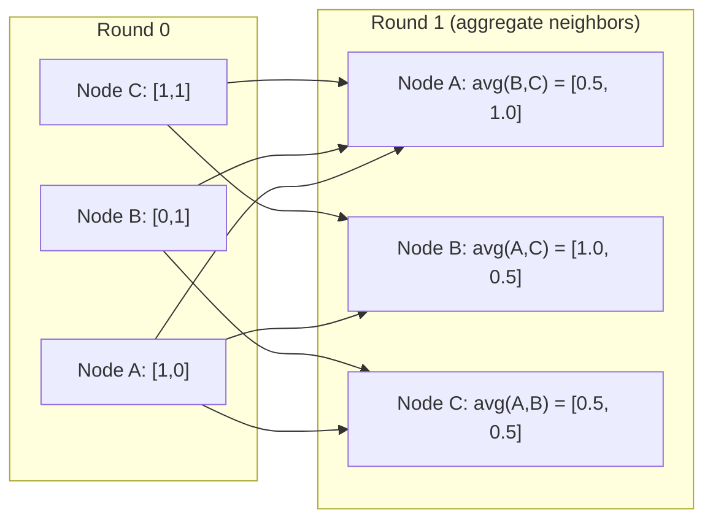

# 机器学习的图论

> 图是关系的数据结构。如果你的数据有联系，你就需要图论。

**Type:** Build
**Language:** Python
**Prerequisites:** Phase 1, Lessons 01-03 (linear algebra, matrices)
**Time:** ~90 minutes

## 学习目标

- 构建一个带有邻接矩阵/列表表示的图类，实现BFS和DFS遍历
- 计算图的拉普拉斯函数，并使用其特征值来检测连接的组件和集群节点
- 实现一轮gnn风格的消息传递作为规范化邻接矩阵乘法
- 应用谱聚类来划分使用费德勒矢量的图

## 这个问题

社会网络、分子、知识库、引文网络、路线图——都是图形。传统ML将数据视为平面表。每一行都是独立的。每个特征是一列。但是当连接的结构很重要时，表就失效了。

以社交网络为例。你想要预测用户会购买什么产品。他们的购买历史很重要。但他们朋友的购买历史更重要。这些连接携带信号。

或者考虑一个分子。你想要预测它是否与蛋白质结合。原子很重要，但真正重要的是原子是如何相互连接的。结构就是数据。

图神经网络（gnn）是深度学习中发展最快的领域。它们为药物发现、社交推荐、欺诈检测和知识图推理提供了动力。每个GNN都建立在相同的基础上：基本图论。

你需要四样东西：
1. 一种将图形表示为矩阵的方法（这样您就可以将它们相乘）
2. 遍历算法探索图结构
3. 拉普拉斯矩阵，谱图理论中最重要的矩阵
4. 消息传递——使gnn工作的操作

## 这个概念

### 图：节点和边

图G = （V， E）由顶点（节点）V和边E组成。每条边连接两个节点。

**有向vs无向。**在无向图中，边（u, v）表示u连接到v， v连接到u。在有向图（有向图）中，边（u, v）表示u指向v，但不一定相反。

**加权vs非加权。**在非加权图中，边要么存在，要么不存在。在加权图中，每条边都有一个数值权重——距离、代价、强度。

| Graph type | Example |
|-----------|---------|
| Undirected, unweighted | Facebook friendship network |
| Directed, unweighted | Twitter follow network |
| Undirected, weighted | Road map (distances) |
| Directed, weighted | Web page links (PageRank scores) |

### 邻接矩阵

邻接矩阵A是核心表示法。对于有n个节点的图：

```
A[i][j] = 1    if there is an edge from node i to node j
A[i][j] = 0    otherwise
```

对于无向图，A是对称的：A[i][j] = A[j][i]。对于加权图，A[i][j] =边（i, j）的权值。

*示例——三角形：**

```
Nodes: 0, 1, 2
Edges: (0,1), (1,2), (0,2)

A = [[0, 1, 1],
     [1, 0, 1],
     [1, 1, 0]]
```

邻接矩阵是每个GNN的输入。A上的矩阵运算对应于图上的运算。

### 学位

一个节点的度是连接到它的边的数量。对于有向图，你有向内度（边进来）和向外度（边出去）。

度矩阵D是对角的：

```
D[i][i] = degree of node i
D[i][j] = 0    for i != j
```

对于三角形的例子：D = diag(2,2,2)，因为每个节点都连接到另外两个节点。

度告诉你节点的重要性。高度=枢纽节点。网络的度分布揭示了网络的结构。社交网络遵循幂律（少中心，多叶节点）。随机图具有泊松分布度。

### BFS和DFS

两种基本的图遍历算法。两者都需要。

**广度优先搜索（BFS）：**首先探索所有邻居，然后是邻居的邻居。使用队列（FIFO）。

```
BFS from node 0:
  Visit 0
  Queue: [1, 2]        (neighbors of 0)
  Visit 1
  Queue: [2, 3]        (add neighbors of 1)
  Visit 2
  Queue: [3]           (neighbors of 2 already visited)
  Visit 3
  Queue: []            (done)
```

BFS在未加权图中找到最短路径。从起点到任何节点的距离等于该节点首次被发现时的BFS级别。这就是为什么BFS被用于社交网络中的跳数距离。

**深度优先搜索（DFS）：**在回溯之前尽可能深入。使用堆栈（LIFO）或递归。

```
DFS from node 0:
  Visit 0
  Stack: [1, 2]        (neighbors of 0)
  Visit 2               (pop from stack)
  Stack: [1, 3]         (add neighbors of 2)
  Visit 3               (pop from stack)
  Stack: [1]
  Visit 1               (pop from stack)
  Stack: []             (done)
```

DFS适用于：
- 查找连接的组件（从未访问的节点运行DFS）
- 周期检测（DFS树的后边缘）
- 拓扑排序（反向DFS完成顺序）

| Algorithm | Data structure | Finds | Use case |
|-----------|---------------|-------|----------|
| BFS | Queue | Shortest paths | Social network distance, knowledge graph traversal |
| DFS | Stack | Components, cycles | Connectivity, topological sort |

### 拉普拉斯图

L = D - A.谱图理论中最重要的矩阵。

对于三角形：

```
D = [[2, 0, 0],    A = [[0, 1, 1],    L = [[2, -1, -1],
     [0, 2, 0],         [1, 0, 1],         [-1, 2, -1],
     [0, 0, 2]]         [1, 1, 0]]         [-1, -1,  2]]
```

拉普拉斯式有一些显著的性质：

1. **L是半正定的。**所有特征值为>= 0。

2. **零特征值的数量等于连接组件的数量。一个连通图恰好有一个零特征值。一个有3个不相连分量的图有3个零特征值。

3. **最小的非零特征值（费德勒值）衡量连通性。**较大的Fiedler值表示图连接良好。较小的费德勒值意味着图有一个弱点——瓶颈。

4. ** Fiedler值的特征向量（Fiedler vector）揭示了最佳分割。**带正值的节点在一组中，带负值的节点在另一组中。这是光谱聚类。

“‘美人鱼
图道明
子图“矩阵图”
G[“图G”]—> A[“邻接矩阵A”]
G—> D[“度矩阵D”]
A—> L[“拉普拉斯L = D - A”]
D——b> 1
结束
子图“谱分析”
L—> E[“L的特征值”]
L—> V[“L的特征向量”]
E—> C[“连接组件（零）”]
E—> F[“连通性（费德勒值）”]
V—> S[“光谱聚类”]
结束
```

### Spectral Properties

The eigenvalues of the adjacency matrix and Laplacian reveal structural properties without any traversal.

**Spectral clustering** works like this:
1. Compute the Laplacian L
2. Find the k smallest eigenvectors of L (skip the first, which is all-ones for connected graphs)
3. Use those eigenvectors as new coordinates for each node
4. Run k-means on those coordinates

Why does this work? The eigenvectors of L encode the "smoothest" functions on the graph. Nodes that are well-connected get similar eigenvector values. Nodes separated by a bottleneck get different values. The eigenvectors naturally separate clusters.

**Random walk connection.** The normalized Laplacian relates to random walks on the graph. The stationary distribution of a random walk is proportional to node degree. The mixing time (how fast the walk converges) depends on the spectral gap.

### Message Passing

The core operation of Graph Neural Networks. Each node collects messages from its neighbors, aggregates them, and updates its own state.

```
h_v ^ (k + 1) =更新(h_v ^ (k),聚合({h_u ^ (k):你的邻居(v)}))
```

In the simplest form, AGGREGATE = mean, and UPDATE = linear transform + activation:

```
h_v ^ (k + 1) =σ(W *意味着({h_u ^ (k):你的邻居(v)}))
```

This is matrix multiplication in disguise. If H is the matrix of all node features and A is the adjacency matrix:

```
H^(k+1) =∑（A_norm * H^(k) * W）
```

where A_norm is the normalized adjacency matrix (each row sums to 1).

One round of message passing lets each node "see" its immediate neighbors. Two rounds let it see neighbors of neighbors. K rounds give each node information from its K-hop neighborhood.



### 概念和机器学习应用

| Concept | ML Application |
|---------|---------------|
| Adjacency matrix | GNN input representation |
| Graph Laplacian | Spectral clustering, community detection |
| BFS/DFS | Knowledge graph traversal, path finding |
| Degree distribution | Node importance, feature engineering |
| Message passing | GNN layers (GCN, GAT, GraphSAGE) |
| Eigenvalues of L | Community detection, graph partitioning |
| Spectral clustering | Unsupervised node grouping |
| PageRank | Node importance, web search |

## 构建它

### 步骤1：从头开始绘制类

”“python
类图:
def __init__(self, n_nodes, directed=False)：
自我。N = n_nodes
自我。定向的
自我。Adj = {i: {} for i in range(n_nodes)}

Def add_edge(self, u, v, weight=1.0)：
自我。Adj [u][v] =重量
如果不是自我导向的：
自我。Adj [v][u] =重量

Def neighbors(self, node)：
返回列表(self.adj(节点). keys ())

Def degree(self, node)：
返回len (self.adj(节点))

def adjacency_matrix(自我):
导入numpy为np
A = np. 0 ((self。n, self.n))
对于范围（self.n）中的u：
对于v，我们在self.adj . [u].items()：
A[u][v] = w
返回一个

def degree_matrix(自我):
导入numpy为np
D = np. 0 ((self。n, self.n))
对于range（self.n）中的I：
D[i][i] = self.degree(i)
返回维

def拉普拉斯算子(自我):
返回self.degree_matrix() - self.adjacency_matrix（）
```

The adjacency list (`self.adj`) stores neighbors efficiently. The adjacency matrix conversion uses numpy because all the spectral operations need it.

### Step 2: BFS and DFS

```python
from collections import deque

def bfs(graph, start):
    visited = set()
    order = []
    distances = {}
    queue = deque([(start, 0)])
    visited.add(start)
    while queue:
        node, dist = queue.popleft()
        order.append(node)
        distances[node] = dist
        for neighbor in graph.neighbors(node):
            if neighbor not in visited:
                visited.add(neighbor)
                queue.append((neighbor, dist + 1))
    return order, distances


def dfs(graph, start):
    visited = set()
    order = []
    stack = [start]
    while stack:
        node = stack.pop()
        if node in visited:
            continue
        visited.add(node)
        order.append(node)
        for neighbor in reversed(graph.neighbors(node)):
            if neighbor not in visited:
                stack.append(neighbor)
    return order
```

BFS为O(1)个人使用deque（双端队列）。DFS使用列表作为堆栈。它们都访问每个节点一次——O（V + E）时间。

### 步骤3：连通分量和拉普拉斯特征值

”“python
def connected_components(图):
Visited = set（）
组件= []
对于（graph.n）范围内的节点：
如果节点未访问：
Order, _ = bfs（graph, node）
visited.update(顺序)
components.append(顺序)
返回组件


def laplacian_eigenvalues(图):
导入numpy为np
L = graph. laplace （）
eigenvalues = np.linal . egvalsh (L)
返回特征值
```

`eigvalsh` is for symmetric matrices -- the Laplacian is always symmetric for undirected graphs. It returns eigenvalues in ascending order. Count the zeros to find the number of connected components.

### Step 4: Spectral clustering

```python
def spectral_clustering(graph, k=2):
    import numpy as np
    L = graph.laplacian()
    eigenvalues, eigenvectors = np.linalg.eigh(L)
    features = eigenvectors[:, 1:k+1]

    labels = np.zeros(graph.n, dtype=int)
    for i in range(graph.n):
        if features[i, 0] >= 0:
            labels[i] = 0
        else:
            labels[i] = 1
    return labels
```

当k=2时，Fiedler向量的符号将图分成两个簇。对于k>2，你会对前k个特征向量（不包括平凡的全一特征向量）运行k-means。

### 步骤5：消息传递

”“python
Def message_passing(graph, features, weight_matrix)：
导入numpy为np
A = graph.adjacency_matrix（）
row_sum = a.s sum（axis=1, keepdim =True）
row_sum [row_sum == 0] = 1
A_norm = A / row_sum
aggregate = A_norm @ features
输出=聚合@ weight_matrix
返回输出
```

This is one round of GNN message passing. Each node's new features are the weighted average of its neighbors' features, transformed by the weight matrix. Stack multiple rounds to propagate information further.

## Use It

With networkx and numpy, the same operations are one-liners:

```python
import networkx as nx
import numpy as np

G = nx.karate_club_graph()

A = nx.adjacency_matrix(G).toarray()
L = nx.laplacian_matrix(G).toarray()

eigenvalues = np.linalg.eigvalsh(L.astype(float))
print(f"Smallest eigenvalues: {eigenvalues[:5]}")
print(f"Connected components: {nx.number_connected_components(G)}")

communities = nx.community.greedy_modularity_communities(G)
print(f"Communities found: {len(communities)}")

pr = nx.pagerank(G)
top_nodes = sorted(pr.items(), key=lambda x: x[1], reverse=True)[:5]
print(f"Top 5 PageRank nodes: {top_nodes}")
```

networkx使用优化的C后端处理任何大小的图形。在生产中使用它。使用从头开始的实现来理解它的作用。

### Numpy谱分析

”“python
导入numpy为np

A = np.array([
[0,1,1,0,0]，
[1,0,1,0,0]，
[1,1,0,1,0]，
[0,0,1,0,1]，
[0,0,0,1,0]
])

D = np.diag（A.sum（轴=1））
L = d - a

特征值，特征向量= np. linear . igh(L)
打印(f“特征值:{np。轮(特征值,4)}”)
print（f"Fiedler value: {eigenvalues[1]:.4f}"）
print(f"Fiedler vector: {np。Round (eigenvectors[:, 1], 4)}”)

Fiedler = eigenvectors[:, 1]
Group_a = np。其中（fiedler >= 0）[0]
Group_b = np。其中（fieldler < 0）[0]
print（f"Cluster A: {group_a}"）
print（f“群集B: {group_b}”）
```

The Fiedler vector does the heavy lifting. Positive entries in one cluster, negative in the other. No iterative optimization needed -- just one eigendecomposition.

## Ship It

This lesson produces:
- `outputs/skill-graph-analysis.md` -- a skill reference for analyzing graph-structured data

## Connections

| Concept | Where it shows up |
|---------|------------------|
| Adjacency matrix | GCN, GAT, GraphSAGE input |
| Laplacian | Spectral clustering, ChebNet filters |
| BFS | Knowledge graph traversal, shortest path queries |
| Message passing | Every GNN layer, neural message passing |
| Spectral gap | Graph connectivity, mixing time of random walks |
| Degree distribution | Power-law networks, node feature engineering |
| Connected components | Preprocessing, handling disconnected graphs |
| PageRank | Node importance ranking, attention initialization |

GNNs deserve special mention. The graph convolution operation in GCN (Kipf & Welling, 2017) uses the adjacency matrix with added self-loops, A_hat = A + I:

```text
H^(l+1) = sigma(D_hat^(-1/2) * A_hat * D_hat^(-1/2) * H^(l) * W^(l))
```

其中A_hat = A + I（邻接+自循环）D_hat是A_hat的度矩阵。自循环确保每个节点在聚合期间包含自己的特性。这就是对称规范化的消息传递。D_hat^(-1/2) * A_hat * D_hat^（-1/2）是标准化邻接矩阵。拉普拉斯函数出现是因为这个归一化与L_sym = I - D^(-1/2) * A * D^（-1/2）有关。理解拉普拉斯函数意味着理解GCNs的工作原理。

## 练习

1. **从头开始实现PageRank。**从统一分数开始。每一步：对于所有指向v的u， score(v) = (1-d)/n + d * sum(score(u)/out_degree(u))，使用d=0.85。运行直到收敛（变化< 1e-6）。在一个小的网页图上测试。

2. **使用谱聚类找到群落。**创建一个有两个明显分开的簇的图（例如，两个由一条边连接的团）。运行光谱聚类并验证它找到正确的分裂。当你添加更多的跨簇边时会发生什么？

3. **实现Dijkstra算法**在加权图中的最短路径。将结果与相同权值的同一图上的BFS进行比较。

4. **构建2层消息传递网络。**应用消息传递两次不同的权重矩阵。显示在2轮之后，每个节点都有来自其2跳邻居的信息。

5. **分析真实世界的图表。**使用空手道俱乐部图（34个节点，78条边）。计算度分布，拉普拉斯特征值和谱聚类。将光谱聚类结果与已知的地面真值分割进行比较。

## 关键术语

| Term | What people say | What it actually means |
|------|----------------|----------------------|
| Graph | "Nodes and edges" | A mathematical structure G=(V,E) encoding pairwise relationships |
| Adjacency matrix | "The connection table" | An n x n matrix where A[i][j] = 1 if nodes i and j are connected |
| Degree | "How connected a node is" | The number of edges touching a node |
| Laplacian | "D minus A" | L = D - A, the matrix whose eigenvalues reveal graph structure |
| Fiedler value | "The algebraic connectivity" | The smallest non-zero eigenvalue of L, measuring how well-connected the graph is |
| BFS | "Level-by-level search" | Traversal that visits all neighbors before going deeper, finds shortest paths |
| DFS | "Go deep first" | Traversal that follows one path to its end before backtracking |
| Message passing | "Nodes talk to neighbors" | Each node aggregates information from its neighbors, the core of GNNs |
| Spectral clustering | "Cluster by eigenvectors" | Partition a graph using eigenvectors of its Laplacian |
| Connected component | "A separate piece" | A maximal subgraph where every node can reach every other node |

## 进一步的阅读

- **Kipf & Welling(2017)**——“基于图卷积网络的半监督分类。”这篇论文开创了现代gnn。说明了谱图卷积对消息传递的简化。
- **Spielman(2012)**——《谱图理论》讲义。对拉普拉斯算子、谱间隙和图划分的权威介绍。
- **汉密尔顿(2020)**——“图表示学习”。书涵盖gnn从基础到应用。
- **Bronstein等人(2021)**——“几何深度学习：网格、组、图、测地线和量规。”统一框架论文。
- ** veli<e:1> koviki等人(2018)**——“图注意力网络”。使用注意机制扩展消息传递。