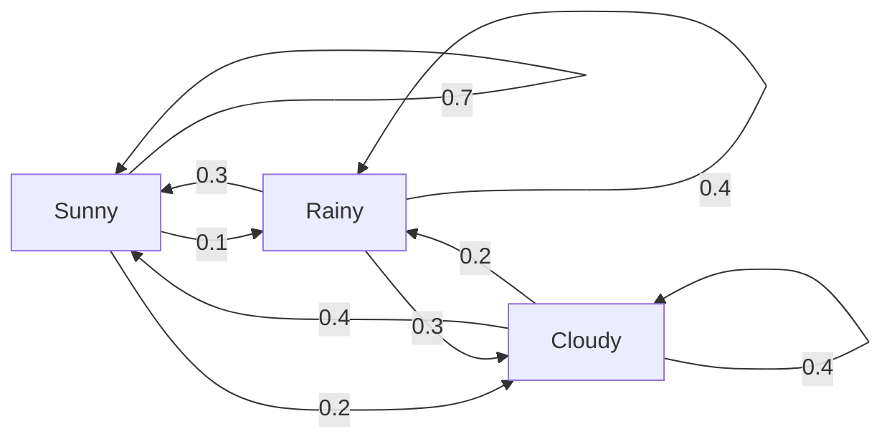
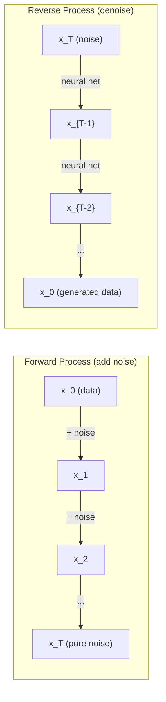

# 随机过程

> 具有结构的随机性。随机漫步、马尔可夫链和扩散模型背后的数学。

**Type:** Learn
**Language:** Python
**Prerequisites:** Phase 1, Lessons 06-07 (probability, Bayes)
**Time:** ~75 minutes

## 学习目标

- 模拟一维和二维随机游走，验证位移的sqrt(n)缩放
- 建立一个马尔可夫链模拟器，通过特征分解计算其平稳分布
- 从目标分布中实现Metropolis-Hastings MCMC和Langevin动态采样
- 将正向扩散过程与布朗运动联系起来，并解释反向过程如何产生数据

## 这个问题

许多AI系统都包含随时间演变的随机性。不是静态随机性，而是结构化的顺序随机性，其中每个步骤都取决于之前发生的事情。

语言模型每次生成一个标记。每个令牌都依赖于前面的上下文。模型输出一个概率分布，从中采样，然后继续。这是一个随机过程。

扩散模型将噪声逐步添加到图像中，直到它变成纯静态。然后他们把这个过程反过来，一步一步去噪，直到新图像出现。前向过程是一个马尔可夫链。逆向过程是一个向后运行的学习马尔可夫链。

强化学习代理在一个环境中采取行动。每个动作以一定的概率导致一个新状态。代理在随机世界中遵循随机策略。整个过程就是一个马尔可夫决策过程。

MCMC抽样——贝叶斯推理的主干——构建了一个马尔可夫链，其平稳分布是你想要采样的后验。

所有这些都建立在四个基本理念之上：
1. 随机漫步——最简单的随机过程
2. 马尔可夫链——带有转移矩阵的结构化随机性
3. 朗之万动力学——带噪声的梯度下降
4. 大都会-黑斯廷斯，从任何分布中抽样

## 这个概念

### 随机漫步

从位置0开始。每一步，抛一枚均匀的硬币。正面：向右移动（+1）。反面：向左移动（-1）。

n步之后，你的位置是n个随机的+/-1值的和。期望位置为0（行走是无偏的）。但是到原点的期望距离随着根号n增长。

这是违反直觉的。这条路走得很平稳，两个方向都没有偏移。但随着时间的推移，它会离它开始的地方越来越远。n步后的标准差是√n。

```
Step 0:  Position = 0
Step 1:  Position = +1 or -1
Step 2:  Position = +2, 0, or -2
...
Step 100: Expected distance from origin ~ 10 (sqrt(100))
Step 10000: Expected distance from origin ~ 100 (sqrt(10000))
```

*在2D中，行走以相同的概率向上、向下、向左或向右移动。同样的根号(n)缩放也适用于到原点的距离。路径呈分形模式。

**为什么sqrt (n) ?**每一步都是+1或-1，概率相等。n步后，位置S_n = X_1 + X_2 +…+ X_n，每个X_i都是+/-1。每一步的方差是1，每一步都是独立的，所以Var(S_n) = n，标准差= sqrt(n)。根据中心极限定理，S_n / sqrt(n)收敛于标准正态分布。

这种sqrt(n)缩放在ML中随处可见。SGD噪声缩放为1/sqrt（batch_size）。嵌入维度按平方根(d)缩放。平方根是独立随机加法的特征。

**与布朗运动的联系。**随机漫步，步长为1/sqrt(n)，每单位时间n步。当n趋于无穷时，游动收敛于布朗运动B(t)——一个连续时间过程，其中B(t)是正态分布，均值为0，方差为t。

布朗运动是扩散的数学基础。它模拟了流体中粒子的随机振动，股票价格的波动，以及——至关重要的——扩散模型中的噪声过程。

**赌徒的毁灭。**随机漫步者从位置k开始，吸收屏障在0和N处，在0之前到达N的概率是多少？对于一次公平的散步：P（到达N） = k/N。这是惊人的简单和优雅。它与鞅理论有关——公平随机游走是一个鞅（预期未来值=当前值）。

### 马尔可夫链

马尔可夫链是一个根据固定概率在状态之间转换的系统。关键属性：下一个状态仅依赖于当前状态，而不依赖于历史。

```
P(X_{t+1} = j | X_t = i, X_{t-1} = ...) = P(X_{t+1} = j | X_t = i)
```

这是马尔可夫性质。这意味着你可以用一个转移矩阵P来描述整个动力学：

```
P[i][j] = probability of going from state i to state j
```

P的每一行和为1（你必须去某个地方）。

*例如——天气：**

```
States: Sunny (0), Rainy (1), Cloudy (2)

P = [[0.7, 0.1, 0.2],    (if sunny: 70% sunny, 10% rainy, 20% cloudy)
     [0.3, 0.4, 0.3],    (if rainy: 30% sunny, 40% rainy, 30% cloudy)
     [0.4, 0.2, 0.4]]    (if cloudy: 40% sunny, 20% rainy, 40% cloudy)
```

从任何状态开始。经过多次跃迁，状态分布收敛于平稳分布pi，其中pi * P = pi。这是特征值为1的P的左特征向量。

对于天气链，平稳分布可能为[0.53,0.18,0.29]——从长期来看，无论起始状态如何，53%的时间都是晴天。



**Computing the stationary distribution.** There are two approaches:

1. **Power method**: multiply any initial distribution by P repeatedly. After enough iterations, it converges.
2. **Eigenvalue method**: find the left eigenvector of P with eigenvalue 1. This is the eigenvector of P^T with eigenvalue 1.

Both approaches require the chain to satisfy convergence conditions.

**Convergence conditions.** A Markov chain converges to a unique stationary distribution if it is:
- **Irreducible**: every state is reachable from every other state
- **Aperiodic**: the chain does not cycle with a fixed period

Most chains you encounter in ML satisfy both conditions.

**Absorbing states.** A state is absorbing if once you enter it, you never leave (P[i][i] = 1). Absorbing Markov chains model processes with terminal states -- a game that ends, a customer who churns, a token sequence that hits the end-of-text token.

**Mixing time.** How many steps until the chain is "close" to the stationary distribution? Formally, the number of steps until the total variation distance from stationarity drops below some threshold. Fast mixing = few steps needed. The spectral gap of P (1 minus the second-largest eigenvalue) controls the mixing time. Larger gap = faster mixing.

### Connection to Language Models

Token generation in a language model is approximately a Markov process. Given the current context, the model outputs a distribution over the next token. Temperature controls the sharpness:

```
P(token_i) = exp(logit_i / temperature) / sum（exp(logit_j / temperature)）
```

- Temperature = 1.0: standard distribution
- Temperature < 1.0: sharper (more deterministic)
- Temperature > 1.0: flatter (more random)
- Temperature -> 0: argmax (greedy)

Top-k sampling truncates to the k highest-probability tokens. Top-p (nucleus) sampling truncates to the smallest set of tokens whose cumulative probability exceeds p. Both modify the Markov transition probabilities.

### Brownian Motion

The continuous-time limit of the random walk. Position B(t) has three properties:
1. B(0) = 0
2. B(t) - B(s) is normally distributed with mean 0 and variance t - s (for t > s)
3. Increments on non-overlapping intervals are independent

Brownian motion is continuous but nowhere differentiable -- it jiggles at every scale. The path has fractal dimension 2 in the plane.

In discrete simulation, you approximate Brownian motion by:

```
B(t + dt) = B(t) +√(dt) * z，其中z ~ N（0,1）
```

The sqrt(dt) scaling is important. It comes from the central limit theorem applied to random walks.

### Langevin Dynamics

Gradient descent finds the minimum of a function. Langevin dynamics finds the probability distribution proportional to exp(-U(x)/T), where U is an energy function and T is temperature.

```
间{t + 1} = x_t - dt *梯度(U (x_t) +√(2 * t * dt) * z_t
```

Two forces act on the particle:
1. **Gradient force** (-dt * gradient(U)): pushes toward low energy (like gradient descent)
2. **Random force** (sqrt(2*T*dt) * z): pushes in random directions (exploration)

At temperature T = 0, this is pure gradient descent. At high temperature, it is nearly a random walk. At the right temperature, the particle explores the energy landscape and spends more time in low-energy regions.

**Connection to diffusion models.** The forward process of a diffusion model is:

```
X_t = sqrt(alpha_t) * x_{t-1} + sqrt(1 - alpha_t) *噪声
```

This is a Markov chain that gradually mixes the data with noise. After enough steps, x_T is pure Gaussian noise.

The reverse process -- going from noise back to data -- is also a Markov chain, but its transition probabilities are learned by a neural network. The network learns to predict the noise that was added at each step, then subtracts it.



### 马尔科夫链蒙特卡洛

有时你需要从分布p(x)中抽样你可以计算（直到一个常数）但不能直接抽样。贝叶斯后验是一个经典的例子——你知道概率乘以先验，但是归一化常数很棘手。

**Metropolis-Hastings**构造了平稳分布为p(x)的马尔可夫链：

1. 从某个位置x开始
2. 从提议分布Q（x‘|x）中提出一个新的位置x’
3. 计算的接受率:= p (x) * (x | x ') / (p (x) * (x ' | x))
4. 以最小（1,a）的概率接受x'。否则保持x。
5. 重复。

如果Q是对称的(例如，Q(x'|x) = Q(x|x') = N(x, sigma^2))，该比率简化为a = p(x') / p(x)。你只需要概率之比——标准化常数抵消。

在温和条件下，保证链收敛于p(x)。但如果提案太小（随机漫步）或太大（高拒绝率），收敛速度可能会很慢。调优提议是MCMC的艺术。

**为什么有效。**接受比保证了详细的平衡：在x处移动到x‘的概率等于在x处移动到x’的概率。详细平衡意味着p(x)是链的平稳分布。经过足够的步骤，样本来自p(x)

**实际问题:**
- **老化**：丢弃前N个样本。链条从起点到达平稳分布需要时间。
- **细化**：保留每k个样本，以减少自相关性。
- **多链**：从不同的起点运行多个链。如果它们收敛到相同的分布，你就有了收敛的证据。
- **接受率**：对于d维的高斯建议，最佳接受率约为23% （Roberts & Rosenthal, 2001）。太高意味着链条几乎不动。太低意味着它拒绝一切。

### 人工智能中的随机过程

| Process | AI Application |
|---------|---------------|
| Random walk | Exploration in RL, Node2Vec embeddings |
| Markov chain | Text generation, MCMC sampling |
| Brownian motion | Diffusion models (forward process) |
| Langevin dynamics | Score-based generative models, SGLD |
| Markov decision process | Reinforcement learning |
| Metropolis-Hastings | Bayesian inference, posterior sampling |

## 构建它

### 步骤1：随机漫步模拟器

”“python
import numpy as np

def random_walk_1d(n_steps, seed=None)：
rng = np.random.RandomState（seed）
步骤= rng。选择（[- 1,1],size=n_steps）
位置= np。连接([[0],np.cumsum(步骤)))
返回岗位


def random_walk_2d(n_steps, seed=None)：
rng = np.random.RandomState（seed）
方向= rng。选择(4、大小= n_steps)
Dx = np. 0 （n_steps）
Dy = np. 0 （n_steps）
Dx[方向== 0]= 1 #右
Dx[方向== 1]= -1 #左
Dy[方向== 2]= 1 # up
Dy[方向== 3]= -1 #向下
X = np。连接([[0],np.cumsum (dx)))
Y = np。连接([[0],np.cumsum (dy)))
返回x， y
```

The 1D walk stores cumulative sums. Each step is +1 or -1. After n steps, the position is the sum. The variance grows linearly with n, so the standard deviation grows as sqrt(n).

### Step 2: Markov chain

```python
class MarkovChain:
    def __init__(self, transition_matrix, state_names=None):
        self.P = np.array(transition_matrix, dtype=float)
        self.n_states = len(self.P)
        self.state_names = state_names or [str(i) for i in range(self.n_states)]

    def step(self, current_state, rng=None):
        if rng is None:
            rng = np.random.RandomState()
        probs = self.P[current_state]
        return rng.choice(self.n_states, p=probs)

    def simulate(self, start_state, n_steps, seed=None):
        rng = np.random.RandomState(seed)
        states = [start_state]
        current = start_state
        for _ in range(n_steps):
            current = self.step(current, rng)
            states.append(current)
        return states

    def stationary_distribution(self):
        eigenvalues, eigenvectors = np.linalg.eig(self.P.T)
        idx = np.argmin(np.abs(eigenvalues - 1.0))
        stationary = np.real(eigenvectors[:, idx])
        stationary = stationary / stationary.sum()
        return np.abs(stationary)
```

平稳分布是特征值为1的P的左特征向量。我们通过计算P^T的特征向量找到它（转置将左特征向量变成右特征向量）

### 第三步：朗之万动力学

”“python
deflangevin_dynamics (grad_U, x0, dt, temperature, n_steps, seed=None)：
rng = np.random.RandomState（seed）
X = np。数组(x0, dtype =浮动)
轨迹= [x.copy()]
For _in range(n_steps)：
噪声= rng.randn（*x.shape）
x = x - dt * grad_U(x) + np。根号（2 *温度* dt） *噪声
trajectory.append (x.copy ())
返回np.array(轨迹)
```

The gradient pushes x toward low energy. The noise prevents it from getting stuck. At equilibrium, the distribution of samples is proportional to exp(-U(x)/temperature).

### Step 4: Metropolis-Hastings

```python
def metropolis_hastings(target_log_prob, proposal_std, x0, n_samples, seed=None):
    rng = np.random.RandomState(seed)
    x = np.array(x0, dtype=float)
    samples = [x.copy()]
    accepted = 0
    for _ in range(n_samples - 1):
        x_proposed = x + rng.randn(*x.shape) * proposal_std
        log_ratio = target_log_prob(x_proposed) - target_log_prob(x)
        if np.log(rng.rand()) < log_ratio:
            x = x_proposed
            accepted += 1
        samples.append(x.copy())
    acceptance_rate = accepted / (n_samples - 1)
    return np.array(samples), acceptance_rate
```

算法提出一个新的点，检查它是否有更高的概率（或以与比率成比例的概率接受），然后重复。混合良好，合格率应在23-50%左右。

## 使用它

在实践中，您将为这些算法使用已建立的库。但是理解这些机制对于调试和调优很重要。

”“python
import numpy as np

rng = np.random.RandomState（42）
Walk = np.cumsum（rng.）选择（[- 1,1],size=10000）)
print（f“最终位置：{walk[-1]}”）
print（f“期望距离：{np.sqrt(10000):.1f}”）
print（f“实际距离：{abs(walk[-1])}”）
```

### numpy for transition matrices

```python
import numpy as np

P = np.array([[0.7, 0.1, 0.2],
              [0.3, 0.4, 0.3],
              [0.4, 0.2, 0.4]])

distribution = np.array([1.0, 0.0, 0.0])
for _ in range(100):
    distribution = distribution @ P

print(f"Stationary distribution: {np.round(distribution, 4)}")
```

将初始分布反复乘以P。经过足够的迭代，它收敛到平稳分布，不管你从哪里开始。这是求左侧显性特征向量的幂方法。

### 与实际框架的连接

- **PyTorch扩散：**
- **NumPyro / PyMC:**使用MCMC （NUTS采样器，改进了Metropolis-Hastings）进行贝叶斯推断
- **体育馆（RL）：**环境阶跃函数def 了一个马尔可夫决策过程

### 验证马尔可夫链的收敛性

”“python
import numpy as np

P = np.array（[[0.9, 0.1], [0.3, 0.7]]）

eigenvalues = np.linal .eigvals(P)
Spectral_gap = 1 - sorted(np.abs(eigenvalues))[-2]
打印(f“特征值:{特征值}”)
print（f“谱差：{spectral_gap:.4f}”）
print(f)“近似混合时间：{1/spectral_gap：。1 f}步骤”)
```

The spectral gap tells you how fast the chain forgets its initial state. A gap of 0.2 means roughly 5 steps to mix. A gap of 0.01 means roughly 100 steps. Always check this before running long simulations -- a slowly mixing chain wastes compute.

## Ship It

This lesson produces:
- `outputs/prompt-stochastic-process-advisor.md` -- a prompt that helps identify which stochastic process framework applies to a given problem

## Connections

| Concept | Where it shows up |
|---------|------------------|
| Random walk | Node2Vec graph embeddings, exploration in RL |
| Markov chain | Token generation in LLMs, MCMC sampling |
| Brownian motion | Forward diffusion process in DDPM, SDE-based models |
| Langevin dynamics | Score-based generative models, stochastic gradient Langevin dynamics (SGLD) |
| Stationary distribution | MCMC convergence target, PageRank |
| Metropolis-Hastings | Bayesian posterior sampling, simulated annealing |
| Temperature | LLM sampling, Boltzmann exploration in RL, simulated annealing |
| Mixing time | Convergence speed of MCMC, spectral gap analysis |
| Absorbing state | End-of-sequence token, terminal states in RL |
| Detailed balance | Correctness guarantee for MCMC samplers |

Diffusion models deserve special attention. DDPM (Ho et al., 2020) defines a forward Markov chain:

```
q (x_t |间{t - 1}) = N (x_t; sqrt (1-beta_t) *间{t - 1}, beta_t *我)
```

where beta_t is a noise schedule. After T steps, x_T is approximately N(0, I). The reverse process is parameterized by a neural network that predicts the noise:

```
p_theta(间{t - 1} | x_t) = N(间{t - 1}; mu_theta (x_t t), sigma_t ^ 2 * 1)
```

Every step of generation is a step in a learned Markov chain. Understanding Markov chains means understanding how and why diffusion models generate data.

SGLD (Stochastic Gradient Langevin Dynamics) combines mini-batch gradient descent with Langevin noise. Instead of computing the full gradient, you use a stochastic estimate and add calibrated noise. As learning rate decays, SGLD transitions from optimization to sampling -- you get approximate Bayesian posterior samples for free. This is one of the simplest ways to get uncertainty estimates from a neural network.

The key insight across all these connections: stochastic processes are not just theoretical tools. They are the computational mechanisms inside modern AI systems. When you tune the temperature of an LLM, you are adjusting a Markov chain. When you train a diffusion model, you are learning to reverse a Brownian-motion-like process. When you run Bayesian inference, you are constructing a chain that converges to the posterior.

## Exercises

1. **Simulate 1000 random walks of 10000 steps.** Plot the distribution of final positions. Verify it is approximately Gaussian with mean 0 and standard deviation sqrt(10000) = 100.

2. **Build a text generator using a Markov chain.** Train on a small corpus: for each word, count transitions to the next word. Build the transition matrix. Generate new sentences by sampling from the chain.

3. **Implement simulated annealing** using Metropolis-Hastings. Start at high temperature (accept almost everything) and gradually cool down (accept only improvements). Use it to find the minimum of a function with many local minima.

4. **Compare Langevin dynamics at different temperatures.** Sample from a double-well potential U(x) = (x^2 - 1)^2. At low temperature, samples cluster in one well. At high temperature, they spread across both. Find the critical temperature where the chain mixes between wells.

5. **Implement the forward diffusion process.** Start with a 1D signal (e.g., a sine wave). Add noise progressively over 100 steps with a linear noise schedule. Show how the signal degrades to pure noise. Then implement a simple denoiser that reverses the process (even a naive one that just subtracts the estimated noise).

## Key Terms

| Term | What people say | What it actually means |
|------|----------------|----------------------|
| Random walk | "Coin-flip movement" | A process where position changes by random increments at each step |
| Markov property | "Memoryless" | The future depends only on the present state, not on the history |
| Transition matrix | "The probability table" | P[i][j] = probability of moving from state i to state j |
| Stationary distribution | "The long-run average" | The distribution pi where pi*P = pi -- the chain's equilibrium |
| Brownian motion | "Random jiggling" | The continuous-time limit of a random walk, B(t) ~ N(0, t) |
| Langevin dynamics | "Gradient descent with noise" | Update rule that combines deterministic gradient and random perturbation |
| MCMC | "Walking toward the target" | Constructing a Markov chain whose stationary distribution is the one you want |
| Metropolis-Hastings | "Propose and accept/reject" | MCMC algorithm that uses acceptance ratios to ensure convergence |
| Temperature | "The randomness knob" | Parameter controlling the tradeoff between exploration and exploitation |
| Diffusion process | "Noise in, noise out" | Forward: gradually add noise. Reverse: gradually remove it. Generates data. |

## Further Reading

- **Ho, Jain, Abbeel (2020)** -- "Denoising Diffusion Probabilistic Models." The DDPM paper that launched the diffusion model revolution. Clear derivation of the forward and reverse Markov chains.
- **Song & Ermon (2019)** -- "Generative Modeling by Estimating Gradients of the Data Distribution." Score-based approach using Langevin dynamics for sampling.
- **Roberts & Rosenthal (2004)** -- "General state space Markov chains and MCMC algorithms." The theory behind when and why MCMC works.
- **Norris (1997)** -- "Markov Chains." The standard textbook. Covers convergence, stationary distributions, and hitting times.
- **Welling & Teh (2011)** -- "Bayesian Learning via Stochastic Gradient Langevin Dynamics." Combines SGD with Langevin dynamics for scalable Bayesian inference.