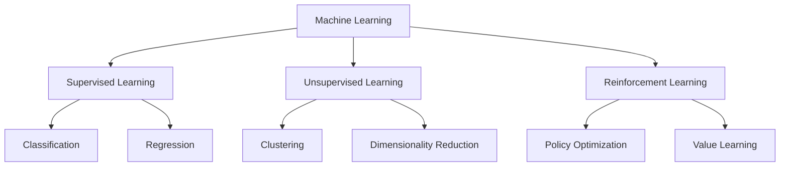
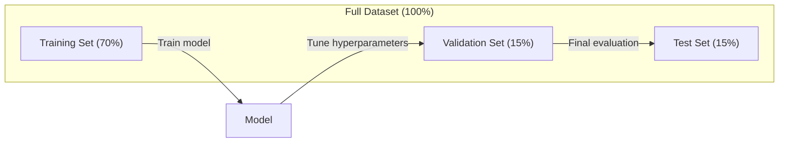
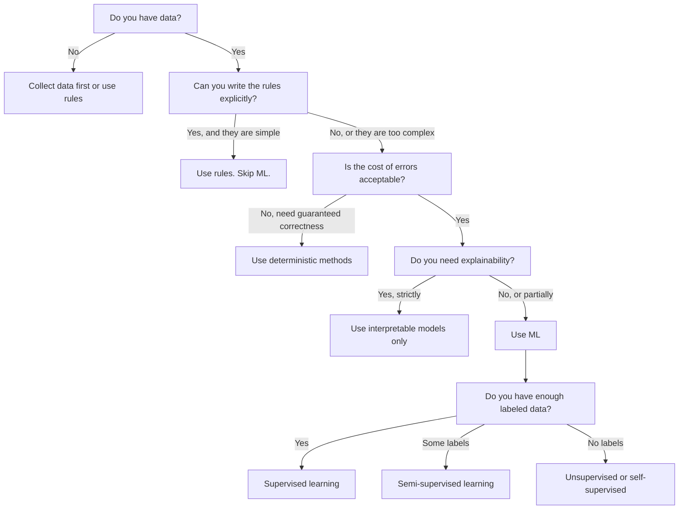

# 什么是机器学习

> 机器学习是教计算机在数据中发现模式，而不是手工编写规则。

**Type:** Learn
**Languages:** Python
**Prerequisites:** Phase 1 (Math Foundations)
**Time:** ~45 minutes

## 学习目标

- 解释监督学习、无监督学习和强化学习之间的区别，并确定哪一种类型适用于给定的问题
- 从头开始实现最近质心分类器，并根据随机基线对其进行评估
- 区分分类和回归任务，并为每个任务选择合适的损失函数
- 评估给定的业务问题是否适合ML，或者使用确定性规则更好地解决

## 这个问题

你想建立一个垃圾邮件过滤器。传统的方法是：坐下来写几百条规则。“如果邮件中包含‘FREE MONEY’，就把它标记为垃圾邮件。如果它有超过3个感叹号，就标记为垃圾邮件。”你花了几个星期写规则。然后垃圾邮件发送者改变他们的措辞。你的规则被打破了。你写了更多的规则。这个循环永远不会结束。

机器学习颠覆了这一点。你不用写规则，而是给电脑贴上标签（“垃圾邮件”或“非垃圾邮件”），让它自己找出规则。电脑会发现你从未想过的模式。当垃圾邮件发送者改变策略时，您需要重新训练新数据，而不是重写代码。

这种从“编程规则”到“从数据中学习”的转变是机器学习的核心。每个推荐引擎、语音助手、自动驾驶汽车和语言模型都是以这种方式工作的。

## 这个概念

### 从数据中学习，而不是规则中学习

传统编程和机器学习解决问题的方向相反。

“‘美人鱼
流程图LR
传统规划子图[“传统规划”]
方向LR
R[规则]—> P1[程序]
D1[数据]—>
P1—> O1[输出]
结束

子图ML[“机器学习”]
方向LR
D2[数据]—> P2[学习算法]
O2[期望输出]——>
P2—> M[模型/规则]
结束
```

Traditional programming: you write the rules. The program applies them to data to produce output.

Machine learning: you provide data and expected outputs. The algorithm discovers the rules.

The "model" that comes out of training IS the rules, encoded as numbers (weights, parameters). It generalizes from examples it has seen to make predictions on data it has never seen.

### The Three Types of Machine Learning



**监督学习**：你有输入-输出对。模型学习将输入映射到输出。
- “这里有1万张标有猫或狗的照片。学会区分它们。”
- “这是房子的特点和价格。学会预测价格。”

**无监督学习**：你只有输入。没有标签。模型可以自己找到结构。
- “这里有1万名顾客的购买记录。找到自然的分组。”
- “这里有1000个维度数据点。在保持结构的同时减少到二维。”

**强化学习**：代理在环境中采取行动并接受奖励或惩罚。它学习一种策略（策略）来最大化总奖励。
- “玩这个游戏。赢+1，输-1。想出一个策略。”
- “控制这个机械臂。捡起物体+1，每浪费1秒-0.01。”

你将在实践中构建的大部分内容都使用监督学习。无监督学习通常用于预处理和探索。强化学习支持游戏AI、机器人和语言模型的RLHF。

### 超越三巨头

上面的三个类别是清晰的，但现实世界的ML往往模糊了界限。

**半监督学习**使用一组小的标记数据和一组大的未标记数据。你可能有100张有标签的医学图像和10万张没有标签的图像。技术包括:

- **标签传播：**建立一个连接相似数据点的图。标签通过图从标记节点传播到未标记的邻居。
- **伪标记：**在标记的数据上训练一个模型，用它来预测未标记数据的标签，然后对所有数据进行重新训练。该模型引导自己的训练集。
- 一致性正则化：模型应该对输入和该输入的稍微扰动版本给出相同的预测。即使没有标签，它也能工作。

**自监督学习**从数据本身创建监督。根本不需要人为的标签。模型根据数据的结构创建自己的预测任务。

- **屏蔽语言建模（BERT）：**隐藏句子中15%的单词，训练模型预测缺失的单词。“标签”来自原文。
- **对比学习（SimCLR）：**拍摄一张图像，创建两个增强版本。训练模型识别它们来自同一图像，同时将它们与其他图像的增强版本区分开来。
- **下一个标记预测（GPT）：**预测给定所有前面单词的下一个单词。每个文本文档都成为一个训练示例。

这些并不是与三巨头分开的类别。它们是结合了有监督和无监督思想的策略。自监督学习在技术上是有监督的（模型预测一些东西），但标签是自动生成的，而不是由人类生成的。

### 分类与回归

这是两个主要的监督学习任务。

| Aspect | Classification | Regression |
|--------|---------------|------------|
| Output | Discrete categories | Continuous numbers |
| Example | "Is this email spam?" | "What will the house price be?" |
| Output space | {cat, dog, bird} | Any real number |
| Loss function | Cross-entropy, accuracy | Mean squared error, MAE |
| Decision | Boundaries between classes | A curve that fits the data |

分类回答“哪个类别？”回归回答“多少？”

有些问题可以用两种方式来解释。预测一只股票是涨是跌是一种分类。预测准确的价格是回归。

### ML工作流

无论算法如何，每个机器学习项目都遵循相同的管道。

“‘美人鱼
流程图LR
A[收集数据]—b> B[清理和探索]
B—> C[特征工程]
C—> D[拆分数据]
D—b> E[火车模型]
E—> F[评估]
F ->|不够好，| C
F—>|足够好|G[部署]
G—> H[监视器]
H—>|性能下降| A
```

**Collect Data**: Gather raw data. More data is almost always better, but quality matters more than quantity.

**Clean & Explore**: Handle missing values, remove duplicates, visualize distributions, spot anomalies. This step often takes 60-80% of total project time.

**Feature Engineering**: Transform raw data into features the model can use. Turn dates into day-of-week. Normalize numerical columns. Encode categorical variables. Good features matter more than fancy algorithms.

**Split Data**: Divide into training, validation, and test sets. The model trains on training data, you tune hyperparameters on validation data, and you report final performance on test data.

**Train Model**: Feed training data into an algorithm. The algorithm adjusts internal parameters to minimize a loss function.

**Evaluate**: Measure performance on validation/test data. If performance is not acceptable, go back and try different features, algorithms, or hyperparameters.

**Deploy**: Put the model into production where it makes predictions on new data.

**Monitor**: Track performance over time. Data distributions change (data drift), and models degrade. When performance drops, retrain.

### Training, Validation, and Test Splits

This is the most important concept beginners get wrong. You must evaluate your model on data it has never seen during training. Otherwise you are measuring memorization, not learning.



| Split | Purpose | When used | Typical size |
|-------|---------|-----------|-------------|
| Training | Model learns from this data | During training | 60-80% |
| Validation | Tune hyperparameters, compare models | After each training run | 10-20% |
| Test | Final unbiased performance estimate | Once, at the very end | 10-20% |

测试集是神圣的。你只看它一次。如果你根据测试表现不断调整你的模型，你就是在有效地训练测试集，你报告的数字是没有意义的。

对于小数据集，使用k-fold交叉验证：将数据分成k部分，对k-1部分进行训练，对剩余部分进行验证，旋转并平均结果。

### 过拟合vs过拟合

“‘美人鱼
流程图LR
子图超滤(“Underfitting”)
U1[“模型过于简单”]
U2(“高偏差”)
U3(“错过模式”)
结束

子图GF[“合适”]
G1(“复杂性”)
G2(“平衡”)
G3(“概括”)
结束

子图(“过度拟合”)
01[“模型过于复杂”]
O2(“高方差”)
O3(“记忆噪音”)
结束

UF ->|增加复杂性| GF
太复杂了
```

**Underfitting**: The model is too simple to capture the patterns in the data. A straight line trying to fit a curved relationship. Training error is high. Test error is high.

**Overfitting**: The model is too complex and memorizes the training data, including its noise. A wiggly curve that passes through every training point but fails on new data. Training error is low. Test error is high.

**Good fit**: The model captures real patterns without memorizing noise. Training error and test error are both reasonably low.

Signs of overfitting:
- Training accuracy is much higher than validation accuracy
- The model performs well on training data but poorly on new data
- Adding more training data improves performance (the model was memorizing, not learning)

Fixes for overfitting:
- Get more training data
- Reduce model complexity (fewer parameters, simpler architecture)
- Regularization (add a penalty for large weights)
- Dropout (randomly zero out neurons during training)
- Early stopping (stop training when validation error starts increasing)

Fixes for underfitting:
- Use a more complex model
- Add more features
- Reduce regularization
- Train longer

### The Bias-Variance Tradeoff

This is the mathematical framework behind overfitting and underfitting.

**Bias**: Error from wrong assumptions in the model. A linear model has high bias when the true relationship is nonlinear. High bias leads to underfitting.

**Variance**: Error from sensitivity to small fluctuations in the training data. A model with high variance gives very different predictions when trained on different subsets of data. High variance leads to overfitting.

| Model complexity | Bias | Variance | Result |
|-----------------|------|----------|--------|
| Too low (linear model for curved data) | High | Low | Underfitting |
| Just right | Medium | Medium | Good generalization |
| Too high (degree-20 polynomial for 10 points) | Low | High | Overfitting |

Total error = Bias^2 + Variance + Irreducible noise

You cannot reduce irreducible noise (it is randomness in the data itself). You want to find the sweet spot where bias^2 + variance is minimized.

### No Free Lunch Theorem

There is no single algorithm that works best for every problem. An algorithm that performs well on one class of problems will perform poorly on another. This is why data scientists try multiple algorithms and compare results.

In practice, the choice depends on:
- How much data you have
- How many features there are
- Whether the relationship is linear or nonlinear
- Whether you need interpretability
- How much compute you can afford

### When NOT to Use Machine Learning

ML is powerful but not always the right tool. Before reaching for a model, ask whether you actually need one.

**Do not use ML when:**

- **Rules are simple and well-defined.** Tax calculation, sorting algorithms, unit conversions. If you can write the logic in a few if-statements, a model adds complexity for no benefit.
- **You have no data or very little data.** ML needs examples to learn from. With 10 data points, you cannot train anything meaningful. Collect data first.
- **The cost of being wrong is catastrophic and you need guaranteed correctness.** Medical dosage calculation, nuclear reactor control, cryptographic verification. ML models are probabilistic. They will sometimes be wrong. If "sometimes wrong" is unacceptable, use deterministic methods.
- **A lookup table or heuristic solves the problem.** If a simple threshold or table covers 99% of cases, adding ML increases maintenance cost without meaningful improvement.
- **You cannot explain the decision and explainability is required.** Regulated industries (lending, insurance, criminal justice) sometimes require that every decision be fully explainable. Some ML models are interpretable (linear regression, small decision trees). Most are not.
- **The problem changes faster than you can retrain.** If the rules change daily and retraining takes a week, the model is always stale.

Use this decision flowchart:



## 构建它

中的代码它展示了核心思想：从数据中学习，然后根据新数据进行预测。

### 步骤1：最接近质心分类器从头开始

最近质心分类器计算训练数据中每个类的中心（平均值）。为了进行预测，它将每个新点分配给中心最近的类。

”“python
类NearestCentroid:
def (self， X, y)：
自我。Classes = np.unique(y)
自我。质心= np.array([
X[y == c]。self.classes中c的平均值（轴=0）
])

def predict(self， X)：
距离= np.array([
np。sqrt((（X - c) ** 2).sum（轴=1））
对于self。centroids中的c
])
返回self.classes [distances.argmin(轴= 0)]
```

That is the entire algorithm. Fit computes two means. Predict computes distances. No gradient descent, no iteration, no hyperparameters.

### Step 2: Train on Synthetic Data

We generate a 2D classification dataset with two classes that overlap slightly. The centroid classifier draws a linear decision boundary between the class centers.

```python
rng = np.random.RandomState(42)
X_class0 = rng.randn(100, 2) + np.array([1.0, 1.0])
X_class1 = rng.randn(100, 2) + np.array([-1.0, -1.0])
X = np.vstack([X_class0, X_class1])
y = np.array([0] * 100 + [1] * 100)
```

### 步骤3：与基线进行比较

每个ML模型都应该与一个微不足道的基线进行比较。这里，基线预测一个随机类。如果你的ML模型不能战胜随机猜测，那一定是出了问题。

”“python
Baseline_preds = rng。select （[0,1], size=len(y_test)）
Baseline_acc = np。平均值（baseline_preds == y_test）
```

The centroid classifier should get around 90%+ accuracy on this clean dataset. Random baseline gets around 50%.

### Why This Matters

The nearest centroid classifier is trivially simple. It has no hyperparameters, no iteration, no gradient descent. Yet it captures the fundamental ML pattern:

1. **Learn** a representation from training data (the centroids)
2. **Predict** on new data using that representation (nearest distance)
3. **Evaluate** against a baseline (random guessing)

Every ML algorithm, from logistic regression to transformers, follows this same three-step pattern. The representation gets more complex, but the workflow stays the same.

### Step 4: What the Centroid Classifier Cannot Do

The nearest centroid classifier assumes each class forms a single blob. It draws linear decision boundaries. It fails when:

- Classes have multiple clusters (e.g., the digit "1" can be written in several different ways)
- The decision boundary is nonlinear (e.g., one class wraps around another)
- Features have very different scales (distance is dominated by the largest-scale feature)

These limitations motivate every other algorithm you will learn. K-nearest neighbors handles multiple clusters. Decision trees handle nonlinear boundaries. Feature scaling fixes the scale problem. Each lesson builds on the limitations of the previous one.

## Use It

sklearn provides `NearestCentroid` and synthetic data generators:

```python
from sklearn.neighbors import NearestCentroid
from sklearn.datasets import make_classification
from sklearn.model_selection import train_test_split

X, y = make_classification(
    n_samples=500, n_features=2, n_redundant=0,
    n_clusters_per_class=1, random_state=42
)
X_train, X_test, y_train, y_test = train_test_split(X, y, test_size=0.3)

clf = NearestCentroid()
clf.fit(X_train, y_train)
print(f"Accuracy: {clf.score(X_test, y_test):.3f}")
```

## 船这

这一课产生了给它一个问题描述（“我们想减少流失”或“预测下一季度的需求”），它就会识别学习类型，定义预测目标，列出候选特征，选择成功指标，建立基线，并标记数据泄漏或类别不平衡等缺陷。在任何ML项目开始时使用它，以避免构建错误的东西。

## 关键术语

| Term | What people say | What it actually means |
|------|----------------|----------------------|
| Model | "The AI" | A mathematical function with learnable parameters that maps inputs to outputs |
| Training | "Teaching the AI" | Running an optimization algorithm to adjust model parameters so predictions match known outputs |
| Feature | "An input column" | A measurable property of the data that the model uses to make predictions |
| Label | "The answer" | The known output for a training example, used to compute the error signal |
| Hyperparameter | "A setting you tweak" | A parameter set before training that controls the learning process (learning rate, number of layers) |
| Loss function | "How wrong the model is" | A function that measures the gap between predicted and actual outputs, which training tries to minimize |
| Overfitting | "It memorized the test" | The model learned training-specific noise instead of general patterns, so it fails on new data |
| Underfitting | "It didn't learn anything" | The model is too simple to capture the real patterns in the data |
| Generalization | "It works on new data" | The model's ability to make accurate predictions on data it was not trained on |
| Cross-validation | "Testing on different chunks" | Repeatedly splitting data into train/test folds and averaging results, giving a more robust performance estimate |
| Regularization | "Keeping weights small" | Adding a penalty term to the loss function that discourages overly complex models |
| Data drift | "The world changed" | The statistical distribution of incoming data shifts over time, degrading model performance |

## 练习

1. 以任何数据集为例（例如，Iris, Titanic）。把它分成70/15/15，分为训练/验证/测试。解释为什么不应该在测试集中调优超参数。
2. 列出三个现实问题。对于每一个，确定它是分类、回归还是聚类，以及它是有监督的还是无监督的。
3. 模型在训练数据上的准确率为99%，而在测试数据上的准确率为60%。诊断问题并列出你将尝试解决的三件事。

## 进一步的阅读

- [统计学习入门](https://www.statlearning.com/) -免费教科书，涵盖所有经典的ML方法和实际示例
- [b谷歌的机器学习速成班](https://developers.google.com/machine-learning/crash-course) -对机器学习概念的简明直观介绍
- [Scikit-learn用户指南](https://scikit-learn.org/stable/user_guide.html) -在Python中实现ML的实用参考