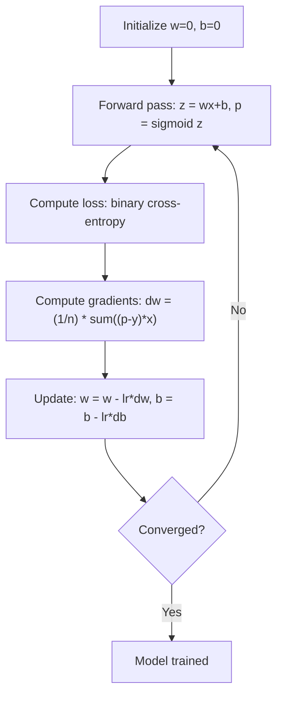

# 逻辑回归

> 逻辑回归将直线弯曲成s曲线，用概率回答是或否的问题。

**Type:** Build
**Languages:** Python
**Prerequisites:** Phase 2 Lesson 1-2 (What Is ML, Linear Regression)
**Time:** ~90 minutes

## 学习目标

- 使用sigmoid函数和二元交叉熵损失从头开始实现逻辑回归
- 计算和解释精度，召回率，F1分数，和二元分类的混淆矩阵
- 解释为什么MSE不能进行分类，为什么二元交叉熵会产生一个凸代价面
- 建立多类分类的softmax回归模型，评估阈值调优权衡

## 这个问题

你想根据肿瘤的大小来预测它是恶性的还是良性的。你可以尝试线性回归。它输出像0.3或1.7或-0.5这样的数字。这是什么意思？1.7是“非常恶性”吗？-0.5“非常良性”吗？线性回归输出无界数字。分类需要0到1之间的有限概率，以及一个明确的决定：是或否。

逻辑回归解决了这个问题。它采用相同的线性组合（wx + b）并将其传递给sigmoid函数，该函数将任何数字压入范围（0,1）。输出是一个概率。您设置一个阈值（通常为0.5）并做出决定。

这是实践中应用最广泛的算法之一。尽管它的名字，逻辑回归是一个分类算法，而不是回归算法。这个名字来自于它使用的逻辑函数（sigmoid）。

## 这个概念

### 为什么线性回归分类失败

想象一下，根据学习时间预测及格/不及格（1/0）。线性回归拟合出一条贯穿数据的直线：

```
hours:  1   2   3   4   5   6   7   8   9   10
actual: 0   0   0   0   1   1   1   1   1   1
```

线性拟合可能会在第1小时产生-0.2和第10小时产生1.3这样的预测。这些值不是概率。它们在0以下和1以上。更糟糕的是，一个异常值（研究了50个小时的人）会拖整条线，改变对每个人的预测。

分类需要这样一个函数：
- 输出值介于0和1之间（概率）
- 创建一个尖锐的过渡（决策边界）
- 是不是被远离边界的离群值扭曲了

### Sigmoid函数

sigmoid函数就是这样做的：

```
sigmoid(z) = 1 / (1 + e^(-z))
```

属性:
- 当z较大且为正值时，sigmoid(z)趋近于1
- 当z较大且为负值时，sigmoid(z)趋于0
- 当z = 0时，sigmoid(z) = 0.5
- 输出总是在0到1之间
- 函数处处光滑可微

其导数有一个方便的形式：sigmoid'(z) = sigmoid(z) * (1 - sigmoid(z))。这使得梯度计算变得高效。

### Logistic回归=线性模型+ s型模型

模型计算z = wx + b（与线性回归相同），然后应用sigmoid：

“‘mermaid
流程图LR
X[输入特征X]—> L["Linear: z = wx + b"]
L—> S["Sigmoid: p = 1/(1+e^-z)"]
S—> D{“p >= 0.5?”｝
D—b> |是| P[预测1]
D—>|No| N[预测0]
```

The output p is interpreted as P(y=1 | x), the probability that the input belongs to class 1. The decision boundary is where wx + b = 0, which makes sigmoid output exactly 0.5.

### Binary Cross-Entropy Loss

You cannot use MSE for logistic regression. MSE with a sigmoid creates a non-convex cost surface with many local minima. Instead, use binary cross-entropy (log loss):

```
损失= - (1 / n) *总和(y *对数(p) + (1 y) * (1 - p))
```

Why this works:
- When y=1 and p is close to 1: log(1) = 0, so loss is near 0 (correct, low cost)
- When y=1 and p is close to 0: log(0) approaches negative infinity, so loss is huge (wrong, high cost)
- When y=0 and p is close to 0: log(1) = 0, so loss is near 0 (correct, low cost)
- When y=0 and p is close to 1: log(0) approaches negative infinity, so loss is huge (wrong, high cost)

This loss function is convex for logistic regression, guaranteeing a single global minimum.

### Gradient Descent for Logistic Regression

The gradients for binary cross-entropy with sigmoid have a clean form:

```
dL/dw = (1/n) * sum（(p - y) * x）
dL/db = (1/n) * sum（p - y）
```

These look identical to the linear regression gradients. The difference is that p = sigmoid(wx + b) instead of p = wx + b. The sigmoid introduces the nonlinearity, but the gradient update rule stays the same.



### 决策边界

对于2D输入（两个特征），决策边界为：

```
w1*x1 + w2*x2 + b = 0
```

一边的点被分类为1，另一边的点被分类为0。逻辑回归总是产生一个线性决策边界。如果你需要一个弯曲的边界，你要么添加多项式特征，要么使用非线性模型。

### 使用Softmax进行多类分类

二元逻辑回归处理两个类。对于k个类，使用softmax函数：

```
softmax(z_i) = e^(z_i) / sum(e^(z_j) for all j)
```

每个类都有自己的权重向量。该模型为每个类计算一个分数z_i，然后softmax将分数转换为总和为1的概率。预测的类是概率最高的类。

损失函数变为分类交叉熵：

```
Loss = -(1/n) * sum(sum(y_k * log(p_k)))
```

其中y_k对于真实类为1，对于所有其他类为0（单热编码）。

### 评价指标

仅仅准确是不够的。对于95%为负和5%为正的数据集，总是预测为负的模型得到95%的准确率，但毫无用处。

*** *混淆矩阵:

| | Predicted Positive | Predicted Negative |
|---|---|---|
| Actually Positive | True Positive (TP) | False Negative (FN) |
| Actually Negative | False Positive (FP) | True Negative (TN) |

**精度**：在所有预测的阳性中，有多少是实际阳性的？
```
Precision = TP / (TP + FP)
```

**回忆**（灵敏度）：在所有实际阳性中，我们捕获了多少？
```
Recall = TP / (TP + FN)
```

**F1得分**：准确率和召回率的调和平均值。平衡两个指标。
```
F1 = 2 * (Precision * Recall) / (Precision + Recall)
```

什么时候优先考虑：
- **精度**：当误报是昂贵的（垃圾邮件过滤器，你不想阻止合法的电子邮件）
- **回忆**：当假阴性是昂贵的（癌症筛查，你不想错过一个肿瘤）
- **F1**：当你需要一个单一的平衡度量

## 构建它

### 第一步：Sigmoid函数和数据生成

”“python
进口随机
导入数学

def乙状结肠(z):
Z = max（-500, min(500， Z)）
返回1.0 / （1.0 + math.exp(-z)）


random.seed (42)
N = 200
X = []
Y = []

for _ in range(N // 2)：
X.append([随机的。高斯（2,1），随机的。高斯(2,1)])
y.append (0)

for _ in range(N // 2)：
X.append([随机的。高斯（5,1），随机的。高斯(1)])
y.append (1)

组合= list（zip(X, y)）
random.shuffle(组合)
X, y = zip（*组合）
X = list(X)
Y = list(Y)

print（f“生成{N}个样本（2个类，2个特征）”）
print（f“Class 0中心：（2,2），Class 1中心：（5,5）”）
打印（f“前5个样品：”）
对于(5)范围内的I：
打印(f) "功能：[{X[i][0]：。2 f}, {X[我][1]:。2f}]，标签：{y[i]}")
```

### Step 2: Logistic regression from scratch

```python
class LogisticRegression:
    def __init__(self, n_features, learning_rate=0.01):
        self.weights = [0.0] * n_features
        self.bias = 0.0
        self.lr = learning_rate
        self.loss_history = []

    def predict_proba(self, x):
        z = sum(w * xi for w, xi in zip(self.weights, x)) + self.bias
        return sigmoid(z)

    def predict(self, x, threshold=0.5):
        return 1 if self.predict_proba(x) >= threshold else 0

    def compute_loss(self, X, y):
        n = len(y)
        total = 0.0
        for i in range(n):
            p = self.predict_proba(X[i])
            p = max(1e-15, min(1 - 1e-15, p))
            total += y[i] * math.log(p) + (1 - y[i]) * math.log(1 - p)
        return -total / n

    def fit(self, X, y, epochs=1000, print_every=200):
        n = len(y)
        n_features = len(X[0])
        for epoch in range(epochs):
            dw = [0.0] * n_features
            db = 0.0
            for i in range(n):
                p = self.predict_proba(X[i])
                error = p - y[i]
                for j in range(n_features):
                    dw[j] += error * X[i][j]
                db += error
            for j in range(n_features):
                self.weights[j] -= self.lr * (dw[j] / n)
            self.bias -= self.lr * (db / n)
            loss = self.compute_loss(X, y)
            self.loss_history.append(loss)
            if epoch % print_every == 0:
                print(f"  Epoch {epoch:4d} | Loss: {loss:.4f} | w: [{self.weights[0]:.3f}, {self.weights[1]:.3f}] | b: {self.bias:.3f}")
        return self

    def accuracy(self, X, y):
        correct = sum(1 for i in range(len(y)) if self.predict(X[i]) == y[i])
        return correct / len(y)


split = int(0.8 * N)
X_train, X_test = X[:split], X[split:]
y_train, y_test = y[:split], y[split:]

print("\n=== Training Logistic Regression ===")
model = LogisticRegression(n_features=2, learning_rate=0.1)
model.fit(X_train, y_train, epochs=1000, print_every=200)

print(f"\nTrain accuracy: {model.accuracy(X_train, y_train):.4f}")
print(f"Test accuracy:  {model.accuracy(X_test, y_test):.4f}")
print(f"Weights: [{model.weights[0]:.4f}, {model.weights[1]:.4f}]")
print(f"Bias: {model.bias:.4f}")
```

### 步骤3：从头开始混淆矩阵和指标

”“python
类ClassificationMetrics:
Def __init__(self, y_true, y_pred)：
自我。Tp = sum（1 for t, p in zip(y_true, y_pred) if t == 1 and p == 1）
自我。Tn = sum（1 for t, p in zip(y_true, y_pred) if t == 0 and p == 0）
自我。Fp = sum（1 for t, p in zip(y_true, y_pred) if t == 0 and p == 1）
自我。Fn = sum（1 for t, p in zip(y_true, y_pred) if t == 1 and p == 0）

def精度(自我):
Total = self。Tp + self。Tn + self。Fp + self
返回(自我。Tp + self。Tn) / total if total > 0 else 0

def精度(自我):
Denom =自我。Tp + self.fp
回归自我。Tp / dom if dom > 0 else 0

def召回(自我):
Denom =自我。Tp + self.fn
回归自我。Tp / dom if dom > 0 else 0

def f1(自我):
P = self.precision（）
R = self.recall（）
返回2 * p * r / (p + r) if (p + r) > 0 else 0

    def print_confusion_matrix(self):
        print(f"\n  Confusion Matrix:")
        print(f"                  Predicted")
        print(f"                  Pos   Neg")
        print(f"  Actual Pos     {self.tp:4d}  {self.fn:4d}")
        print(f"  Actual Neg     {self.fp:4d}  {self.tn:4d}")

def print_report(自我):
self.print_confusion_matrix ()
print（f"\n Accuracy: {self.accuracy():.4f}"）
print（f" Precision: {self.precision():.4f}"）
print（f" Recall: {self.recall():.4f}"）
print（f" F1分数：{self.f1():.4f}"）


Y_pred_test =[模型。predict(x) for x in X_test
print（"\n===分类报告（测试集）==="）
metrics = ClassificationMetrics（y_test, y_pred_test）
metrics.print_report ()
```

### Step 4: Decision boundary analysis

```python
print("\n=== Decision Boundary ===")
w1, w2 = model.weights
b = model.bias
print(f"Decision boundary: {w1:.4f}*x1 + {w2:.4f}*x2 + {b:.4f} = 0")
if abs(w2) > 1e-10:
    print(f"Solved for x2:     x2 = {-w1/w2:.4f}*x1 + {-b/w2:.4f}")

print("\nSample predictions near the boundary:")
test_points = [
    [3.0, 3.0],
    [3.5, 3.5],
    [4.0, 4.0],
    [2.5, 2.5],
    [5.0, 5.0],
]
for point in test_points:
    prob = model.predict_proba(point)
    pred = model.predict(point)
    print(f"  [{point[0]}, {point[1]}] -> prob={prob:.4f}, class={pred}")
```

### 第五步：使用softmax进行多分类

”“python
类SoftmaxRegression:
Def __init__(self, n_features, n_classes, learning_rate=0.01)：
自我。N_features = N_features
自我。N_classes = N_classes
自我。Lr = learning_rate
自我。Weights = [[0.0] * n_features for _ in range(n_classes)]
自我。偏差= [0.0]* n_classes

Def softmax(self, scores)：
Max_score = max（分数）
Exp_scores =[数学分数]Exp (s - max_score) for s in scores
Total = sum（exp_scores）
返回[e / total for e in exp_scores]

Def predict_proba(self, x)：
分数= [
sum(自我。Weights [k][j] * x[j] for j in range(self。N_features)) + self.biases[k]
For k in range（self.n_classes）
］
返回self.softmax(分数)

Def predict(self, x)：
Probs = self.predict_proba(x)
返回probs.index (max(聚合氯化铝))

def (self， X, y, epochs=1000, print_every=200)：
N = len(y)
对于range（epochs）中的epoch：
Grad_w = [[0.0] * self。N_features for _in range(self.n_classes)]
Grad_b = [0.0] * self.n_classes
Total_loss = 0.0
对于I在(n)范围内：
probs = self.predict_proba（X[i]）
对于k在range（self.n_classes）中：
如果y[i] == k，则目标= 1.0
错误= probs[k] -目标
对于range（self.n_features）中的j：
grad_w[k][j] += error * X[i][j]
Grad_b [k] += error
True_prob = max（pros [y[i]], 1e-15）
Total_loss -= math.log（true_prob）
对于k在range（self.n_classes）中：
对于range（self.n_features）中的j：
自我。权重[k][j] -= self。Lr * （grad_w[k][j] / n）
自我。偏见[k] -=自我。Lr * （grad_b[k] / n）
如果epoch % print_every == 0：
print（f" Epoch {Epoch:4d} | Loss: {total_loss / n:.4f}"）
回归自我

defaccuracy (self， X, y)：
正确= sum(1 for I in range(len(y)) if self。预测(X[i]) == y[i])
返回正确/ len(y)


random.seed (42)
X_3class = []
Y_3class = []

中心= [(1,1),(5,1),(3,5)]
对于label， （cx, cy）在enumerate（centers）中：
对于范围（50）中的_：
X_3class.append([随机的。高斯（cx, 0.8），随机。高斯(cy, 0.8)])
y_3class.append(标签)

组合= list（zip(X_3class, y_3class)）
random.shuffle(组合)
X_3class, y_3class = zip（*组合）
X_3class = list（X_3class）
Y_3class = list（Y_3class）

split_3 = int（0.8 * len(X_3class)）
X_train_3 = X_3class[:split_3]
y_train_3 = y_3class[:split_3]
X_test_3 = X_3class[split_3:]
y_test_3 = y_3class[split_3:]

print（"\n=== Multi-class Softmax Regression（3类）==="）
softmax_model = SoftmaxRegression（n_features=2, n_classes=3, learning_rate=0.1）
softmax_model.fit（X_train_3, y_train_3, epochs=1000, print_every=200）
print(f"\nTrain精度：{softmax_model。准确性(X_train_3 y_train_3): .4f}”)
打印(f)“测试精度：{softmax_model。准确性(X_test_3 y_test_3): .4f}”)

打印(“\ nSample预测:“)
对于(5)范围内的I：
probs = softmax_model.predict_proba（X_test_3[i]）
pred = softmax_model.predict（X_test_3[i]）
打印(f“真正的:{y_test_3[我]},预测:{pred},聚合氯化铝:[. join (f ' {', ' {p:。3f}' for p in probs '}]"
```

### Step 6: Threshold tuning

```python
print("\n=== Threshold Tuning ===")
print("Default threshold: 0.5. Adjusting the threshold trades precision for recall.\n")

thresholds = [0.3, 0.4, 0.5, 0.6, 0.7]
print(f"{'Threshold':>10} {'Accuracy':>10} {'Precision':>10} {'Recall':>10} {'F1':>10}")
print("-" * 52)

for t in thresholds:
    y_pred_t = [1 if model.predict_proba(x) >= t else 0 for x in X_test]
    m = ClassificationMetrics(y_test, y_pred_t)
    print(f"{t:>10.1f} {m.accuracy():>10.4f} {m.precision():>10.4f} {m.recall():>10.4f} {m.f1():>10.4f}")
```

## 使用它

scikit-learn也是一样。

”“python
从sklearn。import LogisticRegression作 as SklearnLR
从sklearn。度量导入accuracy_score、precision_score、recall_score、f1_score
从sklearn。指标导入confusion_matrix， classification_report
从sklearn。Model_selection导入train_test_split
从sklearn。预处理导入StandardScaler
import numpy as np

np.random.seed (42)
X_0 = np.random。Randn (100,2) + [2,2]
X_1 = np随机。Randn (100,2) + [5,5]
X_sk = np。vstack ([X_0 X_1])
Y_sk = np。数组（[0]* 100 + [1]* 100）

（X_sk, y_sk, test_size=0.2, random_state=42）

scaler =标准scaler （）
X_tr_sc = scaler.fit_transform（X_tr）
X_te_sc = scaler.transform（X_te）

lr = SklearnLR()
lr.fit(X_tr_sc, y_tr)
y_pred = lr.predict(X_te_sc)

print（"=== Scikit-learn Logistic Regression ==="）
print（f“准确度：{accuracy_score(y_te, y_pred):.4f}”）
print（f"Precision: {precision_score(y_te, y_pred):.4f}"）
print（f"Recall: {recall_score(y_te, y_pred):.4f}"）
print（f"F1: {f1_score(y_te, y_pred):.4f}"）
print（f"\nConfusion Matrix:\n{confusion_matrix(y_te, y_pred)}"）
print（f"\nClassification Report:\n{classification_report(y_te, y_pred)}"）
```

Your from-scratch implementation produces the same decision boundary and metrics. Scikit-learn adds solver options (liblinear, lbfgs, saga), automatic regularization, multi-class strategies (one-vs-rest, multinomial), and numerical stability optimizations.

## Ship It

This lesson produces:
- `code/logistic_regression.py` - logistic regression from scratch with metrics

## Exercises

1. Generate a dataset that is NOT linearly separable (e.g., two concentric circles). Train logistic regression and observe its failure. Then add polynomial features (x1^2, x2^2, x1*x2) and train again. Show that the accuracy improves.
2. Implement a multi-class confusion matrix for the 3-class softmax model. Compute per-class precision and recall. Which class is hardest to classify?
3. Build an ROC curve from scratch. For 100 threshold values from 0 to 1, compute the true positive rate and false positive rate. Calculate the AUC (area under the curve) using the trapezoidal rule.

## Key Terms

| Term | What people say | What it actually means |
|------|----------------|----------------------|
| Logistic regression | "Regression for classification" | A linear model followed by a sigmoid function that outputs class probabilities |
| Sigmoid function | "The S-curve" | The function 1/(1+e^(-z)) that maps any real number to the range (0, 1) |
| Binary cross-entropy | "Log loss" | The loss function -[y*log(p) + (1-y)*log(1-p)] that penalizes confident wrong predictions severely |
| Decision boundary | "The dividing line" | The surface where the model's output probability equals 0.5, separating predicted classes |
| Softmax | "Multi-class sigmoid" | A function that converts a vector of scores into probabilities that sum to 1 |
| Precision | "How many selected are relevant" | TP / (TP + FP), the fraction of positive predictions that are actually positive |
| Recall | "How many relevant are selected" | TP / (TP + FN), the fraction of actual positives that the model correctly identifies |
| F1 score | "Balanced accuracy" | The harmonic mean of precision and recall: 2*P*R / (P+R) |
| Confusion matrix | "The error breakdown" | A table showing TP, TN, FP, FN counts for each class pair |
| Threshold | "The cutoff" | The probability value above which the model predicts class 1 (default 0.5, tunable) |
| One-hot encoding | "Binary columns for categories" | Representing class k as a vector of zeros with a 1 at position k |
| Categorical cross-entropy | "Multi-class log loss" | The extension of binary cross-entropy to k classes using one-hot encoded labels |