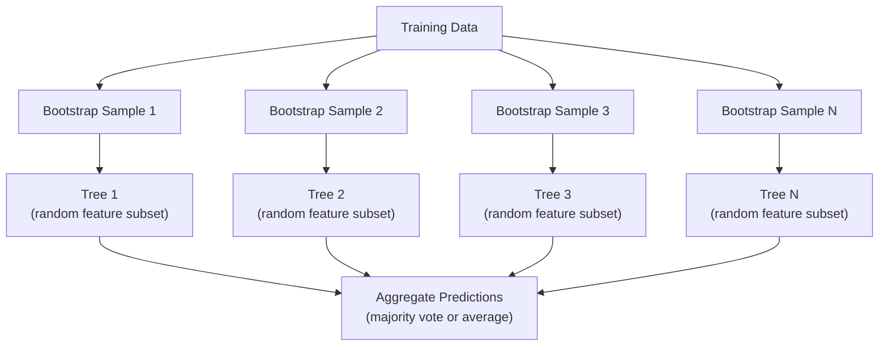

# 决策树和随机森林

> 决策树就是一个流程图。但是它们的森林是ML中最强大的工具之一。

**Type:** Build
**Language:** Python
**Prerequisites:** Phase 1 (Lessons 09 Information Theory, 06 Probability)
**Time:** ~90 minutes

## 学习目标

- 实现基尼杂质，熵和信息增益计算，以找到最优的决策树分裂
- 使用预修剪控制（最大深度，最小样本）从头构建决策树分类器
- 使用自举抽样和特征随机化构造一个随机森林，并解释为什么它可以减少方差
- 比较MDI特征重要度和排列重要度，识别MDI是否有偏差

## 这个问题

你有表格数据。行是样本，列是特征，还有一个您想要预测的目标列。你可以给它一个神经网络。但对于表格数据，基于树的模型（决策树、随机森林、梯度增强树）始终优于深度学习。结构化数据领域的Kaggle竞争主要由XGBoost和LightGBM主导，而不是transformer。

为什么?树无需预处理即可处理混合特征类型（数字和分类）。它们处理非线性关系时不需要特征工程。它们是可解释的：你可以看看这棵树，看看为什么会做出预测。随机森林，平均许多树，对中等规模的数据集有很强的抗过拟合能力。

本课使用递归分割从头构建决策树，然后在上面构建随机森林。您将实现分割标准（基尼不纯，熵，信息增益）背后的数学，并理解为什么弱学习者的集合会成为强学习者。

## 这个概念

### 决策树的作用是什么

决策树通过询问一系列是/否问题将特征空间划分为矩形区域。

“‘mermaid
图道明
“年龄< 30岁？”[“收入5万美元？”］
A—>|No| C[“信用评分> 700?”］
B—>|是| D[“批准”]
B—>|No| E[“拒绝”]
C—>|是| F[“批准”]
C—>|No| G[“拒绝”]
```

Each internal node tests a feature against a threshold. Each leaf node makes a prediction. To classify a new data point, you start at the root and follow the branches until you reach a leaf.

The tree is built top-down by choosing, at each node, the feature and threshold that best separate the data. "Best" is defined by a split criterion.

### Split criteria: measuring impurity

At each node, we have a set of samples. We want to split them so that the resulting child nodes are as "pure" as possible, meaning each child contains mostly one class.

**Gini impurity** measures the probability that a randomly chosen sample would be misclassified if it were labeled according to the class distribution at that node.

```
Gini(S) = 1 - sum（p_k^2）

其中p_k是集合S中k类的比例。
```

For a pure node (all one class), Gini = 0. For a binary split with 50/50 classes, Gini = 0.5. Lower is better.

```
例如：6只猫，4只狗

Gini = 1 - (0.6^2 + 0.4^2) = 1 - (0.36 + 0.16) = 0.48
```

**Entropy** measures the information content (disorder) in a node. Covered in Phase 1 Lesson 09.

```
熵(S) = -sum（p_k * log2(p_k)）
```

For a pure node, entropy = 0. For a 50/50 binary split, entropy = 1.0. Lower is better.

```
例如：6只猫，4只狗

熵= -(0.6 * log2（0.6) + 0.4 * log2(0.4)）
= -（0.6 * -0.737 + 0.4 * -1.322）
= 0.442 + 0.529
= 0.971位
```

**Information gain** is the reduction in impurity (entropy or Gini) after a split.

```
IG(S, feature, threshold) =杂质(S) - weighted_avg（杂质（S_left），杂质（S_right））

其中权重是每个子节点中样本的比例。
```

The greedy algorithm at each node: try every feature and every possible threshold. Pick the (feature, threshold) pair that maximizes information gain.

### How splitting works

For a dataset with n features and m samples at the current node:

1. For each feature j (j = 1 to n):
   - Sort the samples by feature j
   - Try every midpoint between consecutive distinct values as a threshold
   - Compute the information gain for each threshold
2. Select the feature and threshold with the highest information gain
3. Split the data into left (feature <= threshold) and right (feature > threshold)
4. Recurse on each child

This greedy approach does not guarantee the globally optimal tree. Finding the optimal tree is NP-hard. But greedy splitting works well in practice.

### Stopping conditions

Without stopping conditions, the tree grows until every leaf is pure (one sample per leaf). This perfectly memorizes the training data and generalizes terribly.

**Pre-pruning** stops the tree before it fully grows:
- Maximum depth: stop splitting when the tree reaches a set depth
- Minimum samples per leaf: stop if a node has fewer than k samples
- Minimum information gain: stop if the best split improves impurity by less than a threshold
- Maximum leaf nodes: limit the total number of leaves

**Post-pruning** grows the full tree, then trims it back:
- Cost-complexity pruning (used by scikit-learn): adds a penalty proportional to the number of leaves. Increase the penalty to get smaller trees
- Reduced error pruning: remove a subtree if the validation error does not increase

Pre-pruning is simpler and faster. Post-pruning often produces better trees because it does not prematurely stop splits that might lead to useful further splits.

### Decision trees for regression

For regression, the leaf prediction is the mean of the target values in that leaf. The split criterion changes too:

**Variance reduction** replaces information gain:

```
VR(S, feature, threshold) = Var(S) - weighted_avg(Var（S_left), Var(S_right)）
```

Pick the split that reduces variance the most. The tree partitions the input space into regions, and predicts a constant (the mean) in each region.

### Random forests: the power of ensembles

A single decision tree is high variance. Small changes in the data can produce completely different trees. Random forests fix this by averaging many trees.



两个来源的随机性使得树的多样性：

*Bagging (bootstrap aggregating):**每棵树都在一个bootstrap样本上进行训练，这是一个随机样本，从训练数据中替换。大约63%的原始样本出现在每个bootstrap中（其余的是可用于验证的袋外样本）。

**特征随机化：**在每个分裂，只考虑一个随机子集的特征。对于分类，默认是sqrt（n_features）。对于回归，n_features/3。这可以防止所有树在相同的主要特征上分裂。

关键的观点是：对许多不相关的树进行平均可以在不增加偏差的情况下减少方差。每棵树可能都很平庸。整体很强大。

### 功能的重要性

随机森林自然会提供特征重要性分数。最常见的方法：

**Mean reduction in杂质（MDI）：**对于每个特征，求和所有树和使用该特征的所有节点的杂质减少总量。在较早的分裂中产生较大杂质减少的特征更重要。

```
importance(feature_j) = sum over all nodes where feature_j is used:
    (n_samples_at_node / n_total_samples) * impurity_decrease
```

这是快速的（在训练期间计算），但偏向于高基数特征和具有许多可能分裂点的特征。

*排列重要性**是另一种选择：打乱一个特征的值，并测量模型的准确性下降了多少。更可靠，但速度更慢。

### 当树打败了神经网络

树木和森林主导着表格数据的神经网络。几个原因:

| Factor | Trees | Neural networks |
|--------|-------|----------------|
| Mixed types (numeric + categorical) | Native support | Need encoding |
| Small datasets (< 10k rows) | Work well | Overfit |
| Feature interactions | Found by splitting | Need architecture design |
| Interpretability | Full transparency | Black box |
| Training time | Minutes | Hours |
| Hyperparameter sensitivity | Low | High |

当数据具有空间或顺序结构（图像、文本、音频）时，神经网络获胜。对于扁平的特征表，树是默认的。

## 构建它

### 步骤1：基尼杂质和熵

从头开始构建两个拆分标准，并验证它们同意哪个拆分是好的。

”“python
导入数学

def gini_impurity(标签):
N = len（labels）
如果n == 0：
返回0.0
计数= {}
对于标签中的标签：
Counts [label] = Counts。得到(label, 0) + 1
返回1.0 - sum(（c / n) ** 2 for c in counts.values()）

def熵(标签):
N = len（labels）
如果n == 0：
返回0.0
计数= {}
对于标签中的标签：
Counts [label] = Counts。得到(label, 0) + 1
返回总和(
（c / n） * math。Log2 （c / n）的c在计数。值（）如果c > 0
）
```

### Step 2: Find the best split

Try every feature and every threshold. Return the one with the highest information gain.

```python
def information_gain(parent_labels, left_labels, right_labels, criterion="gini"):
    measure = gini_impurity if criterion == "gini" else entropy
    n = len(parent_labels)
    n_left = len(left_labels)
    n_right = len(right_labels)
    if n_left == 0 or n_right == 0:
        return 0.0
    parent_impurity = measure(parent_labels)
    child_impurity = (
        (n_left / n) * measure(left_labels) +
        (n_right / n) * measure(right_labels)
    )
    return parent_impurity - child_impurity
```

### 步骤3：构建DecisionTree类

递归分割、预测和特征重要性跟踪。

”“python
类DecisionTree:
def __init__(self, max_depth=None, min_samples_split=2，
min_samples_leaf = 1,则=“基尼”,
max_features = None):
自我。Max_depth = Max_depth
自我。Min_samples_split = Min_samples_split
自我。Min_samples_leaf = Min_samples_leaf
自我。标准
自我。Max_features = Max_features
自我。tree =无
自我。feature_importances_ =无

def (self， X, y)：
自我。n_features = len（X[0]）
自我。Feature_importances_ = [0.0] * self.n_features
自我。n_samples = len(X)
自我。树=自我。_build（X, y, depth=0）
Total = sum（self.feature_importances_）
如果总> 0：
自我。Feature_importances_ = [
Fi / total在self.feature_importances_
］

def predict(self， X)：
回归自我。_predict_one (x,自我。tree) for x in x]
```

### Step 4: Build the RandomForest class

Bootstrap sampling, feature randomization, and majority voting.

```python
class RandomForest:
    def __init__(self, n_trees=100, max_depth=None,
                 min_samples_split=2, max_features="sqrt",
                 criterion="gini"):
        self.n_trees = n_trees
        self.max_depth = max_depth
        self.min_samples_split = min_samples_split
        self.max_features = max_features
        self.criterion = criterion
        self.trees = []

    def fit(self, X, y):
        n = len(X)
        for _ in range(self.n_trees):
            indices = [random.randint(0, n - 1) for _ in range(n)]
            X_boot = [X[i] for i in indices]
            y_boot = [y[i] for i in indices]
            tree = DecisionTree(
                max_depth=self.max_depth,
                min_samples_split=self.min_samples_split,
                max_features=self.max_features,
                criterion=self.criterion,
            )
            tree.fit(X_boot, y_boot)
            self.trees.append(tree)

    def predict(self, X):
        all_preds = [tree.predict(X) for tree in self.trees]
        predictions = []
        for i in range(len(X)):
            votes = {}
            for preds in all_preds:
                v = preds[i]
                votes[v] = votes.get(v, 0) + 1
            predictions.append(max(votes, key=votes.get))
        return predictions
```

参见

## 使用它

使用scikit-learn，训练随机森林有三行：

”“python
从sklearn。集成导入RandomForestClassifier
从sklearn。数据集导入load_iris
从sklearn。Model_selection导入train_test_split

X, y= load_iris（return_X_y=True）
(1) X_train, X_test, y_train, y_test = train_test_split

rf = RandomForestClassifier（n_estimators=100, random_state=42）
rf.fit (X_train y_train)
打印(f”准确性:{射频。分数(X_test y_test): .4f}”)
print（f"Feature importance: {r .feature_importances_}"）
```

In practice, gradient boosted trees (XGBoost, LightGBM, CatBoost) are often stronger than random forests because they build trees sequentially, with each tree correcting the errors of the previous ones. But random forests are harder to misconfigure and require almost no hyperparameter tuning.

## Ship It

This lesson produces `outputs/prompt-tree-interpreter.md` -- a prompt that interprets decision tree splits for business stakeholders. Feed it a trained tree's structure (depth, features, split thresholds, accuracy) and it translates the model into plain-language rules, ranks feature importance, flags overfitting or leakage, and recommends next steps. Use it any time you need to explain a tree-based model to someone who does not read code.

## Exercises

1. Train a single decision tree on a 2D dataset with 3 classes. Manually trace the splits and draw the rectangular decision boundaries. Compare the boundaries at max_depth=2 vs max_depth=10.

2. Implement variance reduction splitting for regression trees. Generate y = sin(x) + noise for 200 points and fit your regression tree. Plot the tree's piecewise-constant predictions against the true curve.

3. Build a random forest with 1, 5, 10, 50, and 200 trees. Plot training accuracy and test accuracy vs number of trees. Observe that test accuracy plateaus but does not decrease (forests resist overfitting).

4. Compare Gini impurity vs entropy as split criteria on 5 different datasets. Measure accuracy and tree depth. In most cases, they produce nearly identical results. Explain why.

5. Implement permutation importance. Compare it with MDI importance on a dataset where one feature is random noise but has high cardinality. MDI will rank the noise feature highly. Permutation importance will not.

## Key Terms

| Term | What people say | What it actually means |
|------|----------------|----------------------|
| Decision tree | "A flowchart for predictions" | A model that partitions feature space into rectangular regions by learning a sequence of if/else splits |
| Gini impurity | "How mixed the node is" | Probability of misclassifying a random sample at a node. 0 = pure, 0.5 = maximum impurity for binary |
| Entropy | "The disorder in a node" | Information content at a node. 0 = pure, 1.0 = maximum uncertainty for binary. From information theory |
| Information gain | "How good a split is" | Reduction in impurity after a split. The greedy criterion for choosing splits |
| Pre-pruning | "Stop the tree early" | Stopping tree growth early by setting max depth, min samples, or min gain thresholds |
| Post-pruning | "Trim the tree after" | Growing the full tree, then removing subtrees that do not improve validation performance |
| Bagging | "Train on random subsets" | Bootstrap aggregating. Train each model on a different random sample with replacement |
| Random forest | "A bunch of trees" | Ensemble of decision trees, each trained on a bootstrap sample with random feature subsets at each split |
| Feature importance (MDI) | "Which features matter" | Total impurity decrease contributed by each feature, summed across all trees and nodes |
| Permutation importance | "Shuffle and check" | Accuracy drop when a feature's values are randomly shuffled. More reliable than MDI for noisy features |
| Variance reduction | "The regression version of info gain" | The regression tree analogue of information gain. Picks the split that reduces target variance the most |
| Bootstrap sample | "Random sample with repeats" | A random sample drawn with replacement from the original dataset. Same size, but with duplicates |

## Further Reading

- [Breiman: Random Forests (2001)](https://link.springer.com/article/10.1023/A:1010933404324) - the original random forest paper
- [Grinsztajn et al.: Why do tree-based models still outperform deep learning on tabular data? (2022)](https://arxiv.org/abs/2207.08815) - rigorous comparison of trees vs neural networks on tabular tasks
- [scikit-learn Decision Trees documentation](https://scikit-learn.org/stable/modules/tree.html) - practical guide with visualization tools
- [XGBoost: A Scalable Tree Boosting System (Chen & Guestrin, 2016)](https://arxiv.org/abs/1603.02754) - the gradient boosting paper that dominates Kaggle