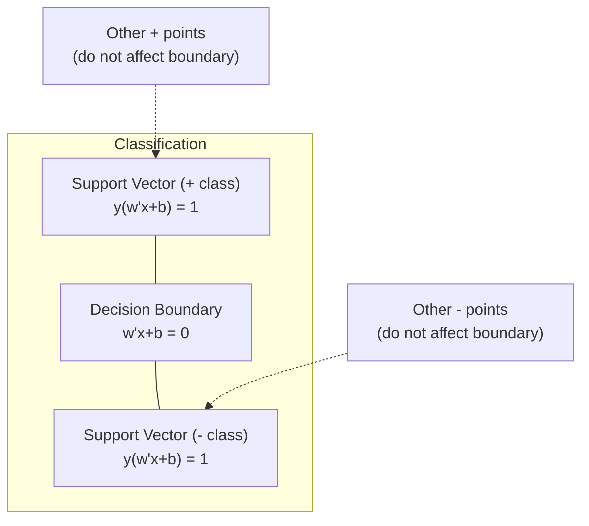

# 支持向量机

> 找出两个阶级之间最宽的街道。这就是整个想法。

**Type:** Build
**Language:** Python
**Prerequisites:** Phase 1 (Lessons 08 Optimization, 14 Norms and Distances, 18 Convex Optimization)
**Time:** ~90 minutes

## 学习目标

- 在原始公式上使用铰链损失和梯度下降从头开始实现线性支持向量机
- 解释最大边际原则，并从训练过的模型中识别支持向量
- 比较线性、多项式和RBF核，并解释核技巧如何避免显式高维映射
- 评估由C参数控制的边距宽度和分类误差之间的权衡

## 这个问题

您有两类数据点，需要绘制一条线（或超平面）将它们分开。无限多条线都可以。你应该选哪一个？

差额最大的那个。边界是决策边界和每边最近的数据点之间的距离。更大的裕度意味着分类器更有信心，对未见过的数据进行更好的泛化。

这种直觉导致了支持向量机，这是ML中数学上最优雅的算法之一。支持向量机是深度学习之前的主要分类方法，并且仍然是小数据集，高维数据以及需要原则性，易于理解的模型和理论保证的问题的最佳选择。

支持向量机直接连接到阶段1：优化是凸的（第18课），边际是用规范测量的（第14课），核技巧利用点积来处理非线性边界，而无需在高维空间中进行计算。

## 这个概念

### 最大边际分类器

给定标签y_i在{-1，+1}中的线性可分数据和特征向量x_i，我们需要一个超平面w^T x + b = 0来分离这些类。

点x_i到超平面的距离为：

```
distance = |w^T x_i + b| / ||w||
```

对于一个正确分类的点：y_i * (w^ tx_i + b) > 0。边距是超平面到任何一侧最近点的距离的两倍。

“‘mermaid
图LR
子图边缘
方向结核病
[" w ^ T x + b = + 1”)~ ~ ~ b(“w ^ T x + b = 0”]~ ~ ~ C [w ^ T x + b = 1”)
结束
D[“+类分”]—>
E[“-类点”]—> C
B—F[“决策边界”]
```

The optimization problem:

```
最大化2 / ||w||（边距宽度）
对所有i服从y_i * (w^ tx_i + b) >= 1
```

Equivalently (minimizing ||w||^2 is easier to optimize):

```
最小化（1/2）||w||^2
对所有i服从y_i * (w^ tx_i + b) >= 1
```

This is a convex quadratic program. It has a unique global solution. The data points that sit exactly on the margin boundaries (where y_i * (w^T x_i + b) = 1) are the support vectors. They are the only points that determine the decision boundary. Move or remove any non-support-vector point, and the boundary does not change.

### Support vectors: the critical few



大多数训练点都是无关紧要的。只有支持向量是重要的。这就是支持向量机在预测时内存效率高的原因：你只需要存储支持向量，而不是整个训练集。

支持向量的个数也给出了泛化误差的界限。相对于数据集的大小，更少的支持向量意味着更好的泛化。

### 软边距：用C参数处理噪声

真实的数据很少是完全可分离的。有些点可能在边界的错误一侧，或者在边缘内。软边际公式通过引入松弛变量允许违规。

```
minimize    (1/2) ||w||^2 + C * sum(xi_i)
subject to  y_i * (w^T x_i + b) >= 1 - xi_i
            xi_i >= 0  for all i
```

松弛变量xi_i测量点i违反边距的程度。C控制权衡：

| C value | Behavior |
|---------|----------|
| Large C | Penalizes violations heavily. Narrow margin, fewer . Overfits |
| Small C | Allows more violations. Wide margin, more . Underfits |

C是正则化强度，倒置。较大的C =较小的正则化。小C =更多的正则化。

### 铰损：SVM损失函数

软边界支持向量机可以重写为无约束优化：

```
minimize    (1/2) ||w||^2 + C * sum(max(0, 1 - y_i * (w^T x_i + b)))
```

项max（0,1 - y_i * f(x_i)）是铰链损失。当点被正确分类并且超出边界时，它为零。当点在页边距内或分类错误时，它是线性的。

```
Hinge loss for a single point:

loss
  |
  | \
  |  \
  |   \
  |    \
  |     \_______________
  |
  +-----|-----|-------->  y * f(x)
       0     1

Zero loss when y*f(x) >= 1 (correctly classified, outside margin).
Linear penalty when y*f(x) < 1.
```

与logistic损失（logistic回归）比较：

```
Hinge:     max(0, 1 - y*f(x))          Hard cutoff at margin
Logistic:  log(1 + exp(-y*f(x)))        Smooth, never exactly zero
```

铰链损失产生稀疏解（只有支持向量有非零贡献）。物流损失使用所有数据点。这使得svm在预测时内存效率更高。

### 用梯度下降法训练线性支持向量机

你可以在不求解约束QP的情况下，使用铰链损失和L2正则化的梯度下降来训练线性SVM：

```
L(w, b) = (lambda/2) * ||w||^2 + (1/n) * sum(max(0, 1 - y_i * (w^T x_i + b)))

Gradient with respect to w:
  If y_i * (w^T x_i + b) >= 1:  dL/dw = lambda * w
  If y_i * (w^T x_i + b) < 1:   dL/dw = lambda * w - y_i * x_i

Gradient with respect to b:
  If y_i * (w^T x_i + b) >= 1:  dL/db = 0
  If y_i * (w^T x_i + b) < 1:   dL/db = -y_i
```

这被称为原始公式。它在每个epoch运行O(n * d)，其中n是样本的数量，d是特征的数量。对于大型的、稀疏的、高维的数据（文本分类），这是很快的。

### 对偶公式和核技巧

SVM问题的拉格朗日对偶（来自第18课第1阶段，KKT条件）为：

```
maximize    sum(alpha_i) - (1/2) * sum_ij(alpha_i * alpha_j * y_i * y_j * (x_i . x_j))
subject to  0 <= alpha_i <= C
            sum(alpha_i * y_i) = 0
```

对偶只涉及到x_i的点积。数据点之间的X_j。这是关键的见解。将每个点积替换为核函数K(x_i, x_j)， SVM可以学习非线性边界，而无需显式地计算转换。

```
Linear kernel:      K(x, z) = x . z
Polynomial kernel:  K(x, z) = (x . z + c)^d
RBF (Gaussian):     K(x, z) = exp(-gamma * ||x - z||^2)
```

RBF内核将数据映射到无限维空间。输入空间中接近的点的核值在1附近。距离较远的点的核值在0附近。它可以学习任何光滑的决策边界。

“‘mermaid
图LR
子图“输入空间（不可分离）”
A[“2D数据点<br>圆形边界”]
结束
子图“特征空间（可分）”
B[“较高dim<br>线性边界的数据点”]
结束
A——>|“内核技巧<br>K(x,z) = phi(x)。φ(z)”| B
```

The kernel trick computes the dot product in the high-dimensional space without ever going there. For the polynomial kernel of degree d in D dimensions, the explicit feature space has O(D^d) dimensions. But K(x, z) is computed in O(D) time.

### SVM for regression (SVR)

Support Vector Regression fits a tube of width epsilon around the data. Points inside the tube have zero loss. Points outside the tube are penalized linearly.

```
出现在w minimize(线图)| | | |“2 + C * ^菁菁(xi_i + xi_i *)
根据y_i - (w胡言乱语x_i + b) <= + xi_i
[胡言乱语]- y_i <= epsilon + xi_i*
xi_i, xi_i* >= 0
```

The epsilon parameter controls the tube width. Wider tube = fewer support vectors = smoother fit. Narrower tube = more support vectors = tighter fit.

### Why SVMs lost to deep learning (and when they still win)

SVMs dominated ML from the late 1990s through the early 2010s. Deep learning surpassed them for several reasons:

| Factor | SVMs | Deep learning |
|--------|------|---------------|
| Feature engineering | Requires it | Learns features |
| Scalability | O(n^2) to O(n^3) for kernel | O(n) per epoch with SGD |
| Image/text/audio | Needs handcrafted features | Learns from raw data |
| Large datasets (>100k) | Slow | Scales well |
| GPU acceleration | Limited benefit | Massive speedup |

SVMs still win in these situations:
- Small datasets (hundreds to low thousands of samples)
- High-dimensional sparse data (text with TF-IDF features)
- When you need mathematical guarantees (margin bounds)
- When training time must be minimal (linear SVM is very fast)
- Binary classification with clear margin structure
- Anomaly detection (one-class SVM)

## Build It

### Step 1: Hinge loss and gradient

The foundation. Compute hinge loss for a batch and its gradient.

```python
def hinge_loss(X, y, w, b):
    n = len(X)
    total_loss = 0.0
    for i in range(n):
        margin = y[i] * (dot(w, X[i]) + b)
        total_loss += max(0.0, 1.0 - margin)
    return total_loss / n
```

### 步骤2：梯度下降线性支持向量机

通过最小化正则化铰链损失来训练。不需要QP求解器。

”“python
类LinearSVM:
Def __init__(self, lr=0.001, lambda_param=0.01, n_epochs=1000)：
自我。Lr = Lr
自我。Lambda_param = Lambda_param
自我。N_epochs = N_epochs
自我。w =无
自我。B = 0.0

def (self， X, y)：
n_features = len（X[0]）
自我。W = [0.0] * n_features
自我。B = 0.0

对于range（self.n_epochs）中的epoch：
for i in range(len(X))：
Margin = y[i] * (dot(self。w, X[i]) + self.b)
如果margin >= 1：
自我。W = [wj - self]。Lr * self。Lambda_param * wj
为了我自己。
其他:
自我。W = [wj - self]。Lr * (self。lambda_param * wj - y[i] * X[i][j])
对于j， wj in enumerate(self.w)]
自我。B -=自我。Lr * （-y[i]）

def predict(self， X)：
返回[1]if dot(self。W, x) + self。b >= 0 else -1 for x in x]
```

### Step 3: Kernel functions

Implement linear, polynomial, and RBF kernels.

```python
def linear_kernel(x, z):
    return dot(x, z)

def polynomial_kernel(x, z, degree=3, c=1.0):
    return (dot(x, z) + c) ** degree

def rbf_kernel(x, z, gamma=0.5):
    diff = [xi - zi for xi, zi in zip(x, z)]
    return math.exp(-gamma * dot(diff, diff))
```

### 步骤4：边缘和支持向量识别

训练后，识别哪些点是支持向量，计算边缘宽度。

”“python
deffind_support_vectors (X, y, w, b, l=1e-3)：
Support_vectors = []
for i in range(len(X))：
margin = y[i] * （dot(w, X[i]) + b）
如果abs(margin - 1.0) < tol：
support_vectors.append(我)
返回support_vectors
```

See `code/svm.py` for the complete implementation with all demos.

## Use It

With scikit-learn:

```python
from sklearn.svm import SVC, LinearSVC, SVR
from sklearn.preprocessing import StandardScaler
from sklearn.pipeline import Pipeline

clf = Pipeline([
    ("scaler", StandardScaler()),
    ("svm", SVC(kernel="rbf", C=1.0, gamma="scale")),
])
clf.fit(X_train, y_train)
print(f"Accuracy: {clf.score(X_test, y_test):.4f}")
print(f"Support vectors: {clf['svm'].n_support_}")
```

重要的是：在训练支持向量机之前，始终缩放你的特征。支持向量机对特征大小很敏感，因为边缘依赖于||w||，而未缩放的特征会扭曲几何形状。

对于大型数据集，使用

”“python
从sklearn。导入LinearSVC

clf =管道([
(“标量”,StandardScaler ()),
（"svm", LinearSVC(C=1.0, max_iter=10000)），
])
```

## Exercises

1. Generate a 2D linearly separable dataset. Train your LinearSVM and identify the support vectors. Verify that the support vectors are the points closest to the decision boundary.

2. Vary C from 0.001 to 1000 on a noisy dataset. Plot the decision boundary for each C value. Observe the transition from wide margin (underfitting) to narrow margin (overfitting).

3. Create a dataset where class boundaries are circular (not linear). Show that a linear SVM fails. Compute the RBF kernel matrix and show that the classes become separable in the kernel-induced feature space.

4. Compare hinge loss vs logistic loss on the same dataset. Train a linear SVM and logistic regression. Count how many training points contribute to each model's decision boundary (support vectors vs all points).

5. Implement SVR (epsilon-insensitive loss). Fit it to y = sin(x) + noise. Plot the epsilon tube around the predictions and highlight the support vectors (points outside the tube).

## Key Terms

| Term | What it actually means |
|------|----------------------|
| Support vectors | The training points closest to the decision boundary. The only points that determine the hyperplane |
| Margin | The distance between the decision boundary and the nearest support vectors. SVMs maximize this |
| Hinge loss | max(0, 1 - y*f(x)). Zero when correctly classified and outside the margin. Linear penalty otherwise |
| C parameter | Trade-off between margin width and classification errors. Large C = narrow margin, small C = wide margin |
| Soft margin | SVM formulation that allows margin violations via slack variables. Handles non-separable data |
| Kernel trick | Computing dot products in a high-dimensional feature space without explicitly mapping to that space |
| Linear kernel | K(x, z) = x . z. Equivalent to standard dot product. For linearly separable data |
| RBF kernel | K(x, z) = exp(-gamma * \|\|x-z\|\|^2). Maps to infinite dimensions. Learns any smooth boundary |
| Polynomial kernel | K(x, z) = (x . z + c)^d. Maps to a feature space of polynomial combinations |
| Dual formulation | Reformulation of the SVM problem that depends only on dot products between data points. Enables kernels |
| SVR | Support Vector Regression. Fits an epsilon-tube around the data. Points inside the tube have zero loss |
| Slack variables | xi_i: measures how much a point violates the margin. Zero for correctly classified points outside margin |
| Maximum margin | The principle of choosing the hyperplane that maximizes the distance to the nearest points of each class |

## Further Reading

- [Vapnik: The Nature of Statistical Learning Theory (1995)](https://link.springer.com/book/10.1007/978-1-4757-3264-1) - the foundational text on SVMs and statistical learning
- [Cortes & Vapnik: Support-vector networks (1995)](https://link.springer.com/article/10.1007/BF00994018) - the original SVM paper
- [Platt: Sequential Minimal Optimization (1998)](https://www.microsoft.com/en-us/research/publication/sequential-minimal-optimization-a-fast-algorithm-for-training-support-vector-machines/) - the SMO algorithm that made SVM training practical
- [scikit-learn SVM documentation](https://scikit-learn.org/stable/modules/svm.html) - practical guide with implementation details
- [LIBSVM: A Library for Support Vector Machines](https://www.csie.ntu.edu.tw/~cjlin/libsvm/) - the C++ library behind most SVM implementations