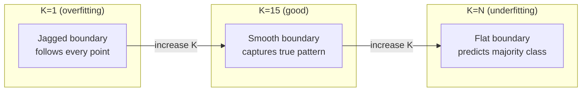

# k近邻和距离

> 商店一切。通过观察你的邻居来预测。这是最简单的算法。

**Type:** Build
**Language:** Python
**Prerequisites:** Phase 1 (Lesson 14 Norms and Distances)
**Time:** ~90 minutes

## 学习目标

- 使用可配置的K和距离加权投票从头开始实现KNN分类和回归
- 比较L1、L2、余弦和Minkowski距离度量，并为给定的数据类型选择合适的度量
- 解释维度的诅咒，并证明为什么KNN在高维空间中会退化
- 构建kd树以进行有效的最近邻搜索，并分析它何时优于暴力搜索

## 这个问题

你有一个数据集。一个新的数据点到达。你需要对它进行分类或者预测它的值。不是从数据中学习参数（如线性回归或支持向量机），而是找到最接近新点的K个训练点，让它们投票。

这是k个近邻。没有培训阶段。没有参数需要学习。无损失函数最小化。你存储整个训练集，并在预测时计算距离。

这听起来太简单了。但是KNN在许多问题上具有令人惊讶的竞争力，特别是对于中小型数据集，并且深入理解它揭示了基本概念：距离度量的选择（连接到阶段1的第14课），维度的诅咒，以及懒惰和渴望学习之间的区别。

KNN在现代人工智能中也无处不在，只是名字不同而已。矢量数据库对嵌入进行KNN搜索。检索增强生成（RAG）查找K个最近的文档块。推荐系统查找相似的用户或项目。算法是一样的。规模和数据结构是不同的。

## 这个概念

### KNN的工作原理

给定一个标记点的数据集和一个新的查询点：

1. 计算查询到数据集中每个点的距离
2. 按距离排序
3. 取K个最近的点
4. 分类：K个邻居的多数投票
5. 对于回归：K个邻居值的平均值（或加权平均值）

“‘美人鱼
图道明
问：“查询点？”—b> D[“计算<br>到所有训练点的距离”]
D—> S[“按距离排序”]
S—> K[“选择最近的K”]
K—> C{“分类<br>还是回归？”｝
C—>|分类| V[“多数投票”]
C—>|回归| A[“平均值”]
V—> P[“预测”]
A——b> p
```

That is the entire algorithm. No fitting. No gradient descent. No epochs.

### Choosing K

K is the single hyperparameter. It controls the bias-variance trade-off:

| K | Behavior |
|---|----------|
| K = 1 | Decision boundary follows every point. Zero training error. High variance. Overfits |
| Small K (3-5) | Sensitive to local structure. Can capture complex boundaries |
| Large K | Smoother boundaries. More robust to noise. May underfit |
| K = N | Predicts the majority class for every point. Maximum bias |

A common starting point is K = sqrt(N) for a dataset of N points. Use odd K for binary classification to avoid ties.



### 距离度量

距离函数定义了“近”的含义。不同的指标产生不同的邻域，不同的预测。

**L2（欧几里得）**是默认的。直线距离。

```
d(a, b) = sqrt(sum((a_i - b_i)^2))
```

对特征尺度敏感。在使用L2和KNN之前，一定要对特性进行标准化。

**L1（曼哈顿）**求和绝对差异。对异常值比L2更健壮，因为它没有平方差异。

```
d(a, b) = sum(|a_i - b_i|)
```

*余弦距离**测量矢量之间的夹角，忽略大小。必不可少的文本和嵌入数据。

```
d(a, b) = 1 - (a . b) / (||a|| * ||b||)
```

**Minkowski**用参数p泛化L1和L2。

```
d(a, b) = (sum(|a_i - b_i|^p))^(1/p)

p=1: Manhattan
p=2: Euclidean
p->inf: Chebyshev (max absolute difference)
```

使用哪个指标取决于数据：

| Data type | Best metric | Why |
|-----------|------------|-----|
| Numeric features, similar scale | L2 (Euclidean) | Default, works for spatial data |
| Numeric features, outliers | L1 (Manhattan) | Robust, does not amplify large differences |
| Text embeddings | Cosine | Magnitude is noise, direction is meaning |
| High-dimensional sparse | Cosine or L1 | L2 suffers from curse of dimensionality |
| Mixed types | Custom distance | Combine metrics per feature type |

### 加权资讯

标准KNN给所有K个邻居赋予相等的权重。但距离为0.1的邻居应该比距离为5.0的邻居更重要。

**距离加权KNN**按距离对每个邻居进行反向加权：

```
weight_i = 1 / (distance_i + epsilon)

For classification: weighted vote
For regression:     weighted average = sum(w_i * y_i) / sum(w_i)
```

当查询点与训练点完全匹配时，epsilon防止被零除。

加权KNN对K的选择不太敏感，因为无论如何，远邻居的贡献很小。

### 维度的诅咒

KNN的性能在高维时会下降。这不是一个模糊的担忧。这是一个数学事实。

**问题1：距离收敛。**随着维数的增加，最大距离与最小距离之比趋于1。所有点离查询都同样“远”。

```
In d dimensions, for random uniform points:

d=2:    max_dist / min_dist = varies widely
d=100:  max_dist / min_dist ~ 1.01
d=1000: max_dist / min_dist ~ 1.001

When all distances are nearly equal, "nearest" is meaningless.
```

**问题2：体积爆炸。**为了在固定比例的数据中捕获K个邻居，你需要扩展你的搜索半径以覆盖更大比例的特征空间。高维的“邻里”包围了大部分空间。

*问题3：角落占主导地位。**在d维的单位超立方体中，大部分体积集中在角落附近，而不是中心。当d增大时，立方体内的球体所含体积的一部分会消失。

实际结果：KNN可以很好地处理大约20-50个特征。除此之外，在应用KNN之前，您需要降维（PCA、UMAP、t-SNE），或者您需要使用基于树的搜索结构来利用数据固有的低维。

### KD-trees：快速近邻搜索

暴力KNN计算从查询到每个训练点的距离。也就是每个查询O（n * d）。对于大型数据集，这太慢了。

kd树沿着特征轴递归地划分空间。在每一层，它沿着一个维度在中值处分裂。

“‘美人鱼
图道明
R(“分裂在x1 5.0”)——> |“x1 < = 5.0”| L(“分裂在x2 3.0”)
R ->|"x1 > 5.0“| RR[”在x2上分裂为7.0"]
L ->|“x2 <= 3.0“| LL[”叶片：3分”]
L—>|“x2 > 3.0“| LR[”叶片：4分”]
RR ->|"x2 <= 7.0"| RL[“Leaf: 2分”]
RR ->|"x2 > 7.0"| RRR[“Leaf: 5分”]
```

To find the nearest neighbor, traverse the tree to the leaf containing the query, then backtrack and check neighboring partitions only if they could contain closer points.

Average query time: O(log n) for low dimensions. But KD-trees degrade to O(n) in high dimensions (d > 20) because the backtracking eliminates fewer and fewer branches.

### Ball trees: better for moderate dimensions

Ball trees partition data into nested hyperspheres instead of axis-aligned boxes. Each node defines a ball (center + radius) that contains all points in that subtree.

Advantages over KD-trees:
- Work better in moderate dimensions (up to ~50)
- Handle non-axis-aligned structure
- Tighter bounding volumes mean more branches are pruned during search

Both KD-trees and ball trees are exact algorithms. For truly large-scale search (millions of points, hundreds of dimensions), approximate nearest neighbor methods (HNSW, IVF, product quantization) are used instead. These are covered in Phase 1 Lesson 14.

### Lazy learning vs eager learning

KNN is a lazy learner: it does no work at training time and all work at prediction time. Most other algorithms (linear regression, SVMs, neural networks) are eager learners: they do heavy computation at training time to build a compact model, then predictions are fast.

| Aspect | Lazy (KNN) | Eager (SVM, neural net) |
|--------|------------|------------------------|
| Training time | O(1) just store data | O(n * epochs) |
| Prediction time | O(n * d) per query | O(d) or O(parameters) |
| Memory at prediction | Store entire training set | Store model parameters only |
| Adapts to new data | Add points instantly | Retrain the model |
| Decision boundary | Implicit, computed on the fly | Explicit, fixed after training |

Lazy learning is ideal when:
- The dataset changes frequently (add/remove points without retraining)
- You need predictions for very few queries
- You want zero training time
- The dataset is small enough that brute-force search is fast

### KNN for regression

Instead of majority voting, KNN for regression averages the target values of the K neighbors.

```
预测= (1/K) * sum（y_i for i在K个最近邻中）

或者用距离加权：
预测= sum(w_i * y_i) / sum（w_i）
其中w_i = 1 / distance_i
```

KNN regression produces piecewise-constant (or piecewise-smooth with weighting) predictions. It cannot extrapolate beyond the range of the training data. If the training targets are all between 0 and 100, KNN will never predict 200.

## Build It

### Step 1: Distance functions

Implement L1, L2, cosine, and Minkowski distances. These connect directly to Phase 1 Lesson 14.

```python
import math

def l2_distance(a, b):
    return math.sqrt(sum((ai - bi) ** 2 for ai, bi in zip(a, b)))

def l1_distance(a, b):
    return sum(abs(ai - bi) for ai, bi in zip(a, b))

def cosine_distance(a, b):
    dot_val = sum(ai * bi for ai, bi in zip(a, b))
    norm_a = math.sqrt(sum(ai ** 2 for ai in a))
    norm_b = math.sqrt(sum(bi ** 2 for bi in b))
    if norm_a == 0 or norm_b == 0:
        return 1.0
    return 1.0 - dot_val / (norm_a * norm_b)

def minkowski_distance(a, b, p=2):
    if p == float('inf'):
        return max(abs(ai - bi) for ai, bi in zip(a, b))
    return sum(abs(ai - bi) ** p for ai, bi in zip(a, b)) ** (1 / p)
```

### 步骤2:KNN分类器和回归器

使用可配置的K、距离度量和可选的距离加权构建完整的KNN。

”“python
类资讯:
def __init__(self, k=5, distance_fn=l2_distance, weighted=False)；
任务=“分类”):
自我。K = K
自我。Distance_fn = Distance_fn
自我。加权的
自我。任务=任务
自我。X_train =无
自我。y_train =无

def (self， X, y)：
自我。X_train = X
自我。Y_train = y

def predict(self， X)：
回归自我。_predict_one(x) for x in x]
```

### Step 3: KD-tree for efficient search

Build a KD-tree from scratch that recursively splits on the median of each dimension.

```python
class KDTree:
    def __init__(self, X, indices=None, depth=0):
        # Recursively partition the data
        self.axis = depth % len(X[0])
        # Split on median of the current axis
        ...

    def query(self, point, k=1):
        # Traverse to leaf, then backtrack
        ...
```

参见

### 步骤4：特征缩放

KNN需要特征缩放，因为距离对特征大小很敏感。0到1000的特征将主导0到1的特征。

”“python
def标准化(X):
n = len(X)
d = len（X[0]）
means = [sum(X[i][j] for i in range(n)) / n for j in range(d)]
性病= [
马克斯(1平台以及(和((X[我][j] -意味着[j]) * * 2我的范围(n)) / n) * * 0.5)
对于范围(d)中的j
］
return [(X[i][j] - means[j]) / stds[j]) for j in range(d)] for i in range(n)], means, stds
```

## Use It

With scikit-learn:

```python
from sklearn.neighbors import KNeighborsClassifier
from sklearn.preprocessing import StandardScaler
from sklearn.pipeline import Pipeline

clf = Pipeline([
    ("scaler", StandardScaler()),
    ("knn", KNeighborsClassifier(n_neighbors=5, metric="euclidean")),
])
clf.fit(X_train, y_train)
print(f"Accuracy: {clf.score(X_test, y_test):.4f}")
```

当数据集足够大且维数足够低时，Scikit-learn会自动使用kd树或球树。对于高维数据，它又回到了暴力破解。你可以用

对于大规模的最近邻搜索（数百万个矢量），使用FAISS， Annoy或矢量数据库：

”“python
进口做

指数=失败。IndexFlatL2(维度)
index.add(嵌入)
距离，索引=索引。搜索(query_vectors k = 5)
```

## Exercises

1. Implement KNN classification on a 2D dataset with 3 classes. Plot the decision boundary for K=1, K=5, K=15, and K=N. Observe the transition from overfitting to underfitting.

2. Generate 1000 random points in 2, 5, 10, 50, 100, and 500 dimensions. For each dimensionality, compute the ratio of the maximum pairwise distance to the minimum pairwise distance. Plot the ratio vs dimensionality to visualize the curse of dimensionality.

3. Compare L1, L2, and cosine distance for KNN on a text classification problem (use TF-IDF vectors). Which metric gives the best accuracy? Why does cosine tend to win for text?

4. Implement a KD-tree and measure query time vs brute force for datasets of 1k, 10k, and 100k points in 2D, 10D, and 50D. At what dimensionality does the KD-tree stop being faster than brute force?

5. Build a weighted KNN regressor for y = sin(x) + noise. Compare it with unweighted KNN for K=3, 10, 30. Show that weighting produces smoother predictions, especially for large K.

## Key Terms

| Term | What it actually means |
|------|----------------------|
| K-nearest neighbors | Non-parametric algorithm that predicts by finding the K closest training points to a query |
| Lazy learning | No computation at training time. All work happens at prediction time. KNN is the canonical example |
| Eager learning | Heavy computation at training time to build a compact model. Most ML algorithms are eager |
| Curse of dimensionality | In high dimensions, distances converge and neighborhoods expand to cover most of the space, making KNN ineffective |
| KD-tree | Binary tree that recursively partitions space along feature axes. O(log n) queries in low dimensions |
| Ball tree | Tree of nested hyperspheres. Works better than KD-trees in moderate dimensions (up to ~50) |
| Weighted KNN | Neighbors weighted inversely by distance. Closer neighbors have more influence on the prediction |
| Feature scaling | Normalizing features to comparable ranges. Required for distance-based methods like KNN |
| Majority vote | Classification by counting which class is most common among K neighbors |
| Brute force search | Computing distance to every training point. O(n*d) per query. Exact but slow for large n |
| Approximate nearest neighbor | Algorithms (HNSW, LSH, IVF) that find approximately nearest points much faster than exact search |
| Voronoi diagram | The partition of space where each region contains all points closer to one training point than any other. K=1 KNN produces Voronoi boundaries |

## Further Reading

- [Cover & Hart: Nearest Neighbor Pattern Classification (1967)](https://ieeexplore.ieee.org/document/1053964) - the foundational KNN paper proving it has error rate at most twice the Bayes optimal
- [Friedman, Bentley, Finkel: An Algorithm for Finding Best Matches in Logarithmic Expected Time (1977)](https://dl.acm.org/doi/10.1145/355744.355745) - the original KD-tree paper
- [Beyer et al.: When Is "Nearest Neighbor" Meaningful? (1999)](https://link.springer.com/chapter/10.1007/3-540-49257-7_15) - formal analysis of the curse of dimensionality for nearest neighbor
- [scikit-learn Nearest Neighbors documentation](https://scikit-learn.org/stable/modules/neighbors.html) - practical guide with algorithm selection
- [FAISS: A Library for Efficient Similarity Search](https://github.com/facebookresearch/faiss) - Meta's library for billion-scale approximate nearest neighbor search