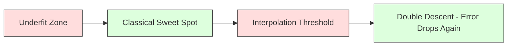
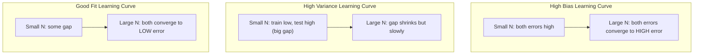

# 偏见方差权衡

> 每个模型误差都来自以下三个来源之一：偏差、方差或噪声。你只能控制前两个。

**Type:** Learn
**Language:** Python
**Prerequisites:** Phase 2, Lessons 01-09 (ML basics, regression, classification, evaluation)
**Time:** ~75 minutes

## 学习目标

- 推导了期望预测误差的偏方差分解，并解释了不可约噪声的作用
- 使用训练和测试错误模式来诊断模型是否存在高偏差或高方差
- 解释正则化技术（L1, L2, dropout, early stop）是如何交易方差偏差的
- 实现实验，将越来越复杂的模型之间的偏差-方差权衡可视化

## 这个问题

你训练了一个模型。它在测试数据上有一些误差。这个错误从何而来？

如果你的模型太简单（曲线数据集上的线性回归），它将始终错过真正的模式。这就是偏见。如果你的模型太复杂（15个数据点上的20次多项式），它将完美地拟合训练数据，但在新数据上给出截然不同的预测。这就是方差。

对于固定的模型容量，您不能同时最小化这两者。偏置下降，方差上升。方差变小，偏差增大。理解这种权衡是机器学习中最有用的诊断技能。它告诉你是让你的模型更复杂还是更简单，是获得更多的数据还是设计更好的特征，是多正则化还是少正则化。

## 这个概念

### 偏差：系统误差

偏差衡量的是模型的平均预测值与真实值之间的距离。如果你从相同的分布中提取许多不同的训练集来训练相同的模型，并对预测进行平均，那么偏差就是平均值与事实之间的差距。

高偏差意味着模型过于僵化，无法捕捉到真实的模式。一条适合抛物线的直线总是会偏离曲线，不管你给它多少数据。这是不合适的。

```
High bias (underfitting):
  Model always predicts roughly the same wrong thing.
  Training error: HIGH
  Test error: HIGH
  Gap between them: SMALL
```

### 方差：对训练数据的敏感性

方差衡量的是当你在不同的数据子集上训练时，你的预测发生了多大的变化。如果训练集的小变化导致模型的大变化，则方差高。

高方差意味着模型拟合的是训练数据中的噪声，而不是底层信号。一个20度的多项式将穿过每个训练点，但在它们之间剧烈振荡。这是过拟合。

```
High variance (overfitting):
  Model fits training data perfectly but fails on new data.
  Training error: LOW
  Test error: HIGH
  Gap between them: LARGE
```

### 分解

对于任意点x，平方损失下的预期预测误差精确分解为：

```
Expected Error = Bias^2 + Variance + Irreducible Noise

where:
  Bias^2   = (E[f_hat(x)] - f(x))^2
  Variance = E[(f_hat(x) - E[f_hat(x)])^2]
  Noise    = E[(y - f(x))^2]             (sigma^2)
```

- Z0
- Z0
- Z0
- Z0

噪声项是不可约的。没有模型能在有噪声的数据上做得比sigma^2更好。你的工作是在偏差^2和方差之间找到正确的平衡。

### 模型复杂性与错误

“‘美人鱼
图LR
A[简单模型]—b> |增加复杂性| B[最佳点]
B—>|增加复杂性| C[复杂模型]

样式A：填充：#f9f，描边：#333
样式B:#9f9，描边：#333
样式C填充：#f99，描边：#333
```

The classic U-shaped curve:

| Complexity | Bias | Variance | Total Error |
|-----------|------|----------|-------------|
| Too low | HIGH | LOW | HIGH (underfitting) |
| Just right | MODERATE | MODERATE | LOWEST |
| Too high | LOW | HIGH | HIGH (overfitting) |

### Regularization as Bias-Variance Control

Regularization deliberately increases bias to reduce variance. It constrains the model so it cannot chase noise.

- **L2 (Ridge):** Shrinks all weights toward zero. Keeps all features but reduces their influence.
- **L1 (Lasso):** Pushes some weights exactly to zero. Performs feature selection.
- **Dropout:** Randomly disables neurons during training. Forces redundant representations.
- **Early stopping:** Stops training before the model fully fits the training data.

The regularization strength (lambda, dropout rate, number of epochs) directly controls where you sit on the bias-variance curve. More regularization means more bias, less variance.

### Double Descent: The Modern Perspective

Classical theory says: after the sweet spot, more complexity always hurts. But research since 2019 has shown something unexpected. If you keep increasing model capacity far past the interpolation threshold (where the model has enough parameters to perfectly fit training data), test error can decrease again.



这种“双重下降”现象解释了为什么大规模过度参数化的神经网络（参数远多于训练样本）仍然可以很好地泛化。经典的偏差-方差权衡并没有错，但对于现代制度来说是不完整的。

关于双下降的关键观察：
- 它发生在线性模型、决策树和神经网络中
- 更多的数据实际上会损害插值区域（样本双下降）
- 更多的训练时代也会导致它（时代双重下降）
- 正则化平滑了峰值，但没有消除它

为什么会发生这种情况？在插值阈值处，模型有足够的能力拟合所有的训练点。它被迫形成一个非常具体的解决方案，通过每个点，数据中的小扰动会导致拟合的大变化。这就是方差达到顶峰的地方。超过阈值，该模型有许多可能的解决方案可以完美地拟合数据。学习算法（例如，隐式正则化的梯度下降）倾向于从中选择最简单的一个。这种对简单解决方案的隐式偏见是过度参数化模型普遍化的原因。

| Regime | Parameters vs Samples | Behavior |
|--------|----------------------|----------|
| Underparameterized | p << n | Classical tradeoff applies |
| Interpolation threshold | p ~ n | Variance peaks, test error spikes |
| Overparameterized | p >> n | Implicit regularization kicks in, test error drops |

出于实际目的：如果你正在使用神经网络或大型树集合，不要在插值阈值处停止。要么远远低于它（通过显式正则化），要么远远超过它。最糟糕的地方就是门槛。

### 诊断模型

“‘美人鱼
流程图TD
A[比较火车误差和测试误差]-> B{大差距？｝
B—>|是| C[高方差-过拟合]
B——>|不| D{两个错误都高？｝
D—>|是| E[高偏置-欠拟合]
D—b> |不| F[很合适]

C—> G[更多数据/正则化/更简单的模型]
E—> H[更多特征/复杂模型/较少正则化]
F—> I[部署]
```

| Symptom | Diagnosis | Fix |
|---------|-----------|-----|
| High train error, high test error | Bias | More features, complex model, less regularization |
| Low train error, high test error | Variance | More data, regularization, simpler model, dropout |
| Low train error, low test error | Good fit | Ship it |
| Train error decreasing, test error increasing | Overfitting in progress | Early stopping |

### Practical Strategies

**When bias is the problem:**
- Add polynomial or interaction features
- Use a more flexible model (tree ensemble instead of linear)
- Reduce regularization strength
- Train longer (if not yet converged)

**When variance is the problem:**
- Get more training data
- Use bagging (random forests)
- Increase regularization (higher lambda, more dropout)
- Feature selection (remove noisy features)
- Use cross-validation to detect it early

### Ensemble Methods and Variance Reduction

Ensemble methods are the most practical tool for fighting variance.

**Bagging (Bootstrap Aggregating)** trains multiple models on different bootstrap samples of the training data, then averages their predictions. Each individual model has high variance, but the average has much lower variance. Random forests are bagging applied to decision trees.

Why it works mathematically: if you average N independent predictions, each with variance sigma^2, the variance of the average is sigma^2 / N. The models are not truly independent (they all see similar data), so the reduction is less than 1/N, but it is still substantial.

**Boosting** reduces bias by building models sequentially, where each new model focuses on the errors of the ensemble so far. Gradient boosting and AdaBoost are the main examples. Boosting can overfit if you add too many models, so you need early stopping or regularization.

| Method | Primary Effect | Bias Change | Variance Change |
|--------|---------------|-------------|-----------------|
| Bagging | Reduces variance | No change | Decreases |
| Boosting | Reduces bias | Decreases | Can increase |
| Stacking | Reduces both | Depends on meta-learner | Depends on base models |
| Dropout | Implicit bagging | Slight increase | Decreases |

**Practical rule:** if your base model has high variance (deep trees, high-degree polynomials), use bagging. If your base model has high bias (shallow stumps, simple linear models), use boosting.

### Learning Curves

Learning curves plot training and validation error as a function of training set size. They are the most practical diagnostic tool you have. Unlike a single train/test comparison, learning curves show you the trajectory of your model and tell you whether more data will help.



如何阅读：

| Scenario | Training Error | Validation Error | Gap | What It Means | What to Do |
|----------|---------------|-----------------|-----|---------------|------------|
| High bias | High | High | Small | Model cannot capture the pattern | More features, complex model, less regularization |
| High variance | Low | High | Large | Model memorizes training data | More data, regularization, simpler model |
| Good fit | Moderate | Moderate | Small | Model generalizes well | Ship it |
| High variance, improving | Low | Decreasing with more data | Shrinking | Variance problem that data can fix | Collect more data |
| High bias, flat | High | High and flat | Small and flat | More data will NOT help | Change model architecture |

关键的观点是：如果两条曲线都趋于平稳，差距很小，但两者的误差都很大，那么更多的数据是无用的。你需要一个更好的模型。如果差距很大且仍在缩小，更多的数据将有所帮助。

### 如何生成学习曲线

有两种方法：

**方法一：改变训练集大小，固定模型。**保持模型和超参数不变。在越来越大的训练数据子集上进行训练。测量每个尺寸的训练误差和验证误差。这是标准的学习曲线。

**方法2：改变模型复杂度，固定数据。**保持数据不变。扫描一个复杂度参数（多项式度，树深度，层数）。测量每个复杂度下的训练误差和验证误差。这是一条验证曲线，直接显示了偏差与方差的权衡。

这两种方法相辅相成。第一个问题告诉你更多的数据是否会有帮助。第二个选项告诉您是否使用不同的模型。在决定下一步之前，先运行两个程序。

“‘美人鱼
流程图TD
A[表现不佳的模型]—b> B[生成学习曲线]
B——> C{火车和火车之间的距离？｝
C ->|差距大，价值仍在下降| D[更多数据将有所帮助]
C—>|差距小，都高| E[更多数据没有用]
C—>|大间隙，val平坦| F[正则化或简化]
E—> G[生成验证曲线]
G—> H[尝试更复杂的模型]
```

## Build It

The code in `code/bias_variance.py` runs the full bias-variance decomposition experiment. Here is the approach, step by step.

### Step 1: Generate Synthetic Data from a Known Function

We use `f(x) = sin(1.5x) + 0.5x` with Gaussian noise. Knowing the true function lets us compute exact bias and variance.

```python
def true_function(x):
    return np.sin(1.5 * x) + 0.5 * x

def generate_data(n_samples=30, noise_std=0.5, x_range=(-3, 3), seed=None):
    rng = np.random.RandomState(seed)
    x = rng.uniform(x_range[0], x_range[1], n_samples)
    y = true_function(x) + rng.normal(0, noise_std, n_samples)
    return x, y
```

### 步骤2：自举采样和多项式拟合

对于每个多项式度，我们绘制许多自举训练集，拟合多项式，并在固定的测试网格上记录预测。这为我们提供了每个测试点的预测分布。

”“python
Def fit_polynomial（x_train, y_train, degree, lam=0.0）
X = np。Column_stack （[x_train ** d for d in range(degree + 1)]）
如果我b> 0：
处罚= lam * np.eye（X.shape[1]）
刑罚[0,0]= 0
w = np.linal .solve(X。T @ X +惩罚，X @ T @ y_train)
其他:
W = np. linear。lstsq(X, y_train, rcond=None)[0]
返回w
```

We fit on 200 different bootstrap samples. Each bootstrap sample is drawn from the same underlying distribution but contains different points.

### Step 3: Computing Bias^2, Variance Decomposition

With 200 sets of predictions at each test point, we can compute the decomposition directly from the definition:

```python
mean_pred = predictions.mean(axis=0)
bias_sq = np.mean((mean_pred - y_true) ** 2)
variance = np.mean(predictions.var(axis=0))
total_error = np.mean(np.mean((predictions - y_true) ** 2, axis=1))
```

- Z0
- Z0
- Z0
- Z0

### 第四步：学习曲线

学习曲线扫描训练集大小，同时保持模型复杂性固定。它们显示您的模型是数据受限还是容量受限。

”“python
def demo_learning_curves ():
size = [10,15,20,30,50,75,100,150,200,300]
度= 5

对于n的大小：
Train_errors = []
Test_errors = []
范围（50）的种子：
X_train, y_train = generate_data（n_samples=n, seed=seed * 100）
W = fit_polynomial（x_train, y_train, degree）
Train_pred = predict_polynomial（x_train, w）
Train_mse = np。Mean （(train_pred - y_train) ** 2）
Test_pred = predict_polynomial（x_test, w）
Test_mse = np。Mean （(test_pred - y_test) ** 2）
train_errors.append (train_mse)
test_errors.append (test_mse)
#平均超过跑步给出学习曲线点
```

For a high-variance model (degree 5 with small data), you see:
- Training error starts low and increases as more data makes memorization harder
- Test error starts high and decreases as the model gets more signal
- The gap shrinks with more data

For a high-bias model (degree 1), both errors converge quickly to the same high value and more data does not help.

### Step 5: Regularization Sweep

The code also includes `demo_regularization_sweep()`, which fixes a high-degree polynomial (degree 15) and sweeps Ridge regularization strength from 0.001 to 100. This shows the bias-variance tradeoff from a different angle: instead of varying model complexity, we vary the constraint strength.

```python
def demo_regularization_sweep():
    alphas = [0.001, 0.005, 0.01, 0.05, 0.1, 0.5, 1.0, 5.0, 10.0, 50.0, 100.0]
    for alpha in alphas:
        results = bias_variance_decomposition([15], lam=alpha)
        r = results[15]
        print(f"alpha={alpha:.3f}  bias={r['bias_sq']:.4f}  var={r['variance']:.4f}")
```

在低α时，15次多项式几乎是不受约束的。方差占主导地位，因为模型在每个自举样本中追逐噪声。在高α时，惩罚是如此之强，以至于模型实际上变成了一个接近常数的函数。占主导地位的偏见。最优alpha值介于这两个极端之间。

这是不同多项式次的相同u曲线，但由连续旋钮而不是离散旋钮控制。在实践中，正则化是控制权衡的首选方法，因为它允许在不改变特性集的情况下进行细粒度控制。

## 使用它

sklearn提供

### 验证曲线：扫描模型复杂度

”“python
从sklearn。Model_selection导入validation_curve
从sklearn。管道导入make_pipeline
从sklearn。预处理导入多项式特征
从sklearn。linear_model导入Ridge

Degrees = list（range(1,16)）
Train_scores_all = []
Val_scores_all = []

对于d . in学位：
pipe = make_pipeline(多项式特征（d), Ridge(alpha=0.01)）
Train_scores, val_scores = validation_curve
管道，X, y, param_name=“多项式特征__degree”，
Param_range =[d], cv=5, scoring=“neg_mean_squared_error”
）
train_scores_all.append (-train_scores.mean ())
val_scores_all.append (-val_scores.mean ())
```

This gives you the bias-variance tradeoff curve directly. Where the validation score is worst relative to train score, variance dominates. Where both are bad, bias dominates.

### Learning Curve: Sweep Training Set Size

```python
from sklearn.model_selection import learning_curve

pipe = make_pipeline(PolynomialFeatures(5), Ridge(alpha=0.01))
train_sizes, train_scores, val_scores = learning_curve(
    pipe, X, y, train_sizes=np.linspace(0.1, 1.0, 10),
    cv=5, scoring="neg_mean_squared_error"
)
train_mse = -train_scores.mean(axis=1)
val_mse = -val_scores.mean(axis=1)
```

情节形状告诉你关于你的模特的一切。

### 使用正则化扫描进行交叉验证

”“python
从sklearn。Model_selection导入cross_val_score

alpha = [0.001, 0.01, 0.1, 1.0, 10.0, 100.0]
对于alpha中的alpha：
pipe = make_pipeline（多项式特征（10），Ridge(alpha=alpha)）
scores = cross_val_score（pipe， X, y, cv=5, scoring="neg_mean_squared_error"）
打印(f“α={α:> 7.3 f} MSE = {-scores.mean():。+/- {scores.std():.4f}")
```

This sweeps regularization strength for a fixed model complexity. You will see the same bias-variance tradeoff: low alpha means high variance, high alpha means high bias.

### Putting It All Together: A Complete Diagnostic Workflow

In practice, you run these diagnostics in sequence:

1. Train your model. Compute train and test error.
2. If both are high: you have a bias problem. Skip to step 4.
3. If train is low but test is high: you have a variance problem. Generate a learning curve to see if more data will help. If not, regularize.
4. Generate a validation curve sweeping your main complexity parameter. Find the sweet spot.
5. At the sweet spot, generate a learning curve. If the gap is still large, you need more data or regularization.
6. Try Ridge/Lasso with different alpha values using `cross_val_score`. Pick the alpha where cross-validated error is lowest.

This takes 10-15 minutes of compute for most tabular datasets and saves hours of guessing.

## Ship It

This lesson produces: `outputs/prompt-model-diagnostics.md`

## Exercises

1. Run the decomposition with `noise_std=0` (no noise). What happens to the irreducible error term? Does the optimal complexity change?

2. Increase the training set size from 30 to 300. How does this affect the variance component? Does the optimal polynomial degree shift?

3. Add L2 regularization (Ridge regression) to the experiment. For a fixed high-degree polynomial (degree 15), sweep lambda from 0 to 100. Plot bias^2 and variance as functions of lambda.

4. Modify the true function from a polynomial to `sin(x)`. How does the bias-variance decomposition change? Is there still a clear optimal degree?

5. Implement a simple bootstrap aggregating (bagging) wrapper: train 10 models on bootstrap samples and average predictions. Show that this reduces variance without increasing bias much.

## Key Terms

| Term | What people say | What it actually means |
|------|----------------|----------------------|
| Bias | "The model is too simple" | Systematic error from wrong assumptions. The gap between the average model prediction and truth. |
| Variance | "The model is overfitting" | Error from sensitivity to training data. How much predictions change across different training sets. |
| Irreducible error | "Noise in the data" | Error from randomness in the true data-generating process. No model can eliminate it. |
| Underfitting | "Not learning enough" | Model has high bias. It misses the real pattern even on training data. |
| Overfitting | "Memorizing the data" | Model has high variance. It fits noise in training data that does not generalize. |
| Regularization | "Constraining the model" | Adding a penalty to reduce model complexity, trading bias for lower variance. |
| Double descent | "More parameters can help" | Test error decreases again when model capacity far exceeds the interpolation threshold. |
| Model complexity | "How flexible the model is" | The capacity of a model to fit arbitrary patterns. Controlled by architecture, features, or regularization. |

## Further Reading

- [Hastie, Tibshirani, Friedman: Elements of Statistical Learning, Ch. 7](https://hastie.su.domains/ElemStatLearn/) -- the definitive treatment of bias-variance decomposition
- [Belkin et al., Reconciling modern machine learning practice and the bias-variance trade-off (2019)](https://arxiv.org/abs/1812.11118) -- the double descent paper
- [Nakkiran et al., Deep Double Descent (2019)](https://arxiv.org/abs/1912.02292) -- epoch-wise and sample-wise double descent
- [Scott Fortmann-Roe: Understanding the Bias-Variance Tradeoff](http://scott.fortmann-roe.com/docs/BiasVariance.html) -- clear visual explanation