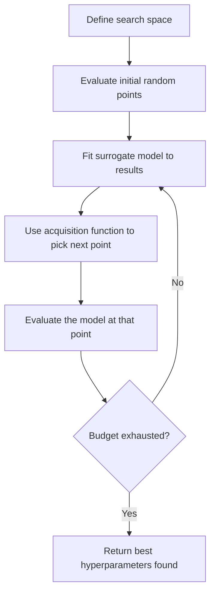
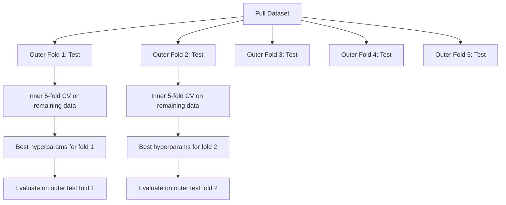

# Hyperparameter调优

> 超参数是训练开始前的旋钮。把它们转好是一个平庸的模型和一个伟大的模型之间的区别。

**Type:** Build
**Language:** Python
**Prerequisites:** Phase 2, Lesson 11 (Ensemble Methods)
**Time:** ~90 minutes

## 学习目标

- 从头开始实现网格搜索、随机搜索和贝叶斯优化，并比较它们的样本效率
- 解释为什么当大多数超参数的有效维数较低时，随机搜索优于网格搜索
- 使用代理模型和获取函数构建贝叶斯优化循环来指导搜索
- 设计一个超参数调优策略，通过适当的交叉验证避免过拟合验证集

## 这个问题

你的梯度增强模型有学习率、树的数量、最大深度、每片叶子的最小样本、子样本比和列样本比。这是6个超参数。如果每个有5个合理的值，则网格有5^6 = 15,625个组合。每次训练需要10秒。这是43个小时的计算来尝试它们。

网格搜索是最明显的方法，也是最糟糕的方法。随机搜索用较少的计算量做得更好。贝叶斯优化通过从过去的评估中学习而做得更好。知道要使用哪种策略，以及哪些超参数真正重要，可以节省几天的GPU时间浪费。

## 这个概念

### 参数vs超参数

参数是在训练过程中学习的（权重、偏差、分割阈值）。在训练开始之前设置超参数，并控制学习如何发生。

| Hyperparameter | What it controls | Typical range |
|---------------|-----------------|---------------|
| Learning rate | Step size per update | 0.001 to 1.0 |
| Number of trees/epochs | How long to train | 10 to 10,000 |
| Max depth | Model complexity | 1 to 30 |
| Regularization (lambda) | Overfitting prevention | 0.0001 to 100 |
| Batch size | Gradient estimation noise | 16 to 512 |
| Dropout rate | Fraction of neurons dropped | 0.0 to 0.5 |

### 网格搜索

网格搜索计算指定值的每个组合。它详尽且易于理解，但随着超参数的数量呈指数级增长。

```
Grid for 2 hyperparameters:

  learning_rate: [0.01, 0.1, 1.0]
  max_depth:     [3, 5, 7]

  Evaluations: 3 x 3 = 9 combinations

  (0.01, 3)  (0.01, 5)  (0.01, 7)
  (0.1,  3)  (0.1,  5)  (0.1,  7)
  (1.0,  3)  (1.0,  5)  (1.0,  7)
```

网格搜索有一个根本性的缺陷：如果一个超参数重要而另一个不重要，那么大多数评估都是浪费的。从9次求值中，您只能得到重要参数的3个唯一值。

### 随机搜索

随机搜索从分布而不是网格中采样超参数。使用相同的9次评估预算，您将获得每个超参数的9个唯一值。

“‘美人鱼
流程图LR
子图网格搜索
G1[3个独特的学习速率]
G2[3个独特的最大深度]
G3[共9次评估]
结束

子图随机搜索
R1[9独特学习率]
R2[9唯一最大深度]
R3[共9次评估]
结束
```

Why random beats grid (Bergstra & Bengio, 2012):

- Most hyperparameters have low effective dimensionality. Only 1-2 of 6 hyperparameters usually matter for a given problem.
- Grid search wastes evaluations on unimportant dimensions.
- Random search covers the important dimensions more densely for the same budget.
- At 60 random trials, you have a 95% chance of finding a point within 5% of the optimum (if one exists in the search space).

### Bayesian Optimization

Random search ignores results. It does not learn that high learning rates cause divergence or that depth 3 consistently outperforms depth 10. Bayesian optimization uses past evaluations to decide where to search next.



两个关键组成部分：

**代理模型：**一种易于评估的模型（通常是高斯过程），它近似于昂贵的目标函数。它给出了在搜索空间中任意点的预测和不确定性估计。

**获取功能：**通过平衡开发（在已知的好点附近搜索）和探索（在不确定性高的地方搜索）来决定下一步的评估。常见的选择:

- **期望改进（EI）：**在这一点上，我们期望比当前最好的改进多少？
- **置信上限（UCB）：**预测加上不确定性的倍数。更高的UCB意味着有前途或未开发。
- **改进概率（PI）：**此点优于当前最佳点的概率是多少？

贝叶斯优化通常比随机搜索找到更好的超参数，计算次数减少2-5倍。与训练实际模型相比，拟合代理模型的开销可以忽略不计。

### 早期停止

不是每次训练都需要结束。如果一个配置在10个epoch后明显是坏的，停止它并继续前进。在超参数搜索的背景下，这是提前停止。

策略:
- **基于患者：**如果连续N次验证丢失没有改善，则停止
- **中位数修剪：**如果该试验的中间结果低于同一步已完成试验的中位数，则停止
- **超带：**分配小预算到许多配置，然后逐步增加预算，为最好的

Hyperband特别有效。它开始81个配置，每个配置一个epoch，保留前三分之一，给它们3个epoch，保留前三分之一，以此类推。这比为全部预算评估所有配置快10-50倍。

### 学习率调度器

学习率几乎总是最重要的超参数。而不是保持固定，调度程序调整它在训练期间。

| Scheduler | Formula | When to use |
|-----------|---------|-------------|
| Step decay | Multiply by 0.1 every N epochs | Classic CNN training |
| Cosine annealing | lr * 0.5 * (1 + cos(pi * t / T)) | Modern default |
| Warmup + decay | Linear increase then cosine decay | Transformers |
| One-cycle | Increase then decrease over one cycle | Fast convergence |
| Reduce on plateau | Reduce by factor when metric stalls | Safe default |

### Hyperparameter重要性

并不是所有的超参数都同样重要。对随机森林（Probst et al., 2019）和梯度增强的研究显示出一致的模式：

**高重要性:* *
- 学习率（总是先调整）
- 估计器/ epoch的数量（使用提前停止而不是调优）
- 正则化强度

**中重要性:* *
- 最大深度/层数
- 每片叶子的最小采样/重量衰减
- 子样品比率

**低重要性:* *
- 最大特征（随机森林）
- 特定激活函数选择
- 批量（在合理范围内）

首先调整重要的，其余的保持默认值。

### 实用的策略

“‘美人鱼
流程图TD
B[粗随机搜索：20-50次试验]
B—> C[识别重要的超参数]
D[精细随机或贝叶斯搜索：在狭窄空间中进行50-100次试验]
D—> E[带最佳超参数的最终模型]
E—> F[基于完整训练数据的再培训]
```

The concrete workflow:

1. **Start with library defaults.** They are chosen by experienced practitioners and are often 80% of the way there.
2. **Coarse random search.** Wide ranges, 20-50 trials. Use early stopping to kill bad runs fast.
3. **Analyze results.** Which hyperparameters correlate with performance? Narrow the search space.
4. **Fine search.** Bayesian optimization or focused random search in the narrowed space. 50-100 trials.
5. **Retrain on all training data** with the best hyperparameters found.

### Cross-Validation Integration

Tuning hyperparameters on a single validation split is risky. The best hyperparameters might overfit to the specific validation fold. Nested cross-validation solves this by using two loops:

- **Outer loop** (evaluation): splits data into train+val and test. Reports unbiased performance.
- **Inner loop** (tuning): splits train+val into train and val. Finds best hyperparameters.



每个外褶皱都独立地找到自己的最佳超参数。外部分数是泛化性能的无偏估计。

sklearn:

”“python
从sklearn。导入cross_val_score， GridSearchCV
从sklearn。集成导入GradientBoostingRegressor

inner_cv = GridSearchCV（）
GradientBoostingRegressor (),
param_grid = {
“learning_rate”： [0.01, 0.05, 0.1]，
“max_depth”： [2,3,5]，
“n_estimators”： [50,100,200]，
}，
简历= 5,
得分= " neg_mean_squared_error ",
）

Outer_scores = cross_val_score(
inner_cv， X, y, cv=5, scoring=“neg_mean_squared_error”
）

“嵌套CV MSE: {-outer_scores.mean()：”+/- {outer_scores.std():.4f}")
```

This is expensive (5 outer folds x 5 inner folds x 27 grid points = 675 model fits), but it gives you a trustworthy performance estimate. Use it when reporting final results in papers or when the stake of the decision is high.

### Practical Tips

**Start with the learning rate.** It is always the most important hyperparameter for gradient-based methods. A bad learning rate makes everything else irrelevant. Fix other hyperparameters at defaults and sweep learning rate first.

**Use log-uniform distributions for learning rate and regularization.** The difference between 0.001 and 0.01 matters as much as the difference between 0.1 and 1.0. Searching linearly wastes budget on the large end.

**Use early stopping instead of tuning n_estimators.** For boosting and neural networks, set n_estimators or epochs high and let early stopping decide when to stop. This removes one hyperparameter from the search.

**Budget allocation.** Spend 60% of your tuning budget on the top 2 most important hyperparameters. Spend the remaining 40% on everything else. The top 2 account for most of the performance variation.

**Scale matters.** Never search batch size on a log scale (16, 32, 64 are fine). Always search learning rate on a log scale. Match the search distribution to how the hyperparameter affects the model.

| Model Type | Top Hyperparameters | Recommended Search | Budget |
|-----------|--------------------|--------------------|--------|
| Random Forest | n_estimators, max_depth, min_samples_leaf | Random search, 50 trials | Low (fast training) |
| Gradient Boosting | learning_rate, n_estimators, max_depth | Bayesian, 100 trials + early stopping | Medium |
| Neural Network | learning_rate, weight_decay, batch_size | Bayesian or random, 100+ trials | High (slow training) |
| SVM | C, gamma (RBF kernel) | Grid on log scale, 25-50 trials | Low (2 params) |
| Lasso/Ridge | alpha | 1D search on log scale, 20 trials | Very low |
| XGBoost | learning_rate, max_depth, subsample, colsample | Bayesian, 100-200 trials + early stopping | Medium |

**When in doubt:** random search with 2x the number of hyperparameters as trials (e.g., 6 hyperparameters = 12+ trials minimum). You will be surprised how often random search with 50 trials beats carefully designed grid search.

## Build It

### Step 1: Grid Search from Scratch

The code in `code/tuning.py` implements grid search, random search, and a simple Bayesian optimizer from scratch.

```python
def grid_search(model_fn, param_grid, X_train, y_train, X_val, y_val):
    keys = list(param_grid.keys())
    values = list(param_grid.values())
    best_score = -float("inf")
    best_params = None
    n_evals = 0

    for combo in itertools.product(*values):
        params = dict(zip(keys, combo))
        model = model_fn(**params)
        model.fit(X_train, y_train)
        score = evaluate(model, X_val, y_val)
        n_evals += 1

        if score > best_score:
            best_score = score
            best_params = params

    return best_params, best_score, n_evals
```

### 步骤2：从头开始随机搜索

”“python
def random_search(model_fn, param_distributions, X_train, y_train，
X_val, y_val, n_iter=50, seed=42)：
rng = np.random.RandomState（seed）
Best_score = -float（"inf"）
best_params =无

For _ in range(n_iter)：
Params = {k: sample(v, rng) for k, v in param_distribution .items()}
Model = model_fn（**params）
model.fit (X_train y_train)
score = evaluate（model, X_val, y_val）

如果得分> best_score：
Best_score =得分
Best_params = params

返回best_params， best_score, n_iter
```

### Step 3: Bayesian Optimization (Simplified)

The core idea: fit a Gaussian process to observed (hyperparameter, score) pairs, then use an acquisition function to decide where to look next.

```python
class SimpleBayesianOptimizer:
    def __init__(self, search_space, n_initial=5):
        self.search_space = search_space
        self.n_initial = n_initial
        self.X_observed = []
        self.y_observed = []

    def _kernel(self, x1, x2, length_scale=1.0):
        dists = np.sum((x1[:, None, :] - x2[None, :, :]) ** 2, axis=2)
        return np.exp(-0.5 * dists / length_scale ** 2)

    def _fit_gp(self, X_new):
        X_obs = np.array(self.X_observed)
        y_obs = np.array(self.y_observed)
        y_mean = y_obs.mean()
        y_centered = y_obs - y_mean

        K = self._kernel(X_obs, X_obs) + 1e-4 * np.eye(len(X_obs))
        K_star = self._kernel(X_new, X_obs)

        L = np.linalg.cholesky(K)
        alpha = np.linalg.solve(L.T, np.linalg.solve(L, y_centered))
        mu = K_star @ alpha + y_mean

        v = np.linalg.solve(L, K_star.T)
        var = 1.0 - np.sum(v ** 2, axis=0)
        var = np.maximum(var, 1e-6)

        return mu, var

    def _expected_improvement(self, mu, var, best_y):
        sigma = np.sqrt(var)
        z = (mu - best_y) / (sigma + 1e-10)
        ei = sigma * (z * norm_cdf(z) + norm_pdf(z))
        return ei

    def suggest(self):
        if len(self.X_observed) < self.n_initial:
            return sample_random(self.search_space)

        candidates = [sample_random(self.search_space) for _ in range(500)]
        X_cand = np.array([to_vector(c) for c in candidates])
        mu, var = self._fit_gp(X_cand)
        ei = self._expected_improvement(mu, var, max(self.y_observed))
        return candidates[np.argmax(ei)]

    def observe(self, params, score):
        self.X_observed.append(to_vector(params))
        self.y_observed.append(score)
```

GP代理在每个候选点给出两个东西：预测分数（mu）和不确定性（var）。预期改进平衡了这些：它倾向于模型预测高分或不确定性高的点。在早期，大多数点都有很高的不确定性，所以优化器会进行探索。随后，它将重点放在最有希望的地区。

### 步骤4：比较所有方法

在同一合成目标上运行所有三种方法并进行比较。这个比较使用了一个简化的包装器，它用一个直接的目标函数调用每个优化器（没有模型训练），所以API不同于上面基于模型的实现：

”“python
def synthetic_objective (params):
Lr = params["learning_rate"]
深度= params["max_depth"]
返回(np。Log10 (lr) + 2) ** 2 - (depth - 4) ** 2 + 10

Param_grid = {
“learning_rate”： [0.001, 0.01, 0.1, 1.0]，
“max_depth”： [2,3,4,5,6,7,8]，
｝

grid_best =无
Grid_score = -float（"inf"）
Grid_history = []
对于itertools.product（*param_grid.values()）中的combo：
Params = dict（zip(param_grid. zip)）组合键()))
得分= synthetic_objective（参数）
grid_history。追加(params,分数))
如果score > grid_score：
Grid_score =分数
Grid_best = params

Param_dist = {
“learning_rate”： （"log_float", 0.001, 1.0），
“max_depth”： （"int", 2,8），
｝

rand_best =无
Rand_score = -float（"inf"）
Rand_history = []
rng = np.random.RandomState（42）
对于范围（28）中的_：
Params = {k: sample(v, rng) for k, v in param_dist.items()}
得分= synthetic_objective（参数）
rand_history。追加(params,分数))
如果score > rand_score：
Rand_score =分数
Rand_best = params

optimizer = SimpleBayesianOptimizer（param_dist, n_initial=5）
Bayes_history = []
对于范围（28）中的_：
Params = optimizer.suggest（）
得分= synthetic_objective（参数）
优化器。观察(params,得分)
bayes_history。追加(params,分数))
Bayes_score = max（s for _, s in bayes_history）

打印(f”{“方法”:< 20}{“最好的分数”:> 12}{“评估”:> 12}”)
打印（"-" * 50）
打印(f”{“网格搜索”:< 20}{grid_score: > 12.4 f} {len (grid_history): > 12}”)
打印(f”{“随机搜索”:< 20}{rand_score: > 12.4 f} {len (rand_history): > 12}”)
打印(f”{“贝叶斯选择”:< 20}{bayes_score: > 12.4 f} {len (bayes_history): > 12}”)
```

With the same budget, Bayesian optimization usually finds the best score fastest because it does not waste evaluations in clearly bad regions. Random search covers more ground than grid search. Grid search only wins when you have very few hyperparameters and can afford to be exhaustive.

## Use It

### Optuna in Practice

Optuna is the recommended library for serious hyperparameter tuning. It supports pruning, distributed search, and visualization out of the box.

```python
import optuna

def objective(trial):
    lr = trial.suggest_float("learning_rate", 1e-4, 1e-1, log=True)
    n_est = trial.suggest_int("n_estimators", 50, 500)
    max_depth = trial.suggest_int("max_depth", 2, 10)

    model = GradientBoostingRegressor(
        learning_rate=lr,
        n_estimators=n_est,
        max_depth=max_depth,
    )
    model.fit(X_train, y_train)
    return mean_squared_error(y_val, model.predict(X_val))

study = optuna.create_study(direction="minimize")
study.optimize(objective, n_trials=100)

print(f"Best params: {study.best_params}")
print(f"Best MSE: {study.best_value:.4f}")
```

Optuna的主要特点：
- Z0
- Z0
- Z0
- 内置MedianPruner，用于早期停止不良试验
- Z0

### Optuna with Pruning

修剪提前停止了没有希望的试验，节省了大量的计算。模式如下：

”“python
进口optuna
从sklearn。Model_selection导入cross_val_score

def客观(试验):
参数= {
“learning_rate”:审判。建议_float("lr", 1 -4, 0.5, log=True)，
“max_depth”:审判。建议：int("max_depth", 2,10)，
“n_estimators”:审判。建议int("n_estimators", 50,500)，
“子”:审判。建议_float("subsample", 0.5, 1.0)，
｝

model = GradientBoostingRegressor（**params）
（模型，X_train, y_train, cv=3）
得分= " neg_mean_squared_error”)
Mean_score = -scores.mean（）

审判。报告(mean_score,一步= 0)
如果trial.should_prune ():
提高optuna.TrialPruned ()

返回mean_score

Pruner = optuna.pruners。MedianPruner (n_startup_trials = 10, n_warmup_steps = 5)
研究= optuna。create_study(方向=“最小化”,修剪工具=修剪工具)
研究。优化(目标,n_trials = 200)
```

The `MedianPruner` stops a trial if its intermediate value is worse than the median of all completed trials at the same step. Pruning requires calling `trial.report()` to report intermediate metrics and `trial.should_prune()` to check whether the trial should be stopped. The `n_startup_trials=10` ensures at least 10 trials complete fully before pruning kicks in. This typically saves 40-60% of total compute.

### sklearn's Built-in Tuners

For quick experiments, sklearn provides `GridSearchCV`, `RandomizedSearchCV`, and `HalvingRandomSearchCV`:

```python
from sklearn.model_selection import RandomizedSearchCV
from scipy.stats import loguniform, randint

param_dist = {
    "learning_rate": loguniform(1e-4, 0.5),
    "max_depth": randint(2, 10),
    "n_estimators": randint(50, 500),
}

search = RandomizedSearchCV(
    GradientBoostingRegressor(),
    param_dist,
    n_iter=100,
    cv=5,
    scoring="neg_mean_squared_error",
    random_state=42,
    n_jobs=-1,
)
search.fit(X_train, y_train)
print(f"Best params: {search.best_params_}")
print(f"Best CV MSE: {-search.best_score_:.4f}")
```

使用使用The

### 超参数调优中的常见错误

**预处理导致数据泄露。**如果你在交叉验证之前在完整的数据集上拟合一个标量，来自验证折叠的信息会泄漏到训练中。总是把预处理放在

**验证集过拟合。**在验证集上运行数千个试验可以有效地训练。对最终的性能估计使用嵌套交叉验证，或者保留一个在调优期间永远不会触及的单独测试集。

*搜索范围太窄。**如果你的最佳值在搜索空间的边界处，说明你搜索的范围还不够广。最优值可能超出你的范围。总是检查最佳参数是否在边缘。

**忽略交互效果。**学习率和估计器数量在提升中有很强的相互作用。低学习率需要更多的估计器。单独调优它们比一起调优结果更差。

**迭代模型不使用提前停止。**对于梯度增强和神经网络，将n_estimators或epoch设置为高值并使用早期停止。这比将迭代次数调优作为超参数要好得多。

## 练习

1. 以相同的总预算运行网格搜索和随机搜索（例如，50次评估）。比较找到的最好分数。用不同的种子做10次实验。随机搜索获胜的频率是多少？

2. 从头开始实现Hyperband。从81个配置开始，每个配置训练1个epoch。在每个回合中保留前三分之一，并将预算增加两倍。将总计算（所有配置的所有epoch的总和）与为完整预算运行81个配置进行比较。

3. 将学习率调度器（余弦退火）添加到第11课的梯度增强实现中。与固定的学习率相比，它有帮助吗？

4. 使用Optuna在真实数据集（例如，sklearn的乳腺癌数据集）上调整RandomForestClassifier。使用它是否符合本课的重要性排名？

5. 实现一个简单的获取功能（预期的改进），并演示探索与开发。绘制代理模型的平均值和不确定性，并显示EI下一步选择评估的位置。

## 关键术语

| Term | What people say | What it actually means |
|------|----------------|----------------------|
| Hyperparameter | "A setting you choose" | A value set before training that controls the learning process, not learned from data |
| Grid search | "Try every combination" | Exhaustive search over a specified parameter grid. Exponential cost. |
| Random search | "Just sample randomly" | Sample hyperparameters from distributions. Covers important dimensions better than grid search. |
| Bayesian optimization | "Smart search" | Uses a surrogate model of the objective to decide where to evaluate next, balancing exploration and exploitation |
| Surrogate model | "A cheap approximation" | A model (usually Gaussian process) that approximates the expensive objective function from observed evaluations |
| Acquisition function | "Where to look next" | Scores candidate points by balancing expected improvement with uncertainty. EI and UCB are common choices. |
| Early stopping | "Stop wasting time" | Terminate training early when validation performance stops improving |
| Hyperband | "Tournament bracket for configs" | Adaptive resource allocation: start many configs with small budgets, keep the best and increase their budgets |
| Learning rate scheduler | "Change lr during training" | A function that adjusts the learning rate over the course of training for better convergence |

## 进一步的阅读

- [Bergstra & Bengio: Random Search for Hyper-Parameter Optimization (2012)]（https://jmlr.org/papers/v13/bergstra12a.html）——展示随机击败网格的论文
- [Snoek等人，机器学习算法的实用贝叶斯优化（2012）]（https://arxiv.org/abs/1206.2944）——机器学习的贝叶斯优化
- [Li等人，Hyperband：一种新颖的基于强盗的方法（2018）](https://jmlr.org/papers/v18/16-558.html) - Hyperband论文
- [Optuna：下一代超参数优化框架]（https://arxiv.org/abs/1907.10902）——Optuna论文
- [Probst等人，可调性：超参数的重要性（2019）]（https://jmlr.org/papers/v20/18-444.html）——哪些超参数很重要