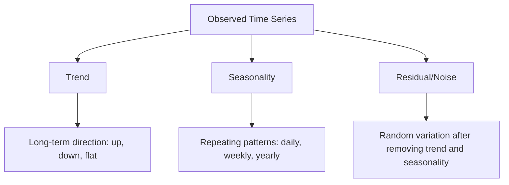

# 时间序列基础

> 过去的表现确实可以预测未来的结果——如果你先检查平稳性的话。

**Type:** Build
**Language:** Python
**Prerequisites:** Phase 2, Lessons 01-09
**Time:** ~90 minutes

## 学习目标

- 将时间序列分解为趋势成分、季节性成分和剩余成分，并检验其平稳性
- 实现滞后特征和滚动统计，将时间序列转换为监督学习问题
- 构建一个向前走的验证框架，防止未来的数据泄露到训练中
- 解释为什么随机训练/测试分割对时间序列无效，并演示与适当的时间分割相比的性能差距

## 这个问题

你有按时间排序的数据。每日销售额，每小时温度，每分钟CPU使用率，每周股票价格。你想要预测下一个价值，下一周，下一季度。

你可以使用标准的机器学习工具包：随机训练/测试分割、交叉验证、特征矩阵输入、预测输出。每一步都是错的。

时间序列打破了标准ML所依赖的假设。样本不是独立的——今天的温度取决于昨天的温度。随机的分裂会将未来的信息泄露给过去。在回测中看起来很棒的特性在生产中会失败，因为它们依赖于随时间变化的模式。

通过随机交叉验证获得95%准确率的模型，通过适当的基于时间的评估可能获得55%的准确率。区别不是技术上的。这是一个模型在纸上工作和在生产中工作之间的区别。

本课涵盖了基础知识：什么使时间数据不同，如何诚实地评估模型，以及如何将时间序列转换为标准ML模型可以使用的特征。

## 这个概念

### 什么使时间序列不同

标准ML假设i.i.d——独立且相同分布。每个样本都是从相同的分布中抽取的，独立于其他样本。时间序列违反了这两点：

- * *不是独立的。今天的股价取决于昨天的股价。本周的销售情况与上周的有关。
- **不均匀分布。分布随时间变化。12月份的销售情况与3月份有所不同。

这些违规行为并不轻微。它们改变了你构建特征的方式，你评估模型的方式，以及哪种算法有效。

“‘美人鱼
流程图LR
子图IID[“标准ML （i.i.d）”]
方向结核病
S1[样本1]~~~ S2[样本2]
S2 ~~~ S3[样本3]
结束
子图TS[“时间序列（非id）”]
方向LR
T1[t=1]—> T2[t=2]
T2—> T3[t=3]
T3—> T4[t=4]
结束

样式S1填充：#dfd
样式S2填充：#dfd
样式S3填充：#dfd
样式T1填充：#ffd
样式T2填充：#ffd
样式T3填充：#ffd
样式T4填充：#ffd
```

In standard ML, samples are interchangeable. Shuffling them changes nothing. In time series, order is everything. Shuffling destroys the signal.

### Components of a Time Series

Every time series is a combination of:



- **趋势**：长期方向。收入每年增长10%。全球气温上升。
- **季节性**：以固定的间隔重复模式。12月零售额飙升。空调使用量在7月份达到高峰。
- **剩余**：除去趋势和季节性因素后的剩余部分。如果残差看起来像白噪声，分解就捕获了信号。

### 平稳性

如果一个时间序列的统计性质（均值、方差、自相关）不随时间变化，那么它就是平稳的。大多数预测方法都假定是平稳的。

*重要原因：一个非平稳序列有一个漂移的均值。一个用1月份数据训练的模型得到了与2月份不同的均值。这将是系统性的错误。

**如何检查：**计算窗口的滚动平均值和滚动标准差。如果它们漂移，则序列是非平稳的。

**如何修复：**差异。不是对原始值建模，而是对连续值之间的变化建模：

```
diff[t] = value[t] - value[t-1]
```

如果一轮差分不能使序列平稳，再应用一次（二阶差分）。大多数现实世界的系列赛最多需要两轮。

**例子:* *

原创系列：[100、102、106、112、120]
第一个差异：[2,4,6,8]（仍呈上升趋势）
第二个差值：[2,2,2]（常数—平稳）

原来的级数是二次型的。首先微分把它变成了线性趋势。第二个差别使它变平。在实践中，你很少需要超过两轮。

**正式检验：** ADF （Augmented Dickey-Fuller）检验是标准的平稳性统计检验。零假设是“序列是非平稳的”p值低于0.05意味着可以拒绝零值并得出平稳性结论。我们没有从头开始实现ADF（它需要渐近分布表），但是我们代码中的滚动统计方法提供了实际的视觉检查。

### 自相关

自相关测量时间t的值与时间t-k的值（过去k步）的相关性。自相关函数（ACF）绘制了每个滞后k的相关性。

**ACF告诉你：**
- 这个系列还记得多久以前。如果延迟5后ACF降为零，则超过5步之前的值是不相关的。
- 是否存在季节性。如果ACF在滞后12（月度数据）时达到峰值，则存在年度季节性。
- 要创建多少延迟特性。使用滞后直到ACF变得可以忽略不计。

**PACF (Partial Autocorrelation Function)**去除间接相关性。如果今天与3天前相关只是因为两者都与昨天相关，那么滞后3的PACF将为零，而滞后3的ACF则不会。

### 滞后特征：将时间序列转化为监督学习

标准的机器学习模型需要一个特征矩阵X和一个目标矩阵y。时间序列给你一列值。该桥具有滞后性。

以序列[10,12,14,13,15]为例，创建lag-1和lag-2特征：

| lag_2 | lag_1 | target |
|-------|-------|--------|
| 10    | 12    | 14     |
| 12    | 14    | 13     |
| 14    | 13    | 15     |

现在你有一个标准的回归问题。任何机器学习模型（线性回归、随机森林、梯度增强）都可以从滞后中预测目标。

您可以设计的其他功能：
- **滚动统计：**的平均值，std，最小值，最大值在过去的k值
- **日历功能：**星期，月，is_假日，is_周末
- **差异值：**与上一步不同
- **展开统计：**累积平均数，累积总和
- **比率特征：**现值/滚动平均值（与近期平均值的距离）
- **交互特性：** lag_1 * day_of_week（工作日对动量的影响）

**有多少个滞后？**使用自相关功能。如果ACF显著到滞后10，则至少使用10个滞后。如果有每周的季节性，包括滞后7（可能还有14）。更多的滞后给了模型更多的历史记录，但也有更多的特征需要拟合，增加了过度拟合的风险。

**目标对准陷阱。**创建滞后特征时，目标必须是时刻t的值，所有特征必须使用时刻t-1或更早的值。如果您意外地将时刻t的值作为特征包含进来，那么您就得到了一个完美的预测器，但这是一个完全无用的模型。这是时间序列特征工程中最常见的错误。

### 向前走的验证

这是本课最重要的概念。标准k-fold交叉验证随机分配样本进行训练和测试。对于时间序列，这会泄露未来的信息。

“‘美人鱼
流程图TD
子图WRONG[“随机分裂（错误）”]
方向LR
W1[一月]-> W2[三月]
W2—> W3[Feb]
W4[五月]
W4—> W5[四月]
样式W1填充：#fdd
样式W3填充：#fdd
样式W5填充：#fdd
样式W2填充：#dfd
样式W4填充：#dfd
结束

子图RIGHT[“向前走（正确）”]
方向LR
R1[“火车：1 - 3月”]—> R2[“测试：4月”]
R3[“火车：1 - 4月”]—> R4[“测试：5月”]
R5[“火车：1 - 5月”]——> R6[“测试：6月”]
样式R1填充：#dfd
样式R2填充：#fdd
样式R3填充：#dfd
样式R4填充：#fdd
样式R5填充：#dfd
样式R6填充：#fdd
结束
```

Walk-forward validation:
1. Train on data up to time t
2. Predict at time t+1 (or t+1 to t+k for multi-step)
3. Slide the window forward
4. Repeat

Each test fold only contains data that comes after all training data. No future leakage. This gives you an honest estimate of how the model will perform when deployed.

**Expanding window** uses all historical data for training (window grows). **Sliding window** uses a fixed-size training window (window slides). Use expanding when you believe older data is still relevant. Use sliding when the world changes and old data hurts.

### ARIMA Intuition

ARIMA is the classical time series model. It has three components:

- **AR (Autoregressive):** Predict from past values. AR(p) uses the last p values.
- **I (Integrated):** Differencing to achieve stationarity. I(d) applies d rounds of differencing.
- **MA (Moving Average):** Predict from past forecast errors. MA(q) uses the last q errors.

ARIMA(p, d, q) combines all three. You choose p, d, q based on ACF/PACF analysis or automated search (auto-ARIMA).

We will not implement ARIMA from scratch -- it requires numerical optimization that is beyond the scope of this lesson. The key insight is understanding what each component does so you can interpret ARIMA results and know when to use it.

### When to Use What

| Approach | Best For | Handles Seasonality | Handles External Features |
|----------|---------|-------------------|------------------------|
| Lag features + ML | Tabular with many external features | With calendar features | Yes |
| ARIMA | Single univariate series, short-term | SARIMA variant | No (ARIMAX for limited) |
| Exponential smoothing | Simple trend + seasonality | Yes (Holt-Winters) | No |
| Prophet | Business forecasting, holidays | Yes (Fourier terms) | Limited |
| Neural networks (LSTM, Transformer) | Long sequences, many series | Learned | Yes |

For most practical problems, lag features + gradient boosting is the strongest starting point. It handles external features naturally, does not require stationarity, and is easy to debug.

### Forecasting Horizons and Strategies

Single-step forecasting predicts one time step ahead. Multi-step forecasting predicts multiple steps. There are three strategies:

**Recursive (iterated):** Predict one step ahead, use the prediction as input for the next step. Simple but errors accumulate -- each prediction uses the previous prediction, so mistakes compound.

**Direct:** Train a separate model for each horizon. Model-1 predicts t+1, Model-5 predicts t+5. No error accumulation, but each model has fewer training samples and they do not share information.

**Multi-output:** Train one model that outputs all horizons simultaneously. Shares information across horizons but requires a model that supports multiple outputs (or a custom loss function).

For most practical problems, start with recursive for short horizons (1-5 steps) and direct for longer horizons.

### Common Mistakes in Time Series

| Mistake | Why it happens | How to fix |
|---------|---------------|-----------|
| Random train/test split | Habit from standard ML | Use walk-forward or temporal split |
| Using future features | Feature at time t included by mistake | Audit every feature for temporal alignment |
| Overfitting to seasonality | Model memorizes calendar patterns | Hold out a full seasonal cycle in the test set |
| Ignoring scale changes | Revenue doubles but patterns stay | Model percentage change instead of absolute |
| Too many lag features | "More history is better" | Use ACF to determine relevant lags |
| Not differencing | "The model will figure it out" | Tree models handle trends; linear models need stationarity |

## Build It

The code in `code/time_series.py` implements the core building blocks from scratch.

### Lag Feature Creator

```python
def make_lag_features(series, n_lags):
    n = len(series)
    X = np.full((n, n_lags), np.nan)
    for lag in range(1, n_lags + 1):
        X[lag:, lag - 1] = series[:-lag]
    valid = ~np.isnan(X).any(axis=1)
    return X[valid], series[valid]
```

这将1D序列转换为特征矩阵，其中每行具有最后一行

### 向前走交叉验证

”“python
Def walk_forward_split(n_samples, n_splits=5, min_train=50)：
断言min_train < n_samples, “min_train必须小于n_samples”
Step = max（1, (n_samples - min_train) // n_splits）
对于I在range（n_splits）中：
Train_end = min_train + I * step
Test_end = min（train_end + step, n_samples）
如果train_end >= n_samples：
打破
生成slice(0, train_end), slice（train_end, test_end）
```

Each split ensures training data comes strictly before test data. The training window expands with each fold.

### Simple Autoregressive Model

A pure AR model is just linear regression on lag features:

```python
class SimpleAR:
    def __init__(self, n_lags=5):
        self.n_lags = n_lags
        self.weights = None
        self.bias = None

    def fit(self, series):
        X, y = make_lag_features(series, self.n_lags)
        # Solve via normal equations
        X_b = np.column_stack([np.ones(len(X)), X])
        theta = np.linalg.lstsq(X_b, y, rcond=None)[0]
        self.bias = theta[0]
        self.weights = theta[1:]
        return self
```

这在概念上与第02课的线性回归相同，但应用于同一变量的时间滞后版本。

### 平稳性检验

该代码计算滚动统计数据，以直观和数字方式评估平稳性：

”“python
Def check_stationarity(series, window=50)：
Rolling_mean = np.array([
Series [max(0, I - window): I].mean（）
For I in range（1, len(series) + 1）
])
Rolling_std = np.array([
Series [max(0, I - window): I].std（）
For I in range（1, len(series) + 1）
])
返回rolling_mean， rolling_std
```

If the rolling mean drifts or the rolling std changes, the series is non-stationary. Apply differencing and check again.

The code also checks stationarity by comparing the first half and second half of the series. If the means differ by more than half a standard deviation or the variance ratio exceeds 2x, the series is flagged as non-stationary.

### Autocorrelation

```python
def autocorrelation(series, max_lag=20):
    n = len(series)
    mean = series.mean()
    var = series.var()
    acf = np.zeros(max_lag + 1)
    for k in range(max_lag + 1):
        cov = np.mean((series[:n-k] - mean) * (series[k:] - mean))
        acf[k] = cov / var if var > 0 else 0
    return acf
```

## 使用它

使用sklearn，您可以将滞后特征直接用于任何回归器：

”“python
从sklearn。linear_model导入Ridge
从sklearn。集成导入GradientBoostingRegressor

X, y = make_lag_features（series, n_lag =10）

对于train_idx， test_idx在walk_forward_split(len(X))：
model = Ridge（alpha=1.0）
model.fit (X [train_idx], y [train_idx])
预测= model.predict（X[test_idx]）
```

For ARIMA, use statsmodels:

```python
from statsmodels.tsa.arima.model import ARIMA

model = ARIMA(train_series, order=(5, 1, 2))
fitted = model.fit()
forecast = fitted.forecast(steps=30)
```

中的代码

### sklearn TimeSeriesSplit

sklearn提供

”“python
从sklearn。导入TimeSeriesSplit

tscv = TimeSeriesSplit（n_splits=5）
对于tscv.split(X)中的train_index， test_index：
X_train, X_test = X[train_index], X[test_index]
Y_train, y_test = y[train_index], y[test_index]
model.fit (X_train y_train)
分数=模型。评分(X_test y_test)
```

This is equivalent to our from-scratch `walk_forward_split` but integrated into sklearn's cross-validation framework. You can use it with `cross_val_score`:

```python
from sklearn.model_selection import cross_val_score

scores = cross_val_score(model, X, y, cv=TimeSeriesSplit(n_splits=5))
print(f"Mean score: {scores.mean():.4f} +/- {scores.std():.4f}")
```

### 评价指标

时间序列预测使用回归指标，但具有时间感知上下文：

- **MAE (Mean Absolute Error):** |y_true - y_pred|的平均值。易于用原始单位解释。“平均而言，预测误差为3.2度。”
- **RMSE (Root Mean Squared Error):**均方误差的平方根。比MAE更能惩罚大的错误。当大错误比许多小错误更严重时使用。
- **MAPE (Mean Absolute Percentage Error):** | Error / true_value| * 100的平均值。尺度无关，可用于不同系列的比较。但当真值为零时未定义。
- **简单基线比较：**总是与简单基线比较。季节性天真基线预测的是一个时期前（昨天、上周）的值。如果你的模型不能战胜天真，那一定是出了问题。

### 滚动功能

代码演示了向滞后特性添加滚动统计信息（平均值、标准、最小值、最大值在7天和14天的窗口内）。这些给模型提供了关于近期趋势和波动的信息，这些信息仅靠滞后特征是无法捕捉到的。

例如，如果滚动平均值上升，则表明呈上升趋势。如果滚动标准增加，则表明波动性增加。这些是基于树的模型可以学习的模式，但线性模型不能。

## 船这

这一课产生：
- Z0
- Z0

### 你必须突破的底线

在建立任何模型之前，先建立基线：

1. **最后值（持久化）。预测明天将和今天一样。对于许多系列来说，这是难以超越的。
2. * *季节性天真。**预测今天与上周（或去年）的同一天相同。如果你的模型不能战胜这一点，那么除了季节性之外，它还没有学到任何有用的模式。
3. * *移动平均线。**预测最后k个值的平均值。平滑噪声，但不能捕捉突然的变化。

如果您的花哨的ML模型输给了季节性天真基线，那么您就有问题了。最常见的是：未来特征的泄漏，错误的评估方法，或者系列是真正随机和不可预测的。

### 实用技巧

1. **从策划开始。**在任何建模之前，绘制原始系列。寻找趋势、季节性、异常值、结构性断裂（行为的突然变化）。30秒的视觉检查通常比一个小时的自动分析更能告诉你。

2. **差异第一，型号第二。**如果这个系列有一个明显的趋势，在创建滞后功能之前进行区分。基于树的模型可以处理趋势，但线性模型不能，而且差异永远不会造成伤害。

3. **至少坚持一个完整的季节周期。**如果你有每周季节性，你的测试集至少需要一个完整的星期。如果是按月，至少一个月。否则，你就无法评估模型是否捕捉到了季节模式。

4. **生产监控。**时间序列模型随着世界的变化而退化。在滚动的基础上跟踪预测误差。当误差开始增加时，用最近的数据重新训练模型。

5. **谨防政权更迭。**根据大流行前数据训练的模型无法预测大流行后的行为。包括已知制度变化的指标作为特征，或者使用忘记旧数据的滑动窗口。

6. **对数变换偏斜级数。**收入、价格和数量往往是错误的。取对数使方差稳定，使乘法模式相加，这是线性模型可以处理的。在对数空间中进行预测，然后取指数以返回原始单位。

## 练习

1. * *平稳性实验。**生成具有线性趋势的序列。用滚动统计检查平稳性。应用第一阶差分。再次检查。求一个二次趋势需要多少次差分？

2. * *延迟选择。**计算季节序列（周期=7）的ACF。哪些滞后具有最高的自相关性？只使用这些延迟（而不是连续的延迟）创建延迟特性。与使用滞后1到滞后7相比，准确性提高了吗？

3. **向前走vs随机分裂。**在滞后特征上训练Ridge回归。用随机80/20分割和向前走验证进行评估。随机分割在多大程度上高估了性能？

4. * *工程特性。**向滞后特征添加滚动均值（window=7）、滚动std （window=7）和星期特征。使用向前走验证比较有和没有这些额外功能的准确性。

5. * *多步预测。**修改AR模型，提前5步预测，而不是1步。比较两种策略：(a)预测一步，使用预测作为下一步的输入（递归），以及(b)为每个视界训练单独的模型（直接）。哪个更准确？

## 关键术语

| Term | What people say | What it actually means |
|------|----------------|----------------------|
| Stationarity | "The stats don't change over time" | A series whose mean, variance, and autocorrelation structure are constant over time |
| Differencing | "Subtract consecutive values" | Computing y[t] - y[t-1] to remove trends and achieve stationarity |
| Autocorrelation (ACF) | "How a series correlates with itself" | The correlation between a time series and a lagged copy of itself, as a function of the lag |
| Partial autocorrelation (PACF) | "Direct correlation only" | Autocorrelation at lag k after removing the effect of all shorter lags |
| Lag features | "Past values as inputs" | Using y[t-1], y[t-2], ..., y[t-k] as features to predict y[t] |
| Walk-forward validation | "Time-respecting cross-validation" | Evaluation where training data always precedes test data chronologically |
| ARIMA | "The classic time series model" | AutoRegressive Integrated Moving Average: combines past values (AR), differencing (I), and past errors (MA) |
| Seasonality | "Repeating calendar patterns" | Regular, predictable cycles in a time series tied to calendar periods (daily, weekly, yearly) |
| Trend | "The long-term direction" | A persistent increase or decrease in the series level over time |
| Expanding window | "Use all history" | Walk-forward validation where the training set grows with each fold |
| Sliding window | "Fixed-size history" | Walk-forward validation where the training set is a fixed-length window that slides forward |

## 进一步的阅读

- [Hyndman和Athanasopoulos，预测：原理和实践（第三版）](https://otexts.com/fpp3/) -时间序列预测的最佳免费教科书
- [scikit-learn时间序列分割]（https://scikit-learn.org/stable/modules/generated/sklearn.model_selection.TimeSeriesSplit.html）——sklearn的向前分割器
- [statmodels ARIMA文档]（https://www.statsmodels.org/stable/generated/statsmodels.tsa.arima.model.ARIMA.html）—带诊断的ARIMA实现
- [Makridakis等人，M5竞赛（2022）]（https://www.sciencedirect.com/science/article/pii/S0169207021001874）——展示ML方法与统计方法的大规模预测竞赛