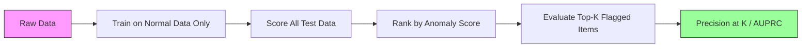

# 异常检测

> 正常很容易定义。不正常就是不合适的东西。

**Type:** Build
**Language:** Python
**Prerequisites:** Phase 2, Lessons 01-09
**Time:** ~75 minutes

## 学习目标

- 从头开始实现Z-score、IQR和隔离森林异常检测方法
- 区分点异常、上下文异常和集体异常，并为每种异常选择合适的检测方法
- 解释为什么异常检测是为正常数据建模而不是对异常进行分类
- 比较无监督异常检测和监督分类，并评估新异常覆盖率和精度之间的权衡

## 这个问题

纽约的信用卡使用时间是下午2点，东京是下午2点05分。工厂的传感器读数为150度，而正常范围是80-120度。当每日平均值为200个请求时，服务器每秒发送50,000个请求。

这些都是反常现象。找到它们很重要。欺诈损失数十亿美元。设备故障造成停机时间。网络入侵造成数据损失。

挑战在于：你很少给异常的例子贴上标签。欺诈占交易的0.1%。设备故障每年都会发生几次。你不能训练一个标准的分类器，因为在“异常”类中几乎没有什么可以学习的。即使您有一些标签，您所看到的异常也不是您将遇到的唯一类型。明天的诈骗计划看起来和今天的不一样。

异常检测解决了这个问题。与其学习不正常的东西，不如学习正常的东西。任何偏离正常的东西都是可疑的。这可以在没有标签的情况下工作，适应新的异常类型，并扩展到大量数据集。

## 这个概念

### 异常类型

并不是所有的异常都是一样的：

- * *点异常。**无论上下文如何，单个数据点都是不寻常的。温度读数为500度。正常情况下只花50美元的账户转账5万美元。
- * *上下文异常。**给定上下文的不寻常数据点。夏季90度的温度是正常的，冬季则不正常。相同的值，不同的上下文。
- * *集体异常。**作为一组不寻常的数据点序列，即使每个单独的点可能是正常的。登录失败5次属于正常现象。50人连杀是蛮力攻击。

大多数方法检测点异常。上下文异常需要时间或位置特征。集体异常需要序列感知方法。

“‘美人鱼
流程图TD
A[异常类型]—b> B[点异常]
A—> C[上下文异常]
A—> D[集体异常]

B—> B1[“单个异常值<br/>温度：500F”]
C—> C1[“不同寻常的上下文<br/> 1月份90F”]
D—> D1[“异常序列<br/>50次登录失败”]

样式B：填充：#fdd，描边：#333
样式C填充：#ffd，描边：#333
样式D填充：#fdf，描边：#333
```

### The Unsupervised Framing

In standard classification, you have labels for both classes. In anomaly detection, you typically have one of three situations:

1. **Fully unsupervised.** No labels at all. You fit the detector on all data and hope anomalies are rare enough not to corrupt the "normal" model.
2. **Semi-supervised.** You have a clean dataset of normal data only. You fit on this clean set and score everything else. This is the strongest setup when possible.
3. **Weakly supervised.** You have a few labeled anomalies. Use them for evaluation, not training. Train unsupervised, then measure precision/recall on the labeled subset.

The key insight: anomaly detection is fundamentally different from classification. You are modeling the distribution of normal data, not the decision boundary between two classes.

### Supervised vs Unsupervised: The Tradeoff

If you do have labeled anomalies, should you use them for training (supervised classification) or for evaluation only (unsupervised detection)?

**Supervised (treat as classification):**
- Catches the exact types of anomalies you have seen before
- Higher precision on known anomaly types
- Misses novel anomaly types entirely
- Requires retraining when new anomaly types emerge
- Needs enough anomaly examples (often too few)

**Unsupervised (model normal, flag deviations):**
- Catches any deviation from normal, including novel types
- Does not require labeled anomalies
- Higher false positive rate (not everything unusual is bad)
- More robust to distribution shift

In practice, the best systems combine both: unsupervised detection for broad coverage, supervised models for known high-priority anomaly types, and human review for ambiguous cases.

### Z-Score Method

The simplest approach. Compute the mean and standard deviation of each feature. Flag any point more than k standard deviations from the mean.

```text
z_score = (x - mean) / std
anomaly if |z_score| > threshold
```

默认阈值为3.0（99.7%的正态数据落在高斯分布的3个标准差范围内）。

** * *优势:简单。快。可解释（“此值与正常值相差4.5个标准差”）。

**缺点：**假设数据为正态分布。对训练数据中的异常值敏感（异常值移动平均值并膨胀std，使其更难被检测到）。在多模态分布上失败。

***当数据大致呈钟形时，单功能监控。服务器响应时间，制造公差，具有稳定基线的传感器读数。

**当它失败时：**多集群数据（两个办公地点具有不同的基线温度），倾斜数据（交易金额1000美元是罕见的，但不是异常的），训练集中有异常值的数据。

### IQR Method

比z分数更稳健。使用四分位数范围而不是平均值和标准差。

```
Q1 = 25th percentile
Q3 = 75th percentile
IQR = Q3 - Q1
lower_bound = Q1 - factor * IQR
upper_bound = Q3 + factor * IQR
anomaly if x < lower_bound or x > upper_bound
```

默认因子为1.5。

**优势：**对异常值具有鲁棒性（百分位数不受极值影响）。适用于倾斜分布。没有正态性假设。

**缺点：**单变量（独立适用于每个功能）。不能检测异常，只有当特征被考虑在一起（一个点可能在每个特征单独是正常的，但在联合空间异常）。

**实用注释：** IQR中的1.5因子对应于箱形图中的晶须。须外的点是潜在的异常值。使用3.0而不是1.5使检测器更加保守（更少的标志，更少的误报）。正确的因素取决于你对假警报的容忍度。

### 隔离森林

关键观点是：异常现象很少，而且各不相同。在数据的随机分区中，异常更容易被隔离——它们需要更少的随机分割来与其他数据分离。

“‘美人鱼
流程图TD
A[所有数据点]—> B{随机特征+随机分裂}
B—> C[左分区]
B—> D[右分区]
C—> E{随机特征+随机分裂}
E—> F[法线点-树的深处]
E—> G[需要更多的分裂…]
D—> H[“异常-快速隔离（短路径）”]

样式H填充：#fdd，描边：#333
样式F填充：#dfd，描边：#333
```

**How it works:**
1. Build many random trees (an isolation forest)
2. At each node, pick a random feature and a random split value between the feature's min and max
3. Keep splitting until every point is isolated (in its own leaf)
4. Anomalies have shorter average path lengths across all trees

**Why it works:** Normal points live in dense regions. Many random splits are needed to isolate one from its neighbors. Anomalies live in sparse regions. One or two random splits are enough to isolate them.

The anomaly score is based on the average path length across all trees, normalized by the expected path length of a random binary search tree:

```
Score (x) = 2^(-average_path_length（x) / c(n)）
```

Where `c(n)` is the expected path length for n samples. Score near 1 means anomaly. Score near 0.5 means normal. Score near 0 means very normal (deep in dense clusters).

**Strengths:** No distribution assumptions. Works in high dimensions. Scales well (sublinear in sample size because each tree uses a subsample). Handles mixed feature types.

**Weaknesses:** Struggles with anomalies in dense regions (masking effect). Random splitting is less effective when many features are irrelevant.

**Key hyperparameters:**
- `n_estimators`: Number of trees. 100 is usually enough. More trees give more stable scores but slower computation.
- `max_samples`: Number of samples per tree. 256 is the default in the original paper. Smaller values make individual trees less accurate but increase diversity. The subsampling is what makes Isolation Forest fast -- each tree sees a small fraction of the data.
- `contamination`: Expected fraction of anomalies. Used only for setting the threshold. Does not affect the scores themselves.

### Local Outlier Factor (LOF)

LOF compares the local density around a point to the density around its neighbors. A point in a sparse region surrounded by dense regions is anomalous.

**How it works:**
1. For each point, find its k nearest neighbors
2. Compute the local reachability density (how dense is the neighborhood)
3. Compare each point's density to its neighbors' densities
4. If a point has much lower density than its neighbors, it is an outlier

**LOF score:**
- LOF close to 1.0 means similar density as neighbors (normal)
- LOF greater than 1.0 means lower density than neighbors (potentially anomalous)
- LOF much greater than 1.0 (e.g., 2.0+) means significantly lower density (likely anomaly)

The "local" part is critical. Consider a dataset with two clusters: a dense cluster of 1000 points and a sparse cluster of 50 points. A point on the edge of the sparse cluster is not globally unusual -- it has 50 neighbors. But it is locally unusual if its immediate neighbors are denser than it is. LOF captures this nuance that global methods miss.

**Strengths:** Detects local anomalies (points that are unusual in their neighborhood, even if they are not globally unusual). Works on clusters of different densities.

**Weaknesses:** Slow on large datasets (O(n^2) for naive implementation). Sensitive to the choice of k. Does not work well in very high dimensions (curse of dimensionality affects distance calculations).

### Comparison

| Method | Assumptions | Speed | Handles High Dims | Detects Local Anomalies |
|--------|------------|-------|-------------------|------------------------|
| Z-score | Normal distribution | Very fast | Yes (per feature) | No |
| IQR | None (per feature) | Very fast | Yes (per feature) | No |
| Isolation Forest | None | Fast | Yes | Partially |
| LOF | Distance is meaningful | Slow | Poorly | Yes |

### Evaluation Challenges

Evaluating anomaly detectors is harder than evaluating classifiers:

- **Extreme class imbalance.** With 0.1% anomalies, predicting "normal" for everything gives 99.9% accuracy. Accuracy is useless.
- **AUROC is misleading.** With heavy imbalance, AUROC can look good even when the model misses most anomalies at practical thresholds.
- **Better metrics:** Precision@k (of the top k flagged items, how many are real anomalies), AUPRC (area under precision-recall curve), and recall at a fixed false positive rate.



### 异常检测管道

在实践中，异常检测遵循以下工作流程：

1. **收集基线数据。**理想情况下，你知道没有（或很少）异常的时期。
2. * *工程特性。**原始特征加上衍生特征（滚动统计、时间特征、比率）。
3. **训练检测器。**与基线数据相符。模型学习“正常”是什么样子。
4. **获得新的数据。**每次新的观测得到一个异常分数。
5. * *阈值的选择。**选择分数分界点。这是一个商业决策：更高的阈值意味着更少的误报，但更多的遗漏异常。
6. **警报和调查。**标记点将由人工审核或自动响应。
7. * *反馈收集。**记录标记项是否为真实异常或假警报。使用此数据评估检测器并随时间调整阈值。

管道永远不会“完成”。数据分布发生变化，新的异常类型出现，阈值需要调整。将异常检测视为一个活的系统，而不是一次性的模型。

## 构建它

中的代码

### z分数探测器

”“python
def zscore_detect(X, threshold=3.0)：
均值= x，均值（轴=0）
std = X.std（轴=0）
Std [Std == 0] = 1.0
Z = np。abs（（X -均值）/ std）
返回z.max(axis=1) >阈值
```

Simple and vectorized. Flags a point if any feature exceeds the threshold.

### IQR Detector

```python
def iqr_detect(X, factor=1.5):
    q1 = np.percentile(X, 25, axis=0)
    q3 = np.percentile(X, 75, axis=0)
    iqr = q3 - q1
    iqr[iqr == 0] = 1.0
    lower = q1 - factor * iqr
    upper = q3 + factor * iqr
    outside = (X < lower) | (X > upper)
    return outside.any(axis=1)
```

### 从头开始隔离森林

从头开始的实现构建随机划分特征空间的隔离树：

”“python
类IsolationTree:
Def __init__(self, max_depth)：
自我。Max_depth = Max_depth

def (self， X, depth=0)：
n, p = x
如果深度>= self。Max_depth或n <= 1：
自我。is_leaf = True
自我。尺寸= n
回归自我
自我。is_leaf = False
自我。Feature = np.random.randint(p)
x_min = X[:, self.feature].min（）
x_max = X[:, self.feature].max（）
如果x_min == x_max：
自我。is_leaf = True
自我。尺寸= n
回归自我
自我。阈值= np.random。制服(x_min x_max)
left_mask = X[:, self.]< self.threshold .
自我。left = IsolationTree(self.max_depth).fit（X[left_mask], depth + 1）
自我。右= IsolationTree(self.max_depth).fit（X[~left_mask], depth + 1）
回归自我
```

The path length to isolate a point determines its anomaly score. Shorter paths mean more anomalous.

The `IsolationForest` class wraps multiple trees:

```python
class IsolationForest:
    def __init__(self, n_estimators=100, max_samples=256, seed=42):
        self.n_estimators = n_estimators
        self.max_samples = max_samples

    def fit(self, X):
        sample_size = min(self.max_samples, X.shape[0])
        max_depth = int(np.ceil(np.log2(sample_size)))
        for _ in range(self.n_estimators):
            idx = rng.choice(X.shape[0], size=sample_size, replace=False)
            tree = IsolationTree(max_depth=max_depth)
            tree.fit(X[idx])
            self.trees.append(tree)

    def anomaly_score(self, X):
        avg_path = average path length across all trees
        scores = 2.0 ** (-avg_path / c(max_samples))
        return scores
```

归一化因子它等于这种标准化确保了分数在不同大小的数据集之间具有可比性。

### 演示场景

代码生成多个测试场景：

1. **带有异常值的单簇。**一个远离中心注入异常的二维高斯聚类。所有的方法都应该在这里工作。
2. * *多通道数据。**三个不同大小和密度的集群。簇之间的点是异常的。Z-score之所以挣扎是因为每个功能的范围太大了。
3. * *高维数据。** 50个特征，但异常只有5个不同。测试方法是否能在特征子集中发现异常。

每个演示使用精度、召回率、F1和Precision@k比较所有方法。

## 使用它

使用sklearn（使用库实现，而不是从头开始）：

”“python
从sklearn。集成导入IsolationForest
从sklearn。邻居导入LocalOutlierFactor

iso = IsolationForest（n_estimators=100, pollution =0.05, random_state=42）
iso.fit (X_train)
预测= iso.predict（X_test）

lof = LocalOutlierFactor（n_neighbors=20，污染=0.05，新颖性=True）
lof.fit (X_train)
预测= lof.predict（X_test）
```

Note `contamination` sets the expected fraction of anomalies. Setting it correctly matters -- too low misses anomalies, too high creates false alarms.

The code in `anomaly_detection.py` compares from-scratch implementations against sklearn on the same data.

### sklearn Contamination Parameter

The `contamination` parameter in sklearn determines the threshold for converting continuous anomaly scores into binary predictions. It does not change the underlying scores.

```python
iso_5 = IsolationForest(contamination=0.05)
iso_10 = IsolationForest(contamination=0.10)
```

两者都产生相同的异常分数。但是如果你不知道真正的异常率（你通常不知道），将污染设置为“自动”并直接使用原始分数。根据假阳性和假阴性之间的成本权衡来设置自己的阈值。

### 看到下面成了一个支持向量机

另一个值得了解的无监督异常探测器。一类支持向量机拟合高维特征空间中正常数据周围的边界（使用核技巧）。

”“python
从sklearn。导入OneClassSVM

oc_svm = OneClassSVM（kernel="rbf", gamma="auto", nu=0.05）
oc_svm.fit (X_train)
预测= oc_svm.predict（X_test）
```

The `nu` parameter approximates the fraction of anomalies. One-Class SVM works well on small to medium datasets but does not scale to very large data (the kernel matrix grows quadratically).

### Autoencoder Approach (Preview)

Autoencoders are neural networks that learn to compress and reconstruct data. Train on normal data. At test time, anomalies have high reconstruction error because the network learned to reconstruct normal patterns only.

This is covered in Phase 3 (Deep Learning), but the principle is the same: model what is normal, flag what deviates.

### Ensemble Anomaly Detection

Just as ensemble methods improve classification (Lesson 11), combining multiple anomaly detectors improves detection. The simplest approach:

1. Run multiple detectors (Z-score, IQR, Isolation Forest, LOF)
2. Normalize each detector's scores to [0, 1]
3. Average the normalized scores
4. Flag points above the threshold on the average score

This reduces false positives because different methods have different failure modes. A point flagged by all four methods is almost certainly anomalous. A point flagged by only one might be a quirk of that method.

More sophisticated ensembles weight each detector by its estimated reliability (measured on a validation set with known anomalies, if available).

### Production Considerations

1. **Threshold drift.** As data distribution shifts, a fixed threshold becomes outdated. Monitor the distribution of anomaly scores and adjust periodically.
2. **Alert fatigue.** Too many false alarms and operators stop paying attention. Start with a high threshold (fewer, more reliable alerts) and lower it as trust builds.
3. **Ensemble approach.** In production, combine multiple detectors. Flag a point only if multiple methods agree it is anomalous. This reduces false positives significantly.
4. **Feature engineering.** Raw features are rarely enough. Add rolling statistics, ratios, time-since-last-event, and domain-specific features. A good feature set matters more than the choice of detector.
5. **Feedback loop.** When operators investigate flagged items and confirm or dismiss them, feed this back into the system. Accumulate labeled data over time to evaluate and improve the detector.

## Ship It

This lesson produces:
- `outputs/skill-anomaly-detector.md` -- a decision skill for choosing the right detector
- `code/anomaly_detection.py` -- Z-score, IQR, and Isolation Forest from scratch, with sklearn comparison

### Choosing a Threshold

The anomaly score is continuous. You need a threshold to make binary decisions. This is a business decision, not a technical one.

Consider two scenarios:
- **Fraud detection.** Missing fraud is expensive (chargebacks, customer trust). False alarms cost a human analyst 5 minutes to investigate. Set the threshold low to catch more fraud, accept more false alarms.
- **Equipment maintenance.** A false alarm means an unnecessary shutdown costing $50,000. A missed failure means a $500,000 repair. Set the threshold to balance these costs.

In both cases, the optimal threshold depends on the cost ratio between false positives and false negatives. Plot precision and recall at different thresholds, overlay the cost function, and pick the minimum-cost point.

### Scaling to Production

For real-time anomaly detection in production:

1. **Batch training, online scoring.** Train the model periodically (daily, weekly) on recent normal data. Score each new observation as it arrives.
2. **Feature computation must match.** If you trained with rolling statistics over 30 days, you need 30 days of history to compute features for a new observation. Buffer the required history.
3. **Score distribution monitoring.** Track the distribution of anomaly scores over time. If the median score drifts upward, either the data is changing or the model is stale.
4. **Explainability.** When you flag an anomaly, say why. Z-score: "Feature X is 4.2 standard deviations above normal." Isolation Forest: "This point was isolated in 3.1 splits on average (normal points take 8.5)."

## Exercises

1. **Threshold tuning.** Run the Z-score detector with thresholds from 1.0 to 5.0 in steps of 0.5. Plot precision and recall at each threshold. Where is the sweet spot for your data?

2. **Multivariate anomalies.** Create 2D data where each feature individually looks normal, but the combination is anomalous (e.g., points far from the main cluster diagonal). Show that Z-score per feature misses these but Isolation Forest catches them.

3. **LOF from scratch.** Implement Local Outlier Factor using k-nearest neighbors. Compare against sklearn's LocalOutlierFactor on the same data. Use k=10 and k=50 -- how does the choice of k affect results?

4. **Streaming anomaly detection.** Modify the Z-score detector to work in a streaming setting: update the running mean and variance as new points arrive (Welford's online algorithm). Compare to batch Z-score on the same data.

5. **Real-world evaluation.** Take a dataset with known anomalies (credit card fraud from Kaggle, for example). Evaluate all four methods using precision@100, precision@500, and AUPRC. Which method works best? Why?

## Key Terms

| Term | What people say | What it actually means |
|------|----------------|----------------------|
| Anomaly | "Outlier, unusual point" | A data point that deviates significantly from the expected pattern of normal data |
| Point anomaly | "A single weird value" | An individual observation that is unusual regardless of context |
| Contextual anomaly | "Normal value, wrong context" | An observation that is unusual given its context (time, location, etc.) but might be normal in another context |
| Isolation Forest | "Random splits to find outliers" | An ensemble of random trees that isolates anomalies with fewer splits than normal points |
| Local Outlier Factor | "Compare density to neighbors" | A method that flags points whose local density is much lower than their neighbors' density |
| Z-score | "Standard deviations from mean" | (x - mean) / std, measuring how far a point is from the center in units of standard deviation |
| IQR | "Interquartile range" | Q3 - Q1, measuring the spread of the middle 50% of data, used for robust outlier detection |
| Contamination | "Expected fraction of anomalies" | A hyperparameter telling the detector what proportion of the data it should flag as anomalous |
| Precision@k | "Of the top k flags, how many are real" | Precision computed on only the k most suspicious points, useful for imbalanced anomaly detection |
| AUPRC | "Area under precision-recall curve" | A metric that summarizes precision-recall performance across all thresholds, better than AUROC for imbalanced data |

## Further Reading

- [Liu et al., Isolation Forest (2008)](https://cs.nju.edu.cn/zhouzh/zhouzh.files/publication/icdm08b.pdf) -- the original Isolation Forest paper
- [Breunig et al., LOF: Identifying Density-Based Local Outliers (2000)](https://dl.acm.org/doi/10.1145/342009.335388) -- the original LOF paper
- [scikit-learn Outlier Detection docs](https://scikit-learn.org/stable/modules/outlier_detection.html) -- overview of all sklearn anomaly detectors
- [Chandola et al., Anomaly Detection: A Survey (2009)](https://dl.acm.org/doi/10.1145/1541880.1541882) -- comprehensive survey of anomaly detection methods
- [Goldstein and Uchida, A Comparative Evaluation of Unsupervised Anomaly Detection Algorithms (2016)](https://journals.plos.org/plosone/article?id=10.1371/journal.pone.0152173) -- empirical comparison of 10 methods on real datasets