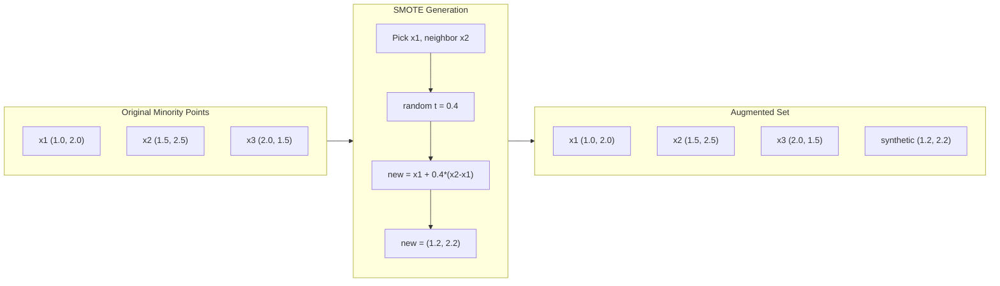
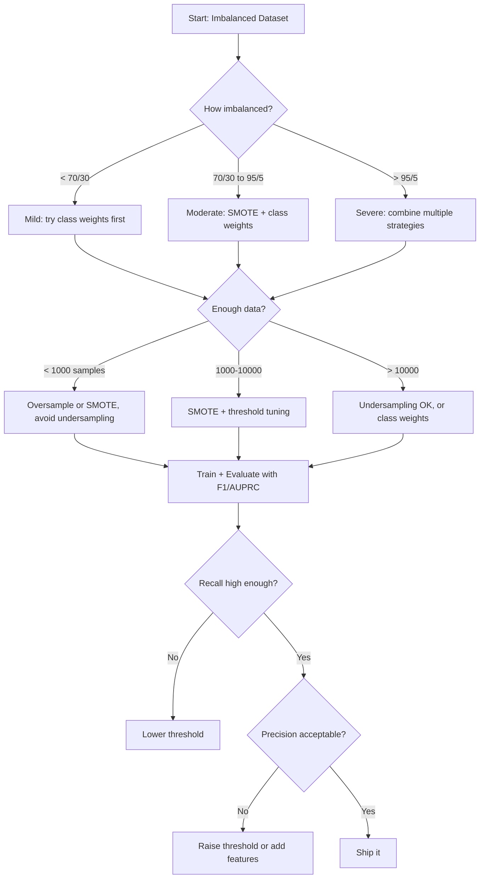

# 处理不平衡数据

> 当99%的数据是“正常的”时，准确性就是一个谎言。

**Type:** Build
**Language:** Python
**Prerequisites:** Phase 2, Lessons 01-09 (especially evaluation metrics)
**Time:** ~90 minutes

## 学习目标

- 从头开始实现SMOTE，并解释合成过采样与随机复制的区别
- 使用F1、AUPRC和Matthews相关系数来评估不平衡分类器，而不是准确性
- 比较类权重、阈值调优和重新采样策略，并为给定的不平衡比率选择正确的方法
- 构建一个完整的不平衡数据管道，它结合了SMOTE、类权重和阈值优化

## 这个问题

你建立了一个欺诈检测模型。准确率达到99.9%。你庆祝。然后你意识到，它预测每笔交易“不存在欺诈”。

这不是一个bug。当只有0.1%的交易是欺诈性交易时，这样做是理性的。该模型了解到，总是猜测多数类会使总体误差最小化。它在技术上是正确的，完全没用。

这种情况发生在任何真正的分类问题上。疾病诊断：阳性率1%。网络入侵：0.01%攻击。制造缺陷：0.5%次品。垃圾邮件过滤：20%垃圾邮件。流失预测：5%的流失者。少数阶级越重要，它就越罕见。

准确性之所以失败，是因为它平等地对待所有正确的预测。正确地标记合法交易和正确地发现欺诈行为都是准确的一点。但捕捉欺诈是该模式存在的全部原因。我们需要度量、技术和训练策略来迫使模型关注罕见但重要的类。

## 这个概念

### 为什么准确性会失败？

考虑一个有1000个样本的数据集：990个是阴性，10个是阳性。一个总是预测消极的模型：

|  | Predicted Positive | Predicted Negative |
|--|---|---|
| Actually Positive | 0 (TP) | 10 (FN) |
| Actually Negative | 0 (FP) | 990 (TN) |

准确率= (0 + 990)/ 1000 = 99.0%

该模型没有发现任何欺诈行为。零的疾病。零缺陷。但准确率是99%。这就是为什么准确性对于不平衡问题是危险的。

### 更好的指标

**精度** = TP / （TP + FP）标记为阳性的，有多少是阳性的？精度高，误报少。

*召回率** = TP / (TP + FN)。在所有正数中，我们抓到了多少？高回忆率意味着很少有遗漏。

**F1得分** = 2 *精度*召回率/（精度+召回率）。谐波平均值。惩罚精度和召回率之间的极端不平衡，而不是算术平均值。

**F-beta分数** = (1 + beta^2) *精度*召回率/ （beta^2 *精度+召回率）。当β bbbb1时，回忆更重要。当beta < 1时，精度更重要。F2在欺诈检测中很常见（漏报欺诈比误报更糟糕）。

**AUPRC** （Precision-Recall Curve下面积）。与AUC-ROC相似，但对于不平衡的数据提供了更多信息。随机分类器的AUPRC等于正分类率（不像ROC那样为0.5）。这使得改进更容易看到。

**马修斯相关系数** = (TP * TN - FP * FN) / sqrt((TP+FP)(TP+FN)（TN+FP)(TN+FN)）。取值范围为-1 ~ +1。只有当模型在两门课上都表现良好时才会给高分。即使班级大小不同也能保持平衡。

对于上面的“总是预测阴性”模型：精度= 0/0（未定义，通常设置为0），召回率= 0/10 = 0,F1 = 0, MCC = 0。这些指标正确地将模型识别为毫无价值的。

### 不平衡数据管道

“‘美人鱼
流程图TD
A[失衡数据集]—b> B{失衡比例？｝
B—>|轻度：80/20| C[分级重量]
B—>|适中：95/5| D[SMOTE +阈值调优]
B—>|Severe: 99/1| E[SMOTE +类权值+阈值]
C—> F[火车模型]
D——b> f
E - >f
F—> G[用F1 / AUPRC / MCC评估]
G -> H{足够好？｝
H—>|No| I[尝试不同的策略]
H—>|是| J[部署监控]
I——b> b
```

### SMOTE: Synthetic Minority Oversampling Technique

Random oversampling duplicates existing minority samples. This works but risks overfitting because the model sees identical points repeatedly.

SMOTE creates new synthetic minority samples that are plausible but not copies. The algorithm:

1. For each minority sample x, find its k nearest neighbors among other minority samples
2. Pick one neighbor at random
3. Create a new sample on the line segment between x and that neighbor

The formula: `new_sample = x + random(0, 1) * (neighbor - x)`

This interpolates between real minority points, creating samples in the same region of feature space without just copying existing data.



### 抽样策略比较

**随机过采样**：重复少数样本以匹配多数计数。
- 优点：简单，无信息丢失
- 缺点：精确复制导致过拟合，增加训练时间

**随机欠采样**：删除多数样本以匹配少数样本。
- 优点：快速训练，简单
- 缺点：丢掉可能有用的多数数据，更高的方差

**SMOTE**：通过插值创建合成少数样本。
- 优点：生成新的数据点，与随机过采样相比减少过拟合
- 缺点：会在决策边界附近产生有噪声的样本，不能解释多数类的分布

| Strategy | Data Changed | Risk | When to Use |
|----------|-------------|------|-------------|
| Oversample | Minority duplicated | Overfitting | Small datasets, moderate imbalance |
| Undersample | Majority removed | Information loss | Large datasets, want fast training |
| SMOTE | Synthetic minority added | Boundary noise | Moderate imbalance, enough minority samples for k-NN |

### 类权重

与其改变数据，不如改变模型处理错误的方式。对少数族裔的错误分类给予更高的权重。

对于一个有950个负样本和50个正样本的二进制问题：
- 负类权值= n_samples / (2 * n_negative) = 1000 / (2 * 950) = 0.526
- 正类权值= n_samples / (2 * n_positive) = 1000 / (2 * 50) = 10.0

正的类得到19倍的权重。错误分类一个阳性样本的代价与错误分类19个阴性样本的代价相同。模特被迫关注少数族裔。

在逻辑回归中，这修改了损失函数：

```
weighted_loss = -sum(w_i * [y_i * log(p_i) + (1-y_i) * log(1-p_i)])
```

其中w_i依赖于样本i的类别。

类权重在数学上等同于期望中的过采样，但不会产生新的数据点。这使它们更快，并避免了重复样本的过拟合风险。

### 阈值调整

大多数分类器输出一个概率。默认阈值为0.5：如果P（正）>= 0.5，则预测为正。但0.5是武断的。当类别不平衡时，最佳阈值通常要低得多。

过程:
1. 训练一个模型
2. 获取验证集上的预测概率
3. 扫描阈值从0.0到1.0
4. 在每个阈值处计算F1（或您选择的度量）
5. 选择能够最大化你的指标的阈值

“‘美人鱼
流程图LR
A[模型]—b> B[预测概率]
B—> C[扫描阈值0.0到1.0]
C—> D[计算每个F1]
D—> E[选择最佳阈值]
E—> F[在生产中使用]
```

A model might output P(fraud) = 0.15 for a fraudulent transaction. At threshold 0.5, this is classified as not fraud. At threshold 0.10, it is correctly caught. The probability calibration matters less than the ranking -- as long as fraud gets higher probabilities than non-fraud, there exists a threshold that separates them.

### Cost-Sensitive Learning

Generalization of class weights. Instead of uniform costs, assign specific misclassification costs:

| | Predict Positive | Predict Negative |
|--|---|---|
| Actually Positive | 0 (correct) | C_FN = 100 |
| Actually Negative | C_FP = 1 | 0 (correct) |

Missing a fraudulent transaction (FN) costs 100x more than a false alarm (FP). The model optimizes for total cost, not total error count.

This is the most principled approach when you can estimate real-world costs. A missed cancer diagnosis has a very different cost than a false alarm that leads to an extra biopsy. Making these costs explicit forces the right tradeoffs.

### Decision Flowchart



## 构建它

### 步骤1：生成一个不平衡数据集

”“python
导入numpy为np


Def make_imbalanced_data(n_majority=950, n_minority=50, seed=42)：
rng = np.random.RandomState（seed）

X_maj = rng。Randn (n_majority, 2) * 1.0 + np.array（[0.0, 0.0]）
X_min = rng。Randn (n_minority, 2) * 0.8 + np.array（[2.5, 2.5]）

X = np。vstack ([X_maj X_min])
Y = np.concatenate([np.]0 (n_majority) np.ones (n_minority)))

Shuffle_idx = rng.permutation（len(y)）
返回X[shuffle_idx]， y[shuffle_idx]
```

### Step 2: SMOTE from scratch

```python
def euclidean_distance(a, b):
    return np.sqrt(np.sum((a - b) ** 2))


def find_k_neighbors(X, idx, k):
    distances = []
    for i in range(len(X)):
        if i == idx:
            continue
        d = euclidean_distance(X[idx], X[i])
        distances.append((i, d))
    distances.sort(key=lambda x: x[1])
    return [d[0] for d in distances[:k]]


def smote(X_minority, k=5, n_synthetic=100, seed=42):
    rng = np.random.RandomState(seed)
    n_samples = len(X_minority)
    k = min(k, n_samples - 1)
    synthetic = []

    for _ in range(n_synthetic):
        idx = rng.randint(0, n_samples)
        neighbors = find_k_neighbors(X_minority, idx, k)
        neighbor_idx = neighbors[rng.randint(0, len(neighbors))]
        t = rng.random()
        new_point = X_minority[idx] + t * (X_minority[neighbor_idx] - X_minority[idx])
        synthetic.append(new_point)

    return np.array(synthetic)
```

### 步骤3：随机过采样和欠采样

”“python
def random_oversample(X, y, seed=42)：
rng = np.random.RandomState（seed）
类，计数= np。独特的(y, return_counts = True)
Max_count = counts.max（）

X_resampled = list(X)
Y_resampled = list(y)

对于cls， count in zip(classes, counts)：
如果count < max_count：
Cls_indices = np。Where (y == cls)[0]
N_needed = max_count - count
选择= rng。选择（cls_indices, size=n_needed, replace=True）
X_resampled.extend (X(选择))
y_resampled.extend (y(选择))

X_out = np.array（X_resampled）
Y_out = np.array（y_resampled）
Shuffle = rng.permutation（len(y_out)）
返回X_out[shuffle]， y_out[shuffle]


def random_undersample(X, y, seed=42)：
rng = np.random.RandomState（seed）
类，计数= np。独特的(y, return_counts = True)
Min_count = counts.min（）

X_resampled = []
Y_resampled = []

对于CLS类：
Cls_indices = np。Where (y == cls)[0]
选择= rng。选择（cls_indices, size=min_count, replace=False）
X_resampled.extend (X(选择))
y_resampled.extend (y(选择))

X_out = np.array（X_resampled）
Y_out = np.array（y_resampled）
Shuffle = rng.permutation（len(y_out)）
返回X_out[shuffle]， y_out[shuffle]
```

### Step 4: Logistic regression with class weights

```python
def sigmoid(z):
    return 1.0 / (1.0 + np.exp(-np.clip(z, -500, 500)))


def logistic_regression_weighted(X, y, weights, lr=0.01, epochs=200):
    n_samples, n_features = X.shape
    w = np.zeros(n_features)
    b = 0.0

    for _ in range(epochs):
        z = X @ w + b
        pred = sigmoid(z)
        error = pred - y
        weighted_error = error * weights

        gradient_w = (X.T @ weighted_error) / n_samples
        gradient_b = np.mean(weighted_error)

        w -= lr * gradient_w
        b -= lr * gradient_b

    return w, b


def compute_class_weights(y):
    classes, counts = np.unique(y, return_counts=True)
    n_samples = len(y)
    n_classes = len(classes)
    weight_map = {}
    for cls, count in zip(classes, counts):
        weight_map[cls] = n_samples / (n_classes * count)
    return np.array([weight_map[yi] for yi in y])
```

### 步骤5：阈值调优

”“python
Def find_optimal_threshold(y_true, y_probs, metric="f1")：
Best_threshold = 0.5
Best_score = -1.0

对于np. range（0.05, 0.96, 0.01）的阈值：
Y_pred = (y_probs >= threshold).astype（int）
Tp = np。Sum (（y_pred == 1) & (y_true == 1)）
Fp = np。Sum (（y_pred == 1) & (y_true == 0)）
Fn = np。Sum (（y_pred == 0) & (y_true == 1)）

如果metric == "f1"：
Precision = tp / (tp + fp) if (tp + fp) > 0 else 0.0
Recall = tp / (tp + fn) if (tp + fn) > 0 else 0.0
得分= 2 *精度*召回率/（精度+召回率）if（精度+召回率）> 0 else 0.0
Elif度量== “召回”：
得分= tp / (tp + fn) if (tp + fn) > 0 else 0.0
Elif metric == "precision"：
得分= tp / (tp + fp) if (tp + fp) > 0 else 0.0

如果得分> best_score：
Best_score =得分
Best_threshold =阈值

返回best_threshold， best_score
```

### Step 6: Evaluation functions

```python
def confusion_matrix_values(y_true, y_pred):
    tp = np.sum((y_pred == 1) & (y_true == 1))
    tn = np.sum((y_pred == 0) & (y_true == 0))
    fp = np.sum((y_pred == 1) & (y_true == 0))
    fn = np.sum((y_pred == 0) & (y_true == 1))
    return tp, tn, fp, fn


def compute_metrics(y_true, y_pred):
    tp, tn, fp, fn = confusion_matrix_values(y_true, y_pred)
    accuracy = (tp + tn) / (tp + tn + fp + fn)
    precision = tp / (tp + fp) if (tp + fp) > 0 else 0.0
    recall = tp / (tp + fn) if (tp + fn) > 0 else 0.0
    f1 = 2 * precision * recall / (precision + recall) if (precision + recall) > 0 else 0.0

    denom = np.sqrt(float((tp + fp) * (tp + fn) * (tn + fp) * (tn + fn)))
    mcc = (tp * tn - fp * fn) / denom if denom > 0 else 0.0

    return {
        "accuracy": accuracy,
        "precision": precision,
        "recall": recall,
        "f1": f1,
        "mcc": mcc,
    }
```

### 第七步：比较所有的方法

”“python
X, y = make_imbalanced_data（950,50, seed=42）
Split = int（0.8 * len(y)）
X_train, X_test = X[:split], X[split:]
Y_train, y_test = y[:split], y[split:]

# 基线：未治疗
W_base, b_base = logistic_regression_weighted(
X_train, y_train, np。Ones (len(y_train)), lr=0.1, epochs=300
）
probs_base = sigmoid（X_test @ w_base + b_base）
Preds_base = (probs_base >= 0.5).astype（int）

# 采样过量
X_over, y_over =随机抽样（X_train, y_train）
W_over, b_over = logistic_regression_weighted(
x_/ y_/ np。Ones (len(y_over)), lr=0.1, epochs=300
）
preds_over = (sigmoid(X_test @ w_over + b_over) >= 0.5).astype（int）

# 击杀
Minority_mask = y_train == 1
X_minority = X_train[minority_mask]
n = n =len(y_train) - 2 * int（y_train .sum()）
X_smote = np。vstack ([X_train、合成)
Y_smote = np。连接([y_train np.ones (len(合成))))
W_sm, b_sm = logistic_regression_weighted(
X_smote, y_smote, np。Ones (len(y_smote)), lr=0.1, epochs=300
）
preds_smote = (sigmoid(X_test @ w_sm + b_sm) >= 0.5).astype（int）

# 类权重
Sample_weights = compute_class_weights（y_train）
W_cw, b_cw = logistic_regression_weighted(
X_train, y_train, sample_weights, lr=0.1, epochs=300
）
probs_cw = sigmoid（X_test @ w_cw + b_cw）
Preds_cw = (probs_cw >= 0.5).astype（int）

# 阈值调优（调优驻留验证集，而不是测试集）
probs_val = sigmoid（X_val @ w_cw + b_cw）
Best_thresh, best_f1 = find_optimal_threshold（y_val, probs_val, metric="f1"）
Preds_thresh = (probs_cw >= best_thresh).astype（int）
```

The code file runs all of this in a single script and prints results.

## Use It

With scikit-learn and imbalanced-learn, these techniques are one-liners:

```python
from sklearn.linear_model import LogisticRegression
from sklearn.metrics import classification_report, f1_score
from sklearn.model_selection import train_test_split
from imblearn.over_sampling import SMOTE
from imblearn.under_sampling import RandomUnderSampler
from imblearn.pipeline import Pipeline

X_train, X_test, y_train, y_test = train_test_split(X, y, stratify=y)

model_weighted = LogisticRegression(class_weight="balanced")
model_weighted.fit(X_train, y_train)
print(classification_report(y_test, model_weighted.predict(X_test)))

smote = SMOTE(random_state=42)
X_resampled, y_resampled = smote.fit_resample(X_train, y_train)
model_smote = LogisticRegression()
model_smote.fit(X_resampled, y_resampled)
print(classification_report(y_test, model_smote.predict(X_test)))

pipeline = Pipeline([
    ("smote", SMOTE()),
    ("model", LogisticRegression(class_weight="balanced")),
])
pipeline.fit(X_train, y_train)
print(classification_report(y_test, pipeline.predict(X_test)))
```

从头开始的实现准确地展示了每种技术的功能。SMOTE就是k-NN对少数类的插值。类权重乘以损失。阈值调优是对截止点的for循环。没有魔法。

## 船这

这一课产生：
- Z0

## 练习

1. **Borderline-SMOTE**：修改SMOTE实现，仅为靠近决策边界的少数点生成合成样本（其k近邻包括多数类样本）。在类重叠的数据集上将结果与标准SMOTE进行比较。

2. **代价矩阵优化**：以代价矩阵为参数实现代价敏感学习。创建一个函数，该函数接受成本矩阵并返回最小化预期成本的最佳预测。使用不同的成本比（1:10,1:100,1:100）进行测试，并绘制精确率-召回率权衡如何变化。

3. **阈值校准**：实现普拉特缩放（拟合模型的原始输出逻辑回归产生校准概率）。比较校准前后的精密度-召回曲线。显示校准不改变排名（AUC保持不变），但使概率更有意义。

4. **与平衡bagging集成**：训练多个模型，每个模型在一个平衡的bootstrap样本上（所有少数+多数的随机子集）。平均他们的预测。将此方法与带有SMOTE的单个模型进行比较。度量跨运行的性能和方差。

5. **失衡比例实验**：取一个平衡的数据集，逐步增加失衡比例（50/50、70/30、90/10、95/ 5,99 /1）。对于每个比例，使用和不使用SMOTE进行训练。绘制两种方法的F1与失衡比。SMOTE以什么比例开始产生有意义的变化？

## 关键术语

| Term | What people say | What it actually means |
|------|----------------|----------------------|
| Class imbalance | "One class has way more samples" | The distribution of classes in the dataset is significantly skewed, causing models to favor the majority class |
| SMOTE | "Synthetic oversampling" | Creates new minority samples by interpolating between existing minority samples and their k-nearest minority neighbors |
| Class weights | "Making errors on rare classes more expensive" | Multiplying the loss function by class-specific weights so the model penalizes minority misclassification more heavily |
| Threshold tuning | "Moving the decision boundary" | Changing the probability cutoff for classification from the default 0.5 to a value that optimizes the desired metric |
| Precision-recall tradeoff | "You cannot have both" | Lowering the threshold catches more positives (higher recall) but also flags more false positives (lower precision), and vice versa |
| AUPRC | "Area under the PR curve" | Summarizes the precision-recall curve into a single number; more informative than AUC-ROC when classes are heavily imbalanced |
| Matthews Correlation Coefficient | "The balanced metric" | A correlation between predicted and actual labels that produces a high score only when the model performs well on both classes |
| Cost-sensitive learning | "Different mistakes cost different amounts" | Incorporating real-world misclassification costs into the training objective so the model optimizes for total cost, not error count |
| Random oversampling | "Duplicate the minority" | Repeating minority class samples to balance class counts; simple but risks overfitting to duplicated points |

## 进一步的阅读

- Z0
- Z0
- Z0
- Z0