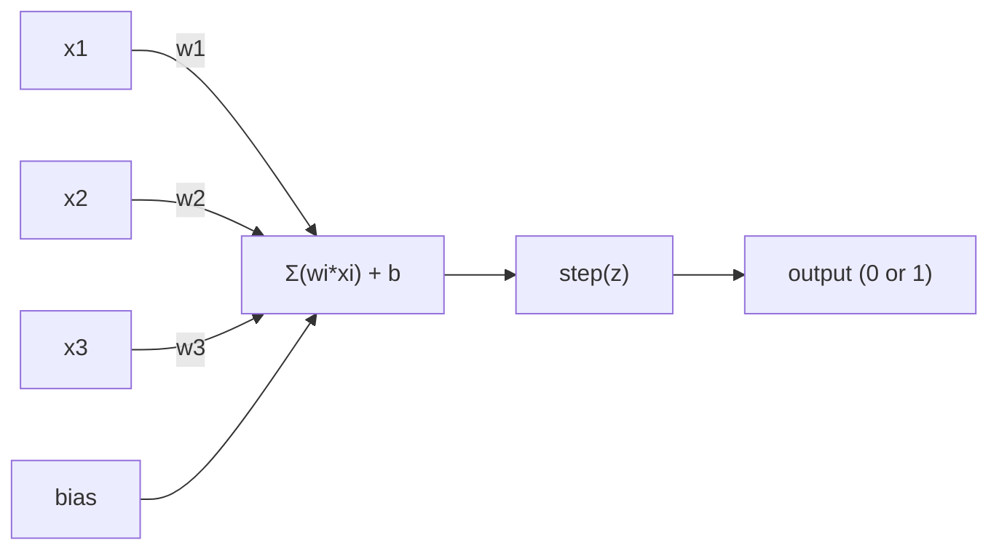

# 感知器

> 感知器是神经网络的原子。把它拆开，你会发现权重、偏见和决定。

**Type:** Build
**Languages:** Python
**Prerequisites:** Phase 1 (Linear Algebra Intuition)
**Time:** ~60 minutes

## 学习目标

- 在Python中从头开始实现一个感知器，包括权重更新规则和步长激活函数
- 解释为什么单个感知器只能解决线性可分问题，并演示异或故障情况
- 由OR门、NAND门和and门组成多层感知器来解决异或问题
- 用sigmoid激活和反向传播训练一个两层网络来自动学习XOR

## 这个问题

你们知道向量和点积。你知道矩阵把输入转换成输出。但是机器是如何“学习”使用哪种转换的呢？


## 

### 一个神经元，一个决定

感知器接受n个输入，将每个输入乘以一个权重，将它们相加，加上一个偏差，并将结果通过激活函数传递。



The step function is brutal: if the weighted sum plus bias is >= 0, output 1. Otherwise, output 0.

```
cwct0red65tv2n0cuhef

```

This is a linear classifier. The weights and bias define a line (or hyperplane in higher dimensions) that splits the input space into two regions.

### The Decision Boundary

For two inputs, the perceptron draws a line through 2D space:

```
x2
┤
│班1 /
│(0 )          /
│                 /
│                / w1 + w2·12·x2 + b = 0
│               /
│              /     坐2
│             /        ( 1)
┼───────────/────────────12
```

Everything on one side of the line outputs 0. Everything on the other side outputs 1. Training moves this line until it correctly separates the classes.

### The Learning Rule

The perceptron learning rule is simple:

```
对于每个训练样例（x, y_true）：
Y_pred = predict(x)
错误= y_true - y_pred

v3a9ljk9qudgjgxlmyyy


```

If the prediction is correct, error = 0, nothing changes. If it predicts 0 but should be 1, weights increase. If it predicts 1 but should be 0, weights decrease. The learning rate controls how big each adjustment is.

### The XOR Problem

Here's where it breaks. Look at these logic gates:

```
1ws31jgbbg6dqe4wxpki


```

AND and OR are linearly separable: you can draw a single line to separate the 0s from the 1s. XOR is not. No single line can separate [0,1] and [1,0] from [0,0] and [1,1].

```
AND（可分离）：XOR（不可分离）：

7zecejriqb52z6sq9q2a


```

This is a fundamental limit. A single perceptron can only solve linearly separable problems. Minsky and Papert proved this in 1969 and it nearly killed neural network research for a decade.

The fix: stack perceptrons into layers. A multi-layer perceptron can solve XOR by combining two linear decisions into a nonlinear one.

## Build It

### Step 1: The Perceptron class

```python
class Perceptron:
    def __init__(self, n_inputs, learning_rate=0.1):
        self.weights = [0.0] * n_inputs
        self.bias = 0.0
        self.lr = learning_rate

    def predict(self, inputs):
        total = sum(w * x for w, x in zip(self.weights, inputs))
        total += self.bias
        return 1 if total >= 0 else 0

    def train(self, training_data, epochs=100):
        for epoch in range(epochs):
            errors = 0
            for inputs, target in training_data:
                prediction = self.predict(inputs)
                error = target - prediction
                if error != 0:
                    errors += 1
                    for i in range(len(self.weights)):
                        self.weights[i] += self.lr * error * inputs[i]
                    self.bias += self.lr * error
            if errors == 0:
                print(f"Converged at epoch {epoch + 1}")
                return
        print(f"Did not converge after {epochs} epochs")
```

### 步骤2：训练逻辑门

”“python
And_data = [
（[0,0], 0），
（[0,1], 0），
（[1,0], 0），
（[1,1], 1），
］

Or_data = [
（[0,0], 0），
（[0,1], 1），
（[1,0], 1），
（[1,1], 1），
］

Not_data = [
(1) [0]
(0) [1]
］

print（"=== AND Gate ==="）
p_and = Perceptron(2)
p_and.train (and_data)
对于输入，_in and_data：
Print （f"{输入}-> {p_and.predict（输入）}"）

print（"\n=== OR Gate ==="）
p_or = Perceptron(2)
p_or.train (or_data)
对于输入，_in or_data：
Print （f"{输入}-> {p_or.predict（输入）}"）

print（"\n=== NOT Gate ==="）
p_not = Perceptron(1)
p_not.train (not_data)
对于输入，not_data中的_：
Print （f"{输入}-> {p_not.predict（输入）}"）
```

### Step 3: Watch XOR fail

```python
xor_data = [
    ([0, 0], 0),
    ([0, 1], 1),
    ([1, 0], 1),
    ([1, 1], 0),
]

print("\n=== XOR Gate (single perceptron) ===")
p_xor = Perceptron(2)
p_xor.train(xor_data, epochs=1000)
for inputs, expected in xor_data:
    result = p_xor.predict(inputs)
    status = "OK" if result == expected else "WRONG"
    print(f"  {inputs} -> {result} (expected {expected}) {status}")
```

它永远不会收敛。这是单个感知机无法学习异或的有力证明。

### 

技巧：XOR = (x1或x2) AND NOT （x1和x2）。结合三个感知器：


```

```python
def xor_network(x1, x2):
    or_neuron = Perceptron(2)
    or_neuron.weights = [1.0, 1.0]
    or_neuron.bias = -0.5

    nand_neuron = Perceptron(2)
    nand_neuron.weights = [-1.0, -1.0]
    nand_neuron.bias = 1.5

    and_neuron = Perceptron(2)
    and_neuron.weights = [1.0, 1.0]
    and_neuron.bias = -1.5

    hidden1 = or_neuron.predict([x1, x2])
    hidden2 = nand_neuron.predict([x1, x2])
    output = and_neuron.predict([hidden1, hidden2])
    return output


print("\n=== XOR Gate (multi-layer network) ===")
for inputs, expected in xor_data:
    result = xor_network(inputs[0], inputs[1])
    print(f"  {inputs} -> {result} (expected {expected})")
```

All four cases correct. Stacking perceptrons into layers creates decision boundaries that no single perceptron can produce.

### 步骤5：训练一个双层网络

步骤4手工固定重物。这适用于异或，但不适用于你事先不知道正确权重的实际问题。解决方法：将阶跃函数替换为sigmoid，通过反向传播自动学习权值。

”“python
类TwoLayerNetwork:
Def __init__(self, learning_rate=0.5)：
进口随机
random.seed (0)
自我。W_hidden =[[随机]。均匀（- 1,1），随机。Uniform (-1, 1)] for _ in range(2)]
自我。B_hidden =[随机的。均匀（- 1,1），随机。制服(1,1)]
自我。W_output =[随机的。均匀（- 1,1），随机。制服(1,1)]
自我。B_output = random。制服(1,1)
自我。Lr = learning_rate


    def forward(self, inputs):
        self.inputs = inputs
        self.hidden_outputs = []
        for i in range(2):
            z = sum(w * x for w, x in zip(self.w_hidden[i], inputs)) + self.b_hidden[i]
            self.hidden_outputs.append(self.sigmoid(z))
        z_out = sum(w * h for w, h in zip(self.w_output, self.hidden_outputs)) + self.b_output
        self.output = self.sigmoid(z_out)
        return self.output

Def train(self, training_data, epochs=10000)：
对于range（epochs）中的epoch：
Total_error = 0
对于输入，training_data中的target：
Output = self.forward（输入）
错误=目标-输出
Total_error += error ** 2

D_output = error * output * （1 - output）


对于I在range(2)内：
自我。W_output [i] += self。Lr * d_output * self.hidden_outputs[i]
自我。B_output += self。Lr * d_output

对于I在range(2)内：
对于range（len(inputs)）中的j：
自我。W_hidden [i][j] += self。Lr * hidden_deltas[i] *输入[j]
自我。B_hidden [i] += self。Lr * hidden_deltas[i]
```

```python
net = TwoLayerNetwork(learning_rate=2.0)
net.train(xor_data, epochs=10000)
for inputs, expected in xor_data:
    result = net.forward(inputs)
    predicted = 1 if result >= 0.5 else 0
    print(f"  {inputs} -> {result:.4f} (rounded: {predicted}, expected {expected})")
```

与步骤4有两个关键区别。首先，sigmoid取代了阶跃函数——它是平滑的，所以存在梯度。第二，这是20行的反向传播。

这是通往第03课的桥梁。背后的数学我们会正确地推导它。

## 

你刚刚从头开始构建的所有东西都存在于一个导入中：

”“python
从sklearn。线性模型import 感知器 as SkPerceptron
import numpy as np

X = np.array（[[0,0],[0,1],[1,0],[1,1]]）
Y = np。数组（[0,0,0,1]）

clf = SkPerceptron（max_iter=100, tol=1e-3）
clf.fit (X, y)
打印([clf。预测（[x]）[0] for x in x]
```

Five lines. Your 30-line `Perceptron` class does the same thing. The sklearn version adds convergence checks, multiple loss functions, and sparse input support -- but the core loop is identical: weighted sum, step function, weight update on error.

The real gap shows up at scale. What changes in production networks:

- The step function becomes sigmoid, ReLU, or other smooth activations
- Weights are learned automatically via backpropagation (Lesson 03)
- Layers get deeper: 3, 10, 100+ layers
- The same principle holds: each layer creates new features from the previous layer's outputs

A single perceptron can only draw straight lines. Stack them, and you can draw any shape.

## Ship It

This lesson produces:
- `outputs/skill-perceptron.md` - a skill covering when single-layer vs multi-layer architectures are needed

## Exercises

1. Train a perceptron on a NAND gate (the universal gate - any logic circuit can be built from NAND). Verify its weights and bias form a valid decision boundary.
2. Modify the Perceptron class to track the decision boundary (w1*x1 + w2*x2 + b = 0) at each epoch. Print how the line shifts during training on the AND gate.
3. Build a 3-input perceptron that outputs 1 only when at least 2 of the 3 inputs are 1 (a majority vote function). Is this linearly separable? Why?

## Key Terms

| Term | What people say | What it actually means |
|------|----------------|----------------------|
| Perceptron | "A fake neuron" | A linear classifier: dot product of inputs and weights, plus bias, through a step function |
| Weight | "How important an input is" | A multiplier that scales each input's contribution to the decision |
| Bias | "The threshold" | A constant that shifts the decision boundary, letting the perceptron fire even with zero inputs |
| Activation function | "The thing that squishes values" | A function applied after the weighted sum - step function for perceptrons, sigmoid/ReLU for modern networks |
| Linearly separable | "You can draw a line between them" | A dataset where a single hyperplane can perfectly separate the classes |
| XOR problem | "The thing perceptrons can't do" | Proof that single-layer networks cannot learn non-linearly-separable functions |
| Decision boundary | "Where the classifier switches" | The hyperplane w*x + b = 0 that divides input space into two classes |
| Multi-layer perceptron | "A real neural network" | Perceptrons stacked in layers, where each layer's output feeds the next layer's input |

## Further Reading

- Frank Rosenblatt, "The Perceptron: A Probabilistic Model for Information Storage and Organization in the Brain" (1958) -- the original paper that started it all
- Minsky & Papert, "Perceptrons" (1969) -- the book that proved XOR was unsolvable by single-layer networks and killed perceptron research for a decade
- Michael Nielsen, "Neural Networks and Deep Learning", Chapter 1 (http://.com/) -- free online, best visual explanation of how perceptrons compose into networks