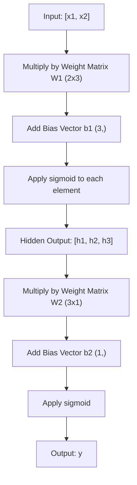

# 多层网络和转发通道

> 一个神经元画一条线。把它们叠起来，你就可以画任何东西了。

**Type:** Build
**Languages:** Python
**Prerequisites:** Phase 01 (Math Foundations), Lesson 03.01 (The Perceptron)
**Time:** ~90 minutes

## 学习目标

- 使用Layer和network类从头开始构建多层网络，这些类执行完整的前向传递
- 通过网络的每一层跟踪矩阵尺寸并识别形状不匹配
- 解释堆叠非线性激活如何使网络学习弯曲的决策边界
- 使用带有手动调优s型权值的2-2-1架构来解决异或问题

## 这个问题

单个神经元是一个线条绘制器。就是这样。数据中的一条直线。人工智能中的每一个真正的问题——图像识别、语言理解、下围棋——都需要曲线。将神经元堆叠成层就是得到曲线的方法。

In 1969, Minsky and Papert proved this limitation was fatal: a single-layer network cannot learn XOR. Not "struggles to learn" -- mathematically cannot. The XOR truth table places [0,1] and [1,0] on one side, [0,0] and [1,1] on the other. No single line separates them.

This killed neural network funding for over a decade. The fix was obvious in hindsight: stop using one layer. Stack neurons into layers. Let the first layer carve the input space into new features, and let the second layer combine those features into decisions no single line could make.

这个堆栈就是多层网络。它是当今生产中每个深度学习模型的基础。前向传递——从输入到隐藏层的数据流到输出——是您需要在其他任何工作之前构建的第一件事。

## 这个概念

### 图层：输入，隐藏，输出

多层网络有三种类型的层：

**输入层**——不是真正的层。它保存着原始数据。两个特征意味着两个输入节点。这里没有计算。

*lens1tqx98czdkn744a1

**输出层**——最终答案。对于二值分类，一个神经元具有乙状体。对于多类，每个类一个神经元。

6fh9ijrdlk9ahm3ua6w3


```

This is a 2-3-1 network. Two inputs, three hidden neurons, one output. Every connection carries a weight. Every neuron (except input) carries a bias.

Each layer produces a vector of numbers called a hidden state. For text, hidden states increase dimensionality -- encoding a word as 768 numbers to capture semantic meaning. For images, they reduce dimensionality -- compressing millions of pixels into a manageable representation. The hidden state is where the learning lives.

### Neurons and Activations

Each neuron does three things:

1. Multiply every input by its corresponding weight
2. Sum all the products and add a bias
3. Pass the sum through an activation function

For now, the activation is sigmoid:

```
kx34yqujp9enkxuhgtji
```

Sigmoid squashes any number into the range (0, 1). Large positive inputs push toward 1. Large negative inputs push toward 0. Zero maps to 0.5. This smooth curve is what makes learning possible -- unlike the perceptron's hard step, sigmoid has a gradient everywhere.

### Forward Pass: How Data Flows

The forward pass pushes input data through the network, layer by layer, until it reaches the output. No learning happens during the forward pass. It is pure computation: multiply, add, activate, repeat.



在每一层，三个操作依次发生：

```
z = W * input + b       (linear transformation)
a = sigmoid(z)           (activation)
```

一层的输出成为下一层的输入。这就是整个前传。

### x442cgk8rem0zayfiu8n

跟踪维度是深度学习中最重要的调试技能。下面是2-3-1网络：

| Step | Operation | Dimensions | Result Shape |
|------|-----------|------------|-------------|
| Input | x | -- | (2,) |
| Hidden linear | W1 * x + b1 | W1: (3, 2), b1: (3,) | (3,) |
| Hidden activation | sigmoid(z1) | -- | (3,) |
| Output linear | W2 * h + b2 | W2: (1, 3), b2: (1,) | (1,) |
| Output activation | sigmoid(z2) | -- | (1,) |

规则：k层的权重矩阵W具有形状（neurons_in_layer_k, neurons_in_layer_k_minus_1）。行匹配当前层。列与前一层匹配。如果形状不对齐，就有问题。

### 普遍近似定理

1989年，George Cybenko证明了一件了不起的事情：一个具有单个隐藏层和足够多神经元的神经网络可以近似任何连续函数，达到任何期望的精度。

tco3oogawoquygb423m5

直觉：隐藏层中的每个神经元学习一个“凹凸”或特征。在适当的位置放置足够的凸起可以近似于任何平滑的曲线。更多的神经元，更多的凸起，更好的近似。

“‘美人鱼
图LR
子图FewNeurons[“4个隐藏的神经元”]
(“粗糙近似”)
结束
子图MoreNeurons[“16个隐藏的神经元”]
B(“近似”)
结束
子图ManyNeurons[“64个隐藏神经元”]
C(“近乎完美”)
结束
少神经元——>多神经元——>多神经元
```

### Composability

Neural networks are composable. You can stack them, chain them, run them in parallel. A Whisper model uses an encoder network to process audio and a separate decoder network to generate text. Modern LLMs are decoder-only. BERT is encoder-only. T5 is encoder-decoder. The architecture choice defines what the model can do.

## Build It

Pure Python. No numpy. Every matrix operation written from scratch.

### Step 1: Sigmoid Activation

```python
import math

def sigmoid(x):
    x = max(-500.0, min(500.0, x))
    return 1.0 / (1.0 + math.exp(-x))
```

[- 500,500]的夹子防止溢出。`math.exp(500)` is large but finite. `math.exp(1000)` is infinity.

### 步骤2：图层类

3azn2ibjzzhqeba6aok5

一层包含一个权重矩阵和一个偏置向量。它的forward方法接受一个输入向量并返回激活的输出。

k8qoz8xkvxh0r284yj0m


Def forward(self, inputs)：
自我。Last_input =输入
自我。Last_output = []
对于在range（len(self.weights)）中的neuron_idx：
Z = sum（）
W * x for W, x in zip(self。权重(neuron_idx),输入)
）
Z += self.biases[neuron_idx]
self.last_output.append(乙状结肠(z))
返回self.last_output
```

The weight matrix has shape (n_neurons, n_inputs). Each row is one neuron's weights across all inputs. The forward method loops through neurons, computes the weighted sum plus bias, applies sigmoid, and collects the results.

### Step 3: Network Class

A network is a list of layers. The forward pass chains them: output of layer k feeds into layer k+1.

```python
class Network:
    def __init__(self, layers):
        self.layers = layers

    def forward(self, inputs):
        current = inputs
        for layer in self.layers:
            current = layer.forward(current)
        return current
```

这就是整个前传。四行逻辑。数据进入，流过每一层，从另一层出来。

### 步骤4：手动调整重量的异或

2ngn5mhoz8wgtpmr4553

”“python
hidden = Layer(
n_inputs = 2,
n_neurons = 2,
权重=[[20.0,20.0],[-20.0,-20.0]]，
偏见= [-10.0,30.0],
）

jzaba0tctjdps1q0l9cg


xor_net = Network（[hidden, output]）

gmbqfe320dyc3fhsj61t


for inputs, expected in xor_data:
    result = xor_net.forward(inputs)
    predicted = 1 if result[0] >= 0.5 else 0
    print(f"  {inputs} -> {result[0]:.6f} (rounded: {predicted}, expected: {expected})")
```

The large weights (20, -20) make sigmoid act like a step function. The first hidden neuron approximates OR. The second approximates NAND. The output neuron combines them into AND, which is XOR.

### Step 5: Circle Classification

A harder problem: classify 2D points as inside or outside a circle of radius 0.5 centered at the origin. This requires a curved decision boundary -- impossible for a single perceptron.

```python
import random
import math

random.seed(42)

data = []
for _ in range(200):
    x = random.uniform(-1, 1)
    y = random.uniform(-1, 1)
    label = 1 if (x * x + y * y) < 0.25 else 0
    data.append(([x, y], label))

circle_net = Network([
    Layer(n_inputs=2, n_neurons=8),
    Layer(n_inputs=8, n_neurons=1),
])
```

i6tjf6f92k6wmtu1ua2i

”“python
正确= 0
对于数据中预期的输入：
结果= circle_net.forward（输入）
预测= 1如果结果b[0] >= 0.5否则0
如果预测==预期：
正确+= 1

xgv6n4kokuah9mmuh3ep
```

Random weights give poor accuracy -- often worse than guessing the majority class. After training (Lesson 03), this same architecture with 8 hidden neurons will draw a curved boundary that separates inside from outside.

## Use It

PyTorch does everything above in four lines:

```python
import torch
import torch.nn as nn

model = nn.Sequential(
    nn.Linear(2, 8),
    nn.Sigmoid(),
    nn.Linear(8, 1),
    nn.Sigmoid(),
)

x = torch.tensor([[0.0, 0.0], [0.0, 1.0], [1.0, 0.0], [1.0, 1.0]])
output = model(x)
print(output)
```

Z0`nn.Sigmoid()` is your sigmoid function applied element-wise. `nn.Sequential` is your Network class: chain layers in order.

311yx6uphy3iee130qv4

## 船这

这节课为设计网络架构提供了一个可重用的提示：

- mazvcv4hponp6ppwzolq

当你需要决定有多少层，每层有多少神经元，以及对给定问题使用哪种激活函数时，就可以使用它。

## 练习

1. 构建一个2-4-2-1网络（两个隐藏层），并使用随机权重对异或数据进行前向传递。打印中间隐藏层的输出，看看每一层的表示是如何变换的。

2. 将圆形分类器中的隐藏层大小从8更改为2，然后更改为32。每次使用随机权重运行向前传球。隐藏神经元的数量会改变输出范围或分布吗？为什么?

3. g6g81opejc4jrurjdi1i

4. 为3-4-4-2网络建立一个向前通道。输入RGB颜色值（归一化为0-1）并观察两个输出。这是包含两个类的简单颜色分类器的体系结构。

5. 64kbq9e8dl32ybceq0mu

## 关键术语

| Term | What people say | What it actually means |
|------|----------------|----------------------|
| Forward pass | "Running the model" | Pushing input through every layer -- multiply by weights, add bias, activate -- to produce an output |
| Hidden layer | "The middle part" | Any layer between input and output whose values are not directly observed in the data |
| Multi-layer network | "A deep neural network" | Layers of neurons stacked sequentially, where each layer's output feeds the next layer's input |
| Activation function | "The nonlinearity" | A function applied after the linear transformation that introduces curves into the decision boundary |
| Sigmoid | "The S-curve" | sigma(z) = 1/(1+e^(-z)), squashes any real number to (0,1), smooth and differentiable everywhere |
| Weight matrix | "The parameters" | A matrix W of shape (current_layer_neurons, previous_layer_neurons) containing learnable connection strengths |
| Bias vector | "The offset" | A vector added after the matrix multiply that lets neurons activate even when all inputs are zero |
| Universal approximation | "Neural nets can learn anything" | A single hidden layer with enough neurons can approximate any continuous function -- but "enough" can mean billions |
| Linear transformation | "The matrix multiply step" | z = W * x + b, the computation before activation, which maps inputs to a new space |
| Decision boundary | "Where the classifier switches" | The surface in input space where the network output crosses the classification threshold |

## 进一步的阅读

- r2tkfg4yferovllhidgu
- vqkb187r5asj0dns1q5k
- 3Blue1Brown：“但是什么是神经网络呢？”（https://www.youtube.com/watch?v=aircAruvnKk）—20分钟的图层，权重和向前传递的视觉演练，建立正确的心理模型
- Goodfellow, Bengio, Courville，“深度学习”，第6章（https://www.deeplearningbook.org/）——多层网络的标准参考，免费在线