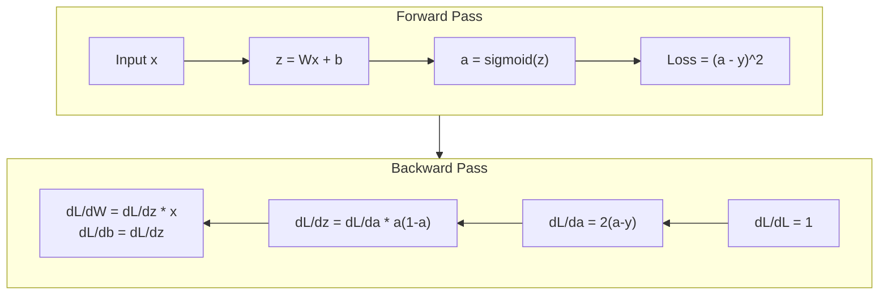

# 从头开始反向传播

> 反向传播算法使学习成为可能。没有它，神经网络只是昂贵的随机数生成器。

**Type:** Build
**Languages:** Python
**Prerequisites:** Lesson 03.02 (Multi-Layer Networks)
**Time:** ~120 minutes

## 学习目标

- 实现一个基于值的自动梯度引擎，它构建一个计算图，并通过拓扑排序计算梯度
- 使用链式法则推导加法，乘法和s型曲线的逆向传递
- 仅使用您从头开始的反向传播引擎，训练XOR和圈分类的多层网络
- 识别深度s型网络中的梯度消失问题，并解释梯度为何呈指数级收缩

## 这个问题

你的网络只有一个隐藏层，有768个输入和3072个输出。也就是2,359,296个重量。它做出了错误的预测。哪个权重导致了错误？单独测试每个重量意味着向前传递230万次。反向传播在一次反向传递中计算所有230万个梯度。这不是最优化。这就是可训练和不可训练的区别。

幼稚的方法是：拿一个重物，轻轻推一下，再向前跑一遍，测量损失是上升还是下降。这就给出了这个权重的梯度。现在对网络中的每个权重都这样做。乘以数千个训练步骤和数百万个数据点。你需要地质时间来训练任何有用的东西。

反向传播解决了这个问题。一次向前通过，一次向后通过，所有的梯度都计算出来了。这个技巧是微积分中的链式法则，系统地应用于计算图。这就是使深度学习变得实用的算法。如果没有它，我们可能还困在玩具问题上。

## 这个概念

### 链式法则在网络中的应用

你们在第01阶段第05课见过链式法则。快速回顾:如果y = f (g (x)),然后dy / dx = f (g (x)) * g的(x)。沿着链乘导数。

在神经网络中，“链”就是从输入到损失的一系列操作。每一层应用权重，添加偏差，通过激活。损失函数将最终输出与目标进行比较。反向传播向后跟踪此链，计算每个操作是如何导致错误的。

### 计算图

每次向前传递都会生成一个图。每个节点都是一个操作（乘法、加法、sigmoid）。每条边都有一个向前的值和一个向后的梯度。

“‘mermaid
图LR
X[“X”]—> mul[“*”]
W[“W”]—> mul
- "z1 = w*x" -> add["+"]
B[“B”]—>添加
Add - "z2 = z1 + b" -> sig["sigmoid"]
sig - "a = sigmoid(z2)" -> loss[" loss "]
Y[“目标”]->亏损
```

Forward pass: values flow left to right. x and w produce z1 = w*x. Add b to get z2. Sigmoid gives activation a. Compare a to target y using the loss function.

Backward pass: gradients flow right to left. Start with dL/da (how loss changes with the activation). Multiply by da/dz2 (sigmoid derivative). That gives dL/dz2. Split into dL/db (which equals dL/dz2, since z2 = z1 + b) and dL/dz1. Then dL/dw = dL/dz1 * x and dL/dx = dL/dz1 * w.

Every node in the graph has one job during the backward pass: take the gradient coming from above, multiply by its local derivative, and pass it down.

### Forward vs Backward



前向传递存储每一个中间值：z， a，每一层的输入。向后传递需要这些存储的值来计算梯度。这是backprop核心的内存计算权衡。你用内存（存储激活）换取速度（一次而不是数百万次）。

### 通过网络的梯度流

对于3层网络，梯度链贯穿每一层：

小“’”
graph理查德‧莱杰特
L黑“Loss”铝——“dL / da3”——> L3传统黑“积3 \ na3 = sigmoid (z3)“铝
l3-- "dl/dz3=dl/da3*sigmoid' (z3)"-- > L2["图层2\na2 = sigmoid(z2)"]
l2-- "dl/dz2=dl/da2*sigmoid' (z2)"-- > l1["layer 1\ na1= sigmoid(z1)"]
L1——“dL / dz1 = dL / da1 * sigmoid’(z1)”——> I黑“投入”铝
```

At each layer, the gradient gets multiplied by the sigmoid derivative. The sigmoid derivative is a * (1 - a), which maxes out at 0.25 (when a = 0.5). Three layers deep, the gradient has been multiplied by at most 0.25^3 = 0.0156. Ten layers deep: 0.25^10 = 0.000001.

### Vanishing Gradients

This is the vanishing gradient problem. Sigmoid squashes its output between 0 and 1. Its derivative is always less than 0.25. Stack enough sigmoid layers and gradients shrink to nothing. Early layers barely learn because they receive near-zero gradients.

```
sigmoid(z)：输出范围[0,1]
sigmoid'(z)：最大值0.25（在z = 0时）

5层后：梯度* 0.25^5 = 0.001x original
10层后：梯度* 0.25^10 = 0.000001x原始
```

This is why deep sigmoid networks are nearly impossible to train. The fix -- ReLU and its variants -- is the subject of Lesson 04. For now, understand that backprop works perfectly. The problem is what it's working through.

### Deriving Gradients for a 2-Layer Network

Concrete math for a network with input x, hidden layer with sigmoid, output layer with sigmoid, and MSE loss.

Forward pass:
```
z1 = W1 * x + b1
A1 = s型（z1）
z2 = W2 * a1 + b2
A2 = s （z2）
L = (a2 - y)^2
```

Backward pass (applying chain rule step by step):
```
dL/da2 = 2（a2 - y）
Da2 /dz2 = a2 * （1 - a2）
dL/dz2 = dL/da2 * da2/dz2 = 2(a2 - y) * a2 * （1 - a2）

dL/dW2 = dL/dz2 * a1
dL/db2 = dL/dz2

dL/da1 = dL/dz2 * W2
da1/dz1 = a1 * (1 - a1)
dL/dz1 = dL/da1 * da1/dz1

dL/dW1 = dL/dz1 * x
dL/db1 = dL/dz1
```

Every gradient is a product of local derivatives traced back from the loss. That's all backpropagation is.

## Build It

### Step 1: The Value Node

Every number in our computation becomes a Value. It stores its data, its gradient, and how it was created (so it knows how to compute gradients backward).

```python
class Value:
    def __init__(self, data, children=(), op=''):
        self.data = data
        self.grad = 0.0
        self._backward = lambda: None
        self._children = set(children)
        self._op = op

    def __repr__(self):
        return f"Value(data={self.data:.4f}, grad={self.grad:.4f})"
```

还没有渐变（0.0）。还没有反向函数（No -op）。The

### 步骤2：使用反向函数的操作

每个操作都会创建一个新的Value，并def 梯度如何通过它向后流动。

”“python
Def __add__(self, other)：
if isinstance(other, Value) else Value（other）
out = Value(self。数据+其他。Data, (self, other), '+')

def _backward ():
自我。Grad += out.grad
其他。Grad += out.grad

出去了。_backward = _backward
返回了

Def __mul__(self, other)：
if isinstance(other, Value) else Value（other）
out = Value(self。数据*其他。Data, (self, other), '*')

def _backward ():
自我。Grad += other。数据*输出
其他。Grad += self。数据*输出

出去了。_backward = _backward
返回了
```

For addition: d(a+b)/da = 1, d(a+b)/db = 1. So both inputs get the output's gradient directly.

For multiplication: d(a*b)/da = b, d(a*b)/db = a. Each input gets the other's value times the output gradient.

The `+=` is critical. A Value might be used in multiple operations. Its gradient is the sum of gradients from all paths.

### Step 3: Sigmoid and Loss

```python
import math

def sigmoid(self):
    x = self.data
    x = max(-500, min(500, x))
    s = 1.0 / (1.0 + math.exp(-x))
    out = Value(s, (self,), 'sigmoid')

    def _backward():
        self.grad += (s * (1 - s)) * out.grad

    out._backward = _backward
    return out
```

Sigmoid导数：Sigmoid (x) * (1 - Sigmoid (x))。我们计算sigmoid(x) = s。重用它。没有额外的工作。

”“python
Def mse_loss(expected, target)：
diff =预测值+值（-目标）
返回diff * diff
```

MSE for a single output: (predicted - target)^2. We express subtraction as addition with a negated Value.

### Step 4: Backward Pass

Topological sort ensures we process nodes in the right order -- a node's gradient is fully accumulated before we propagate through it.

```python
def backward(self):
    topo = []
    visited = set()

    def build_topo(v):
        if v not in visited:
            visited.add(v)
            for child in v._children:
                build_topo(child)
            topo.append(v)

    build_topo(self)
    self.grad = 1.0
    for v in reversed(topo):
        v._backward()
```

从损失开始（梯度= 1.0，因为dL/dL = 1）。向后遍历排序后的图。每个节点

### 第五步：图层和网络

”“python
进口随机

类神经元:
Def __init__(self, n_inputs)：
比例= (2.0 / n_inputs) ** 0.5
自我。weights = [Value（随机）。Uniform (-scale, scale)) for _in range(n_inputs)]
自我。bias = Value（0.0）

Def __call__(self, x)：
Act = sum(（wi * xi for wi, xi in zip）权重，x)), self。bias)
返回act.sigmoid ()

def参数(自我):
回归自我。权重+ [self.bias]


类层:
Def __init__(self, n_inputs, n_outputs)：
自我。神经元=[神经元（n_inputs） for _in range(n_outputs)]

Def __call__(self, x)：
Out = [n(x) for n in self.neurons]
如果len(out) == 1，则返回[0]

def参数(自我):
参数= []
对于self。neurons中的n：
params.extend (n.parameters ())
返回参数


类网络:
Def __init__(self, sizes)：
自我。图层= []
对于I在range（len(sizes) - 1）中：
self.layers。append（图层（size [i], size [i + 1]））

Def __call__(self, x)：
对于self.layers中的layer：
X = layer(X)
如果不是isinstance(x, list)：
X = [X]
如果len(x) == 1，则返回x[0]

def参数(自我):
参数= []
对于self.layers中的layer：
params.extend (layer.parameters ())
返回参数

def zero_grad(自我):
对于self.parameters（）中的p：
P.grad = 0.0
```

A Neuron takes inputs, computes weighted sum + bias, and applies sigmoid. Weight initialization scales by sqrt(2/n_inputs) to prevent sigmoid saturation in deeper networks. A Layer is a list of Neurons. A Network is a list of Layers. The `parameters()` method collects all learnable Values so we can update them.

### Step 6: Train on XOR

```python
random.seed(42)
net = Network([2, 4, 1])

xor_data = [
    ([0.0, 0.0], 0.0),
    ([0.0, 1.0], 1.0),
    ([1.0, 0.0], 1.0),
    ([1.0, 1.0], 0.0),
]

learning_rate = 1.0

for epoch in range(1000):
    total_loss = Value(0.0)
    for inputs, target in xor_data:
        x = [Value(i) for i in inputs]
        pred = net(x)
        loss = mse_loss(pred, target)
        total_loss = total_loss + loss

    net.zero_grad()
    total_loss.backward()

    for p in net.parameters():
        p.data -= learning_rate * p.grad

    if epoch % 100 == 0:
        print(f"Epoch {epoch:4d} | Loss: {total_loss.data:.6f}")

print("\nXOR Results:")
for inputs, target in xor_data:
    x = [Value(i) for i in inputs]
    pred = net(x)
    print(f"  {inputs} -> {pred.data:.4f} (expected {target})")
```

看着损失减少。从随机预测到正确的异或输出，完全由反向传播计算梯度和在正确方向上轻推权重驱动。

### 步骤7：圆圈分类

在第02课中，你手动调整了圆分类的权重。现在让网络学习它们。

”“python
random.seed (7)

def generate_circle_data (n = 100):
数据= []
对于范围(n)中的_：
X1 = random.uniform（-1.5, 1.5）
X2 = random.uniform（-1.5, 1.5）
标签= 1.0如果x1 * x1 + x2 * x2 < 1.0否则0.0
数据。Append （([x1, x2], label)）
返回数据

Circle_data = generate_circle_data（80）

circle_net = Network（[2,8,1]）
Learning_rate = 0.5

对于范围（2000）内的epoch：
random.shuffle (circle_data)
Total_loss_val = 0.0
对于输入，target在circle_data中：
x =[输入中i的值(i)]
d = circle_net(x)
Loss = mse_loss（pred, target）
circle_net.zero_grad ()
loss.backward ()
对于circle_net.parameters（）中的p：
P.data -= learning_rate * p.grad
Total_loss_val += loss.data

如果epoch % 200 == 0：
正确= 0
对于输入，target在circle_data中：
x =[输入中i的值(i)]
d = circle_net(x)
Predicted_class = 1.0 if pred。数据> 0.5 else 0.0
如果predicted_class == target：
正确+= 1
Accuracy = correct / len(circle_data) * 100
print(f"Epoch {Epoch:4d} |丢失：{total_loss_val：。4f} |精度：{精度：.1f}%")
```

We use online SGD here -- update weights after each sample instead of accumulating the full batch. This breaks symmetry faster and avoids sigmoid saturation on the full loss landscape. Shuffling the data each epoch prevents the network from memorizing the order.

No hand-tuning. The network discovers the circular decision boundary on its own. That's the power of backpropagation: you define the architecture, the loss function, and the data. The algorithm figures out the weights.

## Use It

PyTorch does everything above in a few lines. The core idea is identical -- autograd builds a computational graph during the forward pass and traces it backward to compute gradients.

```python
import torch
import torch.nn as nn

model = nn.Sequential(
    nn.Linear(2, 4),
    nn.Sigmoid(),
    nn.Linear(4, 1),
    nn.Sigmoid(),
)
optimizer = torch.optim.SGD(model.parameters(), lr=1.0)
criterion = nn.MSELoss()

X = torch.tensor([[0,0],[0,1],[1,0],[1,1]], dtype=torch.float32)
y = torch.tensor([[0],[1],[1],[0]], dtype=torch.float32)

for epoch in range(1000):
    pred = model(X)
    loss = criterion(pred, y)
    optimizer.zero_grad()
    loss.backward()
    optimizer.step()

print("PyTorch XOR Results:")
with torch.no_grad():
    for i in range(4):
        pred = model(X[i])
        print(f"  {X[i].tolist()} -> {pred.item():.4f} (expected {y[i].item()})")
```

`optimizer.step()` is your manual `p.data -= lr * p.grad`. `optimizer.zero_grad()` is your `net.zero_grad()`. 相同的算法，工业强度的实现。PyTorch处理GPU加速，混合精度，梯度检查点和数百层类型。但逆向传递是将相同的链式法则应用于相同的计算图。

训练是向前传球，然后向后传球，然后更新权重。推断只运行向前传递。没有渐变，没有更新。这种区别很重要，因为推理是在生产中发生的事情。当您调用像Claude或GPT这样的API时，您正在运行推理—您的提示通过网络向前流动，令牌从另一端出来。没有重量变化。理解反向支撑很重要，因为它塑造了这个网络中的每一个权重。

## 船这

这一课产生：
- 

## 练习

1. 添加一个然后实现通过与（a - b）^2等简单表达式的人工计算进行比较，验证梯度是否正确。

2. 添加一个将隐藏层中的sigmoid替换为relu，并再次进行XOR训练。比较收敛速度。你应该看到更快的训练——这是第04课的预习。

3. 实现a用它来代替验证梯度匹配原始实现。

4. 添加梯度剪辑到训练循环：调用后训练一个更深层的网络（4层以上的s形网络），比较有裁剪和没有裁剪的损失曲线。这是你对爆炸梯度的第一个防御。

5. 构建可视化：在异或训练后，打印出网络中每个参数的梯度。确定哪一层的梯度最小。这演示了您在概念部分中读到的梯度消失问题。

## 关键术语

| Term | What people say | What it actually means |
|------|----------------|----------------------|
| Backpropagation | "The network learns" | An algorithm that computes dL/dw for every weight by applying the chain rule backward through the computational graph |
| Computational graph | "The network structure" | A directed acyclic graph where nodes are operations and edges carry values (forward) and gradients (backward) |
| Chain rule | "Multiply the derivatives" | If y = f(g(x)), then dy/dx = f'(g(x)) * g'(x) -- the mathematical foundation of backpropagation |
| Gradient | "The direction of steepest ascent" | The partial derivative of the loss with respect to a parameter -- tells you how to change that parameter to reduce the loss |
| Vanishing gradient | "Deep networks don't learn" | Gradients shrink exponentially as they propagate through layers with saturating activations like sigmoid |
| Forward pass | "Running the network" | Computing the output from inputs by sequentially applying each layer's operations and storing intermediate values |
| Backward pass | "Computing gradients" | Traversing the computational graph in reverse, accumulating gradients at each node using the chain rule |
| Learning rate | "How fast it learns" | A scalar that controls the step size when updating weights: w_new = w_old - lr * gradient |
| Topological sort | "The right order" | An ordering of graph nodes where each node appears after all nodes it depends on -- ensures gradients are fully accumulated before propagation |
| Autograd | "Automatic differentiation" | A system that builds computational graphs during forward computation and automatically computes gradients -- what PyTorch's engine does |

## 进一步的阅读

- Rumelhart, Hinton & Williams，“通过反向传播错误学习表征”（1986）——这篇论文使反向传播成为主流，解开了多层网络训练的难题
- 3Blue1Brown，“神经网络”系列（https://www.youtube.com/playlist?list=PLZHQObOWTQDNU6R1_67000Dx_ZCJB-3pi）——通过网络反向传播和梯度流的最佳视觉解释