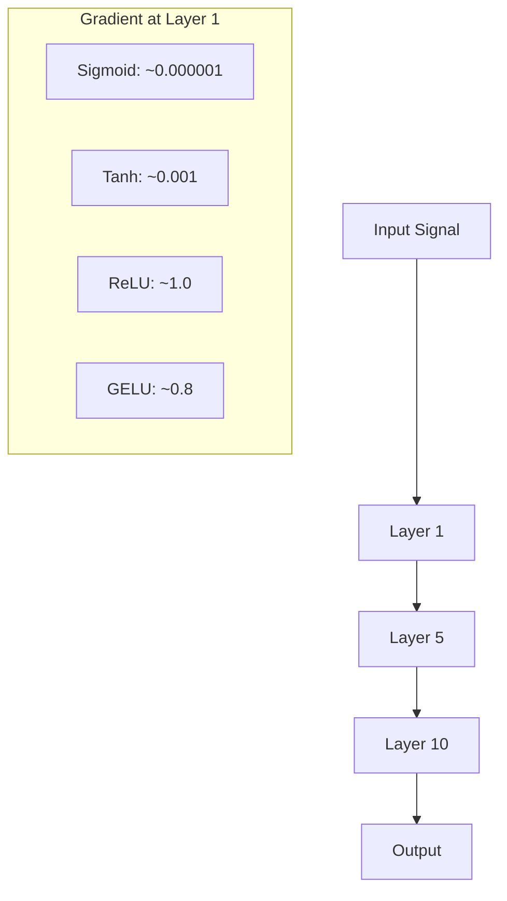

# 激活函数

> 如果没有非线性，你的100层网络就是一个花哨的矩阵乘法。激活是让神经网络以曲线方式思考的门。

**Type:** Build
**Languages:** Python
**Prerequisites:** Lesson 03.03 (Backpropagation)
**Time:** ~75 minutes

## 学习目标

- 从头开始实现sigmoid、tanh、ReLU、Leaky ReLU、GELU、Swish和softmax及其导数
- 通过测量10多个不同激活层的激活强度来诊断梯度消失问题
- 检测ReLU网络中的死亡神经元，并解释为什么GELU避免了这种故障模式
- 为给定的体系结构（Transformer、CNN、RNN、输出层）选择正确的激活函数

## 这个问题


这不是一个理论上的奇闻。这意味着深度线性网络无法学习异或，无法对螺旋数据集进行分类，无法识别人脸。没有激活函数，深度是一种错觉。

激活函数打破了线性。它们通过非线性函数扭曲每层的输出，使网络具有弯曲决策边界、近似任意函数和实际学习的能力。但是选择了错误的激活，你的梯度就会消失到零（深度网络中的s形），爆炸到无穷大（没有仔细初始化的无界激活），或者你的神经元永久死亡（具有大负偏差的ReLU）。激活函数的选择直接决定了你的网络是否学习。

## 

### 为什么非线性是必要的

矩阵乘法是可组合的。将向量乘以矩阵a，然后乘以矩阵B与乘以AB相同。这意味着堆叠10个线性层在数学上相当于一个线性层与一个大矩阵。所有的参数，所有的深度，都白费了。你需要一些东西来打破链条。这就是激活函数的作用。

这就是证据。线性层计算f(x) = Wx + b。

```
Layer 1: h = W1 * x + b1
Layer 2: y = W2 * h + b2
```

替代:

```
y = W2 * (W1 * x + b1) + b2
y = (W2 * W1) * x + (W2 * b1 + b2)
y = A * x + c
```

一层。在层之间插入一个非线性激活函数g()：

```
h = g(W1 * x + b1)
y = W2 * h + b2
```


### 

原始的神经网络激活函数。

```
sigmoid(x) = 1 / (1 + e^(-x))
```

输出范围：（0,1）。光滑的，可微的，将任何实数映射到一个类概率值。


```
sigmoid'(x) = sigmoid(x) * (1 - sigmoid(x))
```


```
0.25^10 = 0.000000953674
```


附加问题：sigmoid输出总是正的（0到1），这意味着权重的梯度总是相同的符号。这导致在梯度下降过程中出现之字形。

### 

s形的居中版本。

```
tanh(x) = (e^x - e^(-x)) / (e^x + e^(-x))
```


导数:

```
tanh'(x) = 1 - tanh(x)^2
```

x = 0处的最大导数是1.0——比sigmoid好4倍。但梯度消失问题仍然存在。对于大的正或负输入，导数趋于零。十层仍然会压碎坡度，只是力度小了些。

### 

线性整流函数。2010年，Nair和Hinton在深度学习领域推广了它（该函数本身可以追溯到福岛1969年的工作），它改变了一切。

```
relu(x) = max(0, x)
```

输出范围：[0，无穷大]。导数非常简单：

```
relu'(x) = 1  if x > 0
            0  if x <= 0
```

对于正输入没有消失梯度。梯度正好是1，直接穿过。这就是为什么深度网络变得可训练——ReLU保留了各层之间的梯度大小。

但这里有一种失效模式：死神经元问题。如果一个神经元的加权输入总是负的（由于一个大的负偏置或不幸的权重初始化），它的输出总是零，它的梯度总是零，它永远不会更新。它是永久死亡的。实际上，ReLU网络中10-40%的神经元会在训练过程中死亡。

### 漏水的ReLU

这是修复死亡神经元最简单的方法。

```
leaky_relu(x) = x        if x > 0
                alpha * x if x <= 0
```

alpha是一个很小的常数，通常是0.01。负侧有一个小的斜率，而不是零，所以死亡的神经元仍然得到一个梯度信号，可以恢复。

### GELU：现代违约

高斯误差线性单位。hendricks和Gimpel于2016年推出。BERT、GPT和大多数现代Transformer中的默认激活。

```
gelu(x) = x * Phi(x)
```


```
gelu(x) ~= 0.5 * x * (1 + tanh(sqrt(2/pi) * (x + 0.044715 * x^3)))
```

GELU在任何地方都是平滑的，允许小的负值（不像ReLU，它会硬固定到零），并且有一个概率解释：它根据在高斯分布下为正的可能性来对每个输入进行加权。这种平滑门控在Transformer架构中优于ReLU，因为它提供了更好的梯度流，并完全避免了死神经元问题。

### 


```
swish(x) = x * sigmoid(x)
```

Swish的形式是x * sigmoid(x)。谷歌通过激活函数空间的自动搜索发现了它——一个设计神经网络部分的神经网络。


### 

不用于隐藏层。Softmax将原始分数（logits）的矢量转换为概率分布。

```
softmax(x_i) = e^(x_i) / sum(e^(x_j) for all j)
```


### 形状比较


```

### Gradient Flow Comparison



### 

“‘mermaid
流程图TD
开始问：“你在做什么？”—> Hidden{“Hidden layers<br/>or output?”｝


Arch - b> |“Transformer/ NLP”| GELU[“使用GELU”]
Arch - b> |“CNN / Vision”| ReLU[“使用ReLU或Swish”]
Arch ->|"RNN / LSTM"| Tanh["Use Tanh"]
Arch - b> |"Simple MLP"| ReLU2["Use ReLU"]


```

## Build It

### Step 1: Implement All Activation Functions with Derivatives

Each function takes a single float and returns a float. Each derivative function takes the same input and returns the gradient.

```python
import math

def sigmoid(x):
    x = max(-500, min(500, x))
    return 1.0 / (1.0 + math.exp(-x))

def sigmoid_derivative(x):
    s = sigmoid(x)
    return s * (1 - s)

def tanh_act(x):
    return math.tanh(x)

def tanh_derivative(x):
    t = math.tanh(x)
    return 1 - t * t

def relu(x):
    return max(0.0, x)

def relu_derivative(x):
    return 1.0 if x > 0 else 0.0

def leaky_relu(x, alpha=0.01):
    return x if x > 0 else alpha * x

def leaky_relu_derivative(x, alpha=0.01):
    return 1.0 if x > 0 else alpha

def gelu(x):
    return 0.5 * x * (1 + math.tanh(math.sqrt(2 / math.pi) * (x + 0.044715 * x ** 3)))

def gelu_derivative(x):
    phi = 0.5 * (1 + math.erf(x / math.sqrt(2)))
    pdf = math.exp(-0.5 * x * x) / math.sqrt(2 * math.pi)
    return phi + x * pdf

def swish(x):
    return x * sigmoid(x)

def swish_derivative(x):
    s = sigmoid(x)
    return s + x * s * (1 - s)

def softmax(xs):
    max_x = max(xs)
    exps = [math.exp(x - max_x) for x in xs]
    total = sum(exps)
    return [e / total for e in exps]
```

### 步骤2：可视化渐变消失的地方


gradient_scan(乙状结肠,sigmoid_derivative)
gradient_scan(“双曲正切”,tanh_derivative)
relu_derivative gradient_scan(“ReLU”)
gradient_scan（“Leaky ReLU”，leaky_relu_derivative）
gelu_derivative gradient_scan(“GELU”)
gradient_scan(“时髦的”,swish_derivative)
```

### Step 3: Vanishing Gradient Experiment

Forward-pass a signal through N layers using sigmoid vs ReLU. Measure how the activation magnitude changes.

```python
import random

def vanishing_gradient_experiment(activation_fn, name, n_layers=10, n_inputs=5):
    random.seed(42)
    values = [random.gauss(0, 1) for _ in range(n_inputs)]

    print(f"\n{name} through {n_layers} layers:")
    for layer in range(n_layers):
        weights = [random.gauss(0, 1) for _ in range(n_inputs)]
        z = sum(w * v for w, v in zip(weights, values))
        activated = activation_fn(z)
        magnitude = abs(activated)
        bar = "#" * int(magnitude * 20)
        print(f"  Layer {layer+1:2d}: magnitude = {magnitude:.6f} {bar}")
        values = [activated] * n_inputs

vanishing_gradient_experiment(sigmoid, "Sigmoid")
vanishing_gradient_experiment(relu, "ReLU")
vanishing_gradient_experiment(gelu, "GELU")
```

### 

Create a ReLU network, pass random inputs through it, count how many neurons never fire.


Fire_counts = [0] * hidden_size


Dead = sum（1 for c in fire_counts如果c == 0）
Rarely_fire = sum（1 for c in fire_counts if 0 < c < n_samples * 0.05）
健康= hidden_size - dead - rarely_fire

print（f"\nDead Neuron Report ({hidden_size} neurons, {n_samples} samples):"）
print（f" Dead (never fired): {Dead}"）
print（f" Barely alive (<5%): {rarely_fire}"）
打印（f“健康：{健康}”）
print（f“死亡神经元率：{Dead /hidden_size*100:.1f}%”）


dead_neuron_detector ()
```

### Step 5: Training Comparison -- Sigmoid vs ReLU vs GELU

Train the same two-layer network on the circle dataset (points inside a circle = class 1, outside = class 0) with three different activations. Compare convergence speed.

```python
def make_circle_data(n=200, seed=42):
    random.seed(seed)
    data = []
    for _ in range(n):
        x = random.uniform(-2, 2)
        y = random.uniform(-2, 2)
        label = 1.0 if x * x + y * y < 1.5 else 0.0
        data.append(([x, y], label))
    return data


class ActivationNetwork:
    def __init__(self, activation_fn, activation_deriv, hidden_size=8, lr=0.1):
        random.seed(0)
        self.act = activation_fn
        self.act_d = activation_deriv
        self.lr = lr
        self.hidden_size = hidden_size

        self.w1 = [[random.gauss(0, 0.5) for _ in range(2)] for _ in range(hidden_size)]
        self.b1 = [0.0] * hidden_size
        self.w2 = [random.gauss(0, 0.5) for _ in range(hidden_size)]
        self.b2 = 0.0

    def forward(self, x):
        self.x = x
        self.z1 = []
        self.h = []
        for i in range(self.hidden_size):
            z = self.w1[i][0] * x[0] + self.w1[i][1] * x[1] + self.b1[i]
            self.z1.append(z)
            self.h.append(self.act(z))

        self.z2 = sum(self.w2[i] * self.h[i] for i in range(self.hidden_size)) + self.b2
        self.out = sigmoid(self.z2)
        return self.out

    def backward(self, target):
        error = self.out - target
        d_out = error * self.out * (1 - self.out)

        for i in range(self.hidden_size):
            d_h = d_out * self.w2[i] * self.act_d(self.z1[i])
            self.w2[i] -= self.lr * d_out * self.h[i]
            for j in range(2):
                self.w1[i][j] -= self.lr * d_h * self.x[j]
            self.b1[i] -= self.lr * d_h
        self.b2 -= self.lr * d_out

    def train(self, data, epochs=200):
        losses = []
        for epoch in range(epochs):
            total_loss = 0
            correct = 0
            for x, y in data:
                pred = self.forward(x)
                self.backward(y)
                total_loss += (pred - y) ** 2
                if (pred >= 0.5) == (y >= 0.5):
                    correct += 1
            avg_loss = total_loss / len(data)
            accuracy = correct / len(data) * 100
            losses.append(avg_loss)
            if epoch % 50 == 0 or epoch == epochs - 1:
                print(f"    Epoch {epoch:3d}: loss={avg_loss:.4f}, accuracy={accuracy:.1f}%")
        return losses


data = make_circle_data()

configs = [
    ("Sigmoid", sigmoid, sigmoid_derivative),
    ("ReLU", relu, relu_derivative),
    ("GELU", gelu, gelu_derivative),
]

results = {}
for name, act_fn, act_d_fn in configs:
    print(f"\n=== Training with {name} ===")
    net = ActivationNetwork(act_fn, act_d_fn, hidden_size=8, lr=0.1)
    losses = net.train(data, epochs=200)
    results[name] = losses

print("\n=== Final Loss Comparison ===")
for name, losses in results.items():
    print(f"  {name:10s}: start={losses[0]:.4f} -> end={losses[-1]:.4f} (improvement: {(1 - losses[-1]/losses[0])*100:.1f}%)")
```

## Use It

PyTorch提供了所有这些函数和模块形式：

”“python
进口火炬
进口火炬。Nn as Nn
进口火炬。n.功能为F


relu_out = F.relu(x)
gelu_out = F.gelu(x)
Sigmoid_out = torch.sigmoid(x)
swish_out = F.silu(x)

火把=火把。(4) 5、randn
probs = F.softmax（logits, dim=1）

model = nn。顺序(
(nn)。Linear(64)、10
(nn)。革魯(),
(nn)。Linear(64、32)
(nn)。革魯(),
(nn)。(Linear, 32 (5),
）
```

Hidden layers in a transformer: GELU. Hidden layers in a CNN: ReLU. Output layer for classification: softmax. Output layer for regression: none (linear). Output layer for probabilities: sigmoid. That's it. Start with these defaults. Change them only when you have evidence.

RNNs and LSTMs use tanh for hidden state and sigmoid for gates, but if you're building from scratch today, you're probably not using RNNs. If neurons are dying in your ReLU network, switch to GELU. Don't reach for Leaky ReLU unless you have a specific reason -- GELU solves the dead neuron problem and gives better gradient flow.

## Ship It

This lesson produces:
- `outputs/prompt-activation-selector.md` -- a reusable prompt that helps you pick the right activation function for any architecture

## Exercises

1. Implement Parametric ReLU (PReLU) where the negative slope alpha is a learnable parameter. Train it on the circle dataset and compare to fixed Leaky ReLU.

2. Run the vanishing gradient experiment with 50 layers instead of 10. Plot the magnitude at each layer for sigmoid, tanh, ReLU, and GELU. At which layer does each activation's signal effectively reach zero?

3. Implement the ELU (Exponential Linear Unit): elu(x) = x if x > 0, alpha * (e^x - 1) if x <= 0. Compare its dead neuron rate to ReLU on the same network.

4. Build a "gradient health monitor" that runs during training: at each epoch, compute the average gradient magnitude at each layer. Print a warning when any layer's gradient drops below 0.001 or exceeds 100.

5. Modify the training comparison to use the XOR dataset from Lesson 01 instead of circles. Which activation converges fastest on XOR? Why does this differ from the circle results?

## Key Terms

| Term | What people say | What it actually means |
|------|----------------|----------------------|
| Activation function | "The nonlinear part" | A function applied to each neuron's output that breaks linearity, enabling the network to learn nonlinear mappings |
| Vanishing gradient | "Gradients disappear in deep networks" | Gradients shrink exponentially through layers when the activation's derivative is less than 1, making early layers untrainable |
| Exploding gradient | "Gradients blow up" | Gradients grow exponentially through layers when the effective multiplier exceeds 1, causing unstable training |
| Dead neuron | "A neuron that stopped learning" | A ReLU neuron whose input is permanently negative, producing zero output and zero gradient |
| Sigmoid | "Squishes values to 0-1" | The logistic function 1/(1+e^-x), historically important but causes vanishing gradients in deep networks |
| ReLU | "Clips negatives to zero" | max(0, x) -- the activation that made deep learning practical by preserving gradient magnitude |
| GELU | "The transformer activation" | Gaussian Error Linear Unit, a smooth activation that weights inputs by their probability of being positive |
| Swish/SiLU | "Self-gated ReLU" | x * sigmoid(x), discovered through automated search, used in EfficientNet |
| Softmax | "Turns scores into probabilities" | Normalizes a vector of logits into a probability distribution where all values are in (0,1) and sum to 1 |
| Leaky ReLU | "ReLU that doesn't die" | max(alpha*x, x) where alpha is small (0.01), preventing dead neurons by allowing small negative gradients |
| Saturation | "The flat part of sigmoid" | Regions where an activation's derivative approaches zero, blocking gradient flow |
| Logit | "The raw score before softmax" | The unnormalized output of the final layer before applying softmax or sigmoid |

## Further Reading

- Nair & Hinton, "Rectified Linear Units Improve Restricted Boltzmann Machines" (2010) -- the paper that introduced ReLU and enabled training of deep networks
- Hendrycks & Gimpel, "Gaussian Error Linear Units (GELUs)" (2016) -- introduced the activation function that became the default for transformers
- Ramachandran et al., "Searching for Activation Functions" (2017) -- used automated search to discover Swish, showing that activation design can be automated
- Glorot & Bengio, "Understanding the difficulty of training deep feedforward neural networks" (2010) -- the paper that diagnosed vanishing/exploding gradients and proposed Xavier initialization
- Goodfellow, Bengio, Courville, "Deep Learning" Chapter 6.3 (https://www.deeplearningbook.org/) -- rigorous treatment of hidden units and activation functions