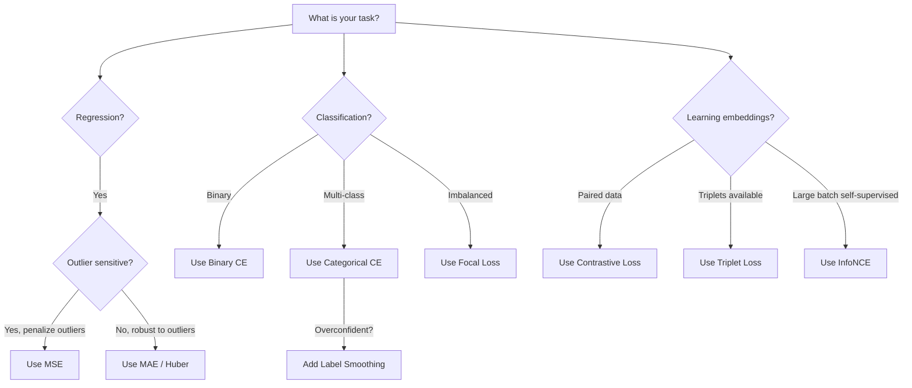

# 损失函数

> 你的网络会做出预测。事实并非如此。错到什么程度？这个数字就是损失。选择了错误的损失函数，你的模型就会完全针对错误的对象进行优化。

**Type:** Build
**Languages:** Python
**Prerequisites:** Lesson 03.04 (Activation Functions)
**Time:** ~75 minutes

## 学习目标

- 用梯度从头开始实现MSE、二元交叉熵、分类交叉熵和对比损失（InfoNCE）
- 通过演示“预测一切为0.5”故障模式，解释MSE分类失败的原因
- 将标签平滑应用于交叉熵，并描述它如何防止过度自信的预测
- 为回归、二元分类、多类分类和嵌入学习任务选择正确的损失函数

## 问题是

最小化分类问题的MSE的模型将自信地预测所有问题的MSE为0.5。这是最小化损失。它也是无用的。

z92xa7es8afbw6hc1ym5

这里有一个具体的例子。你有一个二元分类任务。两个班，五五开。你使用MSE作为你的损失。该模型预测每个输入值为0.5。平均MSE为0.25，这是在没有实际学习任何东西的情况下可能出现的最小值。这个模型没有判别能力但它在技术上最小化了你的损失函数。切换到交叉熵，同样的模型被迫将预测推向0或1，因为-log(0.5) = 0.693是一个可怕的损失，而-log(0.99) = 0.01奖励自信的正确预测。损失函数的选择是学习模型和博弈度量模型之间的区别。

更糟的是。在自我监督学习中，你甚至不需要标签。对比损失完全定义了学习信号：什么是相似的，什么是不同的，以及模型应该在多大程度上将它们分开。如果对比损失错误，你的嵌入就会崩溃成一个单点——每个输入都映射到同一个向量。技术上来说是零损失。完全不值。

## 这个概念

### byz1i284ub5lurc1cp7n

0i51vr44y5k8xv6tk5x7

```
MSE = (1/n) * sum((y_pred - y_true)^2)
```

为什么平方很重要：它以二次方式惩罚较大的错误。错误2的代价是错误1的4倍。10个错误的代价是100倍。这使得MSE对异常值非常敏感——一个严重错误的预测主宰了损失。

1l9iwucj688bi6ljdqsg

4ms3jcqfxyqpkqu8ln2e

```
dMSE/dy_pred = (2/n) * (y_pred - y_true)
```

误差是线性的。误差越大，梯度越大。这是回归的一个特性（大的错误需要大的修正），也是分类的一个bug（你想要以指数方式惩罚自信的错误答案，而不是线性的）。

### nflc4uoemf9yvimwitbx

sb2ktib16xqaygie572b

**二进制交叉熵（BCE）：**

```
BCE = -(y * log(p) + (1 - y) * log(1 - p))
```

其中y是真实的标签（0或1）p是预测的概率。

为什么-log(p)有效：当真实标签为1并且预测p = 0.99时，损失是-log(0.99) = 0.01。当您预测p = 0.01时，损失是-log(0.01) = 4.6。这460倍的差别就是交叉熵起作用的原因。它残酷地惩罚自信的错误预测，而几乎不惩罚自信的正确预测。

ucyf0r20l7hktyvemlw9

```
dBCE/dp = -(y/p) + (1-y)/(1-p)
```

当y = 1且p接近于0时，梯度为-1/p，趋于负无穷。模型得到一个巨大的信号来修正它的错误。当p接近1时，梯度很小。已经正确了，没有什么需要修正的。

*qqzl3ha2seoex06q91ee

86mxsp8bs0hfne3a3dac

```
CCE = -sum(y_i * log(p_i))
```

pafgg282stngn1ot0enm

### 为什么MSE分类失败

49c2nuh07yr5dm1m4cj0


```

MSE gradients flatten when predictions are near 0 or 1 (due to sigmoid saturation). Cross-entropy gradients compensate for this -- the -log cancels the sigmoid's flat regions, giving strong gradients exactly where they are needed most.

### Label Smoothing

Standard one-hot labels say "this is 100% class 3 and 0% everything else." That's a strong claim. Label smoothing softens it:

```
r2jevnr6pnsn9tyq3fwc
```

With alpha = 0.1 and 10 classes: instead of [0, 0, 1, 0, ...], the target becomes [0.01, 0.01, 0.91, 0.01, ...]. The model targets 0.91 instead of 1.0.

Why this works: a model trying to output exactly 1.0 through a softmax needs to push logits to infinity. This causes overconfidence, hurts generalization, and makes the model brittle to distribution shift. Label smoothing caps the target at 0.9 (with alpha=0.1), keeping logits in a reasonable range. GPT and most modern models use label smoothing or its equivalent.

### Contrastive Loss

No labels. No classes. Just pairs of inputs and the question: are these similar or different?

**SimCLR-style contrastive loss (NT-Xent / InfoNCE):**

Take one image. Create two augmented views of it (crop, rotate, color jitter). These are the "positive pair" -- they should have similar embeddings. Every other image in the batch forms a "negative pair" -- they should have different embeddings.

```
L = -log(exp(sim(z_i, z_j) / tau) / sum(exp(sim(z_i, z_k) / tau)))
```

Where sim() is cosine similarity, z_i and z_j are the positive pair, the sum is over all negatives, and tau (temperature) controls how sharp the distribution is. Lower temperature = harder negatives = more aggressive separation.

Real numbers: batch size 256 means 255 negatives per positive pair. Temperature tau = 0.07 (SimCLR default). The loss looks like a softmax over similarities -- it wants the positive pair's similarity to be highest among all 256 options.

**Triplet Loss:**

Takes three inputs: anchor, positive (same class), negative (different class).

```
3izexomt7vfx0xcyzvgr
```

The margin (typically 0.2-1.0) enforces a minimum gap between positive and negative distances. If the negative is already far enough away, the loss is zero -- no gradient, no update. This makes training efficient but requires careful triplet mining (choosing hard negatives that are close to the anchor).

### Focal Loss

For imbalanced datasets. Standard cross-entropy treats all correctly classified examples equally. Focal loss down-weights easy examples:

```
FL = - α * (1 - p_t)^ γ * log（p_t）
```

Where p_t is the predicted probability of the true class and gamma controls the focusing. With gamma = 0, this is standard cross-entropy. With gamma = 2 (the default):

- Easy example (p_t = 0.9): weight = (0.1)^2 = 0.01. Effectively ignored.
- Hard example (p_t = 0.1): weight = (0.9)^2 = 0.81. Full gradient signal.

Focal loss was introduced by Lin et al. for object detection, where 99% of candidate regions are background (easy negatives). Without focal loss, the model drowns in easy background examples and never learns to detect objects. With it, the model focuses its capacity on the hard, ambiguous cases that matter.

### Loss Function Decision Tree



### 损失景观

“‘美人鱼
图LR
子图“损失面形状”
MSE_S[“MSE<br/>平滑抛物线<br/>单个最小值<br/>易于优化”]
CE_S[“交叉熵<br/>错误答案附近陡<br/>正确答案附近平<br/>需要时有强梯度”]
CL_S[“对比<br/>许多局部最小值<br/>取决于批组成<br/>温度控制清晰度”]
结束
MSE_S ->|"Best for"| Reg2["Regression"]
CE_S ->|"Best for"| Cls2["Classification"]
CL_S—>|“最适合”| Emb2[“表征学习”]
```

## Build It

### Step 1: MSE and Its Gradient

```python
def mse(predictions, targets):
    n = len(predictions)
    total = 0.0
    for p, t in zip(predictions, targets):
        total += (p - t) ** 2
    return total / n

def mse_gradient(predictions, targets):
    n = len(predictions)
    grads = []
    for p, t in zip(predictions, targets):
        grads.append(2.0 * (p - t) / n)
    return grads
```

### 步骤2：二元交叉熵

uu3kgfslv9c95iy92gr7

hnc4m297mxnsc1jc6jl1


Def binary_cross_entropy（预测，目标，eps=1e-15）：
N = len（预测）
合计= 0.0
对于p， t在zip（预测，目标）：
P_clipped = max（eps, min(1 - eps, p)）
Total += -(t * math.log(p_clipped) + （1 - t) * math.log(1 - p_clipped)）
返回总数/ n

Def bce_gradient（预测，目标，eps=1e-15）：
毕业生= []
对于p， t在zip（预测，目标）：
P_clipped = max（eps, min(1 - eps, p)）
毕业生。追加(- (t / p_clipped) + (1 - t) / (1 - p_clipped))
返回毕业生
```

### Step 3: Categorical Cross-Entropy with Softmax

Softmax converts raw logits to probabilities. Then we compute the cross-entropy against one-hot targets.

```python
def softmax(logits):
    max_val = max(logits)
    exps = [math.exp(x - max_val) for x in logits]
    total = sum(exps)
    return [e / total for e in exps]

def categorical_cross_entropy(logits, target_index, eps=1e-15):
    probs = softmax(logits)
    p = max(eps, probs[target_index])
    return -math.log(p)

def cce_gradient(logits, target_index):
    probs = softmax(logits)
    grads = list(probs)
    grads[target_index] -= 1.0
    return grads
```

softmax +交叉熵的梯度简化得很漂亮：对于真正的类，它只是（预测概率- 1），对于所有其他类，它只是（预测概率）。这种优雅的简化并不是巧合——这就是为什么softmax和交叉熵是成对的。

### balhbonmkhcwnfddip4m

jnt5anp688hkibjxwqzf


```

### Step 5: Contrastive Loss (Simplified InfoNCE)

```python
def cosine_similarity(a, b):
    dot = sum(x * y for x, y in zip(a, b))
    norm_a = math.sqrt(sum(x * x for x in a))
    norm_b = math.sqrt(sum(x * x for x in b))
    if norm_a < 1e-10 or norm_b < 1e-10:
        return 0.0
    return dot / (norm_a * norm_b)

def contrastive_loss(anchor, positive, negatives, temperature=0.07):
    sim_pos = cosine_similarity(anchor, positive) / temperature
    sim_negs = [cosine_similarity(anchor, neg) / temperature for neg in negatives]

    max_sim = max(sim_pos, max(sim_negs)) if sim_negs else sim_pos
    exp_pos = math.exp(sim_pos - max_sim)
    exp_negs = [math.exp(s - max_sim) for s in sim_negs]
    total_exp = exp_pos + sum(exp_negs)

    return -math.log(max(1e-15, exp_pos / total_exp))
```

### 步骤6:MSE与分类上的交叉熵

用两个损失函数训练第04课（圆数据集）中的同一个网络。观察交叉熵更快地收敛。

”“python
进口随机

def乙状结肠(x):
X = max（-500, min(500， X)）
返回1.0 / （1.0 + math.exp(-x)）

Def make_circle_data(n=200, seed=42)：
random.seed(种子)
数据= []
对于范围(n)中的_：
X =随机。制服(2,2)
Y =随机。制服(2,2)
标签= 1.0如果x * x + y * y < 1.5否则0.0
数据。Append （([x, y], label)）
返回数据


sbomwvq2rmjuiij84omh


自我。W1 =[[随机]。高斯（0,0.5）for _ in range(2)] for _ in range(hidden_size)]
自我。B1 = [0.0] * hidden_size
自我。W2 =[随机]。高斯（0,0.5）for _in range(hidden_size)]
自我。B2 = 0.0

xbib6pop8dk4r0iw59ju


自我。Z2 = sum(self。W2 [i] * self.h[i] for i in range（self。）Hidden_size)) + self.b2
自我。Out = sigmoid（self.z2）
返回self.out

Def backward(self, target)：
如果自我。Loss_type == "mse"：
D_loss = 2.0 * (self。脱靶)
其他:
Eps = 1e-15
P = max（eps, min(1 - eps, self.out)）
D_loss = -（目标/ p） +（1 -目标）/ （1 - p）

D_sigmoid = self。Out * （1 - self.out）
D_out = d_loss * d_sigmoid

1rqqfant3y8hharo1ed3


a6htklz7gpown1affd9k


4dmjhuk58l566ya9wu41


```

## Use It

PyTorch provides all standard loss functions with numerical stability built in:

```python
import torch
import torch.nn as nn
import torch.nn.functional as F

predictions = torch.tensor([0.9, 0.1, 0.7], requires_grad=True)
targets = torch.tensor([1.0, 0.0, 1.0])

mse_loss = F.mse_loss(predictions, targets)
bce_loss = F.binary_cross_entropy(predictions, targets)

logits = torch.randn(4, 10)
labels = torch.tensor([3, 7, 1, 9])
ce_loss = F.cross_entropy(logits, labels)
ce_smooth = F.cross_entropy(logits, labels, label_smoothing=0.1)
```

使用它在一个数值稳定的操作中结合了对数软最大值和负对数似然。单独应用softmax然后取对数是不太稳定的——你会在减去大指数时失去精度。

对于对比学习，大多数团队使用自定义实现或库，比如核心循环总是相同的：计算两两相似度，在正负上创建软最大值，反向传播。

## 船这

8r5bi4b44x9l8l0x1ybn
- 5rlciqpde9baujqu09r9
- Z0

## 练习

1. 实现Huber损耗（平滑L1损耗），小误差为MSE，大误差为MAE。当5%的训练目标添加了随机噪声（异常值）时，使用MSE vs Huber训练预测y = sin(x)的回归网络。比较最终测试误差。

2. 3ackdxrc87hw104lpvcn

3. 用半硬负挖掘实现三重丢失。生成5个类的2D嵌入数据。对于每一个锚点，找到最难的负面锚点，它比正面锚点（半硬性锚点）要远。将收敛与随机三元组选择进行比较。

4. p6w3wm9rc9jkii3paicx

5. 实现KL散度损失，并验证当真实分布为1 -hot时，最小化KL（预测的真实||）给出的梯度与交叉熵相同。然后尝试软目标（如知识蒸馏），其中“真实”分布来自教师模型的softmax输出。

## 关键术语

| Term | What people say | What it actually means |
|------|----------------|----------------------|
| Loss function | "How wrong the model is" | A differentiable function mapping predictions and targets to a scalar that the optimizer minimizes |
| MSE | "Average squared error" | Mean of squared differences between predictions and targets; penalizes large errors quadratically |
| Cross-entropy | "The classification loss" | Measures divergence between predicted probability distribution and true distribution using -log(p) |
| Binary cross-entropy | "BCE" | Cross-entropy for two classes: -(y*log(p) + (1-y)*log(1-p)) |
| Label smoothing | "Softening the targets" | Replacing hard 0/1 targets with soft values (e.g., 0.1/0.9) to prevent overconfidence and improve generalization |
| Contrastive loss | "Pull together, push apart" | A loss that learns representations by making similar pairs close and dissimilar pairs far in embedding space |
| InfoNCE | "The CLIP/SimCLR loss" | Normalized temperature-scaled cross-entropy over similarity scores; treats contrastive learning as classification |
| Focal loss | "The imbalanced data fix" | Cross-entropy weighted by (1-p_t)^gamma to down-weight easy examples and focus on hard ones |
| Triplet loss | "Anchor-positive-negative" | Pushes anchor closer to positive than negative by at least a margin in embedding space |
| Temperature | "Sharpness knob" | A scalar divisor on logits/similarities that controls how peaked the resulting distribution is; lower = sharper |

## 进一步的阅读

- Lin等人，“密集物体检测的焦损失”（2017）—介绍了焦损失用于处理物体检测中的极端类不平衡（RetinaNet）。
- p2p1rz4yaqk4348hjem5
- Szegedy等人，“Rethinking Inception Architecture”（2016）——介绍了标签平滑作为一种正则化技术，现在是大多数大型模型的标准
- Hinton等人，“在神经网络中提取知识”（2015）—使用软目标和KL散度进行知识蒸馏，这是模型压缩的基础