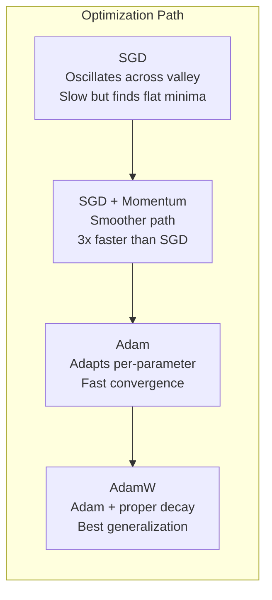

# 优化者

> 梯度下降告诉你向哪个方向移动。它没有说多远或多快。SGD是一个指南针。亚当有交通数据的全球定位系统。

**Type:** Build
**Languages:** Python
**Prerequisites:** Lesson 03.05 (Loss Functions)
**Time:** ~75 minutes

## 学习目标

- 在Python中从头开始实现SGD、SGD with momentum、Adam和AdamW优化器
- 解释亚当偏差校正是如何补偿早期训练步骤中零初始化矩估计的
- 说明为什么在相同的任务上，AdamW比使用L2正则化的Adam产生更好的泛化
- 为变压器、cnn、gan和微调选择适当的优化器和默认超参数

## 这个问题

9vu45wsp42l33dy42tir

香草梯度下降对每一步的每个参数应用相同的学习率：w = w - lr *梯度。这就产生了三个问题，使训练神经网络在实践中变得痛苦。

首先,振荡。损失的景观很少像一个光滑的碗。它更像是一个狭长的山谷。梯度指向山谷（陡峭方向），而不是沿着山谷（浅方向）。梯度下降在狭窄的维度上来回反弹，同时在有用的维度上取得微小的进展。你们已经看到了：损失迅速下降然后趋于平稳，不是因为模型收敛而是因为它在振荡。

其次，所有参数的一个学习率是错误的。有些权重需要大量更新（它们处于早期的欠拟合阶段）。其他的则需要微小的更新（它们已经接近最优值）。对前者有效的学习率会破坏后者，反之亦然。

第三，鞍点。在高维中，损失景观具有梯度接近于零的广阔平坦区域。香草SGD以梯度的速度爬行，这实际上是零。这个模型看起来卡住了。它没有被卡住——它在一个平坦的区域，另一边有有用的下降。但新元并没有推动机制。

亚当解决了这三个问题。它为每个参数维持两个运行平均值——平均梯度（动量，处理振荡）和均方梯度（自适应速率，处理不同的尺度）。结合前几个步骤的偏差校正，它为您提供了一个单一的优化器，可以处理80%的默认超参数问题。这节课从头开始构建它，这样你就能准确地理解其他20%的失败时间和原因。

## 这个概念

### 随机梯度下降法

最简单的优化器。在一个小批量上计算梯度，然后朝相反的方向前进。

```
w = w - lr * gradient
```

“随机”意味着你使用随机的数据子集（小批量）来估计梯度，而不是使用完整的数据集。这种噪声实际上是有用的——它有助于避开尖锐的局部极小值。但是噪音也会引起振荡。

学习速度是唯一的旋钮。太高，损失就会分散。太低了：训练要花很长时间。最优值取决于体系结构、数据、批处理大小和当前的训练阶段。对于现代网络上的香草SGD，典型值范围从0.01到0.1。但即使在一次训练中，理想的学习率也会发生变化。

### 动力

球滚下山的比喻被过度使用了，但很准确。不是单独沿着梯度步进，而是保持一个累积过去梯度的速度。

```
m_t = beta * m_{t-1} + gradient
w = w - lr * m_t
```

Beta（通常是0.9）控制要保留多少历史记录。当beta = 0.9时，动量大致是最后10个梯度的平均值（1 /(1 - 0.9)= 10）。

为什么会固定振荡：指向相同方向的梯度会累积。翻转方向的梯度消掉了。在那个狭窄的山谷中，“横”分量每走一步都会翻转，并被弄湿。“一起”的成分保持一致，并被放大。结果是在有用方向上平滑加速。

实数：在条件恶劣的损失情况下，单是SGD就可能需要10000步。具有动量的SGD （beta=0.9）通常需要3,000-5,000步才能解决相同的问题。加速不是微不足道的。

### RMSProp

这是第一个有效的按参数自适应学习率方法。Hinton在Coursera的一次演讲中提出（从未正式发表）。

```
s_t = beta * s_{t-1} + (1 - beta) * gradient^2
w = w - lr * gradient / (sqrt(s_t) + epsilon)
```

ga2nul59n7wsz0bpc52r

rjjwuxbww9m823go3473

Epsilon（通常是1e-8）防止在参数没有更新时除以零。

### cmg5989b54dhofh0ctyf

亚当结合了这两种想法。每个参数维持两个指数移动平均线：

```
m_t = beta1 * m_{t-1} + (1 - beta1) * gradient        (first moment: mean)
v_t = beta2 * v_{t-1} + (1 - beta2) * gradient^2       (second moment: variance)
```

**偏差校正**是大多数解释忽略的关键细节。在第一步，m_1 = (1 - β 1) *梯度。当β = 0.9时，这是0.1 *梯度——太小了10倍。移动平均线还没变暖。偏差校正补偿：

```
m_hat = m_t / (1 - beta1^t)
v_hat = v_t / (1 - beta2^t)
```

在步骤1，beta1 = 0.9: m_hat = m_1 / (1 - 0.9) = m_1 / 0.1 =实际梯度。在第100步：（1 - 0.9^100）近似为1.0，因此校正消失。偏差校正在前10步很重要，在50步之后就无关紧要了。

57ualvu26nwwqdhx0rbv

```
w = w - lr * m_hat / (sqrt(v_hat) + epsilon)
```

jckgrqm6qym6ci48zuaw

### molrja6isioduopx5kg1

L2 regularization adds lambda * w^2 to the loss. In vanilla SGD, this is equivalent to weight decay (subtracting lambda * w from the weight at each step). In Adam, this equivalence breaks.

Loshchilov和Hutter的见解：当你将L2添加到损失中，然后Adam处理梯度，自适应学习率也缩放正则化项。梯度方差较大的参数正则化程度较低。方差小的参数得到更多。这不是你想要的——你想要统一的正则化，不管梯度统计。

在亚当更新后，AdamW通过将权重衰减直接应用于权重来修复此问题：

```
w = w - lr * m_hat / (sqrt(v_hat) + epsilon) - lr * lambda * w
```

权重衰减项（lr * lambda * w）没有被亚当自适应因子缩放。每个参数得到相同的比例收缩。

这似乎是一个小细节。它不是。在几乎所有任务上，AdamW收敛到比Adam + L2正则化更好的解决方案。它是PyTorch中用于训练变压器、扩散模型和大多数现代架构的默认优化器。BERT， GPT, LLaMA，稳定扩散-都与AdamW训练。

### fqaoxqpimgjvn0s8gw2c

wughhrc66s5c41j8wb4w


TooHigh—> Diverge[“损失爆炸<br/>NaN权重<br/>训练崩溃”]
justight—>收敛[“损耗稳步下降<br/>达到良好的最小值<br/>泛化良好”]
TooLow—>失速[“损失缓慢下降<br/>卡在次优最小值<br/>浪费计算”]

bd87bo6iti6mysmphf5e


```

If you tune one hyperparameter, tune the learning rate. A 10x change in learning rate matters more than any architectural decision you'll make. Common defaults:

- SGD: lr = 0.01 to 0.1
- Adam/AdamW: lr = 1e-4 to 3e-4
- Fine-tuning pretrained models: lr = 1e-5 to 5e-5
- Learning rate warmup: linear ramp over first 1-10% of steps

### Optimizer Comparison



### When Each Optimizer Wins

“‘美人鱼
流程图TD
“你在训练什么？”—> Type{“模型类型？”｝

类型——> |“变压器/ LLM”| AdamW[“AdamW < br / > lr = 1的军医,wd = 0.01 - -0.1)
类型——> |“CNN / ResNet”| SGD_M[“SGD +动量< br / > lr = 0.1,动量= 0.9”)
类型——> |“甘”| Adam2[“亚当< br / > lr = 2的军医,beta1 = 0.5”)
类型——> |“微调”| AdamW2[“AdamW < br / > lr = 2 e-5, wd = 0.01”)
Type ->|"Don't know yet"| Default["Start with AdamW<br/>lr=3e-4, wd=0.01"]
```

## Build It

### Step 1: Vanilla SGD

```python
class SGD:
    def __init__(self, lr=0.01):
        self.lr = lr

    def step(self, params, grads):
        for i in range(len(params)):
            params[i] -= self.lr * grads[i]
```

### 第二步：有动能的新加坡元

vzs3kexse6ik9101swa5


7ahurd7qshi6l76ibujk


```

### Step 3: Adam

```python
import math

class Adam:
    def __init__(self, lr=0.001, beta1=0.9, beta2=0.999, epsilon=1e-8):
        self.lr = lr
        self.beta1 = beta1
        self.beta2 = beta2
        self.epsilon = epsilon
        self.m = None
        self.v = None
        self.t = 0

    def step(self, params, grads):
        if self.m is None:
            self.m = [0.0] * len(params)
            self.v = [0.0] * len(params)

        self.t += 1

        for i in range(len(params)):
            self.m[i] = self.beta1 * self.m[i] + (1 - self.beta1) * grads[i]
            self.v[i] = self.beta2 * self.v[i] + (1 - self.beta2) * grads[i] ** 2

            m_hat = self.m[i] / (1 - self.beta1 ** self.t)
            v_hat = self.v[i] / (1 - self.beta2 ** self.t)

            params[i] -= self.lr * m_hat / (math.sqrt(v_hat) + self.epsilon)
```

### Step 4: AdamW

```python
class AdamW:
    def __init__(self, lr=0.001, beta1=0.9, beta2=0.999, epsilon=1e-8, weight_decay=0.01):
        self.lr = lr
        self.beta1 = beta1
        self.beta2 = beta2
        self.epsilon = epsilon
        self.weight_decay = weight_decay
        self.m = None
        self.v = None
        self.t = 0

Def (self, params, gradients)：
如果自我。m为None：
自我。M = [0.0] * len（params）
自我。V = [0.0] * len（params）

自我。T += 1

srpf6d3ki4u2ffdkml22


M_hat = self。M [i] / (1 - self。** * self.t)
V_hat = self。V [i] / (1 - self。bet2 ** self.t)

yxyyxvcq9699orymgr9z

```

### Step 5: Training Comparison

Train the same two-layer network on the circle dataset from lesson 05 with all four optimizers. Compare convergence.

```python
import random

def sigmoid(x):
    x = max(-500, min(500, x))
    return 1.0 / (1.0 + math.exp(-x))

def make_circle_data(n=200, seed=42):
    random.seed(seed)
    data = []
    for _ in range(n):
        x = random.uniform(-2, 2)
        y = random.uniform(-2, 2)
        label = 1.0 if x * x + y * y < 1.5 else 0.0
        data.append(([x, y], label))
    return data


class OptimizerTestNetwork:
    def __init__(self, optimizer, hidden_size=8):
        random.seed(0)
        self.hidden_size = hidden_size
        self.optimizer = optimizer

        self.w1 = [[random.gauss(0, 0.5) for _ in range(2)] for _ in range(hidden_size)]
        self.b1 = [0.0] * hidden_size
        self.w2 = [random.gauss(0, 0.5) for _ in range(hidden_size)]
        self.b2 = 0.0

    def get_params(self):
        params = []
        for row in self.w1:
            params.extend(row)
        params.extend(self.b1)
        params.extend(self.w2)
        params.append(self.b2)
        return params

    def set_params(self, params):
        idx = 0
        for i in range(self.hidden_size):
            for j in range(2):
                self.w1[i][j] = params[idx]
                idx += 1
        for i in range(self.hidden_size):
            self.b1[i] = params[idx]
            idx += 1
        for i in range(self.hidden_size):
            self.w2[i] = params[idx]
            idx += 1
        self.b2 = params[idx]

    def forward(self, x):
        self.x = x
        self.z1 = []
        self.h = []
        for i in range(self.hidden_size):
            z = self.w1[i][0] * x[0] + self.w1[i][1] * x[1] + self.b1[i]
            self.z1.append(z)
            self.h.append(max(0.0, z))

        self.z2 = sum(self.w2[i] * self.h[i] for i in range(self.hidden_size)) + self.b2
        self.out = sigmoid(self.z2)
        return self.out

    def compute_grads(self, target):
        eps = 1e-15
        p = max(eps, min(1 - eps, self.out))
        d_loss = -(target / p) + (1 - target) / (1 - p)
        d_sigmoid = self.out * (1 - self.out)
        d_out = d_loss * d_sigmoid

        grads = [0.0] * (self.hidden_size * 2 + self.hidden_size + self.hidden_size + 1)
        idx = 0
        for i in range(self.hidden_size):
            d_relu = 1.0 if self.z1[i] > 0 else 0.0
            d_h = d_out * self.w2[i] * d_relu
            grads[idx] = d_h * self.x[0]
            grads[idx + 1] = d_h * self.x[1]
            idx += 2

        for i in range(self.hidden_size):
            d_relu = 1.0 if self.z1[i] > 0 else 0.0
            grads[idx] = d_out * self.w2[i] * d_relu
            idx += 1

        for i in range(self.hidden_size):
            grads[idx] = d_out * self.h[i]
            idx += 1

        grads[idx] = d_out
        return grads

    def train(self, data, epochs=300):
        losses = []
        for epoch in range(epochs):
            total_loss = 0.0
            correct = 0
            for x, y in data:
                pred = self.forward(x)
                grads = self.compute_grads(y)
                params = self.get_params()
                self.optimizer.step(params, grads)
                self.set_params(params)

                eps = 1e-15
                p = max(eps, min(1 - eps, pred))
                total_loss += -(y * math.log(p) + (1 - y) * math.log(1 - p))
                if (pred >= 0.5) == (y >= 0.5):
                    correct += 1
            avg_loss = total_loss / len(data)
            accuracy = correct / len(data) * 100
            losses.append((avg_loss, accuracy))
            if epoch % 75 == 0 or epoch == epochs - 1:
                print(f"    Epoch {epoch:3d}: loss={avg_loss:.4f}, accuracy={accuracy:.1f}%")
        return losses
```

## Use It

PyTorch优化器处理参数组、梯度裁剪和学习率调度：

qt71787601h1bl3tps5l


i53yfgf21vreuvpoqnwd


optimizer = optim.AdamW(model.parameters(), lr=3e-4, weight_decay=0.01)

scheduler = optim.lr_scheduler.CosineAnnealingLR(optimizer, T_max=100)

对于范围（100）内的epoch：
optimizer.zero_grad ()
输出=模型（火炬）。randn (784))
损失=火炬。n.功能。cross_entropy(输出,火炬。Randint （0, 10, (32,)）
loss.backward ()
torch.nn.utils.clip_grad_norm_(模型。参数(),max_norm = 1.0)
optimizer.step ()
scheduler.step ()
```

The pattern is always: zero_grad, forward, loss, backward, (clip), step, (schedule). Memorize this order. Getting it wrong (e.g., calling scheduler.step() before optimizer.step()) is a common source of subtle bugs.

For CNNs, many practitioners still prefer SGD + momentum (lr=0.1, momentum=0.9, weight_decay=1e-4) with a step or cosine schedule. SGD finds flatter minima, which often generalize better. For transformers and LLMs, AdamW with warmup + cosine decay is the universal default. Don't fight the consensus without a measured reason.

## Ship It

This lesson produces:
- `outputs/prompt-optimizer-selector.md` -- a decision prompt for choosing the right optimizer and learning rate for any architecture

## Exercises

1. Implement Nesterov momentum, where you compute the gradient at the "lookahead" position (w - lr * beta * v) instead of the current position. Compare convergence to standard momentum on the circle dataset.

2. Implement a learning rate warmup schedule: linear ramp from 0 to max_lr over the first 10% of training steps, then cosine decay to 0. Train with Adam + warmup vs Adam without warmup. Measure how many epochs it takes to reach 90% accuracy on the circle dataset.

3. Track the effective learning rate for each parameter during Adam training. The effective rate is lr * m_hat / (sqrt(v_hat) + eps). Plot the distribution of effective rates after 10, 50, and 200 steps. Are all parameters being updated at the same speed?

4. Implement gradient clipping (clip by global norm). Set the max gradient norm to 1.0. Train with and without clipping using a high learning rate (lr=0.01 for Adam). Count how many runs diverge (loss goes to NaN) with and without clipping over 10 random seeds.

5. Compare Adam vs AdamW on a network with large weights. Initialize all weights to random values in [-5, 5] (much larger than normal). Train for 200 epochs with weight_decay=0.1. Plot the L2 norm of weights over training for both optimizers. AdamW should show faster weight shrinkage.

## Key Terms

| Term | What people say | What it actually means |
|------|----------------|----------------------|
| Learning rate | "Step size" | The scalar multiplier on the gradient update; the single most impactful hyperparameter in training |
| SGD | "Basic gradient descent" | Stochastic gradient descent: update weights by subtracting lr * gradient, computed on a mini-batch |
| Momentum | "Rolling ball analogy" | Exponential moving average of past gradients; dampens oscillation and accelerates consistent directions |
| RMSProp | "Adaptive learning rate" | Divides each parameter's gradient by the running RMS of its recent gradients; equalizes learning rates |
| Adam | "The default optimizer" | Combines momentum (first moment) and RMSProp (second moment) with bias correction for the initial steps |
| AdamW | "Adam done right" | Adam with decoupled weight decay; applies regularization directly to weights rather than through the gradient |
| Bias correction | "Warmup for running averages" | Dividing by (1 - beta^t) to compensate for the zero-initialization of Adam's moment estimates |
| Weight decay | "Shrink the weights" | Subtracting a fraction of the weight value at each step; a regularizer that penalizes large weights |
| Learning rate schedule | "Changing lr over time" | A function that adjusts the learning rate during training; warmup + cosine decay is the modern default |
| Gradient clipping | "Capping the gradient norm" | Scaling down the gradient vector when its norm exceeds a threshold; prevents exploding gradient updates |

## Further Reading

- Kingma & Ba, "Adam: A Method for Stochastic Optimization" (2014) -- the original Adam paper with convergence analysis and the bias correction derivation
- Loshchilov & Hutter, "Decoupled Weight Decay Regularization" (2017) -- proved that L2 regularization and weight decay are not equivalent in Adam, and proposed AdamW
- Smith, "Cyclical Learning Rates for Training Neural Networks" (2017) -- introduced the LR range test and cyclical schedules that remove the need to tune a fixed learning rate
- Ruder, "An Overview of Gradient Descent Optimization Algorithms" (2016) -- the best single survey of all optimizer variants, with clear comparisons and intuitions