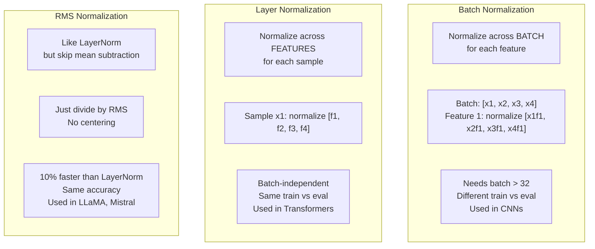

# 正则化

> 你的模型得到99%的训练数据和60%的测试数据。它记忆而不是学习。正则化是为了强制泛化而强加于复杂性上的税。

**Type:** Build
**Languages:** Python
**Prerequisites:** Lesson 03.06 (Optimizers)
**Time:** ~75 minutes

## 学习目标

- 从头开始实现dropout，包括反向缩放、L2权重衰减、批处理规范化、层规范化和RMSNorm
- 利用正则化实验测量训练测试精度差并诊断过拟合
- 解释为什么变压器使用LayerNorm而不是BatchNorm，以及为什么现代llm更喜欢RMSNorm
- 根据过度拟合的严重程度，应用正则化技术的正确组合

## 这个问题

A neural network with enough parameters can memorize any dataset. This is not a hypothetical -- Zhang et al. (2017) proved it by training standard networks on ImageNet with random labels. The networks reached near-zero training loss on completely random label assignments. They memorized a million random input-output pairs with no pattern to learn. Training loss was perfect. Test accuracy was zero.

这就是过拟合问题，随着模型变大，它会变得更糟。GPT-3有1750亿个参数。训练集大约有5000亿个代币。有了这么多参数，模型就有足够的能力逐字记忆训练数据的重要块。如果没有正则化，它只会反刍训练示例，而不是学习可推广的模式。

8novoo1qe88e5zkyxak6

## 这个概念

### j6axq2txinst3ogqanpq

o6p7rldwuhfx8kudtg7c

```mermaid
graph LR
    Under["Underfitting<br/>Train: 60%<br/>Test: 58%<br/>Model too simple"] --> Good["Good Fit<br/>Train: 95%<br/>Test: 92%<br/>Generalizes well"]
    Good --> Over["Overfitting<br/>Train: 99.9%<br/>Test: 65%<br/>Memorized noise"]

Dropout["Dropout"]—>|" push left"|结束
WD["Weight Decay"] ->|" pushing left"| Over
BN["BatchNorm"] ->|" push left"|结束
Aug["Data Augmentation"] ->|" pushing left"| Over
```

### Dropout

The simplest regularization technique with the most elegant interpretation. During training, randomly set each neuron's output to zero with probability p.

```
输出=激活(z) *掩码其中掩码[i] ~伯努利（1 - p）
```

With p = 0.5, half the neurons are zeroed on every forward pass. The network must learn redundant representations because it can't predict which neurons will be available. This prevents co-adaptation -- neurons learning to rely on specific other neurons being present.

The ensemble interpretation: a network with N neurons and dropout creates 2^N possible subnetworks (every combination of which neurons are on or off). Training with dropout approximately trains all 2^N subnetworks simultaneously, each on different mini-batches. At test time, you use all neurons (no dropout) and scale outputs by (1 - p) to match the expected value during training. This is equivalent to averaging the predictions of 2^N subnetworks -- a massive ensemble from a single model.

In practice, the scaling is applied during training instead of testing (inverted dropout):

```
训练时：输出=激活(z) *掩码/ （1 - p）
在测试期间：输出=激活(z)（不需要更改）
```

This is cleaner because test code doesn't need to know about dropout at all.

Default rates: p = 0.1 for transformers, p = 0.5 for MLPs, p = 0.2-0.3 for CNNs. Higher dropout = stronger regularization = more underfitting risk.

### Weight Decay (L2 Regularization)

Add the squared magnitude of all weights to the loss:

```
Total_loss = task_loss + (lambda / 2) * sum（w_i^2）
```

The gradient of the regularization term is lambda * w. This means at every step, each weight is shrunk toward zero by a fraction proportional to its magnitude. Large weights get penalized more. The model is pushed toward solutions where no single weight dominates.

Why this helps generalization: overfit models tend to have large weights that amplify noise in the training data. Weight decay keeps weights small, which limits the model's effective capacity and forces it to rely on robust, generalizable features rather than memorized quirks.

The lambda hyperparameter controls the strength. Typical values:

- 0.01 for AdamW on transformers
- 1e-4 for SGD on CNNs
- 0.1 for heavily overfit models

As discussed in lesson 06: weight decay and L2 regularization are equivalent in SGD but not in Adam. Always use AdamW (decoupled weight decay) when training with Adam.

### Batch Normalization

Normalize the output of each layer across the mini-batch before passing it to the next layer.

For a mini-batch of activations at some layer:

```
mu = (1/B) * sum(x_i)（批均值）
sigma^2 = (1/B) * sum((x_i - mu)^2)（批方差）
X_hat = (x_i - mu) / sqrt(sigma^2 + eps)（归一化）
Y = gamma * x_hat + beta（缩放和移位）
```

Gamma and beta are learnable parameters that let the network undo the normalization if that's optimal. Without them, you'd be forcing every layer's output to be zero-mean unit-variance, which might not be what the network wants.

**Training vs inference split:** During training, mu and sigma come from the current mini-batch. During inference, you use running averages accumulated during training (exponential moving average with momentum = 0.1, meaning 90% old + 10% new).

Why BatchNorm works is still debated. The original paper claimed it reduces "internal covariate shift" (the distribution of layer inputs changing as earlier layers update). Santurkar et al. (2018) showed this explanation is wrong. The actual reason: BatchNorm makes the loss landscape smoother. The gradients are more predictive, the Lipschitz constants are smaller, and the optimizer can take larger steps safely. This is why BatchNorm lets you use higher learning rates and converge faster.

BatchNorm has a fundamental limitation: it depends on batch statistics. With batch size 1, the mean and variance are meaningless. With small batches (< 32), the statistics are noisy and hurt performance. This matters for tasks like object detection (where memory limits batch size) and language modeling (where sequence lengths vary).

### Layer Normalization

Normalize across features instead of across the batch. For a single sample:

```
mu = (1/D) * sum(x_j)（特征均值）
σ ^2 = (1/D) * sum((x_j - mu)^2)（特征方差）
X_hat = (x_j - mu) /√（∑²+ eps）
Y = * x_hat +
```

D is the feature dimension. Each sample is normalized independently -- no dependence on batch size. This is why transformers use LayerNorm instead of BatchNorm. Sequences have variable lengths, batch sizes are often small (or 1 during generation), and the computation is identical between training and inference.

LayerNorm in transformers is applied after each self-attention block and each feed-forward block (Post-LN), or before them (Pre-LN, which is more stable for training).

### RMSNorm

LayerNorm without the mean subtraction. Proposed by Zhang & Sennrich (2019).

```
rms = sqrt((1/D) * sum(x_j^2))
y = gamma * x / rms
```

That's it. No mean computation, no beta parameter. The observation: the re-centering (mean subtraction) in LayerNorm contributes very little to the model's performance, but costs computation. Removing it gives the same accuracy with about 10% less overhead.

LLaMA, LLaMA 2, LLaMA 3, Mistral, and most modern LLMs use RMSNorm instead of LayerNorm. At the scale of billions of parameters and trillions of tokens, that 10% savings is significant.

### Normalization Comparison



### 作为正则化的数据增强

不是模型修改，而是数据修改。转换训练输入，同时保留标签：

- 图像：随机裁剪，翻转，旋转，颜色抖动，剪切
- 8la7fh154qehk911edal
- 音频：时间拉伸，音调移位，噪音添加

io21vn29bkh57gx5dcg3

### 早期停止

最简单的正则化器：当验证损失开始增加时停止训练。此时模型还没有过拟合。在实践中，您跟踪每个epoch的验证损失，保存最佳模型，并继续训练“耐心”窗口（通常为5-20个epoch）。如果验证丢失在耐心窗口内没有得到改善，则停止并加载最佳保存的模型。

### 何时申请什么

x0dl93iyolj46asnufrc


Heavy -> D5["Dropout p=0.3-0.5"]
重-> WD2[“重量衰减0.01-0.1”]
Heavy -> Aug[“积极的数据增强”]
Heavy—> ES[“提前停止”]

5kxezum2hnrbho7tw9id


Light -> D1["Dropout p=0.05-0.1"]
Light -> WD0[“重量衰减1e-4”]
```

## Build It

### Step 1: Dropout (Train and Eval Mode)

```python
import random
import math


class Dropout:
    def __init__(self, p=0.5):
        self.p = p
        self.training = True
        self.mask = None

    def forward(self, x):
        if not self.training:
            return list(x)
        self.mask = []
        output = []
        for val in x:
            if random.random() < self.p:
                self.mask.append(0)
                output.append(0.0)
            else:
                self.mask.append(1)
                output.append(val / (1 - self.p))
        return output

    def backward(self, grad_output):
        grads = []
        for g, m in zip(grad_output, self.mask):
            if m == 0:
                grads.append(0.0)
            else:
                grads.append(g / (1 - self.p))
        return grads
```

### 步骤2:L2权重衰减

cjipwihaemi6blx4p2sp


Def l2_gradient(weights, lambda_reg)：
返回[lambda_reg * w for w in weights]
```

### Step 3: Batch Normalization

```python
class BatchNorm:
    def __init__(self, num_features, momentum=0.1, eps=1e-5):
        self.gamma = [1.0] * num_features
        self.beta = [0.0] * num_features
        self.eps = eps
        self.momentum = momentum
        self.running_mean = [0.0] * num_features
        self.running_var = [1.0] * num_features
        self.training = True
        self.num_features = num_features

    def forward(self, batch):
        batch_size = len(batch)
        if self.training:
            mean = [0.0] * self.num_features
            for sample in batch:
                for j in range(self.num_features):
                    mean[j] += sample[j]
            mean = [m / batch_size for m in mean]

            var = [0.0] * self.num_features
            for sample in batch:
                for j in range(self.num_features):
                    var[j] += (sample[j] - mean[j]) ** 2
            var = [v / batch_size for v in var]

            for j in range(self.num_features):
                self.running_mean[j] = (1 - self.momentum) * self.running_mean[j] + self.momentum * mean[j]
                self.running_var[j] = (1 - self.momentum) * self.running_var[j] + self.momentum * var[j]
        else:
            mean = list(self.running_mean)
            var = list(self.running_var)

        self.x_hat = []
        output = []
        for sample in batch:
            normalized = []
            out_sample = []
            for j in range(self.num_features):
                x_h = (sample[j] - mean[j]) / math.sqrt(var[j] + self.eps)
                normalized.append(x_h)
                out_sample.append(self.gamma[j] * x_h + self.beta[j])
            self.x_hat.append(normalized)
            output.append(out_sample)
        return output
```

### dvoeip3cjkp5utt5dune

```python
class LayerNorm:
    def __init__(self, num_features, eps=1e-5):
        self.gamma = [1.0] * num_features
        self.beta = [0.0] * num_features
        self.eps = eps
        self.num_features = num_features

    def forward(self, x):
        mean = sum(x) / len(x)
        var = sum((xi - mean) ** 2 for xi in x) / len(x)

自我。X_hat = []
输出= []
对于j在范围（self.num_features）：
X_h = (x[j] - mean) / math。Sqrt （var + self.eps）
self.x_hat.append (x_h)
output.append(自我。Gamma [j] * x_h + self.beta[j])
返回输出
```

### Step 5: RMSNorm

```python
class RMSNorm:
    def __init__(self, num_features, eps=1e-6):
        self.gamma = [1.0] * num_features
        self.eps = eps
        self.num_features = num_features

    def forward(self, x):
        rms = math.sqrt(sum(xi * xi for xi in x) / len(x) + self.eps)
        output = []
        for j in range(self.num_features):
            output.append(self.gamma[j] * x[j] / rms)
        return output
```

### 第六步：有和没有正则化的训练

”“python
def乙状结肠(x):
X = max（-500, min(500， X)）
返回1.0 / （1.0 + math.exp(-x)）


Def make_circle_data(n=200, seed=42)：
random.seed(种子)
数据= []
对于范围(n)中的_：
X =随机。制服(2,2)
Y =随机。制服(2,2)
标签= 1.0如果x * x + y * y < 1.5否则0.0
数据。Append （([x, y], label)）
返回数据


类RegularizedNetwork:
Def __init__(self, hidden_size=16, lr=0.05, dropout_p=0.0, weight_decay=0.0)：
random.seed (0)
自我。Hidden_size = Hidden_size
自我。Lr = Lr
自我。Dropout_p = Dropout_p
自我。Weight_decay = Weight_decay
自我。dropout =dropout (p=dropout_p) if dropout_p > 0 else无

自我。W1 =[[随机]。高斯（0,0.5）for _ in range(2)] for _ in range(hidden_size)]
自我。B1 = [0.0] * hidden_size
自我。W2 =[随机]。高斯（0,0.5）for _in range(hidden_size)]
自我。B2 = 0.0

def forward(self, x, training=True)：
自我。X = X
自我。Z1 = []
Self.h = []
对于I在range(self.hidden_size)：
Z =自我。W1 [i][0] * * [0] + self。* * * * * * * * * * * * * * * *
self.z1.append (z)
self.h.append (max (0.0, z))

如果自我。退学和培训：
self.dropout.training = True
Self.h = self.dropout.forward（Self.h）
elif self.dropout:
self.drop .training = False
Self.h = self.dropout.forward（Self.h）

自我。Z2 = sum(self。W2 [i] * self.h[i] for i in range（self。）Hidden_size)) + self.b2
自我。Out = sigmoid（self.z2）
返回self.out

Def backward(self, target)：
Eps = 1e-15
P = max（eps, min(1 - eps, self.out)）
D_loss = -（目标/ p） +（1 -目标）/ （1 - p）
D_sigmoid = self。Out * （1 - self.out）
D_out = d_loss * d_sigmoid

jd8ba0jg9orgfx316fes


Def evaluate(self, data)：
正确= 0
Total_loss = 0.0
对于data中的x， y：
Pred = self。转发(x,培训= False)
Eps = 1e-15
P = max（eps, min(1 - eps, pred)）
total_loss + = - (y * math.log (p) + (1 - y) * math.log (1 - p))
如果(pred >= 0.5) == (y >= 0.5)：
正确+= 1
返回total_loss / len(data), correct / len(data) * 100

vxuennkcaofmf2hv4fdm


```

## Use It

PyTorch provides all normalization and regularization as modules:

```python
import torch
import torch.nn as nn

model = nn.Sequential(
    nn.Linear(784, 256),
    nn.BatchNorm1d(256),
    nn.ReLU(),
    nn.Dropout(0.3),
    nn.Linear(256, 128),
    nn.BatchNorm1d(128),
    nn.ReLU(),
    nn.Dropout(0.3),
    nn.Linear(128, 10),
)

model.train()
out_train = model(torch.randn(32, 784))

model.eval()
out_test = model(torch.randn(1, 784))
```

The `model.train()` / `model.eval()` toggle is critical. It switches dropout on/off and tells BatchNorm to use batch statistics vs running statistics. Forgetting `model.eval()` before inference is one of the most common bugs in deep learning. Your test accuracy will fluctuate randomly because dropout is still active and BatchNorm is using mini-batch statistics.

yg0btftpwbrtzxk7vuue

”“python
类TransformerBlock (nn。模块):
Def __init__(self, d_model=512, nhead=8, dropout=0.1)：
super () . __init__ ()
自我。注意力= nn。MultiheadAttention（d_model, nhead, dropout=dropout）
自我。Norm1 = nn。LayerNorm (d_model)
自我。Ff = nn。顺序(
神经网络。线性（d_model, d_model * 4），
神经网络。GELU (),
神经网络。线性（d_model * 4, d_model），
神经网络。辍学(辍学),
）
自我。Norm2 = nn。LayerNorm (d_model)
自我。Dropout = nn。辍学(辍学)

6m4l9a2dxbhhd6v3bvtq


```

LayerNorm, not BatchNorm. Dropout p=0.1, not p=0.5. These are the transformer defaults.

## Ship It

This lesson produces:
- `outputs/prompt-regularization-advisor.md` -- a prompt that diagnoses overfitting and recommends the right regularization strategy

## Exercises

1. Implement spatial dropout for 2D data: instead of dropping individual neurons, drop entire feature channels. Simulate this by treating groups of consecutive features as channels and dropping whole groups. Compare the train-test gap to standard dropout on the circle dataset with hidden_size=32.

2. Implement label smoothing from lesson 05 combined with dropout from this lesson. Train with four configurations: neither, dropout only, label smoothing only, both. Measure the final train-test accuracy gap for each. Which combination gives the smallest gap?

3. Add a BatchNorm layer between the hidden layer and the activation in your circle-dataset network. Train with and without BatchNorm at learning rates 0.01, 0.05, and 0.1. BatchNorm should allow stable training at higher learning rates where the vanilla network diverges.

4. Implement early stopping: track test loss each epoch, save the best weights, and stop if test loss hasn't improved for 20 epochs. Run the regularized network for 1000 epochs. Report which epoch had the best test accuracy and how many epochs of computation you saved.

5. Compare LayerNorm vs RMSNorm on a 4-layer network (not just 2). Initialize both with the same weights. Train for 200 epochs and compare final accuracy, training speed (time per epoch), and gradient magnitudes at the first layer. Verify that RMSNorm is faster with the same accuracy.

## Key Terms

| Term | What people say | What it actually means |
|------|----------------|----------------------|
| Overfitting | "Model memorized the data" | When a model's training performance significantly exceeds its test performance, indicating it learned noise rather than signal |
| Regularization | "Preventing overfitting" | Any technique that constrains model complexity to improve generalization: dropout, weight decay, normalization, augmentation |
| Dropout | "Random neuron deletion" | Zeroing random neurons during training with probability p, forcing redundant representations; equivalent to training an ensemble |
| Weight decay | "L2 penalty" | Shrinking all weights toward zero by subtracting lambda * w at each step; penalizes complexity through weight magnitude |
| Batch normalization | "Normalize per batch" | Normalizing layer outputs across the batch dimension using batch statistics during training and running averages during inference |
| Layer normalization | "Normalize per sample" | Normalizing across features within each sample; batch-independent, used in transformers where batch size varies |
| RMSNorm | "LayerNorm without the mean" | Root mean square normalization; drops the mean subtraction from LayerNorm for 10% speedup with equal accuracy |
| Early stopping | "Stop before overfit" | Halting training when validation loss stops improving; the simplest regularizer, often used alongside others |
| Data augmentation | "More data from less" | Transforming training inputs (flip, crop, noise) to increase effective dataset size and force invariance learning |
| Generalization gap | "Train-test split" | The difference between training and test performance; regularization aims to minimize this gap |

## Further Reading

- Srivastava et al., "Dropout: A Simple Way to Prevent Neural Networks from Overfitting" (2014) -- the original dropout paper with the ensemble interpretation and extensive experiments
- Ioffe & Szegedy, "Batch Normalization: Accelerating Deep Network Training by Reducing Internal Covariate Shift" (2015) -- introduced BatchNorm and its training procedure, one of the most cited deep learning papers
- Zhang & Sennrich, "Root Mean Square Layer Normalization" (2019) -- showed RMSNorm matches LayerNorm accuracy with reduced computation; adopted by LLaMA and Mistral
- Zhang et al., "Understanding Deep Learning Requires Rethinking Generalization" (2017) -- the landmark paper showing neural networks can memorize random labels, challenging traditional views of generalization