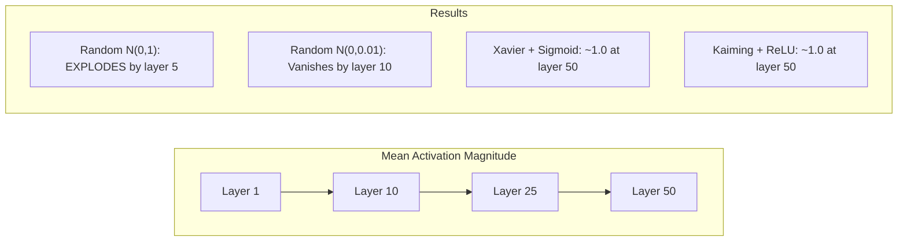

# 权值初始化和训练稳定性

> 初始化错误，训练永远不会开始。初始化右和50层训练一样顺利3。

**Type:** Build
**Languages:** Python
**Prerequisites:** Lesson 03.04 (Activation Functions), Lesson 03.07 (Regularization)
**Time:** ~90 minutes

## 学习目标

- 实现零、随机、Xavier/Glorot和Kaiming/He初始化策略，并通过50层测量它们对激活幅度的影响
- 推导为什么Xavier init使用Var(w) = 2/(fan_in + fan_out)，而kaim使用Var(w) = 2/fan_in
- 演示零初始化的对称问题，并解释为什么单靠随机尺度是不够的
- 将正确的初始化策略匹配到激活函数：sigmoid/tanh为Xavier， ReLU/GELU为kaim

## 这个问题

将所有权重初始化为零。没有学习。每个神经元都计算相同的函数，接收相同的梯度，并进行相同的更新。在10000次迭代之后，你的512个神经元隐藏层仍然是512个相同神经元的拷贝。你付出了512个参数，只得到1个。

初始化它们太大。激活通过网络爆炸。到了第10层，数值达到了1e15。到了第20层，它们会无限溢出。梯度遵循相同的反向轨迹。

从标准正态分布随机初始化它们。适用于3层。在50层时，信号会崩溃为零或爆炸为无穷大，这取决于随机尺度是略小还是略大。“工作”和“破碎”之间的界限非常薄。

权重初始化是深度学习中最容易被低估的决策。建筑有论文。优化者得到博客文章。初始化获得一个脚注。但如果做错了，其他都不重要了——你的社交网络在培训开始之前就已经死了。

## 这个概念

### 对称问题

一层中的每个神经元都有相同的结构：将输入乘以权重，添加偏置，应用激活。如果所有的权重从相同的值开始（零是极端情况），每个神经元计算相同的输出。在反向传播过程中，每个神经元接收到相同的梯度。在更新步骤中，每个神经元的变化量相同。

你卡住了。网络有数百个参数，但它们都是步调一致的。这就是所谓的对称性，而随机初始化是打破它的强力方法。每个神经元从权重空间的不同点开始，因此每个神经元学习不同的特征。

但“随机”是不够的。随机性的“尺度”决定了网络是否训练。

### 通过层传播方差

考虑一个带有fan_in输入的单层：

```
z = w1*x1 + w2*x2 + ... + w_n*x_n
```

若每个权重wi取自方差为Var(w)的分布，且每个输入xi的方差为Var(x)，则输出方差为：

```
Var(z) = fan_in * Var(w) * Var(x)
```

Var(w) = 1, fan_in = 512，则输出方差为输入方差的512x。10层后：512^10 = 1.2e27。你的信号爆炸了。

如果Var(w) = 0.001，则输出方差每层缩小0.001 * 512 = 0.512。10层后：0.512^10 = 0.00013。你的信号消失了。

目标：选择Var(w)使Var(z) = Var(x)。信号大小在各层之间保持恒定。

### 泽维尔/ Glorot初始化

gloot和Bengio（2010）推导出了s型和h型激活的解。在向前和向后传递中保持方差不变：

```
Var(w) = 2 / (fan_in + fan_out)
```

在实践中，权重取自：

```
w ~ Uniform(-limit, limit)  where limit = sqrt(6 / (fan_in + fan_out))
```

或者:

```
w ~ Normal(0, sqrt(2 / (fan_in + fan_out)))
```

这是有效的，因为sigmoid和tanh在零附近大致是线性的，在零附近存在适当初始化的激活。方差在几十层中保持稳定。

### 房型/他初始化

ReLU杀死一半的输出（所有负的都变为零）。有效的fan_in减半，因为平均有一半的输入为零。Xavier init并没有考虑到这一点——它低估了所需的方差。

He et al.（2015）调整了公式：

```
Var(w) = 2 / fan_in
```

权重取自：

```
w ~ Normal(0, sqrt(2 / fan_in))
```

因子2补偿了ReLU归零一半的激活。没有它，信号每层收缩约0.5倍。50层：0.5^50 = 8.8e-16。开明可以防止这种情况。

### Transformer的初始化

GPT-2引入了一种不同的模式。剩余连接将每个子层的输出与其输入相加：

```
x = x + sublayer(x)
```

每次增加都会增加方差。对于N个残差层，方差与N成比例增长。GPT-2将残差层的权重按1/sqrt（2N）进行缩放，其中N为层数。这使累积的信号量级保持稳定。

Llama 3 （405B参数，126层）使用类似的方案。如果没有这种缩放，剩余流将在126层注意力和前馈块中无限增长。

“‘mermaid
流程图TD
子图“0 Init”
Z1["Layer 1<br/>所有权重= 0"]—> Z2[“Layer 2<br/>所有神经元相同”]
Z2—> Z3[“第三层<br/>仍然相同”]
Z3—> ZR[“结果：1个有效神经元<br/>，与宽度无关”]
结束

子图“Xavier Init”
X1(“图层1 < br / > Var = 2 / (fan_in + fan_out)”)——> X2(“图层2 < br / >信号稳定”)
X2—> X3[“50层<br/>信号稳定”]
X3—> XR["Result: Trains with<br/>sigmoid/tanh"]
结束

子图“开明Init”
K1[“第一层<br/>Var = 2/fan_in”]—> K2[“第二层<br/>信号稳定”]
K2—> K3[“50层<br/>信号稳定”]
K3—> KR["Result: Trains with<br/>ReLU/GELU"]
结束
```

### Activation Magnitude Through 50 Layers



### 选择合适的初始值

“‘mermaid
流程图TD
开始(“激活什么?”—> Act{“激活类型？”｝

Act ->|"Sigmoid / Tanh"| Xavier["Xavier/ gloot <br/>Var = 2/(fan_in + fan_out)"]
Act ->|"ReLU / Leaky ReLU“|开明[”开明/He<br/>Var = 2/fan_in"]
Act ->|“GELU / Swish”|开明2[“开明/He<br/>（与ReLU相同）”]
Act ->|“Transformer残差”| GPT[“按1/sqrt（2N）缩放<br/>N = num层数”]

Xavier—> Check[“验证：激活幅度<br/>在所有层保持在0.5到2.0<br/>之间”]
凯明——>检查
Kaiming2—>检查
GPT ->检查
```

## Build It

### Step 1: Initialization Strategies

Four ways to initialize a weight matrix. Each returns a list of lists (a 2D matrix) with fan_in columns and fan_out rows.

```python
import math
import random


def zero_init(fan_in, fan_out):
    return [[0.0 for _ in range(fan_in)] for _ in range(fan_out)]


def random_init(fan_in, fan_out, scale=1.0):
    return [[random.gauss(0, scale) for _ in range(fan_in)] for _ in range(fan_out)]


def xavier_init(fan_in, fan_out):
    std = math.sqrt(2.0 / (fan_in + fan_out))
    return [[random.gauss(0, std) for _ in range(fan_in)] for _ in range(fan_out)]


def kaiming_init(fan_in, fan_out):
    std = math.sqrt(2.0 / fan_in)
    return [[random.gauss(0, std) for _ in range(fan_in)] for _ in range(fan_out)]
```

### 步骤2：激活函数

我们需要sigmoid、tanh和ReLU来测试每个初始化策略及其预期的激活。

”“python
def乙状结肠(x):
X = max（-500, min(500， X)）
返回1.0 / （1.0 + math.exp(-x)）


def tanh_act (x):
返回math.tanh (x)


def relu (x):
返回max（0.0, x）
```

### Step 3: Forward Pass Through 50 Layers

Pass random data through a deep network and measure mean activation magnitude at each layer.

```python
def forward_deep(init_fn, activation_fn, n_layers=50, width=64, n_samples=100):
    random.seed(42)
    layer_magnitudes = []

    inputs = [[random.gauss(0, 1) for _ in range(width)] for _ in range(n_samples)]

    for layer_idx in range(n_layers):
        weights = init_fn(width, width)
        biases = [0.0] * width

        new_inputs = []
        for sample in inputs:
            output = []
            for neuron_idx in range(width):
                z = sum(weights[neuron_idx][j] * sample[j] for j in range(width)) + biases[neuron_idx]
                output.append(activation_fn(z))
            new_inputs.append(output)
        inputs = new_inputs

        magnitudes = []
        for sample in inputs:
            magnitudes.append(sum(abs(v) for v in sample) / width)
        mean_mag = sum(magnitudes) / len(magnitudes)
        layer_magnitudes.append(mean_mag)

    return layer_magnitudes
```

### 第四步：实验

运行所有组合：0 init，随机N(0,1)，随机N(0,0.01), Xavier with sigmoid, Xavier with tanh, Kaiming with ReLU。打印的幅度在关键层。

”“python
def run_experiment ():
Configs = [
（" 0 init + Sigmoid", lambda fi, o: zero_init(fi, o), Sigmoid），
("Random N(0,1) + ReLU", lambda fi, o: random_init(fi, o, 1.0), ReLU)，
(“随机N(0,0.01) + ReLU”， lambda fi, fo: random_init(fi, fo, 0.01), ReLU)，
（"Xavier + Sigmoid", xavier_init, Sigmoid），
（“Xavier + Tanh”，xavier_init, tanh_act），
（“Kaiming + ReLU”，kaiming_init, ReLU），
］

打印(f”{“策略”:< 30}{L1的:> 10}{L5的:> 10}{“L10”:> 10}{“L25”:> 10}{“预示”:> 10}”)
打印（"-" * 80）

对于名称，init_fn， act_fn在configs：
Mags = forward_deep（init_fn, act_fn）
Row = f“{name:<30}”
对于[0,4,9,24,49]中的idx：
Val = mags[idx]
如果val > 1e6：
row += f“ {' expanded ':>10}”
Elif val < 1e-6：
row += f“{‘已消失’：>10}”
其他:
Row += f“ {val:>10.4f}”
打印(行)
```

### Step 5: Symmetry Demonstration

Show that zero init produces identical neurons.

```python
def symmetry_demo():
    random.seed(42)
    weights = zero_init(2, 4)
    biases = [0.0] * 4

    inputs = [0.5, -0.3]
    outputs = []
    for neuron_idx in range(4):
        z = sum(weights[neuron_idx][j] * inputs[j] for j in range(2)) + biases[neuron_idx]
        outputs.append(sigmoid(z))

    print("\nSymmetry Demo (4 neurons, zero init):")
    for i, out in enumerate(outputs):
        print(f"  Neuron {i}: output = {out:.6f}")
    all_same = all(abs(outputs[i] - outputs[0]) < 1e-10 for i in range(len(outputs)))
    print(f"  All identical: {all_same}")
    print(f"  Effective parameters: 1 (not {len(weights) * len(weights[0])})")
```

### 第六步：逐层的大小报告

打印通过50层激活幅度的可视化条形图。

”“python
Def magnitude_report(name, magnitudes)：
打印(f“\ n{名称}:”)
对于i， mag in enumerate(magnitudes)：
如果I % 5 == 0或I == len(magnitudes) - 1：
如果可能的话：
bar = "X" * 50 + “ EXPLODED”
< 1e-6：
Bar = “。”+“消失了”
其他:
Bar_len = min（50, max(1, int(mag * 10))）
Bar = "#" * bar_len
print（f" Layer {i+1:3d}: {bar} ({mag:.6f})"）
```

## Use It

PyTorch provides these as built-in functions:

```python
import torch
import torch.nn as nn

layer = nn.Linear(512, 256)

nn.init.xavier_uniform_(layer.weight)
nn.init.xavier_normal_(layer.weight)

nn.init.kaiming_uniform_(layer.weight, nonlinearity='relu')
nn.init.kaiming_normal_(layer.weight, nonlinearity='relu')

nn.init.zeros_(layer.bias)
```

当你打来电话这就是为什么大多数简单的网络“只是工作”——PyTorch已经做出了正确的选择。但是，当您构建自def 架构或超过20层时，您需要了解发生了什么，并可能覆盖默认值。

对于Transformer，HuggingFace模型通常在它们的GPT-2的实施将残差预测按1/sqrt(N)进行缩放。如果您要从头开始构建Transformer，则需要自己添加此内容。

## 船这

这一课产生：
- 

## 练习

1. 添加LeCun初始化（Var = 1/fan_in，专为SELU激活设计）。用LeCun init + tanh运行50层实验，并与Xavier + tanh进行比较。

2. 实现GPT-2残差缩放：在加入残差流之前，将每层的输出乘以1/sqrt（2*N）。运行50层带缩放和不带缩放，测量剩余幅度增长的速度。

3. 创建一个“初始化健康检查”功能，该功能接受网络的层尺寸和激活类型，然后建议正确的初始化，并在当前初始化会导致问题时发出警告。

4. 用fan_in = 16 vs fan_in = 1024运行实验。Xavier和kaim适应fan_in，但随机init不适应。显示“工作”和“中断”之间的差距如何随着更大的图层而扩大。

5. 实现正交初始化（生成随机矩阵，计算其SVD，使用正交矩阵U）。与50层ReLU网络的kaim相比。

## 关键术语

| Term | What people say | What it actually means |
|------|----------------|----------------------|
| Weight initialization | "Set starting weights randomly" | The strategy for choosing initial weight values that determines whether a network can train at all |
| Symmetry breaking | "Make neurons different" | Using random initialization to ensure neurons learn distinct features instead of computing identical functions |
| Fan-in | "Number of inputs to a neuron" | The number of incoming connections, which determines how input variance accumulates in the weighted sum |
| Fan-out | "Number of outputs from a neuron" | The number of outgoing connections, relevant for maintaining gradient variance during backpropagation |
| Xavier/Glorot init | "The sigmoid initialization" | Var(w) = 2/(fan_in + fan_out), designed to preserve variance through sigmoid and tanh activations |
| Kaiming/He init | "The ReLU initialization" | Var(w) = 2/fan_in, accounts for ReLU zeroing half the activations |
| Variance propagation | "How signals grow or shrink through layers" | The mathematical analysis of how activation variance changes layer by layer based on weight scale |
| Residual scaling | "GPT-2's init trick" | Scaling residual connection weights by 1/sqrt(2N) to prevent variance growth through N transformer layers |
| Dead network | "Nothing trains" | A network where poor initialization causes all gradients to be zero or all activations to saturate |
| Exploding activations | "Values go to infinity" | When weight variance is too high, causing activation magnitudes to grow exponentially through layers |

## 进一步的阅读

- gloot & Bengio，“理解训练深度前瞻神经网络的难度”（2010）——原始的Xavier初始化论文与方差分析
- 他等人，“Delving Deep into rectifier”（2015）——介绍了ReLU网络的kaim初始化
- Radford等人，“语言模型是无监督的多任务学习者”（2019）——残差缩放初始化的GPT-2论文
- Mishkin & Matas，“你所需要的只是一个好的初始化”（2016）——层-顺序单位方差初始化，分析公式的经验替代方案