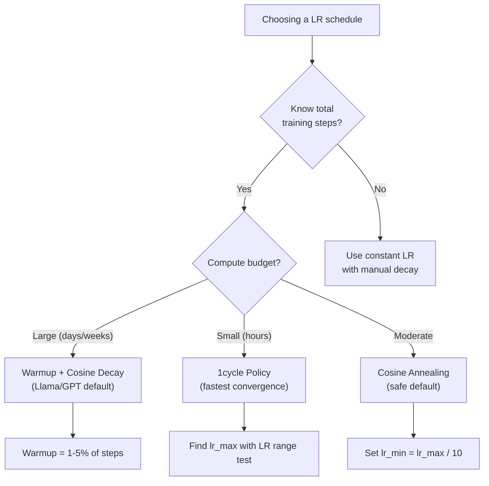

# 学习率计划和热身

> 学习率是最重要的超参数。不是建筑。不是数据集大小。不是激活函数。学习率。如果你不调别的，那就调这个。

**Type:** Build
**Languages:** Python
**Prerequisites:** Lesson 03.06 (Optimizers), Lesson 03.08 (Weight Initialization)
**Time:** ~90 minutes

## 学习目标

- 从头开始实现常数、阶跃衰减、余弦退火、预热+余弦和1周期学习率计划
- 演示学习率选择的三种失效模式：发散（过高）、失速（过低）和振荡（无衰减）
- 解释为什么热身对于基于亚当的优化器是必要的，以及它是如何稳定早期训练的
- 比较同一任务上所有五个时间表的收敛速度，并为给定的训练预算选择合适的时间表

## 这个问题

设置学习速率为0.1。训练发散——损失在3步内跳到无穷大。设置为0.0001。训练爬行——100次之后，模型几乎没有偏离随机。将其设置为0.01。训练工作了50次，然后损失在一个它永远无法达到的最小值附近振荡，因为步数太大了。

最佳学习率并不是一个常数。在训练过程中会发生变化。在早期，你想要大的步伐来快速覆盖地面。在训练的后期，你想要微小的步数达到最小。90%准确度的模型和95%准确度的模型之间的差别通常只是时间表。

过去三年发布的每个主要模型都使用学习率时间表。羊驼3使用峰值lr=3e-4与2000热身步骤和余弦衰减到3e-5。GPT-3使用lr=6e-4，预热超过3.75亿个令牌。这些都不是任意的选择。它们是花费数百万美元进行大规模超参数扫描的结果。

您需要了解日程安排，因为默认设置将无法解决您的问题。当你对预训练模型进行微调时，正确的时间表与从头开始训练是不同的。当您增加批处理大小时，需要更改预热期。当训练在第10,000步中断时，您需要知道这是计划问题还是其他问题。

## 这个概念

### 恒定学习率

最简单的方法。选一个数字，每一步都用它。

```
lr(t) = lr_0
```

很少最佳。对于训练结束（在最小值附近振荡）来说，它要么太高，要么太低（在微小的步骤上浪费计算）。适用于小型模型和调试。对于火车超过一个小时的火车来说，这是一个糟糕的选择。

### 一步衰变

这是ResNet时代的老派方法。在固定的周期内将学习率降低一个因子（通常是10倍）。

```
lr(t) = lr_0 * gamma^(floor(epoch / step_size))
```

其中gamma = 0.1和step_size = 30意味着：lr每30个epoch下降10倍。ResNet-50使用了这种方法——lr=0.1，在迭代30,60和90时下降10倍。

问题是：最优衰减点取决于数据集和体系结构。转移到不同的问题，你需要重新调整何时放弃。这种转变是突然的——当速率突然改变时，损失可能会飙升。

### 余弦退火

从最大学习率平滑衰减到最小学习率，遵循余弦曲线：

```
lr(t) = lr_min + 0.5 * (lr_max - lr_min) * (1 + cos(pi * t / T))
```

其中t是当前步骤，t是总步骤数。

在t=0时，余弦项是1，所以lr = lr_max。在t= t时，余弦项是-1，所以lr = lr_min。衰减在开始时是平缓的，在中间加速，在接近尾声时再次平缓。

这是大多数现代训练的默认设置。除了lr_max和lr_min之外，没有需要调优的超参数。余弦形状与经验观察相匹配，即大多数学习发生在训练的中间——你希望在这个关键时期有合理的步长。

### 热身：为什么要从小处开始

Adam和其他自适应优化器维持梯度均值和方差的运行估计。在第0步，这些估计值初始化为零。前几个梯度更新基于垃圾统计信息。如果在这段时间内你的学习率很大，那么模型就会采取巨大的、不明确的步骤。

热身可以解决这个问题。从一个很小的学习率开始（通常是lr_max / warmup_steps，甚至为零），然后在前N步中线性上升到lr_max。当你达到完全学习率时，亚当的统计数据已经稳定下来。

```
lr(t) = lr_max * (t / warmup_steps)     for t < warmup_steps
```

典型热身：占训练总步数的1-5%。羊驼3训练了约1.8万亿代币，热身了2000步。GPT-3预热了超过3.75亿代币。

### 线性预热+余弦衰减

现代违约。线性上升，然后随余弦衰减：

```
if t < warmup_steps:
    lr(t) = lr_max * (t / warmup_steps)
else:
    progress = (t - warmup_steps) / (total_steps - warmup_steps)
    lr(t) = lr_min + 0.5 * (lr_max - lr_min) * (1 + cos(pi * progress))
```

这就是Llama， GPT， PaLM和大多数现代变压器使用的。热身可以防止早期的不稳定。余弦衰减使模型得到一个很好的最小值。

### 1周期政策

莱斯利·史密斯（Leslie Smith）的发现（2018）：在训练的前半段将学习率从低值提升到高值，然后在后半段将其降下来。违反直觉——为什么你要在中途“提高”学习率？

理论：高学习率通过在优化轨迹中添加噪声来实现正则化。该模型在上升阶段探索了更多的损失景观，找到了更好的盆地。然后在找到的最好的盆地内进行斜坡下降阶段的精炼。

```
Phase 1 (0 to T/2):    lr ramps from lr_max/25 to lr_max
Phase 2 (T/2 to T):    lr ramps from lr_max to lr_max/10000
```

对于固定的计算预算，1周期通常比余弦退火训练更快。权衡：您必须提前知道总步数。

### 时间表的形状

“‘美人鱼
图LR
子图“常数”
C1[“lr”]—C2[“lr”]—C3[“lr”]
结束

子图“阶跃衰减”
S1(“0.1”)——S2(“0.1”)——S3(“0.01”)——S4(“0.001”)
结束

子图“余弦退火”
CS1(“lr_max”)——> CS2(“渐进”)——> CS3(“陡”)——> CS4(“lr_min”)
结束

子图“预热+余弦”
WC1(“0”)——> WC2(“lr_max”)——>魔兽(“余弦”)——> WC4(“lr_min”)
结束
```

### Decision Flowchart



### 来自已发布模型的实数

“‘美人鱼
图道明
子图“已发布的LR配置”
L3[“羊驼3 (405B)<br/>峰值：3e-4<br/>热身：2000步<br/>时间表：余弦至3e-5”]
G3["GPT-3 (175B)<br/>峰值：6e-4<br/>热身：375M令牌<br/>时间表：cos to 0"]
R50["ResNet-50<br/>峰值：0.1<br/>预热：无<br/>时间表：在30,60,90时阶跃衰减x0.1 "]
B[“BERT (340M)<br/>峰值：1e-4<br/>预热：10K步<br/>时间表：线性衰减”]
结束
```

## Build It

### Step 1: Schedule Functions

Each function takes the current step and returns the learning rate at that step.

```python
import math


def constant_schedule(step, lr=0.01, **kwargs):
    return lr


def step_decay_schedule(step, lr=0.1, step_size=100, gamma=0.1, **kwargs):
    return lr * (gamma ** (step // step_size))


def cosine_schedule(step, lr=0.01, total_steps=1000, lr_min=1e-5, **kwargs):
    if step >= total_steps:
        return lr_min
    return lr_min + 0.5 * (lr - lr_min) * (1 + math.cos(math.pi * step / total_steps))


def warmup_cosine_schedule(step, lr=0.01, total_steps=1000, warmup_steps=100, lr_min=1e-5, **kwargs):
    if total_steps <= warmup_steps:
        return lr * (step / max(warmup_steps, 1))
    if step < warmup_steps:
        return lr * step / warmup_steps
    progress = (step - warmup_steps) / (total_steps - warmup_steps)
    return lr_min + 0.5 * (lr - lr_min) * (1 + math.cos(math.pi * progress))


def one_cycle_schedule(step, lr=0.01, total_steps=1000, **kwargs):
    mid = max(total_steps // 2, 1)
    if step < mid:
        return (lr / 25) + (lr - lr / 25) * step / mid
    else:
        progress = (step - mid) / max(total_steps - mid, 1)
        return lr * (1 - progress) + (lr / 10000) * progress
```

### 第二步：可视化所有的时间表

打印一个基于文本的图表，显示每个时间表在训练过程中的演变情况。

”“python
Def visualize_schedule(name, schedule_fn, total_steps=500, **kwargs)：
step = list（range(0, total_steps, total_steps // 20)）
如果total_steps - 1不在steps中：
步骤。追加（total_steps - 1）

LRS = [schedule_fn(s, total_steps=total_steps, **kwargs) for s in steps]
Max_lr = max(lrs) if max(lrs) > 0 else 1.0

打印(f“\ n{名称}:”)
对于s， lr_val在zip(steps, lrs)：
Bar_len = int（lr_val / max_lr * 40）
Bar = "#" * bar_len
print(f"步骤{s:4d}: lr={lr_val：。6 f}{酒吧}”)
```

### Step 3: Training Network

A simple two-layer network on the circle dataset, same as previous lessons, but now we vary the schedule.

```python
import random


def sigmoid(x):
    x = max(-500, min(500, x))
    return 1.0 / (1.0 + math.exp(-x))


def relu(x):
    return max(0.0, x)


def relu_deriv(x):
    return 1.0 if x > 0 else 0.0


def make_circle_data(n=200, seed=42):
    random.seed(seed)
    data = []
    for _ in range(n):
        x = random.uniform(-2, 2)
        y = random.uniform(-2, 2)
        label = 1.0 if x * x + y * y < 1.5 else 0.0
        data.append(([x, y], label))
    return data


def train_with_schedule(schedule_fn, schedule_name, data, epochs=300, base_lr=0.05, **kwargs):
    random.seed(0)
    hidden_size = 8
    total_steps = epochs * len(data)

    std = math.sqrt(2.0 / 2)
    w1 = [[random.gauss(0, std) for _ in range(2)] for _ in range(hidden_size)]
    b1 = [0.0] * hidden_size
    w2 = [random.gauss(0, std) for _ in range(hidden_size)]
    b2 = 0.0

    step = 0
    epoch_losses = []

    for epoch in range(epochs):
        total_loss = 0
        correct = 0

        for x, target in data:
            lr = schedule_fn(step, lr=base_lr, total_steps=total_steps, **kwargs)

            z1 = []
            h = []
            for i in range(hidden_size):
                z = w1[i][0] * x[0] + w1[i][1] * x[1] + b1[i]
                z1.append(z)
                h.append(relu(z))

            z2 = sum(w2[i] * h[i] for i in range(hidden_size)) + b2
            out = sigmoid(z2)

            error = out - target
            d_out = error * out * (1 - out)

            for i in range(hidden_size):
                d_h = d_out * w2[i] * relu_deriv(z1[i])
                w2[i] -= lr * d_out * h[i]
                for j in range(2):
                    w1[i][j] -= lr * d_h * x[j]
                b1[i] -= lr * d_h
            b2 -= lr * d_out

            total_loss += (out - target) ** 2
            if (out >= 0.5) == (target >= 0.5):
                correct += 1
            step += 1

        avg_loss = total_loss / len(data)
        accuracy = correct / len(data) * 100
        epoch_losses.append(avg_loss)

    return epoch_losses
```

### 第四步：比较所有时间表

用每个调度训练相同的网络，并比较最终的损失和收敛行为。

”“python
def compare_schedules(数据):
Configs = [
（"Constant", constant_schedule, {}），
（"Step Decay", step_decay_schedule, {"step_size": 15000, "gamma": 0.1}），
（" cos ", cosine_schedule, {"lr_min": 1e-5}），
（"Warmup+Cosine", warmup_cosine_schedule, {"warmup_steps": 3000, "lr_min": 1e-5}），
（"1cycle", one_cycle_schedule, {}），
］

打印(f“\ n{“时间表”:< 20}{“开始损失”:> 12}{“中期损失”:> 12}{“损失终结”:> 12}{“最好的损失”:> 12}”)
打印（"-" * 70）

对于配置中的名称，schedule_fn, extra_kwargs：
loss = train_with_schedule（schedule_fn, name, data, epochs=300, base_lr=0.05, **extra_kwargs）
Mid_idx = len(losses) //
最佳=最小损失
打印(f”{名称:< 20}{损失[0]:> 12.6 f}{损失(mid_idx): > 12.6 f}{损失[1]:> 12.6 f}{最好:> 12.6 f}”)
```

### Step 5: LR Too High vs Too Low

Demonstrate the three failure modes: too high (divergence), too low (crawling), and just right.

```python
def lr_sensitivity(data):
    learning_rates = [1.0, 0.1, 0.01, 0.001, 0.0001]

    print("\nLR Sensitivity (constant schedule, 100 epochs):")
    print(f"  {'LR':>10} {'Start Loss':>12} {'End Loss':>12} {'Status':>15}")
    print("  " + "-" * 52)

    for lr in learning_rates:
        losses = train_with_schedule(constant_schedule, f"lr={lr}", data, epochs=100, base_lr=lr)
        start = losses[0]
        end = losses[-1]

        if end > start or math.isnan(end) or end > 1.0:
            status = "DIVERGED"
        elif end > start * 0.9:
            status = "BARELY MOVED"
        elif end < 0.15:
            status = "CONVERGED"
        else:
            status = "LEARNING"

        end_str = f"{end:.6f}" if not math.isnan(end) else "NaN"
        print(f"  {lr:>10.4f} {start:>12.6f} {end_str:>12} {status:>15}")
```

## 使用它

中的调度器

”“python
进口火炬
进口火炬。Optim就是Optim
从torch.optim。lr_scheduler import CosineAnnealingLR, OneCycleLR, stepplr

model = nn. sequential （nn.）线性（10,64），nn。ReLU(),神经网络。1)线性(64)
优化器=优化器。参数(),lr = 3)的军医

scheduler = CosineAnnealingLR（optimizer, T_max=1000, eta_min=1e-5）

对于步长范围（1000）：
Loss = train_step（model, optimizer）
scheduler.step ()
```

For warmup + cosine, use a lambda scheduler or the `get_cosine_schedule_with_warmup` from HuggingFace:

```python
from transformers import get_cosine_schedule_with_warmup

scheduler = get_cosine_schedule_with_warmup(
    optimizer,
    num_warmup_steps=2000,
    num_training_steps=100000,
)
```

HuggingFace函数是大多数Llama和GPT微调脚本使用的函数。当有疑问时，使用热身+余弦，热身=总步数的3-5%。它几乎适用于所有事情。

## 船这

这一课产生：
- Z0

## 练习

1. 实现指数衰减：lr(t) = lr_0 * gamma^t，其中gamma = 0.999。与圆数据集上的余弦退火比较。

2. 执行学习率范围测试（Leslie Smith）：训练几百步，同时将LR从1e-7指数增加到1。地块损失vs LR。最优最大LR恰好在损耗开始增加之前。

3. 热身+余弦训练，但要改变热身长度：总步数的0%、1%、5%、10%、20%。找到训练最稳定的最佳点。

4. 用热重启（SGDR）实现余弦退火：每T步将学习率重置为lr_max，并再次衰减。与标准余弦在更长的训练中比较。

5. 建立一个“计划外科医生”，监控训练损失，并在损失稳定时自动从热身切换到余弦，如果损失稳定时间过长，则降低lr。

## 关键术语

| Term | What people say | What it actually means |
|------|----------------|----------------------|
| Learning rate | "How fast the model learns" | The scalar that multiplies the gradient to determine the parameter update size |
| Schedule | "Change the LR over time" | A function that maps training step to learning rate, designed to optimize convergence |
| Warmup | "Start with a small LR" | Linearly ramping the LR from near-zero to the target value over the first N steps to stabilize optimizer statistics |
| Cosine annealing | "Smooth LR decay" | Decreasing the LR following a cosine curve from lr_max to lr_min over training |
| Step decay | "Drop LR at milestones" | Multiplying the LR by a factor (usually 0.1) at fixed epoch intervals |
| 1cycle policy | "Up then down" | Leslie Smith's method of ramping LR up then down in a single cycle for faster convergence |
| LR range test | "Find the best learning rate" | Training briefly while increasing LR to find the value where loss starts diverging |
| Cosine with warm restarts | "Reset and repeat" | Periodically resetting the LR to lr_max and decaying again (SGDR) |
| Eta min | "The floor for the LR" | The minimum learning rate that the schedule decays to |
| Peak learning rate | "The maximum LR" | The highest LR reached during training, typically after warmup |

## 进一步的阅读

- Loshchilov & Hutter，“SGDR：随机梯度下降与热重启”(2017)-介绍了余弦退火和热重启
- Smith，“超收敛：使用大学习率的神经网络的快速训练”(2018)- 1周期政策论文
- Touvron等人，“羊驼2：开放基础和微调聊天模型”(2023)-记录了大规模使用的热身+余弦时间表
- Goyal等人，“准确，大型Minibatch SGD：在1小时内训练ImageNet”（2017）—大规模批量训练的线性缩放规则和热身