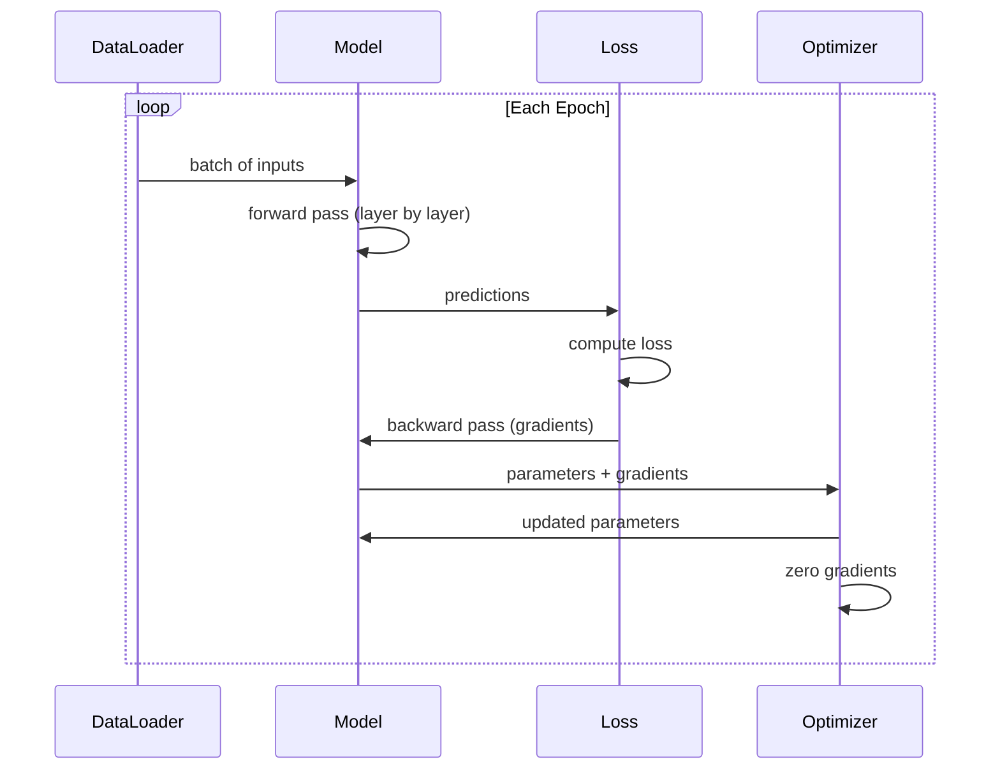

# 构建你自己的迷你框架

> 你已经构建了神经元、层、网络、反向支撑、激活、损失函数、优化器、正则化、初始化和LR调度。都是分开的。现在将它们连接到一个框架中。不是PyTorch。不是TensorFlow。你的。

**Type:** Build
**Languages:** Python
**Prerequisites:** All of Phase 03 (Lessons 01-09)
**Time:** ~120 minutes

## 学习目标

- 用Module， Linear, ReLU, Sigmoid, Dropout, BatchNorm, Sequential, loss functions， optimizer和DataLoader构建一个完整的深度学习框架（~500行）
- 解释模块抽象（向前，向后，参数）以及为什么训练/eval模式切换是必要的
- 将所有组件连接到一个工作训练环路中，该环路训练一个4层网络进行圆分类
- 将框架的每个组件映射到其PyTorch等效组件(nn。模块,神经网络。optim顺序。亚当,DataLoader)

## 这个问题

您有10个关于分散在不同文件中的构建块的教训。A要训练一个网络，你需要从五个不同的课程中复制粘贴，然后手工将它们连接在一起。

这就是框架解决的问题。PyTorch给你TensorFlow给你这些都不是魔法。它们是组织模式，使定义、训练和评估网络成为可能，而不必每次都重新发明管道。

您将在大约500行Python中构建相同的东西。没有numpy。没有外部依赖。一个框架，可以定义任何前馈网络，用SGD或Adam训练它，批处理数据，应用dropout和批处理归一化，使用任何激活，并调度学习率。

当你写完的时候，你就会明白你写的时候发生了什么你会明白为什么你会明白为什么你会明白的，因为这一切都是你建造的。

## 这个概念

### 模块抽象

PyTorch的每一层都继承自模块有三个职责：

1. **forward()**——计算给定输入的输出
2. **parameters()**——返回所有可训练的权重
3. **backward()**——计算梯度（由PyTorch中的autograd处理，在我们的中是显式的）

线性层是一个模块。ReLU激活是一个模块。一个退出层是一个模块。批处理规范化层是一个模块。它们都有相同的界面。

### 顺序容器

Z0转发：通过模块1，然后模块2，然后模块3馈送数据。倒传：倒转链条。容器本身是一个模块——它有forward（）、parameters（）和backward（）。这就是复合模式：一个模块序列本身就是一个模块。

### 培训vs评估模式

Dropout在训练期间随机将神经元归零，但在评估期间将所有神经元都传递出去。批规范化在训练期间使用批统计数据，但在评估期间运行平均值。The每个模块都有一个

### 优化器

优化器使用参数的梯度更新参数。Sgd：Adam：维护动量和方差估计，然后更新。优化器不知道网络体系结构——它只看到参数及其梯度的平面列表。

### DataLoader

批处理很重要有两个原因。首先，对于大型问题，您无法将整个数据集装入内存中。其次，小批量梯度下降提供了有助于逃避局部最小值的噪声。DataLoader将数据分割成批，并可选择在epoch之间进行洗牌。

### 框架体系结构

“‘美人鱼
图道明
子图“模块”
线性[“线性<br/>W*x + b”]
ReLU [" ReLU < br / > max (0, x)”)
乙状结肠["乙状结肠< br / > 1 / (1 + e ^ - x)”)
Dropout[“Dropout<br/>随机零掩码”]
BatchNorm [" BatchNorm < br / >正常激活”)
结束

子图“容器”
顺序(“连锁顺序< br / >模块”)
结束

子图“损失函数”
MSE["MSELoss<br/>(pred - target)^2"]
公元前[" BCELoss < br / >二叉叉”)
结束

子图“优化”
SGD["SGD<br/>param -= lr * grad"]
亚当亚当(“< br / >适应性时刻”)
结束

子图“数据”
DataLoader["DataLoader<br/ b>批处理+ shuffle"]
结束

顺序的——> |“包含”|线性的
顺序——> |“包含”| ReLU
顺序——> |“向前/向后”| MSE
SGD -> |“更新”|顺序
DataLoader——> |“feeds”|顺序
```

### Training Loop



### 模块的层次结构

“‘美人鱼
classDiagram
类模块{
        +转发(x)
        +向后(研究生)
        +参数()
        +培训()
        +eval ()
}

类线性{
        -权重
        -偏见
        +转发(x)
        +向后(研究生)
}

类ReLU {
        +转发(x)
        +向后(研究生)
}

类顺序{
        -模块[]
        +转发(x)
        +向后(研究生)
        +参数()
}

模块<|—线性
Module <|—ReLU
模块<|—顺序
顺序*——模块
```

## Build It

### Step 1: Module Base Class

The abstract interface that every layer implements.

```python
class Module:
    def __init__(self):
        self.training = True

    def forward(self, x):
        raise NotImplementedError

    def backward(self, grad):
        raise NotImplementedError

    def parameters(self):
        return []

    def train(self):
        self.training = True

    def eval(self):
        self.training = False
```

### 步骤2：线性图层

基本构件。存储权重和偏置，向前计算Wx + b，向后计算权重/输入梯度。

”“python
导入数学
进口随机


类线性(模块):
Def __init__(self, fan_in, fan_out)：
super () . __init__ ()
STD = math.sqrt（2.0 / fan_in）
自我。权重= [[random]。高斯（0,std） for _in range(fan_in)] for _in range(fan_out)]
自我。偏差= [0.0]* fan_out
自我。weight_gradients = [[0.0] * fan_in for _in range(fan_out)]
自我。bias_gradients = [0.0] * fan_out
自我。Fan_in = Fan_in
自我。Fan_out = Fan_out
自我。input =无

Def forward(self, x)：
自我。输入= x
输出= []
For I in range(self.fan_out)：
Val = self.biases[i]
对于j在范围（self.fan_in）：
Val += self。权重[i][j] * x[j]
output.append (val)
返回输出

    def backward(self, grad):
        input_grad = [0.0] * self.fan_in
        for i in range(self.fan_out):
            self.bias_grads[i] += grad[i]
            for j in range(self.fan_in):
                self.weight_grads[i][j] += grad[i] * self.input[j]
                input_grad[j] += grad[i] * self.weights[i][j]
        return input_grad

def参数(自我):
参数= []
For I in range(self.fan_out)：
对于j在范围（self.fan_in）：
params.append(自我。权重，i, j, self。weight_gradients))
params.append(自我。bias, i, None, self. bias_gradients))
返回参数
```

### Step 3: Activation Modules

ReLU, Sigmoid, and Tanh as Modules. Each caches what it needs for the backward pass.

```python
class ReLU(Module):
    def __init__(self):
        super().__init__()
        self.mask = None

    def forward(self, x):
        self.mask = [1.0 if v > 0 else 0.0 for v in x]
        return [max(0.0, v) for v in x]

    def backward(self, grad):
        return [g * m for g, m in zip(grad, self.mask)]


class Sigmoid(Module):
    def __init__(self):
        super().__init__()
        self.output = None

    def forward(self, x):
        self.output = []
        for v in x:
            v = max(-500, min(500, v))
            self.output.append(1.0 / (1.0 + math.exp(-v)))
        return self.output

    def backward(self, grad):
        return [g * o * (1 - o) for g, o in zip(grad, self.output)]


class Tanh(Module):
    def __init__(self):
        super().__init__()
        self.output = None

    def forward(self, x):
        self.output = [math.tanh(v) for v in x]
        return self.output

    def backward(self, grad):
        return [g * (1 - o * o) for g, o in zip(grad, self.output)]
```

### 步骤4：退出模块

在训练过程中随机置零元素。将剩余元素按1/(1-p)进行缩放，因此期望值保持不变。在eval期间什么都不做。

”“python
类辍学(模块):
Def __init__(self, p=0.5)：
super () . __init__ ()
自我。P = P
自我。mask =无

Def forward(self, x)：
如果不能自我训练：
返回x
自我。Mask =[0.0如果random.random() < self。P else 1.0 / (1 - self)。P) for _ in x]
返回[v * m for v， m in zip(x, self.mask)]

Def backward(self, grad)：
如果自我。mask为None：
返回研究生
返回[g * m for g， m in zip(grad, self.mask)]
```

### Step 5: BatchNorm Module

Normalizes activations to zero mean and unit variance per feature across the batch. Maintains running statistics for eval mode.

```python
class BatchNorm(Module):
    def __init__(self, size, momentum=0.1, eps=1e-5):
        super().__init__()
        self.size = size
        self.gamma = [1.0] * size
        self.beta = [0.0] * size
        self.gamma_grads = [0.0] * size
        self.beta_grads = [0.0] * size
        self.running_mean = [0.0] * size
        self.running_var = [1.0] * size
        self.momentum = momentum
        self.eps = eps
        self.x_norm = None
        self.std_inv = None
        self.batch_input = None

    def forward_batch(self, batch):
        batch_size = len(batch)
        output_batch = []

        if self.training:
            mean = [0.0] * self.size
            for sample in batch:
                for j in range(self.size):
                    mean[j] += sample[j]
            mean = [m / batch_size for m in mean]

            var = [0.0] * self.size
            for sample in batch:
                for j in range(self.size):
                    var[j] += (sample[j] - mean[j]) ** 2
            var = [v / batch_size for v in var]

            self.std_inv = [1.0 / math.sqrt(v + self.eps) for v in var]

            self.x_norm = []
            self.batch_input = batch
            for sample in batch:
                normed = [(sample[j] - mean[j]) * self.std_inv[j] for j in range(self.size)]
                self.x_norm.append(normed)
                output = [self.gamma[j] * normed[j] + self.beta[j] for j in range(self.size)]
                output_batch.append(output)

            for j in range(self.size):
                self.running_mean[j] = (1 - self.momentum) * self.running_mean[j] + self.momentum * mean[j]
                self.running_var[j] = (1 - self.momentum) * self.running_var[j] + self.momentum * var[j]
        else:
            std_inv = [1.0 / math.sqrt(v + self.eps) for v in self.running_var]
            for sample in batch:
                normed = [(sample[j] - self.running_mean[j]) * std_inv[j] for j in range(self.size)]
                output = [self.gamma[j] * normed[j] + self.beta[j] for j in range(self.size)]
                output_batch.append(output)

        return output_batch

    def forward(self, x):
        result = self.forward_batch([x])
        return result[0]

    def backward(self, grad):
        if self.x_norm is None:
            return grad
        for j in range(self.size):
            self.gamma_grads[j] += self.x_norm[0][j] * grad[j]
            self.beta_grads[j] += grad[j]
        return [grad[j] * self.gamma[j] * self.std_inv[j] for j in range(self.size)]

    def parameters(self):
        params = []
        for j in range(self.size):
            params.append((self.gamma, j, None, self.gamma_grads))
            params.append((self.beta, j, None, self.beta_grads))
        return params
```

### 步骤6：顺序容器

链模块。前进从左到右，后退从右到左。

”“python
类顺序(模块):
Def __init__(self, *modules)：
super () . __init__ ()
自我。Modules = list（模块）

Def forward(self, x)：
对于self.modules中的module：
X = module.forward(X)
返回x

Def backward(self, grad)：
对于反向模块（self.modules）：
Grad = module.backward（Grad）
返回研究生

def参数(自我):
参数= []
对于self.modules中的module：
params.extend (module.parameters ())
返回参数

def火车(自我):
自我。training = True
对于self.modules中的module：
module.train ()

def eval(自我):
自我。训练=假
对于self.modules中的module：
module.eval ()
```

### Step 7: Loss Functions

MSE and Binary Cross-Entropy. Each returns the loss value and provides a backward() that returns the gradient.

```python
class MSELoss:
    def __call__(self, predicted, target):
        self.predicted = predicted
        self.target = target
        n = len(predicted)
        self.loss = sum((p - t) ** 2 for p, t in zip(predicted, target)) / n
        return self.loss

    def backward(self):
        n = len(self.predicted)
        return [2 * (p - t) / n for p, t in zip(self.predicted, self.target)]


class BCELoss:
    def __call__(self, predicted, target):
        self.predicted = predicted
        self.target = target
        eps = 1e-7
        n = len(predicted)
        self.loss = 0
        for p, t in zip(predicted, target):
            p = max(eps, min(1 - eps, p))
            self.loss += -(t * math.log(p) + (1 - t) * math.log(1 - p))
        self.loss /= n
        return self.loss

    def backward(self):
        eps = 1e-7
        n = len(self.predicted)
        grads = []
        for p, t in zip(self.predicted, self.target):
            p = max(eps, min(1 - eps, p))
            grads.append((-t / p + (1 - t) / (1 - p)) / n)
        return grads
```

### 步骤8:SGD和Adam optimizer

两者都接受参数列表并使用梯度更新权重。

”“python
类SGD:
Def __init__(self, parameters, lr=0.01)：
自我。参数=参数
自我。Lr = Lr

def步骤(自我):
对于self.params中的容器，i, j, grad_container：
如果j不为None：
容器[i][j] -= self。Lr * grad_container[i][j]
其他:
容器[i] -= self。* grad_container[i]

def zero_grad(自我):
对于self.params中的容器，i, j, grad_container：
如果j不为None：
Grad_container [i][j] = 0.0
其他:
Grad_container [i] = 0.0


类亚当:
Def __init__(self, parameters, lr=0.001, beta1=0.9, beta2=0.999, eps=1e-8)：
自我。参数=参数
自我。Lr = Lr
自我。a1 = a1
自我。a2 = a2
自我。Eps = Eps
自我。T = 0
自我。M = [0.0] * len（参数）
自我。V = [0.0] * len（参数）

def步骤(自我):
自我。T += 1
对于idx， （container, i, j, grad_container）在enumerate（self.params）中：
如果j不为None：
G = grad_container[i][j]
其他:
G = grad_container[i]

自我。M [idx] = self。* self。M [idx] + (1 - self。(1) * g
自我。V [idx] =自我。bet2 * self。V [idx] + (1 - self。(2) * g * g

M_hat = self。M [idx] / (1 - self。** * self.t)
V_hat = self。V [idx] / (1 - self。bet2 ** self.t)

更新=自我。Lr * m_hat /（数学）Sqrt (v_hat) + self.eps)

如果j不为None：
容器[i][j] -= update
其他:
Container [i] -= update

def zero_grad(自我):
对于self.params中的容器，i, j, grad_container：
如果j不为None：
Grad_container [i][j] = 0.0
其他:
Grad_container [i] = 0.0
```

### Step 9: DataLoader

Splits data into batches, optionally shuffles each epoch.

```python
class DataLoader:
    def __init__(self, data, batch_size=32, shuffle=True):
        self.data = data
        self.batch_size = batch_size
        self.shuffle = shuffle

    def __iter__(self):
        indices = list(range(len(self.data)))
        if self.shuffle:
            random.shuffle(indices)
        for start in range(0, len(indices), self.batch_size):
            batch_indices = indices[start:start + self.batch_size]
            batch = [self.data[i] for i in batch_indices]
            inputs = [item[0] for item in batch]
            targets = [item[1] for item in batch]
            yield inputs, targets

    def __len__(self):
        return (len(self.data) + self.batch_size - 1) // self.batch_size
```

### 步骤10：在圆分类上训练一个4层网络

把所有东西连接起来。定义一个模型，选择一个损失，选择一个优化器，运行训练循环。

”“python
Def make_circle_data(n=500, seed=42)：
random.seed(种子)
数据= []
对于范围(n)中的_：
X =随机。制服(2,2)
Y =随机。制服(2,2)
标签= 1.0如果x * x + y * y < 1.5否则0.0
数据。追加（([x, y], [label])）
返回数据


def火车():
random.seed (42)

模型=顺序的(
线性(16),
ReLU (),
线性(16日16),
ReLU (),
线性(16日8),
ReLU (),
线性(8,1),
乙状结肠(),
）

criterion = BCELoss（）
优化器=亚当（模型）。参数(),lr = 0.01)

数据= make_circle_data（500）
Split = int（len(data) * 0.8）
Train_data = data[:split]
Test_data = data[split:]

loader = DataLoader（train_data, batch_size=16, shuffle=True）

model.train ()

对于范围（100）内的epoch：
Total_loss = 0
Total_correct = 0
Total_samples = 0

对于装载器中的batch_inputs， batch_targets：
Batch_loss = 0
对于x， t在zip（batch_inputs, batch_targets）中：
Pred = model.forward(x)
损失=判据（pred, t）
Batch_loss += loss

optimizer.zero_grad ()
Grad = criterion.backward（）
model.backward(研究生)
optimizer.step ()

Predicted_class = 1.0如果pred[0] >= 0.5否则0.0
如果predicted_class == t[0]：
Total_correct += 1
Total_samples += 1

Total_loss += batch_loss

Avg_loss = total_loss / total_samples
Accuracy = total_correct / total_samples * 100

如果epoch % 10 == 0或epoch == 99：
print(f"Epoch {Epoch:3d} | Loss: {avg_loss：。6f} |训练精度：{精度：.1f}%")

model.eval ()
正确= 0
对于test_data中的x， t：
Pred = model.forward(x)
Predicted_class = 1.0如果pred[0] >= 0.5否则0.0
如果predicted_class == t[0]：
正确+= 1
Test_accuracy = correct / len(test_data) * 100
打印(f"\nTest精度：{test_精度：。正确1 f} % ({} / {len (test_data)})”)

返回模型test_accuracy
```

## Use It

Here is the PyTorch equivalent of what you just built:

```python
import torch
import torch.nn as nn
from torch.utils.data import DataLoader, TensorDataset

model = nn.Sequential(
    nn.Linear(2, 16),
    nn.ReLU(),
    nn.Linear(16, 16),
    nn.ReLU(),
    nn.Linear(16, 8),
    nn.ReLU(),
    nn.Linear(8, 1),
    nn.Sigmoid(),
)

criterion = nn.BCELoss()
optimizer = torch.optim.Adam(model.parameters(), lr=0.01)

for epoch in range(100):
    model.train()
    for inputs, targets in dataloader:
        optimizer.zero_grad()
        predictions = model(inputs)
        loss = criterion(predictions, targets)
        loss.backward()
        optimizer.step()

    model.eval()
    with torch.no_grad():
        test_predictions = model(test_inputs)
```

结构是一样的。`Sequential`, `Linear`, `ReLU`, `Sigmoid`, `BCELoss`, `Adam`, `zero_grad`, `backward`, `step`, `train`, `eval`. 每个概念都是一一对应的。不同之处在于PyTorch自动处理autograd（不需要在每个模块中实现backward()），运行在GPU上，并且已经优化了多年。但骨头是一样的。

现在，当您看到PyTorch代码时，您确切地知道每行发生了什么。这种理解是关键所在。

## 船这

这一课产生：
- Z0

## 练习

1. 添加一个Softmax预测，计算交叉熵损失，并处理组合的向后传递。在一个3类螺旋数据集上测试它。

2. 在优化器中实现学习率调度：增加一个用热身+余弦训练圆分类器，并与常数LR进行比较。

3. 添加一个验证加载的模型是否产生与原始模型相同的预测。

4. 在Adam优化器中实现权重衰减（L2正则化）。添加一个比较训练与衰减=0和衰减=0.01。

5. 用适当的小批梯度积累代替每样本训练循环：在一个批中积累所有样本的梯度，然后除以批大小并采取一个优化步骤。衡量这是否改变了收敛速度。

## 关键术语

| Term | What people say | What it actually means |
|------|----------------|----------------------|
| Module | "A layer" | The base abstraction in a framework -- anything with forward(), backward(), and parameters() |
| Sequential | "Stack layers in order" | A container that chains modules, applying them in sequence for forward and reverse for backward |
| Forward pass | "Run the network" | Computing the output by passing input through each module in order |
| Backward pass | "Compute gradients" | Propagating the loss gradient through each module in reverse to compute parameter gradients |
| Parameters | "The trainable weights" | All values in the network that the optimizer can update -- weights and biases |
| Optimizer | "The thing that updates weights" | An algorithm that uses gradients to update parameters, implementing SGD, Adam, or other rules |
| DataLoader | "The thing that feeds data" | An iterator that splits a dataset into batches, optionally shuffling between epochs |
| Training mode | "model.train()" | A flag that enables stochastic behavior like dropout and batch normalization with batch stats |
| Evaluation mode | "model.eval()" | A flag that disables dropout and uses running statistics for batch normalization |
| Zero grad | "Clear the gradients" | Resetting all parameter gradients to zero before computing the next batch's gradients |

## 进一步的阅读

- Paszke等人，“PyTorch：一种命令式、高性能的深度学习库”（2019）——描述PyTorch设计决策的论文
- Chollet，“Python深度学习，第二版”（2021）——第3章介绍了具有相同模块/层抽象的Keras内部结构
- Johnson，“Tiny-DNN”（https://github.com/tiny-dnn/tiny-dnn）——一个仅标头的c++深度学习框架，用于理解框架内部