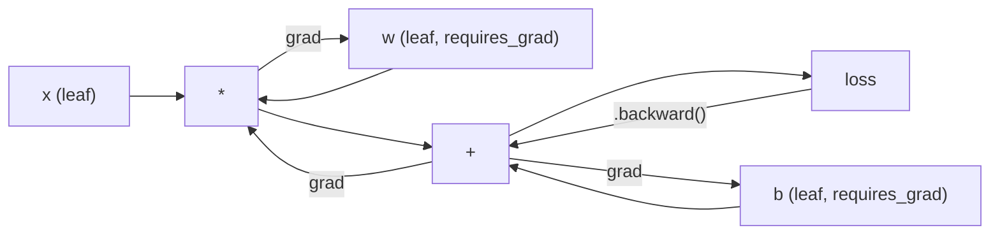

# PyTorch简介

> 你用活塞和曲轴制造了引擎。现在学大家都开的那辆。

**Type:** Build
**Languages:** Python
**Prerequisites:** Lesson 03.10 (Build Your Own Mini Framework)
**Time:** ~75 minutes

## 学习目标

- 使用PyTorch的nn构建和训练神经网络。模块,神经网络。顺序的和自动的
- 使用PyTorch张量，GPU加速和标准训练循环（zero_grad, forward, loss, backward, step）
- 将从头开始的迷你框架组件转换为它们的PyTorch等效组件
- 配置文件并比较纯python框架和PyTorch在同一任务上的训练速度

## 这个问题

你有了一个可以工作的迷你框架。线性层，ReLU, dropout，批规范，Adam, DataLoader，训练循环。它在纯Python中针对一个圆分类问题训练了一个4层网络。

在同样的问题上，它也比PyTorch慢500倍。

您的迷你框架使用嵌套的Python循环一次处理一个示例。PyTorch将相同的操作分派给运行在GPU上的优化的c++ /CUDA内核。在单个NVIDIA A100上，PyTorch在ImageNet（128万张图像）上训练ResNet-50（25.6万个参数）大约6小时。您的框架在执行相同的任务时大约需要3000个小时——如果它没有首先耗尽内存的话。

速度并不是唯一的差距。你的框架没有GPU支持。没有自动区分——您为每个模块手工编写了backward（）。没有序列化。没有分布式训练。没有混合精度。没有print语句就无法调试梯度流。

PyTorch填补了这些空白。并且它在保持您已经构建的完全相同的心智模型的同时做到了这一点：模块、forward（）、parameters（）、backward（）、optimizer.step（）。概念一对一地传递。语法几乎完全相同。不同之处在于，PyTorch在您从零开始设计的同一个接口背后包装了十年的系统工程。

## 这个概念

### PyTorch获胜的原因

在2015年，TensorFlow要求你在运行任何东西之前定义一个静态计算图。你建立了图表，编译了它，然后通过它输入数据。调试意味着盯着图形可视化。改变架构意味着从头开始重建图。

PyTorch在2017年推出了一种不同的理念：渴望执行。你写Python。它立即运行。`y = model(x)` actually computes y right now, not "add a node to a graph that will compute y later." 这意味着标准的Python调试工具可以正常工作。print()。pdb工作。如果/否则你的前传成功了。

到2020年，市场已经说话了。PyTorch在机器学习研究论文中的份额从2017年的7%上升到2022年的75%以上。Meta、谷歌DeepMind、OpenAI、Anthropic和hugs Face都使用PyTorch作为它们的主要框架。TensorFlow 2。x采用了急切执行作为回应——默认PyTorch的设计是正确的。

教训是：开发人员的经验是复杂的。每次调试速度慢10%但快50%的框架都是赢家。

### 张量

张量是具有三个关键属性的多维数组：形状、类型和设备。

”“python
进口火炬

X =火炬。0 (3,4) # shape: (3,4), dtype: float32, device: CPU
X =火炬。randn(2,3,224, 224) #批处理2张RGB图像，224x224
X =火炬。张量（[1,2,3]）#从Python列表
```

**Shape** is the dimensionality. A scalar is shape (), a vector is (n,), a matrix is (m, n), a batch of images is (batch, channels, height, width).

**Dtype** controls precision and memory.

| dtype | Bits | Range | Use case |
|-------|------|-------|----------|
| float32 | 32 | ~7 decimal digits | Default training |
| float16 | 16 | ~3.3 decimal digits | Mixed precision |
| bfloat16 | 16 | Same range as float32, less precision | LLM training |
| int8 | 8 | -128 to 127 | Quantized inference |

**Device** determines where computation happens.

```python
device = torch.device("cuda" if torch.cuda.is_available() else "cpu")
x = torch.randn(3, 4, device=device)
x = x.to("cuda")
x = x.cpu()
```

每个操作都需要同一设备上的所有张量。这是初学者常犯的PyTorch错误：通过在计算前将所有内容移到同一设备来修复它。

**重塑**是常数时间——它改变元数据，而不是数据。

”“python
X =火炬。Randn （2,3,4）
X.view(2,12) #重塑为（2,12）——必须是连续的
x.重塑（6,4）#重塑到（6,4）——总是有效
X.permute (2,0,1) # reorder dimensions
X.unsqueeze (0) # add dimension: （1,2,3,4）
X.squeeze() #删除尺寸为1的尺寸
```

### Autograd

Your mini framework required you to implement backward() for every module. PyTorch does not. It records every operation on tensors into a directed acyclic graph (the computational graph) and then traverses that graph in reverse to compute gradients automatically.



与您的框架的关键区别：PyTorch使用基于磁带的自动diff。在向前传递期间，每个操作都附加到“磁带”上。呼叫

”“python
X =火炬。requires_grad = True randn (3)
Y = x ** 2 + 3 * x
Z = y.sum（）
z.backward ()
打印(x。# dz/dx = 2x + 3
```

Three rules of autograd:

1. Only leaf tensors with `requires_grad=True` accumulate gradients
2. Gradients accumulate by default -- call `optimizer.zero_grad()` before each backward pass
3. `torch.no_grad()` disables gradient tracking (use during evaluation)

### nn.Module

`nn.Module` is the base class for every neural network component in PyTorch. You already built this abstraction in Lesson 10. PyTorch's version adds automatic parameter registration, recursive module discovery, device management, and state dict serialization.

```python
import torch.nn as nn

class MLP(nn.Module):
    def __init__(self, input_dim, hidden_dim, output_dim):
        super().__init__()
        self.layer1 = nn.Linear(input_dim, hidden_dim)
        self.relu = nn.ReLU()
        self.layer2 = nn.Linear(hidden_dim, output_dim)

    def forward(self, x):
        x = self.layer1(x)
        x = self.relu(x)
        x = self.layer2(x)
        return x
```

当你分配`model.parameters()` recursively collects every registered parameter. 这就是为什么您不必像在迷你框架中那样手动收集权重。

主要构建模块：

| Module | What it does | Parameters |
|--------|-------------|------------|
| nn.Linear(in, out) | Wx + b | in*out + out |
| nn.Conv2d(in_ch, out_ch, k) | 2D convolution | in_ch*out_ch*k*k + out_ch |
| nn.BatchNorm1d(features) | Normalize activations | 2 * features |
| nn.Dropout(p) | Random zeroing | 0 |
| nn.ReLU() | max(0, x) | 0 |
| nn.GELU() | Gaussian error linear | 0 |
| nn.Embedding(vocab, dim) | Lookup table | vocab * dim |
| nn.LayerNorm(dim) | Per-sample normalization | 2 * dim |

### 损失函数和优化器

PyTorch提供了您构建的所有内容的生产就绪版本。

**损失函数**(从

| Loss | Task | Input |
|------|------|-------|
| nn.MSELoss() | Regression | Any shape |
| nn.CrossEntropyLoss() | Multi-class classification | Logits (not softmax) |
| nn.BCEWithLogitsLoss() | Binary classification | Logits (not sigmoid) |
| nn.L1Loss() | Regression (robust) | Any shape |
| nn.CTCLoss() | Sequence alignment | Log probabilities |

注：传递原始logits，而不是softmax输出。这是一个常见的错误，无声地产生错误的梯度。

**优化器** (from

| Optimizer | When to use | Typical LR |
|-----------|-------------|-----------|
| SGD(params, lr, momentum) | CNNs, well-tuned pipelines | 0.01--0.1 |
| Adam(params, lr) | Default starting point | 1e-3 |
| AdamW(params, lr, weight_decay) | Transformers, fine-tuning | 1e-4--1e-3 |
| LBFGS(params) | Small-scale, second-order | 1.0 |

### 训练循环

每个PyTorch训练循环都遵循相同的5步模式。你们已经从第10课知道了。

“‘美人鱼
sequenceDiagram
参与者D作为数据加载器
参与者M作为模型
参与者L为损失fn
参与者O作为优化者

循环每个纪元
M: batch = next（dataloader）
M->>L：预测=模型（批）
L：损失=标准（预测，目标）
L - > > M: loss.backward ()
O - > > M: optimizer.step ()
O - > > O: optimizer.zero_grad ()
结束
```

The canonical pattern:

```python
for epoch in range(num_epochs):
    model.train()
    for inputs, targets in train_loader:
        inputs, targets = inputs.to(device), targets.to(device)
        optimizer.zero_grad()
        outputs = model(inputs)
        loss = criterion(outputs, targets)
        loss.backward()
        optimizer.step()
```

批处理循环中的五行。训练GPT-4， Stable Diffusion和LLaMA的五条线。架构改变了。数据变化。这五行则不然。

### 数据集和数据加载器

PyTorch的`DataLoader` wraps it with batching, shuffling, and multi-process data loading.

”“python
从torch.utils.data导入数据集，DataLoader

类MNISTDataset(数据):
Def __init__(self, images, labels)：
自我。Images = Images
自我。标签=标签

def __len__(自我):
返回len (self.labels)

Def __getitem__(self, idx)：
回归自我。图像(idx) self.labels [idx]

loader = DataLoader（dataset, batch_size=64, shuffle=True, num_workers=4）
```

`num_workers=4` spawns 4 processes to load data in parallel while the GPU trains on the current batch. On disk-bound workloads (large images, audio), this alone can double training speed.

### GPU Training

Moving a model to GPU:

```python
device = torch.device("cuda" if torch.cuda.is_available() else "cpu")
model = model.to(device)
```

这递归地将每个参数和缓冲区移动到GPU。然后在训练时移动每批：

”“python
输入，目标=输入。(设备),targets.to(设备)
```

**Mixed precision** halves memory usage and doubles throughput on modern GPUs (A100, H100, RTX 4090) by running forward/backward in float16 while keeping the master weights in float32:

```python
from torch.amp import autocast, GradScaler

scaler = GradScaler()
for inputs, targets in loader:
    with autocast(device_type="cuda"):
        outputs = model(inputs)
        loss = criterion(outputs, targets)
    scaler.scale(loss).backward()
    scaler.step(optimizer)
    scaler.update()
    optimizer.zero_grad()
```

### 比较：Mini Framework vs PyTorch vs JAX

| Feature | Mini Framework (L10) | PyTorch | JAX |
|---------|---------------------|---------|-----|
| Autodiff | Manual backward() | Tape-based autograd | Functional transforms |
| Execution | Eager (Python loops) | Eager (C++ kernels) | Traced + JIT compiled |
| GPU support | No | Yes (CUDA, ROCm, MPS) | Yes (CUDA, TPU) |
| Speed (MNIST MLP) | ~300s/epoch | ~0.5s/epoch | ~0.3s/epoch |
| Module system | Custom Module class | nn.Module | Stateless functions (Flax/Equinox) |
| Debugging | print() | print(), pdb, breakpoint() | Harder (JIT tracing breaks print) |
| Ecosystem | None | Hugging Face, Lightning, timm | Flax, Optax, Orbax |
| Learning curve | You built it | Moderate | Steep (functional paradigm) |
| Production use | Toy problems | Meta, OpenAI, Anthropic, HF | Google DeepMind, Midjourney |

## 构建它

一个仅使用PyTorch原语在MNIST上训练的3层MLP。没有高级包装器。不我们自己下载并解析原始数据。

### 步骤1：从原始文件加载MNIST

MNIST提供4个压缩文件：训练图像（60,000 x 28 x 28），训练标签，测试图像（10,000 x 28 x 28），测试标签。我们下载它们并解析二进制格式。

”“python
进口火炬
进口火炬。Nn as Nn
进口结构
进口gzip
进口urllib.request
进口操作系统

def download_mnist =“。/ mnist_data”(路径):
Base_url = “https://storage.googleapis.com/cvdf-datasets/mnist/”
文件= [
“train-images-idx3-ubyte.gz”,
“train-labels-idx1-ubyte.gz”,
“t10k-images-idx3-ubyte.gz”,
“t10k-labels-idx1-ubyte.gz”,
］
操作系统。makedirs(路径,exist_ok = True)
对于f in文件：
Filepath = os.path。加入(路径,f)
如果不是os.path.exists(filepath)：
urllib.request。Urlretrieve （base_url + f, filepath）

def load_images (filepath):
gzip。打开（文件路径，“rb”）作为f：
Magic, num, rows, cols = struct。解压缩(“> IIII”,f.read (16))
Data = f.read（）
Images = torch.frombuffer（bytearray(data), dtype=torch.uint8）
图像=图像。重塑（num, rows * cols）。Float () / 255.0
返回图片

def load_labels (filepath):
gzip。打开（文件路径，“rb”）作为f：
Magic, num = struct。解压缩(“> II”,f.read (8))
Data = f.read（）
label = torch.frombuffer(bytearray(data), dtype=torch.uint8).long（）
返回标签
```

### Step 2: Define the Model

A 3-layer MLP: 784 -> 256 -> 128 -> 10. ReLU activations. Dropout for regularization. No batch norm to keep it simple.

```python
class MNISTModel(nn.Module):
    def __init__(self):
        super().__init__()
        self.net = nn.Sequential(
            nn.Linear(784, 256),
            nn.ReLU(),
            nn.Dropout(0.2),
            nn.Linear(256, 128),
            nn.ReLU(),
            nn.Dropout(0.2),
            nn.Linear(128, 10),
        )

    def forward(self, x):
        return self.net(x)
```

输出层产生10个原始logit（每个数字一个）。没有softmax——

参数个数：784*256 + 256 + 256*128 + 128 + 128*10 + 10 = 235,146。以现代标准来看是很小的。GPT-2小有124M。这只需要几秒钟。

### 步骤3：循环训练

典型的前进-损失-后退模式。

”“python
Def train_one_epoch(model, loader, criterion, optimizer, device)：
model.train ()
Total_loss = 0
正确= 0
合计= 0
对于图像，加载器中的标签：
图像，标签=图像。(设备),labels.to(设备)
optimizer.zero_grad ()
输出=模型（图像）
损失=标准（输出，标签）
loss.backward ()
optimizer.step ()
Total_loss += loss.item() * images.size(0)
_, predict = output .max(1)
Correct += predicded .eq(labels).sum().item（）
Total += labels.size(0)
返回total_loss / total， correct / total


Def evaluate(model, loader, criterion, device)：
model.eval ()
Total_loss = 0
正确= 0
合计= 0
与torch.no_grad ():
对于图像，加载器中的标签：
图像，标签=图像。(设备),labels.to(设备)
输出=模型（图像）
损失=标准（输出，标签）
Total_loss += loss.item() * images.size(0)
_, predict = output .max(1)
Correct += predicded .eq(labels).sum().item（）
Total += labels.size(0)
返回total_loss / total， correct / total
```

Note `torch.no_grad()` during evaluation. This disables autograd, reducing memory usage and speeding up inference. Without it, PyTorch builds a computational graph you never use.

### Step 4: Wire Everything Together

```python
def main():
    device = torch.device("cuda" if torch.cuda.is_available() else "cpu")

    download_mnist()
    train_images = load_images("./mnist_data/train-images-idx3-ubyte.gz")
    train_labels = load_labels("./mnist_data/train-labels-idx1-ubyte.gz")
    test_images = load_images("./mnist_data/t10k-images-idx3-ubyte.gz")
    test_labels = load_labels("./mnist_data/t10k-labels-idx1-ubyte.gz")

    train_dataset = torch.utils.data.TensorDataset(train_images, train_labels)
    test_dataset = torch.utils.data.TensorDataset(test_images, test_labels)
    train_loader = torch.utils.data.DataLoader(
        train_dataset, batch_size=64, shuffle=True
    )
    test_loader = torch.utils.data.DataLoader(
        test_dataset, batch_size=256, shuffle=False
    )

    model = MNISTModel().to(device)
    criterion = nn.CrossEntropyLoss()
    optimizer = torch.optim.Adam(model.parameters(), lr=1e-3)

    num_params = sum(p.numel() for p in model.parameters())
    print(f"Device: {device}")
    print(f"Parameters: {num_params:,}")
    print(f"Train samples: {len(train_dataset):,}")
    print(f"Test samples: {len(test_dataset):,}")
    print()

    for epoch in range(10):
        train_loss, train_acc = train_one_epoch(
            model, train_loader, criterion, optimizer, device
        )
        test_loss, test_acc = evaluate(
            model, test_loader, criterion, device
        )
        print(
            f"Epoch {epoch+1:2d} | "
            f"Train Loss: {train_loss:.4f} | Train Acc: {train_acc:.4f} | "
            f"Test Loss: {test_loss:.4f} | Test Acc: {test_acc:.4f}"
        )

    torch.save(model.state_dict(), "mnist_mlp.pt")
    print(f"\nModel saved to mnist_mlp.pt")
    print(f"Final test accuracy: {test_acc:.4f}")
```

10次循环后的预期输出：测试精度~97.8%。CPU上的训练时间：~30秒。GPU上：~5秒。在具有相同架构的小型框架上：~45分钟。

## 使用它

### 快速比较：Mini Framework与PyTorch

| Mini Framework (Lesson 10) | PyTorch |
|---------------------------|---------|
| `model = Sequential(Linear(784, 256), ReLU(), ...)` | `model = nn.Sequential(nn.Linear(784, 256), nn.ReLU(), ...)` |
| `pred = model.forward(x)` | `pred = model(x)` |
| `optimizer.zero_grad()` | `optimizer.zero_grad()` |
| `grad = criterion.backward()` then `model.backward(grad)` | `loss.backward()` |
| `optimizer.step()` | `optimizer.step()` |
| No GPU | `model.to("cuda")` |
| Manual backward for every module | Autograd handles everything |

界面几乎完全相同。区别在于引擎盖下的所有东西。

### 保存和加载模型

”“python
torch.save(模型。state_dict(),“model.pt”)

model = MNISTModel（）
model.load_state_dict (torch.load(“model.pt”,weights_only = True))
model.eval ()
```

Always save `state_dict()` (the parameter dictionary), not the model object. Saving the model object uses pickle, which breaks when you refactor code. State dicts are portable.

### Learning Rate Scheduling

```python
scheduler = torch.optim.lr_scheduler.CosineAnnealingLR(
    optimizer, T_max=10
)
for epoch in range(10):
    train_one_epoch(model, train_loader, criterion, optimizer, device)
    scheduler.step()
```

PyTorch提供了15+调度程序：StepLR， ExponentialLR, CosineAnnealingLR, oneccyclelr, ReduceLROnPlateau。所有插件都插入相同的优化器接口。

## 船这

这一课产生了两个产物：

- Z0
- Z0

## 练习

1. **添加批量规范化。**插入比较测试准确性和训练速度与仅辍学版本。批量规范在更少的周期内达到98%以上。

2. **实现学习率查找器。**训练一个epoch，学习率呈指数增长（从1e-7到1.0）。地块损失vs LR。最优LR恰好在损失开始攀升之前。用这个来为MNIST模型选择一个更好的LR。

3. **端口到GPU混合精度。**添加测量吞吐量（样本/秒）与没有混合精度的GPU。在A100上，预期加速~2倍。

4. **构建自定义数据集。**下载Fashion-MNIST（与MNIST格式相同，但有服装项目）。实现a训练相同的MLP并比较准确性。Fashion-MNIST更难——预计88% vs 98%。

5. **用SGD +动量代替Adam。**与比较收敛曲线。然后加上

## 关键术语

| Term | What people say | What it actually means |
|------|----------------|----------------------|
| Tensor | "A multi-dimensional array" | A typed, device-aware array with automatic differentiation support baked into every operation |
| Autograd | "Automatic backprop" | A tape-based system that records operations during forward pass, then replays them in reverse to compute exact gradients |
| nn.Module | "A layer" | The base class for any differentiable computation block -- registers parameters, supports nesting, handles train/eval modes |
| state_dict | "The model weights" | An OrderedDict mapping parameter names to tensors -- the portable, serializable representation of a trained model |
| .backward() | "Compute gradients" | Traverse the computational graph in reverse, computing and accumulating gradients for every leaf tensor with requires_grad=True |
| .to(device) | "Move to GPU" | Recursively transfer all parameters and buffers to the specified device (CPU, CUDA, MPS) |
| DataLoader | "The data pipeline" | An iterator that batches, shuffles, and optionally parallelizes data loading from a Dataset |
| Mixed precision | "Use float16" | Train with float16 forward/backward for speed while keeping float32 master weights for numerical stability |
| Eager execution | "Run it now" | Operations execute immediately when called, not deferred to a later compilation step -- the core design choice that differentiates PyTorch from TF 1.x |
| zero_grad | "Reset gradients" | Set all parameter gradients to zero before the next backward pass, since PyTorch accumulates gradients by default |

## 进一步的阅读

- Paszke等人，“PyTorch：一种命令式、高性能的深度学习库”（2019）——解释PyTorch设计权衡的原始论文
- PyTorch教程：“用例子学习PyTorch”（https://pytorch.org/tutorials/beginner/pytorch_with_examples.html）——从张量到nn的官方路径。模块
- PyTorch性能调优指南（https://pytorch.org/tutorials/recipes/recipes/tuning_guide.html）——混合精度、DataLoader worker、固定内存和其他生产优化
- Horace He，“Making Deep Learning Go Brrrr”（https://horace.io/brrr_intro.html）—为什么GPU训练快速，使用pytorch特定的优化策略