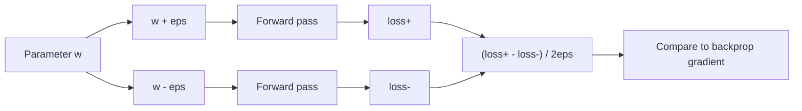
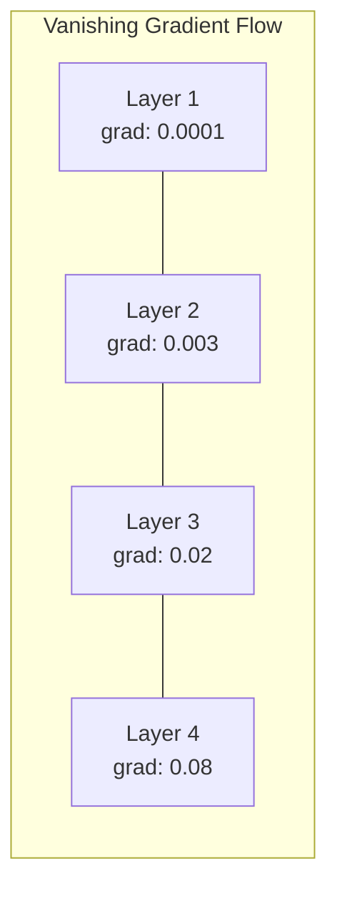

# 调试神经网络

> 你的网络编译。它跑。它产生了一个数字。号码是错的，也没有发生故障。欢迎来到最难的调试——没有错误消息的调试。

**Type:** Practice
**Languages:** Python, PyTorch
**Prerequisites:** Phase 03 Lessons 01-10 (especially backpropagation, loss functions, optimizers)
**Time:** ~90 minutes

## 学习目标

- 使用系统的调试策略诊断常见的神经网络故障（NaN损耗、平坦损耗曲线、过拟合、振荡）
- 应用“overfit one batch”技术来验证你的模型架构和训练循环是否正确
- 检查梯度大小，激活分布和权重规范，以识别消失/爆炸梯度问题
- 构建一个调试清单，包括数据管道、模型体系结构、损失函数、优化器和学习率问题

## 这个问题

传统的软件一旦坏了就会崩溃。空指针抛出异常。类型不匹配在编译时失败。一个差1的错误会产生一个明显错误的输出。

神经网络不会给你这种奢侈。

损坏的神经网络运行到完成，打印损失值，并输出预测。损失可能会减少。这些预测可能看起来是可信的。但是这个模型是错误的——学习捷径，记忆噪音，或者收敛到一个无用的局部最小值。谷歌研究人员估计，60-70%的ML调试时间花在了“沉默”的错误上，这些错误不会产生错误，但会降低模型质量。

一个正常运行的模型和一个坏掉的模型之间的区别通常是一条放错位置的线：一条缺失线经典的《训练神经网络的秘诀》（2019）开篇就说：“最常见的神经网络错误是不会崩溃的bug。”

这节课教你如何发现这些漏洞。

## 这个概念

### 调试心态

忘记“打印-祈祷”调试。神经网络调试需要一个系统的方法，因为反馈回路很慢（每次训练运行几分钟到几小时），而且症状是模糊的（严重的损失可能意味着20种不同的东西）。

黄金法则：**从简单开始，一次增加一项复杂性，并独立验证每一项

“‘美人鱼
流程图TD
A[“损失未减少”]—> B{“检查学习率”}
B—>|“太高”| C[“损耗振荡或爆炸”]
B—>|“太低了”| D[“损失几乎不动”]
B—>|“合理”| E{“检查渐变”}
E ->|“全零”| F[“Dead ReLUs或消失的梯度”]
E—>|“NaN/Inf”| G[“爆炸梯度”]
E—>|“正常”| H{“检查数据管道”}
H—>|“标签洗牌”| I[“随机准确度”]
H—>|“预处理错误”| J[“模型学习噪声”]
H——>|“数据正常”| K{“检查架构”}
K—>|“太小”| L[“不合身”]
K—>|“太深”| M[“优化难度”]
```

### Symptom 1: Loss Not Decreasing

This is the most common complaint. The training loop runs, epochs tick by, and the loss stays flat or oscillates wildly.

**Wrong learning rate.** Too high: loss oscillates or jumps to NaN. Too low: loss decreases so slowly it looks flat. For Adam, start at 1e-3. For SGD, start at 1e-1 or 1e-2. Always try 3 learning rates spanning 10x each (e.g., 1e-2, 1e-3, 1e-4) before concluding something else is wrong.

**Dead ReLUs.** If a ReLU neuron receives a large negative input, it outputs 0 and its gradient is 0. It never activates again. If enough neurons die, the network cannot learn. Check: print the fraction of activations that are exactly 0 after each ReLU layer. If >50% are dead, switch to LeakyReLU or reduce the learning rate.

**Vanishing gradients.** In deep networks with sigmoid or tanh activations, gradients shrink exponentially as they propagate backward. By the time they reach the first layer, they are ~0. The first layers stop learning. Fix: use ReLU/GELU, add residual connections, or use batch normalization.

**Exploding gradients.** The opposite problem -- gradients grow exponentially. Common in RNNs and very deep networks. Loss jumps to NaN. Fix: gradient clipping (`torch.nn.utils.clip_grad_norm_`), lower learning rate, or add normalization.

### Symptom 2: Loss Decreasing But Model is Bad

The loss goes down. Training accuracy hits 99%. But test accuracy is 55%. Or the model produces nonsensical outputs on real data.

**Overfitting.** The model memorizes training data instead of learning patterns. Gap between training and validation loss grows over time. Fix: more data, dropout, weight decay, early stopping, data augmentation.

**Data leakage.** Test data leaked into training. Accuracy is suspiciously high. Common causes: shuffling before splitting, preprocessing with statistics from the full dataset, duplicate samples across splits. Fix: split first, preprocess second, check for duplicates.

**Label errors.** 5-10% of labels in most real datasets are wrong (Northcutt et al., 2021 -- "Pervasive Label Errors in Test Sets"). The model learns the noise. Fix: use confident learning to find and fix mislabeled examples, or use loss truncation to ignore high-loss samples.

### Symptom 3: NaN or Inf in Loss

The loss value becomes `nan` or `inf`. Training is dead.

**Learning rate too high.** Gradient updates overshoot so far that weights explode. Fix: reduce by 10x.

**log(0) or log(negative).** Cross-entropy loss computes `log(p)`. If your model outputs exactly 0 or a negative probability, the log explodes. Fix: clamp predictions to `[eps, 1-eps]` where `eps=1e-7`.

**Division by zero.** Batch normalization divides by standard deviation. A batch with constant values has std=0. Fix: add epsilon to the denominator (PyTorch does this by default, but custom implementations might not).

**Numerical overflow.** Large activations fed into `exp()` produce Inf. Softmax is especially prone. Fix: subtract the max before exponentiating (the log-sum-exp trick).

### Technique 1: Gradient Checking

Compare your analytical gradients (from backprop) to numerical gradients (from finite differences). If they disagree, your backward pass has a bug.

Numerical gradient for parameter `w`:

```
Grad_numerical = (loss(w + eps) - loss(w - eps)) / （2 * eps）
```

Agreement metric (relative difference):

```
Rel_diff = |grad_analytical - grad_numerical| / max（|grad_analytical|, |grad_numerical|, 1e-8）
```

If `rel_diff < 1e-5`: correct. If `rel_diff > 1e-3`: almost certainly a bug.



### 技术2：激活统计

在训练过程中监控每一层后激活的均值和标准差。健康的网络保持均值接近0，std接近1（归一化后）或至少有界的激活。

| Health indicator | Mean | Std | Diagnosis |
|-----------------|------|-----|-----------|
| Healthy | ~0 | ~1 | Network is learning normally |
| Saturated | >>0 or <<0 | ~0 | Activations stuck at extreme values |
| Dead | 0 | 0 | Neurons are dead (all zeros) |
| Exploding | >>10 | >>10 | Activations growing without bound |

### 技术3：梯度流可视化

绘制每一层的平均梯度大小。在一个健康的网络中，各层之间的梯度大小应该大致相似。如果早期的图层的梯度比后期的图层小1000倍，那么就会出现渐变消失。

“‘美人鱼
图LR
子图“健康梯度流”
L1(“图层1 < br / >研究生:0.05”)——L2[”层2 < br / >研究生:0.04”)——L3(“第三层< br / >研究生:0.06”)——L4(“第四层< br / >研究生:0.05”)
结束
```



### 技术4：过拟合单批检验

这是深度学习中最重要的调试技术。

取一小批（8-32个样品）。进行100次以上的迭代训练。损失应该接近于零，训练准确率应该达到100%。如果不是这样，你的模型或训练循环就有一个基本的错误——不要继续进行完整的训练。

这个测试捕获：
- 破碎损失函数
- 断断续续的后传
- 架构太小，无法表示数据
- 优化器未连接到模型参数
- 数据和标签未对齐

这需要30秒来运行，节省了调试完整训练运行的几个小时。

### 技巧5：学习率查找器

Leslie Smith（2017）提出在记录损失的同时，在一个epoch内将学习率从非常小（1e-7）扫入到非常大（10）。情节损失vs学习率。最优学习率大约比损失开始下降最快的速率小10倍。

“‘美人鱼
图道明
子图“LR测深图”
方向LR
A["1e-7: loss=2.3"]—b> B["1e-5: loss=2.3"]
B—> C["1e-3: loss=1.8"]
C -> D[“1e-2：损失=0.9 -最陡”]
D -> E["1e-1：损失=0.5"]
E—> F[“1.0: loss=NaN—过高”]
结束
```

Best LR in this example: ~1e-3 (one order of magnitude before the steepest point).

### Common PyTorch Bugs

These are the bugs that waste the most collective hours in the PyTorch community:

| Bug | Symptom | Fix |
|-----|---------|-----|
| Forgetting `optimizer.zero_grad()` | Gradients accumulate across batches, loss oscillates | Add `optimizer.zero_grad()` before `loss.backward()` |
| Forgetting `model.eval()` at test time | Dropout and batch norm behave differently, test accuracy varies between runs | Add `model.eval()` and `torch.no_grad()` |
| Wrong tensor shapes | Silent broadcasting produces wrong results, no error | Print shapes after every operation during debugging |
| CPU/GPU mismatch | `RuntimeError: expected CUDA tensor` | Use `.to(device)` on model AND data |
| Not detaching tensors | Computation graph grows forever, OOM | Use `.detach()` or `with torch.no_grad()` |
| In-place operations breaking autograd | `RuntimeError: modified by in-place operation` | Replace `x += 1` with `x = x + 1` |
| Data not normalized | Loss stuck at random-chance level | Normalize inputs to mean=0, std=1 |
| Labels as wrong dtype | Cross-entropy expects `Long`, got `Float` | Cast labels: `labels.long()` |

### The Master Debugging Table

| Symptom | Likely cause | First thing to try |
|---------|-------------|-------------------|
| Loss stuck at -log(1/num_classes) | Model predicting uniform distribution | Check data pipeline, verify labels match inputs |
| Loss NaN after a few steps | Learning rate too high | Reduce LR by 10x |
| Loss NaN immediately | log(0) or division by zero | Add epsilon to log/division operations |
| Loss oscillating wildly | LR too high or batch size too small | Reduce LR, increase batch size |
| Loss decreasing then plateaus | LR too high for fine-tuning phase | Add LR schedule (cosine or step decay) |
| Training acc high, test acc low | Overfitting | Add dropout, weight decay, more data |
| Training acc = test acc = chance | Model not learning anything | Run overfit-one-batch test |
| Training acc = test acc but both low | Underfitting | Bigger model, more layers, more features |
| Gradients all zero | Dead ReLUs or detached computation graph | Switch to LeakyReLU, check `.requires_grad` |
| Out of memory during training | Batch too large or graph not freed | Reduce batch size, use `torch.no_grad()` for eval |

## Build It

A diagnostic toolkit that monitors activations, gradients, and loss curves. You will deliberately break a network and use the toolkit to diagnose each problem.

### Step 1: The NetworkDebugger Class

Hooks into a PyTorch model to record activation and gradient statistics per layer.

```python
import torch
import torch.nn as nn
import math


class NetworkDebugger:
    def __init__(self, model):
        self.model = model
        self.activation_stats = {}
        self.gradient_stats = {}
        self.loss_history = []
        self.lr_losses = []
        self.hooks = []
        self._register_hooks()

    def _register_hooks(self):
        for name, module in self.model.named_modules():
            if isinstance(module, (nn.Linear, nn.Conv2d, nn.ReLU, nn.LeakyReLU)):
                hook = module.register_forward_hook(self._make_activation_hook(name))
                self.hooks.append(hook)
                hook = module.register_full_backward_hook(self._make_gradient_hook(name))
                self.hooks.append(hook)

    def _make_activation_hook(self, name):
        def hook(module, input, output):
            with torch.no_grad():
                out = output.detach().float()
                self.activation_stats[name] = {
                    "mean": out.mean().item(),
                    "std": out.std().item(),
                    "fraction_zero": (out == 0).float().mean().item(),
                    "min": out.min().item(),
                    "max": out.max().item(),
                }
        return hook

    def _make_gradient_hook(self, name):
        def hook(module, grad_input, grad_output):
            if grad_output[0] is not None:
                with torch.no_grad():
                    grad = grad_output[0].detach().float()
                    self.gradient_stats[name] = {
                        "mean": grad.mean().item(),
                        "std": grad.std().item(),
                        "abs_mean": grad.abs().mean().item(),
                        "max": grad.abs().max().item(),
                    }
        return hook

    def record_loss(self, loss_value):
        self.loss_history.append(loss_value)

    def check_loss_health(self):
        if len(self.loss_history) < 2:
            return "NOT_ENOUGH_DATA"
        recent = self.loss_history[-10:]
        if any(math.isnan(v) or math.isinf(v) for v in recent):
            return "NAN_OR_INF"
        if len(self.loss_history) >= 20:
            first_half = sum(self.loss_history[:10]) / 10
            second_half = sum(self.loss_history[-10:]) / 10
            if second_half >= first_half * 0.99:
                return "NOT_DECREASING"
        if len(recent) >= 5:
            diffs = [recent[i+1] - recent[i] for i in range(len(recent)-1)]
            if max(diffs) - min(diffs) > 2 * abs(sum(diffs) / len(diffs)):
                return "OSCILLATING"
        return "HEALTHY"

    def check_activations(self):
        issues = []
        for name, stats in self.activation_stats.items():
            if stats["fraction_zero"] > 0.5:
                issues.append(f"DEAD_NEURONS: {name} has {stats['fraction_zero']:.0%} zero activations")
            if abs(stats["mean"]) > 10:
                issues.append(f"EXPLODING_ACTIVATIONS: {name} mean={stats['mean']:.2f}")
            if stats["std"] < 1e-6:
                issues.append(f"COLLAPSED_ACTIVATIONS: {name} std={stats['std']:.2e}")
        return issues if issues else ["HEALTHY"]

    def check_gradients(self):
        issues = []
        grad_magnitudes = []
        for name, stats in self.gradient_stats.items():
            grad_magnitudes.append((name, stats["abs_mean"]))
            if stats["abs_mean"] < 1e-7:
                issues.append(f"VANISHING_GRADIENT: {name} abs_mean={stats['abs_mean']:.2e}")
            if stats["abs_mean"] > 100:
                issues.append(f"EXPLODING_GRADIENT: {name} abs_mean={stats['abs_mean']:.2e}")
        if len(grad_magnitudes) >= 2:
            first_mag = grad_magnitudes[0][1]
            last_mag = grad_magnitudes[-1][1]
            if last_mag > 0 and first_mag / last_mag > 100:
                issues.append(f"GRADIENT_RATIO: first/last = {first_mag/last_mag:.0f}x (vanishing)")
        return issues if issues else ["HEALTHY"]

    def print_report(self):
        print("\n=== NETWORK DEBUGGER REPORT ===")
        print(f"\nLoss health: {self.check_loss_health()}")
        if self.loss_history:
            print(f"  Last 5 losses: {[f'{v:.4f}' for v in self.loss_history[-5:]]}")
        print("\nActivation diagnostics:")
        for item in self.check_activations():
            print(f"  {item}")
        print("\nGradient diagnostics:")
        for item in self.check_gradients():
            print(f"  {item}")
        print("\nPer-layer activation stats:")
        for name, stats in self.activation_stats.items():
            print(f"  {name}: mean={stats['mean']:.4f} std={stats['std']:.4f} zero={stats['fraction_zero']:.1%}")
        print("\nPer-layer gradient stats:")
        for name, stats in self.gradient_stats.items():
            print(f"  {name}: abs_mean={stats['abs_mean']:.2e} max={stats['max']:.2e}")

    def remove_hooks(self):
        for hook in self.hooks:
            hook.remove()
        self.hooks.clear()
```

### 第二步：过拟合单批次测试

”“python
Def overfit_one_batch(model, x_batch, y_batch, criterion, lr=0.01, steps=200)：
optimizer = torch. optimer . adam（模型）参数(),lr = lr)
model.train ()
print（"\n=== OVERFIT ONE BATCH TEST ==="）
批处理大小：{x_batch。shape[0]}, Steps: {Steps}")

对于范围内的step (steps)：
optimizer.zero_grad ()
输出= model（x_batch）
损失=标准（输出，y_batch）
loss.backward ()
optimizer.step ()

如果步骤% 50 == 0或步骤== steps - 1：
与torch.no_grad ():
Preds =（输出> 0）.float（）如果输出。Shape [-1] == 1 else output.argmax（dim=1）
target = y_batch如果y_batch。Dim () == 1 else y_batch.squeeze（）
Acc = (preds)。Squeeze () == targets).float().mean().item（）
print(f“ Step {Step:3d} | Loss: {Loss .item():. ”6f} |精度：{acc: 0.1%}")

Final_loss = loss.item（）
如果final_loss > 0.1：
print(f"\n FAIL: Loss未收敛（{final_loss:.4f}）。模型或训练循环被打破了。”)
返回假
print（f"\n PASS: Loss收敛到{final_loss:.6f}"）
还真
```

### Step 3: Learning Rate Finder

```python
def find_learning_rate(model, x_data, y_data, criterion, start_lr=1e-7, end_lr=10, steps=100):
    import copy
    original_state = copy.deepcopy(model.state_dict())
    optimizer = torch.optim.SGD(model.parameters(), lr=start_lr)
    lr_mult = (end_lr / start_lr) ** (1 / steps)

    model.train()
    results = []
    best_loss = float("inf")
    current_lr = start_lr

    print("\n=== LEARNING RATE FINDER ===")

    for step in range(steps):
        optimizer.zero_grad()
        output = model(x_data)
        loss = criterion(output, y_data)

        if math.isnan(loss.item()) or loss.item() > best_loss * 10:
            break

        best_loss = min(best_loss, loss.item())
        results.append((current_lr, loss.item()))

        loss.backward()
        optimizer.step()

        current_lr *= lr_mult
        for param_group in optimizer.param_groups:
            param_group["lr"] = current_lr

    model.load_state_dict(original_state)

    if len(results) < 10:
        print("  Could not complete LR sweep -- loss diverged too quickly")
        return results

    min_loss_idx = min(range(len(results)), key=lambda i: results[i][1])
    suggested_lr = results[max(0, min_loss_idx - 10)][0]

    print(f"  Swept {len(results)} steps from {start_lr:.0e} to {results[-1][0]:.0e}")
    print(f"  Minimum loss {results[min_loss_idx][1]:.4f} at lr={results[min_loss_idx][0]:.2e}")
    print(f"  Suggested learning rate: {suggested_lr:.2e}")

    return results
```

### 步骤4：渐变检查器

”“python
def_flat_to_multi_index (flat_idx, shape)：
Multi_idx = []
剩余= flat_idx
对于反向（形状）的dim：
multi_idx。插入（0，剩余% dim）
剩余//= dim
返回元组(multi_idx)


Def gradient_check(model, x, y, criterion, eps=1e-4)：
model.train ()
X_double = x.double（）
Y_double = y.double（）
Model_double = model.double（）

print（"\n=== GRADIENT CHECK ==="）
Overall_max_diff = 0
检查过= 0

对于名称，model_double.named_parameters（）中的参数：
如果不是param.requires_grad：
继续

Layer_max_diff = 0

model_double.zero_grad ()
输出= model_double（x_double）
损失=准则（输出，y_double）
loss.backward ()
Analytical_grad = param.grad.clone（）

Num_checks = min（5, param.numel()）
对于I在范围（num_checks）：
Idx = _flat_to_multi_index（i, param.shape）
Original = param.data[idx].item（）

参数。Data [idx] = original + eps
与torch.no_grad ():
Loss_plus = criterion(model_double(x_double), y_double).item（）

参数。Data [idx] = original - eps
与torch.no_grad ():
Loss_minus = criterion(model_double(x_double), y_double).item（）

参数。Data [idx] = original

数值= (loss_plus - loss_minus) / （2 * eps）
Analytical = analytical_grad[id].item（）

Denom = max（abs（数值），abs（解析），1e-8）
Rel_diff = abs（数值-解析）/分母

Layer_max_diff = max（Layer_max_diff, rel_diff）
Checked += 1

Overall_max_diff = max（Overall_max_diff, layer_max_diff）
status = "OK" if layer_max_diff < 1e-5 else “MISMATCH”
Print (f" {name}: max_rel_diff={layer_max_diff：。2 e}({地位})”)

model.float ()

print（f“\n已检查{已检查}参数”）
如果overall_max_diff < 1e-5：
print（" PASS: Gradients match (rel_diff < 1e-5)"）
if overall_max_diff < 1e-3：
print（" warning: Small differences (1e-5 < rel_diff < 1e-3)"）
其他:
print（“ FAIL：检测到梯度不匹配（rel_diff > 1e-3）”）
返回overall_max_diff
```

### Step 5: Deliberately Broken Networks

Now apply the toolkit to broken networks and diagnose each one.

```python
def demo_broken_networks():
    torch.manual_seed(42)
    x = torch.randn(64, 10)
    y = (x[:, 0] > 0).long()

    print("\n" + "=" * 60)
    print("BUG 1: Learning rate too high (lr=10)")
    print("=" * 60)
    model1 = nn.Sequential(nn.Linear(10, 32), nn.ReLU(), nn.Linear(32, 2))
    debugger1 = NetworkDebugger(model1)
    optimizer1 = torch.optim.SGD(model1.parameters(), lr=10.0)
    criterion = nn.CrossEntropyLoss()
    for step in range(20):
        optimizer1.zero_grad()
        out = model1(x)
        loss = criterion(out, y)
        debugger1.record_loss(loss.item())
        loss.backward()
        optimizer1.step()
    debugger1.print_report()
    debugger1.remove_hooks()

    print("\n" + "=" * 60)
    print("BUG 2: Dead ReLUs from bad initialization")
    print("=" * 60)
    model2 = nn.Sequential(nn.Linear(10, 32), nn.ReLU(), nn.Linear(32, 32), nn.ReLU(), nn.Linear(32, 2))
    with torch.no_grad():
        for m in model2.modules():
            if isinstance(m, nn.Linear):
                m.weight.fill_(-1.0)
                m.bias.fill_(-5.0)
    debugger2 = NetworkDebugger(model2)
    optimizer2 = torch.optim.Adam(model2.parameters(), lr=1e-3)
    for step in range(50):
        optimizer2.zero_grad()
        out = model2(x)
        loss = criterion(out, y)
        debugger2.record_loss(loss.item())
        loss.backward()
        optimizer2.step()
    debugger2.print_report()
    debugger2.remove_hooks()

    print("\n" + "=" * 60)
    print("BUG 3: Missing zero_grad (gradients accumulate)")
    print("=" * 60)
    model3 = nn.Sequential(nn.Linear(10, 32), nn.ReLU(), nn.Linear(32, 2))
    debugger3 = NetworkDebugger(model3)
    optimizer3 = torch.optim.SGD(model3.parameters(), lr=0.01)
    for step in range(50):
        out = model3(x)
        loss = criterion(out, y)
        debugger3.record_loss(loss.item())
        loss.backward()
        optimizer3.step()
    debugger3.print_report()
    debugger3.remove_hooks()

    print("\n" + "=" * 60)
    print("HEALTHY NETWORK: Correct setup for comparison")
    print("=" * 60)
    model_good = nn.Sequential(nn.Linear(10, 32), nn.ReLU(), nn.Linear(32, 2))
    debugger_good = NetworkDebugger(model_good)
    optimizer_good = torch.optim.Adam(model_good.parameters(), lr=1e-3)
    for step in range(50):
        optimizer_good.zero_grad()
        out = model_good(x)
        loss = criterion(out, y)
        debugger_good.record_loss(loss.item())
        loss.backward()
        optimizer_good.step()
    debugger_good.print_report()
    debugger_good.remove_hooks()

    print("\n" + "=" * 60)
    print("OVERFIT-ONE-BATCH TEST (healthy model)")
    print("=" * 60)
    model_test = nn.Sequential(nn.Linear(10, 32), nn.ReLU(), nn.Linear(32, 2))
    overfit_one_batch(model_test, x[:8], y[:8], criterion)

    print("\n" + "=" * 60)
    print("LEARNING RATE FINDER")
    print("=" * 60)
    model_lr = nn.Sequential(nn.Linear(10, 32), nn.ReLU(), nn.Linear(32, 2))
    find_learning_rate(model_lr, x, y, criterion)

    print("\n" + "=" * 60)
    print("GRADIENT CHECK")
    print("=" * 60)
    model_grad = nn.Sequential(nn.Linear(10, 8), nn.ReLU(), nn.Linear(8, 2))
    gradient_check(model_grad, x[:4], y[:4], criterion)
```

## 使用它

### PyTorch内置工具

”“python
进口火炬
进口火炬。Nn as Nn

model = nn.Sequential(
    nn.Linear(768, 256),
    nn.ReLU(),
    nn.Linear(256, 10),
)

与torch.autograd.detect_anomaly ():
输出= model（input_tensor）
损失=标准（输出，目标）
loss.backward ()

对于name， model.named_parameters（）中的参数：
如果参数。grad不是None：
打印(f”{名称}:grad_mean = {param.grad.abs () .mean (): .2e}”)
```

### Weights & Biases Integration

```python
import wandb

wandb.init(project="debug-training")

for epoch in range(100):
    loss = train_one_epoch()
    wandb.log({
        "loss": loss,
        "lr": optimizer.param_groups[0]["lr"],
        "grad_norm": torch.nn.utils.clip_grad_norm_(model.parameters(), float("inf")),
    })

    for name, param in model.named_parameters():
        if param.grad is not None:
            wandb.log({f"grad/{name}": wandb.Histogram(param.grad.cpu().numpy())})
```

### TensorBoard

”“python
从torch.utils.tensorboard导入SummaryWriter

writer = SummaryWriter（"runs/debug_experiment"）

对于范围（100）内的epoch：
Loss = train_one_epoch（）
作家。add_scalar（"Loss/train", Loss, epoch）

对于name， model.named_parameters（）中的参数：
作家。Add_histogram （f"weights/{name}"，参数，epoch）
如果参数。grad不是None：
作家。add_histogram (f“梯度/{名称}”,参数。研究生时代)
```

### The Debug Checklist (Before Full Training)

1. Run overfit-one-batch test. If it fails, stop.
2. Print model summary -- verify parameter count is reasonable.
3. Run a single forward pass with random data -- check output shape.
4. Train for 5 epochs -- verify loss decreases.
5. Check activation statistics -- no dead layers, no explosions.
6. Check gradient flow -- no vanishing, no exploding.
7. Verify data pipeline -- print 5 random samples with labels.

## Ship It

This lesson produces:
- `outputs/prompt-nn-debugger.md` -- a prompt for diagnosing neural network training failures
- `outputs/skill-debug-checklist.md` -- a decision-tree checklist for debugging training issues

Key deployment patterns for debugging:
- Add monitoring hooks to production training scripts
- Log activation and gradient statistics to W&B or TensorBoard every N steps
- Implement automatic alerts for NaN loss, dead neurons (>80% zero), or gradient explosion
- Always run the overfit-one-batch test when changing architectures or data pipelines

## Exercises

1. **Add an exploding gradient detector.** Modify the `NetworkDebugger` to detect when gradients exceed a threshold and automatically suggest a gradient clipping value. Test it on a 20-layer network with no normalization.

2. **Build a dead neuron resurrector.** Write a function that identifies dead ReLU neurons (always outputting 0) and reinitializes their incoming weights with Kaiming initialization. Show that this recovers a network where >70% of neurons are dead.

3. **Implement the learning rate finder with plotting.** Extend `find_learning_rate` to save results as a CSV and write a separate script that reads the CSV and displays the LR vs loss curve using matplotlib. Identify the optimal LR for ResNet-18 on CIFAR-10.

4. **Create a data pipeline validator.** Write a function that checks for: duplicate samples across train/test splits, label distribution imbalance (>10:1 ratio), input normalization (mean near 0, std near 1), and NaN/Inf values in the data. Run it on a deliberately corrupted dataset.

5. **Debug a real failure.** Take the mini-framework from Lesson 10, introduce a subtle bug (e.g., transpose the weight matrix in backward), and use gradient checking to locate exactly which parameter has incorrect gradients. Document the debugging process.

## Key Terms

| Term | What people say | What it actually means |
|------|----------------|----------------------|
| Silent bug | "It runs but gives bad results" | A bug that produces no error but degrades model quality -- the dominant failure mode in ML |
| Dead ReLU | "The neurons died" | A ReLU neuron whose input is always negative, so it outputs 0 and receives 0 gradient permanently |
| Vanishing gradients | "Early layers stop learning" | Gradients shrink exponentially through layers, making weights in early layers effectively frozen |
| Exploding gradients | "Loss went to NaN" | Gradients grow exponentially through layers, causing weight updates so large they overflow |
| Gradient checking | "Verify backprop is correct" | Comparing analytical gradients from backprop to numerical gradients from finite differences |
| Overfit-one-batch | "The most important debug test" | Training on a single small batch to verify the model CAN learn -- if it cannot, something is fundamentally broken |
| LR finder | "Sweep to find the right learning rate" | Exponentially increasing the learning rate over one epoch and picking the rate just before loss diverges |
| Data leakage | "Test data leaked into training" | When information from the test set contaminates training, producing artificially high accuracy |
| Activation statistics | "Monitor layer health" | Tracking mean, std, and zero-fraction of each layer's output to detect dead, saturated, or exploding neurons |
| Gradient clipping | "Cap the gradient magnitude" | Scaling gradients down when their norm exceeds a threshold, preventing exploding gradient updates |

## Further Reading

- Smith, "Cyclical Learning Rates for Training Neural Networks" (2017) -- the paper introducing the learning rate range test (LR finder)
- Northcutt et al., "Pervasive Label Errors in Test Sets Destabilize Machine Learning Benchmarks" (2021) -- demonstrates that 3-6% of labels in ImageNet, CIFAR-10, and other major benchmarks are wrong
- Zhang et al., "Understanding Deep Learning Requires Rethinking Generalization" (2017) -- the paper showing neural networks can memorize random labels, which is why the overfit-one-batch test works
- PyTorch documentation on `torch.autograd.detect_anomaly` and `torch.autograd.set_detect_anomaly` for built-in NaN/Inf detection