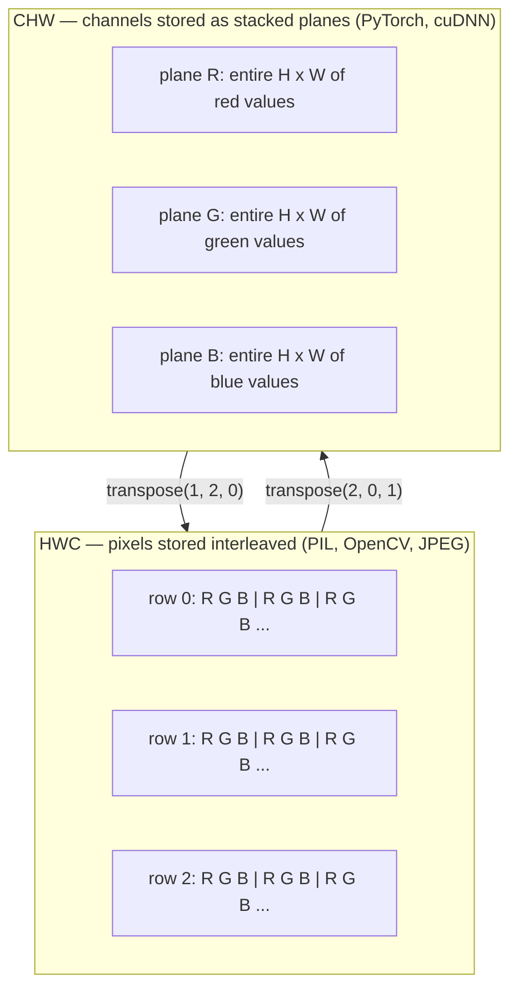

# 图像基础-像素，通道，色彩空间

> 图像是光样本的张量。您将使用的每个视觉模型都是从这一事实开始的。

**Type:** Build
**Languages:** Python
**Prerequisites:** Phase 1 Lesson 12 (Tensor Operations), Phase 3 Lesson 11 (Intro to PyTorch)
**Time:** ~45 minutes

## 学习目标

- 解释一个连续的场景是如何离散成像素的，以及为什么采样/量化决策设置每个下游模型的上限
- 读取，切片和检查图像作为NumPy数组和HWC和CHW布局之间流畅切换
- 在RGB，灰度，HSV和YCbCr之间进行转换，并证明每种颜色空间存在的原因
- 应用像素级预处理（规范化，标准化，调整大小，通道优先）完全按照torchvision的期望

## 这个问题

你要读的每一篇论文，你要下载的每一个预训练的权重，你要调用的每一个视觉API，都假定了输入的特定编码。通过将BGR输入到RGB训练的网络中，准确率会下降10个点。当模型期望通道优先时，将通道最后一个输入交给模型，并且第一个转换层将高度视为特征通道。这些都不会抛出错误。这只会破坏你的参数，你需要花费一周时间去寻找存在于加载文件过程中的漏洞。

一旦你知道它在滑动什么，卷积就不复杂了。最难的部分是“图像”对于相机、JPEG解码器、PIL、OpenCV、火炬视觉和CUDA内核来说意味着不同的东西。每个堆栈都有自己的轴顺序、字节范围和通道约定。一个视觉工程师不能保持这些船的直线破碎的管道。

这节课修复了基础，所以这个阶段的其余部分可以建立在它的基础上。到最后，你会知道像素是什么，为什么每个像素有三个数字而不是一个，“用ImageNet统计规范化”实际上做了什么，以及如何在两个或三个布局之间移动，这一阶段的其他课程都将假设。

## 这个概念

### 完整的预处理管道一目了然

每个生产视觉系统都是相同的可逆变换序列。错一步，模型就会看到与训练时不同的输入。

“‘mermaid
流程图LR
["图像文件< br / > (JPEG或PNG)”)——> B(“解码< br / > uint8中国”)
B——> C [" < br / >色彩转换< br / > (RGB / BGR / YCbCr)”)
C—> D[“调整<br/>短边”]
D—> E[“中心裁剪<br/>模型大小”]
E—> F[“除以255<br/>float32 [0,1]”]
F—> G[“减去平均值<br/>除以std”]
G—>H[“转置<br/>HWC→CHW”]
H—> I["Batch<br/>CHW→NCHW"]
I—> J[“模型”]

样式A填充：#fef3c7，描边：#d97706
样式J填充：#ddd6fe，描边：#7c3aed
样式G填充：#fecaca，描边：#dc2626
样式H填充：#bfdbfe，描边：#2563eb
```

The two red and blue boxes are where 80% of silent failures live: missing standardization and wrong layout.

### A pixel is a sample, not a square

A camera sensor counts photons that land on a grid of tiny detectors. Each detector integrates light for a fraction of a second and emits a voltage proportional to how many photons hit it. The sensor then discretizes that voltage into an integer. One detector becomes one pixel.

```
连续场景传感器网格数字图像
（无限细节）（H × W探测器）（H × W整数）

~~~~~ +——+——+——+——+——+ 210 198 180 155 120
~ ~ ~ | | | | | | 205 195 178 152 118
~光  ~      ---->           +--+--+--+--+--+     ---->       200 190 175 150 115
~~~~~ | | | | | | 195 185 170 148 112
                                 +188 180 165 145 108
```

Two choices happen at this step and they fix the ceiling on everything downstream:

- **Spatial sampling** decides how many detectors per degree of the scene. Too few, and edges become jagged (aliasing). Too many, and storage and compute explode.
- **Intensity quantization** decides how finely the voltage is bucketed. 8 bits gives 256 levels and is standard for display. 10, 12, 16 bits give smoother gradients and matter for medical imaging, HDR, and raw sensor pipelines.

A pixel is not a coloured square with area. It is a single measurement. When you resize or rotate, you are resampling that measurement grid.

### Why three channels

One detector counts photons across the whole visible spectrum — that is grayscale. To get colour, the sensor covers the grid with a mosaic of red, green, and blue filters. After demosaicing, every spatial location has three integers: the response of the red-filtered detector, green-filtered, and blue-filtered nearby. Those three integers are a pixel's RGB triplet.

```
内存中的一个像素：

（R， G， B） =(210, 140, 30) <-红橙

一张高×宽RGB图像：

shape （H， W, 3）存储为H行，W个像素，3个值
每个在[0,255]为uint8
```

Three is not magic. Depth cameras add a Z channel. Satellites add infrared and ultraviolet bands. Medical scans often have one channel (X-ray, CT) or many (hyperspectral). The number of channels is the last axis; conv layers learn to mix across it.

### Two layout conventions: HWC and CHW

Same tensor, two orderings. Every library picks one.

```
HWC（高度、宽度、通道）CHW（通道、高度、宽度）

W -> h ->
  +-----+-----+-----+                     +-----+-----+
H |R G B|R G B|R G B|                   C |R R R R R R|
| +-----+-----+-----+                   | +-----+-----+
v |R gb| R gb| R gb| v |G G G G G G G G G|
  +-----+-----+-----+                     +-----+-----+
                                          |B B B B B B|
                                          +-----+-----+

PIL, OpenCV, matplotlib, PyTorch，大多数深度学习
磁盘框架上几乎每一个图像文件，cuDNN内核
```

CHW exists because convolution kernels slide across H and W. Keeping the channel axis first means each kernel sees a contiguous 2D plane per channel, which vectorizes cleanly. Disk formats keep HWC because that matches how scanlines come out of a sensor.

The one-line conversion you will type a thousand times:

```
img_chw = img_hwc.transpose(2, 0, 1)      # NumPy
img_chw = img_hwc.permute(2, 0, 1)        # PyTorch tensor
```

Memory layout, visualised:



### 字节范围和dtype

三大惯例占主导地位：

| Convention | dtype | Range | Where you see it |
|------------|-------|-------|------------------|
| Raw | `uint8` | [0, 255] | Files on disk, PIL, OpenCV output |
| Normalized | `float32` | [0.0, 1.0] | After `img.astype('float32') / 255` |
| Standardized | `float32` | roughly [-2, +2] | After subtracting mean and dividing by std |

卷积网络在标准化输入上进行训练。ImageNet统计原料饲喂

### 色彩空间及其存在的原因

RGB是捕获格式，但它并不总是模型最有用的表示形式。

```
 RGB               HSV                       YCbCr / YUV

 R red             H hue (angle 0-360)       Y luminance (brightness)
 G green           S saturation (0-1)        Cb chroma blue-yellow
 B blue            V value/brightness (0-1)  Cr chroma red-green

 Linear to         Separates color from      Separates brightness from
 sensor output     brightness. Useful for    color. JPEG and most video
                   color thresholding, UI    codecs compress the chroma
                   sliders, simple filters   channels harder because the
                                             human eye is less sensitive
                                             to chroma detail than to Y.
```

对于大多数现代cnn，你提供RGB。你遇到其他空间时：

- **HSV** -经典CV代码，基于颜色的分割，白平衡。
- **YCbCr** -读取JPEG内部，视频管道，只在Y上操作的超分辨率模型。
- **灰度** - OCR，文档模型，任何情况下，颜色是讨厌的变量，而不是信号。

RGB的灰度是一个加权和，而不是平均值，因为人眼对绿色比对红色或蓝色更敏感：

```
Y = 0.299 R + 0.587 G + 0.114 B       (ITU-R BT.601, the classic weights)
```

### 宽高比，调整大小和插值

每个模型都有固定的输入大小（大多数ImageNet分类器为224x224，现代检测器为384x384或512x512）。你的图像很少匹配。三个重要的大小调整选项：

- **调整短边，然后居中裁剪** -标准ImageNet配方。保留宽高比，丢弃边缘像素条。
- **调整大小和垫** -保留宽高比和每个像素，添加黑色条。检测和OCR标准。
- **直接调整大小到目标** -拉伸图像。便宜，扭曲几何，适合许多分类任务。

当新网格与旧网格不对齐时，插值方法决定如何计算中间像素：

```
Nearest neighbour     fastest, blocky, only choice for masks/labels
Bilinear              fast, smooth, default for most image resizing
Bicubic               slower, sharper on upscaling
Lanczos               slowest, best quality, used for final display
```

经验法则：对于训练来说是双线性的，对于你将要查看的资产来说是双立方的或lanczos的，对于任何包含整数类id的东西来说都是最接近的。

## 构建它

### 步骤1：加载图像并检查其形状

使用枕头加载任何JPEG或PNG，转换为NumPy，并打印你得到的。对于离线运行的确定性示例，合成一个。

”“python
import numpy as np
从PIL导入图像

Def synthetic_rgb（h=128, w=192, seed=0）
RNG = np.random.default_rng（种子）
Yy, xx = np.meshgrid(np。Linspace (0,1, h), np。Linspace (0, 1, w), index ="ij")
R = (np)。Sin (xx * 6) * 0.5 + 0.5) * 255
G = yy * 255
B = (1 - yy) * xx * 255
RGB = np。栈（[r, g, b]，轴=-1）+ rng。Normal （0,6, (h, w, 3)）
返回np。Clip (rgb, 0,255).astype（np.uint8）

Arr = synthetic_rgb（）
# 或从磁盘加载：
# arr = np.asarray(Image.open（"your_image.jpg").convert("RGB")）

打印(f”类型:{类型(arr) .__name__}”)
打印(f“dtype: {arr.dtype}”)
打印(f”形状:{加勒比海盗。shape} # (H， W， C)"
打印(f”分钟:{arr.min()}”)
打印(f”马克斯:{arr.max()}”)
Print （f"pixel at (0,0): {arr[0,0]}"）
```

Expected output: `shape: (H, W, 3)`, `dtype: uint8`, range `[0, 255]`. That is the canonical on-disk representation whether the bytes came from a camera, a JPEG decoder, or a synthetic generator.

### Step 2: Split channels and re-order layout

Pull out R, G, B separately, then convert from HWC to CHW for PyTorch.

```python
R = arr[:, :, 0]
G = arr[:, :, 1]
B = arr[:, :, 2]
print(f"R shape: {R.shape}, mean: {R.mean():.1f}")
print(f"G shape: {G.shape}, mean: {G.mean():.1f}")
print(f"B shape: {B.shape}, mean: {B.mean():.1f}")

arr_chw = arr.transpose(2, 0, 1)
print(f"\nHWC shape: {arr.shape}")
print(f"CHW shape: {arr_chw.shape}")
```

三个灰度平面，每个通道一个。CHW只是重新排列坐标轴；在内存布局允许的情况下，不需要严格复制数据。

### 步骤3：灰度和HSV转换

加权和灰度，然后手动rgb到hsv。

”“python
def rgb_to_grayscale (rgb):
权重= np.array（[0.299, 0.587, 0.114], dtype=np.float32）
返回(rgb.astype (np。Float32) @ weights).astype（np.uint8）

def rgb_to_hsv (rgb):
Rgb_f = rgb.astype(np。Float32) / 255.0
R, g, b = rgb_f[…]， 0], rgb_f[…]， 1], rgb_f[…]2)
Cmax = np。马克斯(rgb_f轴= 1)
Cmin = np。分钟(rgb_f轴= 1)
Delta = cmax - cmin

    h = np.zeros_like(cmax)
    mask = delta > 0
    rmax = mask & (cmax == r)
    gmax = mask & (cmax == g)
    bmax = mask & (cmax == b)
    h[rmax] = ((g[rmax] - b[rmax]) / delta[rmax]) % 6
    h[gmax] = ((b[gmax] - r[gmax]) / delta[gmax]) + 2
    h[bmax] = ((r[bmax] - g[bmax]) / delta[bmax]) + 4
    h = h * 60.0

S = np。其中（cmax > 0, δ / cmax, 0）
V = cmax
返回np。栈（[h, s, v]，轴=-1）

灰度= rgb_to_grayscale（arr）
HSV = rgb_to_hsv（arr）
打印(f"灰色形状：{灰色。形状}，范围：[{灰色。min ()}, {gray.max()}]”)
打印（f"hsv形状：{hsv.shape}"）
Print (f"hue range: [{hsv[…], 0] .min():。1 f}, {hsv[…, 0] .max():。1 f}]度”)
Print (f"sat range: [{hsv[…]1) .min():。2 f}, {hsv[…, 1] .max (): .2f}]”)
Print (f"val range: [{hsv[…]2) .min():。2 f}, {hsv[…2) .max (): .2f}]”)
```

Hue comes out in degrees, saturation and value in [0, 1]. That matches the OpenCV `hsv_full` convention.

### Step 4: Normalize, standardize, and reverse it

Go from raw bytes to the exact tensor a pretrained ImageNet model expects, then back.

```python
mean = np.array([0.485, 0.456, 0.406], dtype=np.float32)
std = np.array([0.229, 0.224, 0.225], dtype=np.float32)

def preprocess_imagenet(rgb_uint8):
    x = rgb_uint8.astype(np.float32) / 255.0
    x = (x - mean) / std
    x = x.transpose(2, 0, 1)
    return x

def deprocess_imagenet(chw_float32):
    x = chw_float32.transpose(1, 2, 0)
    x = x * std + mean
    x = np.clip(x * 255.0, 0, 255).astype(np.uint8)
    return x

x = preprocess_imagenet(arr)
print(f"preprocessed shape: {x.shape}     # (C, H, W)")
print(f"preprocessed dtype: {x.dtype}")
print(f"preprocessed mean per channel:  {x.mean(axis=(1, 2)).round(3)}")
print(f"preprocessed std  per channel:  {x.std(axis=(1, 2)).round(3)}")

roundtrip = deprocess_imagenet(x)
max_diff = np.abs(roundtrip.astype(int) - arr.astype(int)).max()
print(f"roundtrip max pixel diff: {max_diff}    # should be 0 or 1")
```

每个通道的平均值应该接近于0，std接近于1。预处理/脱进程对正是每个火炬所看到的

### 步骤5：用三种插值方法调整大小

比较最近邻，双线性和双立方在高档，所以差异是可见的。

”“python
目标= (arr)。形状[0]* 3，arr。形状[1]* 3)

** ** = np.asarray(Image.fromarray(arr).resize(target[::-1])；最近的))
bilinear = np.asarray(Image.fromarray(arr).resize(target[::-1]), Image. asarray双线性))
bicubic = np.asarray(Image. froarray (arr).resize(target[::-1])；双三次的))

def local_roughness (x):
Gy = np.diff(x。astype(浮动),轴= 0)
Gx = np.diff(x。astype(浮动),轴= 1)
返回浮动(np.abs (gy)。Mean () + np.abs(gx).mean（）

对于名称，out in [("nearest", nearest), ("bilinear", bilinear), ("bicubic", bicubic)]：
打印(f”{名称:> 8}={出形状。形状}粗糙度= {local_roughness(出):6.2 f}”)
```

Nearest scores highest on roughness because it keeps hard edges. Bilinear is the smoothest. Bicubic sits in between, preserving perceived sharpness without the stair-step artifacts.

## Use It

`torchvision.transforms` bundles everything above into a single composable pipeline. The code below reproduces exactly what `preprocess_imagenet` does, plus resize and crop.

```python
import torch
from torchvision import transforms
from PIL import Image

img = Image.fromarray(synthetic_rgb(256, 256))

pipeline = transforms.Compose([
    transforms.Resize(256),
    transforms.CenterCrop(224),
    transforms.ToTensor(),
    transforms.Normalize(mean=[0.485, 0.456, 0.406], std=[0.229, 0.224, 0.225]),
])

x = pipeline(img)
print(f"tensor type:  {type(x).__name__}")
print(f"tensor dtype: {x.dtype}")
print(f"tensor shape: {tuple(x.shape)}      # (C, H, W)")
print(f"per-channel mean: {x.mean(dim=(1, 2)).tolist()}")
print(f"per-channel std:  {x.std(dim=(1, 2)).tolist()}")

batch = x.unsqueeze(0)
print(f"\nbatched shape: {tuple(batch.shape)}   # (N, C, H, W) — ready for a model")
```

四个步骤，按照这个顺序：`CenterCrop(224)` takes a 224x224 patch from the middle; `ToTensor()` divides by 255 and swaps HWC to CHW; `Normalize` subtracts the ImageNet mean and divides by std. Reversing that order silently changes what reaches the model.

## 船这

这一课产生：

- 
- 

## 练习

1. **（简单）**用OpenCV (同时打印形状和像素解释通道顺序的差异，然后编写一行转换，使OpenCV数组与Pillow数组相同。
2. **（中）**写您的函数必须在HWC中的单个图像上工作，并在NCHW中的批处理上使用相同的调用。
3. **（困难）**取一个3通道imagenet标准化张量，并通过1x1 conv运行它，该conv将RGB的加权混合学习到单个灰度通道。将权重初始化为还有什么经典的色彩空间变换可以写成1x1卷积？

## 关键术语

| Term | What people say | What it actually means |
|------|----------------|----------------------|
| Pixel | "A coloured square" | One sample of light intensity at one grid location — three numbers for colour, one for grayscale |
| Channel | "The colour" | One of the parallel spatial grids stacked into an image tensor; last axis in HWC, first in CHW |
| HWC / CHW | "The shape" | Axis orderings for an image tensor; disk and PIL use HWC, PyTorch and cuDNN use CHW |
| Normalize | "Scale the image" | Divide by 255 so pixels live in [0, 1] — necessary but not sufficient |
| Standardize | "Zero-center" | Subtract mean and divide by std per channel so the input distribution matches what the model was trained on |
| Grayscale conversion | "Average the channels" | A weighted sum with coefficients 0.299/0.587/0.114 that matches human luminance perception |
| Interpolation | "How resize picks pixels" | The rule that decides output values when the new grid does not align with the old one — nearest for labels, bilinear for training, bicubic for display |
| Aspect ratio | "Width over height" | The ratio that distinguishes "resize and pad" from "resize and stretch" |

## 进一步的阅读

- 
- 
- 
- Z1