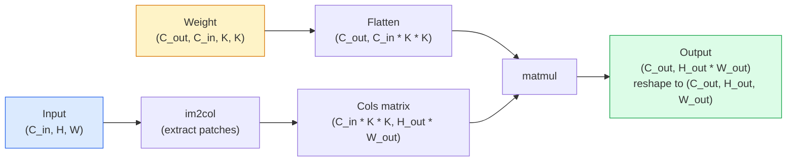

# 从头开始卷积

> 卷积是一个微小的密集层，你在图像上滑动，在每个位置共享相同的权重。

**Type:** Build
**Languages:** Python
**Prerequisites:** Phase 3 (Deep Learning Core), Phase 4 Lesson 01 (Image Fundamentals)
**Time:** ~75 minutes

## 学习目标

- 仅使用NumPy从头开始实现2D卷积，包括嵌套循环版本和矢量化
- 计算输入大小、内核大小、填充和步幅的任何组合的输出空间大小，并对
- 手工设计内核（边缘、模糊、锐化、索贝尔），并解释为什么每个内核都会产生它所做的激活模式
- 将卷积堆栈到特征提取器中，并将堆栈深度与接受域的大小联系起来

## 这个问题

在224x224 RGB图像上的完全连接层需要每个神经元224 * 224 * 3 = 150,528个输入权重。一个有1000个单元的隐藏层已经有1.5亿个参数了——在你学到任何有用的东西之前。更糟糕的是，这一层并不知道左上角的狗和右下角的狗是同一种模式。它将每个像素位置视为独立的，这对于图像来说是完全错误的：将猫翻译三个像素不应该迫使网络重新学习这个概念。

图像模型需要的两个属性是**平移等方差**（输入移位时输出移位）和**参数共享**（相同的特征检测器到处运行）。密集的图层不会给你任何好处。卷积可以免费提供这两种方法。

卷积不是为了深度学习而发明的。JPEG压缩、Photoshop中的高斯模糊、工业视觉中的边缘检测以及每一个音频滤波器都是同样的操作。cnn从2012年到2020年主导ImageNet的原因是卷积是正确的先验，对于附近值相关的数据，相同的模式可以出现在任何地方。

## 这个概念

### 一个核，滑动

二维卷积取一个称为内核（或过滤器）的小权重矩阵，将其滑动过输入，并在每个位置计算元素积的总和。这个和变成一个输出像素。

“‘mermaid
流程图LR
子图IN[“输入（高x宽）”]
direction LR
I1[“5 x 5影像”]
结束
子图K[“核（3 × 3）”]
K1(“学会了< br / >权重”)
结束
子图OUT[“输出（H-2 x W-2）”]
01[“3 × 3地图”]
结束
“滑动内核<br/>计算点积<br/>在每个位置”| 1
K1 -> 0 1

样式IN填充：# dbee，描边：#2563eb
样式K填充：#fef3c7，描边：#d97706
样式OUT填充：#dcfce7，描边：#16a34a
```

A concrete 3x3 example on a 5x5 input (no padding, stride 1):

```
输入X (5 × 5)：内核W (3 × 3)：

1 2 0 1 2 1 0 -1
0 1 3 1 0 2 0 -2
2 1 0 2 1 1 0 -1
1 0 2 1 3
2 1 1 0 1

内核滑动通过每个有效的3 × 3窗口。输出Y为3 × 3：

Y[0,0] = sum（W * X[0:3, 0:3]）
Y[0,1] = sum（W * X[0:3, 1:4]）
Y[0,2] = sum（W * X[0:3, 2:5]）
Y[1,0] = sum（W * X[1:4, 0:3]）
…等等......
```

That one formula — **shared weights, locality, sliding window** — is the entire idea. Everything else is bookkeeping.

### Output size formula

Given input spatial size `H`, kernel size `K`, padding `P`, stride `S`:

```
H_out = floor((H - K + 2P) / S) + 1
```

Memorise this. You will compute it dozens of times per architecture.

| Scenario | H | K | P | S | H_out |
|----------|---|---|---|---|-------|
| Valid conv, no padding | 32 | 3 | 0 | 1 | 30 |
| Same conv (preserves size) | 32 | 3 | 1 | 1 | 32 |
| Downsample by 2 | 32 | 3 | 1 | 2 | 16 |
| Pool 2x2 | 32 | 2 | 0 | 2 | 16 |
| Large receptive field | 32 | 7 | 3 | 2 | 16 |

"Same padding" means pick P so that H_out == H when S == 1. For odd K, that is P = (K - 1) / 2. That is why 3x3 kernels dominate — they are the smallest odd kernel that still has a centre.

### Padding

Without padding, every convolution shrinks the feature map. Stack 20 of them and your 224x224 image becomes 184x184, which wastes compute on the border and complicates residual connections that need matching shapes.

```
5 × 5输入的零填充（P = 1）：

0 0 0 0 0 0 0
0 1 2 0 1 2 0
0 0 1 3 1 0 0 0
现在内核可以以像素为中心了
0 1 0 2 1 3 0（0,0）仍然有三行和
0 2 1 1 0 0 3列值相乘。
0 0 0 0 0 0 0
```

Modes you meet in practice: `zero` (most common), `reflect` (mirror the edge, avoids hard borders in generative models), `replicate` (copy the edge), `circular` (wrap around, used in toroidal problems).

### Stride

Stride is the step size of the slide. `stride=1` is the default. `stride=2` halves the spatial dimensions and is the classic way to downsample inside a CNN without a separate pooling layer — every modern architecture (ResNet, ConvNeXt, MobileNet) uses strided convs in place of max-pool somewhere.

```
步进1在5 × 5输入，3 × 3内核上：

开始：（0,0）（0,1）(0,2)->输出行0
（1,0）（1,1）(1,2) ->输出第一行
（2,0）（2,1）(2,2) ->输出行2

输出：3 × 3

相同输入的第二步：

开始：（0,0）(0,2)->输出行0
（2,0）(2,2) ->输出行1

输出：2 × 2
```

### Multiple input channels

Real images have three channels. A 3x3 convolution on an RGB input is actually a 3x3x3 volume: one 3x3 slice per input channel. At each spatial position, you multiply and sum across all three slices and add a bias.

```
输入：（c_in，h，w）3x5x5
内核：（c_in，k，k）3x3x3（一个内核）
输出：(1,h'，w')2d地图

对于产生C_out输出通道的层，您可以堆叠C_out内核：

权重：（C_out, C_in， K， K）例如64 x 3 x 3 x 3
输出：（C_out， H‘， W’） 64 x 3 x 3

参数计数：C_out * C_in * K * K + C_out （+ C_out是偏差）
```

That last line is the one you will calculate when planning a model. A 64-channel 3x3 conv on a 3-channel input has `64 * 3 * 3 * 3 + 64 = 1,792` parameters. Cheap.

### The im2col trick

Nested loops are easy to read but slow. GPUs want big matrix multiplies. The trick: flatten every receptive-field window of the input into one column of a big matrix, flatten the kernel into a row, and the whole convolution becomes a single matmul.



每个生产的conv实现都是这种方法的一些变体，加上缓存平装技巧（大型内核的直接conv、Winograd、FFT conv）。理解了im2col，你就理解了核心。

### 接受域

一个3 × 3的conv有9个输入像素。堆叠两个3x3卷积，第二层的神经元查看5x5个输入像素。3个3x3的卷积得到7x7。一般来说:

```
RF after L stacked K x K convs (stride 1) = 1 + L * (K - 1)

With strides:   RF grows multiplicatively with stride along each layer.
```

“3x3一直向下”工作的全部原因（VGG, ResNet, ConvNeXt）是两个3x3卷积看到与一个5x5卷积相同的输入区域，但参数更少，中间有额外的非线性。


:::viz type="convolution"
交互式卷积可视化：选择不同的卷积核（边缘检测、模糊、锐化），调整 stride 和 padding，逐步观察卷积运算过程。
:::

## 构建它

### 步骤1：填充数组

从最小的原语开始：一个在H x W数组周围填充0的函数。

”“python
import numpy as np

def pad2d(x, p):
    if p == 0:
        return x
    h, w = x.shape[-2:]
    out = np.zeros(x.shape[:-2] + (h + 2 * p, w + 2 * p), dtype=x.dtype)
    out[..., p:p + h, p:p + w] = x
    return out

X = np. range(9)。重塑(3)
打印(x)
print ()
打印(pad2d (x, 1))
```

The trailing-axes trick `x.shape[:-2]` means the same function works on `(H, W)`, `(C, H, W)`, or `(N, C, H, W)` without modification.

### Step 2: 2D convolution with nested loops

The reference implementation — slow, but unambiguous. This is what `torch.nn.functional.conv2d` does in principle.

```python
def conv2d_naive(x, w, b=None, stride=1, padding=0):
    c_in, h, w_in = x.shape
    c_out, c_in_w, kh, kw = w.shape
    assert c_in == c_in_w

    x_pad = pad2d(x, padding)
    h_out = (h + 2 * padding - kh) // stride + 1
    w_out = (w_in + 2 * padding - kw) // stride + 1

    out = np.zeros((c_out, h_out, w_out), dtype=np.float32)
    for oc in range(c_out):
        for i in range(h_out):
            for j in range(w_out):
                hs = i * stride
                ws = j * stride
                patch = x_pad[:, hs:hs + kh, ws:ws + kw]
                out[oc, i, j] = np.sum(patch * w[oc])
        if b is not None:
            out[oc] += b[oc]
    return out
```

四个嵌套循环（输出通道，行，列，加上C_in， kh， kw的隐式总和）。这是您将检查每个更快实现的基本事实。

### 步骤3：使用手工设计的内核进行验证

构建一个垂直的Sobel核，将其应用于合成阶跃图像，并观察垂直边缘亮起。

”“python
def synthetic_step_image ():
Img = np。0 （(1,16,16), dtype=np.float32）
Img [:,:, 8:] = 1.0
返回img

Sobel_x = np.array([
[-1, 0, 1]，
[- 2,0,2]，
[- 1,0,1]]
), dtype = np.float32)(没有)

X = synthetic_step_image（）
Y = conv2d_naive（x, sobel_x, padding=1）
打印(y [0] .round (1))
```

Expect large positive values on column 7 (left-to-right brightness increase) and zeros everywhere else. That single print is your sanity check that the math is right.

### Step 4: im2col

Convert every kernel-sized window in the input into a column of a matrix. For `C_in=3, K=3`, each column is 27 numbers.

```python
def im2col(x, kh, kw, stride=1, padding=0):
    c_in, h, w = x.shape
    x_pad = pad2d(x, padding)
    h_out = (h + 2 * padding - kh) // stride + 1
    w_out = (w + 2 * padding - kw) // stride + 1

    cols = np.zeros((c_in * kh * kw, h_out * w_out), dtype=x.dtype)
    col = 0
    for i in range(h_out):
        for j in range(w_out):
            hs = i * stride
            ws = j * stride
            patch = x_pad[:, hs:hs + kh, ws:ws + kw]
            cols[:, col] = patch.reshape(-1)
            col += 1
    return cols, h_out, w_out
```

它仍然是一个Python循环，但现在繁重的工作将是一个单一的矢量化matmul。

### 第五步：通过im2col + matmul快速转换

用一个矩阵乘法替换四重循环。

”“python
def conv2d_im2col(x, w, b=None, stride=1, padding=0)：
C_out c_in kh kw = w shape
Cols, h_out, w_out = im2col（x, kh, kw, stride, padding）
W_flat = w. shape（c_out, -1）
Out = w_flat @ cols
如果b不为None：
out += b[:, None]
返回。（c_out, h_out, w_out）
```

Correctness check: run both implementations and compare.

```python
rng = np.random.default_rng(0)
x = rng.normal(0, 1, (3, 16, 16)).astype(np.float32)
w = rng.normal(0, 1, (8, 3, 3, 3)).astype(np.float32)
b = rng.normal(0, 1, (8,)).astype(np.float32)

y_naive = conv2d_naive(x, w, b, padding=1)
y_im2col = conv2d_im2col(x, w, b, padding=1)

print(f"max abs diff: {np.max(np.abs(y_naive - y_im2col)):.2e}")
```


### 第六步：一堆手工设计的玉米粒

五个过滤器显示了在任何训练之前单个转换层可以表达的内容。

”“python
内核= {
“身份”:np。阵列([[0,0,0)、(0,1,0)[0,0,0]],dtype = np.float32),
“blur_3x3”:np。1 ((3,3), dtype=np。Float32) / 9.0，
“锐化”:np。阵列([[0,1,0],[1 5 1],[0,1,0]],dtype = np.float32),
“sobel_x”:np。阵列([[1,0,1],[2 0 2],[1,0,1]],dtype = np.float32),
“sobel_y”:np。数组([[1、2、1)(0,0,0),[1、2、1]],dtype = np.float32),
｝

Def apply_kernel(img2d, kernel)：
x = img2d[None].astype（np.float32）
w = kernel[None, None]
返回conv2d_im2col(x, w, padding=1)[0]
```

Applied to any grayscale image, blur softens, sharpen crisps up edges, Sobel-x lights up vertical edges, Sobel-y lights up horizontal edges. These are exactly the patterns that the *first* trained conv layer in AlexNet and VGG ended up learning — because a good image model needs edge and blob detectors no matter what task comes later.

## Use It

PyTorch's `nn.Conv2d` wraps the same operation with autograd, CUDA kernels, and cuDNN optimisation. Shape semantics are identical.

```python
import torch
import torch.nn as nn

conv = nn.Conv2d(in_channels=3, out_channels=64, kernel_size=3, stride=1, padding=1)
print(conv)
print(f"weight shape: {tuple(conv.weight.shape)}   # (C_out, C_in, K, K)")
print(f"bias shape:   {tuple(conv.bias.shape)}")
print(f"param count:  {sum(p.numel() for p in conv.parameters())}")

x = torch.randn(8, 3, 224, 224)
y = conv(x)
print(f"\ninput  shape: {tuple(x.shape)}")
print(f"output shape: {tuple(y.shape)}")
```

交换交换和你之前记住的公式一样。

## 船这

这一课产生：

- 
- 

## 练习

1. **（简单）**给定128x128灰度输入和堆栈使用PyTorch进行验证
2. **（中）**延伸证明给我看
3. **（硬）**实现的反向传递验证对象窍门：im2col的梯度是

## 关键术语

| Term | What people say | What it actually means |
|------|----------------|----------------------|
| Convolution | "Sliding a filter" | A learnable dot product applied at every spatial location with shared weights; mathematically a cross-correlation, but everyone calls it convolution |
| Kernel / filter | "The feature detector" | A small weight tensor of shape (C_in, K, K) whose dot product with a window of input produces one output pixel |
| Stride | "How far you jump" | The step size between consecutive kernel placements; stride 2 halves each spatial dimension |
| Padding | "Zeros on the edges" | Extra values added around the input so the kernel can centre on border pixels; `same` padding keeps output size equal to input size |
| Receptive field | "How much the neuron sees" | The patch of original input that a given output activation depends on, growing with depth and stride |
| im2col | "The GEMM trick" | Rearranging every receptive window into columns so convolution becomes one big matrix multiply — the core of every fast conv kernel |
| Depthwise conv | "One kernel per channel" | A conv with `groups == C_in`, computing each output channel from only its matching input channel; the backbone of MobileNet and ConvNeXt |
| Translation equivariance | "Shift in, shift out" | Property that shifting the input by k pixels shifts the output by k pixels; comes for free with shared weights |

## 进一步的阅读

- 
- 
- 
- 