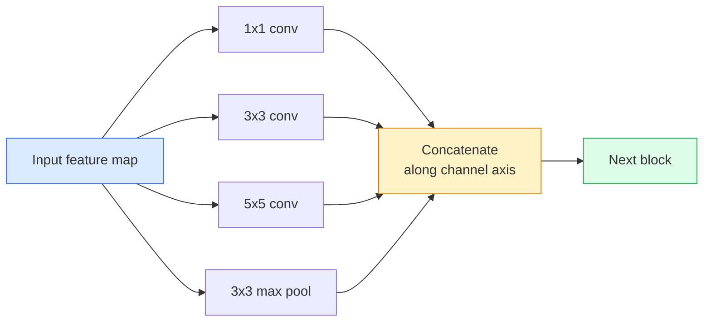

# cnn -从LeNet到ResNet

> 在过去的三十年里，每一个主要的CNN都是同样的非线性下样配方，只是加入了一个新的想法。按顺序学习这些观点。

**Type:** Learn + Build
**Languages:** Python
**Prerequisites:** Phase 3 Lesson 11 (PyTorch), Phase 4 Lesson 01 (Image Fundamentals), Phase 4 Lesson 02 (Convolutions from Scratch)
**Time:** ~75 minutes

## 学习目标

- 追溯架构谱系LeNet-5 -> AlexNet -> VGG -> Inception -> ResNet，并陈述每个家族贡献的一个新想法
- 在PyTorch中实现LeNet-5，一个vgg风格的块和一个ResNet BasicBlock，每个都在40行以下
- 解释为什么剩余连接会让一个1000层的网络从不可训练变成最先进的
- 读取一个现代主干（ResNet-18, ResNet-50），并在查看源之前预测其输出形状，接受域和参数计数

## 这个问题

2011年，最好的ImageNet分类器的准确率在前5名的74%左右。2012年AlexNet的得分为85%。2015年ResNet得分为96%。没有新的数据。没有新一代GPU。收益来自于建筑理念。工作视觉工程师必须知道哪个想法来自哪篇论文，因为你在2026年交付的每一个生产骨干都是这些相同部分的重组——而且因为想法不断转移：分组卷积从cnn到Transformer，剩余连接从ResNet到现有的每个LLM，批量归一化存在于扩散模型中。

研究这些网络还可以避免一个常见的错误：当一个lenet大小的网络可以解决问题时，你却去寻找最大的可用模型。MNIST不需要ResNet。知道每个家庭的比例曲线，你就知道该坐在哪个位置。

## 这个概念

### 改变视野的四个想法

“‘mermaid
时间轴
四种思想，四个家庭
1998: LeNet-5: Conv + pool + FC数字，在CPU上训练，60k参数
2012年：AlexNet: deep + ReLU + dropout +两个gpu，以10分的优势赢得ImageNet
2014: VGG /盗梦空间：3x3堆叠（VGG），平行过滤器尺寸（盗梦空间）
2015: ResNet：身份跳过连接解锁100+层训练
```

Nothing else in classical vision mattered as much as these four jumps.

### LeNet-5 (1998)

Yann LeCun's digit recogniser. 60,000 parameters. Two conv-pool blocks, two fully connected layers, tanh activations. It defined the template every CNN inherits:

```
输入（1,32,32）
Conv 5x5 -> （6,28,28）
平均池2x2 -> （6,14,14）
Conv 5x5 -> （16,10,10）
Avg pool 2x2 -> （16,5,5）
Flatten - bbbb400
致密-> 120
致密-> 84
稠密-> 10
```

Everything the modern world calls a CNN — alternating convolutions and downsampling feeding a small classifier head — is LeNet with more layers, bigger channels, and better activations.

### AlexNet (2012)

Three changes that together broke ImageNet:

1. **ReLU** instead of tanh. Gradients stop vanishing. Training speeds up by a factor of six.
2. **Dropout** in the fully connected head. Regularisation becomes a layer, not a trick.
3. **Depth and width**. Five conv layers, three dense layers, 60M parameters, trained on two GPUs with the model split across them.

The paper's Figure 2 still shows the GPU split as two parallel streams. That parallelism was a hardware workaround, not an architectural insight — but the three ideas above are still in every model you use.

### VGG (2014)

VGG asked: what happens if you only use 3x3 convolutions and you go deep?

```
Stack: conv 3x3 -> conv 3x3 -> pool 2x2
重复：16或19个图层
```

Two 3x3 convs see the same 5x5 input area as one 5x5 conv but with fewer parameters (2*9*C^2 = 18C^2 vs 25*C^2) and an extra ReLU in between. VGG turned this observation into an entire architecture. The simplicity — one block type, repeated — made it the reference point for everything that came after.

Cost: 138M parameters, slow to train, expensive at inference.

### Inception (2014, same year)

Google's answer to "what kernel size should I use?" was: all of them, in parallel.



每个分支都是专门的——1x1用于通道混合，3x3用于局部纹理，5x5用于较大的图案，池化用于移位不变特征——并且concat允许下一层选择有用的分支。Inception v1在每个分支内使用1x1个卷积作为瓶颈，以保持参数计数一致。

### 退化问题

到2015年，VGG-19成功了，VGG-32失败了。深度应该有所帮助，但超过20层，训练和测试损失都变得更糟。这不是过度拟合。这是优化器无法找到有用的权重，因为梯度在每一层都会成倍地缩小。

```
Plain deep network:
  y = f_L( f_{L-1}( ... f_1(x) ... ) )

Gradient wrt early layer:
  dL/dW_1 = dL/dy * df_L/df_{L-1} * ... * df_2/df_1 * df_1/dW_1

Each multiplicative term has magnitude roughly (weight magnitude) * (activation gain).
Stack 100 of them with gains < 1 and the gradient is effectively zero.
```

VGG工作在19层，因为批规范（同时发布）保持激活的良好规模。但即使是批量规范也无法挽救超过30层的深度。

### ResNet (2015)

何、张、任、孙提出了一个解决一切问题的方案：

```
standard block:   y = F(x)
residual block:   y = F(x) + x
```

The一个1000层的ResNet现在最多和一个1层的网络一样糟糕，因为每个额外的块都有一个微不足道的逃生口。有了这个保证，优化器愿意让每个块都“稍微”有用——稍微有用，堆叠100次，是最先进的。

“mermaid”
flowchart LR
投入X [" X "]——[" F (X) < br > F / conv BN +重读< br / > conv + BN”]
X -。-> identity skip| PLUS（["+"]）
F—> PLUS
PLUS—> RELU["ReLU"]
RELU—> OUT["y"]

样式X填充：# dbee，描边：#2563eb
样式：#fef3c7，描边：#d97706
样式OUT填充：#dcfce7，描边：#16a34a
```

Two variants of the block show up everywhere:

- **BasicBlock** (ResNet-18, ResNet-34): two 3x3 convs, skip around both.
- **Bottleneck** (ResNet-50, -101, -152): 1x1 down, 3x3 middle, 1x1 up, skip around the trio. Cheaper when channel counts are high.

When the skip has to cross a downsample (stride=2), the identity path is replaced with a 1x1 stride=2 conv to match shapes.

### Why residuals matter beyond vision

The idea was not really about image classification. It was about turning deep networks from "cross-your-fingers and hope gradients survive" into a reliable, scalable engineering tool. Every transformer you will read about next phase has the exact same skip connection in every block. Without ResNet, there is no GPT.

## Build It

### Step 1: LeNet-5

A minimal, faithful LeNet. Tanh activations, average pooling. The only concession to modernity is that we use `nn.CrossEntropyLoss` downstream instead of the original Gaussian connections.

```python
import torch
import torch.nn as nn
import torch.nn.functional as F

class LeNet5(nn.Module):
    def __init__(self, num_classes=10):
        super().__init__()
        self.conv1 = nn.Conv2d(1, 6, kernel_size=5)
        self.conv2 = nn.Conv2d(6, 16, kernel_size=5)
        self.pool = nn.AvgPool2d(2)
        self.fc1 = nn.Linear(16 * 5 * 5, 120)
        self.fc2 = nn.Linear(120, 84)
        self.fc3 = nn.Linear(84, num_classes)

    def forward(self, x):
        x = self.pool(torch.tanh(self.conv1(x)))
        x = self.pool(torch.tanh(self.conv2(x)))
        x = torch.flatten(x, 1)
        x = torch.tanh(self.fc1(x))
        x = torch.tanh(self.fc2(x))
        return self.fc3(x)

net = LeNet5()
x = torch.randn(1, 1, 32, 32)
print(f"output: {net(x).shape}")
print(f"params: {sum(p.numel() for p in net.parameters()):,}")
```

期望产出：这就是现代视觉开始的整个数字分类器。

### 步骤2:VGG块

一个可重复使用的块：两个3x3 convs， ReLU，批规范，最大池。

”“python
类VGGBlock (nn。模块):
Def __init__(self, in_c, out_c)：
super () . __init__ ()
自我。Conv1 = nn。con2d （in_c, out_c, kernel_size=3, padding=1）
自我。Bn1 = nn。BatchNorm2d (out_c)
自我。Conv2 = nn。con2d （out_c, out_c, kernel_size=3, padding=1）
自我。Bn2 = nn。BatchNorm2d (out_c)
自我。池= nn。MaxPool2d (2)

Def forward(self, x)：
x = F.relu（self.bn1(self.conv1(x))）
x = F.relu（self.bn2(self.conv2(x))）
返回self.pool (x)

类MiniVGG (nn。模块):
Def __init__(self, num_classes=10)：
super () . __init__ ()
自我。栈= nn。顺序(
VGGBlock (32),
VGGBlock (64),
VGGBlock(64、128),
）
自我。头部= nn。顺序(
神经网络。AdaptiveAvgPool2d (1),
神经网络。平(),
神经网络。线性(128年,num_classes),
）

Def forward(self, x)：
返回self.head (self.stack (x))

net = MiniVGG（）
X =火炬。Randn （1,3,32,32）
打印(f”输出:{净(x) .shape}”)
打印(f”参数:{总和(p。net.parameters（）中p的Numel ():,}")
```

Three VGG blocks on CIFAR-sized input, an adaptive pool, one linear layer. ~290k parameters. Plenty for CIFAR-10.

### Step 3: A ResNet BasicBlock

The core building block of ResNet-18 and ResNet-34.

```python
class BasicBlock(nn.Module):
    def __init__(self, in_c, out_c, stride=1):
        super().__init__()
        self.conv1 = nn.Conv2d(in_c, out_c, kernel_size=3, stride=stride, padding=1, bias=False)
        self.bn1 = nn.BatchNorm2d(out_c)
        self.conv2 = nn.Conv2d(out_c, out_c, kernel_size=3, stride=1, padding=1, bias=False)
        self.bn2 = nn.BatchNorm2d(out_c)
        if stride != 1 or in_c != out_c:
            self.shortcut = nn.Sequential(
                nn.Conv2d(in_c, out_c, kernel_size=1, stride=stride, bias=False),
                nn.BatchNorm2d(out_c),
            )
        else:
            self.shortcut = nn.Identity()

    def forward(self, x):
        out = F.relu(self.bn1(self.conv1(x)))
        out = self.bn2(self.conv2(out))
        out = out + self.shortcut(x)
        return F.relu(out)
```

Z0The否则它就是一个无操作恒等式。

### 步骤4：一个小小的ResNet

堆叠四组basicblock以获得用于cifar大小输入的工作ResNet。

”“python
类TinyResNet (nn。模块):
Def __init__(self, num_classes=10)：
super () . __init__ ()
自我。干= nn。顺序(
神经网络。Conv2d(3,32, kernel_size=3, stride=1, padding=1, bias=False)，
神经网络。BatchNorm2d (32),
神经网络。ReLU(原地= True),
）
自我。Layer1 = self。_make_group（32, 32, num_blocks=2, stride=1）
自我。Layer2 = self。_make_group（32, 64, num_blocks=2, stride=2）
自我。Layer3 =自我。_make_group（64,128, num_blocks=2, stride=2）
自我。Layer4 = self。_make_group（1,2,256, num_blocks=2, stride=2）
自我。头部= nn。顺序(
神经网络。AdaptiveAvgPool2d (1),
神经网络。平(),
神经网络。线性(256年,num_classes),
）

Def _make_group(self, in_c, out_c, num_blocks, stride)：
blocks = [BasicBlock(in_c, out_c, stride=stride)]
For _in range(num_blocks - 1)：
块。（BasicBlock(out_c, out_c, stride=1)）
回归神经网络。顺序(*块)

Def forward(self, x)：
X = self.stem(X)
X = self.layer1(X)
X = self.layer2(X)
X = self.layer3(X)
X = self.layer4(X)
返回self.head (x)

net = TinyResNet（）
X =火炬。Randn （1,3,32,32）
打印(f”输出:{净(x) .shape}”)
打印(f”参数:{总和(p。net.parameters（）中p的Numel ():,}")
```

Four groups of two blocks each. Stride 2 at the start of groups 2, 3, 4. Channel count doubles at every downsample. Roughly 2.8M parameters. That is the standard recipe that scales cleanly up to ResNet-152.

### Step 5: Compare parameter-to-feature efficiency

Run the same input through all three networks and compare parameter counts.

```python
def summary(name, net, x):
    y = net(x)
    params = sum(p.numel() for p in net.parameters())
    print(f"{name:12s}  input {tuple(x.shape)} -> output {tuple(y.shape)}  params {params:>10,}")

x = torch.randn(1, 3, 32, 32)
summary("LeNet5",     LeNet5(),       torch.randn(1, 1, 32, 32))
summary("MiniVGG",    MiniVGG(),      x)
summary("TinyResNet", TinyResNet(),   x)
```

三个模型，三个时代，三个数量级的参数计数。对于CIFAR-10的准确率，经过几次训练后，你大约需要：LeNet 60%， MiniVGG 89%, TinyResNet 93%。

## 使用它

Z0整个家族的呼叫签名是相同的，这正是骨干抽象的要点。

”“python
从torchvision。models import resnet18, ResNet18_Weights, vgg16, VGG16_Weights

r18 = resnet18(weights=ResNet18_Weights。IMAGENET1K_V1)
r18.eval ()

print(f"ResNet-18 params: {Numel () for p in r18.parameters()):}
print (r18.layer1 [0])
print ()

v16 = vgg16(weights=VGG16_Weights。IMAGENET1K_V1)
v16.eval ()
print(f"VGG-16参数：{Numel（）为v16中的p .parameters()):,}")
```

ResNet-18 has 11.7M parameters. VGG-16 has 138M. Similar ImageNet top-1 accuracy (69.8% vs 71.6%). Residual connections buy you a 12x parameter efficiency win. That is why ResNet variants dominated from 2016 until ViT arrived in 2021 — and still dominate real-world deployments where compute is the constraint.

For transfer learning, the recipe is always the same: load pretrained, freeze the backbone, replace the classifier head.

```python
for p in r18.parameters():
    p.requires_grad = False
r18.fc = nn.Linear(r18.fc.in_features, 10)
```

三行。现在您有了一个10个类的CIFAR分类器，它继承了ImageNet支付的表示。

## 船这

这一课产生：

- 
- 

## 练习

1. **（简单）**手动计数参数比较大部分的参数预算去了哪里——卷积、BN还是分类器头？
2. **（中）**实现瓶颈块（1x1 -> 3x3 -> 1x1带skip）并使用它构建一个resnet -50风格的CIFAR网络。比较参数
3. **（硬）**从绘制两者的训练损失与epoch。复制He等。图1的结果是，普通的深层网络收敛到比浅的孪生网络更高的损失。

## 关键术语

| Term | What people say | What it actually means |
|------|----------------|----------------------|
| Backbone | "The model" | The stack of convolutional blocks that produces the feature map fed to the task head |
| Residual connection | "Skip connection" | `y = F(x) + x`; lets the optimiser learn identity by setting F to zero, which makes arbitrary depth trainable |
| BasicBlock | "Two 3x3 convs with a skip" | The ResNet-18/34 building block: conv-BN-ReLU-conv-BN-add-ReLU |
| Bottleneck | "1x1 down, 3x3, 1x1 up" | The ResNet-50/101/152 block; cheap at high channel counts because the 3x3 runs on a reduced width |
| Degradation problem | "Deeper is worse" | Past ~20 plain conv layers, both training and test error increase; solved by residual connections, not by more data |
| Stem | "The first layer" | The initial conv that converts 3-channel input into the base feature width; usually 7x7 stride 2 for ImageNet, 3x3 stride 1 for CIFAR |
| Head | "The classifier" | The layers after the final backbone block: adaptive pool, flatten, linear(s) |
| Transfer learning | "Pretrained weights" | Loading a backbone trained on ImageNet and fine-tuning only the head on your task |

## 进一步的阅读

- Z0每一个数字都值得研究
- Z0仍然是“为什么是3x3”的最佳参考。
- Z0这张纸结束了手工制作的时代
- Z0平行滤波器的思想仍然出现在视觉Transformer中