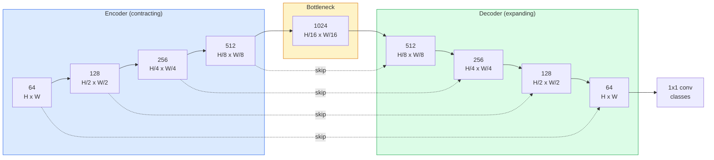

# 语义分割- U-Net

> 分割是对每个像素进行分类。U-Net通过将下采样编码器与上采样解码器配对，并在它们之间布线跳过连接，使其工作。

**Type:** Build
**Languages:** Python
**Prerequisites:** Phase 4 Lesson 03 (CNNs), Phase 4 Lesson 04 (Image Classification)
**Time:** ~75 minutes

## 学习目标

- 区分语义、实例和全景分割，并为给定的问题选择正确的任务
- 在PyTorch中从头开始构建U-Net，使用编码器块，瓶颈，带转置卷积的解码器和跳过连接
- 实现逐像素交叉熵、骰子损失和综合损失，这是当前医疗和工业分割的默认值
- 阅读每个类的IoU和Dice指标，并诊断低分数是否来自小对象召回，边界准确性或类不平衡

## 这个问题

分类每个图像输出一个标签。检测为每张图像输出少量的盒子。分割输出每像素一个标签。对于一个大小的输入也就是说，每张图像有数百万个预测，而不是一个。

分割的结构是它驱动几乎所有密集预测视觉产品的原因：医学成像（肿瘤掩膜）、自动驾驶（道路、车道、障碍物）、卫星（建筑足迹、作物边界）、文档解析（布局区域）、机器人（可抓取区域）。这些任务都不能通过在物体周围放一个盒子来解决；他们需要确切的轮廓。

架构问题表述起来很简单，但解决起来并不简单：您需要网络同时查看图像的全局上下文（这是什么样的场景）和局部像素细节（究竟哪个像素是道路，哪个像素是人行道）。标准的CNN通过空间压缩来获得上下文，这就丢掉了细节。U-Net的设计兼顾了两者。

## 这个概念

### 语义vs实例vs全景

“‘mermaid
流程图LR
IN[“输入图像”]—> SEM[“语义<br/>（像素→类）”]
IN——> INS[“实例<br/>（像素→对象id，<br/>仅限前景类）”]
IN—> PAN[“Panoptic<br/>（每像素→class + id）”]

样式SEM填充：# dbee，描边：#2563eb
样式INS填充：#fef3c7，描边：#d97706
样式PAN填充：#dcfce7，描边：#16a34a
```

- **Semantic** says "this pixel is road, that pixel is car." Two cars next to each other collapse into a single blob.
- **Instance** says "this pixel is car #3, that pixel is car #5." Ignores background stuff ("stuff" = sky, road, grass).
- **Panoptic** unifies both: every pixel gets a class label, every instance gets a unique id, stuff and things both segmented.

This lesson covers semantic. The next lesson (Mask R-CNN) covers instance.

### The U-Net shape



编码器将空间分辨率减半四倍，并将通道加倍。解码器反过来：空间分辨率翻倍四倍，信道减半。跳过连接在每个分辨率上将匹配的编码器特征与解码器特征连接起来。最终的1x1 conv映射

为什么跳过连接是必要的：当解码器试图输出像素级预测时，它只看到了小的特征图。如果没有跳过，它就不能准确地定位边缘，因为这些信息在编码器中被压缩掉了。跳过连接，将高分辨率特征映射交给编码器在向下计算的方式。

### 转置vs双线性上采样

解码器必须扩展空间维度。两个选择:

- **转置卷积** (U-Net历史默认值。如果步幅和内核大小没有均匀划分，会产生棋盘伪影。
- **双线性上采样+ 3x3 conv** -平滑上采样后跟conv。更少的工件，更少的参数，现在是现代默认值。

两者都出现在野外。对于第一个U-Net，双线性更安全。

### 像素网格上的交叉熵

对于使用C类的语义分割，模型输出为目标是交叉熵与分类情况相同，只是应用于每个空间位置：

```
Loss = mean over (n, h, w) of -log( softmax(logits[n, :, h, w])[target[n, h, w]] )
```

Z0不需要重塑。

### 骰子丢失以及你为什么需要它

交叉熵对每个像素都一视同仁。当一个类别占主导地位时（医学成像：99%背景，1%肿瘤），这是错误的。该网络通过预测任何地方的背景，准确率可以达到99%，但仍然无用。

骰子损失通过直接优化预测和真实掩码之间的重叠来解决这个问题：

```
Dice(p, y) = 2 * sum(p * y) / (sum(p) + sum(y) + epsilon)
Dice_loss = 1 - Dice
```

在哪里只有当重叠完全时损失才为零。因为它是基于比例的，所以阶级不平衡是无关紧要的。

在实践中，使用**合并损耗**：

```
L = L_cross_entropy + lambda * L_dice       (lambda ~ 1)
```

交叉熵在训练早期给出稳定的梯度；Dice将训练的重点放在实际匹配面具形状上。这种组合是医学成像的默认设置，在任何类别不平衡的数据集上都很难被击败。

### 评价指标

- **像素精度** -正确预测像素的百分比。便宜。在不平衡数据上被打破的原因和分类的准确性是一样的。
- **每个类的IoU ** -每个类的掩码的交集与并集；类间平均值= mIoU。
- **骰子（F1像素）** -类似于IoU；`Dice = 2 * IoU / (1 + IoU)`. 医学影像学偏好Dice，驾驶界偏好IoU；它们是单调相关的。
- **边界F1** -测量预测边界与真实边界的接近程度，即使是很小的变化也会受到惩罚。对于半导体检测等高精度任务非常重要。

每个类报告IoU，而不仅仅是mIoU。平均欠条隐藏了一个班级的15%，而其他九个班级的85%。

### 输入分辨率权衡

U-Net的编码器将分辨率减半四次，因此输入必须能被16整除。医学图像通常是512x512或1024x1024。自动驾驶农作物的尺寸是2048 × 1024。U-Net的内存开销随

两个标准的解决方案：
1. 瓦片输入过程256x256瓦片重叠和缝合。
2. 用扩张性卷积代替瓶颈，这样可以保持更高的空间分辨率，但可以拓宽接受域（DeepLab家族）。

对于第一种型号，带有64通道U-Net的256x256输入在8 GB VRAM上舒适地训练。

## 构建它

### 步骤1：编码器块

两个3x3的convs，批范数和ReLU。第一个转换改变通道计数；第二个人留着它。

”“python
进口火炬
进口火炬。Nn as Nn
进口火炬。n.功能为F

类DoubleConv (nn。模块):
Def __init__(self, in_c, out_c)：
super () . __init__ ()
Self.net = nn。顺序(
神经网络。Conv2d(in_c, out_c, kernel_size=3, padding=1, bias=False)，
神经网络。BatchNorm2d (out_c),
神经网络。ReLU(原地= True),
神经网络。Conv2d(out_c, out_c, kernel_size=3, padding=1, bias=False)，
神经网络。BatchNorm2d (out_c),
神经网络。ReLU(原地= True),
）

Def forward(self, x)：
返回self.net (x)
```

This block is reused throughout. `bias=False` because BN's beta handles the bias.

### Step 2: Down and up blocks

```python
class Down(nn.Module):
    def __init__(self, in_c, out_c):
        super().__init__()
        self.net = nn.Sequential(
            nn.MaxPool2d(2),
            DoubleConv(in_c, out_c),
        )

    def forward(self, x):
        return self.net(x)


class Up(nn.Module):
    def __init__(self, in_c, out_c):
        super().__init__()
        self.up = nn.Upsample(scale_factor=2, mode="bilinear", align_corners=False)
        self.conv = DoubleConv(in_c, out_c)

    def forward(self, x, skip):
        x = self.up(x)
        if x.shape[-2:] != skip.shape[-2:]:
            x = F.interpolate(x, size=skip.shape[-2:], mode="bilinear", align_corners=False)
        x = torch.cat([skip, x], dim=1)
        return self.conv(x)
```

仅限空间的形状检查(保险柜比较完整的形状也会触发通道计数的差异，这应该是一个响亮的错误，而不是一个沉默的插值。

### 3 . U-Net

```python
class UNet(nn.Module):
    def __init__(self, in_channels=3, num_classes=2, base=64):
        super().__init__()
        self.inc = DoubleConv(in_channels, base)
        self.d1 = Down(base, base * 2)
        self.d2 = Down(base * 2, base * 4)
        self.d3 = Down(base * 4, base * 8)
        self.d4 = Down(base * 8, base * 16)
        self.u1 = Up(base * 16 + base * 8, base * 8)
        self.u2 = Up(base * 8 + base * 4, base * 4)
        self.u3 = Up(base * 4 + base * 2, base * 2)
        self.u4 = Up(base * 2 + base, base)
        self.outc = nn.Conv2d(base, num_classes, kernel_size=1)

def前进（self，x）：
x1 = self.inc(x)
x2=self。d1(x1)
x3 = self.d2(x2)
x4 = self.d3(x3)
x5 = self.d4(x4)
x=self。u1 (x5, x 4)
x=self。u2头像(x, x3)
x=self。u3 (x, x2)
x=self。u4 (x, x1)
return self.outc (x)

net = UNet（in_channels=3, num_classes=2, base=32）
X =火炬。Randn （1,3,256,256）
打印(f”输出:{净(x) .shape}”)
打印(f”参数:{总和(p。net.parameters（）中p的Numel ():,}")
```

Output shape `(1, 2, 256, 256)` — same spatial size as the input, `num_classes` channels. About 7.7M parameters at `base=32`.

### Step 4: Losses

```python
def dice_loss(logits, targets, num_classes, eps=1e-6):
    probs = F.softmax(logits, dim=1)
    targets_one_hot = F.one_hot(targets, num_classes).permute(0, 3, 1, 2).float()
    dims = (0, 2, 3)
    intersection = (probs * targets_one_hot).sum(dim=dims)
    denom = probs.sum(dim=dims) + targets_one_hot.sum(dim=dims)
    dice = (2 * intersection + eps) / (denom + eps)
    return 1 - dice.mean()


def combined_loss(logits, targets, num_classes, lam=1.0):
    ce = F.cross_entropy(logits, targets)
    dc = dice_loss(logits, targets, num_classes)
    return ce + lam * dc, {"ce": ce.item(), "dice": dc.item()}
```

骰子是按职业计算的，然后平均（宏观骰子）。The

### 步骤5：借据度量

”“python
@torch.no_grad ()
defiou_per_class (logits, targets, num_classes)：
Preds = logits.argmax（dim=1）
Ious = torch.zero （num_classes）
对于范围（num_classes）中的c：
Pred_c = （preds == c）
True_c =（目标== c）
Inter = (pred_c & true_c).sum().float（）
Union = (pred_c | true_c).sum().float（）
iou [c] = (inter / union) if union > 0 else torch.tensor（float("nan")）
返回借据
```

Returns a vector of length C. `nan` marks classes absent from the batch — do not average over those when computing mIoU.

### Step 6: Synthetic dataset for end-to-end verification

Generate shapes on coloured backgrounds so the network has to learn shape, not pixel colour.

```python
import numpy as np
from torch.utils.data import Dataset, DataLoader

def synthetic_segmentation(num_samples=200, size=64, seed=0):
    rng = np.random.default_rng(seed)
    images = np.zeros((num_samples, size, size, 3), dtype=np.float32)
    masks = np.zeros((num_samples, size, size), dtype=np.int64)
    for i in range(num_samples):
        bg = rng.uniform(0, 1, (3,))
        images[i] = bg
        masks[i] = 0
        num_shapes = rng.integers(1, 4)
        for _ in range(num_shapes):
            cls = int(rng.integers(1, 3))
            color = rng.uniform(0, 1, (3,))
            cx, cy = rng.integers(10, size - 10, size=2)
            r = int(rng.integers(4, 12))
            yy, xx = np.meshgrid(np.arange(size), np.arange(size), indexing="ij")
            if cls == 1:
                mask = (xx - cx) ** 2 + (yy - cy) ** 2 < r ** 2
            else:
                mask = (np.abs(xx - cx) < r) & (np.abs(yy - cy) < r)
            images[i][mask] = color
            masks[i][mask] = cls
        images[i] += rng.normal(0, 0.02, images[i].shape)
        images[i] = np.clip(images[i], 0, 1)
    return images, masks


class SegDataset(Dataset):
    def __init__(self, images, masks):
        self.images = images
        self.masks = masks

    def __len__(self):
        return len(self.images)

    def __getitem__(self, i):
        img = torch.from_numpy(self.images[i]).permute(2, 0, 1).float()
        mask = torch.from_numpy(self.masks[i]).long()
        return img, mask
```

三个类：背景(0)，圆形(1)，正方形(2)。网络必须学会分辨形状。

### 步骤7：循环训练

”“python
Def train_one_epoch(model, loader, optimizer, device, num_classes)：
model.train ()
Loss_sum, total = 0.0, 0
Iou_sum = torch.zero （num_classes）
对于加载器中的x， y：
X, y = X .to(device), y.to（device）
Logits = model(x)
Loss, _ = combined_loss（logits, y, num_classes）
optimizer.zero_grad ()
loss.backward ()
optimizer.step ()
Loss_sum += loss.item() * x.size(0)
Total += x.size(0)
Iou_sum += iou_per_class(logits, y, num_classes).nan_to_num(0)
返回loss_sum / total， iou_sum / len（loader）
```

Run this for 10-30 epochs on the synthetic dataset and watch mIoU climb past 0.9 for the shape classes. Note the `nan_to_num(0)` treats classes absent from a batch as zero; for accurate per-class IoU, mask by presence and use `torch.nanmean` across batches at evaluation time rather than averaging here.

## Use It

For production, `segmentation_models_pytorch` ("smp") wraps every standard segmentation architecture with any torchvision or timm backbone. Three lines:

```python
import segmentation_models_pytorch as smp

model = smp.Unet(
    encoder_name="resnet34",
    encoder_weights="imagenet",
    in_channels=3,
    classes=3,
)
```

在实际工作中还值得了解：
- **DeepLabV3+**用扩展卷积取代基于最大池的下采样，因此瓶颈保持分辨率；更快的卫星和驾驶数据边界。
- **SegFormer**将转换编码器转换为分层转换器；当前的SOTA在许多基准上。
- **Mask2Former** / **OneFormer**在单一架构中统一语义、实例和全景分割。

这三种都是插入式替代品

## 船这

这一课产生：

- 
- 

## 练习

1. **（简单）**执行在合成的两类数据集上验证，当前景为5%像素时，组合损失比单独BCE收敛得更快。
2. **（中）**更换在合成数据集上训练两者并比较mIoU。观察棋盘构件在转置转换版本中出现的位置。
3. **（硬）**取一个真实的分割数据集（Oxford-IIIT Pets， cityscape迷你分割，或医疗子集），并训练U-Net在2个IoU点内报告每个类的借据，并确定哪些类从增加Dice损失中获益最多。

## 关键术语

| Term | What people say | What it actually means |
|------|----------------|----------------------|
| Semantic segmentation | "Label every pixel" | Per-pixel classification into C classes; instances of the same class merge |
| Instance segmentation | "Label every object" | Separates distinct instances of the same class; foreground-only |
| Panoptic segmentation | "Semantic + instance" | Every pixel gets a class; every thing instance also gets a unique id |
| Skip connection | "U-Net bridge" | Concatenation of encoder features into matching-resolution decoder features; preserves high-frequency detail |
| Transposed conv | "Deconvolution" | Learnable upsampling; can produce checkerboard artifacts |
| Dice loss | "Overlap loss" | 1 - 2|A ∩ B| / (|A| + |B|); optimises mask overlap directly and is robust to class imbalance |
| mIoU | "Mean intersection over union" | Average IoU across classes; the community-standard metric for segmentation |
| Boundary F1 | "Boundary accuracy" | F1 score computed on boundary pixels only; matters for precision-critical tasks |

## 进一步的阅读

- Z0每个人抄写的数字在第二页
- 
- Z0每一个标准的体系结构加上每一个标准的损耗
- 