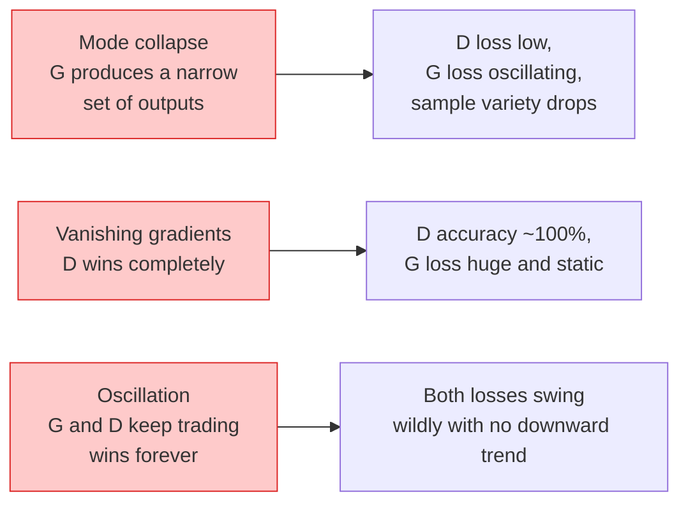

# 图像生成- gan

> GAN是两个神经网络在一个固定的博弈中。一个画画，一个批评。他们相处得越来越好，直到画骗过了评论家。

**Type:** Build
**Languages:** Python
**Prerequisites:** Phase 4 Lesson 03 (CNNs), Phase 3 Lesson 06 (Optimizers), Phase 3 Lesson 07 (Regularization)
**Time:** ~75 minutes

## 学习目标

- 解释生成器和鉴别器之间的极大极小博弈，以及为什么均衡对应于p_model = p_data
- 在PyTorch中实现一个DCGAN，并使其在60行以下生成连贯的32x32合成图像
- 用三种标准技巧稳定GAN训练：非饱和损失、谱范数、TTUR（双时间尺度更新规则）
- 阅读训练曲线，区分健康收敛与模式崩溃、振荡和判别器完全获胜

## 这个问题

分类教网络将图像映射到标签。生成将这个问题颠倒过来：对看起来来自相同分布的新图像进行采样。没有“正确”的输出，你可以区别；你想模仿的只有一个分布。

标准损失函数（MSE，交叉熵）不能衡量“样本是否来自真实分布”。最小化每像素误差会产生模糊的平均值，而不是真实的样本。突破在于学习损失：训练第二个网络，它的工作是辨别真假，并利用它的判断来推动生成器。

gan （Goodfellow et al., 2014）定义了这个框架。到2018年，StyleGAN制作出了与照片无法区分的1024 × 1024人脸。自那以后，扩散模型在质量和可控制性上占据了宝座，但使扩散成为现实的每一个技巧——归一化选择、潜在空间、特征损失——都是在gan上首先被理解的。

## 这个概念

### 两个网络

“‘美人鱼
流程图LR
(“Z Z ~ N (0, 1) < br / >噪音”)——> G(“发电机< br / >转置conv”)
G—> FAKE[假图像]
REAL[" REAL image"]—b> D["Discriminator<br/>conv classifier"]
假的——b> d
D—> OUT[“P（real）”]

样式G填充：# dbee，描边：#2563eb
样式D填充：#fef3c7，描边：#d97706
样式OUT填充：#dcfce7，描边：#16a34a
```

The **generator** G takes a vector of noise `z` and outputs an image. The **discriminator** D takes an image and outputs a single scalar: the probability that the image is real.

### The game

G wants D to be wrong. D wants to be right. Formally:

```
min_G max_D E_x[日志D (x)] + E_z[日志(1 - D (G (z))))
```

Read right to left: D is maximising accuracy on real (`log D(real)`) and fake (`log (1 - D(fake))`) images. G is minimising D's accuracy on fakes — it wants `D(G(z))` to be high.

Goodfellow proved that this minimax has a global equilibrium where `p_G = p_data`, D outputs 0.5 everywhere, and the Jensen-Shannon divergence between generated and real distributions is zero. The hard part is getting there.

### Non-saturating loss

The form above is numerically unstable. Early in training, `D(G(z))` is near zero for every fake, so `log(1 - D(G(z)))` has vanishing gradients with respect to G. The fix: flip G's loss.

```
L_D = - e_x [log D(x)] - E_z[log(1 - D(G(z)))]
L_G = -E_z[log D(G(z))] #不饱和
```

Now when `D(G(z))` is near zero, G's loss is large and its gradient is informative. Every modern GAN trains with this variant.

### DCGAN architecture rules

Radford, Metz, Chintala (2015) distilled years of failed experiments into five rules that make GAN training stable:

1. Replace pooling with strided convs (both nets).
2. Use batch norm in both generator and discriminator, except output of G and input of D.
3. Remove fully connected layers on deeper architectures.
4. G uses ReLU on all layers except output (tanh for output in [-1, 1]).
5. D uses LeakyReLU (negative_slope=0.2) on all layers.

Every modern conv-based GAN (StyleGAN, BigGAN, GigaGAN) still starts from these rules and replaces pieces one at a time.

### Failure modes and their signatures



- **模式崩溃**:G找到一个愚弄D的图像并只产生该图像。修正：增加小批量鉴别，光谱规范，或标签调理。
- **判别器获胜**:D变得太强大太快，G的梯度消失。修正：更小的D，更低的D学习率，或者在真实标签上应用标签平滑。
- **振荡**：两个净交易赢了，从来没有接近均衡。修正：tturr （D学习速度比G快2-4倍），或切换到Wasserstein损失。

### 评价

gan没有基础真理，所以你怎么知道它们在起作用呢？

- **样本检查** -只需在每个epoch结束时查看64个样本。不可转让。
- **FID (fr<s:1> Inception Distance)** -真实集和生成集的Inception-v3特征分布之间的距离。越低越好。社区标准。
- **《盗梦空间》**——更老，更脆；喜欢支撑材。
- **生成模型的精度/召回率** -分别衡量质量（精度）和覆盖率（召回率）。比单独FID更有信息量。

对于一个小的合成数据运行，抽样检查就足够了。

## 构建它

### 1 .发电机

一种小型的DCGAN发生器，它接受64暗淡的噪声并产生32 × 32的图像。

”“python
进口火炬
进口火炬。Nn as Nn

类发生器(nn。模块):
Def __init__(self, z_dim=64, img_channels=3, feat=64)：
super () . __init__ ()
Self.net = nn。顺序(
神经网络。ConvTranspose2d(z_dim, feat * 4, kernel_size=4, stride=1, padding=0, bias=False)，
神经网络。BatchNorm2d(feat * 4)；
神经网络。ReLU(原地= True),
神经网络。（feat * 4, feat * 2, kernel_size=4, stride=2, padding=1, bias=False），
神经网络。BatchNorm2d(feat * 2)；
神经网络。ReLU(原地= True),
神经网络。（feat * 2, feat, kernel_size=4, stride=2, padding=1, bias=False），
神经网络。BatchNorm2d(成就),
神经网络。ReLU(原地= True),
神经网络。ConvTranspose2d(feat, img_channels, kernel_size=4, stride=2, padding=1, bias=False)，
神经网络。双曲正切(),
）

Def forward(self, z)：
返回self。net（z.view(z.size(0), -1, 1,1)）
```

Four transposed convs, each with `kernel_size=4, stride=2, padding=1` so they cleanly double spatial size. Output activations in [-1, 1] via tanh.

### Step 2: Discriminator

Mirror of the generator. LeakyReLU, strided convs, ends with a scalar logit.

```python
class Discriminator(nn.Module):
    def __init__(self, img_channels=3, feat=64):
        super().__init__()
        self.net = nn.Sequential(
            nn.Conv2d(img_channels, feat, kernel_size=4, stride=2, padding=1),
            nn.LeakyReLU(0.2, inplace=True),
            nn.Conv2d(feat, feat * 2, kernel_size=4, stride=2, padding=1, bias=False),
            nn.BatchNorm2d(feat * 2),
            nn.LeakyReLU(0.2, inplace=True),
            nn.Conv2d(feat * 2, feat * 4, kernel_size=4, stride=2, padding=1, bias=False),
            nn.BatchNorm2d(feat * 4),
            nn.LeakyReLU(0.2, inplace=True),
            nn.Conv2d(feat * 4, 1, kernel_size=4, stride=1, padding=0),
        )

    def forward(self, x):
        return self.net(x).view(-1)
```

最后一个卷积化简a输出是每个图像的单个标量；仅在损失计算时使用s形。

### 第三步：训练步骤

交替：每批更新一次D，然后更新一次G。

”“python
进口火炬。n.功能为F

def train_step(G， D, real, z, opt_g, opt_d, device)：
Real = Real .to（设备）
b = real.size(0)

# D步骤
opt_d.zero_grad ()
d_real = D（real）
d_fake = D(G（z).detach()）
loss_d = （F.binary_cross_entropy_with_logits(d_real, torch.ones_like(d_real))）
              + F.binary_cross_entropy_with_logits (d_fake torch.zeros_like (d_fake)))
loss_d.backward ()
opt_d.step ()

# G步骤
opt_g.zero_grad ()
d_fake = D（G(z)）
loss_g = F.binary_cross_entropy_with_logits（d_fake, torch.ones_like(d_fake)）
loss_g.backward ()
opt_g.step ()

loss_d返回。项目(),loss_g.item ()
```

`G(z).detach()` in the D step is critical: we do not want gradients flowing into G during its update. Forgetting that is the classic beginner bug.

### Step 4: Full training loop on synthetic shapes

```python
from torch.utils.data import DataLoader, TensorDataset
import numpy as np

def synthetic_images(num=2000, size=32, seed=0):
    rng = np.random.default_rng(seed)
    imgs = np.zeros((num, 3, size, size), dtype=np.float32) - 1.0
    for i in range(num):
        r = rng.uniform(6, 12)
        cx, cy = rng.uniform(r, size - r, size=2)
        yy, xx = np.meshgrid(np.arange(size), np.arange(size), indexing="ij")
        mask = (xx - cx) ** 2 + (yy - cy) ** 2 < r ** 2
        color = rng.uniform(-0.5, 1.0, size=3)
        for c in range(3):
            imgs[i, c][mask] = color[c]
    return torch.from_numpy(imgs)

device = "cuda" if torch.cuda.is_available() else "cpu"
data = synthetic_images()
loader = DataLoader(TensorDataset(data), batch_size=64, shuffle=True)

G = Generator(z_dim=64, img_channels=3, feat=32).to(device)
D = Discriminator(img_channels=3, feat=32).to(device)
opt_g = torch.optim.Adam(G.parameters(), lr=2e-4, betas=(0.5, 0.999))
opt_d = torch.optim.Adam(D.parameters(), lr=2e-4, betas=(0.5, 0.999))

for epoch in range(10):
    for (batch,) in loader:
        z = torch.randn(batch.size(0), 64, device=device)
        ld, lg = train_step(G, D, batch, z, opt_g, opt_d, device)
    print(f"epoch {epoch}  D {ld:.3f}  G {lg:.3f}")
```

Z0

### 5 .抽样

”“python
@torch.no_grad ()
def sample(G, n=16, z_dim=64, device="cpu")：
G.eval ()
Z =火炬。Randn （n, z_dim, device=device）
imgs = G(z)
Imgs = (Imgs + 1) / 2
返回一个。夹(0,1)
```

Always switch to eval mode before sampling. For DCGAN this matters because batch norm running stats are used instead of the batch's stats.

### Step 6: Spectral normalisation

A drop-in replacement for BN in the discriminator that guarantees the network is 1-Lipschitz. Fixes most "D wins too hard" failures.

```python
from torch.nn.utils import spectral_norm

def build_sn_discriminator(img_channels=3, feat=64):
    return nn.Sequential(
        spectral_norm(nn.Conv2d(img_channels, feat, 4, 2, 1)),
        nn.LeakyReLU(0.2, inplace=True),
        spectral_norm(nn.Conv2d(feat, feat * 2, 4, 2, 1)),
        nn.LeakyReLU(0.2, inplace=True),
        spectral_norm(nn.Conv2d(feat * 2, feat * 4, 4, 2, 1)),
        nn.LeakyReLU(0.2, inplace=True),
        spectral_norm(nn.Conv2d(feat * 4, 1, 4, 1, 0)),
    )
```

交换谱范数是你可以应用的最简单的单次鲁棒性升级。

## 使用它

对于严重的生成，使用预训练权值或切换到扩散。两个标准库：

- Z0
- Z0

在2026年，gan仍然是以下方面的最佳选择：实时图像生成（延迟<10 ms）、风格转换、精确控制的图像到图像转换（Pix2Pix, CycleGAN）。扩散在照片真实感和文本条件反射上获胜。

## 船这

这一课产生：

- Z0
- Z0

## 练习

1. **（简单）**在合成圆数据集上训练上面的DCGAN，并在每个历元结束时保存16个样本的网格。生成的圆在哪个历元变成明显的圆？
2. **（中）**用谱范数代替鉴别器的批范数。同时训练两个版本。哪一个收敛得更快？哪一种种子的方差更小？
3. **（硬）**实现一个有条件的DCGAN：将类标签同时输入G和D（在G中连接1 -hot到噪声，在D中连接一个类嵌入通道）。在第7课的合成“圆形vs正方形”数据集上进行训练，并通过使用特定标签进行采样来显示类条件作用。

## 关键术语

| Term | What people say | What it actually means |
|------|----------------|----------------------|
| Generator (G) | "The draws-stuff net" | Maps noise to images; trained to fool the discriminator |
| Discriminator (D) | "The critic" | Binary classifier; trained to distinguish real from generated images |
| Minimax | "The game" | min over G, max over D of an adversarial loss; equilibrium is p_G = p_data |
| Non-saturating loss | "The numerically sane version" | G's loss is -log(D(G(z))) instead of log(1 - D(G(z))) to avoid vanishing gradients early in training |
| Mode collapse | "Generator makes one thing" | G produces only a small subset of the data distribution; fix with SN, minibatch discrimination, or larger batch |
| TTUR | "Two learning rates" | D learns faster than G, typically by a factor of 2-4; stabilises training |
| Spectral norm | "1-Lipschitz layer" | A weight-normalisation that bounds each layer's Lipschitz constant; stops D from becoming arbitrarily steep |
| FID | "Fréchet Inception Distance" | Distance between Inception-v3 feature distributions of real and generated sets; the standard evaluation metric |

## 进一步的阅读

- Z0
- Z0
- Z0
- Z0读起来像是过去十年里所有魔术的精选集