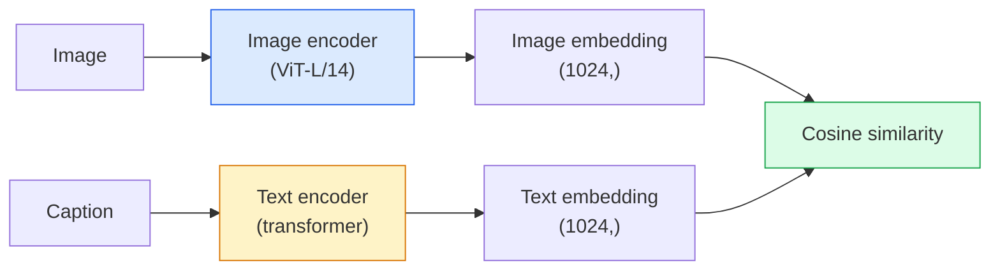

# 开放词汇视觉-剪辑

> 一起训练图像编码器和文本编码器，以便匹配（图像，标题）对落在共享空间的同一点上。这就是整个技巧。

**Type:** Build + Use
**Languages:** Python
**Prerequisites:** Phase 4 Lesson 14 (ViT), Phase 4 Lesson 17 (Self-Supervised)
**Time:** ~45 minutes

## 学习目标

- 解释CLIP的双塔结构和对比的培训目标
- 使用预训练的CLIP（或SigLIP）进行零射击分类，而无需任何特定任务的训练
- 从头开始实现零射击分类：编码类提示，计算余弦相似度，取argmax
- 区分CLIP， SigLIP， OpenCLIP和LLaVA/LLaMA-vision模型-每个模型在2026年的用途

## 这个问题

传统的分类器是封闭词汇：一个1000类的ImageNet模型只能预测1000个标签。每一个新类别都需要标记数据和重新训练的头脑。

CLIP （Radford等人，OpenAI 2021）表明，对从网络上抓取的400M（图像、标题）对进行训练，可以产生一个模型，该模型可以在推理时分类为任何一组类别，完全用自然语言描述。你通过写一个句子给它一个新的类。

这种能力——零射击转移——就是为什么每个现代视觉系统都从clip家族检查点开始的原因。检测（接地DINO， OWL-ViT），分割（CLIPSeg， SAM），检索，内容审核，vlm和文本到图像的生成都建立在clip风格的联合嵌入上。

## 这个概念

### 两个塔



Both encoders end with a linear projection to the same embedding dimension (512 for CLIP-B/32, 1024 for CLIP-L/14). L2-normalise and compute cosine similarity.

### The objective

Given a batch of N (image, caption) pairs, build an NxN similarity matrix. Train both encoders so the diagonal (matching pairs) has high similarity and off-diagonals (non-matching) have low similarity.

```
Sim_matrix = image_embeddings @ text_embeddings。T / tau

loss_i2t = cross_entropy（sim_matrix, targets=arange(N)）
ss_t2i = cross_entropy（sim_matrix）。T targets = arange (N))
loss = (loss_i2t + loss_t2i) / 2
```

Symmetric because both image-to-text and text-to-image retrieval should work. `tau` (temperature) is typically learned as a scalar parameter, initialised to 0.07.

### SigLIP: a better loss

SigLIP (Zhai et al., 2023) replaced the softmax with per-pair sigmoid:

```
损失= log（1 + exp(-y_ij * sim_ij)）对的平均值
Y_ij = +1，否则为-1
```

Per-pair loss removes the batch-level normalisation that CLIP requires. SigLIP trains better at small batch sizes and matches or exceeds CLIP at equal data.

### Zero-shot classification

Given a trained CLIP:

1. For each class, compose a prompt: "a photo of a {class}".
2. Encode all class prompts with the text encoder -> `T` shape (C, d).
3. Encode the test image -> `I` shape (1, d).
4. Similarity = `I @ T.T` shape (1, C).
5. Argmax -> predicted class.

Prompt engineering matters. OpenAI published 80 prompt templates for ImageNet ("a photo of a {}", "a blurry photo of a {}", "a sketch of a {}", ...). Average the embeddings of all templates per class for an extra 1-3% top-1 accuracy.

### Where CLIP-style models are used in 2026

- **Zero-shot classification** — direct use.
- **Image retrieval** — encode all images once, embed query at inference.
- **Text-conditioned detection** — Grounding DINO, OWL-ViT wrap a CLIP text tower around a detector.
- **Text-conditioned segmentation** — CLIPSeg; SAM uses text-prompt inputs via CLIP.
- **VLMs** — LLaVA, Qwen-VL, InternVL wire a CLIP-family vision encoder into an LLM.
- **Text-to-image gen** — Stable Diffusion, DALL-E 3 condition on CLIP text embeddings.

Once you have a shared embedding space, every vision+language task becomes a distance computation.

## Build It

### Step 1: A tiny two-tower model

Real CLIP is ViT + transformer. For this lesson the towers are small MLPs over pre-extracted features so the training signal is visible on CPU.

```python
import torch
import torch.nn as nn
import torch.nn.functional as F


class TwoTower(nn.Module):
    def __init__(self, img_in=128, txt_in=64, emb=64):
        super().__init__()
        self.image_proj = nn.Sequential(nn.Linear(img_in, 128), nn.ReLU(), nn.Linear(128, emb))
        self.text_proj = nn.Sequential(nn.Linear(txt_in, 128), nn.ReLU(), nn.Linear(128, emb))
        self.logit_scale = nn.Parameter(torch.ones([]) * 2.6592)  # ln(1/0.07)

    def forward(self, img_feats, txt_feats):
        i = F.normalize(self.image_proj(img_feats), dim=-1)
        t = F.normalize(self.text_proj(txt_feats), dim=-1)
        return i, t, self.logit_scale.exp()
```

两个投影，共享微弱输出，学习温度。与真正的CLIP API相同的形状。

### 第二步：对比损失

”“python
Def clip_loss(image_emb, text_emb, logit_scale)：
N = image_emb.size(0)
Sim = logit_scale * image_emb @ text_emb。T
目标=火炬。不等(N,设备= sim.device)
l_i = F.cross_entropy（sim, targets）
l_t = f。T,目标)
返回(l_i + l_t) / 2
```

Symmetric. Higher logit_scale = sharper softmax = more confident but risk of instability.

### Step 3: Zero-shot classifier

```python
@torch.no_grad()
def zero_shot_classify(model, image_feats, class_text_feats, class_names):
    """
    image_feats:      (N, img_in)
    class_text_feats: (C, txt_in)   one averaged embedding per class
    """
    i = F.normalize(model.image_proj(image_feats), dim=-1)
    t = F.normalize(model.text_proj(class_text_feats), dim=-1)
    sim = i @ t.T
    pred = sim.argmax(dim=-1)
    return [class_names[p] for p in pred.tolist()]
```

每一步一行。这是与生产CLIP检查点一起使用的精确的零射击过程。

### 步骤4：检查完整性

”“python
torch.manual_seed (0)
model = TwoTower（）

火炬。randn (128)
TXT =火炬。randn (64)
I, t, scale = model（img, txt）
Loss = clip_loss（i, t, scale）
打印(f”批处理大小：{i。Size （0)} loss: {loss.item():.3f}"）
```

Loss should be close to `log(N) = log(8) = 2.08` for a randomly initialised model — the symmetric cross-entropy target when no structure is learned yet.

## Use It

OpenCLIP is the community default in 2026:

```python
import open_clip
import torch
from PIL import Image

model, _, preprocess = open_clip.create_model_and_transforms("ViT-B-32", pretrained="laion2b_s34b_b79k")
tokenizer = open_clip.get_tokenizer("ViT-B-32")

image = preprocess(Image.open("dog.jpg")).unsqueeze(0)
text = tokenizer(["a photo of a dog", "a photo of a cat", "a photo of a car"])

with torch.no_grad():
    image_features = model.encode_image(image)
    text_features = model.encode_text(text)
    image_features = image_features / image_features.norm(dim=-1, keepdim=True)
    text_features = text_features / text_features.norm(dim=-1, keepdim=True)
    probs = (100.0 * image_features @ text_features.T).softmax(dim=-1)

print(probs)
```

SigLIP较新，在小范围内训练效果更好，更适合新工作：“拥抱脸”兼而有之。

## 船这

这一课产生：

- Z0
- Z0

## 练习

1. **（简单）**使用预训练的OpenCLIP vitb /32，在CIFAR-10上使用80个模板提示集进行零射击分类。报告精度排名第一；应该在85-90%左右。
2. **（中）**比较单个模板（“{}的照片”）与相同CIFAR-10任务上的80个模板平均嵌入。量化差距并解释为什么模板有帮助。
3. **（硬）**建立一个零拍摄图像检索索引：嵌入1000张图像与CLIP，建立一个FAISS索引，查询与自然语言描述。报告检索recall@5，用于您手工编写的20个持久化查询。

## 关键术语

| Term | What people say | What it actually means |
|------|----------------|----------------------|
| Two-tower | "Dual encoder" | Separate image and text encoders ending in a shared-dim projection head |
| Zero-shot | "No task-specific training" | Classify into classes described only by text at inference; no labels touched |
| Temperature / logit_scale | "tau" | Learned scalar that scales the similarity matrix before softmax |
| Prompt template | "A photo of a {}" | Natural-language wrapper around class names; averaging many templates boosts zero-shot accuracy |
| CLIP | "Image+text model" | The 2021 OpenAI model; vocabulary of the field in 2026 |
| SigLIP | "Sigmoid CLIP" | Swaps softmax for per-pair sigmoid; trains better at small batches |
| OpenCLIP | "Open reproduction" | Community-trained CLIP variants on LAION; production default for open-source pipelines |
| VLM | "Vision-language model" | A CLIP-family encoder plus an LLM, trained to answer questions about images |

## 进一步的阅读

- Z0
- Z0
- Z0
- Z0