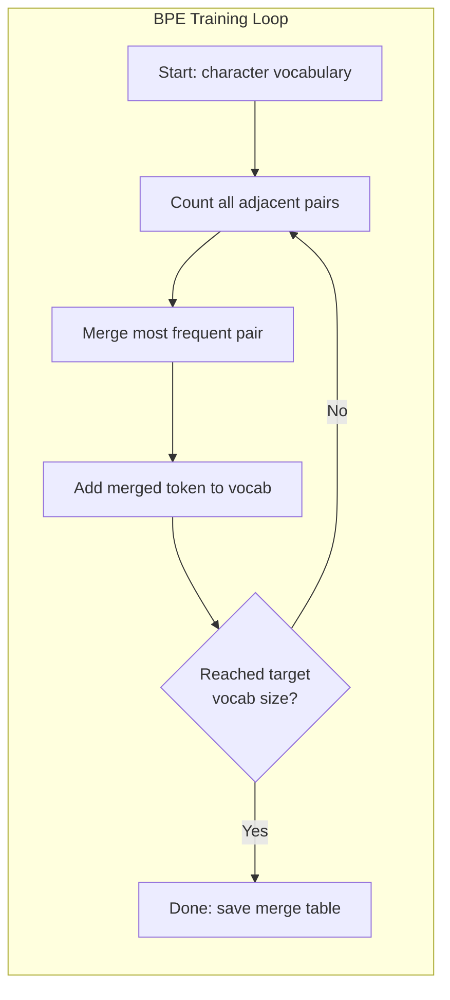

# Tokenizers: BPE, WordPiece, SentencePiece

> Your master of Laws doesn't understand English. It reads integers. The tokener determines whether these integers are meaningful or wasteful.

**Type:** Build
**Languages:** Python
**Prerequisites:** Phase 05 (NLP Foundations)
**Time:** ~90 minutes

## Learning objectives

- Implement the tokenization algorithms of BPE, WordPiece and Unigram from scratch and compare their merging strategies
- Explain how the size of the vocabulary affects model efficiency: too small will result in long sequences, and too large will waste embedded parameters
- Analyze cross-language and cross-code tokenized components to determine where specific tokeners fail
- Mark the text using the tiktoken and sentencepece libraries and check the result tag id

## This question

Your master of Laws doesn't understand English. It doesn't read any language. It reads numbers.

“Hello, world!” The gap between [15496,11,995,0] is the marker. Before the model is processed, every word, every space and every punctuation mark must be converted to an integer. This transformation is not neutral. It incorporates assumptions that cannot be revoked in the future into the model.

If you make a mistake in this, your model will waste the capacity to encode common words using multiple tags. Unfortunately, "unfortunately" turned into four tokens instead of one. For text with polysyllabic words, the 128K context window has been reduced by 75%. If used properly, the meaning of the same context window will double. The difference between "This model can handle code very well" and "This model is very bad on Python" usually boils down to how the tokener is trained.

Each API call you make to GPT-4 or Claude is priced by token. Each token generated by the model needs to be calculated. The fewer tokens required to represent the output, the faster the end-to-end inference will be. Tokenization is not preprocessing. It is a building.

## This concept

### Three Ways to Fail (One way to Succeed

There are three obvious ways to convert text to numbers. Among them, two cannot operate on a large scale.

** Word-level marking ** Split Spaces and punctuation marks. "The cat sat" became [The", "cat", "sat"]. Simple. But what about "tokenization"? Or "GPT-4o"? Or like Geschwindigkeitsbegrenzung German compound word? Word-level vocabulary requires a large number of words to cover every word of each language. If you miss a single word, you will face a terrifying punishment. There are over a million word forms in English alone. Add code, urls, scientific symbols and 100 other languages. You need an unlimited vocabulary.

*Character-level tokenization is another direction. "hello" has become [" h ", "e", "l", "l", "o"]. The vocabulary is very small (only a few hundred words). There are no unknown marks. But the sequence becomes very long. A sentence consisting of 10 word-level tags has become 50 character-level tags. This model must know that "t", "h", and "e" combined mean "The" - this is the amount of attention consumed by what humans learn at the age of three.

** Subword tokenization ** Find the best point. Common words remain intact: "the" is a symbol. Rare words are broken down into meaningful fragments: "Unhappy" becomes [" un ", "happi", "ness"]. The vocabulary list remains manageable (30K to 128K tags). Keep the sequence short. The unknown tags have basically disappeared because any word can be constructed from sub-word fragments.

Every modern master of Laws is tokenized using sub-words. GPT-2, GPT-4, BERT, Llama 3, Claude, everyone. The question is which algorithm to use.

"Mermaid"
Tu Daoming
A["Text: ' misery '"] -> B{"Tokenization Strategy"}
B -> > Word level: C["[' unhappy ']\n1 token if in vocab\n[UNK] if not"]
Grade of B - > | characters | D [[' u ', 'n', 'h', ', 'p', 'p', 'I', 'n', 'e', 's' and 's'] \ n11 token ")
B - > | Subword BPE | E [" (" United Nations ", "loose coat", "rock"] \ n3 token ")

Style C fill: #ff6b6b, color: #fff
Style D fill: #ffa500, color: #fff
Style E:#51cf66, Color :# fff
```

### BPE: Byte Pair Encoding

BPE is a greedy compression algorithm repurposed for tokenization. The idea is simple enough to fit on an index card.

Start with individual characters. Count every adjacent pair in the training corpus. Merge the most frequent pair into a new token. Repeat until you reach your target vocabulary size.

Here is BPE running on a tiny corpus with the words "lower", "lowest", and "newest":

```
Corpus (including word frequency) :
"Low" x5
"Minimum" x2
"Latest" x6

Step 0 -- Start with characters:
  l o w e r       (x5)
  l o w e s t     (x2)
  n e w e s t     (x6)

Step 1 - Calculate adjacent pairs:
(e,s): 8 (s,t): 8 (l,o): 7 (o,w): 7
(w,e): 13 (e,r): 5 (n,e): 6...

Step 2 - Merge the most frequent pairs (w,e) -> "we" :
We are (x5)
L = t (x ²)
N = t (x6)

Step 3 - Re-count and merge (e,s) -> "es" :
We are (x5)
L o we = t (x ²) <- 'es' can only be composed of 'e '+'s ', not 'we'+'s'.
N e we is t (x6) <- Wait a moment, the e before we and the s after we

To be precise:
After "we" merge, what remains is:
(1, 0) : 7 (0, we) : 7 (we, r) : 5 (we, s) : 8
(s,t): 8 (n,e): 6 (e,we): 6

Step 3 - Merge (we,s) -> "wes" or (s,t) -> "st" (list 8, choose first) :
Merge (we,s) -> "wes" :
We are (x5)
L o = t (x ²)
N = N = t (x6)

Step 4 -- Merge (wes,t) -> "west":
  l o we r        (x5)
  l o west        (x2)
  n e west        (x6)

... Keep going until you reach your target vocabulary.
```

The merge table is the tokenizer. To encode new text, apply merges in the order they were learned. The training corpus determines which merges exist, and that choice permanently shapes what the model sees.



### Byte-level BPE (GPT-2, GPT-3, GPT-4)

Standard BPE operates on Unicode characters. Byte-level BPE operates on raw bytes (0-255). This provides you with exactly 256 basic vocabularies that can handle any language or encoding and will never generate unknown tags.

GPT-2 introduced this method. The basic vocabulary list covers all possible bytes. The BPE merger was established on this basis. OpenAI's tiktoken library achieves byte-level BPE through the following vocabulary size:

- GPT-2: 50,257 tokens
- GPT-3.5/GPT-4: ~100,256 tags (cl100k_base encoding)
- gpt-40:200,019 tags (o200k_base encoding)

### WordPiece (BERT)

WordPiece looks similar to BPE, but the way of choosing to merge is different. It is not the original frequency, but rather the possibility of maximizing the training data:

```
BPE merge criterion:      count(A, B)
WordPiece merge criterion: count(AB) / (count(A) * count(B))
```

BPE asked, "Which pair appears most frequently?" WordPiece asked, "Which pair appears together more often than you think?" This subtle difference gives rise to different words. WordPiece loves those surprising merges, not just frequent ones.

WordPiece also uses the prefix "##" as a continuation subword:

```
"unhappiness" -> ["un", "##happi", "##ness"]
"embedding"   -> ["em", "##bed", "##ding"]
```

The "##" prefix tells you that this part is a continuation of the previous tag. BERT uses WordPiece, which has a vocabulary of 30,522 symbols. Each BERT variant - the distiller, RoBERTa's tokener is actually a BPE, but BERT itself is a WordPiece.

### Sentence Sheet (Alpaca, T5)

sentencepece processes the input as the raw stream of Unicode characters (including Spaces). There is no pre-tokenization step. There are no specific language rules regarding word boundaries. This makes it a true language agnostic - it applies to Chinese, Japanese, Thai and other languages where words are not separated by Spaces.

sentencepece supports two algorithms:
- BPE pattern: The same merging logic as standard BPE, applied to the original character sequence
- ** Unary Pattern ** : Starting from a large vocabulary, iteratively remove the tags that have the least possibility of affecting the overall situation. Contrary to BPE - streamline rather than merge.

Llama 2 uses sentencepece BPE and has a vocabulary of 32,000 labels. T5 uses sentencepece Unigram with 32,000 tokens. Note: Llama 3 switches to a token-based byte-level BPE tokener with 128,256 tokens.

### The trade-off of vocabulary

This is a genuine engineering decision with measurable results.

"Mermaid"
"Figure LR
Subgraph Small["Small Vocab (32K)\ne.g.] ", ", "[qh]
S1[" More marks for each text "]
S2(" Long Sequence"
S3[" Smaller Embedding Matrix "]
S4[" Better Rare Word Processing "]
Over
subgraph Large["Large Vocab (128K+)\ne.g.], alpaca 3, gpt-40 "]
L1[Fewer symbols per text]
L2(" Short sequence"
L3[Large Embedding Matrix]
L4(" Fast Inference"
Over
```

Concrete numbers. For a 128K vocabulary with 4,096-dimensional embeddings, the embedding matrix alone is 128,000 x 4,096 = 524 million parameters. For a 32K vocabulary, it is 131 million parameters. That is a 400M parameter difference from the tokenizer choice alone.

But larger vocabularies compress text more aggressively. The same English paragraph that takes 100 tokens with a 32K vocabulary might take 70 tokens with a 128K vocabulary. That means 30% fewer forward passes during generation. For a model serving millions of requests, that is a direct reduction in compute cost.

The trend is clear: vocabulary sizes are growing. GPT-2 used 50,257. GPT-4 uses ~100K. Llama 3 uses 128K. GPT-4o uses 200K.

| Model | Vocab Size | Tokenizer Type | Avg Tokens per English Word |
|-------|-----------|----------------|---------------------------|
| BERT | 30,522 | WordPiece | ~1.4 |
| GPT-2 | 50,257 | Byte-level BPE | ~1.3 |
| Llama 2 | 32,000 | SentencePiece BPE | ~1.4 |
| GPT-4 | ~100,256 | Byte-level BPE | ~1.2 |
| Llama 3 | 128,256 | Byte-level BPE (tiktoken) | ~1.1 |
| GPT-4o | 200,019 | Byte-level BPE | ~1.0 |

### The Multilingual Tax

Tokenizers trained primarily on English are brutal to other languages. Korean text in GPT-2's tokenizer averages 2-3 tokens per word. Chinese can be worse. This means a Korean user effectively has a context window that is half the size of an English user's -- paying the same price for less information density.

This is why Llama 3 quadrupled its vocabulary from 32K to 128K. More tokens dedicated to non-English scripts means fairer compression across languages.

## Build It

### Step 1: Character-Level Tokenizer

Start at the foundation. A character-level tokenizer maps each character to its Unicode code point. No training needed. No unknown tokens. Just a direct mapping.

```python
class CharTokenizer:
    def encode(self, text):
        return [ord(c) for c in text]

    def decode(self, tokens):
        return "".join(chr(t) for t in tokens)
```

"hello" has become [104,101,108,108,111]. Each character has its own mark. This is the baseline we have improved.

### Step 2: Start the BPE marker from scratch

True realization. We train on raw bytes (such as GPT-2), count pairs, merge the most frequent data, and record each merge in sequence. The merge table is a tokener.

”“python
Import the counter from the collection

Class BPETokenizer:
def __init__(self):
Self. Merge = {}
Self. Vocabulary = {}

Def _get_pairs(self, tokens) :
pairs = Counter ()
For I in range (len(tokens) - 1) :
For [(token [i], token [i + 1])] += 1
Return correct

Def _merge_pair(self, tokens, pair, new_token) :
Merge = []
I = 0
When I < len(tokens) :
If I < len(tokens) - 1 and tokens[I] == pair[0] and tokens[I + 1] == pair[1] :
merged.append (new_token)
I += 2
Others
merged.append(Token [Me])
I += 1
Return to Merge

Def train(self, text, num_merges)：
Token = list（text.encode("utf-8")）
自我。Vocab = {i: bytes([i]) for i in range(256)}

（num_merges）：
Pairs = self._get_pairs（tokens）
如果不是成对的：
打破
Best_pair = max（pairs, key=pairs.get）
New_token = 256 + 1
Token = self。_merge_pair（tokens, best_pair, new_token）
自我。[best_pair] = new_token
自我。Vocab [new_token] = self。[best_pair[0]] + self.vocab[best_pair[1]]

Return to oneself

Def encode(self, text)：
Token = list（text.encode("utf-8")）
成对，自我。合并.items（）
Token = self。_merge_pair（tokens, pair, new_token）
返回标记

Def decode(self, tokens) :
Byte_sequence = b"".join(self. The word [t] represents the "t" in the symbol
Return byte_sequence.decode ("utf-8", errors="replace")
```

The training loop is the core of BPE: count pairs, merge the winner, repeat. Each merge reduces the total token count. After `num_merges` rounds, the vocabulary grows from 256 (base bytes) to 256 + num_merges.

Encoding applies merges in the exact order they were learned. This matters. If merge 1 created "th" and merge 5 created "the", encoding must apply merge 1 first so that "the" can form from "th" + "e" in merge 5.

Decoding is the inverse: look up each token ID in the vocabulary, concatenate the bytes, decode to UTF-8.

### Step 3: Encode and Decode Roundtrip

```python
corpus = (
    "The cat sat on the mat. The cat ate the rat. "
    "The dog sat on the log. The dog ate the frog. "
    "Natural language processing is the study of how computers "
    "understand and generate human language. "
    "Tokenization is the first step in any NLP pipeline."
)

tokenizer = BPETokenizer()
tokenizer.train(corpus, num_merges=40)

test_sentences = [
    "The cat sat on the mat.",
    "Natural language processing",
    "tokenization pipeline",
    "unhappiness",
]

for sentence in test_sentences:
    encoded = tokenizer.encode(sentence)
    decoded = tokenizer.decode(encoded)
    raw_bytes = len(sentence.encode("utf-8"))
    ratio = len(encoded) / raw_bytes
    print(f"'{sentence}'")
    print(f"  Tokens: {len(encoded)} (from {raw_bytes} bytes) -- ratio: {ratio:.2f}")
    print(f"  Roundtrip: {'PASS' if decoded == sentence else 'FAIL'}")
```

The compression ratio tells you the effectiveness of the tokener. A ratio of 0.50 means that the tokener compresses the text to half the original number of bytes. The lower, the better. The ratio will be very good on the training corpus. For texts like "unhappy" that are not within the distribution range (and do not appear in the corpus), this ratio is even worse - the tokener will revert to character-level encoding to handle the invisible patterns.

### Step 4: Compare with tiktoken

”“python
Import tiktoken

enc = tiktoken.get_encoding("cl100k_base")

Text = [
The cat is sitting on the cushion.
"Unhappy"
“Hello, world !”
"def fibonacci(n) : return n if n < 2, otherwise fibonacci(n-1) + fibonacci(n-2)"
“Geschwindigkeitsbegrenzung”,
]

for text in texts:
    our_tokens = tokenizer.encode(text)
    tiktoken_tokens = enc.encode(text)
    tiktoken_pieces = [enc.decode([t]) for t in tiktoken_tokens]
    print(f"'{text}'")
    print(f"  Our BPE:   {len(our_tokens)} tokens")
    print(f"  tiktoken:  {len(tiktoken_tokens)} tokens -> {tiktoken_pieces}")
```

tiktoken uses the exact same algorithm but trained on hundreds of gigabytes of text with 100,000 merges. The algorithm is identical. The difference is the training data and the number of merges. Your tokenizer trained on a paragraph with 40 merges cannot compete with tiktoken's 100K merges on a massive corpus. But the mechanism is the same.

### Step 5: Vocabulary Analysis

```python
def analyze_vocabulary(tokenizer, test_texts):
    total_tokens = 0
    total_chars = 0
    token_usage = Counter()

    for text in test_texts:
        encoded = tokenizer.encode(text)
        total_tokens += len(encoded)
        total_chars += len(text)
        for t in encoded:
            token_usage[t] += 1

    print(f"Vocabulary size: {len(tokenizer.vocab)}")
    print(f"Total tokens across all texts: {total_tokens}")
    print(f"Total characters: {total_chars}")
    print(f"Avg tokens per character: {total_tokens / total_chars:.2f}")

    print(f"\nMost used tokens:")
    for token_id, count in token_usage.most_common(10):
        token_bytes = tokenizer.vocab[token_id]
        display = token_bytes.decode("utf-8", errors="replace")
        print(f"  Token {token_id:4d}: '{display}' (used {count} times)")

    unused = [t for t in tokenizer.vocab if t not in token_usage]
    print(f"\nUnused tokens: {len(unused)} out of {len(tokenizer.vocab)}")
```

This shows the Zipf distribution in the vocabulary list. Some symbols are dominant (Spaces, "the", "e"). Most tokens are rarely used. The production tokener has been optimized for this distribution - common patterns obtain shorter tag ids, while rare patterns obtain longer representations.

## Use it

Your scratch BPE work. Now take a look at what the production tools look like.

### tiktoken (OpenAI)

”“python
Import tiktoken

enc = tiktoken.get_encoding("cl100k_base")

text = "Tokenizers convert text to integers"
token = encs.encode (text)
Print (f "token :{token}")
print (f"Pieces: {[cn.decode ([t]) for t in tokens]}")
Print (f "round trip :{enc.decode(token)}")
```

tiktoken is written in Rust with Python bindings. It encodes millions of tokens per second. Same BPE algorithm, industrial-strength implementation.

### Hugging Face tokenizers

```python
from tokenizers import Tokenizer
from tokenizers.models import BPE
from tokenizers.trainers import BpeTrainer
from tokenizers.pre_tokenizers import ByteLevel

tokenizer = Tokenizer(BPE())
tokenizer.pre_tokenizer = ByteLevel()

trainer = BpeTrainer(vocab_size=1000, special_tokens=["<pad>", "<eos>", "<unk>"])
tokenizer.train(["corpus.txt"], trainer)

output = tokenizer.encode("The cat sat on the mat.")
print(f"Tokens: {output.tokens}")
print(f"IDs: {output.ids}")
```

The hugs Face tokenizers library is also the underlying layer of Rust. It can train BPE on a gigabit corpus in just a few seconds. This is the method you use when training your own model.

### Load the Tokenizer of Llama

”“python
Import AutoTokenizer from the transformer

tokenizer = AutoTokenizer.from_pretrained（"meta-llama/ lama-3.1- 8b "）

Tokenizers are the unsung heroes of the Master of Laws.
token = tokenizer.encode (text)
print (f"Token id: {Token}")
Print (f "token :{tokenizer.convert_ids_to_tokens}")
print (f"Vocab size: {tokenizer.vocab_size}")

多语言= ["Hello world", "Hola mundo", "Hello world"]
多语种文本：
id = tokenizer.encode（文本）
打印（f"'{text}' -> {len(ids)} token "）
```

Llama 3's 128K vocabulary compresses non-English text significantly better than GPT-2's 50K vocabulary. You can verify this yourself -- encode the same sentence in multiple languages and count the tokens.

## Ship It

This lesson produces `outputs/prompt-tokenizer-analyzer.md` -- a reusable prompt that analyzes tokenization efficiency for any text and model combination. Feed it a text sample and it tells you which model's tokenizer handles it best.

## Exercises

1. Modify the BPE tokenizer to print the vocabulary at each merge step. Watch how "t" + "h" becomes "th", then "th" + "e" becomes "the". Track how common English words get assembled piece by piece.

2. Add special tokens (`<pad>`, `<eos>`, `<unk>`) to the BPE tokenizer. Assign them IDs 0, 1, 2 and shift all other tokens accordingly. Implement a pre-tokenization step that splits on whitespace before running BPE.

3. Implement the WordPiece merge criterion (likelihood ratio instead of frequency). Train both BPE and WordPiece on the same corpus with the same number of merges. Compare the resulting vocabularies -- which one produces more linguistically meaningful subwords?

4. Build a multilingual tokenizer efficiency benchmark. Take 10 sentences in English, Spanish, Chinese, Korean, and Arabic. Tokenize each with tiktoken (cl100k_base) and measure the average tokens per character. Quantify the "multilingual tax" for each language.

5. Train your BPE tokenizer on a larger corpus (download a Wikipedia article). Tune the number of merges to achieve a compression ratio within 10% of tiktoken on that same text. This forces you to understand the relationship between corpus size, merge count, and compression quality.

## Key Terms

| Term | What people say | What it actually means |
|------|----------------|----------------------|
| Token | "A word" | A unit in the model's vocabulary -- could be a character, subword, word, or multi-word chunk |
| BPE | "Some compression thing" | Byte Pair Encoding -- iteratively merge the most frequent adjacent pair of tokens until the target vocabulary size is reached |
| WordPiece | "BERT's tokenizer" | Like BPE but merges maximize the likelihood ratio count(AB)/(count(A)*count(B)) instead of raw frequency |
| SentencePiece | "A tokenizer library" | A language-agnostic tokenizer that operates on raw Unicode without pre-tokenization, supporting BPE and Unigram algorithms |
| Vocabulary size | "How many words it knows" | The total number of unique tokens: GPT-2 has 50,257, BERT has 30,522, Llama 3 has 128,256 |
| Fertility | "Not a tokenizer term" | Average number of tokens per word -- measures tokenizer efficiency across languages (1.0 is perfect, 3.0 means the model works three times harder) |
| Byte-level BPE | "GPT's tokenizer" | BPE operating on raw bytes (0-255) instead of Unicode characters, guaranteeing no unknown tokens for any input |
| Merge table | "The tokenizer file" | Ordered list of pair merges learned during training -- this IS the tokenizer, and order matters |
| Pre-tokenization | "Splitting on spaces" | Rules applied before subword tokenization: whitespace splitting, digit separation, punctuation handling |
| Compression ratio | "How efficient the tokenizer is" | Tokens produced divided by input bytes -- lower means better compression and faster inference |

## Further Reading

- [Sennrich et al., 2016 -- "Neural Machine Translation of Rare Words with Subword Units"](https://arxiv.org/abs/1508.07909) -- the paper that introduced BPE for NLP, turning a 1994 compression algorithm into the foundation of modern tokenization
- [Kudo & Richardson, 2018 -- "SentencePiece: A simple and language independent subword tokenizer"](https://arxiv.org/abs/1808.06226) -- language-agnostic tokenization that made multilingual models practical
- [OpenAI tiktoken repository](https://github.com/openai/tiktoken) -- production BPE implementation in Rust with Python bindings, used by GPT-3.5/4/4o
- [Hugging Face Tokenizers documentation](https://huggingface.co/docs/tokenizers) -- production-grade tokenizer training with Rust performance