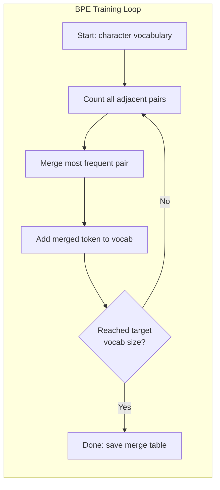

# Tokenizers: BPE, WordPiece, SentencePiece

> 你的法律硕士不懂英语。它读取整数。标记器确定这些整数是有意义的还是浪费的。

**Type:** Build
**Languages:** Python
**Prerequisites:** Phase 05 (NLP Foundations)
**Time:** ~90 minutes

## 学习目标

- 从头开始实现BPE， WordPiece和Unigram的标记化算法，并比较它们的合并策略
- 解释词汇表的大小如何影响模型效率：太小将导致长序列，太大将浪费嵌入参数
- 分析跨语言和跨代码标记化组件，以确定特定标记失败的地方
- 使用tiktoken和sentencepece库标记文本，并检查结果标记id

## 这个问题

你的法律硕士不懂英语。它不读任何语言。它读取数字。

“你好,世界!”[15496, 11995,0]之间的距离是标记。在对模型进行处理之前，必须将每个单词、每个空格和每个标点符号转换为整数。这个变换不是中性的。它将未来无法撤销的假设纳入模型。

如果您在这方面犯了一个错误，您的模型将浪费使用多个标记对常见单词进行编码的能力。不幸的是，“不幸”变成了四个代币，而不是一个。对于含有多音节单词的文本，128K上下文窗口减少了75%。如果使用得当，同一上下文窗口的含义将加倍。“这个模型可以很好地处理代码”和“这个模型在Python上非常糟糕”之间的区别通常归结为如何训练标记器。

对GPT-4或Claude的每个API调用都是按令牌定价的。模型生成的每个令牌都需要计算。表示输出所需的令牌越少，端到端推理就越快。标记化不是预处理。它是一座建筑。

## 这个概念

### 三种失败方式(一种成功方式

有三种明显的方法可以将文本转换为数字。其中有两家无法大规模运营。

**分隔空格和标点符号。“The cat sat”变成了[The", "cat", "sat"]。简单。但是“标记化”呢？或“GPT-4o”?还是德语复合词Geschwindigkeitsbegrenzung ？单词级词汇需要大量的单词来涵盖每种语言的每个单词。如果你漏掉一个字，你将面临可怕的惩罚。仅英语中就有超过一百万的单词形式。添加代码，网址，科学符号和其他100种语言。你需要无限的词汇量。

*字符级标记化是另一个方向。“hello”变成了[“h”，“e”，“l”，“l”，“o”]。词汇量很少（只有几百个单词）。没有未知的痕迹。但是序列变得很长。一个由10个词级标签组成的句子变成了50个字符级标签。这个模型必须知道“t”、“h”和“e”的组合意味着“The”——这是人类在三岁时学习所消耗的注意力。

**子词标记**找到最佳点。常用词保持不变：“the”是一个符号。罕见的单词被分解成有意义的片段：“不开心”变成了[“un”，“happi”，“ness”]。词汇表列表仍然可以管理（30K到128K标记）。保持序列简短。未知标签基本上消失了，因为任何词都可以从子词片段中构造出来。

每个现代法律大师都用子词来标记。GPT-2, GPT-4， BERT, Llama 3, Claude，所有人。问题是使用哪种算法。

“mermaid”
你Daoming
A["Text: ' misery '"] -> B{"Tokenization Strategy"}
B -> >单词级别：C["[' ' happy ']\n1 token if in vocab\n[UNK] if not"]
等级的B - > | |字符D [[' u ', ' n ', ' h ', ', ' p ', ' ', '我',' n ', ' e ', ' s’和‘s’]\ n11牌”)
B - > |子词BPE | E [" （" United Nations ", "loose coat", "rock"] \ n3 token "）

Style C fill: #ff6b6b, color: #fff
Style D fill: #ffa500, color: #fff
Style E:#51cf66, Color :# fff
```

### BPE: Byte Pair Encoding

BPE is a greedy compression algorithm repurposed for tokenization. The idea is simple enough to fit on an index card.

Start with individual characters. Count every adjacent pair in the training corpus. Merge the most frequent pair into a new token. Repeat until you reach your target vocabulary size.

Here is BPE running on a tiny corpus with the words "lower", "lowest", and "newest":

```
语料库（含词频）：
“低”x5
“最低”x2
“最新”x6

Step 0 -- Start with characters:
  l o w e r       (x5)
  l o w e s t     (x2)
  n e w e s t     (x6)

Step 1 - Calculate adjacent pairs:
(e,s): 8 (s,t): 8 (l,o): 7 (o,w): 7
(w,e): 13 (e,r): 5 (n,e): 6...

步骤2 -合并最频繁的对(w,e) ->“we”：
我们是（x5）
L = t （x²）
N = t （x6）

步骤3 -重新计数并合并(e,s) -> "es"：
我们是（x5）
L o we = t （x²）<- 'es‘只能由’e '+'s‘组成，而不是’we'+'s'。
nwe = t (x6) <-等一下，前面的e和后面的s

准确地说：
在“我们”合并之后，剩下的是：
（1,0）： 7 (0, we): 7 (we, r): 5 (we, s): 8
（s,t）： 8 (n,e): 6 (e,we): 6

步骤3 -合并(we,s) -> "wes“或(s,t) -> ”st"（列表8，选择第一个）：
合并(we,s) -> "wes"：
我们是（x5）
L o = t （x²）
N = N = t （x6）

Step 4 -- Merge (wes,t) -> "west":
  l o we r        (x5)
  l o west        (x2)
  n e west        (x6)

…继续练习，直到达到目标词汇量。
```

The merge table is the tokenizer. To encode new text, apply merges in the order they were learned. The training corpus determines which merges exist, and that choice permanently shapes what the model sees.



### 字节级BPE （GPT-2, GPT-3, GPT-4）

标准BPE操作Unicode字符。字节级BPE对原始字节（0-255）进行操作。这为您提供了256个基本词汇表，可以处理任何语言或编码，并且永远不会生成未知标记。

GPT-2介绍了这种方法。基本词汇表列表涵盖了所有可能的字节。BPE的合并就是在此基础上建立起来的。OpenAI的tiktoken库通过以下词汇表大小实现字节级BPE：

- GPT-2: 50,257个token
- GPT-3.5/GPT-4: ~100,256个标签（cl100k_base编码）
- Gpt-40:200,019 tags （o200k_base编码）

### WordPiece (BERT)

WordPiece看起来与BPE相似，但选择合并的方式不同。它不是原始频率，而是训练数据最大化的可能性：

```
BPE merge criterion:      count(A, B)
WordPiece merge criterion: count(AB) / (count(A) * count(B))
```

BPE问：“哪一对出现得最频繁？”WordPiece问：“哪一对一起出现的次数比你想象的要多？”这种细微的差别产生了不同的词。WordPiece喜欢那些令人惊讶的合并，而不仅仅是频繁的合并。

WordPiece还使用前缀“##”作为延续子词：

```
"unhappiness" -> ["un", "##happi", "##ness"]
"embedding"   -> ["em", "##bed", "##ding"]
```

“##”前缀告诉您，这一部分是前一个标记的延续。BERT使用的是WordPiece，它的词汇量为30522个符号。每个BERT变体-蒸馏器，RoBERTa的标记物实际上是一个BPE，但BERT本身是一个WordPiece。

### 句子表（羊驼，T5）

sensenepece将输入作为Unicode字符（包括空格）的原始流处理。没有预标记化步骤。关于单词的边界没有特定的语言规则。这使得它成为一个真正的语言不可知论者——它适用于汉语、日语、泰语和其他没有空格分隔的语言。

Sentencepece支持两种算法：
- BPE模式：与标准BPE相同的合并逻辑，应用于原始字符序列
- **一元模式**：从较大的词汇表开始，迭代地删除影响整体情况可能性最小的标记。与BPE相反，精简而不是合并。

羊驼2使用句子式BPE，拥有32,000个标签的词汇量。T5使用带有32,000个令牌的句子组Unigram。注意：Llama 3切换到具有128,256个令牌的基于令牌的字节级BPE令牌器。

### 词汇的取舍

这是一个具有可测量结果的真正的工程决策。

“mermaid”
“图LR
子图Small["Small Vocab (32K)\ne.g.][qh]
S1[每篇文章加分]
S2（长序列）
S3[“更小的嵌入矩阵”]
S4[“更好的稀有文字处理”]
在
subgraph Large["Large Vocab (128K+)\ne.g.]]，羊驼3，gpt-40 "]
L1[每篇文字较少的符号]
L2（“短序列”）
L3[大型嵌入矩阵]
L4（“快速推理”）
在
```

Concrete numbers. For a 128K vocabulary with 4,096-dimensional embeddings, the embedding matrix alone is 128,000 x 4,096 = 524 million parameters. For a 32K vocabulary, it is 131 million parameters. That is a 400M parameter difference from the tokenizer choice alone.

But larger vocabularies compress text more aggressively. The same English paragraph that takes 100 tokens with a 32K vocabulary might take 70 tokens with a 128K vocabulary. That means 30% fewer forward passes during generation. For a model serving millions of requests, that is a direct reduction in compute cost.

The trend is clear: vocabulary sizes are growing. GPT-2 used 50,257. GPT-4 uses ~100K. Llama 3 uses 128K. GPT-4o uses 200K.

| Model | Vocab Size | Tokenizer Type | Avg Tokens per English Word |
|-------|-----------|----------------|---------------------------|
| BERT | 30,522 | WordPiece | ~1.4 |
| GPT-2 | 50,257 | Byte-level BPE | ~1.3 |
| Llama 2 | 32,000 | SentencePiece BPE | ~1.4 |
| GPT-4 | ~100,256 | Byte-level BPE | ~1.2 |
| Llama 3 | 128,256 | Byte-level BPE (tiktoken) | ~1.1 |
| GPT-4o | 200,019 | Byte-level BPE | ~1.0 |

### The Multilingual Tax

Tokenizers trained primarily on English are brutal to other languages. Korean text in GPT-2's tokenizer averages 2-3 tokens per word. Chinese can be worse. This means a Korean user effectively has a context window that is half the size of an English user's -- paying the same price for less information density.

This is why Llama 3 quadrupled its vocabulary from 32K to 128K. More tokens dedicated to non-English scripts means fairer compression across languages.

## Build It

### Step 1: Character-Level Tokenizer

Start at the foundation. A character-level tokenizer maps each character to its Unicode code point. No training needed. No unknown tokens. Just a direct mapping.

```python
class CharTokenizer:
    def encode(self, text):
        return [ord(c) for c in text]

    def decode(self, tokens):
        return "".join(chr(t) for t in tokens)
```

“hello”变成了[104,101,108,108,111]。每个字符都有自己的标记。这是我们改进的基线。

### 步骤2：从头开始BPE标记

真正的实现。我们在原始字节（如GPT-2）上进行训练，计数对，合并最频繁的数据，并按顺序记录每次合并。合并表是一个标记。

”“python
从集合中导入计数器

类BPETokenizer:
def __init__(自我):
自我。合并= {}
自我。词汇= {}

Def _get_pairs(self, tokens)：
pairs = Counter （）
对于I在range （len(tokens) - 1）中：
对于[(token [i], token [i + 1])] += 1
返回正确

Def _merge_pair(self, tokens, pair, new_token)：
合并= []
I = 0
当我< len（tokens）时：
如果我< len(tokens) - 1 and tokens[I] == pair[0] and tokens[I + 1] == pair[1]：
合并。追加(new_token)
I += 2
其他人
合并。追加(令牌[我])
I += 1
返回合并

Def train(self, text, num_merges)：
Token = list（text.encode("utf-8")）
自我。Vocab = {i: bytes([i]) for i in range(256)}

(num_merges):
Pairs = self._get_pairs（tokens）
如果不是成对的：
打破
Best_pair = max（pairs, key=pairs.get）
New_token = 256 + 1
Token = self。_merge_pair（tokens, best_pair, new_token）
自我。[best_pair] = new_token
自我。Vocab [new_token] = self。[best_pair[0]] + self.vocab[best_pair[1]]

回归自我

Def encode(self, text)：
Token = list（text.encode("utf-8")）
1 .项目（）
Token = self。_merge_pair（tokens, pair, new_token）
返回标记

Def decode(self, tokens)：
Byte_sequence = b"".join(self。单词[t]代表符号中的“t”
返回byte_sequence.decode （"utf-8", errors="replace"）
```

The training loop is the core of BPE: count pairs, merge the winner, repeat. Each merge reduces the total token count. After `num_merges` rounds, the vocabulary grows from 256 (base bytes) to 256 + num_merges.

Encoding applies merges in the exact order they were learned. This matters. If merge 1 created "th" and merge 5 created "the", encoding must apply merge 1 first so that "the" can form from "th" + "e" in merge 5.

Decoding is the inverse: look up each token ID in the vocabulary, concatenate the bytes, decode to UTF-8.

### Step 3: Encode and Decode Roundtrip

```python
corpus = (
    "The cat sat on the mat. The cat ate the rat. "
    "The dog sat on the log. The dog ate the frog. "
    "Natural language processing is the study of how computers "
    "understand and generate human language. "
    "Tokenization is the first step in any NLP pipeline."
)

tokenizer = BPETokenizer()
tokenizer.train(corpus, num_merges=40)

test_sentences = [
    "The cat sat on the mat.",
    "Natural language processing",
    "tokenization pipeline",
    "unhappiness",
]

for sentence in test_sentences:
    encoded = tokenizer.encode(sentence)
    decoded = tokenizer.decode(encoded)
    raw_bytes = len(sentence.encode("utf-8"))
    ratio = len(encoded) / raw_bytes
    print(f"'{sentence}'")
    print(f"  Tokens: {len(encoded)} (from {raw_bytes} bytes) -- ratio: {ratio:.2f}")
    print(f"  Roundtrip: {'PASS' if decoded == sentence else 'FAIL'}")
```

压缩比告诉您标记器的有效性。比率为0.50表示标记器将文本压缩到原始字节数的一半。越低越好。这个比率在训练语料库上会非常好。对于像“不高兴”这样不在分布范围内的文本（并且没有出现在语料库中），这个比率甚至更糟——标记器将恢复到字符级编码来处理不可见的模式。

### 第四步：与tiktoken进行比较

”“python
进口tiktoken

enc = tiktoken.get_encoding("cl100k_base")

文本= [
猫正坐在垫子上。
“不开心”
“你好，世界！”
“def fibonacci(n)：如果n < 2则返回n，否则fibonacci(n-1) + fibonacci(n-2)”
“Geschwindigkeitsbegrenzung”,
］

for text in texts:
    our_tokens = tokenizer.encode(text)
    tiktoken_tokens = enc.encode(text)
    tiktoken_pieces = [enc.decode([t]) for t in tiktoken_tokens]
    print(f"'{text}'")
    print(f"  Our BPE:   {len(our_tokens)} tokens")
    print(f"  tiktoken:  {len(tiktoken_tokens)} tokens -> {tiktoken_pieces}")
```

tiktoken uses the exact same algorithm but trained on hundreds of gigabytes of text with 100,000 merges. The algorithm is identical. The difference is the training data and the number of merges. Your tokenizer trained on a paragraph with 40 merges cannot compete with tiktoken's 100K merges on a massive corpus. But the mechanism is the same.

### Step 5: Vocabulary Analysis

```python
def analyze_vocabulary(tokenizer, test_texts):
    total_tokens = 0
    total_chars = 0
    token_usage = Counter()

    for text in test_texts:
        encoded = tokenizer.encode(text)
        total_tokens += len(encoded)
        total_chars += len(text)
        for t in encoded:
            token_usage[t] += 1

    print(f"Vocabulary size: {len(tokenizer.vocab)}")
    print(f"Total tokens across all texts: {total_tokens}")
    print(f"Total characters: {total_chars}")
    print(f"Avg tokens per character: {total_tokens / total_chars:.2f}")

    print(f"\nMost used tokens:")
    for token_id, count in token_usage.most_common(10):
        token_bytes = tokenizer.vocab[token_id]
        display = token_bytes.decode("utf-8", errors="replace")
        print(f"  Token {token_id:4d}: '{display}' (used {count} times)")

    unused = [t for t in tokenizer.vocab if t not in token_usage]
    print(f"\nUnused tokens: {len(unused)} out of {len(tokenizer.vocab)}")
```

这显示了词汇表列表中的Zipf分布。有些符号占主导地位（空格，“the”，“e”）。大多数令牌很少被使用。生产标记已经针对这种分布进行了优化——常见模式获得较短的标记id，而罕见模式获得较长的表示。

## 使用它

你的划痕BPE工作。现在看看生产工具是什么样子的。

### tiktoken (OpenAI)

”“python
进口tiktoken

enc = tiktoken.get_encoding("cl100k_base")

text = “Tokenizers将文本转换为整数”
Token = s。编码(文本)
Print （f "token:{token}"）
print （f"Pieces: {[cn.decode ([t]) for t in tokens]}"）
Print （f "round trip:{encs .decode(token)}"）
```

tiktoken is written in Rust with Python bindings. It encodes millions of tokens per second. Same BPE algorithm, industrial-strength implementation.

### Hugging Face tokenizers

```python
from tokenizers import Tokenizer
from tokenizers.models import BPE
from tokenizers.trainers import BpeTrainer
from tokenizers.pre_tokenizers import ByteLevel

tokenizer = Tokenizer(BPE())
tokenizer.pre_tokenizer = ByteLevel()

trainer = BpeTrainer(vocab_size=1000, special_tokens=["<pad>", "<eos>", "<unk>"])
tokenizer.train(["corpus.txt"], trainer)

output = tokenizer.encode("The cat sat on the mat.")
print(f"Tokens: {output.tokens}")
print(f"IDs: {output.ids}")
```

hugs Face tokenizers库也是Rust的底层。它可以在几秒钟内在千兆语料库上训练BPE。这是您在训练自己的模型时使用的方法。

### 载入Llama的Tokenizer

”“python
从转换器导入AutoTokenizer

tokenizer = AutoTokenizer.from_pretrained（"meta-llama/ lama-3.1- 8b "）

符号化者是法律大师的无名英雄。
Token = tokenizer。编码(文本)
print （f"Token id: {Token}"）
Print （f "token:{tokenizer.convert_ids_to_tokens}"）
print （f"Vocab size: {tokenizer.vocab_size}"）

Multilingual = ["Hello world", "Hola mundo", "Hello world"]
Multilingual text
id = tokenizer.encode (Text)
Print (f"'{text}' -> {len(ids)} token ")
```

Llama 3's 128K vocabulary compresses non-English text significantly better than GPT-2's 50K vocabulary. You can verify this yourself -- encode the same sentence in multiple languages and count the tokens.

## Ship It

This lesson produces `outputs/prompt-tokenizer-analyzer.md` -- a reusable prompt that analyzes tokenization efficiency for any text and model combination. Feed it a text sample and it tells you which model's tokenizer handles it best.

## Exercises

1. Modify the BPE tokenizer to print the vocabulary at each merge step. Watch how "t" + "h" becomes "th", then "th" + "e" becomes "the". Track how common English words get assembled piece by piece.

2. Add special tokens (`<pad>`, `<eos>`, `<unk>`) to the BPE tokenizer. Assign them IDs 0, 1, 2 and shift all other tokens accordingly. Implement a pre-tokenization step that splits on whitespace before running BPE.

3. Implement the WordPiece merge criterion (likelihood ratio instead of frequency). Train both BPE and WordPiece on the same corpus with the same number of merges. Compare the resulting vocabularies -- which one produces more linguistically meaningful subwords?

4. Build a multilingual tokenizer efficiency benchmark. Take 10 sentences in English, Spanish, Chinese, Korean, and Arabic. Tokenize each with tiktoken (cl100k_base) and measure the average tokens per character. Quantify the "multilingual tax" for each language.

5. Train your BPE tokenizer on a larger corpus (download a Wikipedia article). Tune the number of merges to achieve a compression ratio within 10% of tiktoken on that same text. This forces you to understand the relationship between corpus size, merge count, and compression quality.

## Key Terms

| Term | What people say | What it actually means |
|------|----------------|----------------------|
| Token | "A word" | A unit in the model's vocabulary -- could be a character, subword, word, or multi-word chunk |
| BPE | "Some compression thing" | Byte Pair Encoding -- iteratively merge the most frequent adjacent pair of tokens until the target vocabulary size is reached |
| WordPiece | "BERT's tokenizer" | Like BPE but merges maximize the likelihood ratio count(AB)/(count(A)*count(B)) instead of raw frequency |
| SentencePiece | "A tokenizer library" | A language-agnostic tokenizer that operates on raw Unicode without pre-tokenization, supporting BPE and Unigram algorithms |
| Vocabulary size | "How many words it knows" | The total number of unique tokens: GPT-2 has 50,257, BERT has 30,522, Llama 3 has 128,256 |
| Fertility | "Not a tokenizer term" | Average number of tokens per word -- measures tokenizer efficiency across languages (1.0 is perfect, 3.0 means the model works three times harder) |
| Byte-level BPE | "GPT's tokenizer" | BPE operating on raw bytes (0-255) instead of Unicode characters, guaranteeing no unknown tokens for any input |
| Merge table | "The tokenizer file" | Ordered list of pair merges learned during training -- this IS the tokenizer, and order matters |
| Pre-tokenization | "Splitting on spaces" | Rules applied before subword tokenization: whitespace splitting, digit separation, punctuation handling |
| Compression ratio | "How efficient the tokenizer is" | Tokens produced divided by input bytes -- lower means better compression and faster inference |

## Further Reading

- [Sennrich et al., 2016 -- "Neural Machine Translation of Rare Words with Subword Units"](https://arxiv.org/abs/1508.07909) -- the paper that introduced BPE for NLP, turning a 1994 compression algorithm into the foundation of modern tokenization
- [Kudo & Richardson, 2018 -- "SentencePiece: A simple and language independent subword tokenizer"](https://arxiv.org/abs/1808.06226) -- language-agnostic tokenization that made multilingual models practical
- [OpenAI tiktoken repository](https://github.com/openai/tiktoken) -- production BPE implementation in Rust with Python bindings, used by GPT-3.5/4/4o
- [Hugging Face Tokenizers documentation](https://huggingface.co/docs/tokenizers) -- production-grade tokenizer training with Rust performance