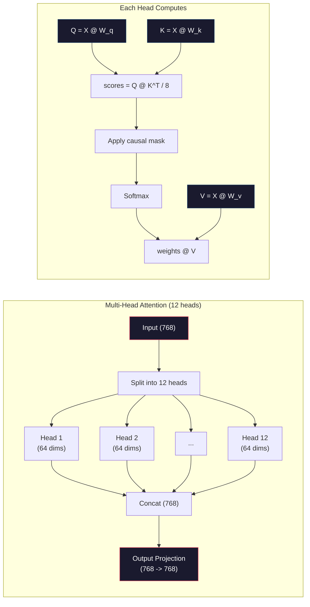

# Pre-trained Mini GPT (124M parameters)

> GPT-2 Small has 124 million parameters. That's a 12-layer transformer, 12 heads of attention, and 768-dimensional embedding. You can train it from scratch on a single GPU within a few hours. Most people never do this. They use pre-trained checkpoints. But if you don't train a model yourself, you can't truly understand what's happening inside the model of the product you are building.

**Type:** Build
**Languages:** Python (with numpy)
**Prerequisites:** Phase 10, Lessons 01-03 (Tokenizers, Building a Tokenizer, Data Pipelines)
**Time:** ~120 minutes

## Learning objectives

- Implement the complete GPT-2 architecture from scratch (124M parameters) : tag embeddings, position embeddings, converter blocks, and language model headers
- Train the GPT model on the text corpus using the next label prediction with cross-entropy loss
- Autoregressive text generation is achieved using temperature sampling and top-k/top-p filtering
- Monitor the training loss curve and verify that the model has learned coherent language patterns

## This question

Do you know what a transformer is? You have already seen the chart. You can recite "Attention is what you need" and draw a box marked "Multi-headed attention" on the whiteboard.

None of this means that you understand what happens when the model generates text.

GPT-2 Small (with weight binding) has 124,438,272 parameters. Each of them is set up by running a training loop: passing forward, calculating the loss, passing backward, and updating the weights. Twelve transformer blocks. Each piece has 12 attention heads. 768-dimensional embedding space. A vocabulary containing 50,257 symbols. Each time the model generates a token, all 124 million parameters are involved in a matrix multiplication chain, which is linked by a series of token ids and generates the probability distribution of the next token.

If you have never done this yourself, you are using a black box. You can use the API. You can make fine adjustments. But when problems arise - when the model has illusions, when it repeats itself, when it refuses to follow instructions - you don't have a mental model of "why".

This lesson builds GPT-2 Small from scratch. It is not available in PyTorch. In numpy The multiplication of each matrix is visible. Each gradient is calculated by the code. You will see how 124 million numbers work together to predict the next word.

## This concept

### GPT architecture

GPT is an autoregressive language model. "Autoregressive" means it generates one token at a time, and each token is conditional on all previous tokens. This architecture is a bunch of transformer decoder blocks.

The following is a complete calculation diagram from token id to the probability of the next token:

1. The token id has come in. Shape: (batch_size, seq_len).
2. Token embedding search. Each ID is mapped to a 768-dimensional vector. Shape: (batch_size, seq_len, 768).
3. Location embedding search. Each position (0,1,2,...) All are mapped to a 768-dimensional vector. The same shape.
4. Add tag embedding + position embedding.
5. Through 12 transformer blocks.
6. The last layer of normalization.
7. Linear projection of vocabulary. Shape: (batch_size, seq_len, vocab_size).
8. Softmax acquires probabilities.

This is the entire model. There is no rotation. There was no recurrence. Only embeddings, attention, feedforward networks and layer specifications are stacked 12 times.

"Mermaid"
Tu Daoming
A [" token id \ n (batch, seq_len)] - > B [" token embedded \ n (batch, seq_len, 768) "]
A—> C["Position Embeddings\n(batch, seq_len, 768)"]
B - > D[" Add "]
d
D - > E[" The First Transformer "]
E - > F[" Transformer Block 2 "]
F—> g[“…”]
G - > H[" The 12th Transformer "]
H - > I[" Layer Specification "]
I -> J[" Linear head \n(768 -> 50257) "]
J - > K[" Softmax\nNext-token probability "]

Style A: Fill: #1a1a2e, Stroke: #e94560, Color: #fff
Style B:#1a1a2e, Stroke :# 0f3460, Color :# fff
Style C: Fill: #1a1a2e, Stroke: #0f3460, Color: #fff
Style D: Fill: #1a1a2e, Stroke: #16213e, Color: #fff
Style E: Fill: #1a1a2e, Stroke: #e94560, Color: #fff
Style F fill: #1a1a2e, stroke: #e94560, color: #fff
Style: H Fill: #1a1a2e, Stroke: #e94560, Color: #fff
Style 1: #1a1a2e, Stroke: #16213e, Color: #fff
Style J: Fill: #1a1a2e, Stroke: #0f3460, Color: #fff
Style K: Fill: #1a1a2e, Stroke: #51cf66, Color: #fff
```

### The Transformer Block

Each of the 12 blocks follows the same pattern. Pre-norm architecture (GPT-2 uses pre-norm, not post-norm like the original transformer):

1. LayerNorm
2. Multi-Head Self-Attention
3. Residual connection (add input back)
4. LayerNorm
5. Feed-Forward Network (MLP)
6. Residual connection (add input back)

The residual connections are critical. Without them, gradients vanish by the time they reach block 1 during backpropagation. With them, gradients can flow directly from the loss to any layer through the "skip" path. This is why you can stack 12, 32, or even 96 blocks (GPT-4 is rumored to use 120).

### Attention: The Core Mechanism

Self-attention lets every token look at every previous token and decide how much to attend to each one. Here is the math.

For each token position, compute three vectors from the input:
- **Query (Q)**: "What am I looking for?"
- **Key (K)**: "What do I contain?"
- **Value (V)**: "What information do I carry?"

```
Q = 0 @ W_q （768 -> 768）
K = yj @ W_k （768 -> 768）
V = yj @ W_v （768 -> 768）

attention_scores = Q @ K^T / sqrt（d_k）
Attention_scores =面具(Attention_scores) #因果掩码:从用于未来的位置
Attention_weights = softmax（attention_scores）
@ attention_weights
```

The causal mask is what makes GPT autoregressive. Position 5 can attend to positions 0-5 but not 6, 7, 8, and so on. This prevents the model from "cheating" by looking at future tokens during training.

**Multi-head attention** splits the 768-dimensional space into 12 heads of 64 dimensions each. Each head learns a different attention pattern. One head might track syntactic relationships (subject-verb agreement). Another might track semantic similarity (synonyms). Another might track positional proximity (nearby words). The outputs from all 12 heads are concatenated and projected back to 768 dimensions.



Dividing by sqrt(d_k) -- sqrt(64) = 8 -- is scaling. Without it, the dot product of high-dimensional vectors would increase, pushing softmax into the region where the gradient is close to zero. This is one of the key insights in the original "Attention is What You Need" paper.

### KV Cache: Why Is Inference Fast

During the training process, you handle the entire sequence at once. During the reasoning process, a token is generated each time. If there is no optimization, generating token N requires recalculating the attention of all previous N-1 tokens. That is, each generated tag is O(N^2), or for a sequence of length N, the total is O(N^ 3).

The KV cache solves this problem. After calculating the K and V of each token, store them. When generating token N+1, you only need to calculate Q for the new token and look up the cached K and V from all previous tokens. This reduces the cost per token calculated by K and V from O(N) to O(1). Note that the score calculation is still 0 (N) because you notice all previous positions, but you avoid redundant matrix multiplication on the input.

For GPT-2 with 12 layers and 12 heads, the KV cache stores 2 (K + V) x 12 layers x 12 heads x 64 dims = 18,432 values per token. For a sequence of 1024 tokens, it is approximately 75MB in FP32. For the 128-layer Llama 3405b, the KV cache of a single sequence can exceed 10GB. This is why long context inference is subject to memory limitations.

### Pre-filling and decoding: Two stages of reasoning

When you send a prompt to the LLM, the inference will be carried out in two different stages.

**Prefill** processes your entire prompt in parallel. All the markers are known, so the model can calculate the attention at all positions simultaneously. This stage is computationally bound - the GPU performs matrix multiplication at full throughput. For 1,000 token prompts on the A100, pre-filling takes approximately 20 to 50ms.

*"Decode" generates one token at a time. Each new token depends on all the previous tokens. This stage is memory-limited - the bottleneck is reading the model weights and KV cache from the GPU memory, rather than the matrix mathematics itself. Most of the computing cores of a GPU are in an idle state, waiting for memory reading. For GPT-2, no matter how many FLOPs the mathematics requires, the time spent on each decoding step is the same because memory bandwidth is the limiting condition.

This distinction is very important for the production system. The pre-fill throughput varies with GPU computing (more FLOPS = faster pre-fill). The decoding throughput varies with the memory bandwidth (faster memory = faster decoding). This is why NVIDIA's H100 focuses on improving the memory bandwidth of the A100 - it directly accelerates the generation of tokens.

"Mermaid"
"Figure LR
Subgraph pre-filling [" Stage 1: Pre-filling "]
Directional tuberculosis
P1[" Full Prompt \n (All known tags) "]
P2[" Parallel Computing \ n(Computation) ")
P3[Establishing a Kilovolt Storage Depot]
P1 -> p2 -> p3
Over

Subgraph Decoding [" Phase Two: Decoding "]
Directional tuberculosis
D1[" Generate Token N "]
D2[" Read KV cache \n (memory limit) "]
D3[" Attached to KV Cache "]
D4[" Generate Token N+1 "]
D1 -> d2 -> d3 -> d4
D4 -. Repeat D1
Over

    Prefill --> Decode

    style P1 fill:#1a1a2e,stroke:#51cf66,color:#fff
    style P2 fill:#1a1a2e,stroke:#51cf66,color:#fff
    style P3 fill:#1a1a2e,stroke:#51cf66,color:#fff
    style D1 fill:#1a1a2e,stroke:#e94560,color:#fff
    style D2 fill:#1a1a2e,stroke:#e94560,color:#fff
    style D3 fill:#1a1a2e,stroke:#e94560,color:#fff
    style D4 fill:#1a1a2e,stroke:#e94560,color:#fff
```

### The Training Loop

Training an LLM is next-token prediction. Given tokens [0, 1, 2, ..., N-1], predict tokens [1, 2, 3, ..., N]. The loss function is cross-entropy between the model's predicted probability distribution and the actual next token.

One training step:

1. **Forward pass**: Run the batch through all 12 blocks. Get logits (pre-softmax scores) for each position.
2. **Compute loss**: Cross-entropy between logits and target tokens (the input shifted by one position).
3. **Backward pass**: Compute gradients for all 124M parameters using backpropagation.
4. **Optimizer step**: Update weights. GPT-2 uses Adam with learning rate warmup and cosine decay.

The learning rate schedule matters more than you might expect. GPT-2 warms up from 0 to the peak learning rate over the first 2,000 steps, then decays following a cosine curve. Starting with a high learning rate causes the model to diverge. Keeping a constant high rate causes oscillation in later training. The warmup-then-decay pattern is used by every major LLM.

### GPT-2 Small: The Numbers

| Component | Shape | Parameters |
|-----------|-------|------------|
| Token embeddings | (50257, 768) | 38,597,376 |
| Position embeddings | (1024, 768) | 786,432 |
| Per-block attention (W_q, W_k, W_v, W_out) | 4 x (768, 768) | 2,359,296 |
| Per-block FFN (up + down) | (768, 3072) + (3072, 768) | 4,718,592 |
| Per-block LayerNorms (2x) | 2 x 768 x 2 | 3,072 |
| Final LayerNorm | 768 x 2 | 1,536 |
| **Total per block** | | **7,080,960** |
| **Total (12 blocks)** | | **85,054,464 + 39,383,808 = 124,438,272** |

The output projection (logits head) shares weights with the token embedding matrix. This is called weight tying -- it reduces the parameter count by 38M and improves performance because it forces the model to use the same representation space for input and output.

## Build It

### Step 1: Embedding Layer

Token embeddings map each of the 50,257 possible tokens to a 768-dimensional vector. Position embeddings add information about where each token sits in the sequence. The two are summed.

```python
import numpy as np

class Embedding:
    def __init__(self, vocab_size, embed_dim, max_seq_len):
        self.token_embed = np.random.randn(vocab_size, embed_dim) * 0.02
        self.pos_embed = np.random.randn(max_seq_len, embed_dim) * 0.02

    def forward(self, token_ids):
        seq_len = token_ids.shape[-1]
        tok_emb = self.token_embed[token_ids]
        pos_emb = self.pos_embed[:seq_len]
        return tok_emb + pos_emb
```

The initialized 0.02 standard deviation is from the GPT-2 paper. Too large and the initial forward pass generate extreme values, unstable training. It's too small. The initial output of all inputs is almost the same, making the early gradient signal useless.

### Step 2: Use the Cause-and-effect mask for self-attention

Pay attention to one head first. The causal mask sets the future position to negative infinity before softmax, ensuring that each position can only focus on itself and its previous position.

”“python
def attention(Q, K, V, mask=None) :
d_k = Q.shape[-1]
Fraction = Q@k transposed (0,-1,-2 if Q.ndim == 4 else 1)/np.sqrt (d_k)
If mask is not None:
Score = Score + mask
Weight = np. Exp (scores) - scores. Max (axis = 1,keepdims = True))
Weights = Weights/Weights. sum(axis = 1,keepdims = True)
Return the weight @V
```

The softmax implementation subtracts the maximum before exponentiating. Without this, exp(large_number) overflows to infinity. This is a numerical stability trick that does not change the output because softmax(x - c) = softmax(x) for any constant c.

### Step 3: Multi-Head Attention

Split the 768-dimensional input into 12 heads of 64 dimensions each. Each head computes attention independently. Concatenate the results and project back to 768 dimensions.

```python
class MultiHeadAttention:
    def __init__(self, embed_dim, num_heads):
        self.num_heads = num_heads
        self.head_dim = embed_dim // num_heads
        self.W_q = np.random.randn(embed_dim, embed_dim) * 0.02
        self.W_k = np.random.randn(embed_dim, embed_dim) * 0.02
        self.W_v = np.random.randn(embed_dim, embed_dim) * 0.02
        self.W_out = np.random.randn(embed_dim, embed_dim) * 0.02

    def forward(self, x, mask=None):
        batch, seq_len, d = x.shape
        Q = (x @ self.W_q).reshape(batch, seq_len, self.num_heads, self.head_dim).transpose(0, 2, 1, 3)
        K = (x @ self.W_k).reshape(batch, seq_len, self.num_heads, self.head_dim).transpose(0, 2, 1, 3)
        V = (x @ self.W_v).reshape(batch, seq_len, self.num_heads, self.head_dim).transpose(0, 2, 1, 3)

        scores = Q @ K.transpose(0, 1, 3, 2) / np.sqrt(self.head_dim)
        if mask is not None:
            scores = scores + mask
        weights = np.exp(scores - scores.max(axis=-1, keepdims=True))
        weights = weights / weights.sum(axis=-1, keepdims=True)
        attn_out = weights @ V

        attn_out = attn_out.transpose(0, 2, 1, 3).reshape(batch, seq_len, d)
        return attn_out @ self.W_out
```

Reshaping - transposition - reshaping dance is the most perplexing part of multi-head attention. The result is as follows: (batch, seq_len, 768) the tensor becomes (batch, seq_len, 12, 64), and then becomes (batch, 12, seq_len, 64). Now, each of the 12 heads has its own (seq_len, 64) matrix to run attention. Note that we reverse this process: (batch, 12, seq_len, 64) to (batch, seq_len, 12, 64) to (batch, seq_len, 768).

### Step 4: Transformer block

A complete transformer module: LayerNorm, multi-head focus band residual, LayerNorm, feedforward band residual.

”“python
Class LayerNorm:
Def __init__(self, dim, eps=1e-5) :
Self. Gamma = np.ones (Dim)
Self. β = np.0 (Dim)
Self. Eps = Eps

Def forward(self, x)：
mean = x.mean（axis=-1, keepdim =True）
var = x.var（axis=-1, keepdim =True）
回归自我。* (x -)/ np。Sqrt (var + self。Eps) + self.beta


Feedforward class
Def __init__(self, embed_dim, ff_dim) :
Self. W1 = np.random. Randn (embed_dim, ff_dim) * 0.02
Self. B1 = np.0 (ff_dim)
Self. W2 = np.random. Randn (ff_dim, embed_dim) * 0.02
Self. B2 = np.zero (embed_dim)

Def forward(self, x) :
H = x@self. W1 + self. b1
H = np. maximum(0, h) # GELU approximation: For simplicity, ReLU is used
Return to h@self. W2 + self.b2


Class TransformerBlock
Def __init__(self, embed_dim, num_heads, ff_dim) :
Self. ln1 = LayerNorm (Embedded)
Self. attn = MultiHeadAttention (embed_dim, num_heads)
Self. ln2 = LayerNorm (embed_dim)
Self. ffn = FeedForward (embed_dim, ff_dim)

def forward(self, x, mask=None) :
X = X + self.attn.forward (self.attn.forward) forward (x), mask
X = X + self.ffn.forward (self.ln2.forward(X))
Return x
```

The feedforward network expands the 768-dimensional input to 3,072 dimensions (4x), applies a nonlinearity, then projects back to 768. This expansion-contraction pattern gives the model a "wider" internal representation to work with at each position. GPT-2 uses GELU activation, but we use ReLU here for simplicity -- the difference is minor for understanding the architecture.

### Step 5: Full GPT Model

Stack 12 transformer blocks. Add the embedding layer at the front and the output projection at the back.

```python
class MiniGPT:
    def __init__(self, vocab_size=50257, embed_dim=768, num_heads=12,
                 num_layers=12, max_seq_len=1024, ff_dim=3072):
        self.embedding = Embedding(vocab_size, embed_dim, max_seq_len)
        self.blocks = [
            TransformerBlock(embed_dim, num_heads, ff_dim)
            for _ in range(num_layers)
        ]
        self.ln_f = LayerNorm(embed_dim)
        self.vocab_size = vocab_size
        self.embed_dim = embed_dim

    def forward(self, token_ids):
        seq_len = token_ids.shape[-1]
        mask = np.triu(np.full((seq_len, seq_len), -1e9), k=1)

        x = self.embedding.forward(token_ids)
        for block in self.blocks:
            x = block.forward(x, mask)
        x = self.ln_f.forward(x)

        logits = x @ self.embedding.token_embed.T
        return logits

    def count_parameters(self):
        total = 0
        total += self.embedding.token_embed.size
        total += self.embedding.pos_embed.size
        for block in self.blocks:
            total += block.attn.W_q.size + block.attn.W_k.size
            total += block.attn.W_v.size + block.attn.W_out.size
            total += block.ffn.W1.size + block.ffn.b1.size
            total += block.ffn.W2.size + block.ffn.b2.size
            total += block.ln1.gamma.size + block.ln1.beta.size
            total += block.ln2.gamma.size + block.ln2.beta.size
        total += self.ln_f.gamma.size + self.ln_f.beta.size
        return total
```

Note the counterweight: Output the projection reuse token embedding matrix (transposed). This is not merely a technique for saving parameters. This means that the model uses the same vector space to understand the tags (embeddings) and predict them (outputs).

### Step 6: Cyclic training

For actual training running on 124M parameters, you will need a GPU and PyTorch. This training loop demonstrates the mechanism on a small model running in pure numpy. We used a very small model (4 layers, 4 heads, 128 dark spots) to make it easy to handle.

”“python
(分对数,目标):
Batch, seq_len, vocab_size = logits.shape
Logits_flat = logits。(1)
Targets_flat =目标。塑造(1)

Max_logits = logits_flat。max(轴= 1,keepdims = True)
Log_softmax = logits_flat - max_logits - np.log(
np。Exp (logits_flat - max_logits)。sum(轴= 1,keepdims = True)
）

Loss = -log_softmax
Return loss


Def train_mini_gpt(text, vocab_size=256, embed_dim=128, num_heads=4，
Num_layers =4, seq_len=64, num_steps=200, lr=3e-4)：
Token = np.array（list(text.encode("utf-8")[:2048])）
model = MiniGPT(
voab_size = Vocab_size, embed_dim=embed_dim, num_heads=num_heads，
4所示。Num_layers = Num_layers, max_seq_len=seq_len, ff_dim=embed_dim *
）

print（f " {Model .count_parameters():,} "）
Print （f " inner_token: {len(token):,} "）
print（f"Config: {num_layers} layers, {num_heads} heads, {embed_dim} dims"）
print ()

对于在范围(num_steps)中的步骤:
Start_idx = np。Randint (0, max(1, len(token) - seq_len - 1))
Batch_tokens = token [start_idx:start_idx + seq_len + 1]

Input_ids = batch_tokens[:-1]。（1,1）
Target_ids = batch_tokens[1:]。（1,1）

Logits = model.forward（input_ids）
Loss = cross_entropy_loss（logits, target_ids）

If step % 20 == 0:
print (f"Step {Step:4d} : Loss: {Loss:.4f}")

Regression model
```

The loss starts near ln(vocab_size) -- for a 256-token byte-level vocabulary, that is ln(256) = 5.55. A random model assigns equal probability to every token. As training progresses, the loss drops because the model learns to predict common patterns: "th" after "t", space after a period, and so on.

In production, you would use Adam optimizer with gradient accumulation, learning rate warmup, and gradient clipping. The forward-pass-loss-backward-update loop is identical. The optimizer is more sophisticated.

### Step 7: Text Generation

Generation uses the trained model to predict one token at a time. Each prediction is sampled from the output distribution (or taken greedily as the argmax).

```python
def generate(model, prompt_tokens, max_new_tokens=100, temperature=0.8):
    tokens = list(prompt_tokens)
    seq_len = model.embedding.pos_embed.shape[0]

    for _ in range(max_new_tokens):
        context = np.array(tokens[-seq_len:]).reshape(1, -1)
        logits = model.forward(context)
        next_logits = logits[0, -1, :]

        next_logits = next_logits / temperature
        probs = np.exp(next_logits - next_logits.max())
        probs = probs / probs.sum()

        next_token = np.random.choice(len(probs), p=probs)
        tokens.append(next_token)

    return tokens
```

Randomness of temperature control. 1.0 Use the original distribution. A temperature of 0.5 will make it clearer (more deterministic - the model selects the best option more frequently). A temperature of 1.5 will flatten it (more random - low-probability markers have a greater chance of getting it). A temperature of 0.0 indicates greedy decoding (always choosing the token with the highest probability).

Once The exceeds it, the oldest token must be discarded. This is what everyone is talking about as the "context window".

## Use it

### Complete training and generation demonstration

”“python
The converter architecture has completely transformed natural language processing.
Note that the mechanism allows the model to focus on the relevant parts of the input.
Self-focus calculates the relationship between all pairs of positions in the sequence.
Bulls should pay attention to dividing the appearance into multiple subspaces.
Each attention head can learn different types of relationships.
Feedforward networks provide nonlinear transformations at each position.
The residual connections allow the gradient flow to pass through the deep network.
Layer normalization stabilizes training through normalization activation.
Location embedding provides the model with information about token sorting.
The causal mask ensures autoregressive generation during the training process.
Pre-training on large text corpora enables the model to understand general language.
Fine-tuning enables the pre-trained model to adapt to specific downstream tasks.

Model = train_mini_gpt（中文，num_steps=200）

prompt = list（"The transformer".encode("utf-8")）
Output_tokens = generate（model, prompt, max_new_tokens=100, temperature=0.8）
Generated_text = bytes(output_tokens).decode（"utf-8", errors="replace"）
（f " \ nGenerated: {generated_text} "）
```

On a small corpus with a small model, the generated text will be semi-coherent at best. It will learn some byte-level patterns from the training text but cannot generalize the way GPT-2 does with 40GB of training data and the full 124M parameter architecture. The point is not the output quality. The point is that you can trace every step: embedding lookup, attention computation, feedforward transformation, logit projection, softmax, and sampling. Every operation is visible.

## Ship It

This lesson produces `outputs/prompt-gpt-architecture-analyzer.md` -- a prompt that analyzes the architecture choices in any GPT-style model. Feed it a model card or technical report and it breaks down the parameter allocation, attention design, and scaling decisions.

## Exercises

1. Modify the model to use 24 layers and 16 heads instead of 12/12. Count the parameters. How does doubling the depth compare to doubling the width (embedding dimension)?

2. Implement the GELU activation function (GELU(x) = x * 0.5 * (1 + erf(x / sqrt(2)))) and replace the ReLU in the feedforward network. Run training for 500 steps with each activation and compare the final loss.

3. Add a KV cache to the generation function. Store K and V tensors for each layer after the first forward pass, and reuse them for subsequent tokens. Measure the speedup: generate 200 tokens with and without the cache and compare wall-clock time.

4. Implement top-k sampling (only consider the k highest-probability tokens) and top-p sampling (nucleus sampling: consider the smallest set of tokens whose cumulative probability exceeds p). Compare the output quality at temperature 0.8 with top-k=50 vs top-p=0.95.

5. Build a training loss curve plotter. Train the model for 1000 steps and plot loss vs step. Identify the three phases: rapid initial descent (learning common bytes), slower middle phase (learning byte patterns), and plateau (overfitting on the small corpus). The shape of this curve is the same whether you are training a 128-dim model or GPT-4.

## Key Terms

| Term | What people say | What it actually means |
|------|----------------|----------------------|
| Autoregressive | "It generates one word at a time" | Each output token is conditioned on all previous tokens -- the model predicts P(token_n \| token_0, ..., token_{n-1}) |
| Causal mask | "It can't see the future" | An upper-triangular matrix of -infinity values that prevents attention to future positions during training |
| Multi-head attention | "Multiple attention patterns" | Splitting Q, K, V into parallel heads (e.g., 12 heads of 64 dims each for GPT-2) so each head can learn different relationship types |
| KV Cache | "Caching for speed" | Storing computed Key and Value tensors from previous tokens to avoid redundant computation during autoregressive generation |
| Prefill | "Processing the prompt" | The first inference phase where all prompt tokens are processed in parallel -- compute-bound on GPU FLOPS |
| Decode | "Generating tokens" | The second inference phase where tokens are generated one at a time -- memory-bound on GPU bandwidth |
| Weight tying | "Sharing embeddings" | Using the same matrix for input token embeddings and the output projection head -- saves 38M params in GPT-2 |
| Residual connection | "Skip connection" | Adding the input directly to the output of a sublayer (x + sublayer(x)) -- enables gradient flow in deep networks |
| Layer normalization | "Normalizing activations" | Normalizing across the feature dimension to mean 0 and variance 1, with learnable scale and bias parameters |
| Cross-entropy loss | "How wrong the predictions are" | -log(probability assigned to the correct next token), averaged over all positions -- the standard LLM training objective |

## Further Reading

- [Radford et al., 2019 -- "Language Models are Unsupervised Multitask Learners" (GPT-2)](https://cdn.openai.com/better-language-models/language_models_are_unsupervised_multitask_learners.pdf) -- the GPT-2 paper that introduced the 124M to 1.5B parameter family
- [Vaswani et al., 2017 -- "Attention Is All You Need"](https://arxiv.org/abs/1706.03762) -- the original transformer paper with scaled dot-product attention and multi-head attention
- [Llama 3 Technical Report](https://arxiv.org/abs/2407.21783) -- how Meta scaled the GPT architecture to 405B parameters with 16K GPUs
- [Pope et al., 2022 -- "Efficiently Scaling Transformer Inference"](https://arxiv.org/abs/2211.05102) -- the paper that formalized prefill vs decode and KV cache analysis