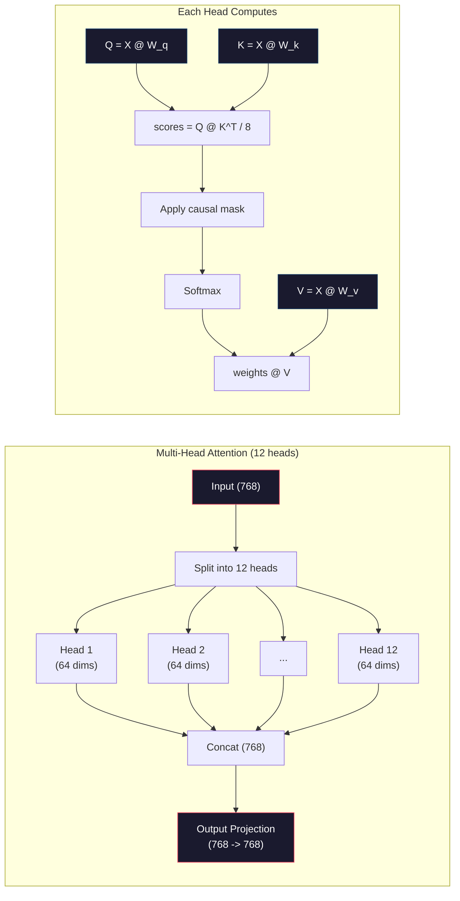

# 预训练Mini GPT （124M参数）

> GPT-2 Small有1.24亿个参数。那是一个12层的变压器，12个人的注意力，和768维的嵌入。你可以在几个小时内在单个GPU上从头开始训练它。大多数人从不这样做。他们使用预先训练好的检查点。但如果你不亲自训练一个模型，你就无法真正理解你正在构建的产品模型内部发生了什么。

**Type:** Build
**Languages:** Python (with numpy)
**Prerequisites:** Phase 10, Lessons 01-03 (Tokenizers, Building a Tokenizer, Data Pipelines)
**Time:** ~120 minutes

## 学习目标

- 从头开始实现完整的GPT-2架构（124M参数）：标签嵌入，位置嵌入，转换器块和语言模型头
- 使用交叉熵损失的下一个标签预测在文本语料库上训练GPT模型
- 使用温度采样和top-k/top-p滤波实现自回归文本生成
- 监控训练损失曲线并验证模型是否学习了连贯的语言模式

## 这个问题

你知道变压器是什么吗？你们已经看过这个图表了。你可以背诵“注意力是你所需要的”，并在白板上画一个标有“多头注意力”的方框。

这并不意味着您理解当模型生成文本时发生了什么。

GPT-2 Small（带权重绑定）有124,438,272个参数。它们中的每一个都是通过运行一个训练循环来建立的：向前传递，计算损失，向后传递，更新权重。十二个变压器块。每个棋子有12个注意头。768维嵌入空间。包含50,257个符号的词汇表。每次模型生成一个令牌时，所有1.24亿个参数都涉及到一个矩阵乘法链中，该矩阵乘法链由一系列令牌id连接，并生成下一个令牌的概率分布。

如果你自己从来没有这样做过，那你就是在使用黑盒。您可以使用API。你可以做出细微的调整。但是当问题出现时——当模型产生幻觉时，当它重复自己时，当它拒绝遵循指示时——你没有一个“为什么”的心智模型。

本课从头开始构建GPT-2 Small。它在PyTorch中不可用。在numpy中，每个矩阵的乘法是可见的。每个梯度由代码计算。你将看到1.24亿个数字是如何一起预测下一个单词的。

## 这个概念

### GPT架构

GPT是一种自回归语言模型。“自回归”意味着它一次生成一个令牌，每个令牌都以之前的所有令牌为条件。这个架构是一堆变压器解码器块。

下面是从令牌id到下一个令牌出现概率的完整计算图：

1. 令牌id已经输入。形状：（batch_size, seq_len）。
2. 令牌嵌入搜索。每个ID被映射到一个768维的向量。形状：（batch_size, seq_len, 768）。
3. 位置嵌入搜索。每个位置（0,1,2，…）它们都映射到一个768维的向量。同样的形状。
4. 添加标签嵌入+位置嵌入。
5. 通过12个变压器块。
6. 规范化的最后一层。
7. 词汇的线性投影。形状：（batch_size, seq_len, vocab_size）。
8. Softmax获取概率。

这是整个模型。没有旋转。无复发。只有嵌入、关注、前馈网络和层规范被堆叠了12次。

“美人鱼”
你Daoming
A [" token id \ n (batch, seq_len)] - b> B [" token嵌入\ n (batch, seq_len, 768) "]
A - > C["Position Embeddings\n(batch, seq_len, 768)"]
B - > D[“添加”]
d
D - > E[“第一个变形金刚”]
E - > F[“变压器2块”]
F - > g(“…”)
G - > H[“第十二变形金刚”]
H - > I[“层规范”]
I -> J[“线头\n(768 -> 50257) ”]
J - > K[“ Softmax\nNext-token概率”]

样式A：填充：#1a1a2e，描边：#e94560，颜色：#fff
样式B:#1a1a2e，描边：# 0f3460，颜色：# fff
样式C：填充：#1a1a2e，描边：#0f3460，颜色：#fff
样式D：填充：#1a1a2e，描边：#16213e，颜色：#fff
样式E：填充：#1a1a2e，描边：#e94560，颜色：#fff
样式F: #1a1a2e，描边：#e94560，颜色：#fff
样式：H填充：#1a1a2e，描边：#e94560，颜色：#fff
样式1:#1a1a2e，描边：#16213e，颜色：#fff
样式J：填充：#1a1a2e，描边：#0f3460，颜色：#fff
样式K：填充：#1a1a2e，描边：#51cf66，颜色：#fff
```

### The Transformer Block

Each of the 12 blocks follows the same pattern. Pre-norm architecture (GPT-2 uses pre-norm, not post-norm like the original transformer):

1. LayerNorm
2. Multi-Head Self-Attention
3. Residual connection (add input back)
4. LayerNorm
5. Feed-Forward Network (MLP)
6. Residual connection (add input back)

The residual connections are critical. Without them, gradients vanish by the time they reach block 1 during backpropagation. With them, gradients can flow directly from the loss to any layer through the "skip" path. This is why you can stack 12, 32, or even 96 blocks (GPT-4 is rumored to use 120).

### Attention: The Core Mechanism

Self-attention lets every token look at every previous token and decide how much to attend to each one. Here is the math.

For each token position, compute three vectors from the input:
- **Query (Q)**: "What am I looking for?"
- **Key (K)**: "What do I contain?"
- **Value (V)**: "What information do I carry?"

```
Q = 0 @ W_q （768 -> 768）
K = yj @ W_k （768 -> 768）
V = yj @ W_v （768 -> 768）

attention_scores = Q@K ^T/sqrt (d_k)
Attention_scores = Mask (Attention_scores) # Causal mask: from the position used in the future
Attention_weights = softmax (attention_scores)
@ attention_weights
```

The causal mask is what makes GPT autoregressive. Position 5 can attend to positions 0-5 but not 6, 7, 8, and so on. This prevents the model from "cheating" by looking at future tokens during training.

**Multi-head attention** splits the 768-dimensional space into 12 heads of 64 dimensions each. Each head learns a different attention pattern. One head might track syntactic relationships (subject-verb agreement). Another might track semantic similarity (synonyms). Another might track positional proximity (nearby words). The outputs from all 12 heads are concatenated and projected back to 768 dimensions.



除以sqrt（d_k）——sqrt(64) = 8——是缩放。没有它，高维向量的点积会增加，将softmax推到梯度接近于零的区域。这是“注意力是你所需要的”这篇论文中最重要的见解之一。

### KV缓存：为什么推理快

在训练过程中，你一次处理整个序列。在推理过程中，每次生成一个令牌。如果没有优化，生成令牌N需要重新计算之前所有N-1个令牌的注意力。即每个生成的标签为O(N^2)，或者对于长度为N的序列，总数为O（N^ 3）。

KV缓存解决了这个问题。计算完每个记号的K和V后，存储它们。当生成令牌N+1时，您只需要为新令牌计算Q，并从所有先前的令牌中查找缓存的K和V。这将K和V计算的每个令牌的成本从O(N)减少到O(1)。注意，分数计算仍然是0 (N)，因为您注意到了所有先前的位置，但是您避免了输入上的冗余矩阵乘法。

对于具有12层和12个磁头的GPT-2， KV缓存存储2 (K + V) x 12层x 12磁头x 64 dims =每个令牌18,432个值。对于1024个令牌的序列，在FP32中大约为75MB。对于128层的Llama 3405b，单个序列的KV缓存可以超过10GB。这就是为什么长上下文推断受到内存限制的原因。

### 预填充和解码：推理的两个阶段

当您向LLM发送提示时，推理将分两个不同的阶段进行。

**Prefill**并行处理您的整个提示。所有的标记都是已知的，因此该模型可以同时计算所有位置的注意力。这个阶段是计算绑定的——GPU在全吞吐量下执行矩阵乘法。对于A100上的1,000个令牌提示，预填充大约需要20到50毫秒。

*“Decode”每次生成一个令牌。每个新令牌都依赖于所有以前的令牌。这个阶段内存有限——瓶颈是从GPU内存中读取模型权重和KV缓存，而不是矩阵数学本身。GPU的大部分计算核处于空闲状态，等待读内存。对于GPT-2，无论数学上需要多少FLOPs，每个解码步骤所花费的时间都是相同的，因为内存带宽是限制条件。

这种区别对于生产系统非常重要。预填充吞吐量因GPU计算而异（更多的FLOPS =更快的预填充）。解码吞吐量随内存带宽的不同而不同（内存越快解码越快）。这就是为什么NVIDIA的H100专注于提高A100的内存带宽——它直接加速了代币的生成。

“美人鱼”
“图LR
子图预填充[“第一阶段：预填充”]
定向肺结核
P1[“完整提示符\n（所有已知标签）”]
P2[“并行计算\ n（计算）”]
P3[建立千伏储能站]
P1 -> p2 -> p3
在

子图解码[“第二阶段：解码”]
定向肺结核
D1[“生成令牌N ”]
D2[读取千伏高速缓存\n（内存限制）]
D3[“附于千伏储存库”]
D4[“生成令牌N+1 ”]
D1 -> d2 -> d3 -> d4
D4 -。重复D1
在

    Prefill --> Decode

    style P1 fill:#1a1a2e,stroke:#51cf66,color:#fff
    style P2 fill:#1a1a2e,stroke:#51cf66,color:#fff
    style P3 fill:#1a1a2e,stroke:#51cf66,color:#fff
    style D1 fill:#1a1a2e,stroke:#e94560,color:#fff
    style D2 fill:#1a1a2e,stroke:#e94560,color:#fff
    style D3 fill:#1a1a2e,stroke:#e94560,color:#fff
    style D4 fill:#1a1a2e,stroke:#e94560,color:#fff
```

### The Training Loop

Training an LLM is next-token prediction. Given tokens [0, 1, 2, ..., N-1], predict tokens [1, 2, 3, ..., N]. The loss function is cross-entropy between the model's predicted probability distribution and the actual next token.

One training step:

1. **Forward pass**: Run the batch through all 12 blocks. Get logits (pre-softmax scores) for each position.
2. **Compute loss**: Cross-entropy between logits and target tokens (the input shifted by one position).
3. **Backward pass**: Compute gradients for all 124M parameters using backpropagation.
4. **Optimizer step**: Update weights. GPT-2 uses Adam with learning rate warmup and cosine decay.

The learning rate schedule matters more than you might expect. GPT-2 warms up from 0 to the peak learning rate over the first 2,000 steps, then decays following a cosine curve. Starting with a high learning rate causes the model to diverge. Keeping a constant high rate causes oscillation in later training. The warmup-then-decay pattern is used by every major LLM.

### GPT-2 Small: The Numbers

| Component | Shape | Parameters |
|-----------|-------|------------|
| Token embeddings | (50257, 768) | 38,597,376 |
| Position embeddings | (1024, 768) | 786,432 |
| Per-block attention (W_q, W_k, W_v, W_out) | 4 x (768, 768) | 2,359,296 |
| Per-block FFN (up + down) | (768, 3072) + (3072, 768) | 4,718,592 |
| Per-block LayerNorms (2x) | 2 x 768 x 2 | 3,072 |
| Final LayerNorm | 768 x 2 | 1,536 |
| **Total per block** | | **7,080,960** |
| **Total (12 blocks)** | | **85,054,464 + 39,383,808 = 124,438,272** |

The output projection (logits head) shares weights with the token embedding matrix. This is called weight tying -- it reduces the parameter count by 38M and improves performance because it forces the model to use the same representation space for input and output.

## Build It

### Step 1: Embedding Layer

Token embeddings map each of the 50,257 possible tokens to a 768-dimensional vector. Position embeddings add information about where each token sits in the sequence. The two are summed.

```python
import numpy as np

class Embedding:
    def __init__(self, vocab_size, embed_dim, max_seq_len):
        self.token_embed = np.random.randn(vocab_size, embed_dim) * 0.02
        self.pos_embed = np.random.randn(max_seq_len, embed_dim) * 0.02

    def forward(self, token_ids):
        seq_len = token_ids.shape[-1]
        tok_emb = self.token_embed[token_ids]
        pos_emb = self.pos_embed[:seq_len]
        return tok_emb + pos_emb
```

初始化的0.02标准差来自GPT-2论文。过大和初始前传产生极值，训练不稳定。它太小了。所有输入的初始输出几乎相同，使得早期的梯度信号无用。

### 第二步：使用因果面膜来引起自己的注意

先注意一个头。因果掩码在softmax之前将未来位置设置为负无穷大，以确保每个位置只能聚焦于自己和之前的位置。

”“python
def attention(Q， K， V, mask=None)：
d_k = Q.shape[-1]
分数= Q@k转置(0,-1,-2 if Q.ndim == 4 else 1)/np。√d_k
如果mask不是None：
分数=分数+掩码
权重= np。Exp (scores) -分数。Max (axis = 1,keepdim = True))
权重=权重/权重。sum（axis = 1,keepdim = True）
返回权重@V
```

The softmax implementation subtracts the maximum before exponentiating. Without this, exp(large_number) overflows to infinity. This is a numerical stability trick that does not change the output because softmax(x - c) = softmax(x) for any constant c.

### Step 3: Multi-Head Attention

Split the 768-dimensional input into 12 heads of 64 dimensions each. Each head computes attention independently. Concatenate the results and project back to 768 dimensions.

```python
class MultiHeadAttention:
    def __init__(self, embed_dim, num_heads):
        self.num_heads = num_heads
        self.head_dim = embed_dim // num_heads
        self.W_q = np.random.randn(embed_dim, embed_dim) * 0.02
        self.W_k = np.random.randn(embed_dim, embed_dim) * 0.02
        self.W_v = np.random.randn(embed_dim, embed_dim) * 0.02
        self.W_out = np.random.randn(embed_dim, embed_dim) * 0.02

    def forward(self, x, mask=None):
        batch, seq_len, d = x.shape
        Q = (x @ self.W_q).reshape(batch, seq_len, self.num_heads, self.head_dim).transpose(0, 2, 1, 3)
        K = (x @ self.W_k).reshape(batch, seq_len, self.num_heads, self.head_dim).transpose(0, 2, 1, 3)
        V = (x @ self.W_v).reshape(batch, seq_len, self.num_heads, self.head_dim).transpose(0, 2, 1, 3)

        scores = Q @ K.transpose(0, 1, 3, 2) / np.sqrt(self.head_dim)
        if mask is not None:
            scores = scores + mask
        weights = np.exp(scores - scores.max(axis=-1, keepdims=True))
        weights = weights / weights.sum(axis=-1, keepdims=True)
        attn_out = weights @ V

        attn_out = attn_out.transpose(0, 2, 1, 3).reshape(batch, seq_len, d)
        return attn_out @ self.W_out
```

重塑-换位-重塑舞蹈是多头注意中最复杂的部分。结果如下：（batch, seq_len, 768）张量变成（batch, seq_len, 12, 64），然后变成（batch, 12, seq_len, 64）。现在，12个正面中的每一个都有自己的（seq_len, 64）矩阵来运行注意力。注意，我们将这个过程反过来：（batch, 12, seq_len, 64）到（batch, seq_len, 12, 64）到（batch, seq_len, 768）。

### 步骤4：变压器块

一个完整的变压器模块：LayerNorm，多头聚焦带残差，LayerNorm，前馈带残差。

”“python
类LayerNorm:
Def __init__(self, dim, eps=1e-5)：
自我。= np。(暗)
自我。β = np.0(暗)
自我。Eps = Eps

Def forward(self, x)：
mean = x.mean（axis=-1, keepdim =True）
var = x.var（axis=-1, keepdim =True）
回归自我。* (x -)/ np。Sqrt (var + self。Eps) + self.beta


前馈类
Def __init__(self, embed_dim, ff_dim)：
自我。W1 = np.random。Randn (embed_dim, ff_dim) * 0.02
自我。B1 = np.0(ff_dim)
自我。W2 = np.random。Randn (ff_dim, embed_dim) * 0.02
自我。B2 = np。零(embed_dim)

Def forward(self, x)：
H = x@self。W1 + self。b1
H = np。maximum(0, h) # GELU近似：为简单起见，使用ReLU
返回h@self。W2 + self.b2


类TransformerBlock
Def __init__(self, embed_dim, num_heads, ff_dim)：
自我。ln1 = LayerNorm（嵌入式）
自我。attn = MultiHeadAttention （embed_dim, num_heads）
自我。ln2 = LayerNorm （embed_dim）
自我。ffn = FeedForward （embed_dim, ff_dim）

def forward(self, x, mask=None)：
X = X + self.attn.forward (self.attn.forward) forward (X), mask
X = X + self.ffn.forward （self.ln2.forward(X)）
返回x
```

The feedforward network expands the 768-dimensional input to 3,072 dimensions (4x), applies a nonlinearity, then projects back to 768. This expansion-contraction pattern gives the model a "wider" internal representation to work with at each position. GPT-2 uses GELU activation, but we use ReLU here for simplicity -- the difference is minor for understanding the architecture.

### Step 5: Full GPT Model

Stack 12 transformer blocks. Add the embedding layer at the front and the output projection at the back.

```python
class MiniGPT:
    def __init__(self, vocab_size=50257, embed_dim=768, num_heads=12,
                 num_layers=12, max_seq_len=1024, ff_dim=3072):
        self.embedding = Embedding(vocab_size, embed_dim, max_seq_len)
        self.blocks = [
            TransformerBlock(embed_dim, num_heads, ff_dim)
            for _ in range(num_layers)
        ]
        self.ln_f = LayerNorm(embed_dim)
        self.vocab_size = vocab_size
        self.embed_dim = embed_dim

    def forward(self, token_ids):
        seq_len = token_ids.shape[-1]
        mask = np.triu(np.full((seq_len, seq_len), -1e9), k=1)

        x = self.embedding.forward(token_ids)
        for block in self.blocks:
            x = block.forward(x, mask)
        x = self.ln_f.forward(x)

        logits = x @ self.embedding.token_embed.T
        return logits

    def count_parameters(self):
        total = 0
        total += self.embedding.token_embed.size
        total += self.embedding.pos_embed.size
        for block in self.blocks:
            total += block.attn.W_q.size + block.attn.W_k.size
            total += block.attn.W_v.size + block.attn.W_out.size
            total += block.ffn.W1.size + block.ffn.b1.size
            total += block.ffn.W2.size + block.ffn.b2.size
            total += block.ln1.gamma.size + block.ln1.beta.size
            total += block.ln2.gamma.size + block.ln2.beta.size
        total += self.ln_f.gamma.size + self.ln_f.beta.size
        return total
```

注意平衡：输出投影重用令牌嵌入矩阵（转置）。这不仅仅是一种保存参数的技术。这意味着模型使用相同的向量空间来理解标签（嵌入）并预测它们（输出）。

### 第六步：循环训练

对于在124M参数上运行的实际训练，您将需要GPU和PyTorch。这个训练循环演示了在纯numpy中运行的小型模型上的机制。我们使用了一个非常小的模型（4个图层，4个头部，128个黑点），以便于操作。

”“python
(Number of fractions, target):
Batch, seq_len, vocab_size = logits.shape
Logits_flat = logits. (1)
Targets_flat = Target. Shaping (1

Max_logits = logits_flat。max(轴= 1,keepdims = True)
Log_softmax = logits_flat - max_logits - np.log(
np。Exp (logits_flat - max_logits)。sum(轴= 1,keepdims = True)
）

Loss = -log_softmax
回波损耗


Def train_mini_gpt(text, vocab_size=256, embed_dim=128, num_heads=4，
Num_layers =4, seq_len=64, num_steps=200, lr=3e-4)：
Token = np.array（list(text.encode("utf-8")[:2048])）
model = MiniGPT(
voab_size = Vocab_size, embed_dim=embed_dim, num_heads=num_heads，
4所示。Num_layers = Num_layers, max_seq_len=seq_len, ff_dim=embed_dim *
）

打印(f "{模型。count_parameters():}”)
Print （f " inner_token: {len(token):,} "）
print（f"Config: {num_layers} layers, {num_heads} heads, {embed_dim} dims"）
print ()

For the steps within the range (num_steps) :
Start_idx = np. Randint (0, max(1, len(token) - seq_len - 1))
Batch_tokens = token [start_idx:start_idx + seq_len + 1]

Input_ids = batch_tokens[:-1]。(1,1)
Target_ids = batch_tokens[1:]。(1,1)

Logits = model.forward（input_ids）
Loss = cross_entropy_loss（logits, target_ids）

如果步骤% 20 == 0：
print （f"Step {Step:4d}: Loss: {Loss:.4f}"）

回归模型
```

The loss starts near ln(vocab_size) -- for a 256-token byte-level vocabulary, that is ln(256) = 5.55. A random model assigns equal probability to every token. As training progresses, the loss drops because the model learns to predict common patterns: "th" after "t", space after a period, and so on.

In production, you would use Adam optimizer with gradient accumulation, learning rate warmup, and gradient clipping. The forward-pass-loss-backward-update loop is identical. The optimizer is more sophisticated.

### Step 7: Text Generation

Generation uses the trained model to predict one token at a time. Each prediction is sampled from the output distribution (or taken greedily as the argmax).

```python
def generate(model, prompt_tokens, max_new_tokens=100, temperature=0.8):
    tokens = list(prompt_tokens)
    seq_len = model.embedding.pos_embed.shape[0]

    for _ in range(max_new_tokens):
        context = np.array(tokens[-seq_len:]).reshape(1, -1)
        logits = model.forward(context)
        next_logits = logits[0, -1, :]

        next_logits = next_logits / temperature
        probs = np.exp(next_logits - next_logits.max())
        probs = probs / probs.sum()

        next_token = np.random.choice(len(probs), p=probs)
        tokens.append(next_token)

    return tokens
```

温度控制的随机性。1.0使用原始发行版。0.5的温度将使它更清晰（更确定-模型更频繁地选择最佳选项）。1.5度的温度会使它变平（更随机——低概率标记有更大的机会得到它）。温度为0.0表示贪婪解码（总是选择概率最高的令牌）。

一旦超过该值，则必须丢弃最老的令牌。这就是大家所说的“上下文窗口”。

## 使用它

### 完成培训和生成演示

”“python
转换器架构完全改变了自然语言处理。
注意，该机制允许模型关注输入的相关部分。
自我聚焦计算序列中所有位置对之间的关系。
公牛应该注意将外观划分为多个子空间。
每个注意力头可以学习不同类型的关系。
前馈网络在每个位置提供非线性变换。
剩余的连接允许梯度流通过深层网络。
层归一化通过归一化激活来稳定训练。
位置嵌入为模型提供有关令牌排序的信息。
因果掩模保证了训练过程中的自回归生成。
在大型文本语料库上进行预训练，使模型能够理解一般语言。
微调使预训练的模型能够适应特定的下游任务。

Model = train_mini_gpt（中文，num_steps=200）

prompt = list（"The transformer".encode("utf-8")）
Output_tokens = generate（model, prompt, max_new_tokens=100, temperature=0.8）
Generated_text = bytes(output_tokens).decode（"utf-8", errors="replace"）
（f " \ nGenerated: {generated_text} "）
```

On a small corpus with a small model, the generated text will be semi-coherent at best. It will learn some byte-level patterns from the training text but cannot generalize the way GPT-2 does with 40GB of training data and the full 124M parameter architecture. The point is not the output quality. The point is that you can trace every step: embedding lookup, attention computation, feedforward transformation, logit projection, softmax, and sampling. Every operation is visible.

## Ship It

This lesson produces `outputs/prompt-gpt-architecture-analyzer.md` -- a prompt that analyzes the architecture choices in any GPT-style model. Feed it a model card or technical report and it breaks down the parameter allocation, attention design, and scaling decisions.

## Exercises

1. Modify the model to use 24 layers and 16 heads instead of 12/12. Count the parameters. How does doubling the depth compare to doubling the width (embedding dimension)?

2. Implement the GELU activation function (GELU(x) = x * 0.5 * (1 + erf(x / sqrt(2)))) and replace the ReLU in the feedforward network. Run training for 500 steps with each activation and compare the final loss.

3. Add a KV cache to the generation function. Store K and V tensors for each layer after the first forward pass, and reuse them for subsequent tokens. Measure the speedup: generate 200 tokens with and without the cache and compare wall-clock time.

4. Implement top-k sampling (only consider the k highest-probability tokens) and top-p sampling (nucleus sampling: consider the smallest set of tokens whose cumulative probability exceeds p). Compare the output quality at temperature 0.8 with top-k=50 vs top-p=0.95.

5. Build a training loss curve plotter. Train the model for 1000 steps and plot loss vs step. Identify the three phases: rapid initial descent (learning common bytes), slower middle phase (learning byte patterns), and plateau (overfitting on the small corpus). The shape of this curve is the same whether you are training a 128-dim model or GPT-4.

## Key Terms

| Term | What people say | What it actually means |
|------|----------------|----------------------|
| Autoregressive | "It generates one word at a time" | Each output token is conditioned on all previous tokens -- the model predicts P(token_n \| token_0, ..., token_{n-1}) |
| Causal mask | "It can't see the future" | An upper-triangular matrix of -infinity values that prevents attention to future positions during training |
| Multi-head attention | "Multiple attention patterns" | Splitting Q, K, V into parallel heads (e.g., 12 heads of 64 dims each for GPT-2) so each head can learn different relationship types |
| KV Cache | "Caching for speed" | Storing computed Key and Value tensors from previous tokens to avoid redundant computation during autoregressive generation |
| Prefill | "Processing the prompt" | The first inference phase where all prompt tokens are processed in parallel -- compute-bound on GPU FLOPS |
| Decode | "Generating tokens" | The second inference phase where tokens are generated one at a time -- memory-bound on GPU bandwidth |
| Weight tying | "Sharing embeddings" | Using the same matrix for input token embeddings and the output projection head -- saves 38M params in GPT-2 |
| Residual connection | "Skip connection" | Adding the input directly to the output of a sublayer (x + sublayer(x)) -- enables gradient flow in deep networks |
| Layer normalization | "Normalizing activations" | Normalizing across the feature dimension to mean 0 and variance 1, with learnable scale and bias parameters |
| Cross-entropy loss | "How wrong the predictions are" | -log(probability assigned to the correct next token), averaged over all positions -- the standard LLM training objective |

## Further Reading

- [Radford et al., 2019 -- "Language Models are Unsupervised Multitask Learners" (GPT-2)](https://cdn.openai.com/better-language-models/language_models_are_unsupervised_multitask_learners.pdf) -- the GPT-2 paper that introduced the 124M to 1.5B parameter family
- [Vaswani et al., 2017 -- "Attention Is All You Need"](https://arxiv.org/abs/1706.03762) -- the original transformer paper with scaled dot-product attention and multi-head attention
- [Llama 3 Technical Report](https://arxiv.org/abs/2407.21783) -- how Meta scaled the GPT architecture to 405B parameters with 16K GPUs
- [Pope et al., 2022 -- "Efficiently Scaling Transformer Inference"](https://arxiv.org/abs/2211.05102) -- the paper that formalized prefill vs decode and KV cache analysis