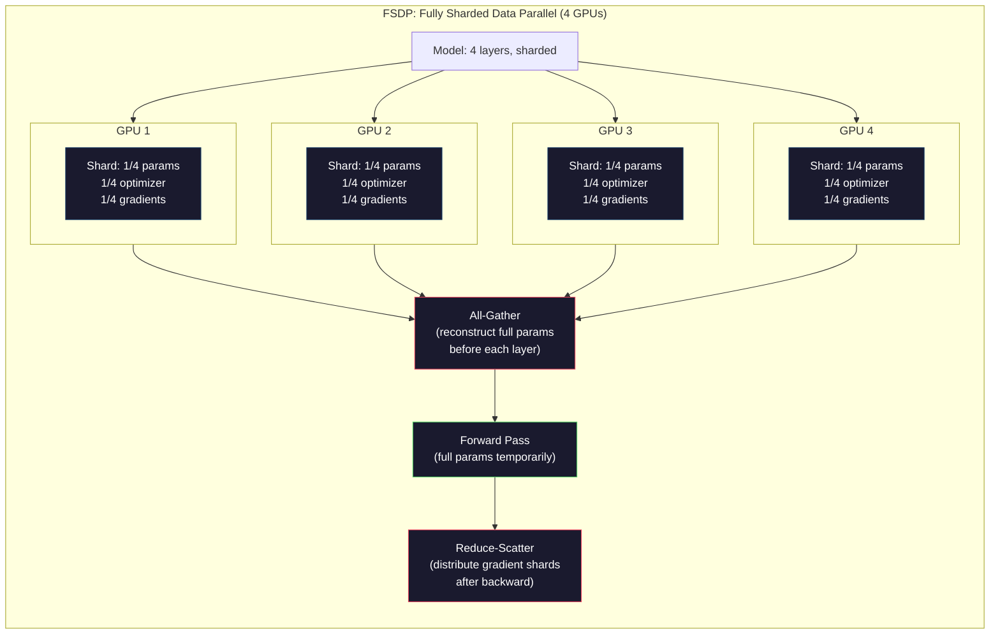

# 扩展：分布式训练，FSDP, DeepSpeed

> 你的124M模型是在GPU上训练的。现在试试70亿个参数。这个型号不适合内存。在一台机器上收集数据需要几周的时间。分布式训练在规模上是不可选择的。这是唯一的出路。

**Type:** Build
**Languages:** Python
**Prerequisites:** Phase 10, Lesson 04 (Pre-Training a Mini GPT)
**Time:** ~120 minutes

## 学习目标

- 解释三种类型的并行性（数据、张量、管道），以及基于模型和簇大小的每种并行性何时是必要的
- 使用PyTorch DDP实现跨多个gpu的梯度同步数据并行训练
- 计算给定模型大小（权重+优化器状态+梯度+激活）的内存预算，以确定最小硬件
- 配置FSDP或DeepSpeed ZeRO相位以跨gpu切片模型状态，适用于具有多个gpu内存的模型

## 这个问题

FP16中的7B参数模型仅用于权重就需要14GB。Adam优化器存储每个参数的两个额外副本（第一个和第二个矩估计）。又增加了28GB。在反向传播期间，梯度将增加14GB。在存储单个激活之前，您的存储空间为56GB。

NVIDIA A100有80GB的内存。

它消耗了80GB中的56GB。剩余的24GB用于激活—在正向传播期间计算的中位数必须在反向传播时保持活动。对于具有4096维模型的2048个令牌序列，单个层的激活大约使用64MB。对于32层，每个样本需要2GB。批量大小为8需要16GB。你有24GB。一批12枚爆炸了。

现在试试70B个参数。仅重量：FP16为140GB。不适合单个GPU。至少需要2个a100 （2 × 80GB = 160GB）来维持重量。要添加优化器状态和梯度，您需要更多：至少3+ gpu，实际上，根据分片策略，需要8-16个gpu。

Llama 3405b在16384个NVIDIA H100 gpu上进行训练。这次培训花费了大约1亿美元的计算费用。DeepSeek V3通过巧妙的架构（混合专家意味着每个令牌只有一小部分参数被激活）和训练效率，以大约560万美元的成本训练了一个类似的模型。

本课涵盖了使大规模训练成为可能的四种策略：数据并行、张量并行、管道并行和完全分片数据并行。在接触分布式训练框架之前，您将在纯Python中模拟每个框架，以了解其机制。

## 这个概念

### 为什么有必要发行？

下面是实际模型的内存数学。每一个数字都是计算出来的，而不是估计出来的。

| Model | Params | Weights (FP16) | Adam States | Gradients (FP16) | Total (no activations) |
|-------|--------|----------------|-------------|------------------|----------------------|
| GPT-2 Small | 124M | 248 MB | 992 MB | 248 MB | 1.5 GB |
| Llama 3 8B | 8B | 16 GB | 64 GB | 16 GB | 96 GB |
| Llama 3 70B | 70B | 140 GB | 560 GB | 140 GB | 840 GB |
| Llama 3 405B | 405B | 810 GB | 3,240 GB | 810 GB | 4,860 GB |

“Adam 优化器”专栏才是真正的罪魁祸首。Adam存储每个参数的运行均值(m)和运行方差(v)，这两个参数都是FP32。对于型号70B，即70B x 4字节x 2 = 560GB。仅优化器就需要7个a100。

单个H100有80GB。Llama 3405b至少需要61 h100来适应权重、优化器和梯度。添加激活将进一步增加这个数字。Meta使用了16384个gpu，不是因为他们想这么做，而是因为他们不得不这么做。

### 数据并行性

最简单的分布式策略。将整个模型复制到N gpu。将每个训练批分成N等份。每个GPU在其数据分片上运行一个向前和向后传递。通过后，对所有gpu的梯度求平均值。每个GPU使用相同的平均梯度来更新其加权副本，保持所有副本同步。

**优势：**线性吞吐量可扩展性。N个gpu每步处理的数据量增加N倍。通信仅限于梯度平均，这与计算重叠。

*缺点：每个GPU都有模型、优化器状态和梯度的完整副本。对于70B型号，每个GPU需要840GB。数据并行不会减少每个gpu的内存。这只会减少培训时间。

*有效批大小= per_gpu_batch_size × N。对于N=64个gpu，每个gpu处理16批，有效批处理量为1024。Llama 3每一步使用的有效批处理规模为1600万个令牌。

“mermaid”
你Daoming
子图数据并行[“数据并行性（N=4个gpu）”]
B[“ Full Batch\n（1024个样本）”]- > S["Split"]
S -> G1["GPU 1\nFull Model Copy\n256 samples"]
S -> G2["GPU 2\nFull Model Copy\n256 samples"]
S -> G3["GPU 3\nFull Model Copy\n256 samples"]
S -> G4["GPU 4\nFull Model Copy\n256 samples"]
G1 -> AR["AllReduce\nAverage Gradients"]
G2 -> ar
G3 - >基于“AllReduce”技术
G4 - >基于“AllReduce”技术
AR - > U[“更新\n（所有gpu相同）”]
在

    style B fill:#1a1a2e,stroke:#e94560,color:#fff
    style G1 fill:#1a1a2e,stroke:#0f3460,color:#fff
    style G2 fill:#1a1a2e,stroke:#0f3460,color:#fff
    style G3 fill:#1a1a2e,stroke:#0f3460,color:#fff
    style G4 fill:#1a1a2e,stroke:#0f3460,color:#fff
    style AR fill:#1a1a2e,stroke:#51cf66,color:#fff
    style U fill:#1a1a2e,stroke:#51cf66,color:#fff
```

### Tensor Parallelism

Split individual layers across GPUs. A single matrix multiplication is divided among GPUs, each computing part of the result.

Consider a weight matrix of shape (8192, 8192) in a feedforward layer. With 4-way tensor parallelism, each GPU holds a (8192, 2048) shard. Each GPU multiplies the input by its shard, producing a partial result. The partial results are combined (via all-reduce or all-gather) to produce the full output.

**The good:** Reduces per-GPU memory for model weights. A 70B model split across 8 GPUs means each GPU holds ~8.75B parameters worth of weights.

**The bad:** Requires fast inter-GPU communication after every layer. The all-reduce after each matmul adds latency. This works well with NVLink (900 GB/s between GPUs on the same node) but poorly across nodes connected by InfiniBand (400 Gb/s, about 50 GB/s). Tensor parallelism is almost always limited to within a single node (8 GPUs).

**Real usage:** Megatron-LM pioneered tensor parallelism. Llama 3 405B uses 8-way tensor parallelism within each node.

### Pipeline Parallelism

Split the model by layers. GPU 1 runs layers 1-8. GPU 2 runs layers 9-16. GPU 3 runs layers 17-24. GPU 4 runs layers 25-32. Data flows through the pipeline: GPU 1 computes its layers and sends activations to GPU 2, which computes its layers and sends to GPU 3, and so on.

**The good:** Minimal communication between GPUs -- just the activations at layer boundaries, which are small compared to gradients or weights. Works across nodes because bandwidth requirements are low.

**The bad:** Pipeline bubbles. When GPU 4 is computing the forward pass on micro-batch 1, GPUs 1, 2, and 3 are idle (they have already forwarded their portion). During backward pass, the pattern reverses. With naive pipelining, GPU utilization is only 1/N for N pipeline stages.

**GPipe and PipeDream** solve the bubble problem by splitting the batch into micro-batches. GPU 1 starts on micro-batch 2 as soon as it finishes forwarding micro-batch 1. This overlaps computation across pipeline stages. With M micro-batches and N stages, the bubble fraction drops to (N-1)/M. Use M=16 micro-batches with N=4 stages and the bubble is 3/16 = 18.75% idle time.

### FSDP: Fully Sharded Data Parallel

FSDP combines the scalability of data parallelism with the memory efficiency of sharding. Instead of each GPU holding a complete copy of the model, each GPU holds only 1/N of the parameters, gradients, and optimizer states.

Before a layer's forward pass, FSDP runs an **all-gather** to collect the full parameters from all GPUs into each GPU's memory. After the forward pass, each GPU discards the non-local parameters. During backward, the all-gather runs again to reconstruct parameters for gradient computation. After the backward pass, a **reduce-scatter** distributes gradient shards so each GPU only stores 1/N of the gradients.

**The math for a 70B model on 8 GPUs:**

| Component | Without FSDP | With FSDP |
|-----------|-------------|-----------|
| Weights (FP16) | 140 GB per GPU | 17.5 GB per GPU |
| Adam States (FP32) | 560 GB per GPU | 70 GB per GPU |
| Gradients (FP16) | 140 GB per GPU | 17.5 GB per GPU |
| **Total** | **840 GB per GPU** | **105 GB per GPU** |

Without FSDP, you cannot fit a 70B model on a single 80GB GPU. With FSDP on 8 GPUs, each GPU uses 105GB -- wait, that still does not fit. You need at least 16 GPUs to get under 80GB per GPU, or you combine FSDP with activation checkpointing (recompute activations during backward instead of storing them).

The communication cost is higher than vanilla data parallelism because of the all-gather before each layer. But the memory savings make previously impossible training runs possible.



### DeepSpeed零

DeepSpeed的ZeRO（零冗余优化器）在概念上与FSDP相同，但它是由微软独立开发的。它def 了三个阶段，每个阶段都更加分散：

| Stage | Shards | Memory Savings | Communication |
|-------|--------|---------------|---------------|
| ZeRO-1 | Optimizer states only | ~4x reduction | Same as data parallel |
| ZeRO-2 | + Gradients | ~8x reduction | Slightly more |
| ZeRO-3 | + Parameters | ~Nx reduction (N GPUs) | All-gather per layer |

0-3相当于FSDP。命名可能不同，但机制是相同的。在DeepSpeed证明了这个概念之后，PyTorch添加了FSDP作为本机实现。

DeepSpeed还引入了ZeRO-Offload（将优化器状态卸载到CPU RAM，这更便宜，更大）和ZeRO-Infinity（卸载到NVMe ssd）。这些交易的计算速度为内存容量-卸载操作较慢，但它释放GPU内存。

### 混合式精密训练

现代培训同时使用多种浮点格式：

- Forward pass:FP16或BF16（16位）。它的内存只有FP32的一半。Matmuls在张量核上的运行速度是前者的两倍。
- **主权权重**:FP32（32位）。优化器在权值更新期间保持数值精度。
- **损耗缩放**：在反向通道之前将损耗乘以一个大常数，以防止FP16梯度流为零。除以优化步骤前的相同常数。

BF16 （Brain Float 16）具有与FP32相同的指数范围（8个指数位），但精度较低（7个整数位对FP32的23个）。它很少需要损失缩放，因为它可以表示相同范围内的值。FP16有5个指数位和10个尾数位——它可以表示细粒度的值，但在极端的情况下会溢出/下溢。

b谷歌的tpu本机使用BF16。NVIDIA的A100和H100同时支持FP16和BF16。该行业已经在很大程度上转向BF16，因为它消除了损失缩放的头痛。

**型号7B的内存比较：**

| Precision | Weights | Optimizer | Gradients | Total |
|-----------|---------|-----------|-----------|-------|
| FP32 everywhere | 28 GB | 56 GB | 28 GB | 112 GB |
| Mixed (BF16 + FP32 master) | 14 GB | 56 GB | 14 GB | 84 GB |

混合精度在这款车型上节省了28GB。在任何情况下，优化器状态都保持在FP32 -这是大部分内存的位置。

### 威震天- lm和3D并行运行

真正的大规模训练结合了这三种并行性

- **跨节点组的数据并行性**（可扩展批处理大小）
- **张量并行性**在一个节点内（分成跨8个gpu的层）
- 跨节点的管道并行性（跨机器分成层和组）

羊驼3 405B在16,384 h100；
- 每个节点内的8路张量并行性（每个节点8个gpu）
- 跨节点的16路管道并行性（16个管道阶段）
- 128通道数据在其余维度上的并行度（16,384/8/16 = 128）

这种3D分解（8 x 16 x 128 = 16,384）如何扩展到数千个gpu ？每个GPU看到一个不同的数据分片（数据并行），持有每个层的切片（张量并行），并计算不同的层集（管道并行）。

DeepSeek V3采用了不同的方法。他们的混合专家架构为每个令牌激活671B参数中的37B。这意味着每个GPU只需要计算（并存储激活）活动参数。他们在2,048个H800 GPU上进行训练，不到Meta GPU数量的1/8，成本为560万美元，而Meta的估计成本为1亿美元。

“mermaid”
你Daoming
子图ThreeD[“ 3D并行度（Llama 3405b） ”]
定向肺结核
子图DP[“数据并行（128通道）\nSplit批处理跨越128组”]
子图PP[“并行管道（16条路径）\ n拆分层跨越16个阶段”]
子图TP[“张量并行（8路）\ n将每层划分为8个gpu”]
G1["GPU 1\nSlice of layers 1- n "]
G2["GPU 2\nSlice of layers 1-N"]
G8["GPU 8\nSlice of layers 1-N"]
在
在
在
在

N1["Total: 8 x 16 x 128 = 16,384个gpu "]

样式G1：填充：#1a1a2e，描边：#0f3460，颜色：#fff
样式G2：填充：#1a1a2e，描边：#0f3460，颜色：#fff
样式：G8，填充：#1a1a2e，描边：#0f3460，颜色：#fff
样式N1，填充：#1a1a2e，描边：#e94560，颜色：#fff
```

## Build It

### Step 1: Simulate Data Parallelism

Split a batch across simulated GPUs. Each GPU computes a forward pass on its shard. Average the "gradients" (we simulate them as the loss values).

```python
import numpy as np

def simulate_data_parallelism(data, num_gpus, model_fn):
    batch_size = len(data)
    shard_size = batch_size // num_gpus
    remainder = batch_size % num_gpus

    gpu_losses = []
    gpu_gradients = []

    offset = 0
    for gpu_id in range(num_gpus):
        extra = 1 if gpu_id < remainder else 0
        shard = data[offset:offset + shard_size + extra]
        offset += shard_size + extra

        loss, grad = model_fn(shard)
        gpu_losses.append(loss)
        gpu_gradients.append(grad)

    avg_loss = np.mean(gpu_losses)
    avg_gradient = np.mean(gpu_gradients, axis=0)

    return avg_loss, avg_gradient
```

总约简操作（平均梯度）是数据并行性中唯一的通信。在实践中，这使用了NVIDIA GPU上的NCCL库，它实现了ring all-reduce：每个GPU将其梯度的1/N发送给其邻居，从另一个邻居接收1/N，经过N-1步，每个GPU都有一个完整的平均值。总通信量：2x gradient_size x (N-1)/ N。N较大时，接近梯度大小的两倍。

### 步骤2：模拟张量并行

在gpu上分割权重矩阵。每个GPU计算一个部分矩阵乘法。把结果结合起来。

”“python
Def simulate_tensor_parallelism(input_data, weight_matrix, num_gpu)：
D_in, d_out = weight_matrix.shape
为断言d_out num_gpu = f = 0,“d_out d_out}不能被num_gpu num_gpu}整除”
Shard_size = d_out // num_gpu . size

Partial_results = []
get_gpu_id (gpu):
Start = gpu_id * shard_size
End = start + shard_size
Weight_shard = weight_matrix[:, start:end]

部分= input_data@weight_shard
partial_results.append(部分)

Full_output = np。连接（partial_results轴= 1）

Direct_output = input_data @ weight_matrix
= np。Abs (full_output - direct_output).max（）

返回full_output，错误
```

The error should be exactly zero (or machine epsilon). Tensor parallelism is mathematically exact -- it produces the same result as computing the full matmul on one GPU. The split is along the output dimension, so each GPU produces a different chunk of columns, and concatenation reconstructs the full result.

For column-parallel linear layers (splitting the output dimension), you concatenate. For row-parallel (splitting the input dimension), you sum. In a transformer FFN, the first linear (expand) uses column-parallel and the second linear (contract) uses row-parallel. This avoids an all-reduce between the two layers.

### Step 3: Simulate Pipeline Parallelism

Split a model's layers across virtual GPUs. Show the bubble problem where early stages sit idle while later stages compute.

```python
def simulate_pipeline_parallelism(num_layers, num_stages, num_microbatches):
    layers_per_stage = num_layers // num_stages

    timeline = {}
    clock = 0

    for mb in range(num_microbatches):
        for stage in range(num_stages):
            start_time = max(
                timeline.get((stage, mb - 1, "fwd"), (0, 0))[1] if mb > 0 else 0,
                timeline.get((stage - 1, mb, "fwd"), (0, 0))[1] if stage > 0 else 0,
            )
            end_time = start_time + layers_per_stage
            timeline[(stage, mb, "fwd")] = (start_time, end_time)

    last_fwd_end = max(v[1] for v in timeline.values())

    for mb in range(num_microbatches - 1, -1, -1):
        for stage in range(num_stages - 1, -1, -1):
            deps = [last_fwd_end]
            if mb < num_microbatches - 1 and (stage, mb + 1, "bwd") in timeline:
                deps.append(timeline[(stage, mb + 1, "bwd")][1])
            if stage < num_stages - 1 and (stage + 1, mb, "bwd") in timeline:
                deps.append(timeline[(stage + 1, mb, "bwd")][1])
            start_time = max(deps)
            end_time = start_time + layers_per_stage
            timeline[(stage, mb, "bwd")] = (start_time, end_time)

    total_time = max(v[1] for v in timeline.values())
    compute_time = num_microbatches * num_stages * layers_per_stage * 2
    bubble_fraction = 1.0 - compute_time / (total_time * num_stages)

    return timeline, total_time, bubble_fraction
```

使用4个阶段和1个微批处理，气泡得分为75% -在任何时候，4个gpu中有3个是空闲的。如果有16个微批次，它将降至19%左右。消除气泡的成本是内存：您必须同时存储飞行中所有微批次的激活。

### 第四步：内存计算器

计算训练任何模型大小的确切内存需求。

”“python
Def memory_calculator (
params_billions,
Precision_bytes = 2，
优化器=“亚当”
num_gpu = 1，
Sharding = “None”
Sequence_length = 2048；
Batch_size_per_gpu = 1，
hidden_dim =无
num_layers =无
”
Params = params_十亿* 1e9

Weight_memory = params * precision_bytes

“亚当”：
Optimizer_memory = params * 4 * 2
Elif optimizer == "sgd"：
Optimizer_memory = params * 4
其他:
Optimizer_memory = 0

Gradient_memory = params * precision_bytes

Total_no_activation = weight_memory + optimizer_memory + gradient_memory

隐藏层数：
Activation_per_layer = (
4所示。Sequence_length * batch_size_per_gpu * hidden_dim * precision_bytes *
）
Activation_memory = activation_per_layer * num_layers
其他:
Activation_memory = params * precision_bytes * 0.5

如果sharding == "fsdp“或sharding == ”zero3"：
Weight_memory /= num_gpu
Optimizer_memory /= num_gpu
Gradient_memory /= num_gpu
Elif分片== "zero2"：
Optimizer_memory /= num_gpu
Gradient_memory /= num_gpu
Elif分片== "zero1"：
Optimizer_memory /= num_gpu

Per_gpu_total = weight_memory + optimizer_memory + gradient_memory + activation_memory

返回{
“params_billions”:params_billions,
“ weights_gb ”： weight_memory / 1e9，
“ optimizer_gb ”： optimizer_memory / 1e9，
“ gradients_gb ”： gradient_memory / 1e9，
“ activations_gb ”： activation_memory / 1e9，
“ per_gpu_total_gb ”： per_gpu_total / 1e9，
“ total_across_gpus_gb ”： per_gpu_total * num_gpu / 1e9，
“ fits_on_80gb ”： per_gpu_total / 1e9 <= 80，
“num_gpus”:num_gpus,
“分片”:切分,
｝
```

This calculator answers the question every ML engineer asks: "How many GPUs do I need?" Feed it the model size and see whether it fits. Adjust sharding strategy until the per-GPU total drops below 80GB.

### Step 5: Mixed Precision Simulation

Compare memory usage between FP32, FP16, and mixed precision training.

```python
def mixed_precision_comparison(params_billions):
    params = params_billions * 1e9

    fp32_weights = params * 4
    fp32_optimizer = params * 4 * 2
    fp32_gradients = params * 4
    fp32_total = fp32_weights + fp32_optimizer + fp32_gradients

    fp16_weights = params * 2
    fp16_master = params * 4
    fp16_optimizer = params * 4 * 2
    fp16_gradients = params * 2
    fp16_total = fp16_weights + fp16_master + fp16_optimizer + fp16_gradients

    mixed_weights = params * 2
    mixed_optimizer = params * 4 * 2
    mixed_gradients = params * 2
    mixed_total = mixed_weights + mixed_optimizer + mixed_gradients

    return {
        "fp32_total_gb": fp32_total / 1e9,
        "fp16_with_master_gb": fp16_total / 1e9,
        "mixed_bf16_gb": mixed_total / 1e9,
        "savings_vs_fp32": 1 - mixed_total / fp32_total,
    }
```

对于大多数人来说，最大的惊喜是混合精度并没有使内存减半。不管精度如何，优化器状态（亚当的m和v）仍然在FP32中。对于型号7B， FP32训练使用112GB。混合精度使用84GB。这是25%的折扣，不是50%。优化器占主导地位。

## 使用它

### 运行所有模拟

”“python
Def run_all_demos ()：
Print （"=" * 70）
print（“DATA PARALLELISM SIMULATION”）
Print （"=" * 70）

np.random.seed (42)
数据= np.random。randn(64年,32)
权重= np.random。Randn(32岁，16岁

def model_fn(批):
输出=批量@重量
损失= np。平均值（输出** 2）
Grad = 2 * batch。T@ (batch@weight)/len（批）
偿还损失，然后毕业

[1,2,4,8]：
Loss, grad = simulate_data_parallelism（data, n_gpu, model_fn）
Print (f " {n_gpu} gpu: loss={loss：。" 4f}, grad_norm = {np. line . line。规范(4。f)}”)

print ()
Print （"=" * 70）
print（“并行张量模拟”）
Print （"=" * 70）

X = np.random。randn (8192)
W = np.random。randn(8192、8192)

[1,2,4,8]：
，error = simulate_tensor_parallelism（x， W, n_gpu）
打印(f”{n_gpu} gpu: output_shape = {{{}})}, max_error ={。2 e}”)

print ()
Print （"=" * 70）
print（“PIPELINE PARALLELISM SIMULATION”）
Print （"=" * 70）

For n_mb in [1,4,8,16,32]：
_, total_t, bubble = simulate_pipeline_parallelism（32,4, n_mb）
Print （f" {n_mb:2d} micro-batches: total_time={total_t:4d}, bubble={bubble: 0.1%}"）

print ()
Print （"=" * 70）
打印（“内存计算器”）
Print （"=" * 70）

configs = [
(7、“无”一词)
(7，“fsdp”，8)
（70、“none”一词）
(70，“fsdp”，8)
(70，“fsdp”，16)
(405，"fsdp"，64)
(405，"fsdp"，128)
,铝

打印(f“{8}”模式”:>{“碎片”:> 8}{gpu: > 5}{“每- gpu”:> 10}{80 gb: > 10}”)
打印（+ - * 50）
对于配置中的参数，sharding, gpu：
结果= memory_calculator （params, num_gpu =gpu, sharding=shard）
fits = "Yes" if result["fits_on_80gb"] else “ No ”
Print （f "{B parameters: > 6} {8} fragments: > {gpu: > 5} {results (" per_gpu_total_gb"): > 8.1 f} GB {10} is suitable for: > "）

print ()
Print （"=" * 70）
打印（“混合精度比较”）
Print （"=" * 70）

For params_b in [7,13,70,405]：
{{{}} = mixed_precision_comparison（params_b）
打印(f“{params_b} B: FP32 = {[' fp32_total_gb ']:结果。0 f} GB。”
font =宋宋体= {[' mixed_bf16_gb ']: font =宋宋体。0 f} GB。”
F " ={{savings_vs_fp32 "): 0.0%} ")
```

## Ship It

This lesson produces `outputs/prompt-distributed-training-planner.md` -- a prompt that takes a model size and available hardware, then produces a complete distributed training plan: parallelism strategy, memory budget, communication overhead, and expected throughput.

## Exercises

1. Modify the memory calculator to include activation checkpointing. With checkpointing, only store activations at every K-th layer (typical K=1, meaning recompute all). Show the memory-compute tradeoff: how much memory does checkpointing save, and how much does it slow down training (roughly 33% more compute for full checkpointing)?

2. Extend the pipeline parallelism simulation to implement the 1F1B (one forward, one backward) schedule used by PipeDream. Compare the bubble fraction against the naive schedule for 4 stages and 8 micro-batches. The 1F1B schedule should have a smaller peak memory because it starts backward passes earlier.

3. Implement a gradient accumulation simulator. Instead of all-reducing after every micro-batch, accumulate gradients locally for K steps, then all-reduce. Show how this reduces communication by K times but produces identical final gradients (and thus identical training).

4. Build a cost estimator. Given a model size, target token count, GPU type (A100 at $2/hr, H100 at $3.50/hr), and parallelism strategy, estimate the total training cost in dollars. Validate against known costs: Llama 3 405B reportedly cost ~$100M, DeepSeek V3 cost ~$5.6M.

5. Add ZeRO-Offload to the memory calculator. Assume CPU RAM is 512GB per node and NVMe is 2TB. Show how offloading optimizer states to CPU allows a 70B model to train on 4 GPUs instead of 16, at the cost of 30-50% slower optimizer steps.

## Key Terms

| Term | What people say | What it actually means |
|------|----------------|----------------------|
| Data parallelism | "Copy the model to every GPU" | Each GPU processes a different data shard; gradients are averaged via all-reduce after each step |
| Tensor parallelism | "Split a layer across GPUs" | Partition weight matrices so each GPU computes part of the matmul; requires fast NVLink interconnect |
| Pipeline parallelism | "Split layers across GPUs" | Each GPU runs a different group of layers; data flows through the pipeline with micro-batches to reduce bubbles |
| FSDP | "Shard everything" | Fully Sharded Data Parallel -- each GPU holds 1/N of weights, gradients, and optimizer states; all-gather before compute |
| ZeRO | "DeepSpeed's version of FSDP" | Zero Redundancy Optimizer with 3 stages: shard optimizer (Stage 1), + gradients (Stage 2), + parameters (Stage 3) |
| All-reduce | "Average across GPUs" | Collective operation where every GPU ends with the sum (or average) of all GPUs' inputs -- typically implemented as ring all-reduce |
| All-gather | "Collect from all GPUs" | Collective operation where every GPU ends with the concatenation of all GPUs' data -- used in FSDP to reconstruct full parameters |
| Reduce-scatter | "Sum and distribute" | Collective operation that reduces (sums) data and scatters different chunks to different GPUs -- used in FSDP for gradient sharding |
| Mixed precision | "Train in half precision" | Use FP16/BF16 for forward/backward and FP32 for optimizer states -- saves ~25% memory, not 50%, because the optimizer dominates |
| Pipeline bubble | "Idle time in the pipeline" | Fraction of time GPUs sit idle waiting for data from the previous stage -- reduced by using more micro-batches |

## Further Reading

- [Rajbhandari et al., 2020 -- "ZeRO: Memory Optimizations Toward Training Trillion Parameter Models"](https://arxiv.org/abs/1910.02054) -- the DeepSpeed ZeRO paper that defined the three sharding stages
- [Shoeybi et al., 2020 -- "Megatron-LM: Training Multi-Billion Parameter Language Models Using Model Parallelism"](https://arxiv.org/abs/1909.08053) -- NVIDIA's tensor parallelism for transformers
- [Narayanan et al., 2021 -- "Efficient Large-Scale Language Model Training on GPU Clusters Using Megatron-LM"](https://arxiv.org/abs/2104.04473) -- 3D parallelism combining data, tensor, and pipeline
- [Zhao et al., 2023 -- "PyTorch FSDP: Experiences on Scaling Fully Sharded Data Parallel"](https://arxiv.org/abs/2304.11277) -- PyTorch's native FSDP implementation
- [Llama 3 Technical Report](https://arxiv.org/abs/2407.21783) -- 16,384 GPU training with 3D parallelism details
- [DeepSeek-V3 Technical Report](https://arxiv.org/abs/2412.19437) -- how MoE architecture reduces training cost by an order of magnitude