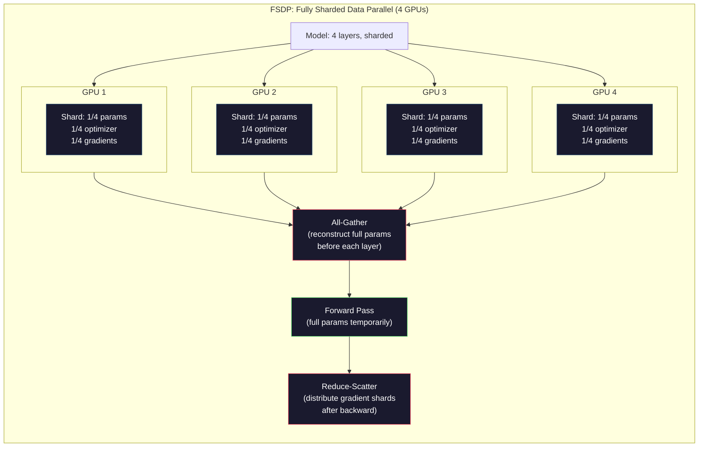

# Expansion: Distributed Training, FSDP, DeepSpeed

> Your 124M model is trained on a GPU. Now try 7 billion parameters. This model is not suitable for memory. It takes several weeks to collect data on one machine. Distributed training is not optional in terms of scale. This is the only way out.

**Type:** Build
**Languages:** Python
**Prerequisites:** Phase 10, Lesson 04 (Pre-Training a Mini GPT)
**Time:** ~120 minutes

## Learning objectives

- Explain the three types of parallelism (data, tensor, pipeline), and when each type of parallelism based on model and cluster size is necessary
- Implement parallel training of gradient synchronous data across multiple Gpus using PyTorch DDP
- Calculate the memory budget for the given model size (weight + optimizer state + gradient + activation) to determine the minimum hardware
- Configure the FSDP or DeepSpeed ZeRO phase to slice the model state across Gpus and be suitable for models with more than a single gpu memory

## This question

The 7B parameter model in FP16 requires 14GB just for weights. The Adam optimizer stores two additional copies of each parameter (the first and the second moment estimates). Another 28GB has been added. The gradient will increase by 14GB during backpropagation. Before storing a single activation, your storage space is 56GB.

The NVIDIA A100 has 80GB of memory.

It consumed 56GB of the 80GB. The remaining 24GB is for activation - the median value calculated during forward propagation must remain active for backpropagation. For a 2048-token sequence with a 4096-dimensional model, the activation of a single layer uses approximately 64MB. For 32 layers, each sample requires 2GB. A batch size of 8 requires 16GB. You have 24GB. A batch of twelve exploded.

Now try 70B parameters. Only weight: 140GB in FP16. Not suitable for a single GPU. You need at least two A100s (2 × 80GB = 160GB) to maintain the weight. To add optimizer states and gradients, you need more: at least 3+ Gpus, and in reality, 8-16 are required, depending on the sharding strategy.

Llama 3405b was trained on 16,384 NVIDIA H100 Gpus. This training cost approximately 100 million US dollars in computing expenses. DeepSeek V3 trained a similar model at a cost of approximately 5.6 million US dollars through a clever architecture (hybrid experts mean that only a small portion of parameters are activated for each token) and training efficiency.

This lesson covers four strategies that make large-scale training possible: data parallelism, tensor parallelism, pipeline parallelism, and fully sharded data parallelism. Before getting in touch with distributed training frameworks, you will simulate each framework in pure Python to understand its mechanism.

## This concept

### Why is it necessary to issue?

The following is the in-memory mathematics of the real model. Every number is calculated, not estimated.

| Model | Params | Weights (FP16) | Adam States | Gradients (FP16) | Total (no activations) |
|-------|--------|----------------|-------------|------------------|----------------------|
| GPT-2 Small | 124M | 248 MB | 992 MB | 248 MB | 1.5 GB |
| Llama 3 8B | 8B | 16 GB | 64 GB | 16 GB | 96 GB |
| Llama 3 70B | 70B | 140 GB | 560 GB | 140 GB | 840 GB |
| Llama 3 405B | 405B | 810 GB | 3,240 GB | 810 GB | 4,860 GB |

The "Adam's Kingdom" column is the real culprit. Adam stores the running mean (m) and running variance (v) for each parameter, both of which are in FP32. For model 70B, that is, 70B x 4 bytes x 2 = 560GB. The optimizer alone requires seven A100s.

A single H100 has 80GB. Llama 3405b requires at least 61 h100 to accommodate weights, optimizers and gradients. Adding activation will further increase this number. Meta used 16,384 Gpus not because they wanted to, but because they had to.

### Data parallelism

The simplest distributed strategy. Copy the entire model to N Gpus. Divide each training batch into N equal parts. Each GPU runs a forward and backward pass on its data shard. After passing backward, average the gradients of all Gpus. Each GPU uses the same average gradient to update its weighted replicas, keeping all replicas synchronized.

** Advantage: ** Linear throughput scalability. The amount of data processed by N Gpus at each step increases by N times. Communication is limited to gradient averaging, which overlaps with computation.

*Disadvantage: Each GPU has a complete copy of the model, optimizer state, and gradients. For the 70B model, each GPU requires 840GB. Data parallelism does not reduce the memory of each gpu. This will only reduce the training time.

*Effective batch size = per_gpu_batch_size x N. For N=64 Gpus, each gpu processes 16 batches, and the effective batch processing is 1024. The effective batch processing scale used in each step of Llama 3 is 16 million tokens.

"Mermaid"
Tu Daoming
Subgraph dataparliel[" Data parallelism (N=4 Gpus) "]
B[" Full Batch\n (1024 samples) "] - > S["Split"]
S -> G1["GPU 1\nFull Model Copy\n256 samples"]
S -> G2["GPU 2\nFull Model Copy\n256 samples"]
S -> G3["GPU 3\nFull Model Copy\n256 samples"]
S -> G4["GPU 4\nFull Model Copy\n256 samples"]
G1 -> AR["AllReduce\nAverage Gradients"]
G2 -> ar
G3——> ar
G4—> ar
AR - > U[" Update \n (same on all Gpus) "]
Over

    style B fill:#1a1a2e,stroke:#e94560,color:#fff
    style G1 fill:#1a1a2e,stroke:#0f3460,color:#fff
    style G2 fill:#1a1a2e,stroke:#0f3460,color:#fff
    style G3 fill:#1a1a2e,stroke:#0f3460,color:#fff
    style G4 fill:#1a1a2e,stroke:#0f3460,color:#fff
    style AR fill:#1a1a2e,stroke:#51cf66,color:#fff
    style U fill:#1a1a2e,stroke:#51cf66,color:#fff
```

### Tensor Parallelism

Split individual layers across GPUs. A single matrix multiplication is divided among GPUs, each computing part of the result.

Consider a weight matrix of shape (8192, 8192) in a feedforward layer. With 4-way tensor parallelism, each GPU holds a (8192, 2048) shard. Each GPU multiplies the input by its shard, producing a partial result. The partial results are combined (via all-reduce or all-gather) to produce the full output.

**The good:** Reduces per-GPU memory for model weights. A 70B model split across 8 GPUs means each GPU holds ~8.75B parameters worth of weights.

**The bad:** Requires fast inter-GPU communication after every layer. The all-reduce after each matmul adds latency. This works well with NVLink (900 GB/s between GPUs on the same node) but poorly across nodes connected by InfiniBand (400 Gb/s, about 50 GB/s). Tensor parallelism is almost always limited to within a single node (8 GPUs).

**Real usage:** Megatron-LM pioneered tensor parallelism. Llama 3 405B uses 8-way tensor parallelism within each node.

### Pipeline Parallelism

Split the model by layers. GPU 1 runs layers 1-8. GPU 2 runs layers 9-16. GPU 3 runs layers 17-24. GPU 4 runs layers 25-32. Data flows through the pipeline: GPU 1 computes its layers and sends activations to GPU 2, which computes its layers and sends to GPU 3, and so on.

**The good:** Minimal communication between GPUs -- just the activations at layer boundaries, which are small compared to gradients or weights. Works across nodes because bandwidth requirements are low.

**The bad:** Pipeline bubbles. When GPU 4 is computing the forward pass on micro-batch 1, GPUs 1, 2, and 3 are idle (they have already forwarded their portion). During backward pass, the pattern reverses. With naive pipelining, GPU utilization is only 1/N for N pipeline stages.

**GPipe and PipeDream** solve the bubble problem by splitting the batch into micro-batches. GPU 1 starts on micro-batch 2 as soon as it finishes forwarding micro-batch 1. This overlaps computation across pipeline stages. With M micro-batches and N stages, the bubble fraction drops to (N-1)/M. Use M=16 micro-batches with N=4 stages and the bubble is 3/16 = 18.75% idle time.

### FSDP: Fully Sharded Data Parallel

FSDP combines the scalability of data parallelism with the memory efficiency of sharding. Instead of each GPU holding a complete copy of the model, each GPU holds only 1/N of the parameters, gradients, and optimizer states.

Before a layer's forward pass, FSDP runs an **all-gather** to collect the full parameters from all GPUs into each GPU's memory. After the forward pass, each GPU discards the non-local parameters. During backward, the all-gather runs again to reconstruct parameters for gradient computation. After the backward pass, a **reduce-scatter** distributes gradient shards so each GPU only stores 1/N of the gradients.

**The math for a 70B model on 8 GPUs:**

| Component | Without FSDP | With FSDP |
|-----------|-------------|-----------|
| Weights (FP16) | 140 GB per GPU | 17.5 GB per GPU |
| Adam States (FP32) | 560 GB per GPU | 70 GB per GPU |
| Gradients (FP16) | 140 GB per GPU | 17.5 GB per GPU |
| **Total** | **840 GB per GPU** | **105 GB per GPU** |

Without FSDP, you cannot fit a 70B model on a single 80GB GPU. With FSDP on 8 GPUs, each GPU uses 105GB -- wait, that still does not fit. You need at least 16 GPUs to get under 80GB per GPU, or you combine FSDP with activation checkpointing (recompute activations during backward instead of storing them).

The communication cost is higher than vanilla data parallelism because of the all-gather before each layer. But the memory savings make previously impossible training runs possible.



### DeepSpeed Zero

DeepSpeed's ZeRO (Zero Redundancy Optimizer) is conceptually the same as FSDP, but it was independently developed by Microsoft. It defines three stages, each of which is more actively fragmented:

| Stage | Shards | Memory Savings | Communication |
|-------|--------|---------------|---------------|
| ZeRO-1 | Optimizer states only | ~4x reduction | Same as data parallel |
| ZeRO-2 | + Gradients | ~8x reduction | Slightly more |
| ZeRO-3 | + Parameters | ~Nx reduction (N GPUs) | All-gather per layer |

0-3 is equivalent to FSDP. The naming may vary, but the mechanism remains the same. After DeepSpeed proved this concept, PyTorch added FSDP as a native implementation.

DeepSpeed also introduced ZeRO-Offload (offloading the optimizer state to CPU RAM, which is cheaper and larger) and ZeRO-Infinity (offloading to NVMe ssd). These trade computing speed for memory capacity - the unloading operation is slower, but it frees up GPU memory.

### Hybrid precision training

Modern training uses multiple floating-point formats simultaneously:

- "Forward pass" :FP16 or BF16 (16 bits). It only has half the memory of FP32. The running speed of Matmuls on tensor kernels is twice as fast.
- ** Sovereign Weight **:FP32 (32-bit). The numerical accuracy is maintained by the optimizer during the weight update period.
- ** Loss scaling ** : Multiply the loss by a large constant before reverse passage to prevent the FP16 gradient flow from being zero. Divide by the same constant before the optimization step.

BF16 (Brain Float 16) has the same exponent range of FP32 (8 exponent bits), but with lower accuracy (7 mantissous bits vs. 23 of FP32). It rarely requires loss scaling because it can represent values within the same range. FP16 has 5 exponent bits and 10 mantissa bits - it can represent fine-grained values, but overflows/underflows at extreme magnitudes.

Google's tpu natively uses BF16. NVIDIA's A100 and H100 support both FP16 and BF16 simultaneously. The industry has largely shifted to BF16 as it eliminates the headache of loss scaling.

** Memory comparison of Model 7B: **

| Precision | Weights | Optimizer | Gradients | Total |
|-----------|---------|-----------|-----------|-------|
| FP32 everywhere | 28 GB | 56 GB | 28 GB | 112 GB |
| Mixed (BF16 + FP32 master) | 14 GB | 56 GB | 14 GB | 84 GB |

The hybrid accuracy has been saved by 28GB on this model. In any case, the optimizer state remains in FP32 - which is where most of the memory goes.

### Megatron - lm and 3D run in parallel

True large-scale training combines these three kinds of parallelism

- ** Data parallelism across node groups ** (Scale batch size)
- ** Tensor parallelism ** within a node (split into layers across 8 Gpus)
- Pipeline parallelism across nodes (splitting into layers and groups across machines)

Alpaca 3 405B on 16,384 h100:
- 8-way tensor parallelism within each node (8 Gpus per node)
- 16-way pipeline parallelism across nodes (16 pipeline phases)
- The parallelism of 128-channel data in the remaining dimensions (16,384/8/16 = 128)

How does this 3D decomposition (8 x 16 x 128 = 16,384) scale to thousands of Gpus? Each GPU sees a different data shard (data parallelism), holds a slice of each layer (tensor parallelism), and computes different layer sets (pipeline parallelism).

DeepSeek V3 adopts a different approach. Their hybrid expert architecture activates only 37B of the 671B parameters for each token. This means that each GPU only needs to calculate (and store the activation) activity parameters. They trained on 2,048 H800 Gpus - less than 1/8 of Meta's GPU count - at a cost of $5.6 million, while Meta's estimated cost was $100 million.

"Mermaid"
Tu Daoming
Subgraph ThreeD[" 3D parallelism (Llama 3405b) "]
Directional tuberculosis
Subgraph DP[" Data Parallelism (128 channels) \nSplit Batch processing spanning 128 groups "]
Subgraph PP[" Parallel Pipeline (16 paths) \ n Split layers Spanning 16 Stages "]
Subgraph TP[" Tensor parallelism (8-way) \ n splits each layer onto 8 Gpus "]
G1["GPU 1\nSlice of layers 1- n "]
G2["GPU 2\nSlice of layers 1-N"]
G8["GPU 8\nSlice of layers 1-N"]
Over
Over
Over
Over

N1["Total: 8 x 16 x 128 = 16,384个gpu "]

Style G1: Fill: #1a1a2e, Stroke: #0f3460, Color: #fff
Style G2: Fill: #1a1a2e, Stroke: #0f3460, Color: #fff
Style: G8, Fill: #1a1a2e, Stroke: #0f3460, Color: #fff
Style N1, Fill: #1a1a2e, Stroke: #e94560, Color: #fff
```

## Build It

### Step 1: Simulate Data Parallelism

Split a batch across simulated GPUs. Each GPU computes a forward pass on its shard. Average the "gradients" (we simulate them as the loss values).

```python
import numpy as np

def simulate_data_parallelism(data, num_gpus, model_fn):
    batch_size = len(data)
    shard_size = batch_size // num_gpus
    remainder = batch_size % num_gpus

    gpu_losses = []
    gpu_gradients = []

    offset = 0
    for gpu_id in range(num_gpus):
        extra = 1 if gpu_id < remainder else 0
        shard = data[offset:offset + shard_size + extra]
        offset += shard_size + extra

        loss, grad = model_fn(shard)
        gpu_losses.append(loss)
        gpu_gradients.append(grad)

    avg_loss = np.mean(gpu_losses)
    avg_gradient = np.mean(gpu_gradients, axis=0)

    return avg_loss, avg_gradient
```

The total reduction operation (average gradient) is the only communication in data parallelism. In practice, this uses the NCCL library on NVIDIA Gpus, which implements ring all-reduce: each GPU sends the 1/N of its gradient to its neighbor, receives 1/N from another neighbor, and after N-1 steps, each GPU has a complete average value. Total communication volume: 2x gradient_size x (N-1)/ N. When N is large, it is close to twice the size of the gradient.

### Step 2: Simulate tensor parallelism

Segment the weight matrix on the gpu. Each GPU computes a partial matrix multiplication. Combine the results.

”“python
Def simulate_tensor_parallelism(input_data, weight_matrix, num_gpu)：
D_in, d_out = weight_matrix.shape
为断言d_out num_gpu = f = 0,“d_out d_out}不能被num_gpu num_gpu}整除”
Shard_size = d_out // num_gpu

Partial_results = []
get_gpu_id (gpu)：
Start = gpu_id * shard_size
End = start + shard_size
Weight_shard = weight_matrix[:, start:end]

Part = input_data@weight_shard
partial_results.append(Partial)

Full_output = np. Connection (partial_results axis = 1)

Direct_output = input_data @ weight_matrix
= np。Abs (full_output - direct_output).max（）

Return full_output, error
```

The error should be exactly zero (or machine epsilon). Tensor parallelism is mathematically exact -- it produces the same result as computing the full matmul on one GPU. The split is along the output dimension, so each GPU produces a different chunk of columns, and concatenation reconstructs the full result.

For column-parallel linear layers (splitting the output dimension), you concatenate. For row-parallel (splitting the input dimension), you sum. In a transformer FFN, the first linear (expand) uses column-parallel and the second linear (contract) uses row-parallel. This avoids an all-reduce between the two layers.

### Step 3: Simulate Pipeline Parallelism

Split a model's layers across virtual GPUs. Show the bubble problem where early stages sit idle while later stages compute.

```python
def simulate_pipeline_parallelism(num_layers, num_stages, num_microbatches):
    layers_per_stage = num_layers // num_stages

    timeline = {}
    clock = 0

    for mb in range(num_microbatches):
        for stage in range(num_stages):
            start_time = max(
                timeline.get((stage, mb - 1, "fwd"), (0, 0))[1] if mb > 0 else 0,
                timeline.get((stage - 1, mb, "fwd"), (0, 0))[1] if stage > 0 else 0,
            )
            end_time = start_time + layers_per_stage
            timeline[(stage, mb, "fwd")] = (start_time, end_time)

    last_fwd_end = max(v[1] for v in timeline.values())

    for mb in range(num_microbatches - 1, -1, -1):
        for stage in range(num_stages - 1, -1, -1):
            deps = [last_fwd_end]
            if mb < num_microbatches - 1 and (stage, mb + 1, "bwd") in timeline:
                deps.append(timeline[(stage, mb + 1, "bwd")][1])
            if stage < num_stages - 1 and (stage + 1, mb, "bwd") in timeline:
                deps.append(timeline[(stage + 1, mb, "bwd")][1])
            start_time = max(deps)
            end_time = start_time + layers_per_stage
            timeline[(stage, mb, "bwd")] = (start_time, end_time)

    total_time = max(v[1] for v in timeline.values())
    compute_time = num_microbatches * num_stages * layers_per_stage * 2
    bubble_fraction = 1.0 - compute_time / (total_time * num_stages)

    return timeline, total_time, bubble_fraction
```

With 4 stages and 1 micro-batch processing, the bubble score is 75% - at any time, 3 out of 4 Gpus are idle. If there are 16 micro-batches, it will drop to around 19%. The cost of eliminating bubbles is memory: you must store the activation of all the micro-batches in flight simultaneously.

### Step 4: Memory calculator

Calculate the exact memory requirements for training any model size.

”“python
def memory_calculator (
params_billions,
precision_bytes = 2,
Optimizer = "Adam"
num_gpus = 1,
Sharding = "None"
sequence_length = 2048,
batch_size_per_gpu = 1,
hidden_dim = None
num_layers = None
"
Params = params_ billions * 1e9

Weight_memory = params * precision_bytes

优化器== "adam"：
Optimizer_memory = params * 4 * 2
Elif optimizer == "sgd"：
Optimizer_memory = params * 4
其他:
Optimizer_memory = 0

Gradient_memory = params * precision_bytes

Total_no_activation = weight_memory + optimizer_memory + gradient_memory

隐藏层数：
Activation_per_layer = (
4所示。Sequence_length * batch_size_per_gpu * hidden_dim * precision_bytes *
）
Activation_memory = activation_per_layer * num_layers
其他:
Activation_memory = params * precision_bytes * 0.5

如果sharding == "fsdp“或sharding == ”zero3"：
Weight_memory /= num_gpu
Optimizer_memory /= num_gpu
Gradient_memory /= num_gpu
Elif分片== "zero2"：
Optimizer_memory /= num_gpu
Gradient_memory /= num_gpu
Elif分片== "zero1"：
Optimizer_memory /= num_gpu

Per_gpu_total = weight_memory + optimizer_memory + gradient_memory + activation_memory

返回{
“params_billions”:params_billions,
“ weights_gb ”： weight_memory / 1e9，
“ optimizer_gb ”： optimizer_memory / 1e9，
“ gradients_gb ”： gradient_memory / 1e9，
“ activations_gb ”： activation_memory / 1e9，
“ per_gpu_total_gb ”： per_gpu_total / 1e9，
“ total_across_gpus_gb ”： per_gpu_total * num_gpu / 1e9，
“ fits_on_80gb ”： per_gpu_total / 1e9 <= 80，
“num_gpus”:num_gpus,
“分片”:切分,
｝
```

This calculator answers the question every ML engineer asks: "How many GPUs do I need?" Feed it the model size and see whether it fits. Adjust sharding strategy until the per-GPU total drops below 80GB.

### Step 5: Mixed Precision Simulation

Compare memory usage between FP32, FP16, and mixed precision training.

```python
def mixed_precision_comparison(params_billions):
    params = params_billions * 1e9

    fp32_weights = params * 4
    fp32_optimizer = params * 4 * 2
    fp32_gradients = params * 4
    fp32_total = fp32_weights + fp32_optimizer + fp32_gradients

    fp16_weights = params * 2
    fp16_master = params * 4
    fp16_optimizer = params * 4 * 2
    fp16_gradients = params * 2
    fp16_total = fp16_weights + fp16_master + fp16_optimizer + fp16_gradients

    mixed_weights = params * 2
    mixed_optimizer = params * 4 * 2
    mixed_gradients = params * 2
    mixed_total = mixed_weights + mixed_optimizer + mixed_gradients

    return {
        "fp32_total_gb": fp32_total / 1e9,
        "fp16_with_master_gb": fp16_total / 1e9,
        "mixed_bf16_gb": mixed_total / 1e9,
        "savings_vs_fp32": 1 - mixed_total / fp32_total,
    }
```

For most people, the biggest surprise is that the mixed precision does not halve the memory. Regardless of the precision, the optimizer states (Adam's m and v) remain in FP32. For model 7B, FP32 training uses 112GB. The mixed precision uses 84GB. This is a 25% reduction, not a 50% one. The optimizer is dominant.

## Use it

### Run all simulations

”“python
Def run_all_demos ()：
Print （"=" * 70）
print（“DATA PARALLELISM SIMULATION”）
Print （"=" * 70）

np.random.seed (42)
Data = np.random. randn(64,32)
Weight = np.random. randn(32 years old,16

def model_fn(Batch):
Output = Batch @ weight
Loss = np. Average value (output ** 2
Grad = 2 * batch. T@ (batch@weight)/len (batch)
Repay the loss and graduate

对于n_gpu在[1,2,4,8]：
Loss, grad = simulate_data_parallelism（data, n_gpu, model_fn）
Print (f " {n_gpu} gpu: loss={loss：。“ 4f}, grad_norm = {np.linalg.norm(4 . f)} ”)

print ()
Print ("=" * 70)
print (" Parallel Tensor Simulation ")
Print ("=" * 70)

X = np.random。randn (8192)
W = np.random。randn(8192、8192)

对于n_gpu在[1,2,4,8]：
，error = simulate_tensor_parallelism（x， W, n_gpu）
Print （f" {n_gpu} gpu: output_shape={{{}}）},max_error ={。2 e}”)

print ()
Print （"=" * 70）
print（“PIPELINE PARALLELISM SIMULATION”）
Print （"=" * 70）

For n_mb in [1,4,8,16,32]：
_, total_t, bubble = simulate_pipeline_parallelism（32,4, n_mb）
Print （f" {n_mb:2d} micro-batches: total_time={total_t:4d}, bubble={bubble: 0.1%}"）

print ()
Print ("=" * 70)
Print (" Memory Calculator"
Print ("=" * 70)

configs = [
(7, "None", 1)
(7, "fsdp", 8)
(70, "None", 1)
(70, "fsdp", 8)
(70, "fsdp", 16)
(405, "fsdp", 64)
(405, "fsdp", 128)
aluminum

Print (f "{8}" model ": > {" shard" : > 8} {the gpu: > 5} {" Per - gpu ": > 10} {for 80 gb: > 10}")
Print (+ - * 50)
For the parameters in the configuration, sharding, gpu:
Result = memory_calculator (params, num_gpu =gpu, sharding=shard)
fits = "Yes" if result["fits_on_80gb"] else “No”
Print (f "{B parameters: > 6} {8} fragments: > {gpu: > 5} {the results (" per_gpu_total_gb") : > 8.1 f} GB {10} is suitable for: > ")

print ()
Print ("=" * 70)
print (" Mixed Precision Comparison ")
Print ("=" * 70)

For params_b in [7,13,70,405]：
{{{}} = mixed_precision_comparison（params_b）
打印(f“{params_b} B: FP32 = {[' fp32_total_gb ']:结果。0 f} GB。”
f " font =宋体= {[' mixed_bf16_gb ']: font =宋体。0 f} GB。”
f " ={{savings_vs_fp32 "): 0.0%} ")
```

## Ship It

This lesson produces `outputs/prompt-distributed-training-planner.md` -- a prompt that takes a model size and available hardware, then produces a complete distributed training plan: parallelism strategy, memory budget, communication overhead, and expected throughput.

## Exercises

1. Modify the memory calculator to include activation checkpointing. With checkpointing, only store activations at every K-th layer (typical K=1, meaning recompute all). Show the memory-compute tradeoff: how much memory does checkpointing save, and how much does it slow down training (roughly 33% more compute for full checkpointing)?

2. Extend the pipeline parallelism simulation to implement the 1F1B (one forward, one backward) schedule used by PipeDream. Compare the bubble fraction against the naive schedule for 4 stages and 8 micro-batches. The 1F1B schedule should have a smaller peak memory because it starts backward passes earlier.

3. Implement a gradient accumulation simulator. Instead of all-reducing after every micro-batch, accumulate gradients locally for K steps, then all-reduce. Show how this reduces communication by K times but produces identical final gradients (and thus identical training).

4. Build a cost estimator. Given a model size, target token count, GPU type (A100 at $2/hr, H100 at $3.50/hr), and parallelism strategy, estimate the total training cost in dollars. Validate against known costs: Llama 3 405B reportedly cost ~$100M, DeepSeek V3 cost ~$5.6M.

5. Add ZeRO-Offload to the memory calculator. Assume CPU RAM is 512GB per node and NVMe is 2TB. Show how offloading optimizer states to CPU allows a 70B model to train on 4 GPUs instead of 16, at the cost of 30-50% slower optimizer steps.

## Key Terms

| Term | What people say | What it actually means |
|------|----------------|----------------------|
| Data parallelism | "Copy the model to every GPU" | Each GPU processes a different data shard; gradients are averaged via all-reduce after each step |
| Tensor parallelism | "Split a layer across GPUs" | Partition weight matrices so each GPU computes part of the matmul; requires fast NVLink interconnect |
| Pipeline parallelism | "Split layers across GPUs" | Each GPU runs a different group of layers; data flows through the pipeline with micro-batches to reduce bubbles |
| FSDP | "Shard everything" | Fully Sharded Data Parallel -- each GPU holds 1/N of weights, gradients, and optimizer states; all-gather before compute |
| ZeRO | "DeepSpeed's version of FSDP" | Zero Redundancy Optimizer with 3 stages: shard optimizer (Stage 1), + gradients (Stage 2), + parameters (Stage 3) |
| All-reduce | "Average across GPUs" | Collective operation where every GPU ends with the sum (or average) of all GPUs' inputs -- typically implemented as ring all-reduce |
| All-gather | "Collect from all GPUs" | Collective operation where every GPU ends with the concatenation of all GPUs' data -- used in FSDP to reconstruct full parameters |
| Reduce-scatter | "Sum and distribute" | Collective operation that reduces (sums) data and scatters different chunks to different GPUs -- used in FSDP for gradient sharding |
| Mixed precision | "Train in half precision" | Use FP16/BF16 for forward/backward and FP32 for optimizer states -- saves ~25% memory, not 50%, because the optimizer dominates |
| Pipeline bubble | "Idle time in the pipeline" | Fraction of time GPUs sit idle waiting for data from the previous stage -- reduced by using more micro-batches |

## Further Reading

- [Rajbhandari et al., 2020 -- "ZeRO: Memory Optimizations Toward Training Trillion Parameter Models"](https://arxiv.org/abs/1910.02054) -- the DeepSpeed ZeRO paper that defined the three sharding stages
- [Shoeybi et al., 2020 -- "Megatron-LM: Training Multi-Billion Parameter Language Models Using Model Parallelism"](https://arxiv.org/abs/1909.08053) -- NVIDIA's tensor parallelism for transformers
- [Narayanan et al., 2021 -- "Efficient Large-Scale Language Model Training on GPU Clusters Using Megatron-LM"](https://arxiv.org/abs/2104.04473) -- 3D parallelism combining data, tensor, and pipeline
- [Zhao et al., 2023 -- "PyTorch FSDP: Experiences on Scaling Fully Sharded Data Parallel"](https://arxiv.org/abs/2304.11277) -- PyTorch's native FSDP implementation
- [Llama 3 Technical Report](https://arxiv.org/abs/2407.21783) -- 16,384 GPU training with 3D parallelism details
- [DeepSeek-V3 Technical Report](https://arxiv.org/abs/2412.19437) -- how MoE architecture reduces training cost by an order of magnitude