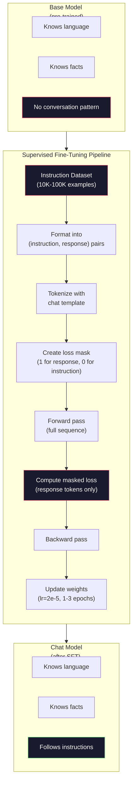

# Instruction Tuning (SFT

> The basic model predicts the next token. That's it. It does not follow instructions, does not answer questions, and does not reject harmful requests. SFT serves as a bridge between symbolic predictors and useful assistants. Every model you've met - Claude, GPT, Rama Chatter - has gone through this step.

**Type:** Build
**Languages:** Python (with numpy)
**Prerequisites:** Phase 10, Lesson 04 (Pre-Training a Mini GPT)
**Time:** ~90 minutes

## Learning objectives

- Implement supervised fine-tuning (SFT) to convert basic language models into instruction-following assistants
- Format the training data using chat templates with system, user, and assistant roles, and mask the loss on non-assistant tokens
- Explain why SFT is necessary: The basic model continues text rather than answers questions
- The quality of SFT is evaluated by comparing the responses of the basic model and the fine-tuned model on the reserved instruction set

## This question

You trained a model in Lesson 04. It can predict the next marker of a given sequence. Enter "Converter Architecture", and it might continue to say, "It has completely transformed natural language processing." This is impressive for the next token predictor.

Now try this: Feed it "What is the capital of France?" A basic model would not answer "Paris". It continues this pattern. It might ask, "What is the capital of Germany?" What is the capital of Spain? Because it learns from files that contain a list of questions. Or it might lead to "This is a question that many people ask", because this is a reasonable continuation of the next token. This model has no concept of "response". It only knows "continue".

This is the gap between GPT-3 (the base model, released in June 2020) and ChatGPT (Instruction Tuning, released in November 2022). The same architecture. The same training. The difference is between 20,000 and 100,000 pairs of carefully designed (instruction, response) pairs, which teach the model to follow the dialogue pattern.

Stanford alpacas prove that you don't need millions of examples. In March 2023, they fine-tuned the Alpaca 7B on 52,000 instruction response pairs generated by GPT-3.5. Total cost: 600 US dollars. The result is a chatbot that can follow instructions, answer questions and engage in conversations. It's not as good as ChatGPT, but it's very close to $600 and a few hours of training.

Meta's Llama 2 Chat used only approximately 27,000 high-quality examples in the initial SFT stage. The key point is that quality is more important than quantity. 27,000 examples written by skilled annotators beat the one million noisy examples crawled from the Internet.

## This concept

### What exactly has SFT done

Supervised fine-tuning continues the same training cycle from pre-training - passing forward, calculating losses, passing backward, and updating weights - but on different types of data. What you train is not the original text but structured dialogue:

' ' ' json
{
"System" : "You are such a helpful assistant."
user: "What is the capital of France?"
Assistant: "The capital of France is Paris."
}
```

The model already knows that Paris is the capital of France. It learned this during pre-training on Wikipedia, textbooks, and web pages. SFT doesn't teach the model new facts. It teaches the model a new *behavior*: when you see a question, produce an answer. When you see an instruction, produce a completion. When you see a harmful request, produce a refusal.

Think of it this way. Pre-training gives the model knowledge. SFT gives the model manners.

### Data Formats

Three formats dominate the industry. Each encodes the same information -- who said what -- with different delimiters.

**Alpaca Format** (Stanford, March 2023):

```json
{
  "instruction": "Summarize the following article in 3 sentences.",
  "input": "The European Central Bank raised interest rates...",
  "output": "The ECB increased rates by 25 basis points..."
}
```

Simple and widely applied. The Stanford University released 52,000 examples in this format, generated by GPT-3.5, at a price of $600. This initiated the open-source instruction tuning movement.

**ShareGPT format ** (Community, 2023)

' ' ' json
{
"Dialogue" :
{"from": "system", "value": "You are a helpful assistant.
{"from": "human", "value": “What cause tides?” }
The tides are caused by the gravitational pull of the moon... }
{"from": "human", "value ":" How often do they appear? }
Most coastal areas experience two high tides and two low tides every day... "from": "gpt", "value ":" }
]
}
```

Supports multi-turn conversations. The "from" field uses "human" and "gpt" by convention, regardless of the actual model. Vicuna was trained on 70,000 ShareGPT conversations scraped from user-shared ChatGPT transcripts.

**ChatML Format** (OpenAI, used by many open-source models):

```
System
You are a helpful assistant
User
Where is the capital of France? < | im_end | >
Assistant
The capital of France is Paris. <|im_end|>
```

Uses special tokens (`<|im_start|>`, `<|im_end|>`) to delimit roles. These tokens are added to the tokenizer's vocabulary during fine-tuning. Qwen, Yi, and many other models use ChatML.

All three formats accomplish the same thing: they tell the model "this is the instruction, this is the response, learn this pattern."

### Why It Works

The model already knows language from pre-training. It has seen billions of examples of questions followed by answers, instructions followed by completions, and conversations between people. The patterns are already encoded in the weights.

SFT concentrates this latent ability. Instead of the model needing to figure out from context whether it should answer a question or continue a document, SFT explicitly trains on the conversation pattern. After a few thousand examples, the model learns: when you see the assistant role marker, produce a helpful response.

This is why 27,000 examples is enough. You're not teaching the model English. You're not teaching it facts about the world. You're teaching it one simple behavior: respond to instructions. The knowledge was already there.

### The Masked Loss

This is the most important technical detail in SFT, and most tutorials skip it.

During pre-training, you compute loss on every token. The model learns to predict every next token in the sequence. During SFT, you only compute loss on the *response* tokens. The instruction tokens are there for context, but the model is not penalized for "predicting" them incorrectly.

Why? Because you don't want the model to learn to *generate* instructions. You want it to learn to *respond to* instructions. If you compute loss on the instruction tokens, you're training the model to predict "What is the capital of France?" as if it's the one asking the question. That wastes gradient signal and can confuse the model about its role.

In practice, you create a loss mask: 1 for response tokens, 0 for instruction tokens. Multiply the per-token loss by this mask before averaging.

```
Token: [SYS] You are very helpful. [USER] What is the capital letter? Paris is the capital.
Loss mask: 0 0 0 0 0 0 0 0 0 1 1 1 1 1 1 1
```

Only the tokens after `[ASST]` contribute to the loss. The model sees the full conversation during the forward pass (it needs the instruction to produce the right response) but only updates its weights based on how well it predicted the response.

### Training Hyperparameters

SFT uses dramatically different hyperparameters than pre-training. You're not training from scratch. You're adjusting a model that already works.

| Parameter | Pre-Training (Llama 2 7B) | SFT (Llama 2 Chat) |
|-----------|---------------------------|---------------------|
| Learning rate | 3e-4 (peak) | 2e-5 |
| Epochs | 1 (single pass over data) | 2 |
| Batch size | 4M tokens | 64 examples |
| Warmup steps | 2,000 | 0-100 |
| Weight decay | 0.1 | 0.0-0.1 |
| Data size | 2T tokens | 27,000 examples |

The learning rate is 15x lower for SFT. This is critical. A high learning rate during fine-tuning destroys the pre-trained knowledge. The model "forgets" what it learned and overfits to the small fine-tuning dataset. This is catastrophic forgetting.

Two epochs means the model sees each training example twice. More than 3 epochs on a small dataset leads to memorization -- the model starts reproducing training examples verbatim instead of generalizing.

### Catastrophic Forgetting

Fine-tuning can destroy general capabilities. Train too long on instruction-following data and the model loses its ability to write code, do math, or produce creative text. It becomes very good at the specific format of its training data and terrible at everything else.

Three mitigations:

1. **Low learning rate.** 1e-5 to 5e-5. Smaller updates mean less destruction of pre-trained features.

2. **Short training.** 1-3 epochs. Stop before the model overfits.

3. **Mix in pre-training data.** Llama 2 Chat mixed a small percentage (2-5%) of raw pre-training data into the SFT dataset. This "reminds" the model of its general capabilities while learning the new instruction-following behavior.

### Real Numbers

Fine-tuning a 7B model on 10,000 high-quality instruction pairs takes approximately 1 hour on a single NVIDIA A100 80GB GPU. Here's the math:

- 10,000 examples x 512 tokens average = 5.12M tokens
- 2 epochs = 10.24M tokens total
- A100 throughput for 7B model fine-tuning: ~3,000 tokens/second
- 10.24M / 3,000 = ~3,400 seconds = ~57 minutes

For our mini GPT (4 layers, 128 dims), training is nearly instant. The point is understanding the mechanics, not the scale.



## Build it

### Step 1: Instruction dataset

Create a synthetic instruction dataset. In production, companies such as Scale AI and Anthropic hire human annotators to write these annotations. We will create them programmatically to demonstrate the format.

”“python
Import numpy as np

Instruction_data = [
{
"Instruction" : "Where is the capital of France?"
Answer: "The capital of France is Paris."
}
{
"Instruction" : "Explain gravity in one sentence."
"Reaction" : "Gravity is the force that attracts objects with mass to each other." "
}
{
"Instruction" : "Write a haiku about the ocean."
"Response" : "The waves crash against the shore, salt and foam in the sunlight, an endless expanse of blue."
}
{
"Instruction" : "What is 15 multiplied by 7?"
"response" : "15 multiplied by 7 equals 105."
}
{
"Instruction" : "Say three programming languages." "
The three programming languages are Python, Rust and TypeScript.
}
{
"Explanation" : "Summarize photosynthesis." "
"Reaction" : Photosynthesis converts sunlight, water and carbon dioxide into glucose and oxygen.
}
{
"Instruction" : "When did World War II end?"
Response: "World War II ended in 1945."
}
{
"Instruction" : "Define machine learning."
"Response" : "Machine learning is a field where algorithms learn patterns from data to make predictions."
}
]
```

Eight examples is tiny. Stanford Alpaca used 52,000. But the mechanics are identical whether you have 8 or 52,000: tokenize, mask, compute loss on responses only.

### Step 2: Tokenize with Chat Template

Convert instruction-response pairs into token sequences with special role markers. The markers tell the model where the instruction ends and where the response begins.

```python
SPECIAL_TOKENS = {
    "INST_START": 253,
    "INST_END": 254,
    "RESP_START": 255,
}


def tokenize_instruction_pair(instruction, response, vocab_size=256):
    inst_tokens = list(instruction.encode("utf-8"))
    resp_tokens = list(response.encode("utf-8"))

    inst_tokens = [min(t, vocab_size - 4) for t in inst_tokens]
    resp_tokens = [min(t, vocab_size - 4) for t in resp_tokens]

    tokens = (
        [SPECIAL_TOKENS["INST_START"]]
        + inst_tokens
        + [SPECIAL_TOKENS["INST_END"]]
        + [SPECIAL_TOKENS["RESP_START"]]
        + resp_tokens
    )

    return tokens


def create_loss_mask(tokens):
    mask = np.zeros(len(tokens), dtype=np.float32)
    in_response = False

    for i, token in enumerate(tokens):
        if token == SPECIAL_TOKENS["RESP_START"]:
            in_response = True
            continue
        if in_response:
            mask[i] = 1.0

    return mask
```

The lost mask is all zeros for the instruction token and all 1s for the response token. The

### Step 3: Mask the cross-entropy loss

Standard cross-entropy, but multiplied by the loss mask. Only the response token contributes to the gradient.

”“python
（logits, targets, loss_mask）
Batch, seq_len, vocab_size = logits.shape
Logits_flat = logits。(1)
Targets_flat =目标。塑造(1)
Mask_flat = loss_mask。塑造(1)

Max_logits = logits_flat。max(轴= 1,keepdims = True)
Log_softmax = logits_flat - max_logits - np.log(
np。Exp (logits_flat - max_logits)。sum(轴= 1,keepdims = True)
）

Per_token_loss = -log_softmax

    masked_loss = per_token_loss * mask_flat
    num_response_tokens = mask_flat.sum()
    if num_response_tokens == 0:
        return 0.0
    loss = masked_loss.sum() / num_response_tokens

Return loss
```

The denominator is `num_response_tokens`, not `seq_len`. If you divide by the total sequence length, longer instructions dilute the gradient signal. Dividing by response token count ensures equal weight per response token regardless of instruction length.

### Step 4: SFT Training Loop

Reuse the MiniGPT from Lesson 04. The training loop looks almost identical to pre-training, but with instruction formatting and masked loss.

```python
import sys
import os
sys.path.insert(0, os.path.join(os.path.dirname(__file__), "..", "..", "04-pre-training-mini-gpt", "code"))
from main import MiniGPT, LayerNorm, FeedForward, MultiHeadAttention, TransformerBlock, Embedding


def sft_train(model, dataset, num_epochs=2, lr=2e-5, seq_len=64):
    formatted_data = []
    for example in dataset:
        tokens = tokenize_instruction_pair(example["instruction"], example["response"])
        mask = create_loss_mask(tokens)
        formatted_data.append((tokens, mask))

    print(f"SFT Training: {len(formatted_data)} examples, {num_epochs} epochs, lr={lr}")
    print(f"Total tokens: {sum(len(t) for t, _ in formatted_data):,}")
    print()

    losses = []

    for epoch in range(num_epochs):
        epoch_loss = 0.0
        num_batches = 0

        indices = np.random.permutation(len(formatted_data))

        for idx in indices:
            tokens, mask = formatted_data[idx]

            if len(tokens) < 3:
                continue
            if len(tokens) > seq_len:
                tokens = tokens[:seq_len]
                mask = mask[:seq_len]

            input_ids = np.array(tokens[:-1]).reshape(1, -1)
            target_ids = np.array(tokens[1:]).reshape(1, -1)
            loss_mask = np.array(mask[1:]).reshape(1, -1)

            logits = model.forward(input_ids)
            loss = masked_cross_entropy_loss(logits, target_ids, loss_mask)

            batch_size, s_len, v_size = logits.shape
            probs = np.exp(logits - logits.max(axis=-1, keepdims=True))
            probs = probs / probs.sum(axis=-1, keepdims=True)
            dlogits = probs.copy()
            dlogits[np.arange(batch_size)[:, None], np.arange(s_len), target_ids] -= 1.0

            mask_expanded = loss_mask[:, :, np.newaxis]
            num_resp = loss_mask.sum()
            if num_resp > 0:
                dlogits = dlogits * mask_expanded / num_resp

            for block in model.blocks:
                block.ffn.W1 -= lr * np.random.randn(*block.ffn.W1.shape) * 0.01
                block.ffn.W2 -= lr * np.random.randn(*block.ffn.W2.shape) * 0.01
                block.ffn.b1 -= lr * np.random.randn(*block.ffn.b1.shape) * 0.01
                block.ffn.b2 -= lr * np.random.randn(*block.ffn.b2.shape) * 0.01

            epoch_loss += loss
            num_batches += 1
            losses.append(loss)

        avg_loss = epoch_loss / max(num_batches, 1)
        print(f"Epoch {epoch + 1}/{num_epochs} | Avg Loss: {avg_loss:.4f}")

    return model, losses
```

The learning rate is 25-5, matching the chatting of Alpaca 2. Compare it with the 3e-4 used in the pre-training - 15 times smaller. The gradient is masked: the instruction token generates a zero gradient. Only the response token pushes the weight.

### Step 5: Compare the basic model with the SFT model

The entire significance of SFT lies in behavioral change. Let's measure it by examining how the model responds to input in instruction format and the continuation of the original text.

”“python
Def generate_response(model, prompt_tokens, max_new_token =50, temperature=0.8)：
Token = list（prompt_token）
Seq_len = model。嵌入.pos_embed.shape [0]

For _in range(max_new_tokens) :
Context = np.array (tokens[-seq_len:]). Reshaping (1,1
Logits = model.forward (context)
Next_logits = logits[0, -1,:]

        next_logits = next_logits / max(temperature, 1e-8)
        probs = np.exp(next_logits - next_logits.max())
        probs = probs / probs.sum()
        probs = np.clip(probs, 1e-10, 1.0)
        probs = probs / probs.sum()

Next_token = np.random. Select (len(polyaluminium chloride),p = polyaluminium chloride)
tokens.append (int (next_token))

Return tag


Def evaluate_instruction_following(model, instructions) :
print (" The following is the evaluation instruction ")
Print ("-" * 50)

For instructions within instructions:
Token = (
[SPECIAL_TOKENS [" INST_START "]]
            + [min(t, 252) for t in list(instruction.encode("utf-8"))]
            + [special_tokens [" inst_end "]]
            + [special_tokens [" resp_start "]]
）

generate_response（model, token, max_new_token =30, temperature=0.6）
Response_start = len（tokens）
Response_tokens = output[response_start:]
Response_bytes = bytes（[t for t in response_tokens if t < 128]）
Response_text = response_bytes.decode（"utf-8", errors="replace"）

print（f" Q:{袖标}"）
print（f" A: {response_text[:80]}"）
print ()
```

On a tiny model with 8 examples, the responses won't be meaningful. That's expected. The important thing is the *structure*: the model learns to produce output after the response marker instead of continuing to generate more instructions.

### Step 6: Measure Catastrophic Forgetting

Compare the model's next-token prediction ability before and after SFT. If SFT damages general capabilities, the loss on raw text will increase.

```python
def measure_forgetting(model, test_text, seq_len=64):
    tokens = np.array(list(test_text.encode("utf-8")[:512]))

    total_loss = 0.0
    num_windows = 0

    for start in range(0, len(tokens) - seq_len - 1, seq_len):
        input_ids = tokens[start:start + seq_len].reshape(1, -1)
        target_ids = tokens[start + 1:start + seq_len + 1].reshape(1, -1)

        logits = model.forward(input_ids)

        batch, s_len, vocab_size = logits.shape
        logits_flat = logits.reshape(-1, vocab_size)
        targets_flat = target_ids.reshape(-1)

        max_logits = logits_flat.max(axis=-1, keepdims=True)
        log_softmax = logits_flat - max_logits - np.log(
            np.exp(logits_flat - max_logits).sum(axis=-1, keepdims=True)
        )

        loss = -log_softmax[np.arange(len(targets_flat)), targets_flat].mean()
        total_loss += loss
        num_windows += 1

    return total_loss / max(num_windows, 1)
```

In true fine-tuning, you will track this metric throughout the entire training process. If the loss of the original text increases by more than 10-15%, it indicates that your SFT is too aggressive. Reduce the learning rate or decrease the number of epochs.

## Use it

### A complete demonstration of the SFT pipeline

”“python
If __name__ == "__main__" :
np.random.seed (42)

test_text = "" The converter architecture handles sequences through self-focus.
Each layer applies multi-head attention, followed by a feedforward network.
Residual connections and layer normalization stabilize deep networks.
This model learns to predict the next label given all previous labels.

Print ("=" * 70)
print (" Instruction Tuning (SFT) Demonstration ")
Print ("=" * 70)
print ()

model = MiniGPT(
Vocab_size =256, embed_dim=128, num_heads=4
Num_layers =4, max_seq_len=128, ff_dim=512
)
Print (f "model :{model. count_parameters():} parameters ")
Print (f "Configuration: 4 layers, 4 heads, 128 dark (Mini GPT from Lesson 04)")
print ()

Printing (" PRE-SFT: Measuring Basic Model Loss on Original Text ")
Base_loss = measure_forgetting (model, test_text)
print (f "Basic model loss: {base_loss:.4f}")
print ()

Print （"=" * 70）
打印（SFT）
Print （"=" * 70）

，loss = sft_train(
model, INSTRUCTION_DATA, num_epochs=3, lr=2e-5, seq_len=128
）

print ()
print (" POST-SFT: Measuring Fine-tuning Model Loss on Original Text ")
Sft_loss = measure_forgetting (model, test_text)
print (f" SFT model loss: {sft_loss:.4f}")
Print (f "change: {((sft_loss - base_loss)/base_loss * 100) : +. 1 f} %")
If abs(sft_loss - base_loss)/base_loss < 0.15:
Print (" Minimum forgetting (< 15% change) ")
Others
Print (" Significant forgetting detected ")
print ()

Print ("=" * 70)
Print (" Calculated instructions"
Print ("=" * 70)
print ()

Test_instructions = [
Where is the capital of France?
"Name a programming language."
"Define gravity." "
]
test_instructions evaluate_instruction_following(Model)

Print ("=" * 70)
Print (" Data Format Example"
Print ("=" * 70)
print ()

01, enumerate（INSTRUCTION_DATA[:3]）
Tokens = tokenize_instruction_pair（example["instruction"], example["response"]）
Mask = create_loss_mask（token）
Resp_count = int（mask.sum()）
Total_count = len（token）
Print （f " " {i + 1}: {total_count} token, {resp_count} "）。f”)。0}的序列)"
print（f" Instruction: {example[' Instruction ']}"）
print（f" Response: {example[' Response ']}"）
print ()

Print ("=" * 70)
Print (" Training Loss Curve"
Print ("=" * 70)
print ()

If there is a loss
Window = max (1, len(losses) // 5)
For I in range(0, len(losses), window) :
Chunk = losses[i:i + window]
Avg = sum(chunk)/len (chunk)
Print (f "step {I: 3 d} - {I + len (block) - 1:3 d} : avg losses = {avg: 4 f}")
```

## Ship It

This lesson produces `outputs/prompt-sft-data-curator.md` -- a prompt that helps you design and curate instruction datasets for SFT. Given a target capability (code generation, math, conversation), it produces a data collection plan with format specifications, quality criteria, and diversity requirements.

## Exercises

1. Add system prompt support. Modify `tokenize_instruction_pair` to accept a system message and prepend it before the instruction. Create 5 examples with different system prompts ("You are a poet", "You are a math tutor") and verify the model sees different system prompts during training.

2. Implement data mixing. Create a function that takes an SFT dataset and a raw text corpus, then produces training batches where 5% of examples are raw text (no masking) and 95% are instruction pairs (masked). Run 3 epochs and compare forgetting metrics against pure SFT training.

3. Build a data quality scorer. For each instruction-response pair, compute: (a) response length in tokens, (b) instruction-to-response ratio, (c) vocabulary diversity (unique tokens / total tokens). Filter out examples with response length < 10 tokens or diversity < 0.3. Show how filtering affects the final loss.

4. Implement multi-turn conversation training. Extend the tokenization to handle 3-turn conversations (user-assistant-user-assistant-user-assistant). The loss mask should cover all three assistant turns. Verify the mask is correct by printing the token-mask alignment for one example.

5. Compare learning rates. Train the same model three times with lr=1e-4, lr=2e-5, and lr=1e-6. Plot the loss curves. The 1e-4 run should show rapid initial descent but higher final loss (overfitting). The 1e-6 run should barely move. The 2e-5 run should be the sweet spot.

## Key Terms

| Term | What people say | What it actually means |
|------|----------------|----------------------|
| SFT | "Fine-tuning on conversations" | Supervised Fine-Tuning: continuing training on (instruction, response) pairs with loss computed only on response tokens |
| Instruction tuning | "Teaching the model to follow instructions" | Training on explicit instruction-response pairs so the base model learns the conversation pattern, not new knowledge |
| Loss masking | "Ignoring the prompt" | Setting loss to zero for instruction tokens so gradients only flow from response token predictions |
| ChatML | "Chat Markup Language" | A token format using `<\|im_start\|>` and `<\|im_end\|>` delimiters to mark speaker roles in conversation data |
| Alpaca format | "Stanford's format" | A JSON format with instruction/input/output fields, used for 52K GPT-3.5-generated examples that cost $600 |
| Catastrophic forgetting | "The model gets dumber" | Fine-tuning destroys pre-trained capabilities because gradient updates overwrite general knowledge with task-specific patterns |
| Weight tying | "Shared embeddings" | Using the same matrix for input token embeddings and output prediction head, saving parameters and improving coherence |
| Chat template | "How you format the prompt" | The specific token sequence (role markers, delimiters) that structures a conversation for the model |

## Further Reading

- [Ouyang et al., 2022 -- "Training language models to follow instructions with human feedback" (InstructGPT)](https://arxiv.org/abs/2203.02155) -- the paper that introduced instruction tuning + RLHF at OpenAI
- [Taori et al., 2023 -- "Stanford Alpaca: An Instruction-following LLaMA Model"](https://github.com/tatsu-lab/stanford_alpaca) -- 52K instruction examples for $600, proving SFT works on small datasets
- [Touvron et al., 2023 -- "Llama 2: Open Foundation and Fine-Tuned Chat Models"](https://arxiv.org/abs/2307.09288) -- Meta's SFT + RLHF pipeline with 27K high-quality examples
- [Chiang et al., 2023 -- "Vicuna: An Open-Source Chatbot Impressing GPT-4"](https://lmsys.org/blog/2023-03-30-vicuna/) -- training on 70K ShareGPT conversations
- [Zhou et al., 2023 -- "LIMA: Less Is More for Alignment"](https://arxiv.org/abs/2305.11206) -- proving that 1,000 carefully curated examples can match SFT on much larger datasets